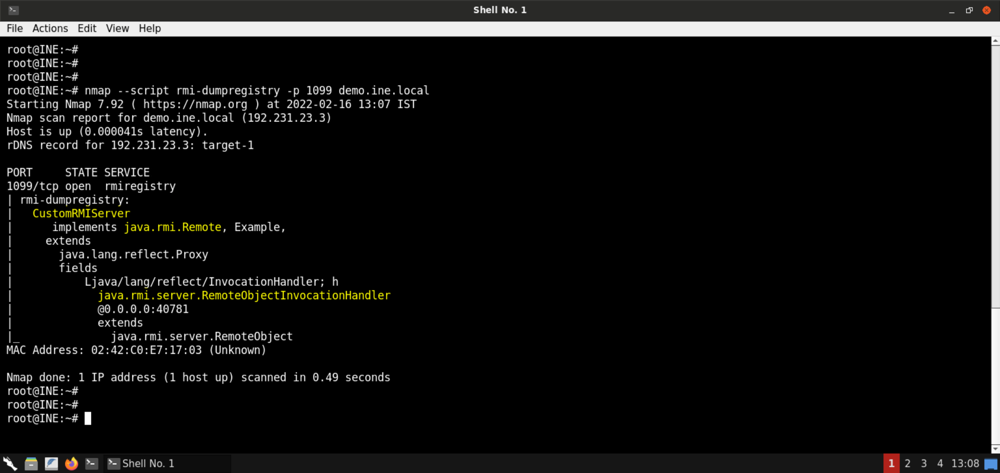

# 1090 Pentesting Java RMI

The Java Remote Method Invocation (RMI) system allows an object running in one Java virtual machine to invoke methods on an object running in another Java virtual machine. RMI provides for remote communication between programs written in the Java programming language.

A Java RMI registry is a simplified name service that allows clients to get a reference (a stub) to a remote object.

When developers want to make their Java objects available within the network, they usually bind them to an RMI registry. The registry stores all information required to connect to the object (IP address, listening port, implemented class or interface and the ObjID value) and makes it available under a human readable name (the bound name). Clients that want to consume the RMI service ask the RMI registry for the corresponding bound name and the registry returns all required information to connect. Thus, the situation is basically the same as with an ordinary DNS service.

## Enumeration

```
# Dump information from the RMI registry.
nmap --script rmi-dumpregistry -p 1099 <target>
```

In this example, the name bound to the RMI server is **CustomRMIServer**. It implements the `java.rmi.Remote` interface, as you would have expected. That is how one can invoke methods on the server remotely.



[remote-method-guesser](https://github.com/qtc-de/remote-method-guesser) is a _Java RMI_ vulnerability scanner that is capable of identifying common _RMI vulnerabilities_ automatically. Whenever you identify an _RMI_ endpoint, you should give it a try:

```
rmg enum $ip 9010
```