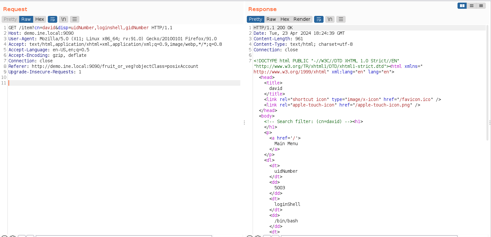
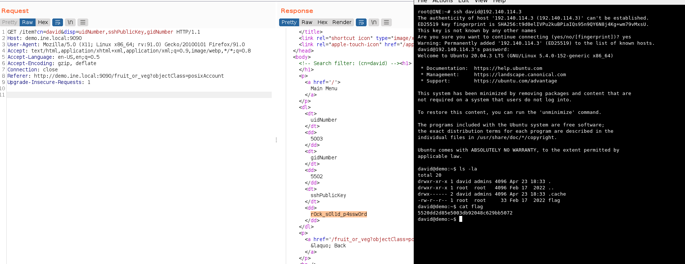
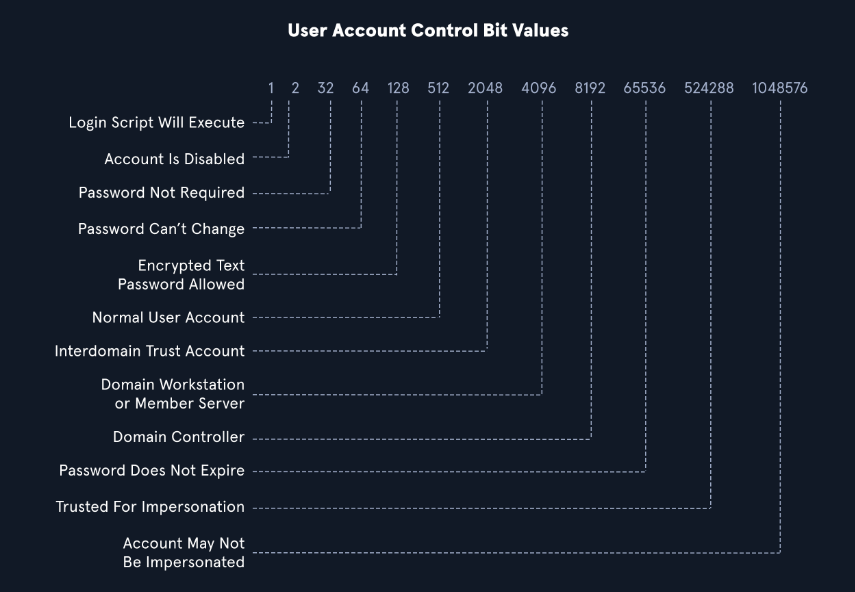

# 389 -  636 LDAP

>Application protocol used for accessing, modifying and querying distributed directory information services (such as Active Directory) over a TCP/Internet Protocol (IP) network.
>A Directory service would be a database-like virtual storage that holds data in a specific hierarchical structure. LDAP structure is based on a tree of directory entries.

Lightweight Directory Access Protocol (LDAP) is an integral part of Active Directory (AD). The **Lightweight Directory Access Protocol** (**LDAP**) is an open, vendor-neutral, industry standard application protocol for accessing and maintaining distributed directory information services over a TCP/IP Internet Protocol (IP) network.

LDAP runs on port 389 (unencrypted connections) and 636 (LDAP SSL.)

The relationship between AD and LDAP can be compared to Apache and HTTP. The same way Apache is a web server that uses the HTTP protocol, Active Directory is a directory server that uses the LDAP protocol. While uncommon, you may come across organizations while performing an assessment that does not have AD but does have LDAP, meaning that they most likely use another type of LDAP server such as OpenLDAP.

- TCP and UDP port 389 and 636.
- It's a binary protocol and by default not encrypted.
- Has been updated to include encryptions addons, as Transport Layer Security (TLS)/SSL (LDAPS), and can be tunnelled through SSH

The hierarchy (tree) of information stored via LDAP is known as the **Directory Information Tree (DIT).** That structure is defined in a schema.

A common use of LDAP is to provide a central place to store usernames and passwords. This allows many different applications and services to connect to the LDAP server to validate users.

The latest LDAP specification is Version 3, which is published as [RFC 4511](https://tools.ietf.org/html/rfc4511). **AD** stores user account information and security information such as passwords and facilitates sharing this information with other devices on the network. **LDAP** is the language that applications use to communicate with other servers that also provide directory services. In other words, LDAP is a way that systems in the network environment can "speak" to AD.


There are two popular implementations of LDAP: `OpenLDAP`, an open-source software widely used and supported, and `Microsoft Active Directory`, a Windows-based implementation that seamlessly integrates with other Microsoft products and services.

**How it works in a nugshell:** LDAP uses a client-server model, where clients send requests to servers using LDAP messages encoded in ASN.1 (Abstract Syntax Notation One) and transmitted over TCP/IP (Transmission Control Protocol/Internet Protocol). The servers process the requests and send back responses using the same format. LDAP supports various requests, such as `bind`, `unbind`, `search`, `compare`, `add`, `delete`, `modify`, etc.

## AD LDAP Authentication

LDAP is set up to authenticate credentials against AD using a "BIND" operation to set the authentication state for an LDAP session. There are two types of LDAP authentication.

**1.**  **Simple Authentication:** This includes anonymous authentication, unauthenticated authentication, and username/password authentication. Simple authentication means that a username and password create a BIND request to authenticate to the LDAP server.
    
**2.**  **SASL Authentication:** The Simple Authentication and Security Layer (SASL) framework uses other authentication services, such as Kerberos, to bind to the LDAP server and then uses this authentication service (Kerberos in this example) to authenticate to LDAP. The LDAP server uses the LDAP protocol to send an LDAP message to the authorization service which initiates a series of challenge/response messages resulting in either successful or unsuccessful authentication. SASL can provide further security due to the separation of authentication methods from application protocols. 

LDAP authentication messages are sent in cleartext by default so anyone can sniff out LDAP messages on the internal network. It is recommended to use TLS encryption or similar to safeguard this information in transit.


## LDIF file

Example of a LDIF file:

```
dn: dc=example,dc=com
objectclass: top
objectclass: domain
dc: example

dn: ou=People, dc=example,dc=com
objectclass: top
objectclass: organizationalunit
ou: People
aci: (targetattr="*||+")(version 3.0; acl "IDM Access"; allow (all)
  userdn="ldap:///uid=idm,ou=Administrators,dc=example,dc=com";)

dn: uid=jgibbs, ou=People, dc=example,dc=com
uid: jgibbs
cn: Joshamee Gibbs
sn: Gibbs
givenname: Joshamee
objectclass: top
objectclass: person
objectclass: organizationalPerson
objectclass: inetOrgPerson
l: Caribbean
mail: jgibbs@blackpearl.com
telephonenumber: +1 408 555 1234
facsimiletelephonenumber: +1 408 555 4321
userpassword: supersecret

dn: uid=hbarbossa, ou=People, dc=example,dc=com
uid: hbarbossa
cn: Hector Barbossa
sn: Barbossa
givenname: Hector
objectclass: top
objectclass: person
objectclass: organizationalPerson
objectclass: inetOrgPerson
l: Caribbean
o: Brethren Court
mail: captain.barbossa@example.com
telephonenumber: +421 910 382734
facsimiletelephonenumber: +1 408 555 1111
roomnumber: 111
userpassword: deadjack

# Note:
# Lord Bectett is an exception to the cn = givenName + sn rule

dn: uid=jbeckett, ou=People, dc=example,dc=com
uid: jbeckett
cn: Lord Cutler Beckett
sn: Beckett
givenname: Cutler
objectclass: top
objectclass: person
objectclass: organizationalPerson
objectclass: inetOrgPerson
l: Caribbean
o: East India Trading Co.
mail: bigboss@eitc.com
telephonenumber: +421 910 382333
facsimiletelephonenumber: +1 408 555 2222
roomnumber: 666
userpassword: takeovertheworld

dn: ou=Groups, dc=example,dc=com
objectclass: top
objectclass: organizationalunit
ou: Groups
aci: (targetattr="*||+")(version 3.0; acl "IDM Access"; allow (all)
  userdn="ldap:///uid=idm,ou=Administrators,dc=example,dc=com";)

dn: cn=Pirates,ou=groups,dc=example,dc=com
objectclass: top
objectclass: groupOfUniqueNames
cn: Pirates
ou: groups
uniquemember: uid=jgibbs, ou=People, dc=example,dc=com
uniquemember: uid=barbossa, ou=People, dc=example,dc=com
description: Arrrrr!

dn: ou=Administrators, dc=example,dc=com
objectclass: top
objectclass: organizationalunit
ou: Administrators

dn: uid=idm, ou=Administrators,dc=example,dc=com
objectclass: top
objectclass: person
objectclass: organizationalPerson
objectclass: inetOrgPerson
uid: idm
cn: IDM Administrator
sn: IDM Administrator
description: Special LDAP acccount used by the IDM
  to access the LDAP data.
ou: Administrators
userPassword: secret
ds-privilege-name: unindexed-search

```

Ldap operators:

| Operator | Description                        |
| -------- | ---------------------------------- |
| =        | Equal to                           |
| \|       | Logical OR                         |
| !        | Logical NOT                        |
| &        | Logical AND                        |
| *        | Wildcard, any strings or character |

Example: any surname starting by "a" or canonical name starting by "b."

```
(|(sn=a*)(cn=b*))
```


## LDAP queries: LDAPFilter

By combining the  "Get-ADObject" cmdlet  with the "LDAPFilter" parameter in powershell we can perform some ldap queries via powershell. 

```ps
Get-ADObject -LDAPFilter <FILTER> | select cn
```

Some useful  LDAPFilters:

| Search for                 | LDAP query                                                                      |     |
| -------------------------- | ------------------------------------------------------------------------------- | --- |
| Find All Workstations      | ' (objectCategory=computer)'                                                    |     |
| Find All DomainControllers | '(&(objectCategory=Computer)(userAccountControl:1.2.840.113556.1.4.803:=8192))' |     |

| Search for                  | LDAP query                                       |     |
| --------------------------- | ------------------------------------------------ | --- |
| Find All Users              | ' (&(objectCategory=person)(objectClass=user))'  |     |
| Filnd All Contacts          | '(objectClass=contact)'                          |     |
| Find All Users and Contacts | '(objectClass=user)'                             |     |
| List Disabled Users         | '(userAccountControl:1.2.840.113556.1.4.803:=2)' |     |


| Search for                              | LDAP query                                     |     |
| --------------------------------------- | ---------------------------------------------- | --- |
| Find All Groups                         | '(objectClass=group)'                          |     |
| Find direct members of a Security Group | '(memberOf=CN=Admin,OU=Security,DC=DOM,DC=NT)' |     |


More:

- [LDAP Queries related to AD computers](https://ldapwiki.com/wiki/Wiki.jsp?page=Active%20Directory%20Computer%20Related%20LDAP%20Query)
- [LDAP queries related to AD users](https://ldapwiki.com/wiki/Wiki.jsp?page=Active%20Directory%20User%20Related%20Searches).
- [LDAP queries related to AD groups](https://ldapwiki.com/wiki/Wiki.jsp?page=Active%20Directory%20Group%20Related%20Searches).


### ldapsearch

For example, `ldapsearch` is a command-line utility used to search for information stored in a directory using the LDAP protocol. It is commonly used to query and retrieve data from an LDAP directory service.

```bash
ib2
-H ldap://ldap.example.com:389 -D "cn=admin,dc=example,dc=com" -w secret123 -b "ou=people,dc=example,dc=com" "(mail=john.doe@example.com)"

```

This command can be broken down as follows:

- Connect to the server `ldap.example.com` on port `389`.
- Bind (authenticate) as `cn=admin,dc=example,dc=com` with password `secret123`.
- Search under the base DN `ou=people,dc=example,dc=com`.
- Use the filter `(mail=john.doe@example.com)` to find entries that have this email address.

The server would process the request and send back a response, which might look something like this:

```ldap
dn: uid=jdoe,ou=people,dc=example,dc=com
objectClass: inetOrgPerson
objectClass: organizationalPerson
objectClass: person
objectClass: top
cn: John Doe
sn: Doe
uid: jdoe
mail: john.doe@example.com
```

This response includes the entry's `distinguished name (DN)` that matches the search criteria and its attributes and values.


## LDAP queries: Search Filters

The LDAPFilter parameter with the same cmdlets lets us use LDAP search filters when searching for information. 

Operators: 

- & -> and
- | -> or
- ! -> not


**AND** Operation:

-   One criteria: `(& (..C1..) (..C2..))`
-   More than two criteria: `(& (..C1..) (..C2..) (..C3..))`

**OR** Operation:

-   One criteria: `(| (..C1..) (..C2..))`
-   More than two criteria: `(| (..C1..) (..C2..) (..C3..))`


### Filters

| **Criteria**      | **Rule**           | **Example**                             |     |
| ----------------- | ------------------ | --------------------------------------- | --- |
| Equal to          | (attribute=123)    | (&(objectclass=user)(displayName=Smith) |     |
| Not equal to      | (!(attribute=123)) | !objectClass=group)                     |     |
| Present           | (attribute=*)      | (department=*)                          |     |
| Not present       | (!(attribute=*))   | (!homeDirectory=*)                      |     |
| Greater than      | (attribute>=123)   | (maxStorage=100000)                     |     |
| Less than         | (attribute<=123)   | (maxStorage<=100000)                    |     |
| Approximate match | (attribute~=123)   | (sAMAccountName~=Jason)                 |     |
| Wildcards         | (attribute=*A)     | (givenName=*Sam)                        |     |

## Exploiting vuLnDAP

https://github.com/digininja/vuLnDAP

All schema for querying is in [https://tldp.org/HOWTO/archived/LDAP-Implementation-HOWTO/schemas.html](https://tldp.org/HOWTO/archived/LDAP-Implementation-HOWTO/schemas.html)

Examples:







### Example

When using [dsquery](dsquery.md):

```powershell
# Searching for Domain Controllers
 dsquery * -filter "(userAccountControl:1.2.840.113556.1.4.803:=8192)" -limit 5 -attr sAMAccountName
# userAccountControl:1.2.840.113556.1.4.803: Specifies that we are looking at the User Account Control (UAC) attributes for an object. This portion can change to include three different values we will explain below when searching for information in AD (also known as Object Identifiers (OIDs).
# =8192 represents the decimal bitmask we want to match in this search. This decimal number corresponds to a corresponding UAC Attribute flag that determines if an attribute like password is not required or account is locked is set. 

```

>`userAccountControl:1.2.840.113556.1.4.803:` Specifies that we are looking at the [User Account Control (UAC) attributes](https://docs.microsoft.com/en-us/troubleshoot/windows-server/identity/useraccountcontrol-manipulate-account-properties) for an object.
>
>	- `userAccountControl:1.2.840.113556.1.4.803:` Specifies that we are looking at the [User Account Control (UAC) attributes](https://docs.microsoft.com/en-us/troubleshoot/windows-server/identity/useraccountcontrol-manipulate-account-properties) for an object.
>	- `=8192` represents the decimal bitmask we want to match in this search.
>
>OIDs are rules used to match bit values with attributes, as seen above. For LDAP and AD, there are three main matching rules:
>
>1. `1.2.840.113556.1.4.803`
>When using this rule as we did in the example above, we are saying the bit value must match completely to meet the search requirements. Great for matching a singular attribute.
>
>2. `1.2.840.113556.1.4.804`
>When using this rule, we are saying that we want our results to show any attribute match if any bit in the chain matches. This works in the case of an object having multiple attributes set.
>
>3. `1.2.840.113556.1.4.1941`
>This rule is used to match filters that apply to the Distinguished Name of an object and will search through all ownership and membership entries.


Search users with UAC set to `Password Can't Change`:

```powershell
dsquery * -filter "(&(objectClass=user)(userAccountControl:1.2.840.113556.1.4.803:=64))"
```

## LDAP Injection

`LDAP injection` is an attack that `exploits web applications that use LDAP` (Lightweight Directory Access Protocol) for authentication or storing user information. The attacker can `inject malicious code` or `characters` into LDAP queries to alter the application's behaviour, `bypass security measures`, and `access sensitive data` stored in the LDAP directory.

LDAP injection attacks are `similar to SQL injection attacks` but target the LDAP directory service instead of a database.

For example, suppose an application uses the following LDAP query to authenticate users:

```php
(&(objectClass=user)(sAMAccountName=$username)(userPassword=$password))
```

In this query, `$username` and `$password` contain the user's login credentials. An attacker could inject the `*` character into the `$username` or `$password` field to modify the LDAP query and bypass authentication.


```php
$username = "*";
$password = "dummy";
(&(objectClass=user)(sAMAccountName=$username)(userPassword=$password))
```

Alternatively, if an attacker injects the `*` character into the `$password` field, the LDAP query would match any user account with any password that contains the injected string. This would allow the attacker to gain access to the application with any username, as shown below:

```php
$username = "dummy";
$password = "*";
(&(objectClass=user)(sAMAccountName=$username)(userPassword=$password))
```

### Enumeration

```bash
nmap -p- -sC -sV --open --min-rate=1000 10.129.204.229
```
