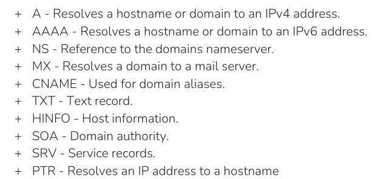

# Port 53 - Domain Name Server (DNS) 

Globally distributed DNS servers translate domain names into IP addresses and thus control which server a user can reach via a particular domain. There are several types of DNS servers that are used worldwide:

| **Server Type**                | **Description**                                                                                                                                                                                                                                                               |
| ------------------------------ | ----------------------------------------------------------------------------------------------------------------------------------------------------------------------------------------------------------------------------------------------------------------------------- |
| `DNS Root Server`              | Root servers of DNS are responsible for the top-level domains (`TLD`). As the last instance, they are only requested if the name server does not respond. The `ICANN` coordinates the work of the root name servers. There are 13 such root servers around the globe.         |
| `Authoritative Nameserver`     | Authoritative name servers hold authority for a particular zone. They only answer queries from their area of responsibility, and their information is binding. If an authoritative name server cannot answer a client's query, the root name server takes over at that point. |
| `Non-authoritative Nameserver` | Non-authoritative name servers are not responsible for a particular DNS zone. Instead, they collect information on specific DNS zones themselves, which is done using recursive or iterative DNS querying.                                                                    |
| `Caching DNS Server`           | Caching DNS servers cache information from other name servers for a specified period. The authoritative name server determines the duration of this storage.                                                                                                                  |
| `Forwarding Server`            | Forwarding servers perform only one function: they forward DNS queries to another DNS server.                                                                                                                                                                                 |
| `Resolver`                     | Resolvers are not authoritative DNS servers but perform name resolution locally in the computer or router.                                                                                                                                                                    |


## Resource records

A resource record is a four-tuple that contains the following 4 fields:

```
(Name, Value, Type, TTL)
```


The "`IN`" in the examples stands for "Internet." It's a class field in DNS records that specifies the protocol family. In most cases, you'll see "`IN`" used, as it denotes the Internet protocol suite (IP) used for most domain names. Other class values exist (e.g., `CH` for Chaosnet, `HS` for Hesiod) but are rarely used in modern DNS configurations.

| Record Type | Full Name                 | Description                                                                                                                                                                                                                                                                                                                                                                                                                                                                                                                                                                                                                                                                                 | Zone File Example                                                                              |
| ----------- | ------------------------- | ------------------------------------------------------------------------------------------------------------------------------------------------------------------------------------------------------------------------------------------------------------------------------------------------------------------------------------------------------------------------------------------------------------------------------------------------------------------------------------------------------------------------------------------------------------------------------------------------------------------------------------------------------------------------------------------- | ---------------------------------------------------------------------------------------------- |
| `A`         | Address Record            | Maps a hostname to its IPv4 address. If Type=A, then Name is a hostname and Value is the IP address for that name. We recognize the IP addresses that point to a specific (sub)domain through the A record.  Example: <br>`(relay1.bar.example.com, 145.222.36.125, A)`<br>                                                                                                                                                                                                                                                                                                                                                                                                                 | `www.example.com.` IN A `192.0.2.1`                                                            |
| `AAAA`      | IPv6 Address Record       | Maps a hostname to its IPv6 address.                                                                                                                                                                                                                                                                                                                                                                                                                                                                                                                                                                                                                                                        | `www.example.com.` IN AAAA `2001:db8:85a3::8a2e:370:7334`                                      |
| `CNAME`     | Canonical Name Record     | Creates an alias for a hostname, pointing it to another hostname. If Type=CNAME, then Value is a canonical hostname for the alias hostname Name. Example:<br>`(example.com,relay1.bar.example.com,CNAME)`                                                                                                                                                                                                                                                                                                                                                                                                                                                                                   | `blog.example.com.` IN CNAME `webserver.example.net.`                                          |
| `MX`        | Mail Exchange Record      | Specifies the mail server(s) responsible for handling email for the domain. If Type=MX, then Value is the canonical name of a mail server that has an alias hostname Name. The mail server records show us which mail server is responsible for managing the emails for the company. Example:<br>`(example.com,mail.bar.example.com,MX)`<br>                                                                                                                                                                                                                                                                                                                                                | `example.com.` IN MX 10 `mail.example.com.`                                                    |
| `NS`        | Name Server Record        | Delegates a DNS zone to a specific authoritative name server. If Type=NS, then Name is a domain (such as example.com) and Value is the name of an authoritative DNS server that knows how to obtain the IP address for hosts in the domain. These kinds of records show which name servers are used to resolve the FQDN to IP addresses. Most hosting providers use their own name servers, making it easier to identify the hosting provider. Example:<br>`(example.com,dns.example.com,NS)`<br>                                                                                                                                                                                           | `example.com.` IN NS `ns1.example.com.`                                                        |
| `TXT`       | Text Record               | Stores arbitrary text information, often used for domain verification or security policies. This type of record often contains verification keys for different third-party providers and other security aspects of DNS, such as SPF, DMARC, and DKIM, which are responsible for verifying and confirming the origin of the emails sent. Here we can already see some valuable information if we look closer at the results.                                                                                                                                                                                                                                                                 | `example.com.` IN TXT `"v=spf1 mx -all"` (SPF record)                                          |
| `SOA`       | Start of Authority Record | Specifies administrative information about a DNS zone, including the primary name server, responsible person's email, and other parameters. (`Start Of Authority` (`SOA`)). It should be first in a zone file because it indicates the start of a zone. Each zone can only have one `SOA` record, and additionally, it contains the zone's values, such as a serial number and multiple expiration timeouts. Provides information about the corresponding DNS zone and email address of the administrative contact. The `SOA` record is located in a domain's zone file and specifies who is responsible for the operation of the domain and how DNS information for the domain is managed. | `example.com.` IN SOA `ns1.example.com. admin.example.com. 2024060301 10800 3600 604800 86400` |
| `SRV`       | Service Record            | Defines the hostname and port number for specific services.                                                                                                                                                                                                                                                                                                                                                                                                                                                                                                                                                                                                                                 | `_sip._udp.example.com.` IN SRV 10 5 5060 `sipserver.example.com.`                             |
| `PTR`       | Pointer Record            | Used for reverse DNS lookups, mapping an IP address to a hostname. The PTR (Pointer) record works the other way around (reverse lookup). It converts IP addresses into valid domain names. For the IP address to be resolved from the `Fully Qualified Domain Name` (`FQDN`), the DNS server must have a reverse lookup file. In this file, the computer name (FQDN) is assigned to the last octet of an IP address, which corresponds to the respective host, using a `PTR` record. The PTR records are responsible for the reverse translation of IP addresses into names.                                                                                                                | `1.2.0.192.in-addr.arpa.` IN PTR `www.example.com.`                                            |


Summarizing:




## Security 

DNS is mainly unencrypted. Devices on the local WLAN and Internet providers can therefore hack in and spy on DNS queries. Since this poses a privacy risk, there are now some solutions for DNS encryption. By default, IT security professionals apply DNS over TLS (DoT) or DNS over HTTPS (DoH) here. In addition, the network protocol NSCrypt also encrypts the traffic between the computer and the name server.

## IPs to add to etc/resolv.conf

1.1.1.1 is **a public DNS resolver operated by Cloudflare that offers a fast and private way to browse the Internet**. Unlike most DNS resolvers, 1.1.1.1 does not sell user data to advertisers. In addition, 1.1.1.1 has been measured to be the fastest DNS resolver available.

[See DNS enumeration](information-gathering.md)


## DNS transfer zones

[See dig axfr](dig.md). 

## DNS server

There are many different configuration types for DNS.  All DNS servers work with three different types of configuration files:

1. local DNS configuration files
2. zone files
3. reverse name resolution files

The DNS server [Bind9](https://www.isc.org/bind/) is very often used on Linux-based distributions. Its local configuration file (`named.conf`) is roughly divided into two sections, firstly the options section for general settings and secondly the zone entries for the individual domains. The local configuration files are usually:

- `/etc/bind/named.conf.local`
- `/etc/bind/named.conf.options`
- `/etc/bind/named.conf.log`

In the file `/etc/bind/named.conf.local`  we can define the different zones. A `zone file` is a text file that describes a DNS zone with the BIND file format. In other words it is a point of delegation in the DNS tree. The BIND file format is the industry-preferred zone file format and is now well established in DNS server software. A zone file describes a zone completely. There must be precisely one `SOA` record and at least one `NS` record. The SOA resource record is usually located at the beginning of a zone file. The main goal of these global rules is to improve the readability of zone files. A syntax error usually results in the entire zone file being considered unusable. The name server behaves similarly as if this zone did not exist. It responds to DNS queries with a `SERVFAIL` error message.

DNS misconfigurations and vulnerabilities.

|**Option**|**Description**|
|---|---|
|`allow-query`|Defines which hosts are allowed to send requests to the DNS server.|
|`allow-recursion`|Defines which hosts are allowed to send recursive requests to the DNS server.|
|`allow-transfer`|Defines which hosts are allowed to receive zone transfers from the DNS server.|
|`zone-statistics`|Collects statistical data of zones.|

A list of vulnerabilities targeting the BIND9 server can be found at [CVEdetails](https://www.cvedetails.com/product/144/ISC-Bind.html?vendor_id=64). In addition, SecurityTrails provides a short [list](https://securitytrails.com/blog/most-popular-types-dns-attacks) of the most popular attacks on DNS servers.


## Footprinting DNS

**nmap**

```shell-session
nmap -p53 -Pn -sV -sC $ip
```

See [nslookup](nslookup.md).

```bash
# Query `A` records by submitting a domain name: default behaviour
nslookup $TARGET

# We can use the `-query` parameter to search specific resource records
# Querying: A Records for a Subdomain
nslookup -query=A $TARGET

# Querying: PTR Records for an IP Address
nslookup -query=PTR 31.13.92.36

# Querying: ANY Existing Records
nslookup -query=ANY $TARGET

# Querying: TXT Records
nslookup -query=TXT $TARGET

# Querying: MX Records
nslookup -query=MX $TARGET

#  Specify a nameserver if needed by adding `@<nameserver/IP>` to the command
```


See [dig](dig.md).

```bash
# Dig Version Query
dig CH TXT version.bind $ip

# View all available records
dig any example.com @$ip
 # here, $ip refers to ip of DNS server. The more recent RFC8482 specified that `ANY` DNS requests be abolished. Therefore, we may not receive a response to our `ANY` request from the DNS server. Basically, not all entries from the zones will be shown.

# Querying: A Records for a Subdomain
 dig a www.example @$ip
 # here, $ip refers to ip of DNS server

# Get email of administrator of the domain
dig soa www.example.com
# The email will contain a (.) dot notation instead of @

# ENUMERATION
# List nameservers known for that domain
 ns 
# -ns: other name servers are known in NS record
#  `@` character specifies the DNS server we want to query.
# here, $ip refers to ip of DNS server

# Display version. query a DNS server's version using a class CHAOS query and type TXT. However, this entry must exist on the DNS server.
dig CH TXT version.bind $ip

# Querying: PTR Records for an IP Address
dig -x $ip @1.1.1.1

# Querying: TXT Records
dig txt example.com @$ip

# Querying: MX Records
dig mx example.com @1.1.1.1
```

Transfer a zone ([more on dig axfr](dig.md))

```shell-session
dig axfr example.htb @$ip
```

If the administrator used a subnet for the `allow-transfer` option for testing purposes or as a workaround solution or set it to `any`, everyone would query the entire zone file at the DNS server.

Another tools for transferring zones:

[Fierce](fierce.md):

```
# Perform a dns transfer using a wordlist againts domain.com
fierce -dns domain.com 

# Enumerate all DNS servers of the root domain and scan for a DNS zone transfer:
fierce --domain zonetransfer.me
```

[dnsenum](dnsenum.md):

```
dnsenum domain.com
# additionally it performs DNS brute force with /usr/share/dnsenum/dns.txt.
```


## Subdomain brute enumeration

### **Bash** command Using Sec wordlist

```shell-session
for sub in $(cat /opt/useful/SecLists/Discovery/DNS/subdomains-top1million-110000.txt);do dig $sub.example.com @$ip | grep -v ';\|SOA' | sed -r '/^\s*$/d' | grep $sub | tee -a subdomains.txt;done
```

### **dnsenum**

[dnsenum](dnsenum.md)

```shell-session
 dnsenum --dnsserver $ip --enum -p 0 -s 0 -o subdomains.txt -f /opt/useful/SecLists/Discovery/DNS/subdomains-top1million-110000.txt inlanefreight.htb

```

## Tools for passive enumeration

| Tool + Cheat sheet                          | What it does                                                                                                                                                                                                                                    |
| ------------------------------------------- | ----------------------------------------------------------------------------------------------------------------------------------------------------------------------------------------------------------------------------------------------- |
| [Google dorks](google-dorks.md)             | Google hacking, also named Google dorking, is a hacker technique that uses Google Search and other Google applications to find security holes in the configuration and computer code that websites are using.                                   |
| [Sublist3r](sublist3r.md)                   | Sublist3r enumerates subdomains using many search engines such as Google, Yahoo, Bing, Baidu and Ask. Sublist3r also enumerates subdomains using Netcraft, Virustotal, ThreatCrowd, DNSdumpster and ReverseDNS.                                 |
| [crt.sh](ctr.md)                            | It collects information about SSL certificates. If you visit a domain and it contains a certificate you can extract other subdomain by using the View Certificate functionality.                                                                |
| [dnscan](dnscan.md)                         | Python wordlist-based DNS subdomain scanner.                                                                                                                                                                                                    |
| [DNSRecon](dnsrecon.md)                     | Preinstalled with Linux: dsnrecon is a simple python script that enables to gather  DNS-oriented  information on a given target.                                                                                                                |
| [dnsdumpster.com](https://dnsdumpster.com/) | DNSdumpster.com is a FREE domain research tool that can discover hosts related to a domain. Finding visible hosts from the attackers perspective is an important part of the security assessment process.                                       |
| [Subfinder](subfinder.md)                   | `subfinder` is a subdomain discovery tool that returns valid subdomains for websites, using passive online sources. This tool can scrape subdomains from open sources like DNSdumpster.                                                         |
| [Subbrute](subbrute.md)                     | SubBrute does not send traffic directly to the target's name servers. This tool allows us to use self-defined resolvers and perform pure DNS brute-forcing attacks during internal penetration tests on hosts that do not have Internet access. |

## Tools for active enumeration

| Tool + Cheat sheet      | What it does                                                                                                 |
| ----------------------- | ------------------------------------------------------------------------------------------------------------ |
| [dnsenum](dnsenum.md)   | multithreaded perl script to enumerate DNS information of a domain and to discover non-contiguous ip blocks. |
| [dig](dig.md)           | discover non-contiguous ip blocks.                                                                           |
| [fierce](fierce.md)     | DNS scanner that helps locate non-contiguous IP space and hostnames.                                         |
| [dnscan](dnscan.md)     | Python wordlist-based DNS subdomain scanner.                                                                 |
| [gobuster](gobuster.md) | For brute force enumerations.                                                                                |
| [nslookup](nslookup.md) | .                                                                                                            |
| [amass](amass.md)       | In depth DNS Enumeration and network mapping.                                                                |


## Domain takeover

`Domain takeover` is registering a non-existent domain name to gain control over another domain. Domain takeover is also possible with subdomains called `subdomain takeover`.

Subdomain takeover vulnerabilities occur when a subdomain (subdomain.example.com) is pointing to a service (e.g. GitHub pages, Heroku, etc.) that has been removed or deleted. This allows an attacker to set up a page on the service that was being used and point their page to that subdomain.

The [can-i-take-over-xyz](https://github.com/EdOverflow/can-i-take-over-xyz) repository is also an excellent reference for a subdomain takeover vulnerability.

## DNS spoofing / DNS Cache Poisoning

This attack involves altering legitimate DNS records with false information so that they can be used to redirect online traffic to a fraudulent website.

### Ettercap

From a local network perspective, an attacker can also perform DNS Cache Poisoning using MITM tools like [Ettercap](https://www.ettercap-project.org/) or [Bettercap](https://www.bettercap.org/).

**1.** Edit the `/etc/ettercap/etter.dns` file to map the target domain name (e.g., example.com) that they want to spoof and the attacker's IP address ($IPAttacker) that they want to redirect a user to.

Next, start the `Ettercap` tool and scan for live hosts within the network by navigating to `Hosts > Scan for Hosts`. Once completed, add the target IP address ($ipTarget) to Target1 and add a default gateway IP (e.g., `192.168.152.2`) to Target2.

Activate `dns_spoof` attack by navigating to `Plugins > Manage Plugins`. This sends the target machine with fake DNS responses that will resolve `inlanefreight.com` to IP address $ipAttacker.

After a successful DNS spoof attack, if a victim user coming from the target machine $ipTarget visits the `inlanefreight.com` domain on a web browser, they will be redirected to a fake page that is hosted on IP address $ipAttacker. Also incoming pings will be resolved to $ipAttacker