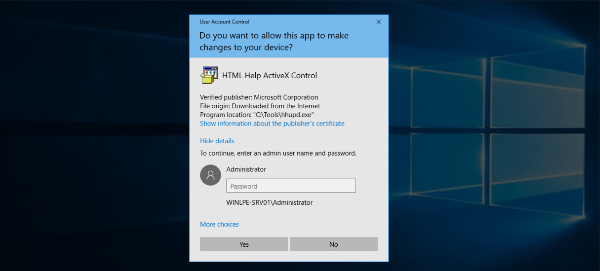
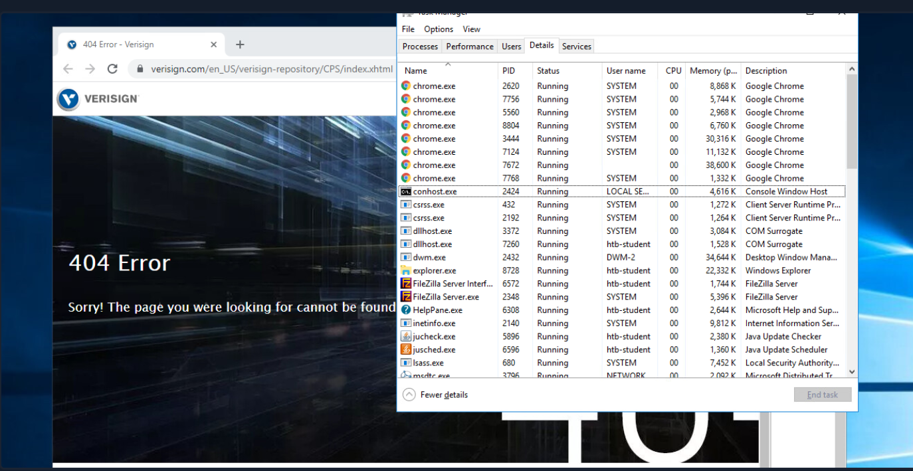

# CVE-2019-1388 hhupd.exe
[CVE-2019-1388](https://nvd.nist.gov/vuln/detail/CVE-2019-1388) was a privilege escalation vulnerability in the Windows Certificate Dialog, which did not properly enforce user privileges.

The issue was in the UAC mechanism, which presented an option to show information about an executable's certificate, opening the Windows certificate dialog when a user clicks the link.

This vulnerability can be exploited easily using an old Microsoft-signed executable ([hhupd.exe](https://packetstormsecurity.com/files/14437/hhupd.exe.html)) that contains a certificate with the `SpcSpAgencyInfo` field populated with a hyperlink.

**1.** First right click on the `hhupd.exe` executable and select `Run as administrator` from the menu.

**2.** Next, click on `Show information about the publisher's certificate` to open the certificate dialog. Here we can see that the `SpcSpAgencyInfo` field is populated in the Details tab.

**3.** Next, we go back to the General tab and see that the `Issued by` field is populated with a hyperlink. Click on it and then click `OK`, and the certificate dialog will close, and a browser window will launch.

If we open `Task Manager`, we will see that the browser instance was launched as SYSTEM.

Next, we can right-click anywhere on the web page and choose `View page source`. Once the page source opens in another tab, right-click again and select `Save as`, and a `Save As` dialog box will open.

At this point, we can launch any program we would like as SYSTEM. Type `c:\windows\system32\cmd.exe` in the file path and hit enter. If all goes to plan, we will have a cmd.exe instance running as SYSTEM.

Microsoft released a [patch](https://msrc.microsoft.com/update-guide/en-US/vulnerability/CVE-2019-1388) for this issue in November of 2019. Still, as many organizations fall behind on patching, we should always check for this vulnerability if we gain GUI access to a potentially vulnerable system as a low-privilege user.

This [link](https://web.archive.org/web/20210620053630/https://gist.github.com/gentilkiwi/802c221c0731c06c22bb75650e884e5a) lists all of the vulnerable Windows Server and Workstation versions.
