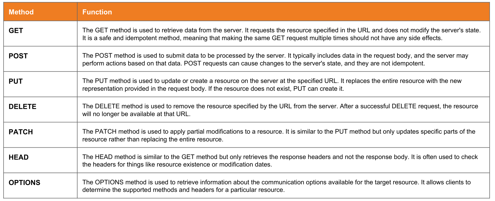

# Test HTTP Methods

!!! quote ""
	[OWASP Web Security Testing Guide 4.2](index.md) > 2. Configuration and Deploy Management Testing> 2.6. Test HTTP Methods

|ID|Link to Hackinglife|Link to OWASP|Description|
|:---|:---|:---|:---|
|2.6|[WSTG-CONF-06](WSTG-CONF-06.md)|[Test HTTP Methods](https://owasp.org/www-project-web-security-testing-guide/latest/4-Web_Application_Security_Testing/02-Configuration_and_Deployment_Management_Testing/06-Test_HTTP_Methods)|- Enumerate supported HTTP methods using OPTIONS. - Test for access control bypass (GET->HEAD->FOO). - Test HTTP method overriding techniques.|

HTTP method tampering, also known as HTTP verb tampering, is a type of security vulnerability that can be exploited in web applications. HTTP method tampering occurs when an attacker modifies the HTTP method being used in a request to trick the web application into performing unintended actions.

[More about HTTP methods](../http-headers.md).




## Test Objectives

- Enumerate supported HTTP methods.
- Test for access control bypass.
- Test HTTP method overriding techniques.


Enumerate with OPTIONS:

```bash
curl -v -X OPTIONS <target>
```

Test access control bypass with a made-up method:

```bash
curl -v -X FAKEMETHOD <target>
```

Or test access control bypass with other methods.

### PUT 

After enumerating methods with Burpsuite:

```
OPTIONS /uploads HTTP/1.1
Host: example.org
```

We obtained as response:

```
HTTP/1.1 200 OK
Date: ....
....
Allow: OPTIONS,GET,HEAD,POST,PUT,DELETE,TRACE,PROPPATCH,COPY,MOVE,LOCK
```

Then, we can try to upload a file by using Burpsuite. Typical payload:

```
PUT /test.html HTTP/1.1
Host: example.org
Content-Length: 25

<script>alert(1)</script>
```

Try to upload a file by using curl. Typical payload:

```bash
curl https://example.org --upload-file test.html
curl -X PUT https://example.org/test.html -d "<script>alert(1)</script>"
```

### DELETE

Try to delete a file by using Burpsuite. Typical payload:

```
DELETE /uploads/file1.pdf HTTP/1.1
Host: example.org
```

Try to delete a file by using curl. Typical payload:

```bash
curl -X DELETE https://example.org/uploads/file1.pdf
```

### TRACE

The `TRACE` method (or Microsoft’s equivalent `TRACK` method) causes the server to echo back the contents of the request. This led to a vulnerability called Cross-Site Tracing (XST), which could be used to access cookies that had the `HttpOnly` flag set. The `TRACE` method has been blocked in all browsers and plugins for many years; as such, this issue is no longer exploitable. However, it may still be flagged by automated scanning tools, and the `TRACE` method being enabled on a web server suggests that is has not been properly hardened.

### CONNECT

The `CONNECT` method causes the web server to open a TCP connection to another system, and then pass traffic from the client to that system. This could allow an attacker to proxy traffic through the server, in order to hide their source address, access internal systems or access services that are bound to localhost. An example of a `CONNECT` request is shown below:

```
CONNECT 192.168.0.1:443 HTTP/1.1
Host: example.org
```


### Testing for Access Control Bypass

If a page on the application redirects users to a login page with a 302 code when they attempt to access it directly, it may be possible to bypass this by making a request with a different HTTP method, such as `HEAD`, `POST` or even a made up method such as `FOO`. If the web application responds with a `HTTP/1.1 200 OK` rather than the expected `HTTP/1.1 302 Found`, it may then be possible to bypass the authentication or authorization.

```
HEAD /admin/ HTTP/1.1
Host: example.org
```

```
HTTP/1.1 200 OK
[...]
Set-Cookie: adminSessionCookie=[...];
```

### Testing for HTTP Method Overriding

Some web frameworks provide a way to override the actual HTTP method in the request. They achieve this by emulating the missing HTTP verbs and passing some custom headers in the requests. For example:

- `X-HTTP-Method`
- `X-HTTP-Method-Override`
- `X-Method-Override`

To test this, consider scenarios where restricted verbs like `PUT` or `DELETE` return a `405 Method not allowed`. In such cases, replay the same request, but add the alternative headers for HTTP method overriding.