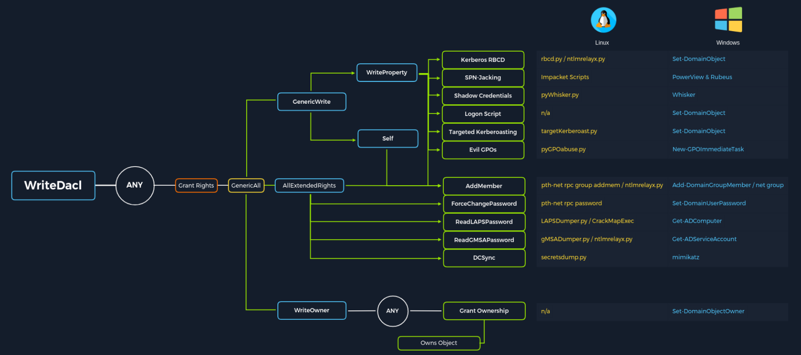

# Access Control List (ACL)

An Access Control List (ACL) defines:

 - who has access to which asset/resource and 
 - the level of access they are provisioned.

There are two types of ACLs:

1. `Discretionary Access Control List` (`DACL`) -defines which security principals are granted or denied access to an object. DACLs are made up of ACEs that either allow or deny access.
2.  `System Access Control Lists` (`SACL`) - allow administrators to log access attempts made to secured objects.

If a DACL does not exist for an object, all who attempt to access the object are granted full rights. If a DACL exists, but does not have any ACE entries specifying specific security settings, the system will deny access to all users, groups, or processes attempting to access it.

When access control lists are checked to determine permissions, they are checked from top to bottom until an access denied is found in the list.

##  Access Control Entries (ACEs)

An ACL is composed of Access Control Entries (ACEs). Each ACE maps back to a user, group, or process (also known as security principals) and defines the rights granted to that principal. 

There are `three` main types of ACEs that can be applied to all securable objects in AD:

| **ACE**              | **Description**                                                                                                                                                            |
| -------------------- | -------------------------------------------------------------------------------------------------------------------------------------------------------------------------- |
| `Access denied ACE`  | Used within a DACL to show that a user or group is explicitly denied access to an object                                                                                   |
| `Access allowed ACE` | Used within a DACL to show that a user or group is explicitly granted access to an object                                                                                  |
| `System audit ACE`   | Used within a SACL to generate audit logs when a user or group attempts to access an object. It records whether access was granted or not and what type of access occurred |

Each ACE is made up of the following `four` components:

1. The security identifier (SID) of the user/group that has access to the object (or principal name graphically)
2. A flag denoting the type of ACE (access denied, allowed, or system audit ACE)
3. A set of flags that specify whether or not child containers/objects can inherit the given ACE entry from the primary or parent object
4. An [access mask](https://docs.microsoft.com/en-us/openspecs/windows_protocols/ms-dtyp/7a53f60e-e730-4dfe-bbe9-b21b62eb790b?redirectedfrom=MSDN) which is a 32-bit value that defines the rights granted to an object

Some example Active Directory object security permissions are as follows. These can be enumerated (and visualized) using a tool such as BloodHound, and are all abusable with PowerView, among other tools:

- `ForceChangePassword` abused with `Set-DomainUserPassword`
- `Add Members` abused with `Add-DomainGroupMember`
- `GenericAll` abused with `Set-DomainUserPassword` or `Add-DomainGroupMember`
- `GenericWrite` abused with `Set-DomainObject`
- `WriteOwner` abused with `Set-DomainObjectOwner`
- `WriteDACL` abused with `Add-DomainObjectACL`
- `AllExtendedRights` abused with `Set-DomainUserPassword` or `Add-DomainGroupMember`
- `Addself` abused with `Add-DomainGroupMember`

## Some ACL attacks

- [ForceChangePassword](https://bloodhound.readthedocs.io/en/latest/data-analysis/edges.html#forcechangepassword) - gives us the right to reset a user's password without first knowing their password (should be used cautiously and typically best to consult our client before resetting passwords).
- [GenericWrite](https://bloodhound.readthedocs.io/en/latest/data-analysis/edges.html#genericwrite) - gives us the right to write to any non-protected attribute on an object. If we have this access over a user, we could assign them an SPN and perform a Kerberoasting attack (which relies on the target account having a weak password set). Over a group means we could add ourselves or another security principal to a given group. Finally, if we have this access over a computer object, we could perform a resource-based constrained delegation attack which is outside the scope of this module.
- `AddSelf` - shows security groups that a user can add themselves to.
- [GenericAll](https://bloodhound.readthedocs.io/en/latest/data-analysis/edges.html#genericall) - this grants us full control over a target object. Again, depending on if this is granted over a user or group, we could modify group membership, force change a password, or perform a targeted Kerberoasting attack. If we have this access over a computer object and the [Local Administrator Password Solution (LAPS)](https://www.microsoft.com/en-us/download/details.aspx?id=46899) is in use in the environment, we can read the LAPS password and gain local admin access to the machine which may aid us in lateral movement or privilege escalation in the domain if we can obtain privileged controls or gain some sort of privileged access.

These are some common attack scenarios:

| Attack                                | Description                                                                                                                                                                                                                                                                                                                                                                                                                                                                          |
| ------------------------------------- | ------------------------------------------------------------------------------------------------------------------------------------------------------------------------------------------------------------------------------------------------------------------------------------------------------------------------------------------------------------------------------------------------------------------------------------------------------------------------------------ |
| `Abusing forgot password permissions` | Help Desk and other IT users are often granted permissions to perform password resets and other privileged tasks. If we can take over an account with these privileges (or an account in a group that confers these privileges on its users), we may be able to perform a password reset for a more privileged account in the domain.                                                                                                                                                |
| `Abusing group membership management` | It's also common to see Help Desk and other staff that have the right to add/remove users from a given group. It is always worth enumerating this further, as sometimes we may be able to add an account that we control into a privileged built-in AD group or a group that grants us some sort of interesting privilege.                                                                                                                                                           |
| `Excessive user rights`               | We also commonly see user, computer, and group objects with excessive rights that a client is likely unaware of. This could occur after some sort of software install (Exchange, for example, adds many ACL changes into the environment at install time) or some kind of legacy or accidental configuration that gives a user unintended rights. Sometimes we may take over an account that was given certain rights out of convenience or to solve a nagging problem more quickly. |

