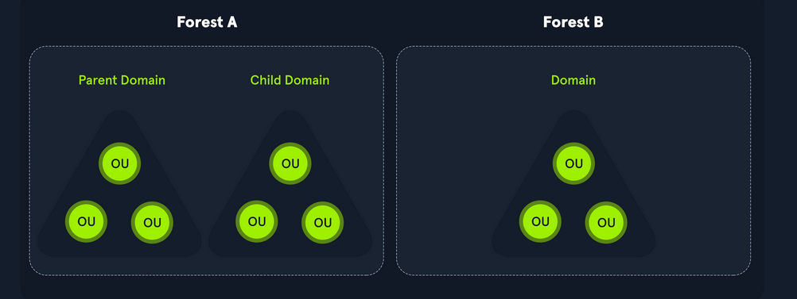

# Active Directory - LDAP

Active Directory (AD) is a directory service for Windows network environments. A basic AD user account with no added privileges can be used to enumerate the majority of objects contained within AD, including but not limited to:

- Domain Computers
- Domain Users
- Domain Group Information
- Default Domain Policy
- Domain Functional Levels
- Password Policy
- Group Policy Objects (GPOs)
- Kerberos Delegation
- Domain Trusts
- Access Control Lists (ACLs)

Active Directory can be easily misconfigurable. These are common attacks:


- Kerberoasting / ASREPRoasting
- NTLM Relaying
- Network traffic poisoning
- Password spraying
- Kerberos delegation abuse
- Domain trust abuse
- Credential theft
- Object control


## Active Directory structure

In the context of Active Directory, a forest is a collection of one or more domain trees that share a common schema and global catalog, while a domain is a logical unit within a forest that represents a security boundary for authentication and authorization purposes.




### xfreerdp

```bash
xfreerdp /v:<target IP address> /u:htb-student /p:<password> /cert-ignore
```

## Enumeration

If we get a foothold in an Active Directory Environment, these are some informations we should try to retrieve:


- The domain functional level
- The domain password policy
- A full inventory of AD users
- A full inventory of AD computers
- A full inventory of AD groups and memberships
- Domain trust relationships
- Object ACLs
- Group Policy Objects (GPO) information
- Remote access rights

We should also check what rights our current user has in the domain.

```ps
whoami /priv
```


### Rights and privileges in Active Directory


Get Members of "Schema Admins":

```ps
Get-ADGroup -Identity "Schema Admins" -Properties *
```

These are some groups with special permissions that, if missconfigured, might be exploited:

| Group | Description |
| ----- | ----------- |
| Default Administrators | Domain Admins and Enterprise Admins "super" groups. |
| Server Operators | Members can modify services, access SMB shares, and backup files. |
| Backup Operators | Members are allowed to log onto DCs locally and should be considered Domain Admins. They can make shadow copies of the SAM/NTDS database, read the registry remotely, and access the file system on the DC via SMB. This group is sometimes added to the local Backup Operators group on non-DCs. |
| Print Operators | Members are allowed to logon to DCs locally and "trick" Windows into loading a malicious driver. |
| Hyper-V Administrators | If there are virtual DCs, any virtualization admins, such as members of Hyper-V Administrators, should be considered Domain Admins. |
| Account Operators | Members can modify non-protected accounts and groups in the domain. |
| Remote Desktop Users | Members are not given any useful permissions by default but are often granted additional rights such as Allow Login Through Remote Desktop Services and can move laterally using the RDP protocol. |
| Remote Management Users | Members are allowed to logon to DCs with PSRemoting (This group is sometimes added to the local remote management group on non-DCs). | 
| Group Policy Creator Owners | Members can create new GPOs but would need to be delegated additional permissions to link GPOs to a container such as a domain or OU. |
| Schema Admins | Members can modify the Active Directory schema structure and can backdoor any to-be-created Group/GPO by adding a compromised account to the default object ACL. |
| DNSAdmins | Members have the ability to load a DLL on a DC but do not have the necessary permissions to restart the DNS server. They can load a malicious DLL and wait for a reboot as a persistence mechanism. Loading a DLL will often result in the service crashing. A more reliable way to exploit this group is to create a WPAD record. |


```ps
Get-ADGroup -Identity "Schema Admins" -Properties *


```

## Acronyms

**SID**

In the context of the Microsoft Windows NT line of operating systems, a Security Identifier is a unique, immutable identifier of a user, user group, or other security principal. 

**UAC**

User Account Control (UAC) is a fundamental component of Microsoft's overall security vision. UAC helps mitigate the impact of malware.

**OU**
What is an organizational unit in Active Directory? An OU is a container within a Microsoft Windows Active Directory (AD) domain that can hold users, groups and computers. It is the smallest unit to which an administrator can assign Group Policy settings or account permissions.

**RSAT**
The Remote Server Administration Tools (RSAT) have been part of Windows since the days of Windows 2000. RSAT allows systems administrators to remotely manage Windows Server roles and features from a workstation running Windows 10, Windows 8.1, Windows 7, or Windows Vista. RSAT can only be installed on Professional or Enterprise editions of Window
