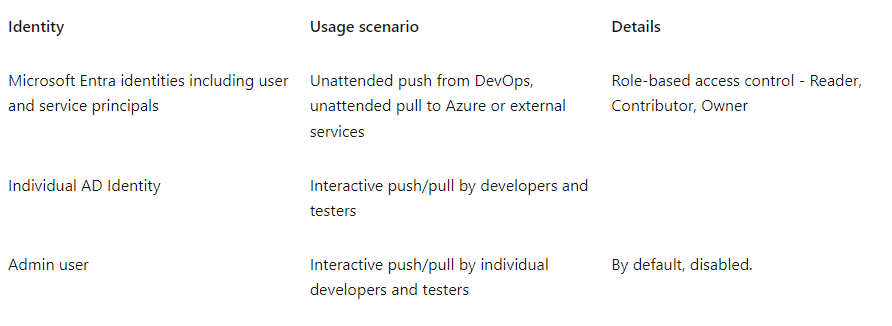

# AZ-500 Microsoft Azure Security Technologies Certificate


!!! abstract "Sources of this notes:"
    - [The Microsoft e-learn platform](https://learn.microsoft.com/en-us/credentials/certifications/exams/az-500/).
    - Book:  ["Microsoft Certified - MCA Microsoft Certified Associate Azure Security Engineer Study Guide: Exam AZ-500](https://www.amazon.es/Microsoft-Certified-Associate-Security-ngineer/dp/1119870372/). 
    - Udemy course:  [AZ-500 Microsoft Azure Security Technologies Exam Prep](https://eylearning.udemy.com/course/az500-azure/).
    - Udemy course: [Azure Security: AZ-500 (updated July 2023)](https://eylearning.udemy.com/course/azure-security-associate-az-500/)

## Introduction

These are some of the requirements for facing the az-500 highlighted by some experts:

- Have previously taken the Azure Administrator: AZ-103/104 course.
- A minimum of 1 year experience with Azure.
- Understand concepts of virtual machines, resource groups and Azure AD.

Since I only have two vouchers for azure certifications and I've already spent one on the [AZ-900](az-900-preparation.md), and I really want to focus on the AZ-500, I will complete the AZ-104 trainings like I was going to pass their exam and later on proceed to AZ-500 even though I don't have the official certificate for the AZ-104. [These are my notes for this AZ-104 not-certificated learning](az-104-preparation.md).


## Differences between the AZ-500 and the SC-900 certification

The [Exam AZ-500: Microsoft Azure Security Technologies](https://learn.microsoft.com/en-us/certifications/exams/az-500/ "learn.microsoft.com") is focused on Azure Security Engineer implements, manages, and monitors security for resources in Azure, multi-cloud, and hybrid environments as part of an end-to-end infrastructure. This Certification contains security components and configurations to protect identity & access, data, applications, and networks.

Regarding the [Exam SC-900: Microsoft Security, Compliance, and Identity Fundamentals](https://learn.microsoft.com/en-us/certifications/exams/sc-900/ "learn.microsoft.com") is targeted to those looking to familiarize themselves with the fundamentals of security, compliance, and identity (SCI) across cloud-based and related Microsoft services. This is a broad audience that may include business stakeholders, new or existing IT professionals, or students who have an interest in Microsoft security, compliance, and identity solutions.


## 1. Azure Active Directory: Manage Identity and Access

**Azure Active Directory** (Azure AD) is a cloud-based identity and access management service.
### Azure Active Directory licenses

- **Azure Active Directory Free.** Provides user and group management, on-premises directory synchronization, basic reports, self-service password change for cloud users, and single sign-on across Azure, Microsoft 365, and many popular SaaS apps.
- **Azure Active Directory Premium P1.** In addition to the Free features, P1 lets your hybrid users access both on-premises and cloud resources. It also supports advanced administration, such as dynamic groups, self-service group management, Microsoft Identity Manager, and cloud write-back capabilities, which allow self-service password reset for your on-premises users.
- **Azure Active Directory Premium P2.** In addition to the Free and P1 features, P2 also offers Azure Active Directory Identity Protection to help provide risk-based Conditional Access to your apps and critical company data and Privileged Identity Management to help discover, restrict, and monitor administrators and their access to resources and to provide just-in-time access when needed.
- **"Pay as you go"** feature licenses. You also get additional feature licenses, such as Azure Active Directory Business-to-Customer (B2C). B2C can help you provide identity and access management solutions for your customer-facing apps.


### **Azure Active Directory Domain Services (Azure AD DS)** 

There are **two ways** to provide Active Directory Domain Services in the cloud:

- A _**managed domain**_ that you create using Azure Active Directory Domain Services (Azure AD DS). Microsoft creates and manages the required resources. **Azure AD DS**  deploys, manages, patches, and secures the active directory domain service  infrastructure for you. It's a managed domain experience. Azure AD DS provides a smaller subset of features to traditional self-managed AD DS environment, which reduces some of the design and management complexity. For example, there are no AD forests, domains, sites, and replication links to design and maintain. Also it guarantees access to traditional authentication mechanisms such as Kerberos or NTLM.
- A _**self-managed**_ domain that you create and configure using traditional resources such as virtual machines (VMs), Windows Server guest OS, and Active Directory Domain Services (AD DS). You then continue to administer these resources. You're then able to do additional tasks, such as extending the schema or create forest trust. Common deployment models in a self-managed domain are:
	- Standalone cloud-only AD DS: Azure VMs are configured as domain controllers, and a separate, cloud-only AD DS environment is created. This AD DS environment doesn't integrate with an on-premises AD DS environment. A different set of credentials is used to sign in and administer VMs in the cloud.
	- **Resource forest deployment** - Azure VMs are configured as domain controllers, and an AD DS domain that's part of an existing forest is created. A trust relationship is then configured to an on-premises AD DS environment. Other Azure VMs can domain-join this resource forest in the cloud. User authentication runs over a VPN / ExpressRoute connection to the on-premises AD DS environment.
	- **Extend on-premises domain to Azure** - An Azure virtual network connects to an on-premises network using a VPN / ExpressRoute connection. Azure VMs connect to this Azure virtual network, which lets them domain-join to the on-premises AD DS environment. An alternative is to create Azure VMs and promote them as replica domain controllers from the on-premises AD DS domain. These domain controllers replicate over a VPN / ExpressRoute connection to the on-premises AD DS environment. The on-premises AD DS domain is effectively extended into Azure.


The following table outlines some of the features you may need for your organization and the differences between a managed Azure AD DS domain or a self-managed AD DS domain:

|**Feature**|**Azure Active Directory Services (Azure AD DS)**|**Self-managed AD DS**|
|---|---|---|
|Managed service|✓|✕|
|Secure deployments|✓|The administrator secures the deployment|
|Domain Name System (DNS) server|✓ (managed service)|✓|
|Domain or Enterprise administrator privileges|✕|✓|
|Domain join|✓|✓|
|Domain authentication using New Technology LAN Manager (NTLM) and Kerberos|✓|✓|
|Kerberos constrained delegation|Resource-based|Resource-based & account-based|
|Custom organizational unit (OU) structure|✓|✓|
|Group Policy|✓|✓|
|Schema extensions|✕|✓|
|Active Directory domain/forest trusts|✓ (one-way outbound forest trusts only)|✓|
|Secure Lightweight Directory Access Protocols (LDAPs)|✓|✓|
|Lightweight Directory Access Protocol (LDAP) read|✓|✓|
|Lightweight Directory Access Protocol (LDAP) write|✓ (within the managed domain)|✓|
|Geographical-distributed (Geo-distributed) deployments|✓|✓|

Azure Active Directory Domain Services (Azure AD DS) provides managed domain services such as domain join, group policy, lightweight directory access protocol (LDAP), and Kerberos/New Technology LAN Manager (NTLM) authentication. You use these domain services without the need to deploy, manage, and patch domain controllers (DCs) in the cloud.


### Signing devices to Azure Active Directory

Azure AD lets you manage the identity of devices used by the organization and control access to corporate resources from those devices. Users can also register their personal device (a bring-your-own (BYO) model) with Azure AD, which provides the device with an identity. Azure AD then authenticates the device when a user signs in to Azure AD and uses the device to access secured resources. The device can be managed using Mobile Device Management (MDM) software like Microsoft Intune. This management ability lets you restrict access to sensitive resources to managed and policy-compliant devices.


Azure AD joined devices give you the following benefits:

- Single sign-on (SSO) to applications secured by Azure AD.
- Enterprise policy-compliant roaming of user settings across devices.
- Access to the Windows Store for Business using corporate credentials.
- Windows Hello for Business.
- Restricted access to apps and resources from devices compliant with corporate policy.

The following table outlines common device ownership models and how they would typically be joined to a domain:

|**Type of device**|**Device platforms**|**Mechanism**|
|---|---|---|
|Personal devices|Windows 10, iOS, Android, macOS|Azure AD registered|
|Organization-owned device not joined to on-premises AD DS|Windows 10|Azure AD joined|
|Organization-owned device joined to an on-premises AD DS|Windows 10|Hybrid Azure AD joined|


The following table outlines differences in how the devices are represented and can authenticate themselves against the directory:

|**Aspect**|**Azure AD-joined**|**Azure AD DS-joined**|
|---|---|---|
|Device controlled by|Azure AD|Azure AD Domain Services managed domain|
|Representation in the directory|Device objects in the Azure AD directory|Computer objects in the Azure AD DS managed domain|
|Authentication|Open Authorization OAuth / OpenID Connect-based protocols. These protocols are designed to work over the internet, so are great for mobile scenarios where users access corporate resources from anywher|Kerberos and NTLM protocols, so it can support legacy applications migrated to run on Azure VMs as part of a lift-and-shift strategy|
|Management|Mobile Device Management (MDM) software like Intune|Group Policy|
|Networking|Works over the internet|Must be connected to, or peered with, the virtual network where the managed domain is deployed|
|Great for...|End-user mobile or desktop devices|Server VMs deployed in Azure|


>If on-premises AD DS and Azure AD are configured for federated authentication using Active Directory Federation Services (ADFS), then there's no (current/valid) password hash available in Azure DS. Azure AD user accounts created before fed auth was implemented might have an old password hash that doesn't match a hash of their on-premises password. Hence Azure AD DS won't validate the user's credentials.


### Roles in Azure Active Directory

Azure AD built-in roles differ in where they can be used, which fall into the following **three broad categories**.

1. **Azure AD-specific roles**: These roles grant permissions to manage resources within Azure AD only. For example, **User Administrator**, **Application Administrator**, and **Groups Administrator** all grant permissions to manage resources that live in Azure AD.
2. **Service-specific roles**: For major Microsoft 365 services (non-Azure AD), we have built service-specific roles that grant permissions to manage all features within the service. 
3. **Cross-service roles**: There are some roles that span services. We have two global roles - Global Administrator and Global Reader. All Microsoft 365 services honor these two roles. Also, there are some security-related roles like Security Administrator and Security Reader that grant access across multiple security services within Microsoft 365. **For example, using Security Administrator roles in Azure AD, you can manage Microsoft 365 Defender portal, Microsoft Defender Advanced Threat Protection, and Microsoft Defender for Cloud Apps**. 

The following table is offered as an aid to understanding these role categories. The categories are named arbitrarily and aren't intended to imply any other capabilities beyond the documented Azure AD role permissions.

|Category|Role|
|---|---|
|Azure AD-specific roles|Application Administrator  <br>Application Developer  <br>Authentication Administrator  <br>Business to consumer (B2C) Identity Experience Framework (IEF) Keyset Administrator  <br>Business to consumer (B2C) Identity Experience Framework (IEF) Policy Administrator  <br>Cloud Application Administrator  <br>Cloud Device Administrator  <br>Conditional Access Administrator  <br>Device Administrators  <br>Directory Readers  <br>Directory Synchronization Accounts  <br>Directory Writers  <br>External ID User Flow Administrator  <br>External ID User Flow Attribute Administrator  <br>External Identity Provider Administrator  <br>Groups Administrator  <br>Guest Inviter  <br>Helpdesk Administrator  <br>Hybrid Identity Administrator  <br>License Administrator  <br>Partner Tier1 Support  <br>Partner Tier2 Support  <br>Password Administrator  <br>Privileged Authentication Administrator  <br>Privileged Role Administrator  <br>Reports Reader  <br>User Administrator|
|Cross-service roles|Global Administrator  <br>Compliance Administrator  <br>Compliance Data Administrator  <br>Global Reader  <br>Security Administrator  <br>Security Operator  <br>Security Reader  <br>Service Support Administrator|
|Service-specific roles|Azure DevOps Administrator  <br>Azure Information Protection Administrator  <br>Billing Administrator  <br>Customer relationship management (CRM) Service Administrator  <br>Customer Lockbox Access Approver  <br>Desktop Analytics Administrator  <br>Exchange Service Administrator  <br>Insights Administrator  <br>Insights Business Leader  <br>Intune Service Administrator  <br>Kaizala Administrator  <br>Lync Service Administrator  <br>Message Center Privacy Reader  <br>Message Center Reader  <br>Modern Commerce User  <br>Network Administrator  <br>Office Apps Administrator  <br>Power BI Service Administrator  <br>Power Platform Administrator  <br>Printer Administrator  <br>Printer Technician  <br>Search Administrator  <br>Search Editor  <br>SharePoint Service Administrator  <br>Teams Communications Administrator  <br>Teams Communications Support Engineer  <br>Teams Communications Support Specialist  <br>Teams Devices Administrator  <br>Teams Administrator|


These are all of the Azure AD built-in roles:

|**Role**|**Description**|
|---|---|
|**Application Administrator**|Users in this role can create and manage all aspects of enterprise applications, application registrations, and application proxy settings.  <br>Users assigned to this role aren't added as owners when creating new application registrations or enterprise applications.  <br>This role also grants the ability to consent for delegated permissions and application permissions, except for application permissions for Microsoft Graph.|
|Application Developer|Can create application registrations when the **Users can register applications** setting is set to No.|
|Attack Payload Author|Users in this role can create attack payloads but not actually launch or schedule them. Attack payloads are then available to all administrators in the tenant, who can use them to create a simulation.|
|Attack Simulation Administrator|Users in this role can create and manage all aspects of attack simulation creation, launch/scheduling of a simulation, and the review of simulation results. Members of this role have this access for all simulations in the tenant.|
|Attribute Assignment Administrator|Users with this role can assign and remove custom security attribute keys and values for supported Azure AD objects such as users, service principals, and devices. By default, Global Administrator and other administrator roles don't have permissions to read, define, or assign custom security attributes. To work with custom security attributes, you must be assigned one of the custom security attribute roles.|
|Attribute Assignment Reader|Users with this role can read custom security attribute keys and values for supported Azure AD objects. By default, Global Administrator and other administrator roles don't have permissions to read, define, or assign custom security attributes. You must be assigned one of the custom security attribute roles to work with custom security attributes.|
|Attribute Definition Administrator|Users with this role can define a valid set of custom security attributes that can be assigned to supported Azure AD objects. This role can also activate and deactivate custom security attributes. By default, Global Administrator and other administrator roles don't have permissions to read, define, or assign custom security attributes. To work with custom security attributes, you must be assigned one of the custom security attribute roles.|
|**Authentication Administrator**|Assign the Authentication Administrator role to users who need to do the following:  <br>  <br>-Set or reset any authentication method (including passwords) for nonadministrators and some roles.  <br>-Require users who are nonadministrators or assigned to some roles to re-register against existing nonpassword credentials (for example, **Multifactor authentication (MFA)** or **Fast ID Online (FIDO)**, and can also revoke remember MFA on the device, which prompts for MFA on the next sign-in.  <br>-Perform sensitive actions for some users.  <br>-Create and manage support tickets in Azure and the Microsoft 365 admin center.  <br>  <br>Users with this role can't do the following tasks:  <br>  <br>-Can't change the credentials or reset MFA for members and owners of a role-assignable group.  <br>-Can't manage MFA settings in the legacy MFA management portal or Hardware OATH tokens. The same functions can be accomplished using the Set-MsolUser commandlet Azure AD PowerShell module.|
|Authentication Policy Administrator|Assign the Authentication Policy Administrator role to users who need to do the following:  <br>  <br>-Configure the authentication methods policy, tenant-wide MFA settings, and password protection policy that determine which methods each user can register and use.  <br>-Manage Password Protection settings: smart lockout configurations and updating the custom banned passwords list.  <br>-Create and manage verifiable credentials.  <br>-Create and manage Azure support tickets.  <br>  <br>Users with this role can't do the following tasks:  <br>  <br>-Can't update sensitive properties.  <br>-Can't delete or restore users.  <br>-Can't manage MFA settings in the legacy MFA management portal or Hardware OATH tokens.|
|Azure AD Joined Device Local Administrator|This role is available for assignment only as another local administrator in Device settings. Users with this role become local machine administrators on all Windows 10 devices that are joined to Azure Active Directory. They don't have the ability to manage device objects in Azure Active Directory.|
|Azure DevOps Administrator|Users with this role can manage all enterprise Azure DevOps policies applicable to all Azure DevOps organizations backed by the Azure AD.  <br>Users in this role can manage these policies by navigating to any Azure DevOps organization that is backed by the company's Azure AD.  <br>Users in this role can claim ownership of orphaned Azure DevOps organizations. This role grants no other Azure DevOps-specific permissions (for example, Project Collection Administrators) inside any of the Azure DevOps organizations backed by the company's Azure AD organization.|
|Azure Information Protection Administrator|Users with this role have all permissions in the Azure Information Protection service. This role allows configuring labels for the Azure Information Protection policy, managing protection templates, and activating protection. This role doesn't grant any permissions in Identity Protection Center, Privileged Identity Management, Monitor Microsoft 365 Service Health, or Office 365 Security and compliance center.|
|Business-to-Consumer (B2C) Identity Experience Framework (IEF) Keyset Administrator|Users can create and manage policy keys and secrets for token encryption, token signatures, and claim encryption/decryption.  <br>By adding new keys to existing key containers, this limited administrator can roll over secrets as needed without impacting existing applications.  <br>This user can see the full content of these secrets and their expiration dates even after their creation.|
|Business-to-Consumer (B2C) Identity Experience Framework (IEF) Policy Administrator|Users in this role have the ability to create, read, update, and delete all custom policies in Azure AD B2C and therefore have full control over the Identity Experience Framework in the relevant Azure AD B2C organization. By editing policies, this user can establish direct federation with external identity providers, change the directory schema, change all user-facing content HyperText Markup Language (HTML), Cascading Style Sheets (CSS), JavaScript), change the requirements to complete authentication, create new users, send user data to external systems including full migrations, and edit all user information including sensitive fields like passwords and phone numbers. Conversely, this role can't change the encryption keys or edit the secrets used for federation in the organization.|
|Billing Administrator|Makes purchases, manages subscriptions, manages support tickets, and monitors service health.|
|Cloud App Security Administrator|Users with this role have full permissions in Defender for Cloud Apps. They can add administrators, add Microsoft Defender for Cloud Apps policies and settings, upload logs, and perform governance actions.|
|Cloud Application Administrator|Users in this role have the same permissions as the Application Administrator role, excluding the ability to manage application proxy. This role grants the ability to create and manage all aspects of enterprise applications and application registrations. Users assigned to this role aren't added as owners when creating new application registrations or enterprise applications. This role also grants the ability to consent for delegated permissions and application permissions, except for application permissions for Microsoft Graph.|
|Cloud Device Administrator|Users in this role can enable, disable, and delete devices in Azure AD and read Windows 10 BitLocker keys (if present) in the Azure portal. The role doesn't grant permissions to manage any other properties on the device.|
|Compliance Administrator|Users with this role have permissions to manage compliance-related features in the Microsoft Purview compliance portal, Microsoft 365 admin center, Azure, and Office 365 Security and compliance center. Assignees can also manage all features within the Exchange admin center and create support tickets for Azure and Microsoft 365.|
|Compliance Data Administrator|Users with this role have permissions to track data in the Microsoft Purview compliance portal, Microsoft 365 admin center, and Azure. Users can also track compliance data within the Exchange admin center, Compliance Manager, and Teams and Skype for Business admin center and create support tickets for Azure and Microsoft 365.|
|**Conditional Access Administrator**|Users with this role have the ability to manage Azure Active Directory Conditional Access settings.|
|Customer Lockbox Access Approver|Manages Microsoft Purview Customer Lockbox requests in your organization. They receive email notifications for Customer Lockbox requests and can approve and deny requests from the Microsoft 365 admin center. They can also turn the Customer Lockbox feature on or off. Only Global Administrators can reset the passwords of people assigned to this role.|
|Desktop Analytics Administrator|Users in this role can manage the Desktop Analytics service, including viewing asset inventory, creating deployment plans, and viewing deployment and health status.|
|Directory Readers|Users in this role can read basic directory information. This role should be used for:  <br>  <br>-Granting a specific set of guest users read access instead of granting it to all guest users.  <br>-Granting a specific set of nonadmin users access to the Azure portal when "**Restrict access to Azure AD portal to admins only**" is set to "**Yes**".  <br>-Granting service principals access to the directory where Directory.Read.All isn't an option.|
|Directory Synchronization Accounts|Don't use. This role is automatically assigned to the Azure AD Connect service and isn't intended or supported for any other use.|
|Directory Writers|Users in this role can read and update basic information of users, groups, and service principals.|
|Domain Name Administrator|Users with this role can manage (**read**, **add**, **verify**, **update**, and **delete**) domain names. They can also read directory information about users, groups, and applications, as these objects possess domain dependencies. For on-premises environments, users with this role can configure domain names for federation so that associated users are always authenticated on-premises. These users can then sign into Azure AD-based services with their on-premises passwords via single sign-on. Federation settings need to be synced via Azure AD Connect so users also have permissions to manage Azure AD Connect.|
|Dynamics 365 Administrator|Users with this role have global permissions within Microsoft Dynamics 365 Online when the service is present, and the ability to manage support tickets and monitor service health.|
|Edge Administrator|Users in this role can create and manage the enterprise site list required for Internet Explorer mode on Microsoft Edge. This role grants permissions to create, edit, and publish the site list and additionally allows access to manage support tickets.|
|Exchange Administrator|Users with this role have global permissions within Microsoft Exchange Online, when the service is present. Also has the ability to create and manage all Microsoft 365 groups, manage support tickets, and monitor service health.|
|Exchange Recipient Administrator|Users with this role have read access to recipients and write access to the attributes of those recipients in Exchange Online.|
|External ID User Flow Administrator|Users with this role can create and manage user flows (also called "**built-in**" policies) in the Azure portal. These users can customize HTML/CSS/JavaScript content, change MFA requirements, select claims in the token, manage API connectors and their credentials, and configure session settings for all user flows in the Azure AD organization. On the other hand, this role doesn't include the ability to review user data or make changes to the attributes that are included in the organization schema. Changes to Identity Experience Framework policies (also known as custom policies) are also outside the scope of this role.|
|External ID User Flow Attribute Administrator|Users with this role add or delete custom attributes available to all user flows in the Azure AD organization.  <br>Users with this role can change or add new elements to the end-user schema and impact the behavior of all user flows, and indirectly result in changes to what data may be asked of end users and ultimately sent as claims to applications. This role can't edit user flows.|
|External Identity Provider Administrator|This administrator manages federation between Azure AD organizations and external identity providers. With this role, users can add new identity providers and configure all available settings (for example, authentication path, service ID, assigned key containers). This user can enable the Azure AD organization to trust authentications from external identity providers. The resulting impact on end-user experiences depends on the type of organization:  <br>  <br>-Azure AD organizations for employees and partners: The addition of a federation (for example, with Gmail) immediately impacts all guest invitations not yet redeemed. See Adding Google as an identity provider for B2B guest users.  <br>  <br>-Azure Active Directory B2C organizations: The addition of a federation (for example, with Facebook, or with another Azure AD organization) doesn't immediately impact end-user flows until the identity provider is added as an option in a user flow (also called a built-in policy).|
|**Global Administrator**|Users with this role have access to all administrative features in Azure Active Directory, and services that use Azure Active Directory identities like the Microsoft 365 Defender portal, the Microsoft Purview compliance portal, Exchange Online, SharePoint Online, and Skype for Business Online. Furthermore, Global Administrators can elevate their access to manage all Azure subscriptions and management groups. This allows Global Administrators to get full access to all Azure resources using the respective Azure AD Tenant. The person who signs up for the Azure AD organization becomes a Global Administrator. There can be more than one Global Administrator at your company. Global Administrators can reset the password for any user and all other administrators.|
|**Global Administrator**|As a best practice, Microsoft recommends that you assign the Global Administrator role to **fewer than five people** in your organization.|
|Global Reader|Users in this role can read settings and administrative information across Microsoft 365 services but can't take management actions. Global Reader is the read-only counterpart to Global Administrator. Assign Global Reader instead of Global Administrator for planning, audits, or investigations. Use Global Reader in combination with other limited admin roles like Exchange Administrator to make it easier to get work done without the assigning the Global Administrator role. Global Reader works with Microsoft 365 admin center, Exchange admin center, SharePoint admin center, Teams admin center, Security center, compliance center, Azure AD admin center, and Device Management admin center.  <br>  <br>Users with this role can't do the following tasks:  <br>  <br>-Can't access the Purchase Services area in the Microsoft 365 admin center.|
|**Groups Administrator**|Users in this role can create/manage groups and its settings like naming and expiration policies. It's important to understand that assigning a user to this role gives them the ability to manage all groups in the organization across various workloads like Teams, SharePoint, Yammer in addition to Outlook. Also the user is able to manage the various groups settings across various admin portals like Microsoft admin center, Azure portal, and workload specific ones like Teams and SharePoint admin centers.|
|Guest Inviter|Users in this role can manage Azure Active Directory B2B guest user invitations when the Members can invite user setting is set to **No**.|
|Helpdesk Administrator|Users with this role can change passwords, invalidate refresh tokens, create and manage support requests with Microsoft for Azure and Microsoft 365 services, and monitor service health. Invalidating a refresh token forces the user to sign in again. Whether a Helpdesk Administrator can reset a user's password and invalidate refresh tokens depends on the role the user is assigned.  <br>  <br>Users with this role **can't** do the following:  <br>  <br>-Can't change the credentials or reset MFA for members and owners of a **role-assignable group**.|
|Hybrid Identity Administrator|Users in this role can create, manage and deploy provisioning configuration setup from AD to Azure AD using Cloud Provisioning and manage Azure AD Connect, Pass-through Authentication (PTA), Password hash synchronization (PHS), Seamless single sign-on (Seamless SSO), and federation settings. Users can also troubleshoot and monitor logs using this role.|
|Identity Governance Administrator|Users with this role can manage Azure AD identity governance configuration, including access packages, access reviews, catalogs and policies, ensuring access is approved and reviewed and guest users who no longer need access are removed.|
|Insights Administrator|Users in this role can access the full set of administrative capabilities in the Microsoft Viva Insights app. This role has the ability to read directory information, monitor service health, file support tickets, and access the Insights Administrator settings aspects.|
|Insights Analyst|Assign the Insights Analyst role to users who need to do the following tasks:  <br>  <br>-Analyze data in the Microsoft Viva Insights app, but can't manage any configuration settings  <br>-Create, manage, and run queries  <br>-View basic settings and reports in the Microsoft 365 admin center  <br>-Create and manage service requests in the Microsoft 365 admin center|
|Insights Business Leader|Users in this role can access a set of dashboards and insights via the Microsoft Viva Insights app. This includes full access to all dashboards and presented insights and data exploration functionality. Users in this role don't have access to product configuration settings, which is the responsibility of the Insights Administrator role.|
|Intune Administrator|Users with this role have global permissions within Microsoft Intune Online, when the service is present. Additionally, this role contains the ability to manage users and devices to associate policy and create and manage groups. This role can create and manage all security groups. However, Intune Administrator doesn't have admin rights over Office groups. That means the admin can't update owners or memberships of all Office groups in the organization. However, you can manage the Office group that's created, which comes as a part of end-user privileges. So, any Office group (not security group) that you create should be counted against your quota of 250.|
|Kaizala Administrator|Users with this role have global permissions to manage settings within Microsoft Kaizala, when the service is present and the ability to manage support tickets and monitor service health. Additionally, the user can access reports related to adoption and usage of Kaizala by Organization members and business reports generated using the Kaizala actions.|
|Knowledge Administrator|Users in this role have full access to all knowledge, learning and intelligent features settings in the Microsoft 365 admin center. They have a general understanding of the suite of products, licensing details and have responsibility to control access. Knowledge Administrator can create and manage content, like topics, acronyms and learning resources. Additionally, these users can create content centers, monitor service health, and create service requests.|
|Knowledge Manager|Users in this role can create and manage content, like topics, acronyms and learning content. These users are primarily responsible for the quality and structure of knowledge. This user has full rights to topic management actions to confirm a topic, approve edits, or delete a topic. This role can also manage taxonomies as part of the term store management tool and create content centers.|
|License Administrator|Users in this role can add, remove, and update license assignments on users, groups (using group-based licensing), and manage the usage location on users. The role doesn't grant the ability to purchase or manage subscriptions, create or manage groups, or create or manage users beyond the usage location. This role has no access to view, create, or manage support tickets.|
|Lifecycle Workflows Administrator|Assign the Lifecycle Workflows Administrator role to users who need to do the following tasks:  <br>  <br>-Create and manage all aspects of workflows and tasks associated with Lifecycle Workflows in Azure AD  <br>-Check the execution of scheduled workflows  <br>-Launch on-demand workflow runs  <br>-Inspect workflow execution logs|
|Message Center Privacy Reader|Users in this role can monitor all notifications in the Message Center, including data privacy messages. Message Center Privacy Readers get email notifications including those related to data privacy and they can unsubscribe using Message Center Preferences. Only the Global Administrator and the Message Center Privacy Reader can read data privacy messages. Additionally, this role contains the ability to view groups, domains, and subscriptions. This role has no permission to view, create, or manage service requests.|
|Message Center Reader|Users in this role can monitor notifications and advisory health updates in Message center for their organization on configured services such as Exchange, Intune, and Microsoft Teams. Message Center Readers receive weekly email digests of posts, updates, and can share message center posts in Microsoft 365. In Azure AD, users assigned to this role will only have read-only access on Azure AD services such as users and groups. This role has no access to view, create, or manage support tickets.|
|Microsoft Hardware Warranty Administrator|Assign the Microsoft Hardware Warranty Administrator role to users who need to do the following tasks:  <br>  <br>-Create new warranty claims for Microsoft manufactured hardware, like Surface and HoloLens  <br>-Search and read opened or closed warranty claims  <br>-Search and read warranty claims by serial number  <br>-Create, read, update, and delete shipping addresses  <br>-Read shipping status for open warranty claims  <br>-Create and manage service requests in the Microsoft 365 admin center  <br>-Read Message center announcements in the Microsoft 365 admin center|
|Microsoft Hardware Warranty Specialist|Assign the Microsoft Hardware Warranty Specialist role to users who need to do the following tasks:  <br>  <br>-Create new warranty claims for Microsoft manufactured hardware, like Surface and HoloLens  <br>-Read warranty claims that they created  <br>-Read and update existing shipping addresses  <br>-Read shipping status for open warranty claims they created  <br>-Create and manage service requests in the Microsoft 365 admin center|
|Modern Commerce User|**Don't use**. This role is automatically assigned from Commerce, and isn't intended or supported for any other use.  <br>The Modern Commerce User role gives certain users permission to access Microsoft 365 admin center and see the left navigation entries for Home, Billing, and Support. The content available in these areas is controlled by commerce-specific roles assigned to users to manage products that they bought for themselves or your organization. This might include tasks like paying bills, or for access to billing accounts and billing profiles. Users with the Modern Commerce User role typically have administrative permissions in other Microsoft purchasing systems, but don't have Global Administrator or Billing Administrator roles used to access the admin center.|
|**Network Administrator**|Users in this role can review network perimeter architecture recommendations from Microsoft that are based on network telemetry from their user locations. Network performance for Microsoft 365 relies on careful enterprise customer network perimeter architecture, which is generally user location specific. This role allows for editing of discovered user locations and configuration of network parameters for those locations to facilitate improved telemetry measurements and design recommendations|
|Office Apps Administrator|Users in this role can manage Microsoft 365 apps' cloud settings. This includes managing cloud policies, self-service download management and the ability to view Office apps related report. This role additionally grants the ability to manage support tickets, and monitor service health within the main admin center. Users assigned to this role can also manage communication of new features in Office apps.|
|Organizational Messages Writer|Assign the Organizational Messages Writer role to users who need to do the following tasks:  <br>**  <br>-Write**, **publish**, and **delete** organizational messages using Microsoft 365 admin center or Microsoft Endpoint Manager  <br>**-Manage** organizational message delivery options using Microsoft 365 admin center or Microsoft Endpoint Manager  <br>**-Read** organizational message delivery results using Microsoft 365 admin center or Microsoft Endpoint Manager  <br>**-View** usage reports and most settings in the Microsoft 365 admin center, but can't make changes|
|Partner Tier1 Support|**Don't use**. This role has been deprecated and will be removed from Azure AD in the future. This role is intended for use by a few Microsoft resale partners, and isn't intended for general use.|
|Partner Tier2 Support|**Don't use**. This role has been deprecated and will be removed from Azure AD in the future. This role is intended for use by a few Microsoft resale partners, and isn't intended for general use.|
|**Password Administrator**|Users with this role have limited ability to manage passwords. This role doesn't grant the ability to manage service requests or monitor service health. Whether a Password Administrator can reset a user's password depends on the role the user is assigned.Users with this role **can't** do the following tasks:  <br>  <br>-Can't change the credentials or reset MFA for members and owners of a role-assignable group.|
|Permissions Management Administrator|Assign the Permissions Management Administrator role to users who need to do the following tasks:  <br>**  <br>-Manage** all aspects of Entra Permissions Management, when the service is present|
|Power Business Intelligence (BI) Administrator|Users with this role have global permissions within Microsoft Power BI, when the service is present and the ability to manage support tickets and monitor service health.|
|Power Platform Administrator|Users in this role can create and manage all aspects of environments, Power Apps, Flows, Data Loss Prevention policies. Additionally, users with this role have the ability to manage support tickets and monitor service health.|
|Printer Administrator|Users in this role can register printers and manage all aspects of all printer configurations in the Microsoft Universal Print solution, including the Universal Print Connector settings. They can consent to all delegated print permission requests. Printer Administrators also have access to print reports.|
|Printer Technician|Users with this role can register printers and manage printer status in the Microsoft Universal Print solution. They can also read all connector information. Key task a Printer Technician can't do is set user permissions on printers and sharing printers.|
|Privileged Authentication Administrator|Assign the Privileged Authentication Administrator role to users who need to do the following tasks:  <br>**  <br>-Set** or **reset** any authentication method (including passwords) for any user, including Global Administrators.  <br>**  <br>-Delete** or **restore** any users, including Global Administrators. For more information, see Who can perform sensitive actions.  <br>  <br>-Force users to re-register against existing nonpassword credential (such as MFA or FIDO) and revoke remember MFA on the device, prompting for MFA on the next sign-in of all users.  <br>**  <br>-Update** sensitive properties for all users. For more information, see Who can perform sensitive actions.  <br>**  <br>-Create** and **manage** support tickets in Azure and the Microsoft 365 admin center.  <br>  <br>Users with this role can't do the following tasks:  <br>  <br>-Can't manage per-user MFA in the legacy MFA management portal. The same functions can be accomplished using the Set-MsolUser commandlet Azure AD PowerShell module.|
|Privileged Role Administrator|Users with this role can manage role assignments in Azure Active Directory and within Azure AD Privileged Identity Management. They can create and manage groups that can be assigned to Azure AD roles. In addition, this role allows management of all aspects of Privileged Identity Management and administrative units.|
|**Privileged Role Administrator**|**This role grants the ability to manage assignments for all Azure AD roles including the Global Administrator role**. This role doesn't include any other privileged abilities in Azure AD like creating or updating users. However, users assigned to this role can grant themselves or others another privilege by assigning extra roles.|
|Reports Reader|Users with this role can view usage reporting data and the reports dashboard in Microsoft 365 admin center and the adoption context pack in Power Business Intelligence (Power BI). Additionally, the role provides access to all sign-in logs, audit logs, and activity reports in Azure AD and data returned by the Microsoft Graph reporting API. A user assigned to the Reports Reader role can access only relevant usage and adoption metrics. They don't have any admin permissions to configure settings or access the product-specific admin centers like Exchange. This role has no access to view, create, or manage support tickets.|
|Search Administrator|Users in this role have full access to all Microsoft Search management features in the Microsoft 365 admin center. Additionally, these users can view the message center, monitor service health, and create service requests.|
|Search Editor|Users in this role can create, manage, and delete content for Microsoft Search in the Microsoft 365 admin center, including bookmarks, questions and answers, and locations.|
|Security Administrator|Users with this role have permissions to manage security-related features in the Microsoft 365 Defender portal, Azure Active Directory Identity Protection, Azure Active Directory Authentication, Azure Information Protection, and Office 365 Security and compliance center.|
|Security Operator|Users with this role can manage alerts and have global read-only access on security-related features, including all information in Microsoft 365 security center, Azure Active Directory, Identity Protection, Privileged Identity Management and Office 365 Security & compliance center.|
|Security Reader|Users with this role have global read-only access on security-related feature, including all information in Microsoft 365 security center, Azure Active Directory, Identity Protection, Privileged Identity Management, and the ability to read Azure Active Directory sign-in reports and audit logs, and in Office 365 Security and compliance center.|
|Service Support Administrator|Users with this role can create and manage support requests with Microsoft for Azure and Microsoft 365 services, and view the service dashboard and message center in the Azure portal and Microsoft 365 admin center.|
|SharePoint Administrator|Users with this role have global permissions within Microsoft SharePoint Online, when the service is present, and the ability to create and manage all Microsoft 365 groups, manage support tickets, and monitor service health.|
|Skype for Business Administrator|Users with this role have global permissions within Microsoft Skype for Business, when the service is present, and manage Skype-specific user attributes in Azure Active Directory. Additionally, this role grants the ability to manage support tickets and monitor service health, and to access the Teams and Skype for Business admin center. The account must also be licensed for Teams or it can't run Teams PowerShell cmdlets.|
|Teams Administrator|Users in this role can manage all aspects of the Microsoft Teams workload via the Microsoft Teams and Skype for Business admin center and the respective PowerShell modules. This includes, among other areas, all management tools related to telephony, messaging, meetings, and the teams themselves. This role additionally grants the ability to create and manage all Microsoft 365 groups, manage support tickets, and monitor service health.|
|Teams Communications Administrator|Users in this role can manage aspects of the Microsoft Teams workload related to voice and telephony. This includes the management tools for telephone number assignment, voice and meeting policies, and full access to the call analytics toolset.|
|Teams Communications Support Engineer|Users in this role can troubleshoot communication issues within Microsoft Teams and Skype for Business using the user call troubleshooting tools in the Microsoft Teams and Skype for Business admin center. Users in this role can view full call record information for all participants involved. This role has no access to view, create, or manage support tickets.|
|Teams Communications Support Specialist|Users in this role can troubleshoot communication issues within Microsoft Teams and Skype for Business using the user call troubleshooting tools in the Microsoft Teams and Skype for Business admin center. Users in this role can only view user details in the call for the specific user they've looked up. This role has no access to view, create, or manage support tickets.|
|Teams Devices Administrator|Users with this role can manage Teams-certified devices from the Teams admin center. This role allows viewing all devices at single glance, with ability to search and filter devices. The user can check details of each device including logged-in account, make and model of the device. The user can change the settings on the device and update the software versions. This role doesn't grant permissions to check Teams activity and call quality of the device.|
|Tenant Creator|Assign the Tenant Creator role to users who need to do the following tasks:  <br>**  <br>-Create** both Azure Active Directory and Azure Active Directory B2C tenants even if the tenant creation toggle is turned off in the user settings|
|Usage Summary Reports Reader|Users with this role can access tenant level aggregated data and associated insights in Microsoft 365 admin center for Usage and Productivity Score but can't access any user level details or insights. In Microsoft 365 admin center for the two reports, we differentiate between tenant level aggregated data and user level details. This role gives an extra layer of protection on individual user identifiable data, which was requested by both customers and legal teams.|
|**User Administrator**|Assign the User Administrator role to users who need to do the following tasks:  <br>  <br>-Create users  <br>  <br>-Update most user properties for all users, including all administrators  <br>  <br>-Update sensitive properties (including user principal name) for some users  <br>  <br>-Disable or enable some users  <br>  <br>-Delete or restore some users  <br>  <br>-Create and manage user views  <br>  <br>-Create and manage all groups  <br>  <br>-Assign licenses for all users, including all administrators  <br>  <br>-Reset passwords  <br>  <br>-Invalidate refresh tokens  <br>  <br>-Update (FIDO) device keys  <br>  <br>-Update password expiration policies  <br>  <br>-Create and manage support tickets in Azure and the Microsoft 365 admin center  <br>  <br>-Monitor service healthUsers with this role **can't** do the following tasks:  <br>  <br>-Can't manage MFA.  <br>  <br>-Can't change the credentials or reset MFA for members and owners of a role-assignable group.  <br>  <br>-Can't manage shared mailboxes|
|**User Administrator**|Users with this role can **change passwords** for people who may have access to sensitive or private information or critical configuration inside and outside of Azure Active Directory. Changing the password of a user may mean the ability to assume that user's identity and permissions.  <br>  <br>For example:  <br>**  <br>-Application Registration and Enterprise Application owners**, who can manage credentials of apps they own. Those apps may have privileged permissions in Azure AD and elsewhere not granted to User Administrators. Through this path, a User Administrator may be able to assume the identity of an application owner and then further assume the identity of a privileged application by updating the credentials for the application.  <br>**  <br>-Azure subscription owners**, who may have access to sensitive or private information or critical configuration in Azure.  <br>**  <br>-Security Group and Microsoft 365 group owners**, who can manage group membership. Those groups may grant access to sensitive or private information or critical configuration in Azure AD and elsewhere.  <br>**  <br>-Administrators in other services outside of Azure AD like Exchange Online**, Office Security and compliance center, and human resources systems.  <br>**  <br>-Nonadministrators** like executives, legal counsel, and human resources employees who may have access to sensitive or private information.|
|Virtual Visits Administrator|Users with this role can do the following tasks:  <br>  <br>-Manage and configure all aspects of Virtual Visits in Bookings in the Microsoft 365 admin center, and in the Teams Electronic Health Record (EHR) connector  <br>  <br>-View usage reports for Virtual Visits in the Teams admin center, Microsoft 365 admin center, and Power BI  <br>  <br>-View features and settings in the Microsoft 365 admin center, but can't edit any settings|
|Windows 365 Administrator|Users with this role have global permissions on Windows 365 resources, when the service is present. Additionally, this role contains the ability to manage users and devices in order to associate policy and create and manage groups.  <br>This role can create and manage security groups, but doesn't have administrator rights over Microsoft 365 groups. That means administrators can't update owners or memberships of Microsoft 365 groups in the organization. However, they can manage the Microsoft 365 group they create, which is a part of their end-user privileges. So, any Microsoft 365 group (not security group) they create is counted against their quota of 250.  <br>Assign the Windows 365 Administrator role to users who need to do the following tasks:  <br>  <br>-Manage Windows 365 Cloud PCs in Microsoft Endpoint Manager  <br>-Enroll and manage devices in Azure AD, including assigning users and policies  <br>-Create and manage security groups, but not role-assignable groups  <br>-View basic properties in the Microsoft 365 admin center  <br>-Read usage reports in the Microsoft 365 admin center  <br>-Create and manage support tickets in Azure and the Microsoft 365 admin center|
|Windows Update Deployment Administrator|Users in this role can create and manage all aspects of Windows Update deployments through the Windows Update for Business deployment service. The deployment service enables users to define settings for when and how updates are deployed, and specify which updates are offered to groups of devices in their tenant. It also allows users to monitor the update progress.|
|Yammer Administrator|Assign the Yammer Administrator role to users who need to do the following tasks:  <br>**  <br>-Manage** all aspects of Yammer  <br>**-Create**, **manage**, and **restore** Microsoft 365 Groups, but not role-assignable groups  <br>-View the hidden members of Security groups and Microsoft 365 groups, including role assignable groups  <br>**-Read usage reports** in the Microsoft 365 admin center  <br>**-Create** and **manage** service requests in the Microsoft 365 admin center  <br>**-View announcements** in the Message center, but not security announcements  <br>**-View** service health|


### Deploy Azure Active Directory Domain Services

Azure Active Directory Domain Services (Azure AD DS) provides managed domain services such as domain join, group policy, lightweight directory access protocol (LDAP), and Kerberos/New Technology LAN Manager (NTLM) authentication. You use these domain services without the need to deploy, manage, and patch domain controllers (DCs) in the cloud.

Azure AD DS integrates with your existing Azure AD tenant. This integration lets users sign in to services and applications connected to the managed domain using their existing credentials.

When you create an Azure AD DS managed domain, you define a unique namespace. This namespace is the domain name, such as _aaddscontoso.com_. Two Windows Server domain controllers (DCs) are then deployed into your selected Azure region. This deployment of DCs is known as a replica set. You can expand a managed domain to have more than one replica set per Azure AD tenant. Replica sets can be added to any peered virtual network in any Azure region that supports Azure AD DS. You don't need to manage, configure, or update these DCs. The Azure platform handles the DCs as part of the managed domain, including backups and encryption at rest using Azure Disk Encryption.

Azure AD DS replicates identity information from Azure AD, so it works with Azure AD tenants that are cloud-only or synchronized with an on-premises AD DS environment. Azure AD DS performs a one-way synchronization from Azure AD to provide access to a central set of users, groups, and credentials. You can create resources directly in the managed domain (Azure ADDS), but they aren't synchronized back to Azure AD.


**Concepts:**

> **Azure Active Directory (Azure AD) - Cloud-based** identity and mobile device management that provides user account and authentication services for resources such as Microsoft 365, the Azure portal, or SaaS applications.
>
>Azure AD can be synchronized with an on-premises AD DS environment to provide a single identity to users that works natively in the cloud.
>
>**Active Directory Domain Services (AD DS)** - **Enterprise-ready lightweight directory access protocol (LDAP) server** that provides key features such as identity and authentication, computer object management, group policy, and trusts.
  >
  >AD DS is a central component in many organizations with an on-premises IT environment and provides core user account authentication and computer management features.
>
>**Azure Active Directory Domain Services (Azure AD DS)** - **Provides managed domain services** with a subset of fully compatible traditional AD DS features such as domain join, group policy, LDAP, and Kerberos / New Technology LAN Manager (NTLM) authentication.
>
> Azure AD DS integrates with Azure AD, which can synchronize with an on-premises AD DS environment. This ability extends central identity use cases to traditional web applications that run in Azure as part of a lift-and-shift strategy.


### Create and manage Azure AD users
	
Note for deleted users:

The user is deleted and no longer appears on the **Users** - **All users** page. The user can be seen on the **Deleted users** page for the next **30 days** and can be restored during that time. When a user is deleted, any licenses consumed by the user are made available for other users.

To update the identity, contact information, or job information for users whose source of authority is Windows Server Active Directory, you must use Windows Server Active Directory. After you complete the update, you must wait for the next synchronization cycle to complete before you see the changes.


### Manage users with Azure AD groups

Azure AD lets you use groups to manage access to applications, data, and resources. Resources can be:

- Part of the Azure AD organization, such as permissions to manage objects through roles in Azure AD
- External to the organization, such as for Software as a Service (SaaS) apps
- Azure services
- SharePoint sites
- On-premises resources

There are **two group types** and **three group membership types**.

**Group types**:
- **Security**: Used to manage user and computer access to shared resources.
- **Microsoft 365**: Provides collaboration opportunities by giving group members access to a shared mailbox, calendar, files, SharePoint sites, and more.

**Membership types**:

- **Assigned**: Lets you add specific users as members of a group and have unique permissions.
- **Dynamic user**: Lets you use dynamic membership rules to automatically add and remove members. If a member's attributes change, the system looks at your dynamic group rules for the directory to see if the member meets the rule requirements (is added), or no longer meets the rules requirements (is removed).
- **Dynamic device**: Lets you use dynamic group rules to automatically add and remove devices. If a device's attributes change, the system looks at your dynamic group rules for the directory to see if the device meets the rule requirements (is added), or no longer meets the rules requirements (is removed).

You can create a dynamic group for either devices or users but not for both. You can't create a device group based on the device owners' attributes. Device membership rules can only reference device attributions.

### Configure Azure AD administrative units

 An administrative unit can contain only users and groups. Administrative units restrict permissions in a role to any portion of your organization that you define. You could, for example, use administrative units to delegate the Helpdesk Administrator role to regional support specialists.

> To use administrative units, you need an Azure Active Directory Premium license for each administrative unit admin, and Azure Active Directory Free licenses for administrative unit members.

**Available roles for Azure AD administrative units**

|**Role**|**Description**|
|---|---|
|Authentication Administrator|Has access to view, set, and reset authentication method information for any non-admin user in the assigned administrative unit only.|
|Groups Administrator|Can manage all aspects of groups and groups settings, such as naming and expiration policies, in the assigned administrative unit only.|
|Helpdesk Administrator|Can reset passwords for non-administrators and Helpdesk administrators in the assigned administrative unit only.|
|License Administrator|Can assign, remove, and update license assignments within the administrative unit only.|
|Password Administrator|Can reset passwords for non-administrators and Password Administrators within the assigned administrative unit only.|
|User Administrator|Can manage all aspects of users and groups, including resetting passwords for limited admins within the assigned administrative unit only.|

### Pawordless authentication

 Microsoft global Azure and Azure Government offer the following **three** passwordless authentication options that integrate with Azure Active Directory (Azure AD):

1. Windows Hello for Business: Windows Hello for Business is ideal for information workers that have their own designated Windows PC. The biometric and PIN credentials are directly tied to the user's PC, which prevents access from anyone other than the owner. With public key infrastructure (PKI) integration and built-in support for single sign-on (SSO), Windows Hello for Business provides a convenient method for seamlessly accessing corporate resources on-premises and in the cloud.
2. Microsoft Authenticator: You can also allow your employee's phone to become a passwordless authentication method. You may already be using the Authenticator app as a convenient multi-factor authentication option in addition to a password. You can also use the Authenticator App as a passwordless option.
3. Fast Identity Online2 (**FIDO2**) security keys: The FIDO (Fast IDentity Online) Alliance helps to promote open authentication standards and reduce the use of passwords as a form of authentication. FIDO2 is the latest standard that incorporates the web authentication (WebAuthn) standard. Users can register and then select a FIDO2 security key at the sign-in interface as their main means of authentication. These FIDO2 security keys are typically USB devices but could also use Bluetooth or Near-Field Communication (NFC).


PIM Priviledge Identity Management


### Implement Hybrid Identity

Hybrid Identity is the process of connecting your on-premises Active Directory with your Azure Active Directory. 

### Deploy Azure AD connect

Azure AD Connect will integrate your on-premises directories with Azure Active Directory.

Azure AD Connect provides the following features:

- **Password hash synchronization**. A sign-in method that synchronizes a hash of a users on-premises AD password with Azure AD.
- **Pass-through authentication**. A sign-in method that allows users to use the same password on-premises and in the cloud, but doesn't require the additional infrastructure of a federated environment.
- **Federation integration**. Federation is an optional part of Azure AD Connect and can be used to configure a hybrid environment using an on-premises AD FS infrastructure. It also provides AD FS management capabilities such as certificate renewal and additional AD FS server deployments.
- **Synchronization**. Responsible for creating users, groups, and other objects. As well as, making sure identity information for your on-premises users and groups is matching the cloud. This synchronization also includes password hashes.
- **Health Monitoring**. Azure AD Connect Health can provide robust monitoring and provide a central location in the Azure portal to view this activity.

**Azure Active Directory (Azure AD) Connect Health** provides robust monitoring of your on-premises identity infrastructure. It enables you to maintain a reliable connection to Microsoft 365 and Microsoft Online Services. With Azure AD Connect the key data you need is easily accessible. You can view and act on alerts, setup email notifications for critical alerts, and view performance data. *Using AD Connect Health works by installing an agent on each of your on-premises sync servers.*


### Introduction to Authentication

Identity is the new control plane of IT security. When the Azure AD hybrid identity solution is your new control plane, authentication is the foundation of cloud access. All the other advanced security and user experience features in Azure AD depends on your authentication method.

Azure AD supports the following authentication methods for hybrid identity solutions:

#### Cloud authentication

Azure AD handles users' sign-in process.  Coupled with seamless single sign-on (SSO), users can sign in to cloud apps without having to reenter their credentials.

**Option 1: Azure AD password hash synchronization.** The simplest way to enable authentication for on-premises directory objects in Azure AD.

**Option 2:** **Azure AD Pass-through Authentication.** Provides a simple password validation for Azure AD authentication services by using a software agent that runs on one or more on-premises servers. The servers validate the users directly with your on-premises Active Directory, which ensures that the password validation doesn't happen in the cloud. Companies with a security requirement to immediately enforce on-premises user account states, password policies, and sign-in hours might use this authentication method.

####  Federal authentication

Azure AD hands off the authentication process to a separate trusted authentication system, such as on-premises Active Directory Federation Services (AD FS), to validate the user’s password. The authentication system can provide additional advanced authentication requirements. Examples are smartcard-based authentication or third-party multifactor authentication.

So, which one is more appropiate for your organization? See this decision tree:


### Azure AD Password Hash Synchronization (PHS)

**Password hash synchronization** (PHS) is a feature used to synchronize user passwords from an on-premises Active Directory instance to a cloud-based Azure AD instance. Use this feature to sign in to Azure AD services like Microsoft 365, Microsoft Intune, CRM Online, and Azure Active Directory Domain Services (Azure AD DS). You sign in to the service by using the same password you use to sign in to your on-premises Active Directory instance. 

*How does syncronization work?* In the background, the password synchronization component takes the user’s password hash from on-premises Active Directory, encrypts it, and passes it as a string to Azure. Azure decrypts the encrypted hash and stores the password hash as a user attribute in Azure AD. When the user signs in to an Azure service, the sign-in challenge dialog box generates a hash of the user’s password and passes that hash back to Azure. Azure then compares the hash with the one in that user’s account. If the two hashes match, then the two passwords must also match and the user receives access to the resource. The dialog box provides the facility to save the credentials so that the next time the user accesses the Azure resource, the user will not be prompted.

>It is important to understand that this is **same sign-in**, not single sign-on. The user still authenticates against two separate directory services, albeit with the same user name and password. This solution provides a simple alternative to an AD FS implementation.


### Azure AD Pass-through Authentication (PTA)

**Azure AD Pass-through Authentication** (PTA) allows users to sign in to both on-premises and cloud-based applications using the same user account and passwords. When users sign-in using Azure AD, Pass-through authentication validates the users’ passwords directly against an organization's on-premise Active Directory. Benefits:

- Supports user sign-in into all web browser-based applications and into Microsoft Office client applications that use modern authentication.
- Sign-in usernames can be either the on-premises default username (userPrincipalName) or another attribute configured in Azure AD Connect (known as Alternate ID).
- Works seamlessly with conditional access features such as Azure Active Directory Multi-Factor Authentication to help secure your users.
- Integrated with cloud-based self-service password management, including password writeback to on-premises Active Directory and password protection by banning commonly used passwords.
- Multi-forest environments are supported if there are forest trusts between your AD forests and if name suffix routing is correctly configured.
- PTA is a free feature, and you don't need any paid editions of Azure AD to use it.
- PTA can be enabled via Azure AD Connect.
- PTA uses a lightweight on-premises agent that listens for and responds to password validation requests.
- Installing multiple agents provides high availability of sign-in requests.
- PTA protects your on-premises accounts against brute force password attacks in the cloud.


### Azure AD Federation

Federation is a collection of domains that have established trust. The level of trust may vary, but typically includes authentication and almost always includes authorization. A typical federation might include a number of organizations that have established trust for shared access to a set of resources. You can federate your on-premises environment with Azure AD and use this federation for authentication and authorization. This sign-in method ensures that all user authentication occurs on-premises. This method allows administrators to implement more rigorous levels of access control.

>If you decide to use Federation with Active Directory Federation Services (AD FS), you can optionally set up password hash synchronization as a backup in case your AD FS infrastructure fails.


### Configure password writeback

**Password writeback** is a feature enabled with Azure AD Connect that allows password changes in the cloud to be written back to an existing on-premises directory in real time.

>To use **self-service password reset (SSPR)** you must have already configured Azure AD Connect in your environment.

Password writeback provides:

- **Enforcement of on-premises Active Directory Domain Services password policies**. When a user resets their password, it is checked to ensure it meets your on-premises Active Directory Domain Services policy before committing it to that directory. This review includes checking the history, complexity, age, password filters, and any other password restrictions that you have defined in local Active Directory Domain Services.
- **Zero-delay feedback**. Password writeback is a synchronous operation. Your users are notified immediately if their password did not meet the policy or could not be reset or changed for any reason.
- **Supports password changes from the access panel and Microsoft 365**. When federated or password hash synchronized users come to change their expired or non-expired passwords, those passwords are written back to your local Active Directory Domain Services environment.
- **Supports password writeback when an admin resets them from the Azure portal**. Whenever an admin resets a user’s password in the Azure portal, if that user is federated or password hash synchronized, the password is written back to on-premises. This functionality is currently not supported in the Office admin portal.
- **Doesn’t require any inbound firewall rules**. Password writeback uses an Azure Service Bus relay as an underlying communication channel. All communication is outbound over port 443.


### Azure AD identity protection

Risk detections in Azure AD Identity Protection include any identified suspicious actions related to user accounts in the directory. The signals generated that are fed to Identity Protection, can be further fed into tools like Conditional Access to make access decisions, or fed back to a security information and event management (SIEM) tool for further investigation based on your organization's enforced policies.

For your organization to be protected you can have:

- **Azure AD Identity Protection policies** can automatically block a sign-in attempt or require additional action, such as requiring a password change or prompt for Azure AD Multi-Factor Authentication. 
- These policies work with existing **Azure AD Conditional Access policies** as an extra layer of protection for your organization.

Some of the following actions may trigger Azure AD Identity Protection risk detection:

- Users with leaked credentials.
- Sign-ins from anonymous IP addresses.
- Impossible travel to atypical locations.
- Sign-ins from infected devices.
- Sign-ins from IP addresses with suspicious activity.

Azure Active Directory Identity Protection includes three default policies that administrators can choose to enable: 


The insight you get for a detected risk detection is tied to your Azure AD subscription.  

- **MFA registration policy** -  Identity Protection can help organizations roll out Azure Multi-Factor Authentication using a Conditional Access policy requiring registration at sign-in.  Makes sure users are registered for Azure AD Multi-Factor Authentication. If a sign-in risk policy prompts for MFA, the user must already be registered for Azure AD Multi-Factor Authentication.
- **Sign-in risk policy** - Identity Protection analyzes signals from each sign-in, both real-time and offline, and calculates a risk score based on the probability that the sign-in wasn't performed by the user. Administrators can decide based on this risk score signal to enforce organizational requirements. Administrators can choose to block access, allow access, or allow access but require multi-factor authentication. Administrators can also choose to create a custom Conditional Access policy, including sign-in risk as an assignment condition.
- **User risk policy** - Identifies and responds to user accounts that may have compromised credentials. Can prompt the user to create a new password.


When you enable a policy user or sign-in risk policy, you can also choose the threshold for risk level - _**low and above**_, _medium and above_, or _**high**_. This flexibility lets you decide how aggressive you want to be in enforcing any controls for suspicious sign-in events.

#### Implement user risk policy

Identity Protection can calculate what it believes is normal for a user's behavior and use that to base decisions for their risk. User risk is a calculation of probability that an identity has been compromised. Administrators can decide based on this risk score signal to enforce organizational requirements. Administrators can choose to block access, allow access, or allow access but require a password change using Azure AD self-service password reset.

The risky users report includes these data: 

- Which users are at risk, have had risk remediated, or have had risk dismissed?
- Details about detections
- History of all risky sign-ins
- Risk history

Administrators can then choose to act on these events. Administrators can choose to:

- Reset the user password
- Confirm user compromise
- Dismiss user risk
- Block user from signing in
- Investigate further using Azure ATP

#### Implement sign-in risk policy

Sign-in risk represents the probability that a given authentication request isn't authorized by the identity owner. For users of Azure Identity Protection, sign-in risk can be evaluated as part of a Conditional Access policy. Sign-in Risk Policy supports the following conditions:

- **Location**: When configuring location as a condition, organizations can choose to include or exclude locations.  These named locations may include the public IPv4 network information, country or region, or even unknown areas that don't map to specific countries or regions.
- **Client apps**: Conditional Access policies by default apply to browser-based applications and applications that utilize modern authentication protocols. In addition to these applications, administrators can choose to include Exchange ActiveSync clients and other clients that utilize legacy protocols.
- **Risky sign-ins**: The risky sign-ins report contains filterable data for up to the past 30 days (1 month). With the information provided by the risky sign-ins report, administrators can find:
	- Which sign-ins are classified as at risk, confirmed compromised, confirmed safe, dismissed, or remediated. 
	- Real-time and aggregate risk levels associated with sign-in attempts.
	- Detection types triggered.
	- Conditional Access policies applied
	- MFA details
	- Device information
	- Application information
	- Location information

Administrators can then choose to take action on these events. Administrators can choose to:

- Confirm sign-in compromise
- Confirm sign-in safe

#### Deploy multifactor authentication in Azure

For organizations that need to be compliant with industry standards, such as the Payment Card Industry (PCI) Data Security Standard (DSS) version 3.2, MFA is a must have capability to authenticate users. Beyond being compliant with industry standards, enforcing MFA to authenticate users can also help organizations to mitigate credential theft attacks.

**Methods**

*Call to phone*: Places an automated voice call. The user answers the call and presses # in the phone keypad to authenticate. The phone number is not synchronized to on-premises Active Directory. A voice call to phone is important because it persists through a phone handset upgrade, allowing the user to register the mobile app on the new device.

*Text message to phone*: Sends a text message that contains a verification code. The user is prompted to enter the verification code into the sign-in interface. This process is called one-way SMS. Two-way SMS means that the user must text back a particular code. Two-way SMS is deprecated and not supported after November 14, 2018. Users who are configured for two-way SMS are automatically switched to call to phone verification at that time.

*Notification through mobile app*: Sends a push notification to your phone or registered device. The user views the notification and selects Approve to complete verification. The Microsoft Authenticator app is available for Windows Phone, Android, and iOS. Push notifications through the mobile app provide the best user experience.

*Verification code from mobile app*: The Microsoft Authenticator app generates a new OATH verification code every 30 seconds. The user enters the verification code into the sign-in interface. The Microsoft Authenticator app is available for Windows Phone, Android, and iOS. Verification code from mobile app can be used when the phone has no data connection or cellular signal.


**Settings**

- *Account lockout*: The account lockout settings let you specify how many failed attempts to allow before the account becomes locked out for a period of time.  The account lockout settings are only applied when a pin code is entered for the MFA prompt. The following settings are available: Number of MFA denials to trigger account lockout, Minutes until account lockout counter is reset, Minutes until account is automatically unblocked. 
- *Block and unblock users*: If a user's device has been lost or stolen, you can block authentication attempts for the associated account.
- *Fraud alerts*: Configure the fraud alert feature so that your users can report fraudulent attempts to access their resources. Code to report fraud during initial greeting: When users receive a phone call to perform two-step verification, they normally press # to confirm their sign-in. To report fraud, the user enters a code before pressing #. This code is 0 by default, but you can customize it.
- *Notification*: Email notifications can be configured when users report fraud alerts.
- *OATH tokens*: Azure AD supports the use of OATH-TOTP SHA-1 tokens that refresh codes every 30 or 60 seconds. Customers can purchase these tokens from the vendor of their choice.
- *Trusted IPs*:  Trusted IPs is a feature to allow federated users or IP address ranges to bypass two-step authentication. Notice there are two selections in this screenshot.
	- **Managed tenants**. For managed tenants, you can specify IP ranges that can skip MFA. 
	- **Federated tenants**. For federated tenants, you can specify IP ranges and you can also exempt AD FS claims users.


**How to deploy MFA**

To enable MFA, go to the User Properties in Azure Active Directory, and then the Multi-Factor Authentication option. From there, you can select the users that you want to modify and enable for MFA. You can also bulk enable groups of users with PowerShell. User's states can be **Enabled**, **Enforced**, or **Disabled**.


Azure AD Multi-Factor Authentication is included free of charge for global administrator security. Enabling MFA for global administrators provides an added level of security when managing and creating Azure resources like virtual machines, managing storage, or using other Azure services. Secondary authentication includes phone call, text message, and the authenticator app. Remember, you can only enable MFA for organizational accounts stored in Azure Active Directory. These are also called work or school accounts.


### Azure AD Conditional Access

Conditional Access is the tool used by Azure Active Directory to bring signals together, to make decisions, and enforce organizational policies. Conditional Access policies at their simplest are if-then statements, if a user wants to access a resource, then they must complete an action. Conditional Access policies are enforced after the first-factor authentication has been completed. Conditional Access is not intended as an organization's first line of defense for scenarios like denial-of-service (DoS) attacks but can use signals from these events to determine access.

> Conditional Access is at the heart of the new **identity driven control plane**. Identity as a Service—the new control plane

Conditional access comes with six conditions: user/group, cloud application, device state, location (IP range), client application, and sign-in risk.


With access controls, you can either Block Access altogether or Grant Access with more requirements: 

- Require MFA from Azure AD or an on-premises MFA (combined with AD FS).
- Grant access to only trusted devices.
- Require a domain-joined device.
- Require mobile devices to use Intune app protection policies.


###  Azure AD Identity Governance

#### Azure Active Directory (Azure AD) access reviews 

Navigate to **Azure Active Directory (or Microsoft Entra ID) > Identity Governance**. Select Access reviews.

Azure Active Directory (Azure AD) access reviews enable organizations to efficiently manage group memberships, access to enterprise applications, and role assignments.

Use access reviews in the following cases:

- **Too many users in privileged roles**: It's a good idea to check how many users have administrative access, how many of them are Global Administrators, and if there are any invited guests or partners that have not been removed after being assigned to do an administrative task. You can recertify the role assignment users in Azure AD roles such as Global Administrators, or Azure resources roles such as User Access Administrator in the Azure AD Privileged Identity Management (PIM) experience.
- **When automation is infeasible**: You can create rules for dynamic membership on security groups or Microsoft 365 Groups, but what if the HR data is not in Azure AD or if users still need access after leaving the group to train their replacement? You can then create a review on that group to ensure those who still need access should have continued access.
- **When a group is used for a new purpose**: If you have a group that is going to be synced to Azure AD, or if you plan to enable a sales management application for everyone in the Sales team group, it would be useful to ask the group owner to review the group membership prior to the group being used in a different risk content.
- **Business critical data access**: for certain resources, it might be required to ask people outside of IT to regularly sign out and give a justification on why they need access for auditing purposes.
- **To maintain a policy's exception list**: In an ideal world, all users would follow the access policies to secure access to your organization's resources. However, sometimes there are business cases that require you to make exceptions. As the IT admin, you can manage this task, avoid oversight of policy exceptions, and provide auditors with proof that these exceptions are reviewed regularly.
- **Ask group owners to confirm they still need guests in their groups**: Employee access might be automated with some on premises IAM, but not invited guests. If a group gives guests access to business sensitive content, then it's the group owner's responsibility to confirm the guests still have a legitimate business need for access.
- **Have reviews recur periodically**: You can set up recurring access reviews of users at set frequencies such as weekly, monthly, quarterly or annually, and the reviewers will be notified at the start of each review. Reviewers can approve or deny access with a friendly interface and with the help of smart recommendations.


####  Azure AD Privileged Identity Management (PIM)

Using this feature requires Azure AD Premium P2 licenses. Azure AD Privileged Identity Management (PIM) allows you to manage, control, and monitor access to the most important resources in your organization. You can give just-in-time access and just-enough-access to users to allow them to do their tasks.
Privileged Identity Management provides time-based and approval-based role activation to mitigate the risks of excessive, unnecessary, or misused access permissions on resources you care about. Here are some of the key features of Privileged Identity Management:

- Provide just-in-time privileged access to Azure AD and Azure resources
- Assign time-bound access to resources using start and end dates
- Require approval to activate privileged roles
- Enforce multi-factor authentication to activate any role
- Use justification to understand why users activate
- Get notifications when privileged roles are activated
- Conduct access reviews to ensure users still need roles
- Download audit history for internal or external audit
- Prevents removal of the last active Global Administrator and Privileged Role Administrator role assignments


**Zero Trust model principles**: 

- **Verify explicitly** - Always authenticate and authorize based on all available data points.
- **Use least privilege access** - Limit user access with Just-In-Time and Just-Enough-Access (JIT/JEA), risk-based adaptive policies, and data protection.
- **Assume breach** - Minimize blast radius and segment access. Verify end-to-end encryption and use analytics to get visibility, drive threat detection, and improve defenses.

**Zero Trust model Architecture**: 

The primary components of this process are Intune for device management and device security policy configuration, Azure AD conditional access for device health validation, and Azure AD for user and device inventory. The system works with Intune, pushing device configuration requirements to the managed devices. The device then generates a statement of health, which is stored in Azure AD. When the device user requests access to a resource, the device health state is verified as part of the authentication exchange with Azure AD.


**How does Privileged Identity Management work?**

Once you set up Privileged Identity Management, you'll see Tasks, Manage, and Activity options in the left navigation menu. As an administrator, you'll choose between options such as managing Azure AD roles, managing Azure resource roles, or PIM for Groups. When you choose what you want to manage, you see the appropriate set of options for that option.

Azure AD roles:

- Can manage Azure AD: Privileged Role Administrator, and Global Administrator roles.
- Can read  Azure AD roles:  Global Administrators, Security Administrators, Global Readers, and Security Readers roles

Azure AD resources:
- can be managed by:  Subscription Administrator, Resource Owner, and Resource User Access Administrator roles. 
- **can not** even be read by: Privileged Role Administrators, Security Administrators, or Security Readers roles 

> Make sure there are always at least two users in a Privileged Role Administrator role, in case one user is locked out or their account is deleted.

When creating an assignment, something that I didn't know in the setting up:
- Type of the assignment
    - Eligible assignments require the member of the role to perform an action to use the role. Actions might include activation or requesting approval from designated approvers.
    - Active assignments don't require the member to perform any action to use the role. Members assigned as active have the privileges assigned to the role.

How activates a role?  If users have been made eligible for a role, then they must activate the role assignment before using the role. To activate the role, users select a specific activation duration within the maximum (configured by administrators) and the reason for the activation request. If the role requires approval to activate, a notification will appear in the upper right corner of the user's browser, informing them the request is pending approval. If approval isn't required, the member can start using the role. Delegated approvers receive email notifications when a role request is pending their approval. Approvers can view, approve or deny these pending requests in PIM. After the request has been approved, the member can start using the role. For example, if a user or a group was assigned with Contribution role to a resource group, they'll be able to manage that particular resource group.

To extend or  renew assignments, it's required approval from a Global Administrator or Privileged Role Administrator. Notifications can be sent to Admins, Requestors, and Approvers.

**Privileged Role Administrator permissions**

- Enable approval for specific roles
- Specify approver users or groups to approve requests
- View request and approval history for all privileged roles

**Approver permissions**

- View pending approvals (requests)
- Approve or reject requests for role elevation (single and bulk)
- Provide justification for my approval or rejection

**Eligible role user permissions**

- Request activation of a role that requires approval
- View the status of your request to activate
- Complete your task in Azure AD if activation was approved


**Assignment settings**: 

- **Allow permanent eligible assignment**. Global admins and Privileged role admins can assign permanent eligible assignment. They can also require that all eligible assignments have a specified start and end date.
- **Allow permanent active assignment**. Global admins and Privileged role admins can assign active eligible assignment. They can also require that all active assignments have a specified start and end date.


**Implement a privileged identity management workflow**

By configuring Azure AD PIM to manage our elevated access roles in Azure AD, we now have JIT access for more than 28 configurable privileged roles. We can also monitor access, audit account elevations, and receive additional alerts through a management dashboard in the Azure portal.


#### Design an Enterprise Governance strategy

Regardless of the deployment type, **you always retain responsibility for the following:**

- Data
- Endpoints
- Accounts
- Access management


#### Azure Resource Manager

**Azure Resource Manager** is the deployment and management service for Azure. It provides a consistent management layer that allows you to create, update, and delete resources in your Azure subscription. You can use its access control, auditing, and tagging features to help secure and organize your resources after deployment.

#### **Resource Groups** 

**Resource Groups** -  There are some important factors to consider when defining your resource group:

- All the resources in your group should share the same lifecycle. You deploy, update, and delete them together. If one resource, such as a database server, needs to exist on a different deployment cycle it should be in another resource group.
- Each resource can only exist in one resource group.
- You can add or remove a resource to a resource group at any time.
- You can move a resource from one resource group to another group.
- A resource group can contain resources that are located in different regions.
- A resource group can be used to scope access control for administrative actions.
- A resource can interact with resources in other resource groups. This interaction is common when the two resources are related but don't share the same lifecycle (for example, web apps connecting to a database).
- If the resource group's region is temporarily unavailable, you can't update resources in the resource group because the metadata is unavailable. The resources in other regions will still function as expected, but you can't update them.

#### **Management Groups**

- Provide user access to multiple subscriptions
- Allows for new organizational models and logically grouping of resources.
- Allows for single assignment of controls that applies to all subscriptions.
- Provides aggregated views above the subscription level.

Mirror your organization's structure
- Create a flexible hierarchy that can be updated quickly.
- The hierarchy does not need to model the organization's billing hierarchy.
- The structure can easily scale up or down depending on your needs.

Apply policies or access controls to any service
- Create one RBAC assignment on the management group, which will inherit that access to all the subscriptions.
- Use Azure Resource Manager integrations that allow integrations with other Azure services: Azure Cost Management, Privileged Identity Management, and Microsoft Defender for Cloud.

#### Azure policies 

**Configure Azure policies** - Azure Policy is a service you use to create, assign, and manage policies. These policies enforce different rules and effects over your resources so that those resources stay compliant with your corporate standards and service level agreements.


The **first pillar** is around **real-time enforcement and compliance assessment**.

The **second pillar** of policy is **applying policies at scale** by leveraging Management Groups. There also is the concept called **policy initiative** that allows you to group policies together so that you can view the aggregated compliance result. At the initiative level there's also a concept called exclusion where one can exclude either the child management group, subscription, resource group, or resources from the policy assignment.

The **third pillar** of your policy is **remediation by leveraging a remediation policy** that will automatically remediate the non-compliant resource so that your environment always stays compliant. For existing resources, they will be flagged as non-compliant but they won't automatically be changed because there can be impact to the environment.

Some built-in roles in Azure Policy resources:

- Resource Policy Owner
- Resource Policy Contributor
- Resource Policy Reader

There are two resource providers for Azure Policy operations (or permissions):

- Microsoft.Authorization
- Microsoft.PolicyInsights

If a custom policy is needed these are the steps:

- Identify your business requirements
- Map each requirement to an Azure resource property
- Map the property to an alias
- Determine which effect to use
- Compose the policy definition

Let's do it:

- **Policy definition** - Every policy definition has conditions under which it's enforced. And, it has a defined effect that takes place if the conditions are met.
- **Policy assignment** - A policy definition that has been assigned to take place within a specific scope. This scope could range from a management group to an individual resource. The term scope refers to all the resources, resource groups, subscriptions, or management groups that the policy definition is assigned to.
- **Policy parameters** - They help simplify your policy management by reducing the number of policy definitions you must create. You can define parameters when creating a policy definition to make it more generic.

In order to easily track compliance for multiple resources, create and assign an **Initiative definition**.

All Policy objects, including definitions, initiatives, and assignments, will be readable to all roles over its scope. For example, a Policy assignment scoped to an Azure subscription will be readable by all role holders at the subscription scope and below.

A **contributor** may trigger resource remediation but can't create or update definitions and assignments. **User Access Administrator** is necessary to grant the managed identity on **deployIfNotExists** or **modify** the assignment's necessary permissions.

#### Enable Role-Based Access Control (RBAC)

RBAC is an authorization system built on Azure Resource Manager that provides fine-grained access management of Azure resources. **Each Azure subscription is associated with one Azure AD directory**. Users, groups, and applications in that directory can manage resources in the Azure subscription. Grant access by assigning the appropriate RBAC role to users, groups, and applications at a certain scope. The scope of a role assignment can be a subscription, a resource group, or a single resource.

Note that a subscription is associated with only one Azure AD tenant. Also note that a resource group can have multiple resources but is associated with only one subscription. Lastly, a resource can be bound to only one resource group.

The four general built-in roles are:

|**Built-in Role**|**Description**|
|---|---|
|**Contributor**|Grants full access to manage all resources, but does not allow you to assign roles in Azure RBAC, manage assignments in Azure Blueprints, or share image galleries.|
|**Owner**|Grants full access to manage all resources, including the ability to assign roles in Azure RBAC.|
|**Reader**|View all resources, but does not allow you to make any changes.|
|**User Access Administrator**|Lets you manage user access to Azure resources.|

If the built-in roles for Azure resources don't meet the specific needs of your organization, you can create your own custom roles. Just like built-in roles, you can assign custom roles to users, groups, and service principals at management group, subscription, and resource group scopes.

Limits for custom roles.

- Each directory can have up to **5000** custom roles.
- Azure Germany and Azure China 21Vianet can have up to 2000 custom roles for each directory.
- You cannot set AssignableScopes to the root scope ("/").
- You can only define one management group in AssignableScopes of a custom role. Adding a management group to AssignableScopes is currently in preview.
- Custom roles with DataActions cannot be assigned at the management group scope.
- Azure Resource Manager doesn't validate the management group's existence in the role definition's assignable scope.

#### Enable resource locks

You can set the lock level to **CanNotDelete or ReadOnly**. In the portal, the locks are called **Delete and Read-only** respectively.

- **CanNotDelete** means authorized users can still read and modify a resource, but they can't delete the resource.
- **ReadOnly** means authorized users can read a resource, but they can't delete or update the resource. Applying this lock is similar to restricting all authorized users to the permissions granted by the Reader role.

To create or delete management locks, you must have access to **`Microsoft.Authorization/*`**or `Microsoft.Authorization/locks/*` actions. Of the built-in roles, only **Owner** and **User Access Administrator** are granted those actions.

#### Deploy Azure blueprints

Blueprints are a declarative way to orchestrate the deployment of various resource templates and other artifacts, such as:

- Role Assignments
- Policy Assignments
- Azure Resource Manager templates
- Resource Groups

The Azure Blueprints service is supported by the globally distributed Azure Cosmos Data Base. Blueprint objects are replicated in multiple Azure regions. This replication provides **low latency**, **high availability**, and **consistent access** to your blueprint objects, regardless of which region Blueprints deploys your resources to.

The Azure Resource Manager template gets used for deployments of one or more Azure resources, but once those resources deploy, there's no active connection or relationship to the template. Blueprints save the relationship between the blueprint definition and the blueprint assignment. This connection supports improved tracking and auditing of deployments. Each blueprint can consist of zero or more Resource Manager template artifacts. This support means that previous efforts to develop and maintain a library of Resource Manager templates are reusable in Blueprints.


**Blueprint definition** - A blueprint is composed of _**artifacts**_. Azure Blueprints currently supports the following resources as artifacts:

|**Resource**|**Hierarchy options**|**Description**|
|---|---|---|
|Resource Groups|Subscription|Create a new resource group for use by other artifacts within the blueprint. These placeholder resource groups enable you to organize resources exactly how you want them structured and provide a scope limiter for included policy and role assignment artifacts and ARM templates.|
|ARM template|Subscription, Resource Group|Templates, including nested and linked templates, are used to compose complex environments. Example environments: a SharePoint farm, Azure Automation State Configuration, or a Log Analytics workspace.|
|Policy Assignment|Subscription, Resource Group|Allows assignment of a policy or initiative to the subscription the blueprint is assigned to. The policy or initiative must be within the scope of the blueprint definition location. If the policy or initiative has parameters, these parameters are assigned at the creation of the blueprint or during blueprint assignment.|
|Role Assignment|Subscription, Resource Group|Add an existing user or group to a built-in role to make sure the right people always have the right access to your resources. Role assignments can be defined for the entire subscription or nested to a specific resource group included in the blueprint.|


**Blueprint definition locations** - When creating a blueprint definition, you'll define where the blueprint is saved. Blueprints can be saved to a **management group** or **subscription** that you have **Contributor access** to. If the location is a management group, the blueprint is available to assign to any child subscription of that management group.

**Blueprint parameters** - Blueprints can pass parameters to either a **policy/initiative** or an **ARM template**. When adding either _**artifact**_ to a blueprint, the author decides to provide a defined value for each blueprint assignment or to allow each blueprint assignment to provide a value at assignment time.

>Assigning a blueprint definition to a management group means the assignment object exists in the management group. The deployment of artifacts still targets a subscription. To perform a management group assignment, the **Create** Or **Update REST API** must be used, and the request body must include a value for **properties.scope** to define the target subscription.


#### Design an Azure subscription management plan

 Capturing subscription requirements and designing target subscriptions include several factors which are based on:

- environment type
- ownership and governance model
- organizational structure
- application portfolios

**Organization and governance design considerations**

- Subscriptions serve as boundaries for Azure Policy assignments. - For example, in the Payment Card Industry.
- Subscriptions serve as a scale unit so component workloads can scale within platform subscription limits. 
- Subscriptions provide a management boundary for governance and isolation that clearly separates concerns.
- Create separate platform subscriptions for management (monitoring), connectivity, and identity when they're required.
- Use manual processes to limit Azure AD tenants to only Enterprise Agreement enrollment subscriptions.
- See the Azure subscription and reservation transfer hub for subscription transfers between Azure billing offers.

**Quota and capacity design considerations**

Azure regions might have a finite number of resources. As a result, available capacity and Stock-keeping units (SKUs) should be tracked for Azure adoptions involving a large number of resources.


- Consider limits and quotas within the Azure platform for each service your workloads require.
- Consider the availability of required SKUs within your chosen Azure regions. 
- Consider that subscription quotas aren't capacity guarantees and are applied on a per-region basis.
- Consider reusing unused or decommissioned subscriptions.

**Tenant transfer restriction design considerations**

- Each Azure subscription is linked to a single Azure AD tenant, which acts as an identity provider (IdP) for your Azure subscription. The Azure AD tenant is used to authenticate users, services, and devices.
- The Azure AD tenant linked to your Azure subscription can be changed by any user with the required permissions.

>Transferring to another Azure AD tenant is not supported for Azure Cloud Solution Provider (CSP) subscriptions.

- With Azure landing zones, you can set requirements to prevent users from transferring subscriptions to your organization's Azure AD tenant. **Review the process in Manage Azure subscription policies**. Configure your subscription policy by providing a list of exempted users. Exempted users are permitted to bypass restrictions set in the policy. An exempted users list is not an Azure Policy. You can only specify individual user accounts as exempted users, not Azure AD groups.
- Consider whether users with Visual Studio/MSDN Azure subscriptions should be allowed to transfer their subscription to or from your Azure AD tenant.
- Tenant transfer settings are only configurable by users with the Azure AD Global Administrator role assigned. 

- All users with access to Azure can view the policy defined for your Azure AD tenant.
    
    - Users can't view your exempted users list.
    - Users can view the global administrators within your Azure AD tenant.

- Azure subscriptions transferred into an Azure AD tenant are placed into the default management group for that tenant.
- If approved by your organization, your application team can define a process to allow Azure subscriptions to be transferred to or from an Azure AD tenant.


**Establish cost management design considerations**

- Cost transparency is a critical management challenge every large enterprise organization faces. T
- Chargeback models, like Azure App Service Environment and Azure Kubernetes Service, might need to be shared to achieve higher density. Shared **platform as a service (PaaS)** resources can be affected by Chargeback models.
- Use a shutdown schedule for nonproduction workloads to optimize costs.
- Use Azure Advisor to check recommendations for optimizing costs.
- Establish a charge back model for better distribution of cost across your organization.
- Implement policy to prevent the deployment of resources not authorized to be deployed in your organization's environment.
- Establish a regular schedule and cadence to review cost and right size resources for workloads.


**Organization and governance recommendations**

- Treat subscriptions as a unit of management aligned with your business needs and priorities.
- Make subscription owners aware of their roles and responsibilities.
    - Do a quarterly or yearly access review for Azure AD Privileged Identity Management to ensure that privileges don't proliferate as users move within your organization.
    - Take full ownership of budget spending and resources.
    - Ensure policy compliance and remediate when necessary.
- Reference the following principles as you identify requirements for new subscriptions:
    - **Scale limits**: Subscriptions serve as a scale unit for component workloads to scale within platform subscription limits. Large specialized workloads like **high-performance computing**, **Internet of Things (IoT)**, and **System Analysis Program Development (SAP)** should use separate subscriptions to avoid running up against these limits.
    - **Management boundary**: Subscriptions provide a management boundary for governance and isolation, allowing a clear separation of concerns. Different environments, such as development, test, and production, are often removed from a management perspective.
    - **Policy boundary**: Subscriptions serve as a boundary for the Azure Policy assignments. For example, secure workloads like PCI typically require other policies in order to achieve compliance. The other overhead doesn't get considered if you use a separate subscription. Development environments have more relaxed policy requirements than production environments.
    - **Target network topology**: You can't share virtual networks across subscriptions, but you can connect them with different technologies like **virtual network peerin**g or **Azure ExpressRoute**. When deciding if you need a new subscription, consider which workloads need to communicate with each other.
- Group subscriptions together under management groups, which are aligned with your management group structure and policy requirements. Grouping subscriptions ensures that subscriptions with the same set of policies and Azure role assignments all come from a management group.
- Establish a dedicated management subscription in your **Platform** management group to support global management capabilities like Azure Monitor Log Analytics workspaces and Azure Automation runbooks.
- Establish a dedicated identity subscription in your **Platform** management group to host Windows Server Active Directory domain controllers when necessary.
- Establish a dedicated connectivity subscription in your **Platform** management group to host an **Azure Virtual WAN hub**, **private Domain Name System (DNS)**, **ExpressRoute circuit**, and other networking resources. A dedicated subscription ensures that all your foundation network resources are billed together and isolated from other workloads.
- Avoid a rigid subscription model. Instead, use a set of flexible criteria to group subscriptions across your organization. 


**Quota and capacity recommendations**

- Use subscriptions as scale units, and scale out resources and subscriptions as required. Your workload can then use the required resources for scaling out without hitting subscription limits in the Azure platform.
- Use reserved instances to manage capacity in some regions. Your workload can then have the required capacity for high demand resources in a specific region.
- Establish a dashboard with custom views to monitor used capacity levels, and set up alerts if capacity is approaching critical levels (90 percent CPU usage).
- Raise support requests for quota increases under subscription provisioning, such as for total available VM cores within a subscription. Ensure that your quota limits are set before your workloads exceed the default limits.
- Ensure that any required services and features are available within your chosen deployment regions.

**Automation recommendations**

- Build a Subscription vending process to automate the creation of Subscriptions for application teams via a request workflow as described in **Subscription vending**.

**Tenant transfer restriction recommendations**

- Configure the following settings to prevent users from transferring Azure subscriptions to or from your Azure AD tenant:
    - Set Subscription leaving Azure AD directory to Permit no one.
    - Set Subscription entering Azure AD directory to Permit no one.
- Configure a limited list of exempted users.
    - Include members from an Azure PlatformOps (platform operations) team.
    - Include break-glass accounts in the list of exempted users.


## 2. Implement platform protection

This entire sections is about implementing security with a defense in depth approach in mind.


- **Azure Network Security Groups** can be used for basic layer 3 & 4 access controls between Azure Virtual Networks, their subnets, and the Internet.
- **Application Security Groups** enable you to define fine-grained network security policies based on workloads, centralized on applications, instead of explicit IP addresses.
- **Azure Web Application Firewall** and the **Azure Firewall** can be used for more advanced network access controls that require application layer support.
- **Local Admin Password Solution (LAPS)** or a third-party Privileged Access Management can set strong local admin passwords and just in time access to them.
### 2.1. Perimeter security

#### Azure networking components

Azure Virtual Networks are a key component of Azure security services. The Azure network infrastructure enables you to securely connect Azure resources to each other with virtual networks (VNets). A VNet is a representation of your own network in the cloud. A VNet is a logical isolation of the Azure cloud network dedicated to your subscription. You can connect VNets to your on-premises networks.

Azure supports **dedicated WAN link connectivity** to your on-premises network and an Azure Virtual Network with ExpressRoute. The link between Azure and your site uses a dedicated connection that does not go over the public Internet.

**Virtual networks**

Virtual networks in Azure are network overlays that you can use to configure and control the connectivity among Azure resources, such as VMs and load balancers. A virtual network is scoped to a single Azure region. Virtual networks are made up of subnets. A subnet is a range of IP addresses within your virtual network. Subnets, like virtual networks, are scoped to a single Azure region.  You can implement multiple virtual networks within each Azure subscription and Azure region. Each virtual network is isolated from other virtual networks. For each virtual network you can:
- Specify a custom private IP address space using public and private addresses. Azure assigns resources in a virtual network a private IP address from the address space that you assign.
- Segment the virtual network into one or more subnets and allocate a portion of the virtual network's address space to each subnet.
- Use Azure-provided name resolution, or specify your own DNS server, for use by resources in a virtual network.

**IP addresses**

VMs, Azure load balancers, and application gateways in a single virtual network require unique Internet Protocol (IP) addresses the same way that clients in an on-premises subnet do. This enables these resources to communicate with each other:
- **Private** - A private IP address is dynamically or statically allocated to a VM from the defined scope of IP addresses in the virtual network. VMs use these addresses to communicate with other VMs in the same or connected virtual networks through a gateway / Azure ExpressRoute connection. These private IP addresses, or non-routable IP addresses, conform to RFC 1918.
- **Public** - Public IP addresses, which allow Azure resources to communicate with external clients, are assigned directly at the virtual network adapter of the VM or to the load balancer. Public IP address can also be added to Azure-only virtual networks. All IP blocks in the virtual network will be routable only within the customer's network, and they won't be reachable from outside. Virtual network packets travel through the high-speed Azure backplane.

You can control the dynamic IP addresses assigned to VMs and cloud services within an Azure virtual network by specifying an IP addressing scheme.

**Subnets**

Each subnet contains a range of IP addresses that fall within the virtual network address space. Subnetting hides the details of internal network organization from external routers. Subnetting also segments the host within the network, making it easier to apply network security at the interconnections between subnets.

**Network adapters**

VMs communicate with other VMs and other resources on the network by using virtual network adapters. Virtual network adapters configure VMs with private and, optionally, public IP address. A VM can have more than one network adapter for different network configurations.


#### Azure Distributed Denial of Service (DDoS) Protection

Best practices for building DDoS-resilient services in Azure:

**1.** Ensure that security is a priority throughout the entire lifecycle of an application, from design and implementation to deployment and operations. Applications might have bugs that allow a relatively low volume of requests to use a lot of resources, resulting in a service outage.

For this, take into account these pillars:
- **Scalability** - The ability of a system to handle increased load.
- **Availability** - The proportion of time that a system is functional and working.
- **Resiliency** - The ability of a system to recover from failures and continue to function.
- **Management** - Operations processes that keep a system running in production.
- **Security** - Protecting applications and data from threats

**2.** Design your applications to scale horizontally to meet the demands of an amplified load—specifically, in the event of a DDoS. If your application depends on a single instance of a service, it creates a single point of failure. Provisioning multiple instances makes your system more resilient and more scalable.

For this, these are valid ways to address it:
- For Azure App Service, select an App Service plan that offers multiple instances.  
- For Azure Cloud Services, configure each of your roles to use multiple instances.  
- For Azure Virtual Machines, ensure that your VM architecture includes more than one VM and that each VM is included in an availability set. We recommend using virtual machine scale sets for autoscaling capabilities.

**3.** Layer security defenses in an application to reduce the chance of a successful attack. Implement security-enhanced designs for your applications by using the built-in capabilities of the Azure platform.

This would be an approach to address it: Be aware that the risk of attack increases with the size, or surface area, of the application. You can reduce the surface area by using IP allowlists to close down the exposed IP address space and listening ports that aren’t needed on the load balancers (for Azure Load Balancer and Azure Application Gateway). ‎You can also use NSGs to reduce the attack surface. You can use service tags and application security groups as a natural extension of an application’s structure to minimize complexity for creating security rules and configuring network security.

##### Configure a distributed denial of service protection implementation

Azure Distributed Denial of Service (DDoS) protection, combined with application design best practices, provide defense against DDoS attacks. Azure DDoS protection provides the following service tiers:

- **Basic**: Automatically enabled as part of the Azure platform. Always-on traffic monitoring, and real-time mitigation of common network-level attacks, provide the same defenses utilized by Microsoft's online services. The entire scale of Azure's global network can be used to distribute and mitigate attack traffic across regions. Protection is provided for IPv4 and IPv6 Azure public IP addresses.
- **Standard**: Provides additional mitigation capabilities over the Basic service tier that are tuned specifically to Azure Virtual Network resources. DDoS Protection Standard is simple to enable, and requires no application changes. Protection policies are tuned through dedicated traffic monitoring and machine learning algorithms. Policies are applied to public IP addresses associated to resources deployed in virtual networks, such as Azure Load Balancer, Azure Application Gateway, and Azure Service Fabric instances, but this protection does not apply to App Service Environments. Real-time telemetry is available through Azure Monitor views during an attack, and for history. Rich attack mitigation analytics are available via diagnostic settings. Application layer protection can be added through the Azure Application Gateway Web Application Firewall or by installing a 3rd party firewall from Azure Marketplace. Protection is provided for IPv4 and IPv6 Azure public IP addresses.


DDoS Protection Standard monitors actual traffic utilization and constantly compares it against the thresholds defined in the DDoS policy. When the traffic threshold is exceeded, DDoS mitigation is automatically initiated. When traffic returns to a level below the threshold, the mitigation is removed. During mitigation, DDoS Protection redirects traffic sent to the protected resource and performs several checks, including:
- Helping ensure that packets conform to internet specifications and aren’t malformed.
- Interacting with the client to determine if the traffic might be a spoofed packet (for example, using `SYN Auth` or `SYN Cookie` or dropping a packet for the source to retransmit it).
- Using rate-limit packets if it can’t perform any other enforcement meth

DDoS Protection blocks attack traffic and forwards the remaining traffic to its intended destination. Within a few minutes of attack detection, you’ll be notified with Azure Monitor metrics. By configuring logging on DDoS Protection Standard telemetry, you can write the logs to available options for future analysis. Azure Monitor retains metric data for DDoS Protection Standard for 30 days.

DDoS Protection Standard can mitigate the following types of attacks:

- **Volumetric attacks**: The attack's goal is to flood the network layer with a substantial amount of seemingly legitimate traffic. It includes UDP floods, amplification floods, and other spoofed-packet floods. DDoS Protection Standard mitigates these potential multi-gigabyte attacks by absorbing and scrubbing them, with Azure's global network scale, automatically.
- **Protocol attacks**: These attacks render a target inaccessible, by exploiting a weakness in the layer 3 and layer 4 protocol stack. It includes, SYN flood attacks, reflection attacks, and other protocol attacks. DDoS Protection Standard mitigates these attacks, differentiating between malicious and legitimate traffic, by interacting with the client, and blocking malicious traffic.
- **Resource (application) layer attacks**: These attacks target web application packets, to disrupt the transmission of data between hosts. The attacks include HTTP protocol violations, SQL injection, cross-site scripting, and other layer 7 attacks. Use a Web Application Firewall, such as the Azure Application Gateway web application firewall, as well as DDoS Protection Standard to provide defense against these attacks. There are also third-party web application firewall offerings available in the Azure Marketplace.

>DDoS Protection Standard protects resources in a virtual network including public IP addresses associated with virtual machines, load balancers, and application gateways. When coupled with the Application Gateway web application firewall, or a third-party web application firewall deployed in a virtual network with a public IP, DDoS Protection Standard can provide full layer 3 to layer 7 mitigation capability.

#### Azure Firewall

**Azure Firewall** is a managed, cloud-based network security service that protects your Azure Virtual Network resources. It’s a fully stateful firewall-as-a-service with built-in high availability and unrestricted cloud scalability. By default, Azure Firewall blocks traffic.

- **Built-in high availability** - Because high availability is built in, no additional load balancers are required and there’s nothing you need to configure.
- **Unrestricted cloud scalability** - Azure Firewall can scale up as much as you need, to accommodate changing network traffic flows so you don't need to budget for your peak traffic.
- **Application Fully Qualified Domain Name (FQDN) filtering rules** - You can limit outbound HTTP/S traffic to a specified list of FQDNs, including wild cards. This feature does not require SSL termination.
- **Network traffic filtering rules** - You can centrally create allow or deny network filtering rules by source and destination IP address, port, and protocol. Azure Firewall is fully stateful, so it can distinguish legitimate packets for different types of connections. Rules are enforced and logged across multiple subscriptions and virtual networks.
- **Qualified domain tags** - Fully Qualified Domain Names (FQDN) tags make it easier for you to allow well known Azure service network traffic through your firewall. For example, say you want to allow Windows Update network traffic through your firewall. You create an application rule and include the Windows Update tag. Now network traffic from Windows Update can flow through your firewall.
- **Outbound Source Network Address Translation (OSNAT) support** - All outbound virtual network traffic IP addresses are translated to the Azure Firewall public IP. You can identify and allow traffic originating from your virtual network to remote internet destinations.
- **Inbound Destination Network Address Translation (DNAT) support** - Inbound network traffic to your firewall public IP address is translated and filtered to the private IP addresses on your virtual networks.
- **Azure Monitor logging** - All events are integrated with Azure Monitor, allowing you to archive logs to a storage account, stream events to your Event Hub, or send them to Azure Monitor logs.

*Flow of rules for inbound traffic*: Grouping the features above into logical groups reveals that Azure Firewall has three rule types: **NAT rules**, **network rules**, and **application rules**. Network rules are applied first, then application rules. Rules are terminating, which means if a match is found in network rules, then application rules are not processed. If there’s no network rule match, and if the packet protocol is HTTP/HTTPS, the packet is then evaluated by the application rules. If no match continues to be found, then the packet is evaluated against the infrastructure rule collection. If there’s still no match, then the packet is denied by default.

**NAT rules** -  **Inbound Destination Network Address Translation (DNAT)**. Filter inbound traffic with Azure Firewall DNAT using the Azure portal. DNAT rules are applied first. If a match is found, an implicit corresponding network rule to allow the translated traffic is added. You can override this behavior by explicitly adding a network rule collection with deny rules that match the translated traffic. No application rules are applied for these connections.

**Network rules - Grant access from a virtual network**. You can configure storage accounts to allow access only from specific VNets. You enable a service endpoint for Azure Storage within the VNet. This endpoint gives traffic an optimal route to the Azure Storage service. The identities of the virtual network and the subnet are also transmitted with each request. Administrators can then configure network rules for the storage account that allow requests to be received from specific subnets in the VNet. Each storage account supports up to 100 virtual network rules, which could be combined with IP network rules.

**Application rules** - **Firewall rules to secure Azure Storage**   When network rules are configured, only applications requesting data from over the specified set of networks can access a storage account. An application that accesses a storage account when network rules are in effect requires proper authorization on the request. Authorization is supported with Azure AD credentials for blobs and queues, a valid account access key, or a SAS token. By default, storage accounts accept connections from clients on any network. To limit access to selected networks, you must first change the default action. Making changes to network rules can impact your applications' ability to connect to Azure Storage. Setting the default network rule to Deny blocks all access to the data unless specific network rules that grant access are also applied. Be sure to grant access to any allowed networks using network rules before you change the default rule to deny access.

Controlling outbound and inbound network access is an important part of an overall network security plan. Network traffic is subjected to the configured firewall rules when you route your network traffic to the firewall as the default gateway.

One way you can control outbound network access from an Azure subnet is with Azure Firewall. With Azure Firewall, you can configure:

- Application rules that define fully qualified domain names (FQDNs) that can be accessed from a subnet.
- Network rules that define source address, protocol, destination port, and destination address.

**Fully Qualified Domain Name (FQDN) tag**: An FQDN tag represents a group of fully qualified domain names (FQDNs) associated with well known Microsoft services. You can use an FQDN tag in application rules to allow the required outbound network traffic through your firewall.

**Infrastructure qualified domain names**: Azure Firewall includes a built-in rule collection for infrastructure FQDNs that are allowed by default. These FQDNs are specific for the platform and can't be used for other purposes. The following services are included in the built-in rule collection:

- Compute access to storage Platform Image Repository (PIR)
- Managed disks status storage access
- Azure Diagnostics and Logging (MDS)

You can monitor Azure Firewall using firewall logs. You can also use activity logs to audit operations on Azure Firewall resources. You can access some of these logs through the portal. Logs can be sent to Azure Monitor logs, Storage, and Event Hubs and analyzed in Azure Monitor logs or by different tools such as Excel and Power BI. Metrics are lightweight and can support near real-time scenarios making them useful for alerting and fast issue detection.

*Threat intelligence-based filtering* can be enabled for your firewall to alert and deny traffic from/to known malicious IP addresses and domains.  The IP addresses and domains are sourced from the Microsoft Threat Intelligence feed. Intelligent Security Graph powers Microsoft threat intelligence and is used by multiple services including Microsoft Defender for Cloud. If you've enabled threat intelligence-based filtering, the associated rules are processed before any of the NAT rules, network rules, or application rules. You can choose to just log an alert when a rule is triggered, or you can choose alert and deny mode. By default, threat intelligence-based filtering is enabled in alert mode.

*Rule processing logic*: You can configure NAT rules, network rules, and applications rules on Azure Firewall. Rule collections are processed according to the rule type in priority order, lower numbers to higher numbers from 100 to 65,000. A rule collection name can have only letters, numbers, underscores, periods, or hyphens. It must begin with a letter or number, and end with a letter, number or underscore. The maximum name length is 80 characters.

*Service tags* represent a group of IP address prefixes to help minimize complexity for security rule creation. Microsoft manages the address prefixes encompassed by the service tag, and automatically updates the service tag as addresses change. Azure Firewall service tags can be used in the network rules destination field. You can use them in place of specific IP addresses.

**Remote work support** -  Employees aren't protected by the layered security policies associated with on-premises services while working from home. Virtual Desktop Infrastructure (VDI) deployments on Azure can help organizations rapidly respond to this changing environment. However, you need a way to protect inbound/outbound Internet access to and from these VDI deployments. You can use Azure Firewall DNAT rules along with its threat intelligence-based filtering capabilities to protect your VDI deployments. Azure Virtual Desktop is a comprehensive desktop and app virtualization service running in Azure. It’s the only virtual desktop infrastructure (VDI) that delivers simplified management, multi-session Windows 10, optimizations for Microsoft 365 ProPlus, and support for Remote Desktop Services (RDS) environments. 

#### Configure VPN forced tunneling

**You configure forced tunneling in Azure via virtual network User Defined Routes (UDR)**. Redirecting traffic to an on-premises site is expressed as a default route to the Azure VPN gateway. This example uses UDRs to create a routing table to first add a default route and then associate the routing table with your virtual network subnets to enable forced tunneling on those subnets.

#### Create User Defined Routes and Network Virtual Appliances

A User Defined Routes (UDR) is a custom route in Azure that overrides Azure's default system routes or adds routes to a subnet's route table. In Azure, you create a route table and then associate that route table with zero or more virtual network subnets.


### 2.2. Network security

#### Network Security Groups (NSG)

Network traffic can be filtered to and from Azure resources in an Azure virtual network with a **network security group**. A network security group contains security rules that allow or deny inbound network traffic to, or outbound network traffic from, several types of Azure resources. For each rule, you can specify source and destination, port, and protocol.

NSGs control inbound and outbound traffic passing through a network adapter (in the Resource Manager deployment model), a VM (in the classic deployment model), or a subnet (in both deployment models).

**Network Security Group rules**

- **Name**. This is a unique identifier for the rule.
- **Direction**. This specifies whether the traffic is inbound or outbound.
- **Priority**. If multiple rules match the traffic, rules with a higher priority apply.
- **Access**. This specifies whether the traffic is allowed or denied.
- **Source IP address prefix**. This prefix identifies where the traffic originated from. It can be based on a single IP address; a range of IP addresses in Classless Interdomain Routing (CIDR) notation; or the asterisk (*), which is a wildcard that matches all possible IP addresses.
- **Source port range**. This specifies source ports by using either a single port number from 1 through 65,535; a range of ports (for example, 200–400); or the asterisk (*) to denote all possible ports.
- **Destination IP address prefix**. This identifies the traffic destination based on a single IP address, a range of IP addresses in CIDR notation, or the asterisk (*) to match all possible IP addresses.
- **Destination port range**. This specifies destination ports by using either a single port number from 1 through 65,535; a range of ports (for example, 200–400); or the asterisk (*) to denote all possible ports.
- **Protocol**. This specifies a protocol that matches the rule. It can be UDP, TCP, or the asterisk (*).

Predefined default rules exist for inbound and outbound traffic. You can’t delete these rules, but you can override them, because they have the lowest priority.

> The default rules allow all inbound and outbound traffic within a virtual network, allow outbound traffic towards the internet, and allow inbound traffic to an Azure load balancer.

When you create a custom rule, you can use default tags in the source and destination IP address prefixes to specify predefined categories of IP addresses. These default tags are:

- **Internet**. This tag represents internet IP addresses.
- **Virtual_network**. This tag identifies all IP addresses that the IP range for the virtual network defines. It also includes IP address ranges from on-premises networks when they are defined as local network to virtual network.
- **Azure_loadbalancer**. This tag specifies the default Azure load balancer destination.

You can design NSGs to isolate virtual networks in security zones, like the model used by on-premises infrastructure does. You can apply NSGs to subnets, which allows you to create protected screened subnets, or DMZs, that can restrict traffic flow to all the machines residing within that subnet. With the classic deployment model, you can also assign NSGs to individual computers to control traffic that is both destined for and leaving the VM. With the Resource Manager deployment model, you can assign NSGs to a network adapter so that NSG rules control only the traffic that flows through that network adapter. If the VM has multiple network adapters, NSG rules won’t automatically be applied to traffic that is designated for other network adapters.

**Network Security Group limitations**

When implementing NSGs, these are the limits to keep in mind:

- By default, you can create 100 NSGs per region per subscription. You can raise this limit to 400 by contacting Azure support.
- You can apply only one NSG to a VM, subnet, or network adapter.
- By default, you can have up to 200 rules in a single NSG. You can raise this limit to 500 by contacting Azure support.
- You can apply an NSG to multiple resources.

An individual subnet can have zero, or one, associated NSG. An individual network interface can also have zero, or one, associated NSG. So, you can effectively have dual traffic restriction for a virtual machine by associating an NSG first to a subnet, and then another NSG to the VM's network interface. 


Consider a simple example with one virtual machine as follows:

- The virtual machine is placed inside the Contoso Subnet.
- Contoso Subnet is associated with Subnet NSG.
- The VM network interface is additionally associated with VM NSG.  


      
    

In this example, for inbound traffic, the Subnet NSG is evaluated first. Any traffic allowed through Subnet NSG is then evaluated by VM NSG. The reverse is applicable for outbound traffic, with VM NSG being evaluated first. Any traffic allowed through VM NSG is then evaluated by Subnet NSG.

#### Application Security Groups

In this topic we look at Application Security Groups (ASGs), which are built on network security groups. ASGs enable you to configure network security as a natural extension of an application's structure. You then can group VMs and define network security policies based on those groups.

The rules that specify an ASG as the source or destination are only applied to the network interfaces that are members of the ASG. If the network interface is not a member of an ASG, the rule is not applied to the network interface even though the network security group is associated to the subnet.

**Application security groups have the following constraints**

- There are limits to the number of ASGs you can have in a subscription, in addition to other limits related to ASGs.
- You can specify one ASG as the source and destination in a security rule. You cannot specify multiple ASGs in the source or destination.
- All network interfaces assigned to an ASG must exist in the same virtual network that the first network interface assigned to the ASG is in. For example, if the first network interface assigned to an ASG named AsgWeb is in the virtual network named VNet1, then all subsequent network interfaces assigned to ASGWeb must exist in VNet1. You cannot add network interfaces from different virtual networks to the same ASG.
- If you specify an ASG as the source and destination in a security rule, the network interfaces in both ASGs must exist in the same virtual network. For example, if AsgLogic contained network interfaces from VNet1, and AsgDb contained network interfaces from VNet2, you could not assign AsgLogic as the source and AsgDb as the destination in a rule. All network interfaces for both the source and destination ASGs need to exist in the same virtual network.

#### Service Endpoints

A virtual network service endpoint provides the identity of your virtual network to the Azure service. Once service endpoints are enabled in your virtual network, you can secure Azure service resources to your virtual network by adding a virtual network rule to the resources.

Today, Azure service traffic from a virtual network uses public IP addresses as source IP addresses. With service endpoints, service traffic switches to use virtual network private addresses as the source IP addresses when accessing the Azure service from a virtual network. This switch allows you to access the services without the need for reserved, public IP addresses used in IP firewalls.

**Why use a service endpoint?**

- **Improved security for your Azure service resources**. Once service endpoints are enabled in your virtual network, you can secure Azure service resources to your virtual network by adding a virtual network rule to the resources. This provides improved security by fully removing public Internet access to resources, and allowing traffic only from your virtual network.
- **Optimal routing for Azure service traffic from your virtual network**. Today, any routes in your virtual network that force Internet traffic to your premises and/or virtual appliances, known as forced-tunneling, also force Azure service traffic to take the same route as the Internet traffic. Service endpoints provide optimal routing for Azure traffic.
- **Endpoints always take service traffic directly from your virtual network to the service on the Microsoft Azure backbone network**. Keeping traffic on the Azure backbone network allows you to continue auditing and monitoring outbound Internet traffic from your virtual networks, through forced-tunneling, without impacting service traffic.
- **Simple to set up with less management overhead**. You no longer need reserved, public IP addresses in your virtual networks to secure Azure resources through IP firewall. There are no NAT or gateway devices required to set up the service endpoints. Service endpoints are configured through a simple click on a subnet. There is no additional overhead to maintaining the endpoints.

**Scenarios**

- **Peered, connected, or multiple virtual networks**: To secure Azure services to multiple subnets within a virtual network or across multiple virtual networks, you can enable service endpoints on each of the subnets independently, and secure Azure service resources to all of the subnets.
- **Filtering outbound traffic from a virtual network to Azure services**: If you want to inspect or filter the traffic sent to an Azure service from a virtual network, you can deploy a network virtual appliance within the virtual network. You can then apply service endpoints to the subnet where the network virtual appliance is deployed, and secure Azure service resources only to this subnet. This scenario might be helpful if you want use network virtual appliance filtering to restrict Azure service access from your virtual network only to specific Azure resources.
- **Securing Azure resources to services deployed directly into virtual networks**: You can directly deploy various Azure services into specific subnets in a virtual network. You can secure Azure service resources to managed service subnets by setting up a service endpoint on the managed service subnet.
- **Disk traffic from an Azure virtual machine**: Virtual Machine Disk traffic for managed and unmanaged disks isn't affected by service endpoints routing changes for Azure Storage. This traffic includes diskIO as well as mount and unmount. You can limit REST access to page blobs to select networks through service endpoints and Azure Storage network rules.


#### Private links

Azure Private Link works on an approval call flow model wherein the Private Link service consumer can request a connection to the service provider for consuming the service. The service provider can then decide whether to allow the consumer to connect or not. Azure Private Link enables the service providers to manage the private endpoint connection on their resources


There are two connection approval methods that a Private Link service consumer can choose from:

- **Automatic**: If the service consumer has RBAC permissions on the service provider resource, the consumer can choose the automatic approval method. In this case, when the request reaches the service provider resource, no action is required from the service provider and the connection is automatically approved.
- **Manual**: On the contrary, if the service consumer doesn’t have RBAC permissions on the service provider resource, the consumer can choose the manual approval method. In this case, the connection request appears on the service resources as Pending. The service provider has to manually approve the request before connections can be established. In manual cases, service consumer can also specify a message with the request to provide more context to the service provider.

he service provider has following options to choose from for all Private Endpoint connections:

- **Approved**
- **Reject**
- **Remove**

Portal is the preferred method for managing private endpoint connections on Azure PaaS resources.


#### Azure application gateway

Azure Application Gateway is a web traffic load balancer that enables you to manage traffic to your web applications. Traditional load balancers operate at the transport layer (OSI layer 4 - TCP and UDP) and route traffic based on the source IP address and port to a destination IP address and port.  

Application Gateway can make routing decisions based on additional attributes of an HTTP request, for example, URI path or host headers.  For example, you can route traffic based on the incoming URL. So if /images are in the incoming URL, you can route traffic to a specific set of servers (known as a pool) configured for images. If /video is in the URL, that traffic is routed to another pool that's optimized for videos. This type of routing is known as application layer (OSI layer 7) load balancing.


Application Gateway includes the following features:

- **Secure Sockets Layer (SSL/TLS) termination** - Application gateway supports SSL/TLS termination at the gateway, after which traffic typically flows unencrypted to the backend servers. This feature allows web servers to be unburdened from costly encryption and decryption overhead.
- **Autoscaling** - Application Gateway Standard_v2 supports autoscaling and can scale up or down based on changing traffic load patterns. Autoscaling also removes the requirement to choose a deployment size or instance count during provisioning.
- **Zone redundancy** - A Standard_v2 Application Gateway can span multiple Availability Zones, offering better fault resiliency and removing the need to provision separate Application Gateways in each zone.
- **Static VIP** - The application gateway Standard_v2 SKU supports static VIP type exclusively. This ensures that the VIP associated with application gateway doesn't change even over the lifetime of the Application Gateway.
- **Web Application Firewall** - Web Application Firewall (WAF) is a service that provides centralized protection of your web applications from common exploits and vulnerabilities. WAF is based on rules from the OWASP (Open Web Application Security Project) core rule sets 3.1 (WAF_v2 only), 3.0, and 2.2.9.
- **Ingress Controller for AKS** - Application Gateway Ingress Controller (AGIC) allows you to use Application Gateway as the ingress for an Azure Kubernetes Service (AKS) cluster.
- **URL-based routing** - URL Path Based Routing allows you to route traffic to back-end server pools based on URL Paths of the request. One of the scenarios is to route requests for different content types to different pool.
- **Multiple-site hosting** - Multiple-site hosting enables you to configure more than one web site on the same application gateway instance. This feature allows you to configure a more efficient topology for your deployments by adding up to 100 web sites to one Application Gateway (for optimal performance).
- **Redirection** - A common scenario for many web applications is to support automatic HTTP to HTTPS redirection to ensure all communication between an application and its users occurs over an encrypted path.
- **Session affinity** - The cookie-based session affinity feature is useful when you want to keep a user session on the same server.
- **Websocket and HTTP/2 traffic** - Application Gateway provides native support for the WebSocket and HTTP/2 protocols. There's no user-configurable setting to selectively enable or disable WebSocket support.
- **Connection draining** - Connection draining helps you achieve graceful removal of backend pool members during planned service updates.
- **Custom error pages** - Application Gateway allows you to create custom error pages instead of displaying default error pages. You can use your own branding and layout using a custom error page.
- **Rewrite HTTP headers** - HTTP headers allow the client and server to pass additional information with the request or the response.
- **Sizing** - Application Gateway Standard_v2 can be configured for autoscaling or fixed size deployments. This SKU doesn't offer different instance sizes.

New Application Gateway v1 SKU deployments can take up to 20 minutes to provision. Changes to instance size or count aren't disruptive, and the gateway remains active during this time.

Most deployments that use the v2 SKU take around 6 minutes to provision. However it can take longer depending on the type of deployment. For example, deployments across multiple Availability Zones with many instances can take more than 6 minutes.

#### Web Application Firewall

Web Application Firewall (WAF) provides centralized protection of your web applications from common exploits and vulnerabilities. Web applications are increasingly targeted by malicious attacks that exploit commonly known vulnerabilities. SQL injection and cross-site scripting are among the most common attacks.

WAF can be deployed with Azure Application Gateway, Azure Front Door, and Azure Content Delivery Network (CDN) service from Microsoft. WAF on Azure CDN is currently under public preview. WAF has features that are customized for each specific service.


#### Azure Front Door

Azure Front Door enables you to define, manage, and monitor the global routing for your web traffic by optimizing for best performance and instant global failover for high availability. With Front Door, you can transform your global (multi-region) consumer and enterprise applications into robust, high-performance personalized modern applications, APIs, and content that reaches a global audience with Azure.

Front Door works at Layer 7 or HTTP/HTTPS layer and uses **split TCP-based anycast protocol**. 

The following features are included with Front Door:

- **Accelerate application performance** - Using split TCP-based anycast protocol, Front Door ensures that your end users promptly connect to the nearest Front Door POP (Point of Presence).
- **Increase application availability with smart health probes** - Front Door delivers high availability for your critical applications using its smart health probes, monitoring your backends for both latency and availability and providing instant automatic failover when a backend goes down.
- **URL-based routing** - URL Path Based Routing allows you to route traffic to backend pools based on URL paths of the request. One of the scenarios is to route requests for different content types to different backend pools.
- **Multiple-site hosting** - Multiple-site hosting enables you to configure more than one web site on the same Front Door configuration.
- **Session affinity** - The cookie-based session affinity feature is useful when you want to keep a user session on the same application backend.
- **TLS termination** - Front Door supports TLS termination at the edge that is, individual users can set up a TLS connection with Front Door environments instead of establishing it over long haul connections with the application backend.
- **Custom domains and certificate management** - When you use Front Door to deliver content, a custom domain is necessary if you would like your own domain name to be visible in your Front Door URL.
- **Application layer security** - Azure Front Door allows you to author custom Web Application Firewall (WAF) rules for access control to protect your HTTP/HTTPS workload from exploitation based on client IP addresses, country code, and http parameters.
- **URL redirection** - With the strong industry push on supporting only secure communication, web applications are expected to automatically redirect any HTTP traffic to HTTPS.
- **URL rewrite** - Front Door supports URL rewrite by allowing you to configure an optional Custom Forwarding Path to use when constructing the request to forward to the backend.
- **Protocol support - IPv6 and HTTP/2 traffic** - Azure Front Door natively supports end-to-end IPv6 connectivity and HTTP/2 protocol.

As mentioned above, routing to the Azure Front Door environments leverages Anycast for both DNS (Domain Name System) and HTTP (Hypertext Transfer Protocol) traffic, so user traffic will go to the closest environment in terms of network topology (fewest hops). This architecture typically offers better round-trip times for end users (maximizing the benefits of Split TCP). Front Door organizes its environments into primary and fallback "rings". The outer ring has environments that are closer to users, offering lower latencies. The inner ring has environments that can handle the failover for the outer ring environment in case an issue happens. The outer ring is the preferred target for all traffic, but the inner ring is necessary to handle traffic overflow from the outer ring. In terms of VIPs (Virtual Internet Protocol addresses), each frontend host, or domain served by Front Door is assigned a primary VIP, which is announced by environments in both the inner and outer ring, as well as a fallback VIP, which is only announced by environments in the inner ring.


#### ExpressRoute

**ExpressRoute** is a direct, private connection from your WAN (not over the public Internet) to Microsoft Services, including Azure. Site-to-Site VPN traffic travels encrypted over the public Internet. Being able to configure Site-to-Site VPN and ExpressRoute connections for the same virtual network has several advantages.

You can configure a Site-to-Site VPN as a secure failover path for ExpressRoute, or use Site-to-Site VPNs to connect to sites that are not part of your network, but that are connected through ExpressRoute. Notice that this configuration requires two virtual network gateways for the same virtual network, one using the gateway type 'Vpn', and the other using the gateway type 'ExpressRoute'.


**IPsec over ExpressRoute for Virtual WAN**

Azure Virtual WAN uses an Internet Protocol Security (IPsec) Internet Key Exchange (IKE) VPN connection from your on-premises network to Azure over the private peering of an Azure ExpressRoute circuit. This technique can provide an encrypted transit between the on-premises networks and Azure virtual networks over ExpressRoute, without going over the public internet or using public IP addresses. The following diagram shows an example of VPN connectivity over ExpressRoute private peering.


An important aspect of this configuration is routing between the on-premises networks and Azure over both the ExpressRoute and VPN paths. An important aspect of this configuration is routing between the on-premises networks and Azure over both the ExpressRoute and VPN paths.

**Point-to-point encryption by MACsec** -. MACsec is an IEEE standard. It encrypts data at the Media Access control (MAC) level or Network Layer 2. You can use MACsec to encrypt the physical links between your network devices and Microsoft's network devices when you connect to Microsoft via ExpressRoute Direct. MACsec is disabled on ExpressRoute Direct ports by default. You bring your own MACsec key for encryption and store it in Azure Key Vault. You decide when to rotate the key.

**End-to-end encryption by IPsec and MACsec**. -  IPsec is an IETF standard. It encrypts data at the Internet Protocol (IP) level or Network Layer 3. You can use IPsec to encrypt an end-to-end connection between your on-premises network and your virtual network (VNET) on Azure. MACsec secures the physical connections between you and Microsoft. IPsec secures the end-to-end connection between you and your virtual networks on Azure. You can enable them independently.


ExpressRoute Direct gives you the ability to connect directly into Microsoft’s global network at peering locations strategically distributed across the world. ExpressRoute Direct provides dual 100 Gbps or 10 Gbps connectivity, which supports Active/Active connectivity at scale

Key features that ExpressRoute Direct provides include, but aren't limited to:

- Massive Data Ingestion into services like Storage and Cosmos DB
- Physical isolation for industries that are regulated and require dedicated and isolated connectivity like: Banking, Government, and Retail
- Granular control of circuit distribution based on business unit

ExpressRoute Direct supports massive data ingestion scenarios into Azure storage and other big data services. ExpressRoute circuits on 100 Gbps ExpressRoute Direct now also support 40 Gbps and 100 Gbps circuit SKUs. The physical port pairs are 100 or 10 Gbps only and can have multiple virtual circuits.

ExpressRoute Direct supports both QinQ and Dot1Q VLAN tagging.

- **QinQ VLAN Tagging** allows for isolated routing domains on a per ExpressRoute circuit basis. Azure dynamically allocates an S-Tag at circuit creation and cannot be changed. Each peering on the circuit (Private and Microsoft) will utilize a unique C-Tag as the VLAN. The C-Tag is not required to be unique across circuits on the ExpressRoute Direct ports.
- **Dot1Q VLAN Tagging** allows for a single tagged VLAN on a per ExpressRoute Direct port pair basis. A C-Tag used on a peering must be unique across all circuits and peerings on the ExpressRoute Direct port pair.

ExpressRoute Direct provides the same enterprise-grade SLA with Active/Active redundant connections into the Microsoft Global Network. ExpressRoute infrastructure is redundant and connectivity into the Microsoft Global Network is redundant and diverse and scales accordingly with customer requirements.

### 2.3. Host security

####  Endpoint protection

Microsoft Defender for Endpoint is an enterprise endpoint security platform designed to help enterprise networks prevent, detect, investigate, and respond to advanced threats.

> The capabilities on non-Windows platforms may be different from the ones for Windows.

Defender for Endpoint uses the following combination of technology built into Windows 10 and Microsoft's robust cloud service:

- **Endpoint behavioral sensors**: Embedded in Windows 10, these sensors collect and process behavioral signals from the operating system and send this sensor data to your private, isolated cloud instance of Microsoft Defender for Endpoint.
- **Cloud security analytics**: Leveraging big data, device learning, and unique Microsoft optics across the Windows ecosystem, enterprise cloud products (such as Office 365), and online assets, behavioral signals are translated into insights, detections, and recommended responses to advanced threats.
- **Threat intelligence**: Generated by Microsoft hunters, security teams, and augmented by threat intelligence provided by partners, threat intelligence enables Defender for Endpoint to identify attacker tools, techniques, and procedures and generate alerts when they are observed in collected sensor data.

**Some features of Microsoft Defender for Endpoint:**

**Core Defender Vulnerability Management** - Built-in core vulnerability management capabilities use a modern risk-based approach to the discovery, assessment, prioritization, and remediation of endpoint vulnerabilities and misconfigurations.

**Attack surface reduction** - The attack surface reduction set of capabilities provides the first line of defense in the stack. By ensuring configuration settings are properly set and exploit mitigation techniques are applied, the capabilities resist attacks and exploitation. This set of capabilities also includes network protection and web protection, which regulate access to malicious IP addresses, domains, and URLs.

**Next-generation protection** - To further reinforce the security perimeter of your network, Microsoft Defender for Endpoint uses next-generation protection designed to catch all types of emerging threats.

**Endpoint detection and response** - Endpoint detection and response capabilities are put in place to detect, investigate, and respond to advanced threats that may have made it past the first two security pillars.  Advanced hunting provides a query-based threat-hunting tool that lets you proactively find breaches and create custom detections.

**Automated investigation and remediation** - In conjunction with being able to quickly respond to advanced attacks, Microsoft Defender for Endpoint offers automatic investigation and remediation capabilities that help reduce the volume of alerts in minutes at scale.

**Microsoft Secure Score for Devices** - Defender for Endpoint includes Microsoft Secure Score for Devices to help you dynamically assess the security state of your enterprise network, identify unprotected systems, and take recommended actions to improve the overall security of your organization.

**Microsoft Threat Experts** - Microsoft Defender for Endpoint's new managed threat hunting service provides proactive hunting, prioritization, and additional context and insights that further empower Security operation centers (SOCs) to identify and respond to threats quickly and accurately.

>Defender for Endpoint customers need to apply for the Microsoft Threat Experts managed threat hunting service to get proactive Targeted Attack Notifications and to collaborate with experts on demand.

**Centralized configuration and administration, APIs** - Integrate Microsoft Defender for Endpoint into your existing workflows.

**Integration with Microsoft solutions** - Defender for Endpoint directly integrates with various Microsoft solutions, including:

- Microsoft Defender for Cloud
- Microsoft Sentinel
- Intune
- Microsoft Defender for Cloud Apps
- Microsoft Defender for Identity
- Microsoft Defender for Office
- Skype for Business

**Microsoft 365 Defender** - With Microsoft 365 Defender, Defender for Endpoint, and various Microsoft security solutions, form a unified pre- and post-breach enterprise defense suite that natively integrates across endpoint, identity, email, and applications to detect, prevent, investigate, and automatically respond to sophisticated attack

#### Privileged Access Device

 Zero Trust, means that you don't purchase from generic retailers but only supply hardware from an authorized OEM that support Autopilot.

For this solution, root of trust will be deployed using Windows Autopilot technology with hardware that meets the modern technical requirements. To secure a workstation, Autopilot lets you leverage Microsoft OEM-optimized Windows 10 devices. These devices come in a known good state from the manufacturer. Instead of reimaging a potentially insecure device, Autopilot can transform a Windows 10 device into a “business-ready” state. It applies settings and policies, installs apps, and even changes the edition of Windows 10.

To have a secured workstation you need to make sure the following security technologies are included on the device:

- Trusted Platform Module (TPM) 2.0
- BitLocker Drive Encryption
- UEFI Secure Boot
- Drivers and Firmware Distributed through Windows Update
- Virtualization and HVCI Enabled
- Drivers and Apps HVCI-Ready
- Windows Hello
- DMA I/O Protection
- System Guard
- Modern Standby

**Levels of device security**

|**Device Type**|**Common usage scenario**|**Permitted activities**|**Security guidance**|
|---|---|---|---|
|Enterprise Device|Home users, small business users, general purpose developers, and enterprise|Run any application, browse any website|Anti-malware and virus protection and policy based security posture for the enterprise.|
|Specialized Device|Specialized or secure enterprise users|Run approved applications, but cannot install apps. Email and web browsing allowed. No admin controls|No self administration of device, no application installation, policy based security, and endpoint management|
|Privileged Device|Extremely sensitive roles|IT Operations|No local admins, no productivity tools, locked down browsing. PAW device|

This chart shows the level of device security controls based on how the device will be used.


A secure workstation requires it be part of an end-to-end approach including device security, account security, and security policies applied to the device at all times. Here are some common security measures you should consider implementing based on the users' needs.

|**Security Control**|**Enterprise Device**|**Specialized Device**|**Privileged Device**|
|---|---|---|---|
|Microsoft Endpoint Manager (MEM) managed|Yes|Yes|Yes|
|Deny BYOD Device enrollment|No|Yes|Yes|
|MEM security baseline applied|Yes|Yes|Yes|
|Microsoft Defender for Endpoint|Yes|Yes|Yes|
|Join personal device via Autopilot|Yes|Yes|No|
|URLs restricted to approved list|Allow Most|Allow Most|Deny Default|
|Removal of admin rights||Yes|Yes|
|Application execution control (AppLocker)||Audit -> Enforced|Yes|
|Applications installed only by MEM||Yes|Yes|

---


#### Privileged Access Workstations (PAW workstations)

PAW is a hardened and locked down workstation designed to provide high security assurances for sensitive accounts and tasks. PAWs are recommended for administration of identity systems, cloud services, and private cloud fabric as well as sensitive business functions. In order to provide the greatest security, PAWs should always run the most up-to-date and secure operating system available: Microsoft strongly recommends Windows 10 Enterprise, which includes several additional security features not available in other editions (in particular, Credential Guard and Device Guard).

- **Internet attacks** - Isolating the PAW from the open internet is a key element to ensuring the PAW is not compromised.
- **Usability risk** - If a PAW is too difficult to use for daily tasks, administrators will be motivated to create workarounds to make their jobs easier.
- **Environment risks** - Minimizing the use of management tools and accounts that have access to the PAWs to secure and monitor these specialized workstations.
- **Supply chain tampering** - Taking a few key actions can mitigate critical attack vectors that are readily available to attackers. This includes validating the integrity of all installation media (Clean Source Principle) and using a trusted and reputable supplier for hardware and software.
- **Physical attacks** - Because PAWs can be physically mobile and used outside of physically secure facilities, they must be protected against attacks that leverage unauthorized physical access to the computer.

This methodology is appropriate for accounts with access to high value assets:

- **Administrative Privileges** - PAWs provide increased security for high impact IT administrative roles and tasks. This architecture can be applied to administration of many types of systems including Active Directory Domains and Forests, Microsoft Entra tenants, Microsoft 365 tenants, Process Control Networks (PCN), Supervisory Control and Data Acquisition (SCADA) systems, Automated Teller Machines (ATMs), and Point of Sale (PoS) devices.
- **High Sensitivity Information workers** - The approach used in a PAW can also provide protection for highly sensitive information worker tasks and personnel such as those involving pre-announcement Merger and Acquisition activity, pre-release financial reports, organizational social media presence, executive communications, unpatented trade secrets, sensitive research, or other proprietary or sensitive data. This guidance does not discuss the configuration of these information worker scenarios in depth or include this scenario in the technical instructions.


**Administrative "Jump Box" architectures** set up a small number administrative console servers and restrict personnel to using them for administrative tasks. This is typically based on remote desktop services, a 3rd-party presentation virtualization solution, or a Virtual Desktop Infrastructure (VDI) technology.

#### Virtual Machine templates

Here are some additional terms to know when using Resource Manager:

- **Resource provider**. A service that supplies Azure resources. For example, a common resource provider is Microsoft.Compute, which supplies the VM resource. Microsoft.Storage is another common resource provider.
- **Resource Manager template**. A JSON file that defines one or more resources to deploy to a resource group or subscription. You can use the template to consistently and repeatedly deploy the resources.
- **Declarative syntax**. Syntax that lets you state, "Here’s what I intend to create" without having to write the sequence of programming commands to create it. The Resource Manager template is an example of declarative syntax. In the file, you define the properties for the infrastructure to deploy to Azure.

>When you deploy a template, Resource Manager converts the template into REST API operations.

Here two different deployment schemas with same result:


#### Remote Access Management: RDP, ssh, and Azure Bastion

This topic explains how to connect to and sign into the virtual machines (VMs) you created on Azure. Once you've successfully connected, you can work with the VM as if you were locally logged on to its host server.

**Connect to a Windows VM** - With rdp, with ssh or with Azure Bastion Service. The Azure Bastion service is a fully platform-managed PaaS service that you provision inside your virtual network. It provides secure and seamless RDP/SSH connectivity to your virtual machines directly in the Azure portal over TLS. The Azure Bastion service is a fully platform-managed PaaS service that you provision inside your virtual network. It provides secure and seamless RDP/SSH connectivity to your virtual machines directly in the Azure portal over TLS. Bastion provides secure RDP and SSH connectivity to all the VMs in the virtual network in which it is provisioned. Using Azure Bastion protects your virtual machines from exposing RDP/SSH ports to the outside world, while still providing secure access using RDP/SSH. With Azure Bastion, you connect to the virtual machine directly from the Azure portal.


**Benefits of Bastion**

You can deploy bastion hosts (also known as jump-servers) at the public side of your perimeter network. Bastion host servers are designed and configured to withstand attacks. Bastion servers also provide RDP and SSH connectivity to the workloads sitting behind the bastion, as well as further inside the network.

**No hassle of managing NSGs**: Azure Bastion is a fully managed platform PaaS service from Azure that is hardened internally to provide you secure RDP/SSH connectivity. You don't need to apply any NSGs on Azure Bastion subnet. Because Azure Bastion connects to your virtual machines over private IP, you can configure your NSGs to allow RDP/SSH from Azure Bastion only.

**Protection against port scanning**: Because you do not need to expose your virtual machines to public Internet, your VMs are protected against port scanning by rogue and malicious users located outside your virtual network.

**Protect against zero-day exploits**. Hardening in one place only: Azure Bastion is a fully platform-managed PaaS service. Because it sits at the perimeter of your virtual network, you don’t need to worry about hardening each of the virtual machines in your virtual network.


#### Update Management

Azure Update Management is a service included as part of your Azure subscription. With Update Management, you can assess your update status across your environment and manage your Windows Server and Linux server updates from a single location—for both your on-premises and Azure environments.

Update Management is available at no additional cost (you pay only for the log data that Azure Log Analytics stores), and you can easily enable it for Azure and on-premises VMs.  You can also enable Update Management for VMs directly from your Azure Automation account.

Configurations on managed computers:

- Microsoft Monitoring Agent (MMA) for Windows or Linux.
- Desired State Configuration (DSC) in Windows PowerShell for Linux.
- Hybrid Runbook Worker in Azure Automation.
- Microsoft Update or Windows Server Update Services (WSUS) for Windows computers.

Azure Automation uses runbooks to install updates. When an update deployment is created, it creates a schedule that starts a master update runbook at the specified time for the included computers. The master runbook starts a child runbook on each agent to install the required updates.

The Log Analytics agent for Windows and Linux needs to be installed on the VMs that are running on your corporate network or other cloud environment in order to enable them with Update Management.

From your Azure Automation account, you can:

- Onboard virtual machines
- Assess the status of available updates
- Schedule installation of required updates
- Review deployment results to verify that updates were applied successfully to all virtual machines for which Update Management is enabled

Azure Update Management provides the ability to deploy patches based on classifications. However, there are scenarios where you may want to explicitly list the exact set of patches. With update inclusion lists you can choose exactly which patches you want to deploy instead of relying on patch classifications.


#### Disk encryption

**WINDOWS**

**Azure Disk Encryption for Windows VMs** helps protect and safeguard your data to meet your organizational security and compliance commitments. It uses the BitLocker feature of Windows to provide volume encryption for the OS and data disks of Azure virtual machines (VMs), and is integrated with Azure Key Vault to help you control and manage the disk encryption keys and secrets. Azure Disk Encryption is zone resilient, the same way as Virtual Machines.

**Supported VMs. -**  Azure Disk Encryption is supported on Generation 1 and Generation 2 VMs. Azure Disk Encryption is also available for VMs with premium storage. Azure Disk Encryption is not available on Basic, A-series VMs, or on virtual machines with less than 2 GB of memory.

**Supported operating systems. -**  
- Windows client: Windows 8 and later.
- Windows Server: Windows Server 2008 R2 and later.
- Windows 10 Enterprise multi-session.

To enable Azure Disk Encryption, the VMs must meet the following network endpoint configuration requirements:

- To get a token to connect to your key vault, the Windows VM must be able to connect to a Microsoft Entra endpoint, [login.microsoftonline.com].
- To write the encryption keys to your key vault, the Windows VM must be able to connect to the key vault endpoint.
- The Windows VM must be able to connect to an Azure storage endpoint that hosts the Azure extension repository and an Azure storage account that hosts the VHD files.
- If your security policy limits access from Azure VMs to the Internet, you can resolve the preceding URI and configure a specific rule to allow outbound connectivity to the IPs.

**Group Policy requirements. -** Azure Disk Encryption uses the BitLocker external key protector for Windows VMs. For domain joined VMs, don't push any group policies that enforce TPM protectors. BitLocker policy on domain joined virtual machines with custom group policy must include the following setting: Configure user storage of BitLocker recovery information -> Allow 256-bit recovery key. Azure Disk Encryption will fail when custom group policy settings for BitLocker are incompatible. On machines that didn't have the correct policy setting, apply the new policy, force the new policy to update (gpupdate.exe /force), and then restarting may be required. Azure Disk Encryption will fail if domain level group policy blocks the AES-CBC algorithm, which is used by BitLocker.

**Encryption key storage requirements. -** Azure Disk Encryption requires an Azure Key Vault to control and manage disk encryption keys and secrets. Your key vault and VMs must reside in the same Azure region and subscription.

**LINUX**

**Supported VMs. -**  Azure Disk Encryption is supported on Generation 1 and Generation 2 VMs. Azure Disk Encryption is also available for VMs with premium storage.

**Note:** Azure Disk Encryption is not available on Basic, A-series VMs, or on virtual machines that do not meet these minimum memory requirements:

|**Virtual machine**|**Minimum memory requirement**|
|---|---|
|Linux VMs when only encrypting data volumes|2 GB|
|Linux VMs when encrypting both data and OS volumes, and where the root (/) file system usage is 4GB or less|8 GB|
|Linux VMs when encrypting both data and OS volumes, and where the root (/) file system usage is greater than 4GB|The root file system usage * 2. For instance, a 16 GB of root file system usage requires at least 32GB of RAM|

Once the OS disk encryption process is complete on Linux virtual machines, the VM can be configured to run with less memory.

Azure Disk Encryption requires the dm-crypt and `vfat` modules to be present on the system. Removing or disabling `vfat` from the default image will prevent the system from reading the key volume and obtaining the key needed to unlock the disks on subsequent reboots. System hardening steps that remove the vfat module from the system are not compatible with Azure Disk Encryption

#### Managed disk encryption options

There are several types of encryption available for your managed disks, including Azure Disk Encryption (ADE), Server-Side Encryption (SSE), and encryption at the host.

Azure Disk Encryption helps protect and safeguard your data to meet organizational security and compliance commitments. ADE encrypts the OS and data disks of Azure virtual machines (VMs) inside your VMs by using the device mapper DM-Crypt feature of Linux or the BitLocker feature of Windows. Azure Disk Encryption (ADE) is integrated with Azure Key Vault to help you control and manage the disk encryption keys and secrets.
Azure Disk Storage Server-Side Encryption (also referred to as encryption-at-rest or Azure Storage encryption) automatically encrypts data stored on Azure-managed disks (OS and data disks) when persisting on the Storage Clusters. When configured with a Disk Encryption Set (DES), it supports customer-managed keys as well.
Encryption at the host ensures that data stored on the VM host hosting your VM is encrypted at rest and flows encrypted to the Storage clusters.
Confidential disk encryption binds disk encryption keys to the virtual machine's TPM (Trusted Platform Module) and makes the protected disk content accessible only to the VM. The TPM and VM guest state is always encrypted in attested code using keys released by a secure protocol that bypasses the hypervisor and host operating system. Currently only available for the OS disk. Encryption at the host may be used for other disks on a Confidential VM in addition to Confidential Disk Encryption.


>_For **Encryption at the host** and **Confidential disk encryption**, Microsoft Defender for Cloud does not detect the encryption state. We are in the process of updating Microsoft Defender._

#### Windows Defender

Windows 10, Windows Server 2019, and Windows Server 2016 include key security features. They are Windows Defender Credential Guard, Windows Defender Device Guard, and Windows Defender Application Control.

- **Windows Defender Credential Guard**: Introduced in Windows 10 Enterprise and Windows Server 2016, Windows Defender Credential Guard uses virtualization-based security enhancement to isolate secrets so that only privileged system software can access them. Unauthorized access to these secrets might lead to credential theft attacks, such as Pass-the-Hash or pass-the-ticket attacks. Windows Defender Credential Guard helps prevent these attacks by helping protect Integrated Windows Authentication (NTLM) password hashes, Kerberos authentication ticket-granting tickets, and credentials that applications store as domain credentials.
- **Windows Defender Application Control**: Windows Defender Application Control helps mitigate these types of threats by restricting the applications that users can run and the code that runs in the system core, or kernel. Policies in Windows Defender Application Control also block unsigned scripts and MSIs, and Windows PowerShell runs in Constrained language mode.
- **Windows Defender Device Guard**: Does this mean the Windows Defender Device Guard configuration state is going away? Not at all. The term device guard will continue to describe the fully locked down state achieved using Windows Defender Application Control, HVCI, and hardware and firmware security features. It will also allow Microsoft to work with its original equipment manufacturer (OEM) partners to identify specifications for devices that are device guard capable—so that joint customers can easily purchase devices that meet all the hardware and firmware requirements of the original locked down scenario of Windows Defender Device Guard for Windows 10 devices.

**Microsoft Defender for Endpoint - Supported Operating Systems**


#### Microsoft cloud security benchmark in Defender for Cloud

The **Microsoft cloud security benchmark (MCSB)** provides prescriptive best practices and recommendations to help **improve the security of workloads**, **data**, and **services** on **Azure** and your **multicloud environment**. This benchmark focuses on **cloud-centric control areas** with input from a set of **holistic Microsoft** and **industry security guidance** that includes:

- Cloud Adoption Framework: Guidance on **security**, including **strategy**, **roles** and **responsibilities**, **Azure Top 10 Security Best Practices**, and **reference implementation**.
- Azure Well-Architected Framework: Guidance on securing your workloads on Azure.
- The Chief Information Security Officer (CISO) Workshop: Program guidance and reference strategies to accelerate security modernization using Zero Trust principles.
- Other industry and cloud service provider's security best practice standards and framework: Examples include the Amazon Web Services (AWS) Well-Architected Framework, Center for Internet Security (CIS) Controls, National Institute of Standards and Technology (NIST), and Payment Card Industry Data Security Standard (PCI-DSS).

The **Azure Security Benchmark (ASB)** at  **Microsoft cloud security benchmark (MCSB)** helps you quickly work with different clouds by:

- Providing a single control framework to easily meet the security controls across clouds
- Providing consistent user experience for monitoring and enforcing the multicloud security benchmark in Defender for Cloud
- Staying aligned with Industry Standards (e.g., Center for Internet Security, National Institute of Standards and Technology, Payment Card Industry)

**Automated control monitoring for AWS in Microsoft Defender for Cloud:** You can use **Microsoft Defender for Cloud Regulatory Compliance Dashboard** to monitor your AWS environment against **Microsoft cloud security benchmark (MCSB)**, just like how you monitor your Azure environment. We developed approximately **180 AWS checks** for the new AWS security guidance in MCSB, allowing you to monitor your AWS environment and resources in Microsoft Defender for Cloud.


**Some controls:**

|**Control Domains**|**Description**|
|---|---|
|Network security (NS)|**Network Security** covers controls to secure and protect networks, including securing virtual networks, establishing private connections, preventing and mitigating external attacks, and securing Domain Name System (DNS).|
|Identity Management (IM)|**Identity Management** covers controls to establish a secure identity and access controls using identity and access management systems, including the use of single sign-on, strong authentications, managed identities (and service principals) for applications, conditional access, and account anomalies monitoring.|
|Privileged Access (PA)|**Privileged Access** covers controls to protect privileged access to your tenant and resources, including a range of controls to protect your administrative model, administrative accounts, and privileged access workstations against deliberate and inadvertent risk.|
|Data Protection (DP)|**Data Protection** covers control of data protection at rest, in transit, and via authorized access mechanisms, including discover, classify, protect, and monitoring sensitive data assets using access control, encryption, key management, and certificate management.|
|Asset Management (AM)|**Asset Management** covers controls to ensure security visibility and governance over your resources, including recommendations on permissions for security personnel, security access to asset inventory and managing approvals for services and resources (**inventory**, **track**, and **correct**).|
|Logging and Threat Detection (LT)|**Logging and Threat Detection** covers controls for detecting threats on the cloud and enabling, collecting, and storing audit logs for cloud services, including enabling detection, investigation, and remediation processes with controls to generate high-quality alerts with native threat detection in cloud services; it also includes collecting logs with a cloud monitoring service, centralizing security analysis with a **security event management (SEM)**, time synchronization, and log retention.|
|Incident Response (IR)|**Incident Response** covers controls in the incident response life cycle - preparation, detection and analysis, containment, and post-incident activities, including using Azure services (**such as Microsoft Defender for Cloud and Sentinel**) and/or other cloud services to automate the incident response process.|
|Posture and Vulnerability Management (PV)|**Posture and Vulnerability Management** focuses on controls for assessing and improving the cloud security posture, including vulnerability scanning, penetration testing, and remediation, as well as security configuration tracking, reporting, and correction in cloud resources.|
|Endpoint Security (ES)|**Endpoint Security** covers controls in endpoint detection and response, including the use of endpoint detection and response (EDR) and anti-malware service for endpoints in cloud environments.|
|Backup and Recovery (BR)|**Backup and Recovery** covers controls to ensure that data and configuration backups at the different service tiers are performed, validated, and protected.|
|DevOps Security (DS)|**DevOps Security** covers the controls related to the security engineering and operations in the DevOps processes, including deployment of critical security checks (such as static application security testing and vulnerability management) prior to the deployment phase to ensure the security throughout the DevOps process; it also includes common topics such as threat modeling and software supply security.|
|Governance and Strategy (GS)|**Governance and Strategy** provides guidance for ensuring a coherent security strategy and documented governance approach to guide and sustain security assurance, including establishing roles and responsibilities for the different cloud security functions, unified technical strategy, and supporting policies and standards.|


#### Microsoft Defender for Cloud recommendations

Using the **policies**, Defender for Cloud periodically analyzes the compliance status of your resources to identify potential security misconfigurations and weaknesses. It then provides you with recommendations on how to remediate those issues. Recommendations result from assessing your resources against the relevant policies and identifying resources that aren't meeting your defined requirements.

Defender for Cloud **makes its security recommendations based on your chosen initiatives**. When a policy from your initiative is compared against your resources and finds one or more that aren't compliant, it is presented as a recommendation in Defender for Cloud.

**Recommendations** are actions for you to take to secure and harden your resources. In practice, it works like this:

**1.** Azure Security Benchmark is an _**initiative**_ that contains requirements. For example, Azure Storage accounts must restrict network access to reduce their attack surface.
    
**2.** The initiative includes multiple _**policies**_, each requiring a specific resource type. These policies enforce the requirements in the initiative. To continue the example, the storage requirement is enforced with the policy "**Storage accounts should restrict network access using virtual network rules**."
    
**3.** Microsoft Defender for Cloud continually assesses your connected subscriptions. If it finds a resource that doesn't satisfy a policy, it displays a _**recommendation**_ to fix that situation and harden the security of resources that aren't meeting your security requirements. **For example**, if an Azure Storage account on your protected subscriptions isn't protected with virtual network rules, you'll see the recommendation to harden those resources.

So, (1) **an initiative includes** (2) **policies that generate** (3) **environment-specific recommendations**.


### 2.4. Containers security

#### Containers

A container is an isolated, lightweight silo for running an application on the host operating system. Containers build on top of the host operating system's kernel (which can be thought of as the buried plumbing of the operating system), and contain only apps and some lightweight operating system APIs and services that run in user mode. While a container shares the host operating system's kernel, the container doesn't get unfettered access to it. Instead, the container gets an isolated–and in some cases virtualized–view of the system. For example, a container can access a virtualized version of the file system and registry, but any changes affect only the container and are discarded when it stops. To save data, the container can mount persistent storage such as an Azure Disk or a file share (including Azure Files).

You need [Docker](https://www.docker.com/) in order to work with Windows Containers. Docker consists of the Docker Engine (dockerd.exe), and the Docker client (docker.exe).

**How it works**.-  A container builds on top of the kernel, but the kernel doesn't provide all of the APIs and services an app needs to run–most of these are provided by system files (libraries) that run above the kernel in user mode. Because a container is isolated from the host's user mode environment, the container needs its own copy of these user mode system files, which are packaged into something known as a base image. The base image serves as the foundational layer upon which your container is built, providing it with operating system services not provided by the kernel.


Because containers require far fewer resources (for example, they don't need a full OS), they're easy to deploy and they start fast. This allows you to have higher density, meaning that it allows you to run more services on the same hardware unit, thereby reducing costs. As a side effect of running on the same kernel, you get less isolation than VMs.

**Features**

**Isolation**. - Typically provides lightweight isolation from the host and other containers, but doesn't provide as strong a security boundary as a VM. (You can increase the security by using Hyper-V isolation mode to isolate each container in a lightweight VM).

**Operating System**. - Runs the user mode portion of an operating system, and can be tailored to contain just the needed services for your app, using fewer system resources.

**Deployment**. - Deploy individual containers by using Docker via command line; deploy multiple containers by using an orchestrator such as Azure Kubernetes Service.

**Persistent storage**. - Use Azure Disks for local storage for a single node, or Azure Files (SMB shares) for storage shared by multiple nodes or servers.

**Fault tolerance**. - If a cluster node fails, any containers running on it are rapidly recreated by the orchestrator on another cluster node.

**Networking**. - Uses an isolated view of a virtual network adapter, providing a little less virtualization–the host's firewall is shared with containers–while using less resources.

In Docker, each layer is the resulting set of changes that happen to the filesystem after executing a command, such as, installing a program. So, when you view the filesystem after the layer has been copied, you can view all the files, including the layer when the program was installed. You can think of an image as an auxiliary read-only hard disk ready to be installed in a "computer" where the operating system is already installed. Similarly, you can think of a container as the "computer" with the image hard disk installed. The container, just like a computer, can be powered on or off.


#### Azure Container Instances (ACI) security

There are many security recommendations for Azure Container Instances, use these to optimize your security for containers.

**Use a private registry:** Containers are built from images that are stored in one or more repositories. These repositories can belong to a public registry, like Docker Hub, or to a private registry. An example of a private registry is the Docker Trusted Registry, which can be installed on-premises or in a virtual private cloud. You can also use cloud-based private container registry services, including Azure Container Registry. A publicly available container image does not guarantee security. Container images consist of multiple software layers, and each software layer might have vulnerabilities. To help reduce the threat of attacks, you should store and retrieve images from a private registry, such as Azure Container Registry or Docker Trusted Registry. In addition to providing a managed private registry, Azure Container Registry supports service principal-based authentication through Microsoft Entra ID for basic authentication flows. This authentication includes role-based access for read-only (pull), write (push), and other permissions.

**Monitor and scan container images continuously**: Take advantage of solutions to scan container images in a private registry and identify potential vulnerabilities. It’s important to understand the depth of threat detection that the different solutions provide. For example, Azure Container Registry optionally integrates with Microsoft Defender for Cloud to automatically scan all Linux images pushed to a registry. Microsoft Defender for Cloud integrated Qualys scanner detects image vulnerabilities, classifies them, and provides remediation guidance.

**Protect credentials**: Containers can spread across several clusters and Azure regions. So, you must secure credentials required for logins or API access, such as passwords or tokens. Ensure that only privileged users can access those containers in transit and at rest. Inventory all credential secrets, and then require developers to use emerging secrets-management tools that are designed for container platforms. Make sure that your solution includes encrypted databases, TLS encryption for secrets data in transit, and least-privilege role-based access control. Azure Key Vault is a cloud service that safeguards encryption keys and secrets (such as certificates, connection strings, and passwords) for containerized applications. Because this data is sensitive and business critical, secure access to your key vaults so that only authorized applications and users can access them.

**Use vulnerability management as part of your container development lifecycle**: By using effective vulnerability management throughout the container development lifecycle, you improve the odds that you identify and resolve security concerns before they become a more serious problem.

**Scan for vulnerabilities**: New vulnerabilities are discovered all the time, so scanning for and identifying vulnerabilities is a continuous process. Incorporate vulnerability scanning throughout the container lifecycle:

**Ensure that only approved images are used in your environment**: There’s enough change and volatility in a container ecosystem without allowing unknown containers as well. Allow only approved container images. Have tools and processes in place to monitor for and prevent the use of unapproved container images. An effective way of reducing the attack surface and preventing developers from making critical security mistakes is to control the flow of container images into your development environment. Image signing or fingerprinting can provide a chain of custody that enables you to verify the integrity of the containers. For example, Azure Container Registry supports Docker's content trust model, which allows image publishers to sign images that are pushed to a registry, and image consumers to pull only signed images.

**Enforce least privileges in runtime**: The concept of least privileges is a basic security best practice that also applies to containers. When a vulnerability is exploited, it generally gives the attacker access and privileges equal to those of the compromised application or process. Ensuring that containers operate with the lowest privileges and access required to get the job done reduces your exposure to risk.

**Reduce the container attack surface by removing unneeded privileges**: You can also minimize the potential attack surface by removing any unused or unnecessary processes or privileges from the container runtime. Privileged containers run as root. If a malicious user or workload escapes in a privileged container, the container will then run as root on that system.

**Log all container administrative user access for auditing**: Maintain an accurate audit trail of administrative access to your container ecosystem, including your Kubernetes cluster, container registry, and container images. These logs might be necessary for auditing purposes and will be useful as forensic evidence after any security incident. Azure solutions include:

- Integration of Azure Kubernetes Service with Microsoft Defender for Cloud to monitor the security configuration of the cluster environment and generate security recommendations
- Azure Container Monitoring solution
- Resource logs for Azure Container Instances and Azure Container Registry


**Container access**

- Azure Container Instances enables exposing your container groups directly to the internet with an IP address and a fully qualified domain name (FQDN). When you create a container instance, you can specify a custom DNS name label so your application is reachable at customlabel.azureregion.azurecontainer.io.
- Azure Container Instances also supports executing a command in a running container by providing an interactive shell to help with application development and troubleshooting. Access takes places over HTTPS, using TLS to secure client connections.

**Container deployment**: Deploy containers from DockerHub or Azure Container Registry.

**Hypervisor-level security**: Historically, containers have offered application dependency isolation and resource governance but have not been considered sufficiently hardened for hostile multi-tenant usage. Azure Container Instances guarantees your application is as isolated in a container as it would be in a VM.

**Custom sizes**: Containers are typically optimized to run just a single application, but the exact needs of those applications can differ greatly. Azure Container Instances provides optimum utilization by allowing exact specifications of CPU cores and memory. You pay based on what you need and get billed by the second, so you can fine-tune your spending based on actual need.

**Persistent storage**: To retrieve and persist state with Azure Container Instances, we offer direct mounting of Azure Files shares backed by Azure Storage.

**Flexible billing**: Supports per-GB, per-CPU, and per-second billing.

**Linux and Windows containers**:  Azure Container Instances can schedule both Windows and Linux containers with the same API. Simply specify the OS type when you create your container groups. For Windows container deployments, use images based on common Windows base images. Some features are currently restricted to Linux containers:

- Multiple containers per container group
- Volume mounting (Azure Files, emptyDir, GitRepo, secret)
- Resource usage metrics with Azure Monitor
- Virtual network deployment
- GPU resources (preview)

**Co-scheduled groups**: Azure Container Instances supports scheduling of multi-container groups that share a host machine, local network, storage, and lifecycle. This enables you to combine your main application container with other supporting role containers, such as logging sidecars.

**Virtual network deployment**:  Currently available for production workloads in a subset of Azure regions, this feature of Azure Container Instances enables deployment of container instances into an Azure virtual network. By deploying container instances into a subnet within your virtual network, they can communicate securely with other resources in the virtual network, including those that are on premises (through VPN gateway or ExpressRoute).


#### Azure Container Registry (ACR)

A container registry is a service that stores and distributes container images. Docker Hub is a public container registry that supports the open source community and serves as a general catalog of images. Azure Container Registry provides users with direct control of their images, with integrated authentication, geo-replication supporting global distribution and reliability for network-close deployments, virtual network and firewall configuration, tag locking, and many other enhanced features.

In addition to Docker container images, Azure Container Registry supports related content artifacts including Open Container Initiative (OCI) image formats.


You log in to a registry using the Azure CLI or the standard docker login command. Azure Container Registry transfers container images over HTTPS, and supports TLS to secure client connections. Azure Container Registry requires all secure connections from servers and applications to use TLS 1.2. Enable TLS 1.2 by using any recent docker client (version 18.03.0 or later). You control access to a container registry using an Azure identity, a Microsoft Entra ID-backed service principal, or a provided admin account. Use role-based access control (RBAC) to assign users or systems fine-grained permissions to a registry.

Container registries manage repositories, collections of container images or other artifacts with the same name, but different tags. For example, the following three images are in the "acr-helloworld" repository:

- acr-helloworld:latest
- acr-helloworld:v1
- acr-helloworld:v2

A container image or other artifact within a registry is associated with one or more tags, has one or more layers, and is identified by a manifest. Understanding how these components relate to each other can help you manage your registry effectively.

As with any IT environment, you should consistently monitor activity and user access to your container ecosystem to quickly identify any suspicious or malicious activity. The container monitoring solution in Log Analytics can help you view and manage your Docker and Windows container hosts in a single location.

By using Log Analytics, you can:

- View detailed audit information that shows commands used with containers.
- Troubleshoot containers by viewing and searching centralized logs without having to remotely view Docker or Windows hosts.
- Find containers that may be noisy and consuming excess resources on a host.
- View centralized CPU, memory, storage, and network usage and performance information for containers.


#### Azure Container Registry authentication



**Individual login with Microsoft Entra ID**.- When working with your registry directly, such as pulling images to and pushing images from a development workstation, authenticate by using the az acr login command in the Azure CLI. When you log in with az acr login, the CLI uses the token created when you executed az login to seamlessly authenticate your session with your registry. To complete the authentication flow, Docker must be installed and running in your environment. az acr login uses the Docker client to set a Microsoft Entra token in the docker.config file. Once you've logged in this way, your credentials are cached, and subsequent docker commands in your session do not require a username or password.

**Service Principal.-**  If you assign a service principal to your registry, your application or service can use it for headless authentication. Service principals allow role-based access to a registry, and you can assign multiple service principals to a registry. Multiple service principals allow you to define different access for different applications. The available roles for a container registry include:

- AcrPull: pull
- AcrPush: pull and push
- Owner: pull, push, and assign roles to other users

**Admin account.-**  Each container registry includes an admin user account, which is disabled by default. You can enable the admin user and manage its credentials in the Azure portal, or by using the Azure CLI or other Azure tools. The admin account is provided with two passwords, both of which can be regenerated. Two passwords allow you to maintain connection to the registry by using one password while you regenerate the other. If the admin account is enabled, you can pass the username and either password to the docker login command when prompted for basic authentication to the registry.


#### Azure Kubernetes Service (AKS)

As application development moves towards a container-based approach, the need to orchestrate and manage resources is important. Kubernetes is the leading platform that provides the ability to provide reliable scheduling of fault-tolerant application workloads. Azure Kubernetes Service (AKS) is a managed Kubernetes offering that further simplifies container-based application deployment and management.

Azure Kubernetes Service (AKS) provides a managed Kubernetes service that reduces the complexity for deployment and core management tasks, including coordinating upgrades. The AKS control plane is managed by the Azure platform, and you only pay for the AKS nodes that run your applications. AKS is built on top of the open-source Azure Kubernetes Service Engine (aks-engine).

**Kubernetes cluster architecture**: A Kubernetes cluster is divided into two components:

- _Control plane_ nodes provide the core Kubernetes services and orchestration of application workloads.
- _Nodes_ run your application workloads.


**Features of Azure Kubernetes Service:**

- Fully managed
- Public IP and FQDN (Private IP option)
- Accessed with RBAC or Microsoft Entra ID
- Deployment of containers
- Dynamic scale containers
- Automation of rolling updates and rollbacks of containers
- Management of storage, network traffic, and sensitive information


Kubernetes cluster architecture is a set of design recommendations for deploying your containers in a secure and managed configuration. When you create an AKS cluster, a cluster master is automatically created and configured. This cluster master is provided as a managed Azure resource abstracted from the user. There is no cost for the cluster master, only the nodes that are part of the AKS cluster. The cluster master includes the following core Kubernetes components:

- **kube-apiserver** - The API server is how the underlying Kubernetes APIs are exposed. This component provides the interaction for management tools, such as `kubectl` or the Kubernetes dashboard. By default, the Kubernetes API server uses a public IP address and a fully qualified domain name (FQDN). You can control access to the API server using Kubernetes role-based access controls and Microsoft Entra ID.
- **etcd** - To maintain the state of your Kubernetes cluster and configuration, the highly available _etcd_ is a key value store within Kubernetes.
- **kube-scheduler** - When you create or scale applications, the Scheduler determines what nodes can run the workload and starts them.
- **kube-controller-manager** - The Controller Manager oversees a number of smaller Controllers that perform actions such as replicating pods and handling node operations.

AKS provides a single-tenant cluster master, with a dedicated API server, Scheduler, etc. You define the number and size of the nodes, and the Azure platform configures the secure communication between the cluster master and nodes. Interaction with the cluster master occurs through Kubernetes APIs, such as `kubectl` or the Kubernetes dashboard.

This managed cluster master means that you do not need to configure components like a highly available store, but it also means that you cannot access the cluster master directly. Upgrades to Kubernetes are orchestrated through the Azure CLI or Azure portal, which upgrades the cluster master and then the nodes. To troubleshoot possible issues, you can review the cluster master logs through Azure Log Analytics.

If you need to configure the cluster master in a particular way or need direct access to them, you can deploy your own Kubernetes cluster using `aks-engine`.

**Nodes and node pools**: To run your applications and supporting services, you need a Kubernetes node. An AKS cluster has one or more nodes, which is an Azure virtual machine (VM) that runs the Kubernetes node components and container runtime:

- The kubelet is the Kubernetes agent that processes the orchestration requests from the control plane and scheduling of running the requested containers.
- Virtual networking is handled by the kube-proxy on each node. The proxy routes network traffic and manages IP addressing for services and pods.
- The _container runtime_ is the component that allows containerized applications to run and interact with additional resources such as the virtual network and storage. In AKS, Moby is used as the container runtime.

The Azure VM size for your nodes defines how many CPUs, how much memory, and the size and type of storage available (such as high-performance SSD or regular HDD). If you anticipate a need for applications that require large amounts of CPU and memory or high-performance storage, plan the node size accordingly. You can also scale out the number of nodes in your AKS cluster to meet demand.

In AKS, the VM image for the nodes in your cluster is currently based on Ubuntu Linux or Windows Server 2019. When you create an AKS cluster or scale out the number of nodes, the Azure platform creates the requested number of VMs and configures them. There's no manual configuration for you to perform. Agent nodes are billed as standard virtual machines, so any discounts you have on the VM size you're using (including Azure reservations) are automatically applied. If you need to use a different host OS, container runtime, or include custom packages, you can deploy your own Kubernetes cluster using aks-engine. The upstream aks-engine releases features and provides configuration options before they are officially supported in AKS clusters. For example, if you wish to use a container runtime other than Moby, you can use aks-engine to configure and deploy a Kubernetes cluster that meets your current needs.

Some basic concepts

- **Pools**: Group of nodes with identical configuration.
- **Node**: Individual VM running containerized applications.
- **Pods**: Single instance of an application. A pod can contain multiple containers.
- **Deployment**: One or more identical pods managed by Kubernetes.
- **Manifest**: YAML file describing a deployment.

AKS nodes are Azure virtual machines that you manage and maintain. Linux nodes run an optimized Ubuntu distribution using the Moby container runtime. Windows Server nodes run an optimized Windows Server 2019 release and also use the Moby container runtime. When an AKS cluster is created or scaled up, the nodes are automatically deployed with the latest OS security updates and configurations.

- Linux: The Azure platform automatically applies OS security patches to Linux nodes on a nightly basis. If a Linux OS security update requires a host reboot, that reboot is not automatically performed. You can manually reboot the Linux nodes, or a common approach is to use Kured, an open-source reboot daemon for Kubernetes. Kured runs as a DaemonSet and monitors each node for the presence of a file indicating that a reboot is required. Reboots are managed across the cluster using the same cordon and drain process as a cluster upgrade.
- Windows: Windows Update does not automatically run and apply the latest updates. On a regular schedule around the Windows Update release cycle and your own validation process, you should perform an upgrade on the Windows Server node pool(s) in your AKS cluster. This upgrade process creates nodes that run the latest Windows Server image and patches, then removes the older nodes. Nodes are deployed into a private virtual network subnet, with no public IP addresses assigned. For troubleshooting and management purposes, SSH is enabled by default. This SSH access is only available using the internal IP address.

To provide storage, the nodes use Azure Managed Disks. For most VM node sizes, these are Premium disks backed by high-performance SSDs. The data stored on managed disks is automatically encrypted at rest within the Azure platform. To improve redundancy, these disks are also securely replicated within the Azure datacenter.

Kubernetes environments, in AKS or elsewhere, currently aren't completely safe for hostile multi-tenant usage. Additional security features such as Pod Security Policies or more fine-grained role-based access controls (RBAC) for nodes make exploits more difficult. However, for true security when running hostile multi-tenant workloads, a hypervisor is the only level of security that you should trust. The security domain for Kubernetes becomes the entire cluster, not an individual node. For these types of hostile multi-tenant workloads, you should use physically isolated clusters.

####  Azure Kubernetes Service networking

To allow access to your applications, or for application components to communicate with each other, Kubernetes provides an abstraction layer to virtual networking. Kubernetes nodes are connected to a virtual network, and can provide inbound and outbound connectivity for pods. The kube-proxy component runs on each node to provide these network features.

In Kubernetes, Services logically group pods to allow for direct access via an IP address or DNS name and on a specific port. You can also distribute traffic using a load balancer. More complex routing of application traffic can also be achieved with Ingress Controllers. Security and filtering of the network traffic for pods is possible with Kubernetes network policies.

The Azure platform also helps to simplify virtual networking for AKS clusters. When you create a Kubernetes load balancer, the underlying Azure load balancer resource is created and configured. As you open network ports to pods, the corresponding Azure network security group rules are configured. For HTTP application routing, Azure can also configure external DNS as new ingress routes are configured. In sum up:

- **Cluster IP** - Creates an internal IP address for use within the AKS cluster. Good for internal-only applications that support other workloads within the cluster.
- **NodePort** - Creates a port mapping on the underlying node that allows the application to be accessed directly with the node IP address and port.
- **LoadBalancer** - Creates an Azure load balancer resource, configures an external IP address, and connects the requested pods to the load balancer backend pool. To allow customers' traffic to reach the application, load balancing rules are created on the desired ports.
- **ExternalName** - Creates a specific DNS entry for easier application access.

The _Network Policy_ feature in Kubernetes lets you define rules for ingress and egress traffic between pods in a cluster.

#### Azure Kubernetes Service storage

Applications that run in Azure Kubernetes Service (AKS) may need to store and retrieve data.

**A volume represents a way to store, retrieve, and persist data across pods and through the application lifecycle**. Traditional volumes to store and retrieve data are created as Kubernetes resources backed by Azure Storage. You can manually create these data volumes to be assigned to pods directly, or have Kubernetes automatically create them. These data volumes can use Azure Disks or Azure Files:

- **Azure Disks** can be used to create a Kubernetes DataDisk resource. Disks can use Azure Premium storage, backed by high-performance SSDs, or Azure Standard storage, backed by regular HDDs. For most production and development workloads, use Premium storage. Azure Disks are mounted as ReadWriteOnce, so are only available to a single pod. For storage volumes that can be accessed by multiple pods simultaneously, use Azure Files.
- **Azure Files** can be used to mount an SMB 3.0 share backed by an Azure Storage account to pods. Files let you share data across multiple nodes and pods. Files can use Azure Standard storage backed by regular HDDs, or Azure Premium storage, backed by high-performance SSDs.

Volumes that are defined and created as part of the pod lifecycle only exist until the pod is deleted. Pods often expect their storage to remain if a pod is rescheduled on a different host during a maintenance event, especially in StatefulSets. A **persistent volume** (PV) is a storage resource created and managed by the Kubernetes API that can exist beyond the lifetime of an individual pod.

A **Persistent Volume** can be _statically_ created by a cluster administrator, or _dynamically_ created by the Kubernetes API server. If a pod is scheduled and requests storage that is not currently available, Kubernetes can create the underlying Azure Disk or Files storage and attach it to the pod. Dynamic provisioning uses a **StorageClass** to identify what type of Azure storage needs to be created

To define different tiers of storage, such as Premium and Standard, you can create a **Storage Class**. The StorageClass also defines the reclaimPolicy. This reclaimPolicy controls the behavior of the underlying Azure storage resource when the pod is deleted and the persistent volume may no longer be required. The underlying storage resource can be deleted, or retained for use with a future pod. In AKS, two initial StorageClasses are created:

- **default** - Uses Azure Standard storage to create a Managed Disk. The reclaim policy indicates that the underlying Azure Disk is deleted when the persistent volume that used it is deleted.
- **managed-premium** - Uses Azure Premium storage to create Managed Disk. The reclaim policy again indicates that the underlying Azure Disk is deleted when the persistent volume that used it is deleted.

If no StorageClass is specified for a persistent volume, the default StorageClass is used.

A PersistentVolumeClaim requests either Disk or File storage of a particular StorageClass, access mode, and size. The Kubernetes API server can dynamically provision the underlying storage resource in Azure if there is no existing resource to fulfill the claim based on the defined StorageClass. The pod definition includes the volume mount once the volume has been connected to the pod. A PersistentVolume is bound to a PersistentVolumeClaim once an available storage resource has been assigned to the pod requesting it. There is a 1:1 mapping of persistent volumes to claims.

#### Secure authentication to Azure Kubernetes Service with Active Directory

There are basically two mechanism to secure authentication to Azure Kebernetes Service:

- **Kubernetes service accounts**: One of the primary user types in Kubernetes is a service account. A service account exists and is managed by, the Kubernetes API. The credentials for service accounts are stored as Kubernetes secrets, which allows them to be used by authorized pods to communicate with the API Server. Most API requests provide an authentication token for a service account or a normal user account. Normal user accounts allow more traditional access for human administrators or developers, not just services and processes. Kubernetes itself doesn't provide an identity management solution where regular user accounts and passwords are stored. Instead, external identity solutions can be integrated into Kubernetes. For AKS clusters, this integrated identity solution is Microsoft Entra ID.
- **Microsoft Entra integration**: The security of AKS clusters can be enhanced with the integration of Microsoft Entra ID. With Microsoft Entra ID, you can integrate on-premises identities into AKS clusters to provide a single source for account management and security. With Microsoft Entra integrated AKS clusters, you can grant users or groups access to Kubernetes resources within a namespace or across the cluster. To obtain a Kubectl configuration context, a user can run the az aks get-credentials command. When a user then interacts with the AKS cluster with kubectl, they are prompted to sign in with their Microsoft Entra credentials. This approach provides a single source for user account management and password credentials. The user can only access the resources as defined by the cluster administrator.

Microsoft Entra authentication in AKS clusters uses OpenID Connect, an identity layer built on top of the OAuth 2.0 protocol. OAuth 2.0 defines mechanisms to obtain and use access tokens to access protected resources, and OpenID Connect implements authentication as an extension to the OAuth 2.0 authorization process.

#### Access to Azure Kubernetes Service using Azure role-based access controls

Before you assign permissions to users with Kubernetes RBAC, you first define those permissions as a Role. Kubernetes roles grant permissions. There is no concept of a deny permission.

Roles are used to grant permissions within a namespace. If you need to grant permissions across the entire cluster, or to cluster resources outside a given namespace, you can instead use ClusterRoles.

A ClusterRole works in the same way to grant permissions to resources, but can be applied to resources across the entire cluster, not a specific namespace.

Once roles are defined to grant permissions to resources, you assign those Kubernetes RBAC permissions with a RoleBinding. If your AKS cluster integrates with Microsoft Entra ID, bindings are how those Microsoft Entra users are granted permissions to perform actions within the cluster. 

A ClusterRoleBinding works in the same way to bind roles to users, but can be applied to resources across the entire cluster, not a specific namespace. This approach lets you grant administrators or support engineers access to all resources in the AKS cluster.

**Secrets at Linux**: A Kubernetes Secret is used to inject sensitive data into pods, such as access credentials or keys. You first create a Secret using the Kubernetes API. When you define your pod or deployment, a specific Secret can be requested. Secrets are only provided to nodes that have a scheduled pod that requires it, and the Secret is stored in tmpfs, not written to disk. When the last pod on a node that requires a Secret is deleted, the Secret is deleted from the node's tmpfs. Secrets are stored within a given namespace and can only be accessed by pods within the same namespace. The use of Secrets reduces the sensitive information that is defined in the pod or service YAML manifest. Instead, you request the Secret stored in Kubernetes API Server as part of your YAML manifest. This approach only provides the specific pod access to the Secret. Please note: the raw secret manifest files contains the secret data in base64 format. Therefore, this file should be treated as sensitive information, and never committed to source control.

**Secrets in Windows containers**: Secrets are written in clear text on the node’s volume (as compared to tmpfs/in-memory on linux). This means customers have to do two things:

- Use file ACLs to secure the secrets file location
- Use volume-level encryption using BitLocker


## 3. Secure your data and applications

### 3.1.  Azure Key Vault

Azure Key Vault helps safeguard cryptographic keys and secrets that cloud applications and services use. Key Vault streamlines the key management process and enables you to maintain control of keys that access and encrypt your data.  Developers can create keys for development and testing in minutes, and then migrate them to production keys. Security administrators can grant (and revoke) permission to keys, as needed. You can use Key Vault to create multiple secure containers, called vaults. Vaults help reduce the chances of accidental loss of security information by centralizing application secrets storage. Key vaults also control and log the access to anything stored in them.

Azure Key Vault helps address the following issues:

- **Secrets management**. You can use Azure Key Vault to securely store and tightly control access to tokens, passwords, certificates, API keys, and other secrets.
- **Key management**. You use Azure Key Vault as a key management solution, making it easier to create and control the encryption keys used to encrypt your data.
- **Certificate management**. Azure Key Vault is also a service that lets you easily provision, manage, and deploy public and private SSL/TLS certificates for use with Azure and your internal connected resources.
- **Store secrets backed by hardware security modules (HSMs)**. The secrets and keys can be protected either by software, or FIPS 140-2 Level 2 validates HSMs.

Key Vault is not intended as storage for user passwords.

Access to a key vault is controlled through two separate interfaces: management plane, and data plane. The management plane and data plane access controls work independently. Use RBAC to control what users have access to. For example, if you want to grant an application access to use keys in a key vault, you only need to grant data plane access permissions by using key vault access policies, and no management plane access is needed for this application. Conversely, if you want a user to be able to read vault properties and tags but not have any access to keys, secrets, or certificates, you can grant this user read access by using RBAC, and no access to the data plane is required. 

>If a user has contributor permissions (RBAC) to a key vault management plane, they can grant themselves access to the data plane by setting a key vault access policy. We recommend that you tightly control who has contributor access to your key vaults, to ensure that only authorized persons can access and manage your key vaults, keys, secrets, and certificates.

Azure Resource Manager can securely deploy certificates stored in Azure Key Vault to Azure VMs when the VMs are deployed. By setting appropriate access policies for the key vault, you also control who gets access to your certificate. Another benefit is that you manage all your certificates in one place in Azure Key Vault.

Deletion of key vaults or key vault objects can be either inadvertent or malicious. Enable the soft delete and purge protection features of Key Vault, particularly for keys that are used to encrypt data at rest. Deletion of these keys is equivalent to data loss, so you can recover deleted vaults and vault objects if needed. Practice Key Vault recovery operations on a regular basis.

Azure Key Vault is offered in two service tiers—standard and premium. The main difference between Standard and Premium is that Premium supports HSM-protected keys.

#### Configure Key Vault access

Access to a key vault is controlled through two interfaces: the management plane, and the data plane. The management plane is where you manage Key Vault itself. Operations in this plane include creating and deleting key vaults, retrieving Key Vault properties, and updating access policies. The data plane is where you work with the data stored in a key vault. You can add, delete, and modify keys, secrets, and certificates from here.


To access a key vault in either plane, all callers (users or applications) must have proper authentication and authorization. Authentication establishes the identity of the caller. Authorization determines which operations the caller can execute.

Both planes use Microsoft Entra ID for authentication. For authorization, the management plane uses RBAC, and the data plane can use either **newly added RBAC** or a Key Vault access policy.

When you create a key vault in an Azure subscription, its automatically associated with the Microsoft Entra tenant of the subscription. Applications can access Key Vault in two ways:

- **User plus application access**. The application accesses Key Vault on behalf of a signed-in user. Examples of this type of access include Azure PowerShell and the Azure portal. User access is granted in two ways. They can either access Key Vault from any application, or they must use a specific application (referred to as compound identity).
- **Application-only access**. The application runs as a daemon service or background job. The application identity is granted access to the key vault.

For both types of access, the application authenticates with Microsoft Entra ID. The model of a single mechanism for authentication to both planes has several benefits:

- Organizations can centrally control access to all key vaults in their organization.
- If a user leaves, they instantly lose access to all key vaults in the organization.
- Organizations can customize authentication by using the options in Microsoft Entra ID, such as to enable multifactor authentication for added security.


|**Role**|**Management plane permissions**|**Data plane permissions**|
|---|---|---|
|Security team|Key Vault Contributor|Keys: backup, create, delete, get, import, list, restore. Secrets: all operations|
|Developers and operators|Key Vault deploy permission **Note**: This permission allows deployed VMs to fetch secrets from a key vault.|None|
|Auditors|None|Keys: list Secrets: list. **Note**: This permission enables auditors to inspect attributes (tags, activation dates, expiration dates) for keys and secrets not emitted in the logs.|
|Application|None|Keys: sign Secrets: get|

>The three team roles need access to other resources along with Key Vault permissions. To deploy VMs (or the Web Apps feature of Azure App Service), developers and operators need Contributor access to those resource types. Auditors need read access to the Storage account where the Key Vault logs are stored.


Some built-in RBAC in Azure:

|Built-in role|Description|ID|
|---|---|---|
|Key Vault Administrator|Perform all data plane operations on a key vault and all objects in it, including certificates, keys, and secrets. Cannot manage key vault resources or manage role assignments. Only works for key vaults that use the 'Azure role-based access control' permission model.|00482a5a-887f-4fb3-b363-3b7fe8e74483|
|Key Vault Certificates Officer|Perform any action on the certificates of a key vault, except manage permissions. Only works for key vaults that use the 'Azure role-based access control' permission model.|a4417e6f-fecd-4de8-b567-7b0420556985|
|Key Vault Crypto Officer|Perform any action on the keys of a key vault, except manage permissions. Only works for key vaults that use the 'Azure role-based access control' permission model.|14b46e9e-c2b7-41b4-b07b-48a6ebf60603|
|Key Vault Crypto Service Encryption User|Read metadata of keys and perform wrap/unwrap operations. Only works for key vaults that use the 'Azure role-based access control' permission model.|e147488a-f6f5-4113-8e2d-b22465e65bf6|
|Key Vault Crypto User|Perform cryptographic operations using keys. Only works for key vaults that use the 'Azure role-based access control' permission model.|12338af0-0e69-4776-bea7-57ae8d297424|
|Key Vault Reader|Read metadata of key vaults and its certificates, keys, and secrets. Cannot read sensitive values such as secret contents or key material. Only works for key vaults that use the 'Azure role-based access control' permission model.|21090545-7ca7-4776-b22c-e363652d74d2|
|Key Vault Secrets Officer|Perform any action on the secrets of a key vault, except manage permissions. Only works for key vaults that use the 'Azure role-based access control' permission model.|b86a8fe4-44ce-4948-aee5-eccb2c155cd7|
|Key Vault Secrets User|Read secret contents including secret portion of a certificate with private key. Only works for key vaults that use the 'Azure role-based access control' permission model.|4633458b-17de-408a-b874-0445c86b69e6|

 


#### Deploy and manage Key Vault certificates

Key Vault certificates support provides for management of your x509 certificates and enables:

- A certificate owner to create a certificate through a Key Vault creation process or through the import of an existing certificate. Includes both self-signed and CA-generated certificates.
- A Key Vault certificate owner to implement secure storage and management of X509 certificates without interaction with private key material.
- A certificate owner to create a policy that directs Key Vault to manage the life-cycle of a certificate.
- Certificate owners to provide contact information for notification about lifecycle events of expiration and renewal of certificate.
- Automatic renewal with selected issuers - Key Vault partner X509 certificate providers and CAs.

When a Key Vault certificate is created, an addressable key and secret are also created with the same name. The Key Vault key allows key operations and the Key Vault secret allows retrieval of the certificate value as a secret. A Key Vault certificate also contains public x509 certificate metadata.

When a Key Vault certificate is created, it can be retrieved from the addressable secret with the private key in either PFX or PEM format. However, the policy used to create the certificate must indicate that the key is exportable. If the policy indicates non-exportable, then the private key isn't a part of the value when retrieved as a secret.

The addressable key becomes more relevant with non-exportable Key Vault certificates. The addressable Key Vault key’s operations are mapped from the `keyusage` field of the Key Vault certificate policy used to create the Key Vault certificate. If a Key Vault certificate expires, it’s addressable key and secret become inoperable.

Two types of key are supported – RSA or RSA HSM with certificates. Exportable is only allowed with RSA, and is not supported by RSA HSM.


**Certificate policy**

A certificate policy contains information on how to create and manage the Key Vault certificate lifecycle. When a certificate with private key is imported into the Key Vault, a default policy is created by reading the x509 certificate. When a Key Vault certificate is created from scratch, a policy needs to be supplied. This policy specifies how to create the Key Vault certificate version, or the next Key Vault certificate version. At a high level, a certificate policy contains the following information:

- X509 certificate properties. Contains subject name, subject alternate names, and other properties used to create an x509 certificate request.
- Key Properties. Contains key type, key length, exportable, and reuse key fields. These fields instruct key vault on how to generate a key.
- Secret properties. Contains secret properties such as content type of addressable secret to generate the secret value, for retrieving certificate as a secret.
- Lifetime Actions. Contains lifetime actions for the Key Vault certificate. Each lifetime action contains:
    - Trigger, which specifies via days before expiry or lifetime span percentage.
    - Action, which specifies the action type: emailContacts, or autoRenew.
- Issuer: Contains the parameters about the certificate issuer to use to issue x509 certificates.
- Policy attributes: Contains attributes associated with the policy.


**Certificate Issuer**

Before you can create a certificate issuer in a Key Vault, the following two prerequisite steps must be completed successfully:

1. Onboard to CA providers: An organization administrator must onboard their company with at least one CA provider.
2. Admin creates requester credentials for Key Vault to enroll (and renew) SSL certificates: Provides the configuration to be used to create an issuer object of the provider in the key vault.


**Certificate contacts**

Certificate contacts contain contact information to send notifications triggered by certificate lifetime events. The contacts information is shared by all the certificates in the key vault. If a certificate's policy is set to auto renewal, then a notification is sent for the following events:

- Before certificate renewal
- After certificate renewal, and stating if the certificate was successfully renewed, or if there was an error, requiring manual renewal of the certificate
- When it’s time to renew a certificate for a certificate policy that is set to manually renew (email only)


**Certificate access control**

The Key Vault that contains certificates manages access control for those same certificates. he access control policy for certificates is distinct from the access control policies for keys and secrets in the same Key Vault. Users might create one or more vaults to hold certificates, to maintain scenario appropriate segmentation and management of certificates.

- Permissions for certificate management operations:
    - get: Get the current certificate version, or any version of a certificate.
    - list: List the current certificates, or versions of a certificate.
    - update: Update a certificate.
    - create: Create a Key Vault certificate.
    - import: Import certificate material into a Key Vault certificate.
    - delete: Delete a certificate, its policy, and all of its versions.
    - recover: Recover a deleted certificate.
    - backup: Back up a certificate in a key vault.
    - restore: Restore a backed-up certificate to a key vault.
    - `managecontacts`: Manage Key Vault certificate contacts.
    - `manageissuers`: Manage Key Vault certificate authorities/issuers.
    - `getissuers`: Get a certificate's authorities/issuers.
    - `listissuers`: List a certificate's authorities/issuers.
    - `setissuers`: Create or update a Key Vault certificate's authorities/issuers.
    - `deleteissuers`: Delete a Key Vault certificate's authorities/issuers.
- Permissions for privileged operations:
    - purge: Purge (permanently delete) a deleted certificate.


#### Create Key Vault keys

Cryptographic keys in Key Vault are represented as **JSON Web Key (JWK)** objects. There are two types of keys, depending on how they were created.

- **Soft keys**: A key processed in software by Key Vault, but is encrypted at rest using a system key that is in a **Hardware Security Module (HSM)**. Clients may import an existing RSA or EC (Elliptic Curve) key, or request that Key Vault generates one.
- **Hard keys**: A key processed in an HSM (Hardware Security Module). These keys are protected in one of the Key Vault HSM Security Worlds (there's one Security World per geography to maintain isolation). Clients may import an RSA or EC key, in soft form or by exporting from a compatible HSM device. Clients may also request Key Vault to generate a key.

**Key operations. -** Key Vault supports many operations on key objects. Here are a few:

- **Create**: Allows a client to create a key in Key Vault. The value of the key is generated by Key Vault and stored, and isn't released to the client. Asymmetric keys may be created in Key Vault.
- **Import**: Allows a client to import an existing key to Key Vault. Asymmetric keys may be imported to Key Vault using many different packaging methods within a JWK construct.
- **Update**: Allows a client with sufficient permissions to modify the metadata (key attributes) associated with a key previously stored within Key Vault.
- **Delete**: Allows a client with sufficient permissions to delete a key from Key Vault

**Cryptographic operations. -** Once a key has been created in Key Vault, the following cryptographic operations may be performed using the key. For best application performance, verify that operations are performed locally.

- **Sign and Verify**: Strictly, this operation is "sign hash" or "verify hash", as Key Vault doesn't support hashing of content as part of signature creation. Applications should hash the data to be signed locally, then request that Key Vault signs the hash. Verification of signed hashes is supported as a convenience operation for applications that may not have access to [public] key material.
- **Key Encryption / Wrapping**: A key stored in Key Vault may be used to protect another key, typically a symmetric **content encryption key (CEK)**. When the key in Key Vault is asymmetric, key encryption is used. When the key in Key Vault is symmetric, key wrapping is used.
- **Encrypt and Decrypt**: A key stored in Key Vault may be used to encrypt or decrypt a single block of data. The size of the block is determined using the key type and selected encryption algorithm. The Encrypt operation is provided for convenience, for applications that may not have access to [public] key material.

Apps hosted in App Service and Azure Functions can now define a reference to a secret managed in Key Vault as part of their application settings.

**Configure a hardware security module key-generation solution. -** 

For added assurance, when you use Azure Key Vault, you can import or generate keys in hardware security modules (HSMs) that never leave the HSM boundary. This scenario is often referred to as Bring Your Own Key (BYOK). The HSMs are FIPS 140-2 Level 2 validated. Azure Key Vault uses Thales nShield family of HSMs to protect your keys. (This functionality isn't available for Azure China.) **Generating and transferring an HSM-protected key over the Internet**:

- You generate the key from an offline workstation, which reduces the attack surface.
- The key is encrypted with a **Key Exchange Key (KEK)**, which stays encrypted until transferred to the Azure Key Vault HSMs. Only the encrypted version of your key leaves the original workstation.
- The toolset sets properties on your tenant key that binds your key to the Azure Key Vault security world. After the Azure Key Vault HSMs receive and decrypt your key, only these HSMs can use it. Your key can't be exported. This binding is enforced using the Thales HSMs.
- The KEK that encrypts your key is generated inside the Azure Key Vault HSMs, and isn't exportable. The HSMs enforce that there can be no clear version of the KEK outside the HSMs. In addition, the toolset includes attestation from Thales that the KEK isn't exportable and was generated inside a genuine HSM manufactured by Thales.
- The toolset includes attestation from Thales that the Azure Key Vault security world was also generated on a genuine HSM manufactured by Thales.
- Microsoft uses separate KEKs and separate security worlds in each geographical region. This separation ensures that your key can be used only in data centers in the region in which you encrypted it. For example, a key from a European customer can't be used in data centers in North American or Asia.

#### Manage customer managed keys

Once, you have created your Key Vault and have populated it with keys and secrets. The next step is to set up a rotation strategy for the values you store as Key Vault secrets. Secrets can be rotated in several ways:

- As part of a manual process
- Programmatically by using REST API calls
- Through an Azure Automation script

**Example of storage service encryption with customer-managed Keys. -** This service uses Azure Key Vault that provides highly available and scalable secure storage for RSA cryptographic keys backed by FIPS 140-2 Level 2 validated HSMs (Hardware Security Modules). Key Vault streamlines the key management process and enables customers to maintain control of keys that are used to encrypt data, manage, and audit their key usage, in order to protect sensitive data as part of their regulatory or compliance needs, HIPAA and BAA compliant.


Customers can generate/import their RSA key to Azure Key Vault and enable Storage Service Encryption. Azure Storage handles the encryption and decryption in a fully transparent fashion using envelope encryption in which data is encrypted using an AES-based key, which in turn is protected using the Customer-Managed Key stored in Azure Key Vault.

Customers can rotate their key in Azure Key Vault as per their compliance policies. When they rotate their key, Azure Storage detects the new key version and re-encrypts the Account Encryption Key for that storage account. Key rotation doesn't result in re-encryption of all data and there's no other action required from user.

Customers can also revoke access to the storage account by revoking access on their key in Azure Key Vault. There are several ways to revoke access to your keys. Revoking access effectively blocks access to all blobs in the storage account as the Account Encryption Key is inaccessible by Azure Storage.

Customers can enable this feature on all available redundancy types of Azure Blob storage including premium storage and can toggle from using Microsoft managed to using customer-managed keys. There's no extra charge for enabling this feature.

You can enable this feature on any Azure Resource Manager storage account using the Azure portal, Azure PowerShell, Azure CLI, or the Microsoft Azure Storage Resource Provider API.

#### Key vault secrets

Key Vault provides secure storage of secrets, such as passwords and database connection strings. From a developer's perspective, Key Vault APIs accept and return secret values as strings. Internally, Key Vault stores and manages secrets as sequences of octets (8-bit bytes), with a maximum size of 25k bytes each. The Key Vault service doesn't provide semantics for secrets. It merely accepts the data, encrypts it, stores it, and returns a secret identifier ("ID"). The identifier can be used to retrieve the secret at a later time.

Key Vault also supports a contentType field for secrets. Clients may specify the content type of a secret to assist in interpreting the secret data when it's retrieved. The maximum length of this field is 255 characters. There are no pre-defined values. The suggested usage is as a hint for interpreting the secret data. For instance, an implementation may store both passwords and certificates as secrets, then use this field to differentiate.


As shown above, the values for Key Vault Secrets are:

- Name-value pair - **Name must be unique in the Vault**
- Value can be any **Unicode Transformation Format (UTF-8)** string - max of 25 KB in size
- Manual or certificate creation
- Activation date
- Expiration date

**Encryption. -** All secrets in your Key Vault are stored encrypted. Key Vault encrypts secrets at rest with a hierarchy of encryption keys, with all keys in that hierarchy are protected by modules that are Federal Information Processing Standards (FIPS) 140-2 compliant. This encryption is transparent, and requires no action from the user. The Azure Key Vault service encrypts your secrets when you add them, and decrypts them automatically when you read them. The encryption leaf key of the key hierarchy is unique to each key vault. The encryption root key of the key hierarchy is unique to the security world, and its protection level varies between regions:

- China: root key is protected by a module that is validated for FIPS 140-2 Level 1.
- Other regions: root key is protected by a module that is validated for FIPS 140-2 Level 2 or higher.

**Secret attributes. -** In addition to the secret data, the following attributes may be specified:

- _**exp**_: IntDate, optional, **default is forever**. The **_exp_ (expiration time)** attribute identifies the expiration time on or after which the secret data **SHOULD NOT** be retrieved, except in particular situations. This field is for informational purposes only as it informs users of key vault service that a particular secret may not be used. Its value MUST be a number containing an IntDate value.
- _**nbf**_: IntDate, optional, **default is now**. The **_nbf_ (not before)** attribute identifies the time before which the secret data **SHOULD NOT** be retrieved, except in particular situations. This field is for informational purposes only. Its value **MUST** be a number containing an IntDate value.
- _**enabled**_: boolean, optional, **default is true**. This attribute specifies whether the secret data can be retrieved. The enabled attribute is used with _nbf_ and _exp_ when an operation occurs between _nbf_ and _exp_, it will only be permitted if enabled is set to true. Operations outside the _nbf_ and _exp_ window are automatically disallowed, except in particular situations.

There are more read-only attributes that are included in any response that includes secret attributes:

- _**created**_: IntDate, optional. The created attribute indicates when this version of the secret was created. This value is null for secrets created prior to the addition of this attribute. Its value must be a number containing an IntDate value.
- _**updated**_: IntDate, optional. The updated attribute indicates when this version of the secret was updated. This value is null for secrets that were last updated prior to the addition of this attribute. Its value must be a number containing an IntDate value.

**Secret access control. -**  Access Control for secrets managed in Key Vault, is provided at the level of the Key Vault that contains those secrets. The following permissions can be used, on a per-principal basis, in the secrets access control entry on a vault, and closely mirror the operations allowed on a secret object:

- Permissions for secret management operations
    
    - _**get**_: Read a secret
    - _**list**_: List the secrets or versions of a secret stored in a Key Vault
    - _**set**_: Create a secret
    - _**delete**_: Delete a secret
    - _**recover**_: Recover a deleted secret
    - _**backup**_: Back up a secret in a key vault
    - _**restore**_: Restore a backed up secret to a key vault
- Permissions for privileged operations
    
    - _**purge**_: Purge (**permanently delete**) a deleted secret

You can specify more application-specific metadata in the form of tags. Key Vault supports up to 15 tags, each of which can have a 256 character name and a 256 character value.

#### Configure key rotation

Once you have keys and secrets stored in the key vault it's important to think about a rotation strategy. There are several ways to rotate the values:

- As part of a manual process
- Programmatically by using API calls
- Through an Azure Automation script

This diagram shows how Event Grid and Function Apps can be used to automate the process.


1. Thirty days before the expiration date of a secret, Key Vault publishes the "near expiry" event to Event Grid.
2. Event Grid checks the event subscriptions and uses HTTP POST to call the function app endpoint subscribed to the event.
3. The function app receives the secret information, generates a new random password, and creates a new version for the secret with the new password in Key Vault.
4. The function app updates SQL Server with the new password.


#### Manage Key Vault safety and recovery features

Key Vault's soft-delete feature allows recovery of the deleted vaults and deleted key vault objects (for example, keys, secrets, certificates), known as soft-delete. This safeguard offer the following protections:

- Once a secret, key, certificate, or key vault is deleted, it remains recoverable for a configurable period of 7 to 90 calendar days. If no configuration is specified, the default recovery period is set to 90 days. Users are provided with sufficient time to notice an accidental secret deletion and respond.
- When creating a new key vault, soft-delete is on by default. Once soft-delete is enabled on a key vault, it can't be disabled.  Once set, the retention policy interval can't be changed.
- The soft-delete feature is available through the REST API, the Azure CLI, PowerShell, .NET/C# interfaces, and ARM templates.
- The purge protection retention policy uses the same interval (7-90 days).  Once set, the retention policy interval can't be changed.
- You can't reuse the name of a key vault that has been soft-deleted until the retention period has passed.
- Permanently deleting, purging, a key vault is possible via a POST operation on the proxy resource and requires special privileges. Generally, only the subscription owner is able to purge a key vault. The POST operation triggers the immediate and irrecoverable deletion of that vault. Exceptions are:
	
	- When the Azure subscription has been marked as _undeletable_. In this case, only the service may then perform the actual deletion, and does so as a scheduled process.
	- When the--enable-purge-protection argument is enabled on the vault itself. In this case, Key Vault waits for 90 days from when the original secret object was marked for deletion to permanently delete the object.
	
- To purge a secret in the soft-deleted state, a service principal must be granted another "purge" access policy permission. The purge access policy permission isn't granted by default to any service principal including key vault and subscription owners and must be deliberately set. By requiring an elevated access policy permission to purge a soft-deleted secret, it reduces the probability of accidentally deleting a secret.

**Key vault recovery. -** Upon deleting a key vault object, the service will place the object in a deleted state, making it inaccessible to any retrieval operations. During the soft-delete retention interval, the following apply:

- You may list all of the key vaults and key vault objects in the soft-delete state for your subscription as well as access deletion and recovery information about them. Only users with special permissions can list deleted vaults. We recommend that our users create a custom role with these special permissions for handling deleted vaults.
- A key vault with the same name can't be created in the same location; correspondingly, a key vault object can't be created in a given vault if that key vault contains an object with the same name and which is in a deleted state.
- Only a privileged user may restore a key vault or key vault object by issuing a recover command on the corresponding proxy resource. The user, member of the custom role, who has the privilege to create a key vault under the resource group can restore the vault.
- Only a privileged user may forcibly delete a key vault or key vault object by issuing a delete command on the corresponding proxy resource.

Unless a key vault or key vault object is recovered, at the end of the retention interval the service performs a purge of the soft-deleted key vault or key vault object and its content. Resource deletion may not be rescheduled.

**Billing. -** In general, when an object (a key vault or a key or a secret) is in deleted state, there are only two operations possible: 'purge' and 'recover'. All the other operations fail. Therefore, even though the object exists, no operations can be performed and hence no usage will occur, so no bill. However there are following exceptions:

- 'purge' and 'recover' actions count towards normal key vault operations and billed.
- If the object is an HSM-key, the 'HSM Protected key' charge per key version per month charge applies if a key version has been used in last 30 days. After that, since the object is in deleted state no operations can be performed against it, so no charge will apply.

**Soft-deleted protection by default from February 2025. -**  If a secret is deleted and the key vault doesn't have soft-deleted protection, it's deleted permanently. Although users can currently opt out of soft-delete during key vault creation, this ability is deprecated. In February 2025, Microsoft enables soft-delete protection on all key vaults, and users are no longer be able to opt out of or turn off soft-delete. This, protect secrets from accidental or malicious deletion by a user.


**Key vault backup. -** Back up secrets only if you have a critical business justification. Backing up secrets in your key vault may introduce operational challenges such as maintaining multiple sets of logs, permissions, and backups when secrets expire or rotate. Key Vault maintains availability in disaster scenarios and will automatically fail over requests to a paired region without any intervention from a user. If you want protection against accidental or malicious deletion of your secrets, configure soft-delete and purge protection features on your key vault.

>Key Vault does not support the ability to backup more than 500 past versions of a key, secret, or certificate object. Attempting to backup a key, secret, or certificate object may result in an error. It is not possible to delete previous versions of a key, secret, or certificate.

Key Vault doesn't currently provide a way to back up an entire key vault in a single operation. Any attempt to use the commands listed in this document to do an automated backup of a key vault may result in errors and not supported by Microsoft or the Azure Key Vault team.

When you back up a key vault object, such as a secret, key, or certificate, the backup operation downloads the object as an encrypted blob. This blob can't be decrypted outside of Azure. **To get usable data from this blob, you must restore the blob into a key vault within the same Azure subscription and Azure geography**. To back up a key vault object, you must have:

- Contributor-level or higher permissions on an Azure subscription.
- A primary key vault that contains the secrets you want to back up.
- A secondary key vault where secrets are restored.

Azure Dedicated HSM is most suitable for “lift-and-shift” scenarios that require direct and sole access to HSM devices. Examples include:

- Migrating applications from on-premises to Azure Virtual Machines
- Migrating applications from Amazon AWS EC2 to virtual machines that use the AWS Cloud HSM Classic service
- Running shrink-wrapped software such as Apache/Ngnix SSL Offload, Oracle TDE, and ADCS in Azure Virtual Machines

>Azure Dedicated HSM is not a good fit for the following type of scenario: Microsoft cloud services that support encryption with customer-managed keys (such as Azure Information Protection, Azure Disk Encryption, Azure Data Lake Store, Azure Storage, Azure SQL Database, and Customer Key for Office 365) that are not integrated with Azure Dedicated HSM.


### 3.2. Application Security features

#### Microsoft Identity Platform 


Some acronyms:

- Azure AD Authentication Library (ADAL)
- Microsoft Authentication Library (MSAL)
- Microsoft Secure Development Lifecycle (SDL)

Microsoft identity platform is an evolution of the Azure Active Directory (Azure AD) developer platform. The Microsoft identity platform supports industry-standard protocols such as OAuth 2.0 and OpenID Connect. With this unified Microsoft identity platform (v2.0), you can write code once and authenticate any Microsoft identity into your application.

The fully supported open-source Microsoft Authentication Library (MSAL) is recommended for use against the identity platform endpoints. MSAL...
 - is simple to use
 - provides great single sign-on (SSO) experiences for your users
 - helps you achieve high reliability and performance, 
 - and is developed using Microsoft Secure Development Lifecycle (SDL).


With the Microsoft identity platform, one can expand their reach to these kinds of users:

- Work and school accounts (Microsoft Entra ID provisioned accounts)
- Personal accounts (such as Outlook.com or Hotmail.com)
- Your customers who bring their own email or social identity (such as LinkedIn, Facebook, and Google) via MSAL and Azure AD Business-to-Consumer (B2C)

The Microsoft identity platform has two endpoints (v1.0 and v2.0); however, when developing a new application, consider it's highly recommended that you use the v2.0 (default) endpoint to benefit from the latest features and capabilities:


The Microsoft Authentication Library or MSAL can be used in many application scenarios, including the following:

- Single-page applications (JavaScript)
- Web app signing in users
- Web application signing in a user and calling a web API on behalf of the user
- Protecting a web API so only authenticated users can access it
- Web API calling another downstream Web API on behalf of the signed-in user
- Desktop application calling a web API on behalf of the signed-in user
- Mobile application calling a web API on behalf of the user who's signed in interactively.
- Desktop/service daemon application calling web API on behalf of itself

**Languages and frameworks**

|**Library**|**Supported platforms and frameworks**|
|---|---|
|MSAL for Android|Android|
|MSAL Angular|Single-page apps with Angular and Angular.js frameworks|
|MSAL for iOS and macOS|iOS and macOS|
|MSAL Go (Preview)|Windows, macOS, Linux|
|MSAL Java|Windows, macOS, Linux|
|MSAL.js|JavaScript/TypeScript frameworks such as Vue.js, Ember.js, or Durandal.js|
|MSAL.NET|.NET Framework, .NET Core, Xamarin Android, Xamarin iOS, Universal Windows Platform|
|MSAL Node|Web apps with Express, desktop apps with Electron, Cross-platform console apps|
|MSAL Python|Windows, macOS, Linux|
|MSAL React|Single-page apps with React and React-based libraries (Next.js, Gatsby.js)|


**Migrate apps that use ADAL to MSAL. -** Active Directory Authentication Library (ADAL) integrates with the Azure AD for developers (v1.0) endpoint, where MSAL integrates with the Microsoft identity platform. The v1.0 endpoint supports work accounts but not personal accounts. The v2.0 endpoint is unifying Microsoft personal accounts and works accounts into a single authentication system. Additionally, with MSAL, you can also get authentications for Azure AD B2C.

#### The Application Model

For an identity provider to know that a user has access to a particular app, both the user and the application must be registered with the identity provider. When you register your application with **Microsoft Entra ID**, you're providing an identity configuration for your application that allows it to integrate with the Microsoft identity platform. Registering the app also allows you to:

- Customize the branding of your application in the sign-in dialog box.
- Decide if you want to allow users to sign in only if they belong to your organization. This architecture is known as a single-tenant application. Or, you can allow users to sign in by using any work or school account, which is known as a multi-tenant application. 
- Request scope permissions. For example, you can request the "**user.read**" scope, which grants permission to read the profile of the signed-in user.
- Define scopes that define access to your web **application programming interface (API)**. 
- Share a secret with the Microsoft identity platform that proves the app's identity.

After the app is registered, it's given a unique identifier that it shares with the Microsoft identity platform when it requests tokens. If the app is a confidential client application, it will also share the secret or the public key depending on whether certificates or secrets were used. The Microsoft identity platform represents applications by using a model that fulfills two main functions:

- Identify the app by the authentication protocols it supports.
- Provide all the identifiers, **Uniform Resource Locators (URLs)**, secrets, and related information that are needed to authenticate.

The Microsoft identity platform:

- Holds all the data required to support authentication at runtime.
- Holds all the data for deciding what resources an app might need to access, and under what circumstances a given request should be fulfilled.
- Provides infrastructure for implementing app provisioning within the app developer's tenant, and to any other Microsoft Entra tenant.
- Handles user consent during token request time and facilitates the dynamic provisioning of apps across tenants.


**Flow in multi-tenant apps**


In this provisioning flow:

1. A user from tenant B attempts to sign in with the app. The authorization endpoint requests a token for the application.
2. The user credentials are acquired and verified for authentication.
3. The user is prompted to provide consent for the app to gain access to tenant B.
4. The Microsoft identity platform uses the application object in tenant A as a blueprint for creating a service principal in tenant B.
5. The user receives the requested token.

You can repeat this process for more tenants. Tenant A retains the blueprint for the **app (application object)**. Users and admins of all the other tenants where the app is given consent keep control over what the application is allowed to do via the corresponding service principal object in each tenant.

#### Register an application with App Registration

Before your app can get a token from the Microsoft identity platform, it must be registered in the Azure portal. Registration integrates your app with the Microsoft identity platform and establishes the information that it uses to get tokens, including:

- **Application ID**: A unique identifier assigned by the Microsoft identity platform.
- **Redirect URI/URL**: One or more endpoints at which your app will receive responses from the Microsoft identity platform. (For native and mobile apps, this is a URI assigned by the Microsoft identity platform.)
- **Application Secret**: A password or a public/private key pair that your app uses to authenticate with the Microsoft identity platform. (Not needed for native or mobile apps.)

Like most developers, you will probably use authentication libraries to manage your token interactions with the Microsoft identity platform. Authentication libraries abstract many protocol details, like validation, cookie handling, token caching, and maintaining secure connections, away from the developer and let you focus your development on your app. Microsoft publishes open-source client libraries and server middleware.

#### Configure Microsoft Graph permissions

Microsoft Graph exposes granular permissions that control the access that apps have to resources, like users, groups, and mail.

Microsoft Graph has two types of permissions:

- **Delegated permissions** are used by apps that have a signed-in user present. For these apps, either the user or an administrator consents to the permissions that the app requests, and the app can act as the signed-in user when making calls to Microsoft Graph. Some delegated permissions can be consented by non-administrative users, but some higher-privileged permissions require administrator consent.
- **Application permissions** are used by apps that run without a signed-in user present; for example, apps that run as background services or daemons. Application permissions can only be consented by an administrator.

Effective permissions are the permissions that your app will have when making requests to Microsoft Graph. It is important to understand the difference between the delegated and application permissions that your app is granted and its effective permissions when making calls to Microsoft Graph.

For example, assume your app has been granted the User.ReadWrite.All delegated permission. This permission nominally grants your app permission to read and update the profile of every user in an organization. If the signed-in user is a global administrator, your app will be able to update the profile of every user in the organization. However, if the signed-in user is not in an administrator role, your app will be able to update only the profile of the signed-in user

**Microsoft Graph API. -**  The Microsoft Graph Security API is an intermediary service (or broker) that provides a single programmatic interface to connect multiple Microsoft Graph Security providers (also called security providers or providers). The Microsoft Graph Security API federates requests to all providers in the Microsoft Graph Security ecosystem.


The following is a description of the flow:

1. The application user signs in to the provider application to view the consent form from the provider. This consent form experience or UI is owned by the provider and applies to non-Microsoft providers only to get explicit consent from their customers to send requests to Microsoft Graph Security API.
2. The client consent is stored on the provider side.
3. The provider consent service calls the Microsoft Graph Security API to inform consent approval for the respective customer.
4. The application sends a request to the Microsoft Graph Security API.
5. The Microsoft Graph Security API checks for the consent information for this customer mapped to various providers.
6. The Microsoft Graph Security API calls all those providers the customer has given explicit consent to via the provider consent experience.
7. The response is returned from all the consented providers for that client.
8. The result set response is returned to the application.
9. If the customer has not consented to any provider, no results from those providers are included in the response.


**Why use the Microsoft Graph Security API?**

- Write code – Find code samples in C#, Java, NodeJS, and more.
- Connect using scripts – Find PowerShell samples.
- Drag and drop into workflows and playbooks – Use Microsoft Graph Security connectors for Azure Logic Apps, Microsoft Flow, and PowerApps.
- Get data into reports and dashboards – Use the Microsoft Graph Security connector for Power BI.
- Connect using Jupyter notebooks – Find Jupyter notebook samples.
- *Unify and standardize alert tracking*:  Connect once to integrate alerts from any Microsoft Graph-integrated security solution and keep alert status and assignments in sync across all solutions. You can also stream alerts to security information and event management (SIEM) solutions, such as Splunk using Microsoft Graph Security API connectors.
- *Correlate security alerts to improve threat protection and response*: Correlate alerts across security solutions more easily with a unified alert schema.
- *Update alert tags, status, and assignments*: Tag alerts with additional context or threat intelligence to inform response and remediation. Ensure that comments and feedback on alerts are captured for visibility to all workflows. Keep alert status and assignments in sync so that all integrated solutions reflect the current state. Use webhook subscriptions to get notified of changes.
- *Unlock security context to drive investigation*: Dive deep into related security-relevant inventory (like users, hosts, and apps), then add organizational context from other Microsoft Graph providers (Microsoft Entra ID, Microsoft Intune, Microsoft 365) to bring business and security contexts together and improve threat response.

#### Enable managed identities

**Managed Identities** for Azure resources is the new name for the service formerly known as Managed Service Identity (MSI) for Azure resources feature in Microsoft Entra provides Azure services with an automatically managed identity in Microsoft Entra ID. You can use the identity to authenticate to any service that supports Microsoft Entra authentication, including Key Vault, without any credentials in your code. The managed identities for Azure resources feature is free with Microsoft Entra ID for Azure subscriptions. There's no additional cost.

**Terminology. -** The following terms are used throughout the managed identities for Azure resources documentation set:

- **Client ID** - a unique identifier generated by Microsoft Entra ID that is tied to an application and service principal during its initial provisioning.
- **Principal ID** - the object ID of the service principal object for your managed identity that is used to grant role-based access to an Azure resource.
- **Azure Instance Metadata Service (IMDS)** - a REST endpoint accessible to all IaaS VMs created via the Azure Resource Manager. The endpoint is available at a well-known non-routable IP address (169.254.169.254) that can be accessed only from within the VM.


**How managed identities for Azure resources works. -** There are two types of managed identities:

- **A system-assigned managed identity** is enabled directly on an Azure service instance. When the identity is enabled, Azure creates an identity for the instance in the Microsoft Entra tenant that's trusted by the subscription of the instance. After the identity is created, the credentials are provisioned onto the instance. The lifecycle of a system-assigned identity is directly tied to the Azure service instance that it's enabled on. If the instance is deleted, Azure automatically cleans up the credentials and the identity in Microsoft Entra ID.
- **A user-assigned managed identity** is created as a standalone Azure resource. Through a create process, Azure creates an identity in the Microsoft Entra tenant that's trusted by the subscription in use. After the identity is created, the identity can be assigned to one or more Azure service instances. The lifecycle of a user-assigned identity is managed separately from the lifecycle of the Azure service instances to which it's assigned.


The following table shows the differences between the two types of managed identities:

|Property|System-assigned managed identity|User-assigned managed identity|
|---|---|---|
|Creation|Created as part of an Azure resource (for example, Azure Virtual Machines or Azure App Service).|Created as a stand-alone Azure resource.|
|Life cycle|Shared life cycle with the Azure resource that the managed identity is created with.   <br>When the parent resource is deleted, the managed identity is deleted as well.|Independent life cycle.  <br>Must be explicitly deleted.|
|Sharing across Azure resources|Can’t be shared.  <br>It can only be associated with a single Azure resource.|Can be shared.  <br>The same user-assigned managed identity can be associated with more than one Azure resource.|
|Common use cases|Workloads contained within a single Azure resource.  <br>Workloads needing independent identities.  <br>For example, an application that runs on a single virtual machine.|Workloads that run on multiple resources and can share a single identity.  <br>Workloads needing pre-authorization to a secure resource, as part of a provisioning flow.  <br>Workloads where resources are recycled frequently, but permissions should stay consistent.  <br>For example, a workload where multiple virtual machines need to access the same resource.|


**Credential rotation. -** Credential rotation is controlled by the resource provider that hosts the Azure resource. The default rotation of the credential occurs every 46 days. It's up to the resource provider to call for new credentials, so the resource provider could wait longer than 46 days. The following diagram shows how managed service identities work with Azure virtual machines (VMs):


1. Azure Resource Manager receives a request to enable the system-assigned managed identity on a VM.
2. Azure Resource Manager creates a service principal in Microsoft Entra ID for the identity of the VM. The service principal is created in the Microsoft Entra tenant that's trusted by the subscription.
3. Azure Resource Manager configures the identity on the VM by updating the Azure Instance Metadata Service identity endpoint with the service principal client ID and certificate.
4. After the VM has an identity, use the service principal information to grant the VM access to Azure resources. To call Azure Resource Manager, use role-based access control (RBAC) in Microsoft Entra ID to assign the appropriate role to the VM service principal. To call Key Vault, grant your code access to the specific secret or key in Key Vault.
5. Your code that's running on the VM can request a token from the Azure Instance Metadata service endpoint, accessible only from within the VM: [http://169.254.169.254/metadata/identity/oauth2/token](http://169.254.169.254/metadata/identity/oauth2/token)
    - The resource parameter specifies the service to which the token is sent. To authenticate to Azure Resource Manager, use resource=https://management.azure.com/.
    - API version parameter specifies the IMDS version, use api-version=2018-02-01 or greater.
6. A call is made to Microsoft Entra ID to request an access token (as specified in step 5) by using the client ID and certificate configured in step 3. Microsoft Entra ID returns a JSON Web Token (JWT) access token.
7. Your code sends the access token on a call to a service that supports Microsoft Entra authentication


#### Azure App Services

_**Azure App Service**_ is an HTTP-based service for **hosting web applications**, **REST APIs**, and **mobile backends**. You can develop in your favorite language, be it .NET, .NET Core, Java, Ruby, Node.js, PHP, or Python. Applications run and scale with ease on both Windows and Linux-based environments. Azure App Service is a fully managed platform as a service (PaaS) offering for developers. Here are some key features of App Service:

- Multiple languages and frameworks - App Service has first-class support for ASP.NET, ASP.NET Core, Java, Ruby, Node.js, PHP, or Python. You can also run PowerShell and other scripts or executables as background services.
- Managed production environment - App Service automatically patches and maintains the OS and language frameworks for you. 
- Containerization and Docker - Dockerize your app and host a custom Windows or Linux container in App Service. Run multi-container apps with Docker Compose. 
- DevOps optimization - Set up continuous integration and deployment with Azure DevOps, GitHub, BitBucket, Docker Hub, or Azure Container Registry. 
- Global scale with high availability - Scale up or out manually or automatically.
- Connections to SaaS platforms and on-premises data - Choose from more than 50 connectors for enterprise systems (such as SAP), SaaS services (such as Salesforce), and internet services (such as Facebook). Access on-premises data using Hybrid Connections and Azure Virtual Networks.
- Security and compliance - The App Service is ISO, SOC, and PCI compliant. Authenticate users with Microsoft Entra ID, Google, Facebook, Twitter, or Microsoft account. Create IP address restrictions and manage service identities. Prevent subdomain takeovers.
- Application templates - Choose from an extensive list of application templates in the Azure Marketplace, such as WordPress, Joomla, and Drupal.
- Visual Studio and Visual Studio Code integration - Dedicated tools in Visual Studio and Visual Studio Code streamline the work of creating, deploying, and debugging.
- API and mobile features - App Service provides turn-key CORS support for RESTful API scenarios and simplifies mobile app scenarios by enabling authentication, offline data sync, push notifications, and more.
- Serverless code - Run a code snippet or script on-demand without having to explicitly provision or manage infrastructure and pay only for the compute time your code actually uses.

#### App Service Environment

An **App Service Environment** is an Azure App Service feature that provides a fully isolated and dedicated environment for running App Service apps securely at high scale. An App Service Environment can host:

- Windows web apps
- Linux web apps
- Docker containers (**Windows** and **Linux**)
- Functions
- Logic apps (Standard)

App Service Environments have many use cases, including:

- Internal line-of-business applications.
- Applications that need more than 30 App Service plan instances.
- Single-tenant systems to satisfy internal compliance or security requirements.
- Network-isolated application hosting.
- Multi-tier applications.

There are many networking features that enable apps in a multi-tenant App Service to reach network-isolated resources or become network-isolated themselves. These features are enabled at the application level. With an App Service Environment, no added configuration is required for the apps to be on a virtual network. The apps are deployed into a network-isolated environment that's already on a virtual network. If you really need a complete isolation story, you can also deploy your App Service Environment onto dedicated hardware.

**Dedicated environment. -** An App Service Environment is a single-tenant deployment of Azure App Service that runs on your virtual network:

- Applications are hosted in App Service plans (which are a provisioning profile for an application host.)
- App Service plans  are created in an App Service Environment. 

**Scaling out an App Service plan**: you create more application hosts with all the apps in that App Service plan on each host. 


- A single App Service Environment v3 can have up to 200 total App Service plan instances across all the App Service plans combined.
- A single App Service Isolated v2 (Iv2) plan can have up to 100 instances by itself.
- When you're deploying onto dedicated hardware (hosts), you're limited in scaling across all App Service plans to the number of cores in this type of environment. An App Service Environment that's deployed on dedicated hosts has 132 vCores available. I1v2 uses two vCores, I2v2 uses four vCores, and I3v2 uses eight vCores per instance.

#### Azure App Service plan

An app service always runs in an _**App Service**_ plan. In addition, Azure Functions also has the option of running in an App Service plan. An App Service plan defines a set of compute resources for a web app to run. These compute resources are analogous to the server farm in conventional web hosting. One or more apps can be configured to run on the same computing resources (or in the same App Service plan).

 Each App Service plan defines:

- Operating System (Windows, Linux)
- Region (West US, East US, etc.)
- Number of VM instances
- Size of VM instances (Small, Medium, Large)
- Pricing tier (Free, Shared, Basic, Standard, Premium, PremiumV2, PremiumV3, Isolated, IsolatedV2). This determines what App Service features you get and how much you pay for the plan. 

When you create an App Service plan in a certain region (for example, West Europe), a set of compute resources is created for that plan in that region. Whatever apps you put into this App Service plan run on these compute resources as defined by your App Service plan.

The pricing tiers available to your App Service plan depend on the operating system selected at creation time. There are a few categories of pricing tiers:

- **Shared compute**: Free and Shared, the two base tiers, runs an app on the same Azure VM as other App Service apps, including apps of other customers. These tiers allocate CPU quotas to each app that runs on the shared resources, and the resources cannot scale out.
- **Dedicated compute**: The Basic, Standard, Premium, PremiumV2, and PremiumV3 tiers run apps on dedicated Azure VMs. Only apps in the same App Service plan share the same compute resources. The higher the tier, the more VM instances are available to you for scale-out.
- **Isolated**: This Isolated and IsolatedV2 tiers run dedicated Azure VMs on dedicated Azure Virtual Networks. It provides network isolation on top of compute isolation to your apps. It provides the maximum scale-out capabilities.

#### App Service Environment networking

App Service Environment is a single-tenant deployment of Azure App Service that hosts Windows and Linux containers, web apps, API apps, logic apps, and function apps. When you install an App Service Environment, you pick the Azure virtual network that you want it to be deployed in. All of the inbound and outbound application traffic is inside the virtual network you specify. You deploy into a single subnet in your virtual network, and nothing else can be deployed into that subnet.

**Subnet requirements. -** You must delegate the subnet to Microsoft.Web/hostingEnvironments, and the subnet must be empty. The size of the subnet can affect the scaling limits of the App Service plan instances within the App Service Environment. It's a good idea to use a /24 address space (256 addresses) for your subnet to ensure enough addresses to support production scale.

>Windows Containers uses an additional IP address per app for each App Service plan instance, and you need to size the subnet accordingly. If your App Service Environment has, for example, 2 Windows Container App Service plans, each with 25 instances and each with 5 apps running, you will need 300 IP addresses and additional addresses to support horizontal (up/down) scale.

The minimal size of your subnet is a /27 address space (32 addresses). Any particular subnet has five addresses reserved for management purposes. In addition to the management addresses, App Service Environment dynamically scales the supporting infrastructure and uses between 4 and 27 addresses, depending on the configuration and load. You can use the remaining addresses for instances in the App Service plan.

If you run out of addresses within your subnet, you can be restricted from scaling out your App Service plans in the App Service Environment. Another possibility is that you can experience increased latency during intensive traffic load if Microsoft can't scale the supporting infrastructure.

App Service Environment has the following network information at creation:

|**Address type**|**Description**|
|---|---|
|App Service Environment virtual network|The virtual network deployed into.|
|App Service Environment subnet|The subnet deployed into.|
|Domain suffix|The domain suffix that is used by the apps made.|
|Virtual IP (VIP)|The VIP type is used. The two possible values are internal and external.|
|Inbound address|The inbound address is the address at which your apps are reached. If you have an internal VIP, it's an address in your App Service Environment subnet. If the address is external, it's a public-facing address.|
|Default outbound addresses|The apps use this address, by default, when making outbound calls to the internet.|


As you scale your App Service plans in your App Service Environment, you'll use more addresses from your subnet. Apps in the App Service Environment don't have dedicated addresses in the subnet. The specific addresses an app uses in the subnet will change over time.

#### Availability Zone Support for App Service Environments

Azure App Service Environment can be deployed across **availability zones (AZ)** to help you achieve resiliency and reliability for your business-critical workloads. This architecture is also known as zone redundancy.

When you configure it to be zone redundant, the platform automatically spreads the instances of the Azure App Service plan across three zones in the selected region. This means that the minimum App Service Plan instance count will always be three. If you specify a capacity larger than three, and the number of instances is divisible by three, the instances are spread evenly. Otherwise, **instance counts beyond 3*N** are spread across the remaining one or two zones.

- You configure availability zones when you create your App Service Environment.
- You can only specify availability zones when creating a new App Service Environment, not later.
- Availability zones are **only supported in a subset of regions**.

Since you can't convert pre-existing App Service Environments to use availability zones, migration will consist of a side-by-side deployment where you'll create a new App Service Environment with availability zones enabled. For more information on App Service Environment migration options, see App Service Environment migration.


#### App Service Environment Certificates

**Azure App Service** provides a highly scalable, self-patching web hosting service. Once the certificate is added to your App Service app or function app, you can secure a **custom Domain Name System (DNS)** name with it or use it in your application code.

>A certificate uploaded into an app is stored in a deployment unit that is bound to the app service plan's resource group and region combination (**internally called a webspace**). This makes the certificate accessible to other apps in the same resource group and region combination.

The following lists are options for adding certificates in App Service:

- **Create a free App Service managed certificate**: A private certificate that's free of charge and easy to use if you just need to secure your custom domain in App Service.
- **Purchase an App Service certificate**: A private certificate that's managed by Azure. It combines the simplicity of automated certificate management and the flexibility of renewal and export options.
- **Import a certificate from Key Vault**: Useful if you use Azure Key Vault to manage your **Public-Key Cryptography Standards #12 (PKCS12)** certificates.
- **Upload a private certificate**: If you already have a private certificate from a third-party provider, you can upload it.
- **Upload a public certificate**: Public certificates are not used to secure custom domains, but you can load them into your code if you need them to access remote resources.

**Prerequisites: **

- Create an App Service app.
- For a private certificate, make sure that it satisfies all requirements from App Service.
- Free certificate only:
    - Map the domain you want a certificate for to App Service.
    - For a root domain (**like contoso.com**), make sure your app doesn't have any IP restrictions configured. Both certificate creation and its periodic renewal for a root domain depends on your app being reachable from the internet.


### 3.3. Storage Security

#### Data sovereignty

Data sovereignty is the concept that information, which has been converted and stored in binary digital form, is subject to the laws of the country or region in which it is located. We recommend that you configure business continuity and disaster recovery (BCDR) across regional pairs to benefit from Azure’s isolation and VM policies.

#### Configure Azure storage access

Options for authorizing requests to Azure Storage include:

- **Microsoft Entra ID** - Azure Storage provides integration with Microsoft Entra ID for identity-based authorization of requests to the Blob and Queue services.  When you use Microsoft Entra ID to authorize requests make from your applications, you avoid having to store your account access key with your code, as you do with Shared Key authorization. While you can continue to use Shared Key authorization with your blob and queue applications, Microsoft recommends moving to Microsoft Entra ID where possible.
- **Microsoft Entra Domain Services authorization** for Azure Files. Azure Files supports identity-based authorization over Server Message Block (SMB) through Microsoft Entra Domain Services. You can use RBAC for fine-grained control over a client's access to Azure Files resources in a storage account
- **Shared Key** - Shared Key authorization relies on your account access keys and other parameters to produce an encrypted signature string that is passed on via the request in the Authorization header.
- **Shared Access Signatures** - A shared access signature (SAS) is a URI that grants restricted access rights to Azure Storage resources. You can provide a shared access signature to clients who should not be trusted with your storage account key but to whom you wish to delegate access to certain storage account resources. By distributing a shared access signature URI to these clients, you can grant them access to a resource for a specified period of time, with a specified set of permissions. The URI query parameters comprising the SAS token incorporate all of the information necessary to grant controlled access to a storage resource. A client who is in possession of the SAS can make a request against Azure Storage with just the SAS URI, and the information contained in the SAS token is used to authorize the request.
- **Anonymous access to containers and blobs** - You can enable anonymous, public read access to a container and its blobs in Azure Blob storage. By doing so, you can grant read-only access to these resources without sharing your account key, and without requiring a shared access signature (SAS). 


#### Deploy shared access signatures

As a best practice, you shouldn't share storage account keys with external third-party applications. For untrusted clients, use a **shared access signature** (SAS). 

>A shared access signature is a string that contains a security token that can be attached to a URI. Use a shared access signature to delegate access to storage objects and specify constraints, such as the permissions and the time range of access.

- **Service-level** shared access signature allows access to specific resources in a storage account. You'd use this type of shared access signature, for example, to allow an app to retrieve a list of files in a file system or to download a file. It  is used to delegate access to a resource in either Blob storage, Queue storage, Table storage, or Azure Files.
- **Account-level** shared access signature allows access to anything that a service-level shared access signature can allow, plus additional resources and abilities. For example, you can use an account-level shared access signature to allow the ability to create file systems.
- **User delegation SAS**, introduced with version 2018-11-09, is secured with Microsoft Entra credentials. This type of SAS is supported for the Blob service only and can be used to grant access to containers and blobs.

One would typically use a shared access signature for a service where users read and write their data to your storage account. Accounts that store user data have two typical designs:

- Clients upload and download data through a front-end proxy service, which performs authentication. This front-end proxy service has the advantage of allowing validation of business rules. But if the service must handle large amounts of data or high-volume transactions, you might find it complicated or expensive to scale this service to match demand.
    
    
    
- A lightweight service authenticates the client as needed. Then it generates a shared access signature. After receiving the shared access signature, the client can access storage account resources directly. The shared access signature defines the client's permissions and access interval. The shared access signature reduces the need to route all data through the front-end proxy service.
    
    


#### Manage Microsoft Entra storage authentication

Azure Storage provides integration with Microsoft Entra ID for identity-based authorization of requests to the Blob and Queue services. With Microsoft Entra ID, you can use Azure role-based access control (Azure RBAC) to grant permissions to a security principal, which may be a user, group, or application service principal. The security principal is authenticated by Microsoft Entra ID to return an OAuth 2.0 token. The token can then be used to authorize a request against the Blob service.

Authorization with Microsoft Entra ID is available for all general-purpose and Blob storage accounts in all public regions and national clouds. Only storage accounts created with the Azure Resource Manager deployment model support Microsoft Entra authorization. Blob storage additionally supports creating shared access signatures (SAS) that is signed with Microsoft Entra credentials.

When a security principal (a user, group, or application) attempts to access a queue resource, the request must be authorized. With Microsoft Entra ID, access to a resource is a two-step process. First, the security principal's identity is authenticated, and an OAuth 2.0 token is returned. Next, the token is passed as part of a request to the Queue service and used by the service to authorize access to the specified resource. The authentication step requires that an application request an OAuth 2.0 access token at runtime. If an application is running from within an Azure entity, such as an Azure VM, a Virtual Machine Scale Set, or an Azure Functions app, it can use a managed identity to access queues.

The authorization step requires one or more Azure roles to be assigned to the security principal. Native and web applications that request the Azure Queue service can also authorize access with Microsoft Entra ID.


#### Implement storage service encryption

- All data (including metadata) written to Azure Storage is automatically encrypted using Storage Service Encryption (SSE).
- Microsoft Entra ID and Role-Based Access Control (RBAC) are supported for Azure Storage for both resource management operations and data operations, as follows:
    - You can assign RBAC roles scoped to the storage account to security principals and use Microsoft Entra ID to authorize resource management operations such as key management.
    - Microsoft Entra integration is supported for blob and queue data operations. You can assign RBAC roles scoped to a subscription, resource group, storage account, or an individual container or queue to a security principal or a managed identity for Azure resources.
- Data can be secured in transit between an application and Azure by using Client-Side Encryption, HTTPS, or SMB 3.0.
- OS and data disks used by Azure virtual machines can be encrypted using Azure Disk Encryption.
- Delegated access to the data objects in Azure Storage can be granted using a shared access signature.

**Azure Storage Service Encryption (SSE) for data at rest. -** 

- When a new storage account is provisioned, Azure Storage Encryption is automatically enabled for it and it cannot be disabled. Storage accounts are encrypted regardless of their performance tier (standard or premium) or deployment model (Azure Resource Manager or classic). All Azure Storage redundancy options support encryption, and all copies of a storage account are encrypted. All Azure Storage resources are encrypted, including blobs, disks, files, queues, and tables. All object metadata is also encrypted.
- Data in Azure Storage is encrypted and decrypted transparently using 256-bit AES encryption, one of the strongest block ciphers available, and is FIPS 140-2 compliant. 
- Azure Storage encryption is similar to BitLocker encryption on Windows.
- Encryption does not affect Azure Storage performance. There is no additional cost for Azure Storage encryption.

**Encryption key management**

You can rely on Microsoft-managed keys for the encryption of your storage account, or you can manage encryption with your own keys. If you choose to manage encryption with your own keys, you have two options:

- You can specify a _customer-managed_ key to use for encrypting and decrypting all data in the storage account. A customer-managed key is used to encrypt all data in all services in your storage account.
- You can specify a _customer-provided_ key on Blob storage operations. A client making a read or write request against Blob storage can include an encryption key on the request for granular control over how blob data is encrypted and decrypted.

The following table compares key management options for Azure Storage encryption.

|  | **Microsoft-managed keys** | **Customer-managed keys** | **Customer-provided keys** |
|---|---|---|---|
| Encryption/decryption operations|Azure|Azure|Azure|
| Azure Storage services supported|All|Blob storage, Azure Files|Blob storage|
| Key storage|Microsoft key store|Azure Key Vault|Azure Key Vault or any other key store|
| Key rotation responsibility|Microsoft|Customer|Customer|
| Key usage|Microsoft|Azure portal, Storage Resource Provider REST API, Azure Storage management libraries, PowerShell, CLI|Azure Storage REST API (Blob storage), Azure Storage client libraries|
| Key access|Microsoft only|Microsoft, Customer|Customer only|


#### Configure blob data retention policies

**Immutable storage in Azure blob storage:*

Immutable storage for Azure Blob storage enables users to store business-critical data objects in a WORM (Write Once, Read Many) state. Immutable storage is available for general-purpose v2 and Blob storage accounts in all Azure regions.

*Time-based retention policy support*: Users can set policies to store data for a specified interval. When a time-based retention policy is set, blobs can be created and read, but not modified or deleted. After the retention period has expired, blobs can be deleted but not overwritten. When a time-based retention policy is applied on a container, all blobs in the container will stay in the immutable state for the duration of the effective retention period. The effective retention period for blobs is equal to the difference between the blob's creation time and the user-specified retention interval. Because users can extend the retention interval, immutable storage uses the most recent value of the user-specified retention interval to calculate the effective retention period.

*Legal hold policy support*: If the retention interval is not known, users can set legal holds to store immutable data until the legal hold is cleared. When a legal hold policy is set, blobs can be created and read, but not modified or deleted. Each legal hold is associated with a user-defined alphanumeric tag (such as a case ID, event name, etc.) that is used as an identifier string. Legal holds are temporary holds that can be used for legal investigation purposes or general protection policies. Each legal hold policy needs to be associated with one or more tags. Tags are used as a named identifier, such as a case ID or event, to categorize and describe the purpose of the hold.

*Support for all blob tiers*: WORM policies are independent of the Azure Blob storage tier and apply to all the tiers: hot, cool, and archive. Users can transition data to the most cost-optimized tier for their workloads while maintaining data immutability.

*Container-level configuration*: Users can configure time-based retention policies and legal hold tags at the container level. By using simple container-level settings, users can create and lock time-based retention policies, extend retention intervals, set and clear legal holds, and more. These policies apply to all the blobs in the container, both existing and new.

*Audit logging support*: Each container includes a policy audit log. It shows up to seven time-based retention commands for locked time-based retention policies and contains the user ID, command type, time stamps, and retention interval. For legal holds, the log contains the user ID, command type, time stamps, and legal hold tags. This log is retained for the lifetime of the policy, in accordance with the SEC 17a-4(f) regulatory guidelines. The Azure Activity Log shows a more comprehensive log of all the control plane activities; while enabling Azure Resource Logs retains and shows data plane operations. It is the user's responsibility to store those logs persistently, as might be required for regulatory or other purposes.

>A container can have both a legal hold and a time-based retention policy at the same time. All blobs in that container stay in the immutable state until all legal holds are cleared, even if their effective retention period has expired. Conversely, a blob stays in an immutable state until the effective retention period expires, even though all legal holds have been cleared.

#### Storage Account Keys
Generated by Azure when creating the storage account. Azure generates 2 keys of 512-BITS. You use these keys to authorize access to data that resides in your storage account via Shared Key authorization. Azure KeyVault simplefies this process and allows your to perform the rotation of keys without  interrupting the applications.

#### Configure Azure files authentication

Azure Files supports identity-based authentication over Server Message Block (SMB) through on-premises Active Directory Domain Services (AD DS) and Microsoft Entra Domain Services (Microsoft Entra Domain Services).  With RBAC, the credentials you use for file access should be available or synced to Microsoft Entra ID.

Azure Files enforces authorization on user access to both the share and the directory/file levels.

At the directory/file level, Azure Files supports preserving, inheriting, and enforcing Windows DACLs just like any Windows file servers. You can choose to keep Windows DACLs when copying data over SMB between your existing file share and your Azure file shares. Whether you plan to enforce authorization or not, you can use Azure file shares to back up ACLs along with your data.

**Benefits of Identity-based authentication over using Shared Key authentication:**

- Extend the traditional identity-based file share access experience to the cloud with on-premises AD DS and Microsoft Entra Domain Services.
- Enforce granular access control on Azure file shares.
- Back up Windows ACLs (also known as NTFS) along with your data. You can copy ACLs on a directory or file to Azure file shares using either Azure File Sync or common file movement toolsets. For example, you can use robocopy with the /copy:s flag to copy data as well as ACLs to an Azure file share. ACLs are preserved by default, you are not required to enable identity-based authentication on your storage account to preserve ACLs.

**How it works:**


#### Enable the secure transfer required property

You can configure your storage account to accept requests from secure connections only by setting the Secure transfer required property for the storage account. When you require secure transfer, any requests originating from an insecure connection are rejected. Microsoft recommends that you always require secure transfer for all of your storage accounts.

Connecting to an Azure File share over SMB without encryption fails when secure transfer is required for the storage account. Examples of insecure connections include those made over SMB 2.1, SMB 3.0 without encryption, or some versions of the Linux SMB client. Azure Files connections require encryption (SMB)

**By default, the Secure transfer required property is enabled when you create a storage account**. Azure Storage doesn't support HTTPS for **custom domain names**, this option is not applied when you're using a custom domain name.


### 3.4. SQL database security

#### SQL database authentication

A user is authenticated using one of the following two authentication methods:

- **SQL authentication** - With this authentication method, the user submits a user account name and associated password to establish a connection. This password is stored in the master database for user accounts linked to a login or stored in the database containing the user accounts not linked to a login.
- **Microsoft Entra authentication** - With this authentication method, the user submits a user account name and requests that the service use the credential information stored in Microsoft Entra ID.

You can create user accounts in the master database, and grant permissions in all databases on the server, or you can create them in the database itself (called contained database users). By using contained databases, you obtain enhance portability and scalability.

**Logins and users**: In Azure SQL, a user account in a database can be associated with a login that is stored in the master database or can be a user name that is stored in an individual database.

- A **login** is an individual account in the master database, to which a user account in one or more databases can be linked. With a login, the credential information for the user account is stored with the login.
- A **user account** is an individual account in any database that may be but does not have to be linked to a login. With a user account that is not linked to a login, the credential information is stored with the user account.

**Authorization** to access data and perform various actions are managed using database roles and explicit permissions.  Authorization is controlled by your user account's database role memberships and object-level permissions.

Best practices:
- you should grant users the least privileges necessary.
- your application should use a dedicated account to authenticate.
- Recommendation: to create a contained database user, which allows your app to authenticate directly to the database.

>Use Microsoft Entra authentication to centrally manage identities of database users and as an alternative to SQL Server authentication.


#### Configure SQL database firewalls

Azure SQL Database and Azure Synapse Analytics, previously SQL Data Warehouse, (both referred to as SQL Database in this lesson) provide a relational database service for Azure and other internet-based applications. 

Initially, all access to your Azure SQL Database is blocked by the SQL Database firewall.

The firewall grants access to databases based 
- on the originating IP address of each request.
- on  virtual network rules based on virtual network service endpoints. Virtual network rules might be preferable to IP rules in some cases.

Azure SQL Firewall  IP Rules: 
- *Server-level IP firewall rules* allow clients to access the entire Azure SQL server, which includes all databases hosted in it. The master database holds these rules. You can configure a maximum of 128 server-level IP firewall rules for an Azure SQL server. You can configure server-level IP firewall rules using the Azure portal, PowerShell, or by using Transact-SQL statements. To create server-level IP firewall rules using the Azure portal or PowerShell, you must be the subscription owner or a subscription contributor. To create a server-level IP firewall rule using Transact-SQL, you must connect to the SQL Database instance as the server-level principal login or the Microsoft Entra administrator (which means that a server-level IP firewall rule must have first been created by a user with Azure-level permissions).
- Database-level IP firewall rules are used to allow access to specific databases on a SQL Database server. You can create them for each database, included the master database. Also, there is a maximum of 128 rules. ou can only create and manage database-level IP firewall rules for master databases and user databases by using Transact-SQL statements, and only after you have configured the first server-level firewall.


>Azure Synapse Analytics only supports server-level IP firewall rules, and not database-level IP firewall rules.

Data-level Firewall rules get evaluated first:


To allow applications from Azure to connect to your Azure SQL Database, Azure connections must be enabled. When an application from Azure attempts to connect to your database server, the firewall verifies that Azure connections are allowed. A firewall setting with starting and ending addresses equal to 0.0.0.0 indicates Azure connections are allowed. This option configures the firewall to allow all connections from Azure including connections from the subscriptions of other customers. When selecting this option, make sure your sign-in and user permissions limit access to authorized users only.

>Whenever possible, as a best practice, use database-level IP firewall rules to enhance security and to make your database more portable. Use server-level IP firewall rules for administrators and when you have several databases with the same access requirements, and you don't want to spend time configuring each database individually.


#### Enable and monitor database auditing

Auditing for Azure SQL Database and Azure Synapse Analytics tracks database events and writes them to an audit log in your Azure storage account, Log Analytics workspace or Event Hubs.

Auditing also:

- Helps you maintain regulatory compliance, understand database activity, and gain insight into discrepancies and anomalies that could indicate business concerns or suspected security violations.
- Enables and facilitates adherence to compliance standards, although it **doesn't guarantee compliance**.

You can use SQL database auditing to:

- **Retain** an audit trail of selected events. You can define categories of database actions to be audited.
- **Report** on database activity. You can use pre-configured reports and a dashboard to get started quickly with activity and event reporting.
- **Analyze** reports. You can find suspicious events, unusual activity, and trends.

**In auditing, server-level auditing policies take precedence over database-label auditing policies**. This means that:  

- A server policy applies to all existing and newly created databases on the server.
- If server auditing is enabled, it always applies to the database. The database will be audited, regardless of the database auditing settings.
- Enabling auditing on the database or data warehouse, in addition to enabling it on the server, does not override or change any of the settings of the server auditing. Both audits will exist side by side. In other words, the database is audited twice in parallel; once by the server policy and once by the database policy.

#### Implement data discovery and classification

Data discovery and classification provides advanced capabilities built into Azure SQL Database for discovering, classifying, labeling and protecting sensitive data (such as business, personal data, and financial information) in your databases. Discovering and classifying this data can play a pivotal role in your organizational information protection stature. It can serve as infrastructure for:

- Helping meet data privacy standards and regulatory compliance requirements.
- Addressing various security scenarios such as monitoring, auditing, and alerting on anomalous access to sensitive data.
- Controlling access to and hardening the security of databases containing highly sensitive data.

Data exists in one of three basic states: at **rest**, in **process**, and in **transit**. All three states require unique technical solutions for data classification, but the applied principles of data classification should be the same for each. Data that is classified as confidential needs to stay confidential when at rest, in process, or in transit.

Data can also be either **structured** or **unstructured**. Typical classification processes for structured data found in databases and spreadsheets are less complex and time-consuming to manage than those for unstructured data such as documents, source code, and email. Generally, organizations will have more unstructured data than structured data.

**Protect data at rest**

|**Best practice**|**Solution**|
|---|---|
|Apply disk encryption to help safeguard your data.|Use Microsoft Azure Disk Encryption, which enables IT administrators to encrypt both Windows infrastructure as a service (IaaS) and Linux IaaS virtual machine (VM) disks. Disk encryption combines the industry-standard BitLocker feature and the Linux DM-Crypt feature to provide volume encryption for the operating system (OS) and the data disks. ‎Azure Storage and Azure SQL Database encrypt data at rest by default, and many services offer encryption as an option. You can use Azure Key Vault to maintain control of keys that access and encrypt your data.|
|Use encryption to help mitigate risks related to unauthorized data access.|Encrypt your drives before you write sensitive data to them.|

**Protect data in transit**

We generally recommend that you always use SSL/TLS protocols to exchange data across different locations. . In some circumstances, you might want to isolate the entire communication channel between your on-premises and cloud infrastructures by using a VPN. For data moving between your on-premises infrastructure and Azure, consider appropriate safeguards such as HTTPS or VPN. When sending encrypted traffic between an Azure virtual network and an on-premises location over the public internet, use Azure VPN Gateway.

|**Best practice**|**Solution**|
|---|---|
|Secure access from multiple workstations located on-premises to an Azure virtual network|Use site-to-site VPN.|
|Secure access from an individual workstation located on-premises to an Azure virtual network|Use point-to-site VPN.|
|Move larger data sets over a dedicated high-speed wide area network (WAN) link|Use Azure ExpressRoute. If you choose to use ExpressRoute, you can also encrypt the data at the application level by using SSL/TLS or other protocols for added protection.|
|Interact with Azure Storage through the Azure portal|All transactions occur via HTTPS. You can also use Storage REST API over HTTPS to interact with Azure Storage and Azure SQL Database.|


Data discovery and classification is part of the **Advanced Data Security offering**, which is a unified package for advanced Microsoft SQL Server security capabilities. You access and manage data discovery and classification via the central **SQL Advanced Data Security portal**.

- **Discovery and recommendations** - The classification engine scans your database and identifies columns containing potentially sensitive data. It then provides you with an easier way to review and apply the appropriate classification recommendations via the Azure portal.
- **Labeling** - Sensitivity classification labels can be persistently tagged on columns using new classification metadata attributes introduced into the SQL Server Engine. This metadata can then be utilized for advanced sensitivity-based auditing and protection scenarios.
- **Information Types** - These provide additional granularity into the type of data stored in the column.
- **Query result set sensitivity** - The sensitivity of the query result set is calculated in real time for auditing purposes.
- **Visibility** - You can view the database classification state in a detailed dashboard in the Azure portal. Additionally, you can download a report (in Microsoft Excel format) that you can use for compliance and auditing purposes, in addition to other needs.

SQL data discovery and classification comes with a built-in set of sensitivity labels and information types, and discovery logic. You can now customize this taxonomy and define a set and ranking of classification constructs specifically for your environment. Definition and customization of your classification taxonomy takes place in one central location for your entire Azure Tenant. That location is in Microsoft Defender for Cloud, as part of your Security Policy. Only a user with administrative rights on the Tenant root management group can perform this task.

#### Microsoft Defender for SQL

Applies to: **Azure SQL Database** | **Azure SQL Managed Instance** | **Azure Synapse Analytics**

Microsoft Defender for SQL includes functionality for surfacing and mitigating potential database vulnerabilities and detecting anomalous activities that could indicate a threat to your database. It provides a single go-to location for enabling and managing these capabilities.

Microsoft Defender for SQL provides: 

- *Vulnerability Assessment* is an easy-to-configure service that can discover, track, and help you remediate potential database vulnerabilities. It provides visibility into your security state, and it includes actionable steps to resolve security issues and enhance your database fortifications.
- *Advanced Threat Protection* detects anomalous activities indicating unusual and potentially harmful attempts to access or exploit your database. It continuously monitors your database for suspicious activities, and it provides immediate security alerts on potential vulnerabilities, Azure SQL injection attacks, and anomalous database access patterns. Advanced Threat Protection alerts provide details of suspicious activity and recommend action on how to investigate and mitigate the threat.

Enabling or managing Microsoft Defender for SQL settings requires belonging to the SQL security manager role or one of the database or server admin roles.

#### Vulnerability assessment for SQL Server

Applies to: Azure SQL Database | Azure SQL Managed Instance | Azure Synapse Analytics

- Vulnerability assessment is a scanning service built into Azure SQL Database.
- The service employs a knowledge base of rules that flag security vulnerabilities.
- These rules cover database-level issues and server-level security issues, like server firewall settings and server-level permissions. - Permission configurations. - Feature configurations. - Database settings
- The results of the scan include actionable steps to resolve each issue and provide customized remediation scripts where applicable.
- Vulnerability assessment is part of Microsoft Defender for Azure SQL, which is a unified package for advanced SQL security capabilities. Vulnerability assessment can be accessed and managed from each SQL database resource in the Azure portal.

**SQL vulnerability assessment express and classic configurations. -** You can configure vulnerability assessment for your SQL databases with either:

- Express configuration (preview) – The default procedure that lets you configure vulnerability assessment without dependency on external storage to store baseline and scan result data.
- Classic configuration – The legacy procedure that requires you to manage an Azure storage account to store baseline and scan result data.


#### SQL Advanced Threat Protection

Applies to: Azure SQL Database | Azure SQL Managed Instance | Azure Synapse Analytics | SQL Server on Azure Virtual Machines | Azure Arc-enabled SQL Server

- SQL Advanced Threat Protection detects anomalous activities indicating unusual and potentially harmful attempts to access or exploit databases.
- Users receive an alert upon suspicious database activities, potential vulnerabilities, and SQL injection attacks, as well as anomalous database access and queries patterns.
- Advanced Threat Protection integrates alerts with Microsoft Defender for Cloud.
- For a full investigation experience, it is recommended to enable auditing, which writes database events to an audit log in your Azure storage account.
- **Click** the **Advanced Threat Protection alert** to launch the Microsoft Defender for Cloud alerts page and get an overview of active SQL threats detected on the database.
- Advanced Threat Protection is part of the Microsoft Defender for SQL offering, which is a unified package for advanced SQL security capabilities. Advanced Threat Protection can be accessed and managed via the central Microsoft Defender for SQL portal.

#### SQL Database Dynamic Data Masking (DDM) 

Dynamic data masking helps prevent unauthorized access to sensitive data by enabling customers to designate how much of the sensitive data to reveal with minimal impact on the application layer. You set up a dynamic data masking policy in the Azure portal by selecting the dynamic data masking operation in your SQL Database configuration blade or settings blade. This feature cannot be set by using portal for Azure Synapse

**Configuring DDM policy. -**

- **SQL users excluded from masking** - A set of SQL users or Microsoft Entra identities that get unmasked data in the SQL query results. Users with administrator privileges are always excluded from masking, and view the original data without any mask.
- **Masking rules** - A set of rules that define the designated fields to be masked and the masking function that is used. The designated fields can be defined using a database schema name, table name, and column name.
- **Masking functions** - A set of methods that control the exposure of data for different scenarios.

The DDM recommendations engine, flags certain fields from your database as potentially sensitive fields, which may be good candidates for masking. In the Dynamic Data Masking blade in the portal, you can review the recommended columns for your database. All you need to do is click **Add Mask** for one or more columns and then **Save** to apply a mask for these fields.

#### Implement Transparent Data Encryption (TDE)

- Applies to Azure SQL Database | Azure SQL Managed Instance |  Synapse SQL in Azure Synapse Analytics.
- To configure TDE through the Azure portal, you must be connected as the Azure Owner, Contributor, or SQL Security Manager.
- Encrypts data at rest. 
- It performs real-time encryption and decryption of the database, associated backups, and transaction log files at rest without requiring changes to the application.
- **By default, TDE is enabled for all newly deployed Azure SQL databases** and needs to be manually enabled for older databases of Azure SQL Database, Azure SQL Managed Instance, or Azure Synapse.
- It cannot be used to encrypt the logical master database because this db contains objects that TDE needs to perform the encrypt/decrypt operations. 
-  TDE encrypts the storage of an entire database by using a symmetric key called the Database Encryption Key (DEK).
- DEK is protected by the TDE protector. Where is this TDE protector set?:
	- *At the logical SQL server level*: For Azure SQL Database and Azure Synapse, the TDE protector is set at the logical SQL server level and is inherited by all databases associated with that server. 
	- *At the instance level*: For Azure SQL Managed Instance (BYOK feature in preview), the TDE protector is set at the instance level and it is inherited by all encrypted databases on that instance.


TDE protector is either a service-managed certificate (service-managed transparent data encryption) or an asymmetric key stored in Azure Key Vault (customer-managed transparent data encryption)

-  The default setting for TDE is that the DEK is protected by a built-in server certificate. 
	- If two databases are connected to the same server, they also share the same built-in certificate.
	- The built-in server certificate is unique for each server and the encryption algorithm used is AES 256.
	- Microsoft automatically rotates these certificates. Additionally, Microsoft seamlessly moves and manages the keys as needed for geo-replication and restores.
	- the root key is protected by a Microsoft internal secret store. 
- With Customer-managed TDE or Bring Your Own Key (BYOK),  the TDE Protector that encrypts the DEK is a customer-managed asymmetric key, which is stored in a customer-owned and managed Azure Key Vault (Azure's cloud-based external key management system) and never leaves the key vault.
	-  The TDE Protector can be generated by the key vault or transferred to the key vault from an on premises hardware security module (HSM) device. 
	- SQL Database needs to be granted permissions to the customer-owned key vault to decrypt and encrypt the DEK. 
	- With TDE with Azure Key Vault integration, users can control key management tasks including key rotations, key vault permissions, key backups, and enable auditing/reporting on all TDE protectors using Azure Key Vault functionality.

Turn on and off TDE from Azure portal.

Except for Azure SQL Managed Instance, there you need to use T-SQL to turn TDE on and off on a database.

>Transact-SQL (T-SQL) is an extension of the standard SQL (Structured Query Language) used for querying and managing relational databases, particularly in the context of Microsoft SQL Server and Azure SQL Database. It is needed and used for the following reasons:
>1. **Procedural Capabilities**: T-SQL includes procedural programming constructs such as variables, loops, and conditional statements, which are not part of standard SQL.
>2. **SQL Server Specific Functions**: T-SQL includes functions and features that are specific to SQL Server and may not be supported by other database management systems.
>3. **System Management**: T-SQL provides commands and procedures for managing SQL Server instances, databases, and security, which are not part of the standard SQL language.
>4. **Error Handling**: T-SQL has error handling mechanisms like TRY...CATCH blocks, which are not part of the standard SQL syntax.


#### Azure SQL Always Encrypted

Always Encrypted helps protect sensitive data at rest on the server, during movement between client and server, and while the data is in use. Always Encrypted ensures that sensitive data never appears as plaintext inside the database system. After you configure data encryption, only client applications or app servers that have access to the keys can access plaintext data. Always Encrypted uses the AEAD_AES_256_CBC_HMAC_SHA_256 algorithm to encrypt data in the database.

Always Encrypted allows clients to encrypt sensitive data inside client applications and never reveal the encryption keys to the Database Engine (SQL Database or SQL Server).

> **An example:** *Client On-Premises with Data in Azure* __ A customer has an on-premises client application at their business location. The application operates on sensitive data stored in a database hosted in Azure (SQL Database or SQL Server running in a virtual machine on Microsoft Azure). The customer uses Always Encrypted and stores Always Encrypted keys in a trusted key store hosted on-premises, to ensure Microsoft cloud administrators have no access to sensitive data.
> *Client and Data in Azure* __ A customer has a client application, hosted in Microsoft Azure (for example, in a worker role or a web role), which operates on sensitive data stored in a database hosted in Azure (SQL Database or SQL Server running in a virtual machine on Microsoft Azure). Although Always Encrypted does not provide complete isolation of data from cloud administrators, as both the data and keys are exposed to cloud administrators of the platform hosting the client tier, the customer still benefits from reducing the security attack surface area (the data is always encrypted in the database).

The Always Encrypted-enabled driver automatically encrypts and decrypts sensitive data in the client application before sending the data off to the SQL server. Always Encrypted supports two types of encryption: randomized encryption and deterministic encryption.

- **Deterministic encryption** always generates the same encrypted value for any given plain text value. Using deterministic encryption allows point lookups, equality joins, grouping and indexing on encrypted columns. However, it may also allow unauthorized users to guess information about encrypted values by examining patterns in the encrypted column, especially if there is a small set of possible encrypted values, such as True/False, or North/South/East/West region. Deterministic encryption must use a column collation with a binary2 sort order for character columns.
- **Randomized encryption** uses a method that encrypts data in a less predictable manner. Randomized encryption is more secure, but prevents searching, grouping, indexing, and joining on encrypted columns.

Available is all editions of Azure SQL Database starting with SQL Server 2016.

**Deploy an always encrypted implementation. -** 

The initial setup of Always Encrypted in a database involves generating Always Encrypted keys, creating key metadata, configuring encryption properties of selected database columns, and/or encrypting data that may already exist in columns that need to be encrypted.

Some of these tasks aren't supported in Transact-SQL. You can use SQL Server Management Studio (SSMS) or PowerShell to accomplish such tasks.


|**Task**|**SSMS**|**PowerShell**|**SQL**|
|---|---|---|---|
|Provisioning column master keys, column encryption keys and encrypted column encryption keys with their corresponding column master keys|Yes|Yes|No|
|Creating key metadata in the database|Yes|Yes|Yes|
|Creating new tables with encrypted columns|Yes|Yes|Yes|
|Encrypting existing data in selected database columns|Yes|Yes|No|

When setting up encryption for a column, you specify the information about the encryption algorithm and cryptographic keys used to protect the data in the column. Always Encrypted uses two types of keys: column encryption keys and column master keys. A column encryption key is used to encrypt data in an encrypted column. A column master key is a key-protecting key that encrypts one or more column encryption keys.

The Database Engine stores encryption configuration for each column in database metadata. Note, however, the Database Engine never stores or uses the keys of either type in plaintext. It only stores encrypted values of column encryption keys and the information about the location of column master keys, which are stored in external trusted key stores, such as Azure Key Vault, Windows Certificate Store on a client machine, or a hardware security module.

To access data stored in an encrypted column in plaintext, an application must use an Always Encrypted enabled client driver. When an application issues a parameterized query, the driver transparently collaborates with the Database Engine to determine which parameters target encrypted columns and, thus, should be encrypted. For each parameter that needs to be encrypted, the driver obtains the information about the encryption algorithm and the encrypted value of the column encryption key for the column, the parameter targets, as well as the location of its corresponding column master key.

Next, the driver contacts the key store, containing the column master key, in order to decrypt the encrypted column encryption key value and then, it uses the plaintext column encryption key to encrypt the parameter. The resultant plaintext column encryption key is cached to reduce the number of round trips to the key store on subsequent uses of the same column encryption key. The driver substitutes the plaintext values of the parameters targeting encrypted columns with their encrypted values, and it sends the query to the server for processing.

The server computes the result set, and for any encrypted columns included in the result set, the driver attaches the encryption metadata for the column, including the information about the encryption algorithm and the corresponding keys. The driver first tries to find the plaintext column encryption key in the local cache, and only makes a round to the column master key if it can't find the key in the cache. Next, the driver decrypts the results and returns plaintext values to the application.

A client driver interacts with a key store, containing a column master key, using a column master key store provider, which is a client-side software component that encapsulates a key store containing the column master key. Providers for common types of key stores are available in client-side driver libraries from Microsoft or as standalone downloads. You can also implement your own provider. Always Encrypted capabilities, including built-in column master key store providers vary by a driver library and its version.


## 4. Manage security operation

### 4.1. Configure and manage Azure Monitor

#### Exploring Azure Monitor


**Exporting data to a SIEM**

Azure Monitor offers a consolidated pipeline for routing any of your monitoring data into a SIEM tool. This is done by streaming that data to an event hub, where it can then be pulled into a partner tool. This pipe uses the Azure Monitor single pipeline for getting access to the monitoring data from your Azure environment. Currently, the exposed security data from Microsoft Defender for Cloud to a SIEM consists of security alerts.

**Microsoft Defender for Cloud security alerts**
Microsoft Defender for Cloud automatically collects, analyzes, and integrates log data from your Azure resources; the network; and connected partner solutions.

**Azure Event Hubs**
Azure Event Hubs is a streaming platform and event ingestion service that can transform and store data by using any real-time analytics provider or batching/storage adapters. Use Event Hubs to stream log data from Azure Monitor to a Microsoft Sentinel or a partner SIEM and monitoring tools. What data can be sent into an event hub? Within your Azure environment, there are several 'tiers' of monitoring data, and the method of accessing data from each tier varies slightly.

- **Application monitoring data** - Data about the performance and functionality of the code you have written and are running on Azure. Examples of application monitoring data include performance traces, application logs, and user telemetry. Application monitoring data is usually collected in one of the following ways:
    - By instrumenting your code with an SDK such as the **Application Insights SDK**.
    - By running a monitoring agent that listens for new application logs on the machine running your application, such as the **Windows Azure Diagnostic Agent** or **Linux Azure Diagnostic Agent**.
- **Guest OS monitoring data** - Data about the operating system on which your application is running. Examples of guest OS monitoring data would be Linux syslog or Windows system events. To collect this type of data, you need to install an agent such as the **Windows Azure Diagnostic Agent** or **Linux Azure Diagnostic Agent**.
- **Azure resource monitoring data** - Data about the operation of an Azure resource. For some Azure resource types, such as virtual machines, there is a guest OS and application(s) to monitor inside of that Azure service. For other Azure resources, such as Network Security Groups, the resource monitoring data is the highest tier of data available (since there is no guest OS or application running in those resources). This data can be collected using resource diagnostic settings.
- **Azure subscription monitoring data** - Data about the operation and management of an Azure subscription, as well as data about the health and operation of Azure itself. The activity log contains most subscription monitoring data, such as service health incidents and Azure Resource Manager audits. You can collect this data using a Log Profile.
- **Azure tenant monitoring data** - Data about the operation of tenant-level Azure services, such as Microsoft Entra ID. The Microsoft Entra audits and sign-ins are examples of tenant monitoring data. This data can be collected using a tenant diagnostic setting.

Some of the features of Microsoft Sentinel are:

- **More than 100 built-in alert rules**
    - Sentinel's alert rule wizard to create your own.
    - Alerts can be triggered by a single event or based on a threshold, or by correlating different datasets or by using built-in machine learning algorithms.
- **Jupyter Notebooks** that use a growing collection of hunting queries, exploratory queries, and python libraries.
- **Investigation graph** for visualizing and traversing the connections between entities like users, assets, applications, or URLs and related activities like logins, data transfers, or application usage to rapidly understand the scope and impact of an incident.

To on-board Microsoft Sentinel:
- Enable it
- Connect your data sources with connectors that include Microsoft Threat Protection solutions, Microsoft 365 sources, Microsoft Entra ID, Azure ATP, and Microsoft Cloud App Security. In addition, there are built-in connectors to the broader security ecosystem for non-Microsoft solutions. You can also use common event format, Syslog or REST-API to connect your data sources with Azure Sentinel.
- After you connect your data sources, choose from a gallery of expertly created dashboards that surface insights based on your data.

#### Configure and monitor metrics and logs

All data that Azure Monitor collects fits into one of two fundamental types: **metrics or logs**.

**Azure Monitor Metrics. -** Metrics are numerical values that are collected at regular intervals and describe some aspect of a system at a particular time. There are multiple types of metrics supported by Azure Monitor Metrics:


- **Native metrics** use tools in Azure Monitor for analysis and alerting.
    - Platform metrics are collected from Azure resources. They require no configuration and have no cost.
    - Custom metrics are collected from different sources that you configure, including applications and agents running on virtual machines.
- **Prometheus metrics** (preview) are collected from Kubernetes clusters, including Azure Kubernetes Service (AKS), and use industry-standard tools for analyzing and alerting, such as PromQL and Grafana.


**What is Prometheus?** Prometheus is an **open-source toolkit** that **collects data** for **monitoring** and **alerting**.

**Prometheus Features:**

- A multi-dimensional data model with time series data identified by metric name and key/value pairs
- PromQL (**PromQL component called Prom Kubernetes - an extension to support Prometheus**) provides a flexible query language to use this dimensionality.
- Time series collection happens via a pull model over Hypertext Transfer Protocol (**HTTP**)
- Pushing time series is supported via an intermediary gateway
- Targets are discovered via service discovery or static configuration

**What is Azure Managed Grafana?**

Azure Managed Grafana is a data visualization platform built on top of the Grafana software by Grafana Labs. It's built as a fully managed Azure service operated and supported by Microsoft. Grafana helps you combine metrics, logs, and traces into a single user interface. With its extensive support for data sources and graphing capabilities, you can view and analyze your application and infrastructure telemetry data in real-time.

**Azure Managed Grafana** is optimized for the Azure environment. It works seamlessly with many Azure services. Specifically, for the current preview, it provides with the following integration features:

- Built-in support for Azure Monitor and Azure Data Explorer
- User authentication and access control using Microsoft Entra identities
- Direct import of existing charts from the Azure portal

**Why use Azure Managed Grafana?**

**Managed Grafana** lets you bring together all your telemetry data into one place. It can access various data sources supported, including your data stores in Azure and elsewhere.

As a fully managed service, Azure Managed Grafana lets you deploy Grafana without having to deal with setup. The service provides high availability, service level agreement (SLA) guarantees, and automatic software updates.

You can share Grafana dashboards with people inside and outside your organization and allow others to join in for monitoring or troubleshooting. Managed Grafana uses **Microsoft Entra ID’s centralized identity management**, which allows you to control which users can use a Grafana instance, and you can use managed identities to access Azure data stores, such as Azure Monitor.

You can create dashboards instantaneously by importing existing charts directly from the Azure portal or by using prebuilt dashboards.

Summarizing:

|**Category**|**Native platform metrics**|**Native custom metrics**|**Prometheus metrics** (preview)|
|---|---|---|---|
|Sources|Azure resources|Azure Monitor agent  <br>Application Insights  <br>Representational State Transfer (REST) Application Programming Interface (API)|Azure Kubernetes Service (AKS) cluster  <br>Any Kubernetes cluster through remote-write|
|Configuration|None|Varies by source|Enable Azure Monitor managed service for Prometheus|
|Stored|Subscription|Subscription|Azure Monitor workspace|
|Cost|No|Yes|Yes (free during preview)|
|Aggregation|pre-aggregated|pre-aggregated|raw data|
|Analyze|Metrics Explorer|Metrics Explorer|Prometheus Querying (PromQL) LanguageGrafana dashboards|
|Alert|metrics alert rule|metrics alert rule|Prometheus alert rule|
|Visualize|WorkbooksAzure dashboardGrafana|WorkbooksAzure dashboardGrafana|Grafana|
|Retrieve|Azure Command-Line Interface (CLI) Azure PowerShell cmdletsRepresentational State Transfer (REST) Application Programming Interface (API) or client library.NETGoJavaJavaScriptPython|Azure Command-Line Interface (CLI) Azure PowerShell cmdletsRepresentational State Transfer (REST) Application Programming Interface (API) or client library.NETGoJavaJavaScriptPython|Grafana|


Azure Monitor collects metrics from the following sources. After these metrics are collected in the Azure Monitor metric database, they can be evaluated together regardless of their source:

- **Azure resources:** Platform metrics are created by Azure resources and give you visibility into their health and performance. Each type of resource creates a distinct set of metrics without any configuration required. Platform metrics are collected from Azure resources at a one-minute frequency unless specified otherwise in the metric's definition.
- **Applications:** Application Insights creates metrics for your monitored applications to help you detect performance issues and track trends in how your application is used. Values include Server response time and Browser exceptions.
- **Virtual machine agents:** Metrics are collected from the guest operating system of a virtual machine. You can enable guest operating system (OS) metrics for Windows virtual machines using the Windows diagnostic extension and Linux virtual machines by using the InfluxData Telegraf agent.
- **Custom metrics:** You can define metrics in addition to the standard metrics that are automatically available. You can define custom metrics in your application that are monitored by Application Insights. You can also create custom metrics for an Azure service by using the custom metrics Application Programming Interface (API).
- **Kubernetes clusters:** Kubernetes clusters typically send metric data to a local Prometheus server that you must maintain. Azure Monitor managed service for Prometheus provides a managed service that collects metrics from Kubernetes clusters and stores them in Azure Monitor Metrics.

A common type of log entry is an event, which is collected sporadically.

Applications can create custom logs by using the structure that they need.

Metric data can even be stored in Logs to combine them with other monitoring data for trending and other data analysis.

**KQL (Kusto query language). -** Data in Azure Monitor Logs is retrieved using a log query written with the Kusto query language, which allows you to quickly retrieve, consolidate, and analyze collected data.  Use Log Analytics to write and test log queries in the Azure portal. It allows you to work with results interactively or pin them to a dashboard to view them with other visualizations.

Security tools use of Monitor logs:

- **Microsoft Defender for Cloud** stores data that it collects in a Log Analytics workspace where it can be analyzed with other log data.
- **Azure Sentinel** stores data from data sources into a Log Analytics workspace.

#### Enable Log Analytics

Log Analytics is the primary tool in the Azure portal for writing log queries and interactively analyzing their results. Even if a log query is used elsewhere in Azure Monitor, you'll typically write and test the query first using Log Analytics.

You can start Log Analytics from several places in the Azure portal. The scope of the data available to Log Analytics is determined by how you start it.

- Select Logs from the Azure Monitor menu or Log Analytics workspaces menu.
- Select Analytics from the Overview page of an Application Insights application.
- Select Logs from the menu of an Azure resource.

In addition to interactively working with log queries and their results in Log Analytics, areas in Azure Monitor where you will use queries include the following:

- **Alert rules**. Alert rules proactively identify issues from data in your workspace. Each alert rule is based on a log search that is automatically run at regular intervals. The results are inspected to determine if an alert should be created.
- **Dashboards**. You can pin the results of any query into an Azure dashboard which allow you to visualize log and metric data together and optionally share with other Azure users.
- **Views**. You can create visualizations of data to be included in user dashboards with View Designer. Log queries provide the data used by tiles and visualization parts in each view.
- **Export**. When you import log data from Azure Monitor into Excel or Power BI, you create a log query to define the data to export.
- **PowerShell**. Use the results of a log query in a PowerShell script from a command line or an Azure Automation runbook that uses `Invoke-AzOperationalInsightsQuery`.
- **Azure Monitor Logs API**. The Azure Monitor Logs API allows any REST API client to retrieve log data from the workspace. The API request includes a query that is run against Azure Monitor to determine the data to retrieve.

**At the center of Log Analytics is the Log Analytics workspace, which is hosted in Azure. -**
- Log Analytics collects data in the workspace from connected sources by configuring data sources and adding solutions to your subscription. 
- Data sources and solutions each create different record types, each with its own set of properties.
- You can still analyze sources and solutions together in queries to the workspace.
- A Log Analytics workspace is a unique environment for Azure Monitor log data.
-  Each workspace has its own data repository and configuration, and data sources and solutions are configured to store their data in a particular workspace.
-  You require a Log Analytics workspace if you intend on collecting data from the following sources:
	- Azure resources in your subscription
	- On-premises computers monitored by System Center Operations Manager
	- Device collections from Configuration Manager
	- Diagnostics or log data from Azure storage


#### Manage connected sources for log analytics

- The Azure Log Analytics agent was developed for comprehensive management across virtual machines in any cloud, on-premises machines, and those monitored by System Center Operations Manager.
- The Windows and Linux agents send collected data from different sources to your Log Analytics workspace in Azure Monitor, as well as any unique logs or metrics as defined in a monitoring solution.
- The Log Analytics agent also supports insights and other services in Azure Monitor such as Azure Monitor for VMs, Microsoft Defender for Cloud, and Azure Automation.

There is something else called Azure diagnostics extension, that basically collects monitoring data from the guest operating system of Azure virtual machines.  Differences:

| Azure Diagnostics Extension | Log Analytics agent |
| --- | ----- |
| Used only with Azure virtual machines. | Used with virtual machines in Azure, other clouds, and on-premises. | 
| Sends data to Azure Storage, Azure Monitor Metrics (Windows only) and Event Hubs. | Sends  data to Azure Monitor Logs (to an Log Analytics Workspace). |
| Not required specifically | Required for: Azure Monitor for VMs, and other services such as Microsoft Defender for Cloud. |

The Windows agent can be multihomed to send data to multiple workspaces and System Center Operations Manager management groups. The Linux agent can send to only a single destination. The agent for Linux and Windows isn't only for connecting to Azure Monitor, it also supports Azure Automation to host the Hybrid Runbook worker role and other services such as Change Tracking, Update Management, and Microsoft Defender for Cloud.

#### Enable Azure monitor Alerts

Azure monitor has metrics, logging, and analytics features. Another feature is Monitor Alerts.

Alerts in Azure Monitor proactively notify you of critical conditions and potentially attempt to take corrective action. Alert rules based on metrics provide near real time alerting based on numeric values, while rules based on logs allow for complex logic across data from multiple sources.

The unified alert experience in Azure Monitor includes alerts that were previously managed by Log Analytics and Application Insights. In the past, Azure Monitor, Application Insights, Log Analytics, and Service Health had separate alerting capabilities. Over time, Azure improved and combined both the user interface and different methods of alerting. The consolidation is still in process.


- The **alert rule** captures the target and criteria for alerting.  The alert rule can be in an enabled or a disabled state. Alerts only fire when enabled.
- **Target Resource**: Defines the scope and signals available for alerting. A target can be any Azure resource. Example targets: a virtual machine, a storage account, a virtual machine scale set, a Log Analytics workspace, or an Application Insights resource. For certain resources (like virtual machines), you can specify multiple resources as the target of the alert rule.
- **Signal**: Emitted by the target resource. Signals can be of the following types: metric, activity log, Application Insights, and log.
- **Criteria**: A combination of signal and logic applied on a target resource. Examples:
    - Percentage CPU > 70%
    - Server Response Time > 4 ms
    - Result count of a log query > 100
- **Alert Name**: A specific name for the alert rule configured by the user.
- **Alert Description**: A description for the alert rule configured by the user.
- **Severity**: The severity of the alert after the criteria specified in the alert rule is met. Severity can range from 0 to 4.
    - Sev 0 = Critical
    - Sev 1 = Error
    - Sev 2 = Warning
    - Sev 3 = Informational
    - Sev 4 = Verbose
- **Action**: A specific action taken when the alert is fired.

You can alert on metrics and logs. These include but are not limited to:

- Metric values
- Log search queries
- Activity log events
- Health of the underlying Azure platform
- Tests for website availability


With the consolidation of alerting services still in process, there are some alerting capabilities that are not yet in the new alerts system.

|**Monitor source**|**Signal type**|**Description**|
|---|---|---|
|Service health|Activity log|Not supported. View Create activity log alerts on service notifications.|
|Application Insights|Web availability tests|Not supported. View Web test alerts. Available to any website that's instrumented to send data to Application Insights. Receive a notification when availability or responsiveness of a website is below expectations.|


#### Create diagnostic settings in Azure portal

Azure Monitor diagnostic logs are logs produced by an Azure service that provide rich, frequently collected data about the operation of that service. Azure Monitor makes two types of diagnostic logs available:

- **Tenant logs**. These logs come from tenant-level services that exist outside an Azure subscription, such as Microsoft Entra ID.
- **Resource logs**. These logs come from Azure services that deploy resources within an Azure subscription, such as Network Security Groups (NSGs) or storage accounts.


These logs differ from the **activity log**. The activity log provides insight into the operations, such as creating a VM or deleting a logic app, that Azure Resource Manager performed on resources in your subscription using. The activity log is a subscription-level log. Resource-level diagnostic logs provide insight into operations that were performed within that resource itself, such as getting a secret from a key vault.

These logs also differ from **guest operating system (OS)–level diagnostic logs**. Guest OS diagnostic logs are those collected by an agent running inside a VM or other supported resource type. Resource-level diagnostic logs require no agent and capture resource-specific data from the Azure platform itself, whereas guest OS–level diagnostic logs capture data from the OS and applications running on a VM.

You can configure diagnostic settings in the Azure portal either from the Azure Monitor menu or from the menu for the resource.

Here are some of the things you can do with diagnostic logs:


- Save them to a storage account for auditing or manual inspection. You can specify the retention time (in days) by using resource diagnostic settings.
- Stream them to event hubs for ingestion by a third-party service or custom analytics solution, such as Power BI.
- Analyze them with Azure Monitor, such that the data is immediately written to Azure Monitor with no need to first write the data to storage.
-  An event hub is created in the namespace for each log category you enable. A diagnostic log category is a type of log that a resource may collect.

Kusto Query Language. All data is retrieved from a Log Analytics workspace using a log query written using Kusto Query Language (KQL). You can write your own queries or use solutions and insights that include log queries for an application or service.


### 4.2. Enable and manage Microsoft Defender for Cloud

Microsoft Defender for Cloud is your central location for setting and monitoring your organization's security posture.

#### The MITRE Attack matrix

The MITRE ATT&CK matrix is a **publicly accessible knowledge base** for understanding the various **tactics** and **techniques** used by attackers during a cyberattack.

The knowledge base is organized into several categories: **pre-attack**, **initial access**, **execution**, **persistence**, **privilege escalation**, **defense evasion**, **credential access**, **discovery**, **lateral movement**, **collection**, **exfiltration**, and **command and control**.

**Tactics (T)** represent the "why" of an ATT&CK technique or sub-technique. It is the adversary's tactical goal: the reason for performing an action. **For example**, an adversary may want to achieve credential access.

**Techniques (T)** represent "how'" an adversary achieves a tactical goal by performing an action. **For example**, an adversary may dump credentials to achieve credential access.

**Common Knowledge (CK)** in ATT&CK stands for common knowledge, essentially the documented modus operandi of tactics and techniques executed by adversaries.

**Defender for Cloud** uses the MITRE Attack matrix to associate alerts with their perceived intent, helping formalize security domain knowledge.


#### Implement Microsoft Defender for Cloud

Microsoft Defender for Cloud is a solution for **cloud security posture management (CSPM)** and **cloud workload protection (CWP)** that finds weak spots across your cloud configuration, helps strengthen the overall security posture of your environment, and can protect workloads across multicloud and hybrid environments from evolving threats.

When necessary, Defender for Cloud can automatically deploy a Log Analytics agent to gather security-related data. For Azure machines, deployment is handled directly. For hybrid and multicloud environments, **Microsoft Defender plans are extended to non-Azure machines** with the help of **Azure Arc**. **Cloud Security Posture Management (CSPM) features** are extended to multicloud machines without the need for any agents.

In addition to defending your Azure environment, you can **add Defender for Cloud capabilities to your hybrid cloud environment to protect your non-Azure servers**. To **extend protection** to on-premises machines, **deploy Azure Arc** and **enable Defender for Cloud's enhanced security features**.


For example, if you've connected an Amazon Web Services (AWS) account to an Azure subscription, you can enable any of these protections:

- **Defender for Cloud's CSPM features** extend to your AWS resources. This agentless plan assesses your AWS resources according to AWS-specific security recommendations, and these are included in your secure score. The resources will also be assessed for compliance with built-in standards specific to **AWS (AWS Center for Internet Security (CIS)**, **AWS Payment Card Industry (PCI) Data Security Standards (DSS)**, and **AWS Foundational Security Best Practices)**. Defender for Cloud's asset inventory page is a multicloud enabled feature helping you manage your AWS resources alongside your Azure resources.
- **Microsoft Defender for Kubernetes extends** its container threat detection and advanced defenses to your Amazon Elastic Kubernetes Service (EKS) Linux clusters.
- **Microsoft Defender for Servers** brings threat detection and advanced defenses to your Windows and Linux Elastic Compute Cloud 2 (EC2) instances. This plan includes the integrated license for Microsoft Defender for Endpoint, security baselines, and OS level assessments, vulnerability assessment scanning, adaptive application controls (AAC), file integrity monitoring (FIM), and more.


Defender for Cloud includes vulnerability assessment solutions for **virtual machines, container registries**, and **SQL servers** as part of the enhanced security features. Some of the scanners are powered by Qualys. But you don't need a Qualys license or even a Qualys account - everything's handled seamlessly inside Defender for Cloud.

Microsoft Defender for Servers includes automatic, native integration with Microsoft Defender for Endpoint. With this integration enabled, you'll have access to the vulnerability findings from Microsoft Defender Vulnerability Management.

The list of recommendations is enabled and supported by the Microsoft cloud security benchmark. This Microsoft-authored benchmark, based on common compliance frameworks, began with Azure and now provides a set of guidelines for security and compliance best practices for multiple cloud environments. In this way, Defender for Cloud enables you not just to set security policies but to _**apply secure configuration standards across your resources**_.

>Microsoft Defender for the **Internet of Things (IoT)** is a separate product.

The **Defender plans** of Microsoft Defender for Cloud offer comprehensive defenses for the **compute**, **data**, and **service layers** of your environment:

- Microsoft Defender for Servers
- Microsoft Defender for Storage
- Microsoft Defender for Structured Query Language (SQL)
- Microsoft Defender for Containers
- Microsoft Defender for App Service
- Microsoft Defender for Key Vault
- Microsoft Defender for Resource Manager
- Microsoft Defender for Domain Name System (DNS)
- Microsoft Defender for open-source relational databases
- Microsoft Defender for Azure Cosmos Database (DB)
- Defender Cloud Security Posture Management (CSPM)
    - Security governance and regulatory compliance
    - Cloud security explorer
    - Attack path analysis
    - Agentless scanning for machines
- Defender for DevOps
- **Security alerts** - When Defender for Cloud **detects a threat** in any area of your environment, it **generates a security alert**. These alerts describe details of the **affected resources**, **suggested remediation steps**, and in some cases, an **option to trigger a logic app in response**. Whether an alert is generated by Defender for Cloud or received by Defender for Cloud from an integrated security product, you can export it. To export your alerts to Microsoft Sentinel, any third-party Security information and event management (SIEM), or any other external tool, follow the instructions in Stream alerts to a SIEM, Security orchestration, automation and response (SOAR), or IT Service Management solution. Defender for Cloud's threat protection includes **fusion kill-chain analysis**, which automatically correlates alerts in your environment based on cyber kill-chain analysis, to help you better understand the full story of an attack campaign, where it started, and what kind of impact it had on your resources. **Defender for Cloud's supported kill chain intents are based on version 9 of the MITRE ATT&CK matrix**.

#### Cloud Security Posture Management (CSPM) - Remediate security issues and watch your security posture improve - Security posture tab + Regulatory compliance tab

Defender for Cloud continually assesses your resources, subscriptions, and organization for security issues and shows your security posture in the secure score, an aggregated score of the security findings that tells you, at a glance, your current security situation: the higher the score, the lower the identified risk level.

- **Generates a secure score** for your subscriptions based on an assessment of your connected resources compared with the guidance in the **Microsoft cloud security benchmark**.
- **Provides hardening recommendations** based on any **identified security misconfigurations** and **weaknesses**. 
- **Analyzes and secure's your attack paths** through the cloud security graph, which is a graph-based context engine that exists within Defender for Cloud. The cloud security graph collects data from your multicloud environment and other data sources. 
- Attack path analysis is a **graph-based algorithm that scans the cloud security graph**. The **scans expose exploitable paths attackers may use to breach your environment to reach your high-impact assets**.


#### Workload protections tab

Defender for Cloud offers security alerts that are powered by Microsoft Threat Intelligence. It also includes a range of advanced, intelligent protections for your workloads. The workload protections are provided through Microsoft Defender plans specific to the types of resources in your subscriptions.

**The Cloud workload dashboard includes the following sections:**

1. **Microsoft Defender for Cloud coverage** - Here you can see the resources types in your subscription that are eligible for protection by Defender for Cloud. Wherever relevant, you can upgrade here as well. If you want to upgrade all possible eligible resources, select **Upgrade all**.
2. **Security alerts** - When Defender for Cloud detects a threat in any area of your environment, it generates an alert. These alerts describe details of the affected resources, suggested remediation steps, and in some cases an option to **trigger a logic app** in response. Selecting anywhere in this graph opens the Security alerts page.
3. **Advanced protection** - Defender for Cloud includes many advanced threat protection capabilities for virtual machines, **Structured Query Language (SQL)** databases, containers, web applications, your network, and more. In this advanced protection section, you can see the status of the resources in your selected subscriptions for each of these protections. Select any of them to go directly to the configuration area for that protection type.
4. **Insights** - This rolling pane of news, suggested reading, and high priority alerts gives Defender for Cloud's insights into pressing security matters that are relevant to you and your subscription. Whether it's a list of high severity **Common Vulnerabilities and Exposures (CVEs)** discovered on your VMs by a vulnerability analysis tool, or a new blog post by a member of the Defender for Cloud team, you'll find it here in the Insights panel.


#### Deploy Microsoft Defender for Cloud

Defender for Cloud provides foundational **cloud security and posture management (CSPM)** features by default. 

Defender for cloud **offers foundational multicloud CSPM capabilities for free**. The foundational CSPM includes a **secure score**, **security policy and basic recommendations**, and **network security assessment** to help you **protect your Azure resources**.

The optional Defender CSPM plan provides advanced posture management capabilities such as **Attack path analysis**, **Cloud security explorer**, **advanced threat hunting**, **security governance capabilities**, and also tools to assess your security compliance with a wide range of benchmarks, regulatory standards, and any custom security policies required in your organization, industry, or region.


When you enabled Defender plans on an entire Azure subscription, the protections are inherited by all resources in the subscription. When you enable the enhanced security features (paid), Defender for Cloud can provide unified security management and threat protection across your hybrid cloud workloads, including:

- **Microsoft Defender for Endpoint** - Microsoft Defender for Servers includes Microsoft Defender for Endpoint for comprehensive endpoint detection and response (EDR).
    
- **Vulnerability assessment for virtual machines, container registries, and SQL resources** 
    
- **Multicloud security** - Connect your accounts from Amazon Web Services (AWS) and Google Cloud Platform (GCP) to protect resources and workloads on those platforms with a range of Microsoft Defender for Cloud security features.
    
- **Hybrid security** – Get a unified view of security across all of your on-premises and cloud workloads. 
    
- **Threat protection alerts** - Advanced behavioral analytics and the Microsoft Intelligent Security Graph provide an edge over evolving cyber-attacks. Built-in behavioral analytics and machine learning can identify attacks and zero-day exploits. Monitor networks, machines, data stores (SQL servers hosted inside and outside Azure, Azure SQL databases, Azure SQL Managed Instance, and Azure Storage), and cloud services for incoming attacks and post-breach activity. Streamline investigation with interactive tools and contextual threat intelligence.
    
- **Track compliance with a range of standards** - Defender for Cloud continuously assesses your hybrid cloud environment to analyze the risk factors according to the controls and best practices in the Microsoft cloud security benchmark. When you enable enhanced security features, you can apply a range of other industry standards, regulatory standards, and benchmarks according to your organization's needs. Add standards and track your compliance with them from the regulatory compliance dashboard.
    
- **Access and application controls** - Block malware and other unwanted applications by applying machine learning-powered recommendations adapted to your specific workloads to create allowlists and blocklists. Reduce the network attack surface with just-in-time, controlled access to management ports on Azure VMs. Access and application control drastically reduce exposure to brute force and other network attacks.
    
- **Container security features** - Benefit from vulnerability management and real-time threat protection in your containerized environments. Charges are based on the number of unique container images pushed to your connected registry. After an image has been scanned once, you won't be charged for it again unless it's modified and pushed once more.
    
- **Breadth threat protection for resources connected to Azure** - Cloud-native threat protection for the Azure services common to all of your resources: Azure Resource Manager, Azure Domain Name System (DNS), Azure network layer, and Azure Key Vault. Defender for Cloud has unique visibility into the Azure management layer and the Azure DNS layer and can therefore protect cloud resources that are connected to those layers.


**Manage your Cloud Security Posture Management (CSPM)** - CSPM offers you the ability to remediate security issues and review your security posture through the tools provided. These tools include:

- **Security governance and regulatory compliance**
	- What is Security governance and regulatory compliance? Security governance and regulatory compliance refer to the policies and processes which organizations have in place to ensure that they comply with laws, rules, and regulations put in place by external bodies (government) that control activity in a given jurisdiction. Defender for Cloud allows you to view your regulatory compliance through the regulatory compliance dashboard. Defender for Cloud continuously assesses your hybrid cloud environment to analyze the risk factors according to the controls and best practices in the standards you've applied to your subscriptions. The dashboard reflects the status of your compliance with these standards.
- **Cloud security graph**
	- What is a cloud security graph? The cloud security graph is a **graph-based context engine** that exists within Defender for Cloud. The cloud security graph collects data from your multicloud environment and other data sources. **For example**, the cloud assets inventory, connections and lateral movement possibilities between resources, exposure to the internet, permissions, network connections, vulnerabilities, and more. The data collected is then used to build a graph representing your multicloud environment. Defender for Cloud then uses the generated graph to perform an attack path analysis and find the issues with the highest risk that exist within your environment. You can also query the graph using the cloud security explorer.
- **Attack path analysis**
	- What is Attack path analysis? Attack path analysis helps you to **address the security issues that pose immediate threats with the greatest potential of being exploited in your environment**. Defender for Cloud analyzes which security issues are part of potential attack paths that attackers could use to breach your environment. It also highlights the security recommendations that need to be resolved in order to mitigate the issue.
- **Agentless scanning for machines**
	- What is agentless scanning for machines? Microsoft Defender for Cloud maximizes coverage on OS posture issues and extends beyond the reach of agent-based assessments. With agentless scanning for VMs, you can get frictionless, wide, and instant visibility on actionable posture issues without installed agents, network connectivity requirements, or machine performance impact. **Agentless scanning for VMs provides vulnerability assessment and software inventory** powered by Defender vulnerability management in Azure and Amazon AWS environments. Agentless scanning is available in Defender Cloud Security Posture Management (CSPM) and Defender for Servers.


#### Azure Arc

Azure Arc provides a centralized, unified way to:

- Manage your entire environment together by projecting your existing non-Azure and/or on-premises resources into Azure Resource Manager.
- Manage virtual machines, Kubernetes clusters, and databases as if they are running in Azure.
- Use familiar Azure services and management capabilities, regardless of where they live.
- Continue using traditional IT operations (ITOps) while introducing DevOps practices to support new cloud-native patterns in your environment.
- Configure custom locations as an abstraction layer on top of Azure Arc-enabled Kubernetes clusters and cluster extensions.

Currently, Azure Arc allows you to manage the following resource types hosted outside of Azure:

- **Servers**: Manage Windows and Linux physical servers and virtual machines hosted outside of Azure.
- **Kubernetes clusters**: Attach and configure Kubernetes clusters running anywhere with multiple supported distributions.
- **Azure data services**: Run Azure data services on-premises, at the edge, and in public clouds using Kubernetes and the infrastructure of your choice. SQL Managed Instance and PostgreSQL server (preview) services are currently available.
- **SQL Server**: Extend Azure services to SQL Server instances hosted outside of Azure.
- **Virtual machines (preview)**: Provision, resize, delete, and manage virtual machines based on VMware vSphere or Azure Stack **hyper-converged infrastructure (HCI)** and enable VM self-service through role-based access.


Some of the key scenarios that Azure Arc supports are:

- Implement consistent inventory, management, governance, and security for servers across your environment.
- Configure Azure VM extensions to use Azure management services to monitor, secure, and update your servers.
- Manage and govern Kubernetes clusters at scale.
- Use GitOps to deploy configuration across one or more clusters from Git repositories.
- Zero-touch compliance and configuration for Kubernetes clusters using Azure Policy.
- Run Azure data services on any Kubernetes environment as if it runs in Azure (specifically Azure SQL Managed Instance and Azure Database for PostgreSQL server, with benefits such as upgrades, updates, security, and monitoring). Use elastic scale and apply updates without any application downtime, even without continuous connection to Azure.
- Create custom locations on top of your Azure Arc-enabled Kubernetes clusters, using them as target locations for deploying Azure services instances. Deploy your Azure service cluster extensions for Azure Arc-enabled data services, App services on Azure Arc (including web, function, and logic apps), and Event Grid on Kubernetes.
- Perform virtual machine lifecycle and management operations for VMware vSphere and Azure Stack **hyper-converged infrastructure (HCI)** environments.
- A unified experience viewing your Azure Arc-enabled resources, whether you are using the Azure portal, the Azure CLI, Azure PowerShell, or Azure REST API.

#### Microsoft cloud security benchmark

Located at  Defender > Regulatory compliance

The **Microsoft cloud security benchmark (MCSB)** provides **prescriptive best practices** and **recommendations** to help improve the security of workloads, data, and services on Azure and your multi-cloud environment, focusing on cloud-centric control areas with input from a set of holistic Microsoft and industry security guidance that includes:

- **Cloud Adoption Framework**: Guidance on **security**, including **strategy**, **roles** and **responsibilities**, **Azure Top 10 Security Best Practices**, and **reference implementation**.
- **Azure Well-Architected Framework**: Guidance on securing your workloads on Azure.
- **The Chief Information Security Officer (CISO) Workshop**: Program guidance and reference strategies to accelerate security modernization using Zero Trust principles.
- **Other industry and cloud service provider's security best practice standards and framework**: Examples include the Amazon Web Services (**AWS**) Well-Architected Framework, Center for Internet Security (**CIS**) Controls, National Institute of Standards and Technology (**NIST**), and Payment Card Industry Data Security Standard (**PCI-DSS**).


|**Control Domains**|**Description**|
|---|---|
|Network security (NS)|**Network Security** covers controls to secure and protect networks, including securing virtual networks, establishing private connections, preventing and mitigating external attacks, and securing Domain Name System (DNS).|
|Identity Management (IM)|**Identity Management** covers controls to establish a secure identity and access controls using identity and access management systems, including the use of single sign-on, strong authentications, managed identities (and service principals) for applications, conditional access, and account anomalies monitoring.|
|Privileged Access (PA)|**Privileged Access** covers controls to protect privileged access to your tenant and resources, including a range of controls to protect your administrative model, administrative accounts, and privileged access workstations against deliberate and inadvertent risk.|
|Data Protection (DP)|**Data Protection** covers control of data protection at rest, in transit, and via authorized access mechanisms, including discover, classify, protect, and monitoring sensitive data assets using access control, encryption, key management, and certificate management.|
|Asset Management (AM)|**Asset Management** covers controls to ensure security visibility and governance over your resources, including recommendations on permissions for security personnel, security access to asset inventory and managing approvals for services and resources (**inventory**, **track**, and **correct**).|
|Logging and Threat Detection (LT)|**Logging and Threat Detection** covers controls for detecting threats on the cloud and enabling, collecting, and storing audit logs for cloud services, including enabling detection, investigation, and remediation processes with controls to generate high-quality alerts with native threat detection in cloud services; it also includes collecting logs with a cloud monitoring service, centralizing security analysis with a **security event management (SEM)**, time synchronization, and log retention.|
|Incident Response (IR)|**Incident Response** covers controls in the incident response life cycle - preparation, detection and analysis, containment, and post-incident activities, including using Azure services (**such as Microsoft Defender for Cloud and Sentinel**) and/or other cloud services to automate the incident response process.|
|Posture and Vulnerability Management (PV)|**Posture and Vulnerability Management** focuses on controls for assessing and improving the cloud security posture, including vulnerability scanning, penetration testing, and remediation, as well as security configuration tracking, reporting, and correction in cloud resources.|
|Endpoint Security (ES)|**Endpoint Security** covers controls in endpoint detection and response, including the use of endpoint detection and response (EDR) and anti-malware service for endpoints in cloud environments.|
|Backup and Recovery (BR)|**Backup and Recovery** covers controls to ensure that data and configuration backups at the different service tiers are performed, validated, and protected.|
|DevOps Security (DS)|**DevOps Security** covers the controls related to the security engineering and operations in the DevOps processes, including deployment of critical security checks (such as static application security testing and vulnerability management) prior to the deployment phase to ensure the security throughout the DevOps process; it also includes common topics such as threat modeling and software supply security.|
|Governance and Strategy (GS)|**Governance and Strategy** provides guidance for ensuring a coherent security strategy and documented governance approach to guide and sustain security assurance, including establishing roles and responsibilities for the different cloud security functions, unified technical strategy, and supporting policies and standards.|


#### Security policies and Defender for Cloud initiatives

Like security policies, Defender for Cloud initiatives are also created in Azure Policy. You can use **Azure Policy** to manage your policies, build initiatives, and assign initiatives to multiple subscriptions or entire management groups.

The default initiative automatically assigned to every subscription in Microsoft Defender for Cloud is the Microsoft cloud security benchmark.

#### View and edit security policies


There are two specific roles for Defender for Cloud:

1. **Security Administrator**: Has the same view rights as security reader. Can also update the security policy and dismiss alerts.
2. **Security reader**: Has rights to view Defender for Cloud items such as recommendations, alerts, policy, and health. Can't make changes.

You can edit security policies through the **Azure Policy portal** via **Representational State Transfer Application Programming Interface (REST API)** or using **Windows PowerShell**.

The Security Policy screen reflects the action taken by the policies assigned to the subscription or management group you selected.

- Use the links at the top to open a policy assignment that applies to the subscription or management group. These links let you access the assignment and edit or disable the policy. **For example**, if you see that a particular policy assignment is effectively denying endpoint protection, use the link to edit or disable the policy.
- In the list of policies, you can see the effective application of the policy on your subscription or management group. The settings of each policy that apply to the scope are taken into consideration, and the cumulative outcome of actions taken by the policy is shown. **For example**, if one assignment of the policy is disabled, but in another, it's set to **AuditIfNotExist**, then the cumulative effect applies **AuditIfNotExist**. The more active effect always takes precedence.
- The policies' effect can be: **Append**, **Audit**, **AuditIfNotExists**, **Deny**, **DeployIfNotExists**, or **Disabled**.

#### Microsoft Defender for Cloud recommendations

n practice, it works like this:

1. Microsoft Cloud security benchmark is an _**initiative**_ that contains requirements.
    
    For example, Azure Storage accounts must restrict network access to reduce their attack surface.
    
2. The initiative includes multiple _**policies**_, each requiring a specific resource type. These policies enforce the requirements in the initiative.
    
    To continue the example, the storage requirement is enforced with the policy "**Storage accounts should restrict network access using virtual network rules**."
    
3. Microsoft Defender for Cloud continually assesses your connected subscriptions. If it finds a resource that doesn't satisfy a policy, it displays a _**recommendation**_ to fix that situation and harden the security of resources that aren't meeting your security requirements.
    
    For example, if an Azure Storage account on your protected subscriptions isn't protected with virtual network rules, you see the recommendation to harden those resources.
    

So, (1) **an initiative includes** (2) **policies that generate** (3) **environment-specific recommendations**.

Defender for Cloud continually assesses your cross-cloud resources for security issues. It then **aggregates all the findings into a single score** so that you can tell, at a glance, your current security situation: the **higher the score**, the **lower the identified risk level**.

In the Azure mobile app, the secure score is shown as a percentage value, and you can tap the secure score to see the details that explain the score:

To increase your security, review Defender for Cloud's **recommendations page** and remediate the recommendation by implementing the remediation instructions for each issue. **Recommendations are grouped into security controls**. Each control is a **logical group of related security recommendations** and **reflects your vulnerable attack surfaces**. Your score only improves when you _**remediate all**_ of the recommendations for a _**single resource within a control**_.

- Insights - Gives you extra details for each recommendation, such as:
    
    -  **Preview recommendation** - This recommendation won't affect your secure score until **general availability (GA)**.
    -  **Fix** - From within the recommendation details page, you can use '**Fix**' to resolve this issue.
    -  **Enforce** - From within the recommendation details page, you can automatically deploy a policy to fix this issue whenever someone creates a non-compliant resource.
    -  **Deny** - From within the recommendation details page, you can prevent new resources from being created with this issue.

Which recommendations are included in the secure score calculations?

- Only built-in recommendations have an impact on the secure score.
- Recommendations flagged as Preview aren't included in the calculations of your secure score. They should still be remediated wherever possible so that when the preview period ends, they'll contribute towards your score.
- Preview recommendations are marked with: 

#### Brute force attacks

To counteract brute-force attacks, you can take multiple measures such as:

- Disable the public IP address and use one of these connection methods:
    
    - Use a point-to-site virtual private network (VPN)
    - Create a site-to-site VPN
    - Use Azure ExpressRoute to create secure links from your on-premises network to Azure.
- Require two-factor authentication
    
- Increase password length and complexity
    
- Limit login attempts
    
- Implement Captcha
    
    - **About CAPTCHAs** - Any time you let people register on your site or even enter a name and URL (like for a blog comment), you might get a flood of fake names. These are often left by automated programs (bots) that try to leave URLs on every website they can find. (A common motivation is to post the URLs of products for sale.) You can help make sure that a user is a real person and not a computer program by using a _CAPTCHA_ to validate users when they register or otherwise enter their name and site.
    - CAPTCHA stands for **Completely Automated Public Turing test to tell Computers and Humans Apart**. A CAPTCHA is a _**challenge-response**_ test in which the user is asked to do something that is easy for a person to do but hard for an automated program to do. The most common type of CAPTCHA is one where you see distorted letters and are asked to type them. (**The distortion is supposed to make it hard for bots to decipher the letters.**)
- Limit the amount of time that the ports are open.

#### Just-in-time VM access

Threat actors actively hunt accessible machines with open management ports, like **remote desktop protocol (RDP)** or **secure shell protocol (SSH)**. All of your virtual machines are potential targets for an attack. When a VM is successfully compromised, it's used as the entry point to attack further resources within your environment.


The diagram shows the logic Defender for Cloud applies when deciding how to categorize your supported VM. When Defender for Cloud finds a machine that can benefit from JIT, it adds that machine to the recommendation's Unhealthy resources tab.

Just-in-time (JIT) virtual machine (VM) access is used to lock down inbound traffic to your Azure VMs, reducing exposure to attacks while providing easy access to connect to VMs when needed. When you enable JIT VM Access for your VMs, you next create a policy that determines the ports to help protect, how long ports should remain open, and the approved IP addresses that can access these ports. The policy helps you stay in control of what users can do when they request access. Requests are logged in the Azure activity log, so you can easily monitor and audit access. The policy will also help you quickly identify the existing VMs that have JIT VM Access enabled and the VMs where JIT VM Access is recommended.

### 4.3. Configure and monitor Microsoft Sentinel

#### What is Microsoft Sentinel

Microsoft Sentinel is a scalable, cloud-native, security information event management (**SIEM**) and security orchestration automated response (**SOAR**) solution. Microsoft Sentinel delivers intelligent security analytics and threat intelligence across the enterprise, providing a single solution for alert detection, threat visibility, proactive hunting, and threat response.

Think of Microsoft Sentinel as the first **SIEM-as-a-service** that brings the power of the cloud and artificial intelligence to help security operations teams efficiently identify and stop cyber-attacks before they cause harm.

Microsoft Sentinel integrates with Microsoft 365 solution and correlates millions of signals from different products such as:
- Azure Identity Protection, 
- Microsoft Cloud App Security, 
- and soon Azure Advanced Threat Protection, Windows Advanced Threat Protection, M365 Advanced Threat Protection, Intune, and Azure Information Protection.

It enables the following services:

It enables the following services:

- **Collect data at cloud scale** across all users, devices, applications, and infrastructure, both on-premises and in multiple clouds.
- **Detect previously undetected threats**, and minimize false positives using Microsoft's analytics and unparalleled threat intelligence.
- **Investigate threats with artificial intelligence**, and hunt for suspicious activities at scale, tapping into years of cyber security work at Microsoft.
- **Respond to incidents rapidly** with built-in orchestration and automation of common tasks.


#### Configure data connections to Sentinel

To onboard Microsoft Sentinel, these are the global prerequisites:

- Active Azure Subscription
- Log Analytics workspace.
- To enable Microsoft Sentinel, you need contributor permissions to the subscription in which the Microsoft Sentinel workspace resides.
- To use Microsoft Sentinel, you need either contributor or reader permissions on the resource group that the workspace belongs to.
- Additional permissions may be needed to connect specific data sources.
- Microsoft Sentinel is a paid service.

Having those,  to onboard Microsoft Sentinel, you first need to **connect to your security sources.**

Microsoft Sentinel comes with a number of connectors for Microsoft solutions, and additionally  there are built-in connectors to the broader security ecosystem for non-Microsoft solutions.  You can also use common event format, Syslog or REST-API to connect your data sources with Microsoft Sentinel as well.

The following data connection methods are supported by Microsoft Sentinel:

- **Service to service integration**: Some services are connected natively, such as AWS and Microsoft services, these services leverage the Azure foundation for out-of-the-box integration, the following solutions can be connected in a few clicks:
- Amazon Web Services - CloudTrail
- Azure Activity
- Microsoft Entra audit logs and sign-ins
- Microsoft Entra ID Protection
- Azure Advanced Threat Protection
- Azure Information Protection
- Microsoft Defender for Cloud
- Cloud App Security
- Domain name server
- Microsoft 365
- Microsoft Defender ATP
- Microsoft web application firewall
- Windows firewall
- Windows security events

**External solutions**

- API: Some data sources are connected using APIs that are provided by the connected data source. Typically, most security technologies provide a set of APIs through which event logs can be retrieved. The APIs connect to Microsoft Sentinel and gather specific data types and send them to Azure Log Analytics
- Agent: The Microsoft Sentinel agent, which is based on the Log Analytics agent, converts CEF formatted logs into a format that can be ingested by Log Analytics. Depending on the appliance type, the agent is installed either directly on the appliance, or on a dedicated Linux server. To connect your external appliance to Microsoft Sentinel, the agent must be deployed on a dedicated machine (VM or on-premises) to support the communication between the appliance and Microsoft Sentinel. You can deploy the agent automatically or manually. Automatic deployment is only available if your dedicated machine is a new VM you are creating in Azure. Alternatively, you can deploy the agent manually on an existing Azure VM, on a VM in another cloud, or on an on-premises machine.


#### Create workbooks to monitor Sentinel data

After onboarding to Microsoft Sentinel, monitor your data using the Azure Monitor workbooks integration.

After you connect your data sources to Microsoft Sentinel, you can monitor the data using the Microsoft Sentinel integration with Azure Monitor Workbooks, which provides versatility in creating custom workbooks. While Workbooks are displayed differently in Microsoft Sentinel, it may be helpful for you to determine how to create interactive reports with Azure Monitor Workbooks. Microsoft Sentinel allows you to create custom workbooks across your data and comes with built-in workbook templates to quickly gain insights across your data as soon as you connect a data source.

Workbooks are intended for **Security operations center (SOC)** engineers and analysts of all tiers to visualize data. Workbooks are best used for high-level views of Microsoft Sentinel data and don't require coding knowledge. 

**You can't integrate workbooks with external data.**

#### Enable rules to create incidents

To help you reduce noise and minimize the number of alerts you have to review and investigate, Microsoft Sentinel uses analytics to correlate alerts into incidents.

Incidents are groups of related alerts that indicate an actionable possible threat you can investigate and resolve.

You can use the built-in correlation rules as-is or as a starting point to build your own.

Microsoft Sentinel also provides machine learning rules to map your network behavior and then look for anomalies across your resources.

#### Configure playbooks

Automate your common tasks and simplify security orchestration with playbooks that integrate with Azure services and your existing tools.

 To build playbooks with Azure Logic Apps, you can choose from a growing gallery of built-in playbooks. These include 200 or more connectors for services such as Azure functions. The connectors allow you to apply any custom logic in code like:  

- ServiceNow  
- Jira
- Zendesk
- HTTP requests
- Microsoft Teams
- Slack
- Microsoft Entra ID
- Microsoft Defender for Endpoint
- Microsoft Defender for Cloud Apps

**For example**, if you use the ServiceNow ticketing system, use Azure Logic Apps to automate your workflows and open a ticket in ServiceNow each time a particular alert or incident is generated.


Playbooks are intended for **Security operations center (SOC)** engineers and analysts of all tiers to **automate** and **simplify tasks**, **including data ingestion**, **enrichment**, **investigation**, and **remediation**. Playbooks work best with single, repeatable tasks and don't require coding knowledge. Playbooks aren't suitable for ad-hoc or complex task chains or for documenting and sharing evidence.


#### Hunt and investigate potential breaches

Microsoft Sentinel deep investigation tools help you to understand the scope and find the root cause of a potential security threat.

**Interactive graph. -** You can choose an entity on the interactive graph to ask interesting questions for a specific entity and drill down into that entity and its connections to get to the root cause of the threat.

**Built-in queries. -**  Use Microsoft Sentinel's powerful hunting search-and-query tools, based on the MITRE framework, which enable you to proactively hunt for security threats across your organization’s data sources before an alert is triggered. While hunting, create bookmarks to return to interesting events later. Use a bookmark to share an event with others or group events with other correlating events to create a compelling incident for investigation.

Microsoft Sentinel supports **Jupyter notebooks** in Azure Machine Learning workspaces, including full machine learning, visualization, and data analysis libraries:

- Perform analytics that isn't built into Microsoft Sentinel, such as some Python machine learning features.  
- Create data visualizations that aren't built into Microsoft Sentinel, such as custom timelines and process trees.
- Integrate data sources outside of Microsoft Sentinel, such as an on-premises data set.

Notebooks are intended for threat hunters or Tier 2-3 analysts, incident investigators, data scientists, and security researchers. They require a higher learning curve and coding knowledge. They have limited automation support.

Notebooks in Microsoft Sentinel provide:

- Queries to both Microsoft Sentinel and external data
- Features for data enrichment, investigation, visualization, hunting, machine learning, and big data analytics

Notebooks are best for:

- More complex chains of repeatable tasks
- Ad-hoc procedural controls
- Machine learning and custom analysis

Notebooks support rich Python libraries for manipulating and visualizing data. They're useful for documenting and sharing analysis evidence.


## Exercises 

Open a PowerShell session on myVMMgmt. Connect to myVMWeb using the following:

```powershell
mstsc /v:myVmWeb
```

To install Microsoft Internet Information Services (IIS) on the myVMWeb virtual machine, enter the following command from a PowerShell session on the myVMWeb virtual mfferent:

```powershell
Install-WindowsFeature -name Web-Server -IncludeManagementTools
```


## Later

In addition to completing the course work in the AZ-500 learning path, you should also be sure to read the following reference articles from Microsoft:

- [Manage Azure Active Directory groups and group membership](https://learn.microsoft.com/en-us/azure/active-directory/fundamentals/how-to-manage-groups)
- [Configure Microsoft Entra Verified ID verifier](https://learn.microsoft.com/en-us/azure/active-directory/verifiable-credentials/verifiable-credentials-configure-verifier)
- [Block legacy authentication with Azure AD with Conditional Access](https://learn.microsoft.com/en-us/azure/active-directory/conditional-access/block-legacy-authentication)
- [Microsoft Entra Permissions Management](https://learn.microsoft.com/en-us/azure/active-directory/cloud-infrastructure-entitlement-management/permissions-management-trial-user-guide)
- [What are access reviews?](https://learn.microsoft.com/en-us/azure/active-directory/governance/access-reviews-overview)
- [Register an app with Azure Active Directory](https://learn.microsoft.com/en-us/power-apps/developer/data-platform/walkthrough-register-app-azure-active-directory)
- [Application and service principal objects in Azure Active Directory](https://learn.microsoft.com/en-us/azure/active-directory/develop/app-objects-and-service-principals)
- [Virtual network traffic routing](https://learn.microsoft.com/en-us/azure/virtual-network/virtual-networks-udr-overview)
- [Azure SQL Database and Azure Synapse IP firewall rules](https://learn.microsoft.com/en-us/azure/azure-sql/database/firewall-configure?view=azuresql)
- [Networking considerations for App Service Environment](https://learn.microsoft.com/en-us/azure/app-service/environment/network-info)
- [Create a virtual network for Azure SQL Managed Instance](https://learn.microsoft.com/en-us/azure/azure-sql/managed-instance/virtual-network-subnet-create-arm-template?view=azuresql)
- [Add and manage TLS/SSL certificates in Azure App Service](https://learn.microsoft.com/en-us/azure/app-service/configure-ssl-certificate?tabs=apex%2Cportal)
- [Observability in Azure Container Apps](https://learn.microsoft.com/en-us/azure/container-apps/observability)
- [Choose how to authorize access to blob data in the Azure portal](https://learn.microsoft.com/en-us/azure/storage/blobs/authorize-data-operations-portal)
- [Authorize access to tables using Azure Active Directory](https://learn.microsoft.com/en-us/azure/storage/tables/authorize-access-azure-active-directory)
- [Choose how to authorize access to queue data in the Azure portal](https://learn.microsoft.com/en-us/azure/storage/queues/authorize-data-operations-portal)
- [Configure immutability policies for blob versions](https://learn.microsoft.com/en-us/azure/storage/blobs/immutable-policy-configure-version-scope?tabs=azure-portal)
- [Bring your own key details for Azure Information Protection](https://learn.microsoft.com/en-us/azure/information-protection/byok-price-restrictions)
- [Enable infrastructure encryption for double encryption of data](https://learn.microsoft.com/en-us/azure/storage/common/infrastructure-encryption-enable?tabs=portal)
- [Define and assign a blueprint in the portal](https://learn.microsoft.com/en-us/azure/governance/blueprints/create-blueprint-portal)
- [What is an Azure landing zone?](https://learn.microsoft.com/en-us/azure/cloud-adoption-framework/ready/landing-zone/)
- [Dedicated HSM FAQ](https://learn.microsoft.com/en-us/azure/dedicated-hsm/faq)
- [Improve your regulatory compliance](https://learn.microsoft.com/en-us/azure/defender-for-cloud/regulatory-compliance-dashboard)
- [Customize the set of standards in your regulatory compliance dashboard](https://learn.microsoft.com/en-us/azure/defender-for-cloud/update-regulatory-compliance-packages)
- [Create custom Azure security initiatives and policies](https://learn.microsoft.com/en-us/azure/defender-for-cloud/custom-security-policies?pivots=azure-portal)
- [Plan your Defender for Servers deployment](https://learn.microsoft.com/en-us/azure/defender-for-cloud/plan-defender-for-servers)