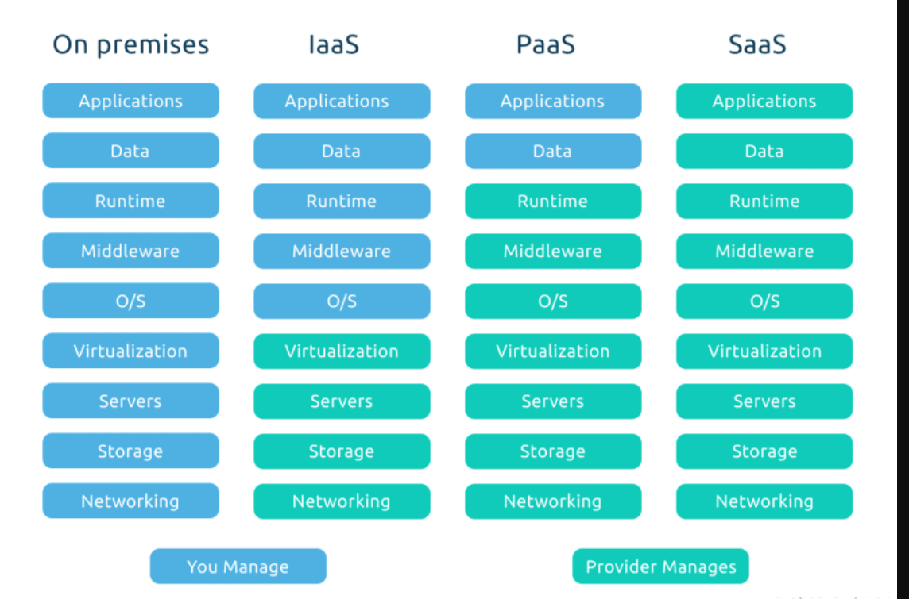
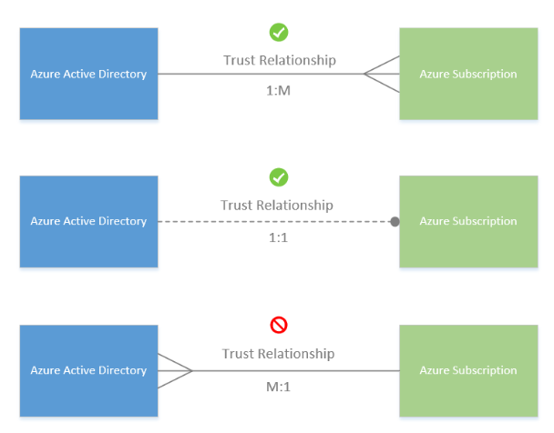
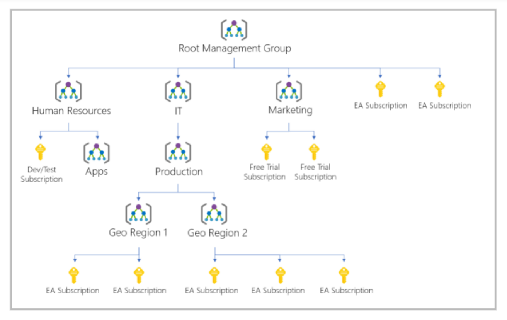

# AZ-900 Azure Fundamentals Certificate Preparation


!!! abstract "Notes taken from several sources, including:"
    - [The Microsoft e-learn platform](https://learn.microsoft.com/en-us/credentials/certifications/azure-fundamentals/).
    - Book:  ["Microsoft Certified - Azure Fundamentals. Study guide", by Jim Boyce](https://www.amazon.com/Microsoft-Certified-Azure-Fundamentals-Study/dp/1119770920). 
    - Udemy course: [AZ-900 Bootcamp: Microsoft Azure Fundamentals](https://www.udemy.com/course/az-900-azure-exam-prep-understanding-cloud-concepts/).
    - Udemy course: [AZ-900 Microsoft Azure Fundamentals Practice Tests, Sep 2023](https://www.udemy.com/course/microsoft-azure-fundamentals-practice-tests-az900/)
    - Linkedin course: [Exam tips: Microsoft Azure Fundamentals (AZ-900)]() 


??? abstract "Labs and resources"
	- [All labs](https://labitpro.com/microsoft-azure-labs/).
	- [Deploy a file share in Microsoft Azure](https://labitpro.com/deploy-a-file-share-in-azure/)
	- [Deploy a virtual network in Microsoft Azure](https://labitpro.com/deploy-a-virtual-network-in-microsoft-azure/)
	- [Provision a resource group in Azure](https://labitpro.com/provision-a-resource-group-in-azure/ 
	- [Deploy and configure an Azure Virtual Machine](https://labitpro.com/deploy-and-configure-an-azure-virtual-machine/)
	- [Deploy and configure an Azure Storage Account](https://labitpro.com/deploy-and-configure-an-azure-storage-account/)
	- [Deploy and configure a network security group](https://labitpro.com/deploy-and-configure-an-nsg-in-azure/)
	- [Deploy and configure Azure Bastion](https://labitpro.com/deploy-and-configure-azure-bastion/
	- [Add a Custom Domain to Azure AD](https://www.labitpro.com/wp-content/Udemy/AZ900/AddCustomDomaintoAzureAD)
	- [Create Users and Groups in Azure AD](https://www.labitpro.com/wp-content/Udemy/AZ900/CreateUsersandGroupsinAzureAD)
	- [Configure Self-Service Password Reset in Azure AD](https://www.labitpro.com/wp-content/Udemy/AZ900/ConfigureSSPRinAzureAD)
	- [Create and Configure an Azure Storage Account](https://www.labitpro.com/wp-content/Udemy/AZ900/CreateStorageAccount)
	- [Manage Azure Storage Account Access Keys](https://www.labitpro.com/wp-content/Udemy/AZ900/ManageAccessKeys)
	- [Create an Azure File Share](https://www.labitpro.com/wp-content/Udemy/AZ900/CreateAnAzureFileShare)
	- [Create and Attach a VM Data Disk](https://www.labitpro.com/wp-content/Udemy/AZ900/CreateAndAttachDataDisk)
	- [Resize an Azure Virtual Machine](https://www.labitpro.com/wp-content/Udemy/AZ900/ResizeAzureVM)
	- [Create a VM Scale Set in Azure](https://www.labitpro.com/wp-content/Udemy/AZ900/CreateVMScaleSetInAzure)
	- [Configure vNet Peering](https://www.labitpro.com/wp-content/Udemy/AZ900/ConfigurevNetPeeringinAzure)
	- [Create and Configure an Azure Recovery Services Vault](https://www.labitpro.com/wp-content/Udemy/AZ900/AzureRecoveryServicesVault)
	- [Managing Users and Groups in Azure AD](https://www.labitpro.com/wp-content/Udemy/AZ900/ManageUsersAndGroupsinAzureAD)
	- Practice with a [mock exam](https://www.tomteachesit.com/az-900-mock-exam/).
	- [AZ-900 crossword puzzle](https://www.tomteachesit.com/az-900-crossword-puzzle-fun/) 
	- [Flashcards](https://www.tomteachesit.com/az-900-flashcar


## Basic Cloud Computing concepts


### Shared responsability model 




Very often, IaaS, PaaS and SaaS are referred as Cloud computing stack because esencially they are built on top one from another. 

### Cloud models

#### Public cloud 

In a public cloud deployment, services are offered over the public internet. These services are available to customers who wish to purchase them. The cloud resources, like servers and storage, are owned and operated by the cloud service provider. 

#### Private cloud 

In a private cloud, compute resources are accessed exclusively by users from a single business or organization. You can host a private cloud physically in your own on-prem datacenter, or it can be hosted by a third-party cloud service provider. 

#### Hybrid cloud 

A hybrid cloud is a complex computing environment. It combines a public cloud and a private cloud by allowing data and applications to be shared between them. This type of cloud deployment is often utilized by large organizations.

### Consumption-Based Model

The consumption-based model refers to the way in which organizations only pay for the resources they use. The consumption-based model offers the following benefits: 

• No upfront costs 
• No need to purchase or manage infrastructure 
• Customer pays for resources only when they are needed 
• Customer can stop paying for resources that are no longer needed

### Benefits of Cloud Computing

Cloud computing offers several key advantages over a physical environment: 

• High availability: Cloud-based apps can provide a continuous user experience with virtually no downtime. 
• Scalability: Apps in the cloud can scale vertically and horizontally. When scaling vertically, compute capacity is added by adding RAM or CPUs to a virtual machine. When scaling horizontally, compute capacity is increased by adding instances of resources, such as adding VMs to a configuration. 
• Elasticity: Allows you to configure apps to autoscale so they always have the resources they need. 
• Agility: Deploy and configure cloud-based resources quickly as requirements change. 
• Geo-distribution: Deploy apps to regional datacenters so that customers always have the best performance in their specific region. 
• Disaster recovery: Cloud-based backup services, data replication, and geo-distribution allow you to deploy apps and know that their data is safe in the event of disaster. 

### Capital Expenses vs. Operating Expenses 

Organizations have to think about two different types of expenses: 

• Capital Expenditure (CapEx): The spending of money up-front on physical infrastructure. These expenses are deducted over time. 
• Operational Expenditure (OpEx): The spending of money on services or products now and being billed for them now. These expenses are deducted in the same year they are incurred. Most cloud services are considered OpEx.

### The Cloud Computing stack


#### Infrastructure-as-a-Service (IaaS)

Migrating to IaaS helps reduce the need for maintenance of on-prem data centers and allows organizations to save money on hardware costs. IaaS solutions allow organizations to scale their IT resources up and down with demand, while also allowing them to quickly provision new applications and increase the reliability of their underlying infrastructure.

**1.** One common business scenario and use case for IaaS is **Lift-and-Shift Migration**:
- migrate app and workloads to the cloud
- Increase scale and perfomance
- Enhance security
- Reduce the cost without refactoring the application

**2.** Another common use case is **Storage, backup, and recovery**:
- Avoid capital outlay for storage and complexity of storage management
- IaaS is useful for handling unpredictable demand and steadily growing storage needs
- Simplify planning/management of backup/recovery

**3.** **Web apps**
IaaS provides all the infraestructure needed to support web apps: storage, web and application servers, networking resources. Quickly deployable, easily scale infraestructure up and down.

**4.** **High-performance computer**

#### Platform-as-a-Service (PaaS)

Basically, PaaS is a complete development and deployment environment in the cloud. Includes: servers, storage, networking, middleware, development tools, BI services, database management systems, and more. PaaS supports the complete web application lifecycle.  Yo manage the applications and services and the service provider manages everything else.

Platform-as-a-Service is a complete development and deployment environment in the cloud. It can be used to deploy simple cloud-based apps and complex cloud-enabled enterprise applications. When leveraging PaaS, you purchase the resources you need from your cloud service provider on a pay-as-yougo basis. The resource you purchase are accessed over a secure Internet connection.

PaaS resources include the same resources included in IaaS (servers, storage, and networking) PLUS things like middleware, development tools, business intelligence services, and database management systems.

It’s important to remember that PaaS is designed to support the complete web application lifecycle. It allows organizations to avoid the expense buying and managing software licenses, underlying infrastructure and middleware, container orchestrators, and development tools. 

Ultimately, when leveraging PaaS offerings, you manage the applications and services, while the cloud service provider manages everything else.

**1.**  One common business scenario and use case for PaaS is **Development framework**. A framework that developers can use to develop or customize cloud based applications and that Azure provides.

**2.** **Analytics and BI**: tools provided as a service with PaaS.


#### Software-as-a-Service (SaaS)

Software-as-a-Service allows users to connect to cloud-based apps over the Internet. Microsoft Office 365 is a good example of SaaS in action. Gmail would be another good example. SaaS provides a complete software solution that’s purchased on a pay-as-you-go basis from a cloud service provider. It’s essentially the rental of an app, that users can then connect to over the Internet, via a web browser. The underlying infrastructure, middleware, app software, and app data for a SaaS solution are all hosted in the provider’s data center, which means the service provider is responsible for managing the hardware and software. SaaS allows organizations to get up and running quickly, with minimal upfront cost.

## Architectural components

The core architectural components of Azure may be broken down into two main groupings: the physical infrastructure, and the management infrastructure.

### Physical infrastructure

The physical infrastructure for Azure starts with datacenters. Conceptually, the datacenters are the same as large corporate datacenters. They’re facilities with resources arranged in racks, with dedicated power, cooling, and networking infrastructure.  Individual datacenters aren’t directly accessible. Datacenters are grouped into Azure Regions or Azure Availability Zones

#### Azure Region

A region is a geographical area that contains at least one (but potentially multiple) datacenters that are networked together with a low-latency network.

Every Azure region is paired with another region within the same geography (ie. US, Europe, or Asia) at least 300 miles away in order to allow replication of resources across that geography. Replicating resources across region pairs helps reduce interruptions due to events like natural disasters, civil unrest, power outages, or physical network outages that affect both regions at once.

Some services or features are only available in certain regions. Others don't require to select an specific region. For instance: Azure Active Directory, Azure Traffic Manager, or Azure DNS.


#### Availability zones

Availability zones are physically separate datacenters within an Azure region. Each availability zone is made up of one or more datacenters equipped with independent power, cooling, and networking.

Availability zones are physically separate datacenters within an Azure region. Every availability zone includes one or more datacenters that features independent power, cooling, and networking. In essence, an availability zone is designed to be an isolation boundary, meaning if one zone goes down, the other continues working.  

Availability zones are designed primarily for VMs, managed disks, load balancers, and SQL databases.   It is important to remember that availability zones are connected through private high-speed fiber-optic networks. The image below shows what availability zones look like within a region: 


To ensure resiliency, a minimum of three separate availability zones are present in all availability zone-enabled regions. However, not all Azure Regions currently support availability zones.

Azure services that support availability zones fall into three categories:

- Zonal services: You pin the resource to a specific zone (for example, VMs, managed disks, IP addresses).
- Zone-redundant services: The platform replicates automatically across zones (for example, zone-redundant storage, SQL Database).
- Non-regional services: Services are always available from Azure geographies and are resilient to zone-wide outages as well as region-wide outages.

#### Region pairs

Each Azure region is paired with another region within the same geography at least 300 miles away. This is done to allow for the replication of resources across a geography and reduce the chance of unavailability. West US region is, for instance, paired with East US.

If an outage occurs:  one region is prioritized to make sure that at least one is restored as quickly as possible. It also does so to minimize downtime.  Data continues to reside within the same geography as its pair (except for Brazil South) for tax -and law- enforcement jurisdiction purposes.

> Most regions are paired in two directions, meaning they are the backup for the region that provides a backup for them (West US and East US back each other up). However, some regions, such as West India and Brazil South, are paired in only one direction. In a one-direction pairing, the Primary region does not provide backup for its secondary region. So, even though West India’s secondary region is South India, South India does not rely on West India. West India's secondary region is South India, but South India's secondary region is Central India. Brazil South is unique because it's paired with a region outside of its geography. Brazil South's secondary region is South Central US. The secondary region of South Central US isn't Brazil South.


**Sovereign regions**

>In addition to regular regions, Azure also has sovereign regions. Sovereign regions are instances of Azure that are isolated from the main instance of Azure. You may need to use a sovereign region for compliance or legal purposes. Azure sovereign regions include:
>	- US DoD Central, US Gov Virginia, US Gov Iowa and more: These regions are physical and logical network-isolated instances of Azure for U.S. government agencies and partners. These datacenters are operated by screened U.S. personnel and include additional compliance certifications.
>	- China East, China North, and more: These regions are available through a unique partnership between Microsoft and 21Vianet, whereby Microsoft doesn't directly maintain the datacenters.


### Management infrastructure
#### Azure Resources and Resource Groups 

A resource is the basic building block of Azure. Anything you create, provision, deploy, etc. is a resource. Virtual Machines (VMs), virtual networks, databases, cognitive services, etc. are all considered resources within Azure.

Resource groups are simply groupings of resources. When you create a resource, you’re required to place it into a resource group. While a resource group can contain many resources, a single resource can only be in one resource group at a time. Some resources may be moved between resource groups, but when you move a resource to a new group, it will no longer be associated with the former group. Additionally, resource groups can't be nested, meaning you can’t put resource group B inside of resource group A.

If you grant or deny access to a resource group, you’ve granted or denied access to all the resources within the resource group. When deleting a resource group, all resources included in it  will be deleted, so it makes sense to organized your resource groups by similar lifecycle, or by function.

A resource group can be used to scope access control for administrative actions. To manage a resource group, you can assign [Azure Policies](https://learn.microsoft.com/en-us/azure/governance/policy/overview), [Azure roles](https://learn.microsoft.com/en-us/azure/role-based-access-control/role-assignments-portal), or [resource locks](https://learn.microsoft.com/en-us/azure/azure-resource-manager/management/lock-resources).

You can [apply tags](https://learn.microsoft.com/en-us/azure/azure-resource-manager/management/tag-resources) to a resource group. The resources in the resource group don't inherit those tags.

You can deploy up to 800 instances of a resource type in each resource group. Some resource types are [exempt from the 800 instance limit](https://learn.microsoft.com/en-us/azure/azure-resource-manager/management/resources-without-resource-group-limit). For more information, see [resource group limits](https://learn.microsoft.com/en-us/azure/azure-resource-manager/management/azure-subscription-service-limits#resource-group-limits).

When you create a resource group, you need to provide a location for that resource group. You may be wondering, "Why does a resource group need a location? And, if the resources can have different locations than the resource group, why does the resource group location matter at all?". The resource group stores metadata about the resources. When you specify a location for the resource group, you're specifying where that metadata is stored. For compliance reasons, you may need to ensure that your data is stored in a particular region. If a resource group's region is temporarily unavailable, you can't update resources in the resource group because the metadata is unavailable.

#### Azure Subscription

An Azure subscription provides authenticated and authorized access to Azure products and services and allows organizations to provision cloud resources. Every Azure subscription links to an Azure account. 

In Azure, subscriptions are a unit of management, billing, and scale.

An account can have multiple subscriptions, but it’s only required to have one. In a multi-subscription account, you can use the subscriptions to configure different billing models and apply different access-management policies. 

You can use Azure subscriptions to define boundaries around Azure products, services, and resources. There are two types of subscription boundaries that you can use:

- **Billing boundary**: This subscription type determines how an Azure account is billed for using Azure. You can create multiple subscriptions for different types of billing requirements. Azure generates separate billing reports and invoices for each subscription so that you can organize and manage costs.
- **Access control boundary**: Azure applies access-management policies at the subscription level, and you can create separate subscriptions to reflect different organizational structures. An example is that within a business, you have different departments to which you apply distinct Azure subscription policies. This billing model allows you to manage and control access to the resources that users provision with specific subscriptions. 

**Use cases** for creating additional subscriptions:

- **To separate Environments**: separate environments for development and testing, security, or to isolate data for compliance reasons. This design is particularly useful because resource access control occurs at the subscription level.
- **To separate Organizational structures**:  you could limit one team to lower-cost resources, while allowing the IT department a full range. This design allows you to manage and control access to the resources that users provision within each subscription.
- **To separate Billing**: For instance, you might want to create one subscription for your production workloads and another subscription for your development and testing workloads.

After you've created an Azure account, you're free to create additional subscriptions. After you've created an Azure suscription, you can start creating Azure resources within each subscription.


You can have up to 2000 role assignments in each subscription.

Each Azure Subscription can not trust multiple Active Directories. An Azure subscription has a trust relationship with Azure Active Directory (Azure AD). A subscription trusts Azure AD to authenticate users, services, and devices. Multiple subscriptions can trust the same Azure AD directory. Each subscription can only trust a single directory.




#### Management Groups in Azure 

To efficiently manage access, policies (like available regions), and compliance when you manage multiple Azure subscriptions, you can use Management Groups, because management groups provide scope that sits above subscriptions.  

When managing multiple subscriptions, you organize those subscriptions into containers called management groups, to  which you can then apply governance conditions. All subscriptions within a management group will, in turn, inherit the conditions you apply to the management group.  

All subscriptions within a single management group must trust the same Azure AD tenant.

The image below highlights how you can create a hierarchy for governance through the use of management groups: 



Some examples of how you could use management groups might be:

- **Create a hierarchy that applies a policy**. 
- **Provide user access to multiple subscriptions**. 


Facts we need to know:

- Maximum of 10,000 management groups supported in a single directory.
- A management group tree can support up to six levels of depth (root and subscription level not included)
- Each management group and subscription can support only one parent.

#### Tags

One way to organize related resources is to place them in their own subscriptions. You can also use resource groups to manage related resources. Resource tags are another way to organize resources. Tags provide extra information, or metadata, about your resources. A resource tag consists of a name and a value. You can assign one or more tags to each Azure resource. Keep in mind that you don't need to enforce that a specific tag is present on all of your resources. 

|**Name**|**Value**|
|---|---|
|AppName|The name of the application that the resource is part of.|
|CostCenter|The internal cost center code.|
|Owner|The name of the business owner who's responsible for the resource.|
|Environment|An environment name, such as "Prod," "Dev," or "Test."|
|Impact|How important the resource is to business operations, such as "Mission-critical," "High-impact," or "Low-impact."|

**How do I manage resource tags?**

You can add, modify, or delete resource tags through Windows PowerShell, the Azure CLI, Azure Resource Manager templates, the REST API, or the Azure portal. 

You can also use Azure Policy to enforce tagging rules and conventions. 

**Resources don't inherit tags from subscriptions and resource group**s, meaning that you can apply tags at one level and not have those tags automatically show up at a different level, allowing you to create custom tagging schemas that change depending on the level (resource, resource group, subscription, and so on).

**Limitations to tags:**

- Not all resource types support tags.
- Maximum of 50 tags (for Resource Groups and Resources).
	-  Tag name length: 512 characters.
	- Tag value length: 256 characters.
- Maximum of 15 tags for storage accounts.
	- Tag name length: 128 characters.
	- Tag value length: 256 characters.
VM and VM scale sets: total set of 2048 character


## Azure Compute services and products

Azure compute is an on-demand computing service that organizations use to run cloud-based applications. It provides compute resources like disks, processors, memory, networking, and even operating systems. Azure supports many types of compute solutions, including Linux, Windows Server, SQL Server, Oracle, IBM, and SAP. Each Azure compute service offers different options depending on your requirements. The most common Azure compute services are:

- 1. Azure Virtual Machines 
	- VM Scale Sets 
	- VM Availability Sets
- 2. Azure Virtual Desktop 
- 3. Azure Container Instances 
- 4. Azure Functions (serverless computing)
- 5. Azure Logic Apps  (serverless computing)
- 6. Azure App Service 
- 7. Azure Virtual Networking
- 8. Azure Virtual Private Networks
- 9. Azure ExpressRoute
- 10. Azure DNS

### 1. Azure Virtual Machines

Virtual machines are virtual versions of physical computers that feature virtual processors, memory, storage, and networking resources. They host an operating system just like a physical computer, and you can install and run software on them just like a physical computer. 

VM provides IaaS and can be used in two ways:

- When you need total control over an operating system /environment, VMs are ideal when using in-house or customized software.


**SLA for Virtual Machines**
  
- For all Virtual Machines that have two or more instances deployed across two or more Availability Zones in the same Azure region, we guarantee you will have Virtual Machine Connectivity to at least one instance at least 99.99% of the time.
    
- For all Virtual Machines that have two or more instances deployed in the same Availability Set or in the same Dedicated Host Group, we guarantee you will have Virtual Machine Connectivity to at least one instance at least 99.95% of the time.
    
- For any Single Instance Virtual Machine using Premium SSD or Ultra Disk for all Operating System Disks and Data Disks, we guarantee you will have Virtual Machine Connectivity of at least 99.9%.
    
- For any Single Instance Virtual Machine using Standard SSD Managed Disks for Operating System Disk and Data Disks, we guarantee you will have Virtual Machine Connectivity of at least 99.5%.
    
- For any Single Instance Virtual Machine using Standard HDD Managed Disks for Operating System Disks and Data Disks, we guarantee you will have Virtual Machine Connectivity of at least 95%.


#### Virtual Machine Scale Sets 

Azure can also manage the grouping of VMs for you with features such as scale sets and availability sets. A virtual machine scale set allows you to deploy and manage a set of identical VMs that you can use to deploy solutions with true autoscale. As demand increases, VM instances can be added.

#### Virtual machine availability sets

Virtual machine availability sets are another tool to  ensure that VMs stagger updates and have varied power and network connectivity, preventing you from losing all your VMs with a single network or power failure.

Availability sets do this by grouping VMs in two ways: update domain and fault domain.

- **Update domain**: The update domain groups VMs that can be rebooted at the same time. 
- **Fault domain**: The fault domain groups your VMs by common power source and network switch. By default, an availability set will split your VMs across up to three fault domains. This helps protect against a physical power or networking failure by having VMs in different fault domains.

There’s no additional cost for configuring an availability set. You only pay for the VM instances you create.

When to use VMs: During testing and development, When running applications in the cloud, When extending your datacenter to the cloud, During disaster recovery.

### 2. Azure Virtual Desktop

Azure Virtual Desktop is a desktop and application virtualization service that runs on the cloud. It enables you to use a cloud-hosted version of Windows from any location. Azure Virtual Desktop provides centralized security management for users' desktops with Azure Active Directory (Azure AD). You can enable multifactor authentication to secure user sign-ins. You can also secure access to data by assigning granular role-based access controls (RBACs) to users.  With Azure Virtual Desktop, the data and apps are separated from the local hardware. The actual desktop and apps are running in the cloud, meaning the risk of confidential data being left on a personal device is reduced. Azure Virtual Desktop lets you use Windows 10 or Windows 11 Enterprise multi-session, the only Windows client-based operating system that enables multiple concurrent users on a single VM.

### 3. Azure Container Instances 

Much like running multiple virtual machines on a single physical host, you can run multiple containers on a single physical or virtual host.  Virtual machines appear to be an instance of an operating system that you can connect to and manage.

**VM vs Containers**

VM virtualizes the hardware emulating a computer. Containers virtualizes the Operating System. Unlike virtual machines, you don't manage the operating system for a container. Containers are a virtualization environment. If you need complete control, you use VM. On the other hands, Container priorizes portability and performance.

#### Azure Container Instances (ACI)

Azure Container Instances offer the fastest and simplest way to run a container in Azure; without having to manage any virtual machines or adopt any additional services. Azure Container Instances are a platform as a service (PaaS) offering. Azure Container Instances allow you to upload your containers and then the service will run the containers for you.

**Azure Container Instances ACI versus Azure Kubernetes service  AKS**

For many organizations, containers have become the preferred way to package, deploy, and manage cloud apps. 

- Azure Container Instances (ACI) is the easiest way to run a container in Azure, without the need for any VMs or other infrastructure.  You can use docker images.
- However, if you require full container orchestration, Microsoft  recommends Azure Kubernetes Service (AKS). 
#### Azure Container Apps

Azure Container Apps are similar in many ways to a container instance. They allow you to get up and running right away, they remove the container management piece, and they're a PaaS offering. Container Apps have extra benefits such as the ability to incorporate load balancing and scaling. These other functions allow you to be more elastic in your design.

#### Azure Kubernetes Service (AKS)

Azure Kubernetes Service (AKS) is a container orchestration service. An orchestration service manages the lifecycle of containers. When you're deploying a fleet of containers, AKS can make fleet management simpler and more efficient.

AKS simplifies the deployment of a managed Kubernetes cluster in Azure by offloading the operational overhead to Azure. Since it’s hosted, Azure handles the health monitoring and maintenance. The Kubernetes masters are managed by Azure, and you manage and maintain the agent nodes.  
 
It’s important to note that AKS itself is free. You pay only for the agent nodes within your clusters, not for the masters. 

You can deploy an AKS cluster using  Azure CLI, Azure Portal, Azure Powershell, and Template-driven deployment options  (ARM templates, bicep, terraform).

### 4. Azure Functions (serverless computing)

Functions are a serverless technology that are best used in cases where you're concerned only about the code running your service and not the underlying platform or infrastructure.

Azure Functions is an event-driven, serverless compute option that doesn’t require maintaining virtual machines or containers. If you build an app using VMs or containers, those resources have to be “running” in order for your app to function. With Azure Functions, an event wakes the function, alleviating the need to keep resources provisioned when there are no events.

Benefits:
- No infraestructure management: as a business you don't have to focus on administrative tasks.
- Scalability.
- You only pay for what you use. Price based on consumption: number of executions + runnign time for each.

Functions are commonly used when you need to perform work in response to an event (often via a REST request), timer, or message from another Azure service. Azure Functions runs your code when it's triggered and automatically deallocates resources when the function is finished. In this model, you're only charged for the CPU time used while your function runs. Functions can be either stateless or stateful. When they're stateless (the default), they behave as if they're restarted every time they respond to an event. When they're stateful (called Durable Functions), a context is passed through the function to track prior activity.

Generally, Azure Functions is stateless. BUT you can use an extension called Durable Functions to chain together functions and maintain their state while the functions are executing.

### 5. Azure Logic Apps  (serverless computing)

When you need something more complex than Functions, like a workflow or a process, Azure Logic Apps is a good solution. It enables you to create no-code and low-code solutions hosted in Azure to automate and orchestrate tasks, business processes, and workflows. 

Implementation can be done using a web-based design environment. You build the app by connecting triggers to actions with various connections. 

Price based on consumption: number of executions + type of connections that the app uses.

### 6. Azure App Service

App Service is a compute platform that you can use to quickly build, deploy, and scale enterprise grade web apps, background jobs, mobile back-ends, and RESTful APIs in the programming language of your choice (it supports multiple languages, including .NET, .NET Core, Java, Ruby, Node.js, PHP, or Python) without managing infrastructure (it also supports both Windows and Linux environments).

App service is a PaaS offering. It offers automatic scaling and high availability. It enables automated deployments from GitHub, Azure DevOps, or any Git repo to support a continuous deployment model.

App Service handles most of the infrastructure decisions you deal with in hosting web-accessible apps:

- Deployment and management are integrated into the platform.
- Endpoints can be secured.
- Sites can be scaled quickly to handle high traffic loads.
- The built-in load balancing and traffic manager provide high availability.

#### Web apps

App Service includes full support for hosting web apps by using ASP.NET, ASP.NET Core, Java, Ruby, Node.js, PHP, or Python. You can choose either Windows or Linux as the host operating system.

#### API apps (Azure Rest API)

Much like hosting a website, you can build REST-based web APIs by using your choice of language and framework. You get full Swagger support and the ability to package and publish your API in Azure Marketplace. The produced apps can be consumed from any HTTP- or HTTPS-based client.

#### WebJobs

You can use the WebJobs feature to run a program (.exe, Java, PHP, Python, or Node.js) or script (.cmd, .bat, PowerShell, or Bash) in the same context as a web app, API app, or mobile app. They can be scheduled or run by a trigger. WebJobs are often used to run background tasks as part of your application logic.

#### Mobile apps

Use the Mobile Apps feature of App Service to quickly build a back end for iOS and Android apps. With just a few actions in the Azure portal, you can store mobile app data in a cloud-based SQL database; authenticate customers against common social providers, such as MSA, Google, Twitter, and Facebook; send push notifications; execute custom back-end logic in C# or Node.js.

On the mobile app side, there's SDK support for native iOS and Android, Xamarin, and React native apps.

- Access, manage, monitor Azure accounts and resources.
- Monitor the health and status of Azure resources, check for alerts, diagnose and fix issues.
- Stop, start, restart a web app or virtual machine.  
- Run the Azure CLI or Azure PowerShell commands to manage Azure resources. 

#### Azure Advisor

Free service for tracking Azure consumption and getting offers recommendations not only for cost savings but also for performance, reliability, and security, 

#### ARM templates 

ARM templates allow you to declaratively describe the resources you want to use, using JSON format. The template will then create those resources in parallel. For example, need 25 VMs, all 25 VMs will be created at the same time. 

### 7. Azure Virtual Networking

Azure virtual networks and virtual subnets enable Azure resources, such as VMs, web apps, and databases, to communicate with each other, with users on the internet, and with your on-premises client computers. 

Azure virtual networking supports both public and private endpoints to enable communication between external or internal resources with other internal resources.

- Public endpoints have a public IP address and can be accessed from anywhere in the world.
- Private endpoints exist within a virtual network and have a private IP address from within the address space of that virtual network.

It provides the following key networking capabilities: 

**Isolation and segmentation**: Azure virtual network allows you to create multiple isolated virtual networks. For name resolution, you can use the name resolution service that's built into Azure. You also can configure the virtual network to use either an internal or an external DNS server.

**Internet communications**: You can enable incoming connections from the internet by assigning a public IP address to an Azure resource, or putting the resource behind a public load balancer.

**Communicate between Azure resources**: Enable Azure resources to communicate securely with each other. Virtual networks can connect not only VMs but other Azure resources. Service endpoints can connect to other Azure resource types.

**Communicate with on-premises resources**: Azure virtual networks enable you to link resources together in your on-premises environment and within your Azure subscription.
	- Point-to-site virtual private network connections are from a computer outside your organization back into your corporate network. In this case, the client computer initiates an encrypted VPN connection to connect to the Azure virtual network.
	- Site-to-site virtual private networks link your on-premises VPN device or gateway to the Azure VPN gateway in a virtual network. In effect, the devices in Azure can appear as being on the local network. The connection is encrypted and works over the internet.
	- Azure ExpressRoute provides a dedicated private connectivity to Azure that doesn't travel over the internet. ExpressRoute is useful for environments where you need greater bandwidth and even higher levels of security.

**Route network traffic**: By default, Azure routes traffic between subnets on any connected virtual networks, on-premises networks, and the internet. Route tables allow you to define rules about how traffic should be directed. Border Gateway Protocol (BGP) works with Azure VPN gateways, Azure Route Server, or Azure ExpressRoute to propagate on-premises BGP routes to Azure virtual networks.

**Filter network traffic**: filter traffic between subnets.
- Network security groups are Azure resources that can contain multiple inbound and outbound security rules. You can define these rules to allow or block traffic, based on factors such as source and destination IP address, port, and protocol.
- Network virtual appliances are specialized VMs that can be compared to a hardened network appliance. A network virtual appliance carries out a particular network function, such as running a firewall or performing wide area network (WAN) optimization.

**Connect virtual networks**:  You can link virtual networks together by using virtual network peering. Peering allows two virtual networks to connect directly to each other. Network traffic between peered networks is private, and travels on the Microsoft backbone network, never entering the public internet. Peering enables resources in each virtual network to communicate with each other. These virtual networks can be in separate regions, which allows you to create a global interconnected network through Azure.

User-defined routes (UDR) allow you to control the routing tables between subnets within a virtual network or between virtual networks. This allows for greater control over network traffic flow.


### 8. Azure Virtual Private Networks

A virtual private network (VPN) uses an encrypted tunnel within another network. VPNs are typically deployed to connect two or more trusted private networks to one another over an untrusted network (typically the public internet). Traffic is encrypted while traveling over the untrusted network to prevent eavesdropping or other attacks. VPNs can enable networks to safely and securely share sensitive information.

#### Azure VPN Gateway instances

Azure VPN Gateway instances are deployed in a dedicated subnet of the virtual network and enable the following connectivity:
- Connect on-premises datacenters to virtual networks through a site-to-site connection.
- Connect individual devices to virtual networks through a point-to-site connection.
- Connect virtual networks to other virtual networks through a network-to-network connection.

When setting up a VPN gateway, you must specify the type of VPN - either policy-based or route-based:

- **Policy-based VPN gateways** specify statically the IP address of packets that should be encrypted through each tunnel. This type of device evaluates every data packet against those sets of IP addresses to choose the tunnel where that packet is going to be sent through.
- In** Route-based gateways**, IPSec tunnels are modeled as a network interface or virtual tunnel interface. IP routing (either static routes or dynamic routing protocols) decides which one of these tunnel interfaces to use when sending each packet. Route-based VPNs are the preferred connection method for on-premises devices. They're more resilient to topology changes such as the creation of new subnets.

Use a route-based VPN gateway if you need any of the following types of connectivity:

- Connections between virtual networks
- Point-to-site connections
- Multisite connections
- Coexistence with an Azure ExpressRoute gateway


There are a few ways to maximize the resiliency of your VPN gateway:

**Active/standby**: By default, VPN gateways are deployed as two instances in an active/standby configuration, even if you only see one VPN gateway resource in Azure. When planned maintenance or unplanned disruption affects the active instance, the standby instance automatically assumes responsibility for connections without any user intervention.

**Active/active**: With the introduction of support for the BGP routing protocol, you can also deploy VPN gateways in an active/active configuration. In this configuration, you assign a unique public IP address to each instance. You then create separate tunnels from the on-premises device to each IP address. 

**ExpressRoute failover**: Another high-availability option is to configure a VPN gateway as a secure failover path for ExpressRoute connections. ExpressRoute circuits have resiliency built in. However, they aren't immune to physical problems that affect the cables delivering connectivity or outages that affect the complete ExpressRoute location. 

**Zone-redundant gateways**: In regions that support availability zones, VPN gateways and ExpressRoute gateways can be deployed in a zone-redundant configuration. This configuration brings resiliency, scalability, and higher availability to virtual network gateways.  These gateways require different gateway stock keeping units (SKUs) and use Standard public IP addresses instead of Basic public IP addresses.

### 9.  Azure ExpressRoute

Azure ExpressRoute lets you extend your on-premises networks into the Microsoft cloud over a private connection, with the help of a connectivity provider. This connection is called an ExpressRoute Circuit. These connection between Microsoft cloud services (such as Microsoft Azure and Microsoft 365) and the offices, datacenters, or other facilities would require its own ExpressRoute circuit.

ExpressRoute connections don't go over the public Internet. ExpressRoute is a private connection from your on-premises infrastructure to your Azure infrastructure. Even if you have an ExpressRoute connection, DNS queries, certificate revocation list checking, and Azure Content Delivery Network requests are still sent over the public internet.

- Connectivity to Microsoft cloud services across all regions in the geopolitical region.
- Global connectivity to Microsoft services across all regions with the ExpressRoute Global Reach.
- Dynamic routing between your network and Microsoft via Border Gateway Protocol (BGP).
- Built-in redundancy in every peering location for higher reliability.

ExpressRoute enables direct access to the following services in all regions:

- Microsoft Office 365
- Microsoft Dynamics 365
- Azure compute services, such as Azure Virtual Machines
- Azure cloud services, such as Azure Cosmos DB and Azure Storage

#### Features

**Global connectivity**: For example, say you had an office in Asia and a datacenter in Europe, both with ExpressRoute circuits connecting them to the Microsoft network. You could use ExpressRoute Global Reach to connect those two facilities, allowing them to communicate without transferring data over the public internet.

**Dynamic routing**: ExpressRoute uses the BGP. BGP is used to exchange routes between on-premises networks and resources running in Azure. This protocol enables dynamic routing between your on-premises network and services running in the Microsoft cloud.

**Built-in redundancy**: Each connectivity provider uses redundant devices to ensure that connections established with Microsoft are highly available. You can configure multiple circuits to complement this feature.

#### ExpressRoute connectivity models

ExpressRoute supports four models that you can use to connect your on-premises network to the Microsoft cloud:

**Co-location at a cloud exchange**: Your datacenter, office, or other facility is  physically co-located at a cloud exchange, such as an ISP. In this case, you can request a virtual cross-connect to the Microsoft cloud.

**Point-to-point Ethernet connection**: Point-to-point ethernet connection refers to using a point-to-point connection to connect your facility to the Microsoft cloud.

**Any-to-any networks**: With any-to-any connectivity, you can integrate your wide area network (WAN) with Azure by providing connections to your offices and datacenters. Azure integrates with your WAN connection to provide a connection like you would have between your datacenter and any branch offices.

**Directly from ExpressRoute sites**: You can connect directly into the Microsoft's global network at a peering location strategically distributed across the world. ExpressRoute Direct provides dual 100 Gbps or 10-Gbps connectivity, which supports Active/Active connectivity at scale.

### 10. Azure DNS

Azure DNS is a hosting service for DNS domains that provides name resolution by using Microsoft Azure infrastructure. By hosting your domains in Azure, you can manage your DNS records using the same credentials, APIs, tools, and billing as your other Azure services. Azure DNS can manage DNS records for your Azure services and provide DNS for your external resources as well. Applications that require automated DNS management can integrate with the service by using the REST API and SDKs.

Azure DNS is based on Azure Resource Manager, which provides features such as:

- Azure role-based access control (Azure RBAC) to control who has access to specific actions for your organization.
- Activity logs to monitor how a user in your organization modified a resource or to find an error when troubleshooting. 
- Resource locking to lock a subscription, resource group, or resource. Locking prevents other users in your organization from accidentally deleting or modifying critical resources.

Azure DNS also supports private DNS domains. This feature allows you to use your own custom domain names in your private virtual networks, rather than being stuck with the Azure-provided names.

Azure DNS also supports alias record sets. You can use an alias record set to refer to an Azure resource, such as an Azure public IP address, an Azure Traffic Manager profile, or an Azure Content Delivery Network (CDN) endpoint. 

You can't use Azure DNS to buy a domain name. For an annual fee, you can buy a domain name by using App Service domains or a third-party domain name registrar. Once purchased, your domains can be hosted in Azure DNS for record management.


## Azure Storage Services

### Intro

A storage account provides a unique namespace for your Azure Storage data that's accessible from anywhere in the world over HTTP or HTTPS. Data in this account is secure, highly available, durable, and massively scalable.  When you create your storage account, you’ll start by picking the storage account type. The type of account determines the storage services and redundancy options and has an impact on the use cases.


|**Type**|**Supported services**|**Redundancy Options**|**Usage**|
|---|---|---|---|
|Standard general-purpose v2|Blob Storage (including Data Lake Storage), Queue Storage, Table Storage, and Azure Files|LRS, GRS, RA-GRS, ZRS, GZRS, RA-GZRS|Standard storage account type for blobs, file shares, queues, and tables. Recommended for most scenarios using Azure Storage. If you want support for network file system (NFS) in Azure Files, use the premium file shares account type.|
|Premium block blobs|Blob Storage (including Data Lake Storage)|LRS, ZRS|Premium storage account type for block blobs and append blobs. Recommended for scenarios with high transaction rates or that use smaller objects or require consistently low storage latency.|
|Premium file shares|Azure Files|LRS, ZRS|Premium storage account type for file shares only. Recommended for enterprise or high-performance scale applications. Use this account type if you want a storage account that supports both Server Message Block (SMB) and NFS file shares.|
|Premium page blobs|Page blobs only|LRS|Premium storage account type for page blobs only.|

Some acronyms here:

- Locally redundant storage (LRS)
- Geo-redundant storage (GRS)
- Read-access geo-redundant storage (RA-GRS)
- Zone-redundant storage (ZRS)
- Geo-zone-redundant storage (GZRS)
- Read-access geo-zone-redundant storage (RA-GZRS)

**Storage account endpoints**:

The following table shows the endpoint format for Azure Storage services.

|**Storage service**|**Endpoint**|
|---|---|
| Blob Storage | https://\<storage-account-name\>.blob.core.windows.net |
| Data Lake Storage Gen2 | https://\<storage-account-name\>.dfs.core.windows.net |
| Azure Files | https://\<storage-account-name\>.file.core.windows.net |
| Queue Storage | https://\<storage-account-name\>.queue.core.windows.net |
| Table Storage | https://\<storage-account-name\>.table.core.windows.net |


Other data for the exam:

- Maximum capacity for storage accounts: 5 PB.
- Number of storage accounts per region per suscription: 250.
- Maximum number of virtual network rules and IP network rules allowed per storage account in Azure: 200
### Azure storage redundancy

Data in an Azure Storage account is always replicated three times in the primary region. Azure Storage offers two options for how your data is replicated in the primary region, locally redundant storage (LRS) and zone-redundant storage (ZRS).


#### Redundancy in the primary region

**Locally redundant storage (LRS)**

Locally redundant storage (LRS) replicates your data three times within a single data center in the primary region. LRS provides at least 11 nines of durability (99.999999999%) of objects over a given year. LRS is the lowest-cost redundancy option and offers the least durability compared to other options. LRS protects your data against server rack and drive failures. However, if a disaster such as fire or flooding occurs within the data center, all replicas of a storage account using LRS may be lost or unrecoverable. To mitigate this risk, Microsoft recommends using zone-redundant storage (ZRS), geo-redundant storage (GRS), or geo-zone-redundant storage (GZRS).


**Zone-redundant storage (ZRS)**

For Availability Zone-enabled Regions, zone-redundant storage (ZRS) replicates your Azure Storage data synchronously across three Azure availability zones in the primary region. ZRS offers durability for Azure Storage data objects of at least 12 nines (99.9999999999%) over a given year. With ZRS, your data is still accessible for both read and write operations even if a zone becomes unavailable. Microsoft recommends using ZRS in the primary region for scenarios that require high availability. ZRS is also recommended for restricting replication of data within a country or region to meet data governance requirements.


#### Redundancy in the secondary region

For applications requiring high durability, you can choose to additionally copy the data in your storage account to a secondary region that is hundreds of miles away from the primary region. If the data in your storage account is copied to a secondary region, then your data is durable even in the event of a catastrophic failure that prevents the data in the primary region from being recovered. When you create a storage account, you select the primary region for the account. The paired secondary region is based on Azure Region Pairs, and can't be changed.

By default, data in the secondary region isn't available for read or write access unless there's a failover to the secondary region. If the primary region becomes unavailable, you can choose to fail over to the secondary region. After the failover has completed, the secondary region becomes the primary region, and you can again read and write data.

Because data is replicated to the secondary region asynchronously, a failure that affects the primary region may result in data loss if the primary region can't be recovered. The interval between the most recent writes to the primary region and the last write to the secondary region is known as the recovery point objective (RPO). The RPO indicates the point in time to which data can be recovered. Azure Storage typically has an RPO of less than 15 minutes, although there's currently no SLA on how long it takes to replicate data to the secondary region.

Azure Storage offers two options for copying your data to a secondary region: geo-redundant storage (GRS) and geo-zone-redundant storage (GZRS). GRS is similar to running LRS in two regions, and GZRS is similar to running ZRS in the primary region and LRS in the secondary region.

**Geo-redundant storage (GRS)**

GRS copies your data synchronously three times within a single physical location in the primary region using LRS. It then copies your data asynchronously to a single physical location in the secondary region (the region pair) using LRS. GRS offers durability for Azure Storage data objects of at least 16 nines (99.99999999999999%) over a given year.


**Geo-zone-redundant storage** (GZRS)

GZRS combines the high availability provided by redundancy across availability zones with protection from regional outages provided by geo-replication. Data in a GZRS storage account is copied across three Azure availability zones in the primary region (similar to ZRS) and is also replicated to a secondary geographic region, using LRS, for protection from regional disasters. Microsoft recommends using GZRS for applications requiring maximum consistency, durability, and availability, excellent performance, and resilience for disaster recovery. GZRS is designed to provide at least 16 nines (99.99999999999999%) of durability of objects over a given year.


**Read access to data in the secondary region (RA-GRS)**

Geo-redundant storage (with GRS or GZRS) replicates your data to another physical location in the secondary region to protect against regional outages. However, that data is available to be read only if the customer or Microsoft initiates a failover from the primary to secondary region. However, if you enable read access to the secondary region, your data is always available, even when the primary region is running optimally. For read access to the secondary region, enable read-access geo-redundant storage (RA-GRS) or read-access geo-zone-redundant storage (RA-GZRS). Remember that the data in your secondary region may not be up-to-date due to RPO.


### Azure storage services

- 1. **Azure Blobs**: A massively scalable object store for text and binary data. Also includes support for big data analytics through Data Lake Storage Gen2.
- 2. **Azure Files**: Managed file shares for cloud or on-premises deployments.
- 3. **Azure Queues**: A messaging store for reliable messaging between application components.
- 4. **Azure Disks**: Block-level storage volumes for Azure VMs.
- 5. **Azure Tables:** NoSQL table option for structured, non-relational data.
#### Azure Blobs

To store massive amounts of data, such as text or binary data. Azure Blob storage is unstructured, meaning that there are no restrictions on the kinds of data it can hold. Blob storage is ideal for:

- Serving images or documents directly to a browser.
- Storing files for distributed access.
- Streaming video and audio.
- Storing data for backup and restore, disaster recovery, and archiving.
- Storing data for analysis by an on-premises or Azure-hosted service.

Objects in blob storage can be accessed from anywhere in the world via HTTP or HTTPS. Users or client applications can access blobs via URLs, the Azure Storage REST API, Azure PowerShell, Azure CLI, or an Azure Storage client library.

Azure Storage offers different access tiers for your blob storage:

- **Hot access tier**: Optimized for storing data that is accessed frequently (for example, images for your website).
- **Cool access tier**: Optimized for data that is infrequently accessed and stored for at least 30 days (for example, invoices for your customers).
- **Cold access tier**: Optimized for storing data that is infrequently accessed and stored for at least 90 days.
- **Archive access tier**: Appropriate for data that is rarely accessed and stored for at least 180 days, with flexible latency requirements (for example, long-term backups).

Some considerations:

- Hot, cool, and cold access tiers can be set at the account level. The archive access tier isn't available at the account level.
- Hot, cool, cold, and archive tiers can be set at the blob level, during or after upload.
- Data in the cool and cold access tiers can tolerate slightly lower availability, but still requires high durability, retrieval latency, and throughput characteristics similar to hot data. For cool and cold data, a lower availability service-level agreement (SLA) and higher access costs compared to hot data are acceptable trade-offs for lower storage costs.
- Archive storage stores data offline and offers the lowest storage costs, but also the highest costs to rehydrate and access data.

#### Azure Files

Azure File storage offers fully managed file shares in the cloud that are accessible via the industry standard Server Message Block (SMB) or Network File System (NFS) protocols. Azure Files file shares can be mounted concurrently by cloud or on-premises deployments. SMB Azure file shares are accessible from Windows, Linux, and macOS clients. NFS Azure Files shares are accessible from Linux or macOS clients. 

PowerShell cmdlets and Azure CLI can be used to create, mount, and manage Azure file shares as part of the administration of Azure applications. You can create and manage Azure file shares using Azure portal and Azure Storage Explorer.

Applications running in Azure can access data in the share via file system I/O APIs.  In addition to System IO APIs, you can use Azure Storage Client Libraries or the Azure Storage REST API.

#### Azure Queues

Azure Queue storage is a service for storing large numbers of messages. Once stored, you can access the messages from anywhere in the world via authenticated calls using HTTP or HTTPS. A queue can contain as many messages as your storage account has room for (potentially millions). Each individual message can be up to 64 KB in size. Queues are commonly used to create a backlog of work to process asynchronously.

Queue storage can be combined with compute functions like Azure Functions to take an action when a message is received. 
#### Azure Disks

Azure Disk storage, or Azure managed disks, are block-level storage volumes managed by Azure for use with Azure VMs. Conceptually, they’re the same as a physical disk, but they’re virtualized – offering greater resiliency and availability than a physical disk. 

#### Azure Tables

Azure Table storage stores large amounts of structured data. Azure tables are a NoSQL datastore that accepts authenticated calls from inside and outside the Azure cloud. 

### Azure data migration options

Azure Migrate is a service that helps you migrate from an on-premises environment to the cloud:
- Unified migration platform: A single portal to start, run, and track your migration to Azure.
- Range of tools: Azure Migrate also integrates with other Azure services and tools, and with independent software vendor (ISV) offerings.
- Assessment and migration: In the Azure Migrate hub, you can assess and migrate your on-premises infrastructure to Azure.

Tools to help with migration:
#### Azure Migrate: Discovery and assessment

Discover and assess on-premises servers running on VMware, Hyper-V, and physical servers in preparation for migration to Azure.

#### Azure Migrate: Server Migration

Migrate VMware VMs, Hyper-V VMs, physical servers, other virtualized servers, and public cloud VMs to Azure.

#### Data Migration Assistant

Data Migration Assistant is a stand-alone tool to assess SQL Servers. It helps pinpoint potential problems blocking migration. It identifies unsupported features, new features that can benefit you after migration, and the right path for database migration.

#### Azure Database Migration Service

Migrate on-premises databases to Azure VMs running SQL Server, Azure SQL Database, or SQL Managed Instances.

#### Azure App Service migration assistant

Azure App Service migration assistant is a standalone tool to assess on-premises websites for migration to Azure App Service. Use Migration Assistant to migrate .NET and PHP web apps to Azure.

#### Azure Data Box

Azure Data Box is a physical migration service that helps transfer large amounts of data in a quick, inexpensive, and reliable way. The secure data transfer is accelerated by shipping you a proprietary Data Box storage device that has a maximum usable storage capacity of 80 terabytes. The Data Box is transported to and from your datacenter via a regional carrier. A rugged case protects and secures the Data Box from damage during transit. You can order the Data Box device via the Azure portal to import or export data from Azure. Data Box is ideally suited to transfer data sizes larger than 40 TBs in scenarios with no to limited network connectivity.

**Use cases for importing data**: 
	- Onetime migration - when a large amount of on-premises data is moved to Azure.
	- Moving a media library from offline tapes into Azure to create an online media library.
	- Migrating your VM farm, SQL server, and applications to Azure.
	- Moving historical data to Azure for in-depth analysis and reporting using HDInsight.
	- Initial bulk transfer - when an initial bulk transfer is done using Data Box (seed) followed by incremental transfers over the network.
	- Periodic uploads - when large amount of data is generated periodically and needs to be moved to Azure.

 **Use cases for exporting data:**
	- Disaster recovery - when a copy of the data from Azure is restored to an on-premises network.
	- Security requirements - when you need to be able to export data out of Azure due to government or security requirements.
	- Migrate back to on-premises or to another cloud service provider - when you want to move all the data back to on-premises, or to another cloud service provider, export data via Data Box to migrate the workloads.

#### AzCopy

In addition to large scale migration using services like Azure Migrate and Azure Data Box, Azure also has tools designed to help you move or interact with individual files or small file groups.

AzCopy is a command-line utility that you can use to copy blobs or files to or from your storage account. Synchronizing blobs or files with AzCopy is one-direction synchronization. When you synchronize, you designated the source and destination, and AzCopy will copy files or blobs in that direction. It doesn't synchronize bi-directionally based on timestamps or other metadata.

#### Azure Storage Explorer

In addition to large scale migration using services like Azure Migrate and Azure Data Box, Azure also has tools designed to help you move or interact with individual files or small file groups.

Azure Storage Explorer is a standalone app that provides a graphical interface to manage files and blobs in your Azure Storage Account. It works on Windows, macOS, and Linux operating systems and uses AzCopy on the backend to perform all of the file and blob management tasks.
#### Azure File Sync

In addition to large scale migration using services like Azure Migrate and Azure Data Box, Azure also has tools designed to help you move or interact with individual files or small file groups.

Azure File Sync is a tool that lets you centralize your file shares in Azure Files and keep the flexibility, performance, and compatibility of a Windows file server. 

With Azure File Sync, you can:

- Use any protocol that's available on Windows Server to access your data locally, including SMB, NFS, and FTPS.
- Have as many caches as you need across the world.
- Replace a failed local server by installing Azure File Sync on a new server in the same datacenter.
- Configure cloud tiering so the most frequently accessed files are replicated locally, while infrequently accessed files are kept in the cloud until requested.


## Azure Data Services

Key databases in Azure: Azure Cosmos DB, Azure SQL Database, and Azure Database Migration Service.

### Cosmos DB  

Azure Cosmos DB is a multimodel database service that enables to scale data out to multiple Azure regions across the world. This enables us to build applications available at a global scale

**Fast, distributed NoSQL and relational database at any scale** (additionally it supports SQL for querying data stored in Cosmos). Ideal for developing high-performance applications of any size or scale with a fully managed and serverless distributed database supporting open-source PostgreSQL, MongoDB, and Apache Cassandra as well as Java, Node.JS, Python, and .NET.

**Use case**: As an example, Cosmos DB provides a highly scalable solution to build and query graph-based data solutions.

###  Azure SQL Database

Azure SQL Database is a PaaS offering in which Microsoft hosts the SQL platform and manages maintenance like upgrades and patching, monitoring, and all activities to assure a 99.99% uptime.
 
Additionally, it's a relational database as a service (DaaS) based on the latest stable version of the Microsoft SQL Server database engine.

**Use case**: Flexible, fast, and elastic SQL database for your new apps. Build apps that scale with a fully managed and intelligent SQL database built for the cloud.
### Azure Database Migration Service

It's a fully-managed service designed to enable seamless migrations from multiple database sources to Azure data platforms with minimal downtime.

It uses the Microsoft Data Migration Assistant to generate assessment reports previous to a migration.


### SQL Database elastic pools

Just like Azure VM Scale Sets are used with VMs, you can use **Elastic Pools** with Azure SQL Databases!

**SQL Database elastic pools** are a simple, cost-effective solution for managing and scaling multiple databases that have varying and unpredictable usage demands. The databases in an elastic pool are on a single Azure SQL Database server and share a set number of resources at a set price. Elastic pools in Azure SQL Database enable SaaS developers to optimize the price performance for a group of databases within a prescribed budget while delivering performance elasticity for each database.


### Other database services:  PostgreSQL, MariaDB, MySQL, Redis Cache

#### Azure Database for PostgreSQL

Fully managed, intelligent, and scalable PostgreSQL database. 

#### Azure Database for MySQL

Scalable, open-source MySQL database

#### Azure Database for MariaDB

Fully managed, community MariaDB

#### Azure Cache for Redis	

Distributed, in-memory, scalable caching


## Azure identity, access, and security 

### Azure directory services

When you secure identities on-premises with Active Directory, Microsoft doesn't monitor sign-in attempts. When you connect Active Directory with Azure AD, Microsoft can help protect you by detecting suspicious sign-in attempts at no extra cost.

Azure AD provides services such as:
- **Authentication**: This includes verifying identity to access applications and resources. It also includes providing functionality such as self-service password reset, multifactor authentication, a custom list of banned passwords, and smart lockout services.
- **Single sign-on**: Single sign-on (SSO) enables you to remember only one username and one password to access multiple applications. A single identity is tied to a user, which simplifies the security model. As users change roles or leave an organization, access modifications are tied to that identity, which greatly reduces the effort needed to change or disable accounts.
- **Application management**: You can manage your cloud and on-premises apps by using Azure AD. Features like Application Proxy, SaaS apps, the My Apps portal, and single sign-on provide a better user experience.
- **Device management**: Along with accounts for individual people, Azure AD supports the registration of devices. Registration enables devices to be managed through tools like Microsoft Intune. It also allows for device-based Conditional Access policies to restrict access attempts to only those coming from known devices, regardless of the requesting user account.

#### Azure AD Connect

If you had an on-premises environment running Active Directory and a cloud deployment using Azure AD, you would need to maintain two identity sets. However, you can connect Active Directory with Azure AD, enabling a consistent identity experience between cloud and on-premises.

One method of connecting Azure AD with your on-premises AD is using Azure AD Connect. Azure AD Connect synchronizes user identities between on-premises Active Directory and Azure AD. Azure AD Connect synchronizes changes between both identity systems, so you can use features like SSO, multifactor authentication, and self-service password reset under both systems.


#### Azure Active Directory Domain Services (Azure AD DS)

Azure Active Directory Domain Services (Azure AD DS) is a service that provides managed domain services such as domain join, group policy, lightweight directory access protocol (LDAP), and Kerberos/NTLM authentication. Just like Azure AD lets you use directory services without having to maintain the infrastructure supporting it, with Azure AD DS, you get the benefit of domain services without the need to deploy, manage, and patch domain controllers (DCs) in the cloud.

Azure AD DS integrates with your existing Azure AD tenant. This integration lets users sign into services and applications connected to the managed domain using their existing credentials.

**How does Azure AD DS work?**  When you create an Azure AD DS managed domain, you define a unique namespace. This namespace is the domain name. Two Windows Server domain controllers are then deployed into your selected Azure region. This deployment of DCs is known as a replica set. You don't need to manage, configure, or update these DCs. The Azure platform handles the DCs as part of the managed domain, including backups and encryption at rest using Azure Disk Encryption.

A managed domain is configured to perform a one-way synchronization from Azure AD to Azure AD DS. You can create resources directly in the managed domain, but they aren't synchronized back to Azure AD.


### Azure authentication services

Authentication is the process of establishing the identity of a person, service, or device. Azure supports multiple authentication methods, including standard passwords, single sign-on (SSO), multifactor authentication (MFA), and passwordless.

>**Single sign-on (SSO)** enables a user to sign in one time and use that credential to access multiple resources and applications from different providers. Single sign-on is only as secure as the initial authenticator because the subsequent connections are all based on the security of the initial authenticator.
>
>**Multifactor authentication (MFA)** is the process of prompting a user for an extra form (or factor) of identification during the sign-in process. These factors fall into three categories:
>
>	- Something the user knows – this might be a challenge #### Question.
>	- Something the user has – this might be a code that's sent to the user's mobile phone.
>	- Something the user is – this is typically some sort of biometric property, such as a fingerprint or face scan.
>	
>**Passwordless authentication** methods are more convenient because the password is removed and replaced with something you have, plus something you are, or something you know. Passwordless authentication needs to be set up on a device before it can work.

#### Azure AD Multi-Factor Authentication

Azure AD Multi-Factor Authentication is a Microsoft service that provides multifactor authentication capabilities. Azure AD Multi-Factor Authentication enables users to choose an additional form of authentication during sign-in, such as a phone call or mobile app notification.

#### Windows Hello for Business

Each organization has different needs when it comes to authentication. Microsoft global Azure and Azure Government offer this passwordless authentication service that integrate with Azure Active Directory (Azure AD).

Windows Hello for Business is ideal for information workers that have their own designated Windows PC. The biometric and PIN credentials are directly tied to the user's PC, which prevents access from anyone other than the owner. With public key infrastructure (PKI) integration and built-in support for single sign-on (SSO), Windows Hello for Business provides a convenient method for seamlessly accessing corporate resources on-premises and in the cloud.

#### Microsoft Authenticator App

Each organization has different needs when it comes to authentication. Microsoft global Azure and Azure Government offer this passwordless authentication service that integrate with Azure Active Directory (Azure AD).

The Authenticator App turns any iOS or Android phone into a strong, passwordless credential. Users can sign-in to any platform or browser by getting a notification to their phone, matching a number displayed on the screen to the one on their phone, and then using their biometric (touch or face) or PIN to confirm.

#### FIDO2 security keys

Each organization has different needs when it comes to authentication. Microsoft global Azure and Azure Government offer this passwordless authentication service that integrate with Azure Active Directory (Azure AD).

Fast Identity Online (FIDO) is an open standard for passwordless authentication. FIDO allows users and organizations to leverage the standard to sign-in to their resources without a username or password by using an external security key or a platform key built into a device. Users can register and then select a FIDO2 security key at the sign-in interface as their main means of authentication. These FIDO2 security keys are typically USB devices, but could also use Bluetooth or NFC. With a hardware device that handles the authentication, the security of an account is increased as there's no password that could be exposed or guessed.

The FIDO (Fast IDentity Online) Alliance helps to promote open authentication standards and reduce the use of passwords as a form of authentication. FIDO2 is the latest standard that incorporates the web authentication (WebAuthn) standard.


### Azure AD external identities

Azure AD External Identities refers to all the ways you can securely interact with users outside of your organization.

- **Business to business (B2B) collaboration** - Collaborate with external users by letting them use their preferred identity to sign-in to your Microsoft applications or other enterprise applications (SaaS apps, custom-developed apps, etc.). B2B collaboration users are represented in your directory, typically as guest users.
- **B2B direct connect** - Establish a mutual, two-way trust with another Azure AD organization for seamless collaboration. B2B direct connect currently supports Teams shared channels, enabling external users to access your resources from within their home instances of Teams. B2B direct connect users aren't represented in your directory, but they're visible from within the Teams shared channel and can be monitored in Teams admin center reports.
- **Azure AD business to customer (B2C)** - Publish modern SaaS apps or custom-developed apps (excluding Microsoft apps) to consumers and customers, while using Azure AD B2C for identity and access management.

Depending on how you want to interact with external organizations and the types of resources you need to share, you can use a combination of these capabilities.

### Azure conditional access

Conditional Access is a tool that Azure Active Directory uses to allow (or deny) access to resources based on identity signals. These signals include who the user is, where the user is, and what device the user is requesting access from. During sign-in, Conditional Access collects signals from the user, makes decisions based on those signals, and then enforces that decision by allowing or denying the access request or challenging for a multifactor authentication response.

Conditional Access is useful when you need to:

- Require multifactor authentication (MFA) to access an application depending on the requester’s role, location, or network. For example, you could require MFA for administrators but not regular users or for people connecting from outside your corporate network.
- Require access to services only through approved client applications. For example, you could limit which email applications are able to connect to your email service.
- Require users to access your application only from managed devices. A managed device is a device that meets your standards for security and compliance.
- Block access from untrusted sources, such as access from unknown or unexpected locations.

### Azure Resource Manager for role-based access control (RBAC)

**Azure Resource Manager** is a management service that provides a way to organize and secure your cloud resources.

Azure provides built-in roles that describe common access rules for cloud resources. You can also define your own roles.


Scopes include:

- A management group (a collection of multiple subscriptions).
- A single subscription.
- A resource group.
- A single resource.

Azure RBAC is hierarchical, in that when you grant access at a parent scope, those permissions are inherited by all child scopes. For example:

- When you assign the Owner role to a user at the management group scope, that user can manage everything in all subscriptions within the management group.
- When you assign the Reader role to a group at the subscription scope, the members of that group can view every resource group and resource within the subscription.

Azure RBAC is enforced on any action that's initiated against an Azure resource that passes through **Azure Resource Manager**. Resource Manager is a management service that provides a way to organize and secure your cloud resources.

You typically access Resource Manager from the Azure portal, Azure Cloud Shell, Azure PowerShell, and the Azure CLI. 

Azure RBAC doesn't enforce access permissions at the application or data level. Application security must be handled by your application.

Azure RBAC uses an allow model. When you're assigned a role, Azure RBAC allows you to perform actions within the scope of that role. If one role assignment grants you read permissions to a resource group and a different role assignment grants you write permissions to the same resource group, you have both read and write permissions on that resource group.

You can have up to 2000 role assignments in each subscription.

### Zero trust model

Traditionally, corporate networks were restricted, protected, and generally assumed safe. Only managed computers could join the network, VPN access was tightly controlled, and personal devices were frequently restricted or blocked.

The Zero Trust model flips that scenario. Instead of assuming that a device is safe because it’s within the corporate network, it requires everyone to authenticate. Then grants access based on authentication rather than location.

### Defense-in-depth

A defense-in-depth strategy uses a series of mechanisms to slow the advance of an attack that aims at acquiring unauthorized access to data.


 This approach removes reliance on any single layer of protection. It slows down an attack and provides alert information that security teams can act upon, either automatically or manually.

Here's a brief overview of the role of each layer:

- The physical security layer is the first line of defense to protect computing hardware in the datacenter. Physically securing access to buildings and controlling access to computing hardware within the datacenter are the first line of defense.
- The identity and access layer controls access to infrastructure and change control. The identity and access layer is all about ensuring that identities are secure, that access is granted only to what's needed, and that sign-in events and changes are logged.
- The perimeter layer uses distributed denial of service (DDoS) protection to filter large-scale attacks before they can cause a denial of service for users. The network perimeter protects from network-based attacks against your resources. Identifying these attacks, eliminating their impact, and alerting you when they happen are important ways to keep your network secure.  DDoS protection + Firewalls.
- The network layer limits communication between resources through segmentation and access controls. - Limit communication between resources. - Deny by default. - Restrict inbound internet access and limit outbound access where appropriate. - Implement secure connectivity to on-premises networks.
- The compute layer secures access to virtual machines. - Secure access to virtual machines. - Implement endpoint protection on devices and keep systems patched and current.
- The application layer helps ensure that applications are secure and free of security vulnerabilities. - Store sensitive application secrets in a secure storage medium. - Make security a design requirement for all application development.
- The data layer controls access to business and customer data that you need to protect.

### Microsoft Defender for Cloud

Defender for Cloud is a monitoring tool for security posture management and threat protection. It monitors your cloud, on-premises, hybrid, and multi-cloud environments to provide guidance and notifications aimed at strengthening your security posture.

When necessary, Defender for Cloud can automatically deploy a Log Analytics agent to gather security-related data. For Azure machines, deployment is handled directly. For hybrid and multi-cloud environments, Microsoft Defender plans are extended to non Azure machines with the help of Azure Arc.  Cloud security posture management (CSPM) features are extended to multi-cloud machines without the need for any agents.

Defender for Cloud helps you detect threats across:

- Azure PaaS services – Detect threats targeting Azure services. You can also perform anomaly detection on your Azure activity logs using the native integration with Microsoft Defender for Cloud Apps (formerly known as Microsoft Cloud App Security).
- Azure data services – Defender for Cloud includes capabilities that help you automatically classify your data in Azure SQL. 
- Networks – Defender for Cloud helps you limit exposure to brute force attacks. By reducing access to virtual machine ports, using the just-in-time VM access, you can harden your network by preventing unnecessary access.

Defender for Cloud can also protect resources in other clouds (such as AWS and GCP). For example, if you've connected an Amazon Web Services (AWS) account to an Azure subscription, you can enable any of these protections:

- Defender for Cloud's CSPM features extend to your AWS resources. This agentless plan assesses your AWS resources according to AWS-specific security recommendations, and includes the results in the secure score. The resources will also be assessed for compliance with built-in standards specific to AWS (AWS CIS, AWS PCI DSS, and AWS Foundational Security Best Practices). Defender for Cloud's asset inventory page is a multi-cloud enabled feature helping you manage your AWS resources alongside your Azure resources.
- Microsoft Defender for Containers extends its container threat detection and advanced defenses to your Amazon EKS Linux clusters.
- Microsoft Defender for Servers brings threat detection and advanced defenses to your Windows and Linux EC2 instances.

Defender for Cloud  fills three vital needs:

- **Continuously assess – Know your security posture. Identify and track vulnerabilities.** Defender for cloud helps you continuously assess your environment. Defender for Cloud includes vulnerability assessment solutions for your virtual machines, container registries, and SQL servers. Microsoft Defender for servers includes automatic, native integration with Microsoft Defender for Endpoint.
- **Secure: Harden resources and services with Azure Security Benchmark.**  In Defender for Cloud, you can set your policies to run on management groups, across subscriptions, and even for a whole tenant. Defender for Cloud assesses if new resources are configured according to security best practices. If not, they're flagged and you get a prioritized list of recommendations for what you need to fix. In this way, Defender for Cloud enables you not just to set security policies, but to apply secure configuration standards across your resources. To help you understand how important each recommendation is to your overall security posture, Defender for Cloud groups the recommendations into security controls and adds a secure score value to each control.
- **Defend – Detect and resolve threats to resources, workloads, and services.** When Defender for Cloud detects a threat in any area of your environment, it generates a security alert. Security alerts describe details of the affected resources, suggest remediation steps, and provide, in some cases, an option to trigger a logic app in response


## Governance and compliance: features  and tools

### Microsoft Purview

Microsoft Purview is a family of data governance, risk, and compliance solutions that helps you get a single, unified view into your data. Microsoft Purview brings insights about your on-premises, multicloud, and software-as-a-service data together. It provides:

- Automated data discovery
- Sensitive data classification
- End-to-end data lineage

**Microsoft Purview risk and compliance solutions**: Microsoft 365 features as a core component of the Microsoft Purview risk and compliance solutions. Microsoft Teams, OneDrive, and Exchange are just some of the Microsoft 365 services that Microsoft Purview uses to help manage and monitor your data.

**Unified data governance**: Microsoft Purview has robust, unified data governance solutions that help manage your on-premises, multicloud, and software as a service data. Microsoft Purview’s robust data governance capabilities enable you to manage your data stored in Azure, SQL and Hive databases, locally, and even in other clouds like Amazon S3.

Microsoft Purview’s unified data governance helps your organization:

- Create an up-to-date map of your entire data estate that includes data classification and end-to-end lineage.
- Identify where sensitive data is stored in your estate.
- Create a secure environment for data consumers to find valuable data.
- Generate insights about how your data is stored and used.
- Manage access to the data in your estate securely and at scale.


Which feature in the Microsoft Purview governance portal should you use to manage access to data sources and datasets?

- Incorrect: Data Catalog –– This enables data discovery. 
- Incorrect: Data Sharing –– This shares data within and between organizations.
- Incorrect: Data Estate Insights –– This accesses data estate health.
-  Correct: Data Policy –– This governs access to data.


### Azure Policy

Azure Policy is a service in Azure that enables you to create, assign, and manage policies that control or audit your resources.

Azure Policy enables you to define both individual policies and groups of related policies, known as initiatives. Azure Policy evaluates your resources and highlights resources that aren't compliant with the policies you've created. Azure Policy can also prevent noncompliant resources from being created.

Azure Policies can be set at each level, enabling you to set policies on a specific resource, resource group, subscription, and so on. Additionally, Azure Policies are inherited, so if you set a policy at a high level, it will automatically be applied to all of the groupings that fall within the parent.

Azure Policy comes with built-in policy and initiative definitions for Storage, Networking, Compute, Security Center, and Monitoring. In some cases, Azure Policy can automatically remediate noncompliant resources and configurations to ensure the integrity of the state of the resources. This applies, for example, in the tagging of resources. If you have a specific resource that you don’t want Azure Policy to automatically fix, you can flag that resource as an exception.
### Azure initiative policies

An Azure Policy initiative is a way of grouping related policies together. The initiative definition contains all of the policy definitions to help track your compliance state for a larger goal. For instance, the *Enable Monitoring in Azure Security Center initiative* contains over 100 separate policy definitions. Its goal is to monitor all available security recommendations for all Azure resource types in Azure Security Center.

Under this initiative, the following policy definitions are included:

- **Monitor unencrypted SQL Database in Security Center** This policy monitors for unencrypted SQL databases and servers.
- **Monitor OS vulnerabilities in Security Center** This policy monitors servers that don't satisfy the configured OS vulnerability baseline.
- **Monitor missing Endpoint Protection in Security Center** This policy monitors for servers that don't have an installed endpoint protection agent.

### Resource locks

Resource locks prevent resources from being deleted or updated, depending on the type of lock. Resource locks can be applied to individual resources, resource groups, or even an entire subscription. Resource locks are inherited, meaning that if you place a resource lock on a resource group, all of the resources within the resource group will also have the resource lock applied.

There are two types of resource locks, one that prevents users from deleting and one that prevents users from changing or deleting a resource.

- Delete means authorized users can still read and modify a resource, but they can't delete the resource.
- ReadOnly means authorized users can read a resource, but they can't delete or update the resource. Applying this lock is similar to restricting all authorized users to the permissions granted by the Reader role.


You can manage resource locks from the Azure portal, PowerShell, the Azure CLI, or from an Azure Resource Manager template. To view, add, or delete locks in the Azure portal, go to the Settings section of any resource's Settings pane in the Azure portal. To modify a locked resource, you must first remove the lock. After you remove the lock, you can apply any action you have permissions to perform. Resource locks apply regardless of RBAC permissions. Even if you're an owner of the resource, you must still remove the lock before you can perform the blocked activity.

### Service Trust portal

The Microsoft Service Trust Portal is a portal that provides access to various content, tools, and other resources about Microsoft security, privacy, and compliance practices.

You can access the Service Trust Portal at [https://servicetrust.microsoft.com/](https://servicetrust.microsoft.com/).

The Service Trust Portal features and content are accessible from the main menu. The categories on the main menu are:

- **Service Trust Portal** provides a quick access hyperlink to return to the Service Trust Portal home page.
- **My Library** lets you save (or pin) documents to quickly access them on your My Library page. You can also set up to receive notifications when documents in your My Library are updated.  
- **All Documents** is a single landing place for documents on the service trust portal. From **All Documents**, you can pin documents to have them show up in your **My Library**.

## Key Azure Management Tools

There are several tools at your disposal to manage Azure resources and environments. They include the Azure Portal, Azure PowerShell, Azure CLI, the Azure Mobile App, and ARM templates. 

### Azure Portal

The Azure portal is a web-based user interface that you can use to access almost every feature of Azure. It can be used to visually understand and manage your Azure environment, while Azure PowerShell allows you to quickly perform one-off tasks and to script tasks as needed. Azure PowerShell is available for Windows, Linux, and Mac, and you can access it in a web browser via Azure Cloud Shell. 

Azure Portal does not offer a way to automate repetitive tasks.


### Azure CLI

The Azure CLI is a command-line interface.  A cross-platform command-line program (Windows, Linux and macOs) to connect to Azure and execute administrative commands. 

It’s an executable program that you can use to execute commands in Bash. You can use the Azure CLI to perform every possible management task in Azure. Like Azure PowerShell, the CLI allows you to run one-off commands or you can combine them into a script and execute them together.

Launch azure cli:

```powershell
# Launch Azure CLI interactive mode
az interactive
```

```azure cli
version
upgrade
exit
```

### Azure PowerShell

Azure PowerShell is a shell with which developers, DevOps, and IT professionals can run commands called command-lets (cmdlets). These commands call the Azure REST API to perform management tasks in Azure.

In addition to be available via Azure Cloud Shell, you can install and configure Azure PowerShell on Windows, Linux, and Mac platforms. 

```ps
New-AzVm -ResourceGroupName "MyResourceGroup" -Name "MyVM01" -Image "UbuntLTS"
```


### Azure Cloud Shell

Browser-based scripting environment that is accessible from Azure Portal. It requires a storage account. It allows you to choose the shell experience that suits you best. 

During AZ-900 preparation at Microsoft Learn platform, an Azure Cloud Shell is provided. You can practice there the following commands:


```powershell
# Print current date
Get-date

# Print Azure version
az version

# Print Azure suscription
Get-AzureSuscription

# Launch Bash
bash

# you can use the letters az to start an Azure command in the BASH mode.
az upgrade

# Launch Azure CLI interactive mode
az interactive

# Create a VM with UbuntuLTS
az vm create --resourcegroup MyResourceGroup --name MyVM01 --image UbuntLTS --generate-ssh-keys

# Create a VM
az vm create --resource-group learn-857e3399-575d-4759-8de9-0c5a22e035e9 --name my-vm  --public-ip-sku Standard --image Ubuntu2204 --admin-username azureuser  --generate-ssh-keys

# Configure Nginx on your VM
az vm extension set  --resource-group learn-857e3399-575d-4759-8de9-0c5a22e035e9  --vm-name my-vm  --name customScript  --publisher Microsoft.Azure.Extensions  --version 2.1  --settings '{"fileUris":["https://raw.githubusercontent.com/MicrosoftDocs/mslearn-welcome-to-azure/master/configure-nginx.sh"]}'  --protected-settings '{"commandToExecute": "./configure-nginx.sh"}'

# Check running VMs
az vm list

# List IP addresses 
az vm list-ip-addresses

# Create a variable with public IP address: Run the following `az vm list-ip-addresses` command to get your VM's IP address and store the result as a Bash variable:
IPADDRESS="$(az vm list-ip-addresses --resource-group learn-51b45310-54be-47c3-8d62-8e53e9839083 --name my-vm --query "[].virtualMachine.network.publicIpAddresses[*].ipAddress" --output tsv)"

# Run the following `az network nsg list` command to list the network security groups that are associated with your VM:
az network nsg list --resource-group learn-51b45310-54be-47c3-8d62-8e53e9839083 --query '[].name' --output tsv
# You see this:
# my-vmNSG 
# Every VM on Azure is associated with at least one network security group. In this case, Azure created an NSG for you called _my-vmNSG_.
# Run the following `az network nsg rule list` command to list the rules associated with the NSG named _my-vmNSG_:
az network nsg rule list --resource-group learn-51b45310-54be-47c3-8d62-8e53e9839083 --nsg-name my-vmNSG

# Run the `az network nsg rule list` command a second time. This time, use the `--query` argument to retrieve only the name, priority, affected ports, and access (**Allow** or **Deny**) for each rule. The `--output` argument formats the output as a table so that it's easy to read.
az network nsg rule list --resource-group learn-51b45310-54be-47c3-8d62-8e53e9839083 --nsg-name my-vmNSG --query '[].{Name:name, Priority:priority, Port:destinationPortRange, Access:access}' --output table
# You see this:
# Name              Priority    Port    Access
# -----------------  ----------  ------  --------
# default-allow-ssh  1000        22      Allow

# By default, a Linux VM's NSG allows network access only on port 22. This enables administrators to access the system. You need to also allow inbound connections on port 80, which allows access over HTTP.
# Run the following `az network nsg rule create` command to create a rule called _allow-http_ that allows inbound access on port 80:
az network nsg rule create --resource-group learn-51b45310-54be-47c3-8d62-8e53e9839083 --nsg-name my-vmNSG --name allow-http --protocol tcp --priority 100 --destination-port-range 80 --access Allow
```

Script:
```
# The script under https://raw.githubusercontent.com/MicrosoftDocs/mslearn-welcome-to-azure/master/configure-nginx.sh

#!/bin/bash

# Update apt cache.
sudo apt-get update

# Install Nginx.
sudo apt-get install -y nginx

# Set the home page.
echo "<html><body><h2>Welcome to Azure! My name is $(hostname).</h2></body></html>" | sudo tee -a /var/www/html/index.html
```

### Azure Resource Manager (ARM) and Azure ARM templates

Azure Resource Manager (ARM) is the service used to provision resources in Azure (via the portal, Azure CLI, Terraform, etc.). A resource can be anything you provision inside an Azure subscription. Resources always belong to a Resource Group. Each type of resource (VM, Web App) is provisioned and managed by a Resource Provider (RP). There are close to two hundred RPs within the Azure platform today (and growing with the release of each new service).

Azure Arc takes the notion of the Resource Provider and extends it to resources *outside* of Azure. Azure Arc introduces a new Resource Provider (RP) called “Hybrid Compute”. The HybridCompute RP is responsible for managing the resources outside of Azure. HybridCompute RP manages the external resources by connecting to the Azure Arc agent, deployed to the external VM. Once we deploy the Azure Arc agent to a VM running, for instance, in Google Cloud, it shows inside Azure Portal within the resource group “az_arc_rg”. Since the Google Cloud hosted VM (gcp-vm-001) is an ARM resource, it is an object inside Azure AD. Furthermore, there can be a managed identity associated with Google VM.

With Azure Resource Manager, you can:

- Manage your infrastructure through declarative templates rather than scripts. A Resource Manager template is a JSON file that defines what you want to deploy to Azure.
- Deploy, manage, and monitor all the resources for your solution as a group, rather than handling these resources individually.
- Re-deploy your solution throughout the development life-cycle and have confidence your resources are deployed in a consistent state.
- Define the dependencies between resources, so they're deployed in the correct order.
- Apply access control to all services because RBAC is natively integrated into the management platform.
- Apply tags to resources to logically organize all the resources in your subscription.
- Clarify your organization's billing by viewing costs for a group of resources that share the same tag.

**Infraestructure as code**: ARM templates and Bicep are two examples of using infrastructure as code with the Azure Resource Manager to maintain your environment.
#### ARM templates

By using ARM templates, you can describe the resources you want to use in a declarative JSON format. With an ARM template, the deployment code is verified before any code is run. This ensures that the resources will be created and connected correctly. The template then orchestrates the creation of those resources in parallel.  Templates can even execute PowerShell and Bash scripts before or after the resource has been set up.

**Benefits of using ARM templates:**

- **Declarative syntax**: ARM templates allow you to create and deploy an entire Azure infrastructure declaratively.
- **Repeatable results**: Repeatedly deploy your infrastructure throughout the development lifecycle and have confidence your resources are deployed in a consistent manner.
- **Orchestration**: You don't have to worry about the complexities of ordering operations and inter dependencies.
- **Modular files**: You can break your templates into smaller, reusable components and link them together at deployment time.
- **Extensibility**: With deployment scripts, you can add PowerShell or Bash scripts to your templates.

#### Biceps

Bicep is a language that uses declarative syntax to deploy Azure resources. A Bicep file defines the infrastructure and configuration. Then, ARM deploys that environment based on your Bicep file. While similar to an ARM template, which is written in JSON, Bicep files tend to use a simpler, more concise style.

**Benefits of using Bicep files:**

- **Support for all resource types and API versions**: Bicep immediately supports all preview and GA versions for Azure services.
- **Simple syntax**: When compared to the equivalent JSON template, Bicep files are more concise and easier to read. Bicep requires no previous knowledge of programming languages.
- **Repeatable results**: Repeatedly deploy your infrastructure throughout the development lifecycle and have confidence your resources are deployed in a consistent manner.
- **Orchestration**: You don't have to worry about the complexities of ordering operations.
- **Modularity**: You can break your Bicep code into manageable parts by using modules.
### Azure Arc

Azure Arc is a bridge that extends the Azure platform to help you build applications and services with the flexibility to run across datacenters, at the edge, and in multicloud environments. Develop cloud-native applications with a consistent development, operations, and security model. Azure Arc runs on both new and existing hardware, virtualization and Kubernetes platforms, IoT devices, and integrated systems.

Azure Arc is not just a “single-pane” of control for cloud and on-premises. Azure Arc takes Azure’s all-important control plane – namely, the Azure Resource Manager (ARM) – and extends it *outside* of Azure. In order to understand the implication of the last statement, it will help to go over a few ARM terms.

In utilizing Azure Resource Manager (ARM), Arc lets you extend your Azure compliance and monitoring to your hybrid and multi-cloud configurations. Azure Arc simplifies governance and management by delivering a consistent multi-cloud and on-premises management platform.

Azure Arc provides a centralized, unified way to:

- Manage your entire environment together by projecting your existing non-Azure resources into ARM.
- Manage multi-cloud and hybrid virtual machines, Kubernetes clusters, and databases as if they are running in Azure.
- Use familiar Azure services and management capabilities, regardless of where they live.
- Continue using traditional ITOps while introducing DevOps practices to support new cloud and native patterns in your environment.
- Configure custom locations as an abstraction layer on top of Azure Arc-enabled Kubernetes clusters and cluster extensions.

Currently, Azure Arc allows you to manage the following resource types hosted outside of Azure:

- Servers
- Kubernetes clusters
- Azure data services
- SQL Server
- Virtual machines (preview)


## Azure Monitoring tools

### Azure Advisor

Azure Advisor evaluates your Azure resources and makes recommendations to help improve reliability, security, and performance, achieve operational excellence, and reduce costs. Azure Advisor is designed to help you save time on cloud optimization. The recommendation service includes suggested actions you can take right away, postpone, or dismiss.

The recommendations are divided into five categories:

- **Reliability** is used to ensure and improve the continuity of your business-critical applications.
- **Security** is used to detect threats and vulnerabilities that might lead to security breaches.
- **Performance** is used to improve the speed of your applications.
- **Operational Excellence** is used to help you achieve process and workflow efficiency, resource manageability, and deployment best practices.
- **Cost** is used to optimize and reduce your overall Azure spending.

Azure Monitor, Service Health, and Azure Advisor all use actions groups to notify you when an alert has been triggered.
### Azure Service Health

Microsoft Azure provides a global cloud solution to help you manage your infrastructure needs, reach your customers, innovate, and adapt rapidly. Azure Service Health helps you keep track of Azure resource, both your specifically deployed resources and the overall status of Azure. Azure service health does this by combining three different Azure services:

- **Azure Status**  informs you of service outages in Azure on the Azure Status page. The page is a global view of the health of all Azure services across all Azure regions. 
- **Service Health** provides a narrower view of Azure services and regions. It focuses on the Azure services and regions you're using. This is the best place to look for service impacting communications about outages, planned maintenance activities, and other health advisories because the authenticated Service Health experience knows which services and resources you currently use. You can even set up Service Health alerts to notify you when service issues, planned maintenance, or other changes may affect the Azure services and regions you use.
- **Resource Health** is a tailored view of your actual Azure resources. It provides information about the health of your individual cloud resources, such as a specific virtual machine instance. It helps to diagnose issues. You can obtain support when an Azure service issue affects your resources.

By using Azure status, Service health, and Resource health, Azure Service Health gives you a complete view of your Azure environment-all the way from the global status of Azure services and regions down to specific resources.

Something you initially thought was a simple anomaly that turned into a trend, can readily be reviewed and investigated thanks to the historical alerts.

Azure Monitor, Service Health, and Azure Advisor all use actions groups to notify you when an alert has been triggered.

### Azure  Monitor

Azure Monitor is a platform for collecting data on your resources, analyzing that data, visualizing the information, and even acting on the results. Azure Monitor can monitor Azure resources, your on-premises resources, and even multi-cloud resources like virtual machines hosted with a different cloud provider.

Azure Monitor, Service Health, and Azure Advisor all use actions groups to notify you when an alert has been triggered.

As soon as you create an Azure suscription and start deploying resources, Azure Monitor begins collecting data. Azure Monitor is a platform that collects metric and logging data, such as CPU percentages. **The data can be used to trigger autoscaling.**

Which Azure service can generate an alert if virtual machine utilization is over 80% for five minutes? Azure monitor

#### Azure Log Analytics

Azure Log Analytics is the tool in the Azure portal where you’ll write and run log queries on the data gathered by Azure Monitor. Log Analytics is a robust tool that supports both simple, complex queries, and data analysis. You can write a simple query that returns a set of records and then use features of Log Analytics to sort, filter, and analyze the records. You can write an advanced query to perform statistical analysis and visualize the results in a chart to identify a particular trend.

Activity Logs record when resources are created or modified.

#### Azure Monitor Alerts

Azure Monitor Alerts are an automated way to stay informed when Azure Monitor detects a threshold being crossed. You set the alert conditions, the notification actions, and then Azure Monitor Alerts notifies when an alert is triggered. Depending on your configuration, Azure Monitor Alerts can also attempt corrective action.

Alerts can be set up to monitor the logs and trigger on certain log events, or they can be set to monitor metrics and trigger when certain metrics are crossed. Azure Monitor Alerts use action groups to configure who to notify and what action to take. An action group is simply a collection of notification and action preferences that you associate with one or multiple alerts.


#### Application Insights

Application Insights, an Azure Monitor feature, monitors your web applications. Application Insights is capable of monitoring applications that are running in Azure, on-premises, or in a different cloud environment.

There are two ways to configure Application Insights to help monitor your application. You can either install an SDK in your application, or you can use the Application Insights agent. The Application Insights agent is supported in C#.NET, VB.NET, Java, JavaScript, Node.js, and Python.

Once Application Insights is up and running, you can use it to monitor a broad array of information, such as:

- Request rates, response times, and failure rates
- Dependency rates, response times, and failure rates, to show whether external services are slowing down performance
- Page views and load performance reported by users' browsers
- AJAX calls from web pages, including rates, response times, and failure rates
- User and session counts
- Performance counters from Windows or Linux server machines, such as CPU, memory, and network usage


## Azure IoT 

### Azure IoT Hub

Azure IoT Hub is an Azure-hosted service that functions as a message hub for biderectional communications between the deployed IT devices and the Azure services. You can connect millions of devices and their backend solutions reliably and securely. Almost any device can be connected to an IoT hub. 

Several messaging patterns are supported, including device-to-cloud telemetry, uploading files from devices, and request-reply methods to control your devices from the cloud. IoT Hub also supports monitoring to help you track device creation, device connections, and device failures.

IoT Hub can further route messages to **Azure Data Lake Storage.**


### Azure IoT Central

Built on the functios provided by IoT Hub, it provides visualization, control and management features for IoT devices. You can connect devices, view telemetry, view overall device performance, create and manage alerts or even push updates to devices.

IoT has device templates to facilitate management.

### Azure Sphere

Azure Sphere is an integrated IoT solution that consists of three key parts:

- Azure Sphere micro-controller units (MCUs): hardware component build into the IoT devices that processes the OS and signals from attached sensors.
- Management software: a custom Linux operating system that manages communication with the security service and runs the vendor's device software.
- Azure Sphere Security Service (AS3): handles certificate-based device authentication to Azure, ensures that the device has not been compromised, and pushes OS and other software updates to the device as needed. 


## Azure Artificial Intelligence

AI falls into two broad categories: deep learning and machine learning.

### Azure Machine Learning

Collection of Azure services and tools that enable you to use data to train and validate models. It provides multiple services and features such as: Azure Machine Learning Studio, a web portal through which developers ca create no-code and code-first solutions.

### Azure Cognitive Services

Azure Cognitive Services provides machine learning models to interact with human and execute cognitive functions that humans would normally do: language, speech, vision, decision.

### Azure Bot Service

Azure Bot Service enables you to create and use virtual agents to interact with users.


## Azure DevOps

### Azure DevOps Services

This is not a single but rather a group of services:

- Azure Artifects
- Azure Boards
- Azure Pipelines
- Azure Repos
- Azure Test Plans

### GitHub and GitHub Actions

GitHub and GitHub Actions offer many of the same functions as Azure DevOps Services.  Generally speaking, GitHub is the appropriate choice for collaborating on open source projects and DevOps is the appropriate choice for enterprise/internal projects.

### Azure DevTest Labs

Azure DevTest Labs automates the deployment, configuration, and decommissioning of VMs and other Azure resources.

## Azure for defense
### Azure Firewall

Azure Firewall allows you to centrally create, enforce, and log application and network connectivity policies across subscriptions and virtual networks

### Azure DDoS Protection

Azure DDoS Protection Standard can provide full layer 3 to layer 7 mitigation capability.

### Azure Sentinel

SIEM + SOAR


##  Azure Pricing, Service Level Agreements, and Lifecycle

### Pricing 

There are free and paid subscriptions:

- Free trial: 12 months of select free services. Credit of $200 (September 2023) to use any Azure service for 30 days. Services are disabled when time or credit expire. Convertible to paid subscriptions.
- Pay-as-you-go: typical consumption cloud model.
- Member offers: Some products or services provide credits toward Azure Services.


Subscriptions don't enable you to access Azure service per se. For that matter, you need to purchase service through:

- Enterprise agreement.
- Web Direct.
- Cloud Solution Provider (or CSP).

If you want to raise the limit or quota above the default limit, "open an online customer support request at no charge".   (Correct)

**Billing zone**: Geographical grouping of Azure regions for billing Azure resources. 

Tools:  [Azure Advisor](#azure-advisor)

### Service Level Agreements

A Service Level Agreement (SLA) is an agreement between a service provider and a consumer that generally guarantees that the SLA-backed service will be available for a specific period during the month.
99% SLA  -> 07.20 hours
99.90% SLA  -> 00 hours 43.20 minutes
99.95% SLA  -> 00 hours 21.60 minutes
99.99% SLA  -> 00 hours 04.32 minutes
99.999% SLA ->00 hours 00.00 minutes 25.9 seconds

A key point: If an Azure service is available but with degraded performance, it still meets the SLA. The service must be completely unavailable to fail the SLA and qualify for a service credit. 

In addition to having different SLA, each Azure resource has also their service credits. Generally, the higher the SLA, the lower the service credit will be.

SIE is the acronym for Service Impacting Event.

Composite SLA is the SLA that results from combining services with potentially different SLAs. To determine the composite SLA, you simply multiply the SLA values for each resource. 


Tip for the exam: Deploying instances of a VM across two or more availability zones raises the SLA for the VM from a 99.9% to 99.99% while launching 2 VM instances with a load balancer gives a composite SLA of 9.81%. 
### Service Lifecycle in Azure

*Previews* allows you to test a pre-release version of your service. Previews have their own terms and conditions. Some of them don't even have customer support at all. Even though you may see a service on a preview, that doesn't mean that is ready for a production environment.

- **Private Preview**: Azure feature available to ** certain Azure customers**  for evaluation purposes.
- **Public Preview**: Azure feature available to **all Azure customers**  for evaluation purposes. Accessible from the Azure Portal. 

Access to preview features at the [Azure Portal Preview](https://preview.portal.azure.com)

*General availability* means that the service, application, or feature is available for all Azure customers. In modern lifecycle

### Cost Management

Three cloud pricing models:

- **Pay-as-you-go**: Suitable for development, testing, short-terms projects, businesses that prefer OpEx over CapExp.
- **Reserved instances**: commit to a specific VM type and size for a fixed term (1 or 3 years) in exchange for discounted pricing. Suitable for logn-term projects  with predictable resource requirements, and businesses looking to optimize costs. Prepaying, cost savings can be significant, up to 70% or more. Reservations do not automatically renew, however and pricing reverts to pay-as-you-go when reservation term expires.
- **Spot pricing**: Take advantage of unused Azure capacity at a significant discount. Azure can terminate spot instances at any time. Cost-effective, but no guarantees. Suitable for batch processing, data analysis, and non-critical dev and testing, which are cost-sensitive, but interruptible tasks. 
- **Azure Hybrid Benefit**: For those who have perpetual licenses of a service and want to move their services to Azure, Azure Hybrid Benefit enables them to repurpose these licenses and gain a corresponding costs savings. BUT it's specific to Windows Server and SQL server, not to all Microsoft licenses that your organization owns.


The OpEx cost can be impacted by many factors: 

- Resource type: When you provision an Azure resource, Azure creates metered instances for that resource. The meters track the resources' usage and generate a usage record that is used to calculate your bill. **Meters**: Azure creates automatically usage meters when you deploy a resource, so you can track service usage. Usage captured by each usage meter results in a certain number of billable units, and those billable units are converted to charges based on resource types. One billable unit for a particular service will be different in value from the value of a billable unit for another service.
- Uptime.
- Consumption: Pay-as-you-go payment model where you pay for the resources that you use during a billing cycle. Azure also offers the ability to commit to using a set amount of cloud resources. When you reserve capacity, you’re committing to using and paying for a certain amount of Azure resources during a given period (typically one or three years).
- Geography or resource allocation: The cost of power, labor, taxes, and fees vary depending on the location. Due to these variations, Azure resources can differ in costs to deploy depending on the region. 
- Network Traffic: Bandwidth refers to data moving in and out of Azure datacenters. Some inbound data transfers (data going into Azure datacenters) are free. For outbound data transfers (data leaving Azure datacenters), data transfer pricing is based on zones.
- Subscription type: Some Azure subscription types also include usage allowances, which affect costs.
- Azure Marketplace: Azure Marketplace lets you purchase Azure-based solutions and services from third-party vendors. Try to avoid recurring costs associated with an offering from a third provider at Azure Marketplace.

Additionally it's necessary paying attention to small details such as, for example, every time you provision a VM, additional resources such as storage and networking are also provisioned. If you deprovision the VM, those additional resources may not deprovision at the same time, either intentionally or unintentionally. Maintenance is needed in order adjust cost.


#### Pricing calculator

This service helps you out to choose the best Azure resource for your needs given a budget. With the pricing calculator, you can estimate the cost of any provisioned resources, including compute, storage, and associated network costs. You can even account for different storage options like storage type, access tier, and redundancy.

https://azure.microsoft.com/en-us/pricing/calculator/

#### TCO calculator

Total Cost of Ownership Calculator (TCO calculator) helps you compare the costs for running an on-premises infrastructure compared to an Azure Cloud infrastructure. With the TCO calculator, you enter your current infrastructure configuration, including servers, databases, storage, and outbound network traffic. The TCO calculator then compares the anticipated costs for your current environment with an Azure environment supporting the same infrastructure requirements.

https://azure.microsoft.com/en-us/pricing/tco/calculator/

#### Microsoft Cost Management tool - or Azure Cost Management + Billing


If you accidentally provision new resources, you may not be aware of them until it’s time for your invoice. Cost Management is a service that helps avoid those situations. Cost Management provides the ability to quickly check Azure resource costs, create alerts based on resource spend, and create budgets that can be used to automate management of resources.

Two key words so far: **alerts** and **budges**.

Cost analysis is a subset of Cost Management that provides a quick visual for your Azure costs. Using cost analysis, you can quickly view the total cost in a variety of different ways, including by billing cycle, region, resource, and so on. A budget is where you set a spending limit for Azure. 

**Budgets**:  You can set budgets based on a subscription, resource group, service type, or other criteria. When you set a budget, you will also set a budget alert. 

**Cost alerts** provide a single location to quickly check on all of the different alert types that may show up in the Cost Management service.  The three types of alerts that may show up are:

- *Budget alerts*: Budget alerts support both cost-based and usage-based budgets (Budgets are defined by cost or by consumption usage when using the Azure Consumption API).
- *Credit alerts*: Credit alerts are generated automatically at 90% and at 100% of your Azure credit balance. Whenever an alert is generated, it's reflected in cost alerts, and in the email sent to the account owners.
- *Department spending quota alerts*: Department spending quota alerts notify you when department spending reaches a fixed threshold of the quota.


## Flashcard questions

**What is Cloud computing?**

The delivery of computing services, such as servers, storage, databases, and networking, over the Internet to provide faster innovation, flexible resources, and economies of scale.


**How does cloud computing lower operating costs?**

By only paying for the cloud services used, rather than the capital expense of buying hardware and setting up on-site datacenters.


**Why do organizations move to the cloud?**

For cost savings, improved speed and scalability, increased productivity, better performance, reliability, and improved security.


**What is the advantage of cloud computing's self-service and on-demand nature?**

It allows for vast amounts of computing resources to be provisioned quickly, giving businesses a lot of flexibility and taking the pressure off capacity planning.


**What does "elastically scaling" mean in cloud computing?**

Delivering the right amount of IT resources, such as computing power and storage, at the right time and from the right location.


**How does cloud computing improve productivity?**

By removing the need for time-consuming IT management tasks, allowing IT teams to focus on more important business goals.


**How does cloud computing improve performance?**

By running on a worldwide network of secure datacenters that are regularly upgraded to the latest generation of efficient computing hardware, reducing network latency and offering greater economies of scale.


**How does cloud computing improve reliability?**

By making data backup, disaster recovery, and business continuity easier and less expensive through data mirroring at multiple redundant sites on the cloud provider's network.


**How does cloud computing improve security?**

By offering a broad set of policies, technologies, and controls that strengthen the overall security posture, protecting data, apps, and infrastructure from potential threats.
  

**What is the main advantage of using cloud computing?**

Cost savings, improved speed and scalability, increased productivity, better performance, reliability, and improved security.


**What is the biggest difference between cloud computing and traditional IT resources?**

Traditional IT resources required buying hardware and software, setting up and running on-site datacenters, and paying for electricity and IT experts. Cloud computing eliminates these expenses and provides flexible and on-demand resources.


**What are the benefits of cloud computing services?**

Faster innovation, flexible resources, and economies of scale.


**What is the advantage of cloud computing over traditional on-site datacenters?**

Cloud computing eliminates the need for hardware setup, software patching, and other time-consuming IT management tasks, allowing IT teams to focus on more important business goals.


**What is the advantage of cloud computing over a single corporate datacenter?**

Reduced network latency for applications and greater economies of scale.


**What is the main advantage of data backup, disaster recovery, and business continuity in cloud computing?**

It is easier and less expensive.


**What is the main advantage of security in cloud computing?**

Cloud providers offer a broad set of policies, technologies, and controls that strengthen the overall security posture.


**What is the shared responsibility model in cloud computing?**

The shared responsibility model in cloud computing refers to the division of responsibilities between the cloud provider and the customer in terms of security tasks and workloads.


**What are the different types of cloud deployment?**

The different types of cloud deployment are Software as a Service (SaaS), Platform as a Service (PaaS), Infrastructure as a Service (IaaS), and on-premises datacenter.


**In which type of deployment do customers retain the most responsibilities?**

In an on-premises datacenter, customers retain the most responsibilities, as they own the entire stack.


**What responsibilities are always retained by the customer, regardless of the type of deployment?**

The responsibilities retained by the customer regardless of the type of deployment are data, endpoints, account, and access management.


**In a SaaS deployment, which party is responsible for protecting the security of the data?**

In a SaaS deployment, the customer is responsible for protecting the security of the data.


**In a PaaS deployment, who is responsible for managing and maintaining the underlying infrastructure?**

In a PaaS deployment, the cloud provider is responsible for managing and maintaining the underlying infrastructure.


**In an IaaS deployment, who is responsible for managing and maintaining the operating systems and middleware?**

In an IaaS deployment, the customer is responsible for managing and maintaining the operating systems and middleware.


**What are the three broad categories of cloud computing services?**

Infrastructure as a Service (IaaS), Platform as a Service (PaaS), and Software as a Service (SaaS)


**What are the benefits of migrating your organization's infrastructure to an IaaS solution?**

Migrating to IaaS helps reduce maintenance of on-premises data centers, save money on hardware costs, and gain real-time business insights. It also gives you the flexibility to scale IT resources up and down with demand and quickly provision new applications.


**Is lift-and-shift migration a common business scenario for using IaaS?**

Yes. Lift-and-shift migration is a common business scenario for using IaaS. It is the fastest and least expensive method of migrating an application or workload to the cloud.


**What is PaaS and how does it differ from IaaS?**

Platform as a service (PaaS) is a complete development and deployment environment in the cloud, with resources that enable you to deliver everything from simple cloud-based apps to sophisticated, cloud-enabled enterprise applications. PaaS includes infrastructure such as servers, storage, and networking, but also middleware, development tools, business intelligence services, and more. IaaS only includes infrastructure resources.


**How does PaaS differ from SaaS?**

PaaS provides a complete development and deployment environment in the cloud, including infrastructure, middleware, development tools, and more. SaaS is a type of cloud service where users access software applications over the internet, without the need for installation or maintenance.


** How does SaaS work?**

With SaaS, users connect to the software over the Internet, usually with a web browser. The service provider manages the hardware and software, and with the appropriate service agreement, will ensure the availability and the security of the app and your data.


**What are some common examples of SaaS?**

Common examples of SaaS are email, calendaring, and office tools (such as Microsoft Office 365).


**What are the components of SaaS?**

The components of SaaS include hosted applications/apps, development tools, database management, business analytics, operating systems, servers and storage, networking firewalls/security, and data center physical plant/building.


** What are the benefits of using SaaS for an organization?**

SaaS provides a complete software solution that you purchase on a pay-as-you-go basis from a cloud service provider. It allows your organization to get quickly up and running with an app at minimal upfront cost.

  
**What is a region in Azure?**

A region in Azure is a geographical area on the planet that contains at least one but potentially multiple datacenters that are nearby and networked together with a low-latency network.


**Why are regions important in Azure?**

Regions are important in Azure because they provide flexibility to bring applications closer to users no matter where they are, global regions provide better scalability and redundancy, and they preserve data residency for services.


**What are some examples of special Azure regions?**

Examples of special Azure regions include US DoD Central, US Gov Virginia, US Gov Iowa, China East, and China North.


**What are availability zones in Azure?**

Availability zones in Azure are created by using one or more datacenters, and there is a minimum of three zones available within a single region.


**What are region pairs in Azure?**

Each Azure region is paired with another region within the same geography (such as US, Europe, or Asia) at least 300 miles away. This allows for the replication of resources across a geography and helps reduce the likelihood of interruptions because of events such as natural disasters, civil unrest, power outages, or physical network outages that affect both regions at once.


**What are the advantages of region pairs in Azure?**

Region pairs in Azure include automatic geo-redundant storage and prioritization of one region out of every pair in the event of an extensive Azure outage. Planned Azure updates are rolled out to paired regions one region at a time to minimize downtime and risk of application outage.


**What is the purpose of region pairs in Azure?**

The purpose of region pairs in Azure is to provide reliable services and data redundancy by replicating resources across a geography and reducing the likelihood of interruptions because of events such as natural disasters, civil unrest, power outages, or physical network outages that affect both regions at once.


**What happens if a region in a region pair is affected by a natural disaster in Azure?**

If a region in a region pair is affected by a natural disaster in Azure, services will automatically failover to the other region in its region pair.


**How does Azure provide a high guarantee of availability?**

Azure provides a high guarantee of availability by having a broadly distributed set of datacenters, creating region pairs that are directly connected and far enough apart to be isolated from regional disasters, and offering automatic geo-redundant storage and failover capabilities.


**What is the difference between regions, geographies, and availability zones in Azure?**

In Azure, regions are geographical areas on the planet that contain at least one but potentially multiple datacenters that are nearby and networked together with a low-latency network. Geographies refer to the larger geographical area that a region is located in, such as US, Europe, or Asia. Availability zones are created by using one or more datacenters and there is a minimum of three zones within a single region.


**What is an availability zone?**

Availability zones are physically separate datacenters within an Azure region that are equipped with independent power, cooling, and networking, and are connected through high-speed, private fiber-optic networks.


**What is the purpose of availability zones?**

The purpose of availability zones is to provide high availability for mission-critical applications by creating duplicate hardware environments, in case one goes down.


**How are availability zones connected?**

Availability zones are connected through high-speed, private fiber-optic networks.


**What types of Azure services support availability zones?**

VMs, managed disks, load balancers, and SQL databases support availability zones.


**What are zonal services?**

Zonal services are resources that are pinned to a specific zone, such as VMs, managed disks, and IP addresses.


**What are zone-redundant services?**

Zone-redundant services are services that the platform replicates automatically across zones, such as zone-redundant storage and SQL Database.


**What are non-regional services?**

Non-regional services are services that are always available from Azure geographies and are resilient to zone-wide outages as well as region-wide outages.


**What is a resource in Azure?**

A manageable item that's available through Azure. Virtual machines (VMs), storage accounts, web apps, databases, and virtual networks are examples of resources.


**What is a resource group in Azure?**

A container that holds related resources for an Azure solution. The resource group includes resources that you want to manage as a group.


**What is the purpose of a resource group in Azure?**

The purpose of a resource group is to help manage and organize Azure resources by placing resources of similar usage, type, or location in a resource group.


**Can a resource belong to multiple resource groups in Azure?**

No, a resource can only be a member of a single resource group.


**Can resource groups be nested in Azure?**

No, resource groups can't be nested.


**What happens when a resource group is deleted in Azure?**

When a resource group is deleted, all resources contained within it are also deleted.


**How can resource groups be used for authorization in Azure?**

Resource groups are also a scope for applying role-based access control (RBAC) permissions. By applying RBAC permissions to a resource group, you can ease administration and limit access to allow only what's needed.


**What is the relationship between resources and resource groups in Azure?**

All resources must be in a resource group, and a resource can only be a member of a single resource group.


**What is an Azure subscription?**

An Azure subscription is a logical unit of Azure services that links to an Azure account, which is an identity in Azure Active Directory (Azure AD) or in a directory that Azure AD trusts. It provides authenticated and authorized access to Azure products and services and allows you to provision resources.


**What are the two types of subscription boundaries in Azure?**

The two types of subscription boundaries in Azure are Billing boundary and Access control boundary.


**What happens when you delete a subscription in Azure?**

When you delete a subscription in Azure, all resources contained within it are also deleted.


**What is the purpose of creating a billing profile in Azure?**

The purpose of creating a billing profile in Azure is to have its own monthly invoice and payment method.


**How can you manage costs in Azure?**

You can manage costs in Azure by creating multiple subscriptions for different types of billing requirements, and Azure generates separate billing reports and invoices for each subscription so that you can organize and manage costs.


**What is the purpose of resource access control in Azure?**

The purpose of resource access control in Azure is to manage and control access to the resources that users provision within each subscription.


**What is the purpose of an Azure management group?**
Azure management groups provide a level of scope above subscriptions for efficiently managing access, policies, and compliance for those subscriptions.


**How do management groups affect subscriptions?**

All subscriptions within a management group automatically inherit the conditions applied to the management group.


**Can all subscriptions within a single management group trust different Azure AD tenants?**

No, all subscriptions within a single management group must trust the same Azure AD tenant.


**How can management groups be used for governance?**

You can apply policies to a management group that limit the regions available for VM creation, for example, which would be applied to all management groups, subscriptions, and resources under that management group.


**How can management groups be used to provide user access to multiple subscriptions?**

By moving multiple subscriptions under that management group, you can create one role-based access control (RBAC) assignment on the management group, which will inherit that access to all the subscriptions.


**How many management groups can be supported in a single directory?**

10,000 management groups can be supported in a single directory.


**How many levels of depth can a management group tree support?**

A management group tree can support up to six levels of depth, not including the root level or the subscription level.


**Can each management group and subscription have multiple parents?**

No, each management group and subscription can support only one parent.


**Is each management group and subscription within a single hierarchy in each directory?**

Yes, all subscriptions and management groups are within a single hierarchy in each directory.


|If you want to|Use this|
|---|---|
|Provision Linux and Windows virtual machines in seconds with the configurations of your choice|[Virtual Machines](https://azure.microsoft.com/en-us/services/virtual-machines/)|
|Achieve high availability by autoscaling to create thousands of VMs in minutes|[Virtual Machine Scale Sets](https://azure.microsoft.com/en-us/services/virtual-machine-scale-sets/)|
|Get deep discounts when you provision unused compute capacity to run your workloads|[Azure Spot Virtual Machines](https://azure.microsoft.com/en-us/services/virtual-machines/spot/)|
|Deploy and scale containers on managed Kubernetes|[Azure Kubernetes Service (AKS)](https://azure.microsoft.com/en-us/services/kubernetes-service/)|
|Accelerate app development using an event-driven, serverless architecture|[Azure Functions](https://azure.microsoft.com/en-us/services/functions/)|
|Develop microservices and orchestrate containers on Windows and Linux|[Azure Service Fabric](https://azure.microsoft.com/en-us/services/service-fabric/)|
|Quickly create cloud apps for web and mobile with fully managed platform|[App Service](https://azure.microsoft.com/en-us/services/app-service/)|
|Containerize apps and easily run containers with a single command|[Azure Container Instances](https://azure.microsoft.com/en-us/services/container-instances/)|
|Cloud-scale job scheduling and compute management with the ability to scale to tens, hundreds, or thousands of virtual machines|[Batch](https://azure.microsoft.com/en-us/services/batch/)|
|Create highly available, scalable cloud applications and APIs that help you focus on apps instead of hardware|[Cloud Services](https://azure.microsoft.com/en-us/services/cloud-services/)|
|Deploy your Azure virtual machines on a physical server only used by your organization|[Azure Dedicated Host](https://azure.microsoft.com/en-us/services/virtual-machines/dedicated-host/)|


**What is the key difference between vertical scaling and horizontal scaling?**

- Vertical scaling adds more processing power, while horizontal scaling increases storage capacity.  (Incorrect)  
- Vertical scaling adjusts the number of resources, while horizontal scaling adjusts capabilities. (Correct)


**You are an IT manager and want to ensure that you are notified when the Azure spending reaches a certain threshold. Which feature of Azure Cost Management should you use?**

- Budgets  (Correct)
- Cost alerts  (Incorrect)


**Which of the following tools is NOT available within the Azure Security Center for vulnerability management?**

- Azure Defender  (Incorrect)
- Azure Policy  (Incorrect)
- Azure Advisor  (Incorrect)   
- Azure Firewall Manager  (Correct)

**Your company makes use of several SQL databases. However, you want to increase their efficiency because of varying and unpredictable workloads. Which of the following can help you with this?**

- Resource Tags     (Incorrect)
- Elastic Pools  (Correct)
- Region Pairs     (Incorrect)    
- Scale Sets    (Incorrect)

Just like Azure VM Scale Sets are used with VMs, you can use **Elastic Pools** with Azure SQL Databases!

**SQL Database elastic pools** are a simple, cost-effective solution for managing and scaling multiple databases that have varying and unpredictable usage demands. The databases in an elastic pool are on a single Azure SQL Database server and share a set number of resources at a set price. Elastic pools in Azure SQL Database enable SaaS developers to optimize the price performance for a group of databases within a prescribed budget while delivering performance elasticity for each database.


**Which of the following alert types are available in the Cost Management service? (Select all that apply)**

- Resource usage alerts  (Incorrect)
- Budget alerts  (Correct)
- Department spending quota alerts   (Correct)  
- Credit alerts   (Correct)

**Azure Site Recovery can only be used to replicate and recover virtual machines within Azure.**

YES / NO

The answer is No. Azure Site Recovery can be used to replicate and recover virtual machines not only within Azure, but also from on-premises datacenters to Azure, and between different datacenters or regions. Azure Site Recovery is a disaster recovery solution that provides continuous replication of virtual machines and physical servers to a secondary site, allowing for rapid recovery in case of a disaster. It supports a wide range of scenarios, including replication from VMware, Hyper-V, and physical servers to Azure, as well as replication between Azure regions or datacenters.


**The ability to provision and deprovision cloud resources quickly, with minimal management effort, is known as _______.**

- Sustainability     (Incorrect)
- Scalability  (Correct)
- Elasticity    (Incorrect)
- Resiliency    (Incorrect)
  
The correct answer is Scalability. It specifically refers to the ability to provision and deprovision cloud resources quickly and with minimal management effort.

- **Resiliency:** It refers to the ability of a system to recover quickly from failures or disruptions. While resiliency is an important attribute of cloud systems, it is not specifically related to the ability to provision and deprovision resources quickly.
- **Elasticity:** It is the ability of a system to scale up or down in response to changes in demand. This is a closely related concept to scalability, but specifically refers to the ability to handle changes in workload or traffic.  
- **Sustainability:** It refers to the ability of a system to operate in an environmentally friendly manner, with minimal impact on the planet. While sustainability is an important consideration for cloud providers, it is not specifically related to the ability to provision and deprovision resources quickly.


**It's possible to deploy an Azure VM from a MacOS based system by using which of the following options?**

- Azure Powershell (Correct)
- Azure Cloudshell (Correct)
- Azure Portal (Correct)
- Azure CLI  (Correct)


**Which of the following can be included as artifacts in an Azure Blueprint? (Select all that apply)**

- Policy assignments   (Correct)
- Azure Resource Manager templates  (Correct)
- Role assignments  (Correct)
- Resource groups  (Correct)


**Azure Service Health allows us to define the critical resources that should never be impacted due to outages and downtimes.**

YES / NO

No. Azure Service Health notifies you about Azure service incidents and planned maintenance. Although you can see when a maintenance is planned and act accordingly to migrate a VM if needed, you can't prevent service failures.


**It's possible to deploy a new Azure VM from a Google Chromebook by using PowerAutomate.**

YES / NO 

No. Tricky question! PowerAutomate is not the same as PowerShell.

**Which of the following services can help you:**

- Assign **time-bound** access to resources using start and end dates  (Incorrect)
- Enforce **multi-factor authentication** to activate any role  (Incorrect)
- Azure Privileged Identity Management (Correct)
- Azure DDos Protection  (Incorrect)
- Azure Security Center (Incorrect)
- Azure Advanced Threat Protection (ATP)  (Incorrect)

**Azure Active Directory (Azure AD)** Privileged Identity Management (PIM) is a service that enables you to manage, control, and monitor access to important resources in your organization. These resources include resources in Azure AD, Azure, and other Microsoft Online Services like Office 365 or Microsoft Intune.


**Which of the following actions can help you reduce your Azure costs?**

- Enabling automatic scaling for all virtual machines   (Incorrect)
- Increasing the number of virtual machines deployed  (Incorrect)
- Reducing the amount of data transferred between Azure regions (Correct)
- Keeping all virtual machines running 24/7  (Incorrect)

Reducing the amount of data transferred between Azure regions can help reduce costs by minimizing data egress charges.


**In the defense-in-depth model, what is the role of the "network" layer?**

- It secures access to virtual machines. (Incorrect)
- It ensures the physical security of computing hardware. (Incorrect)
- It limits communication between resources and enforces access controls. (Correct)
- It focuses on securing access to applications. (Incorrect)

The "network" layer in the defense-in-depth model is responsible for limiting communication between resources, which helps prevent the spread of attacks. It enforces access controls to ensure that only necessary communication occurs and reduces the risk of an attack affecting other systems.


**You want to restrict access to certain Azure resources based on departmental requirements within your organization. Which Azure feature would you use?**

- Resource groups (Incorrect)
- Subscriptions    (Correct)
- Azure Active Directory (Incorrect)
- Management groups (Incorrect)

In this scenario, you would use **subscriptions** to restrict access to certain Azure resources based on departmental requirements. Subscriptions can be used to apply different access-management policies, reflecting different organizational structures. Azure applies access-management policies at the subscription level, which allows you to manage and control access to the resources that users provision within specific subscriptions.

**Which of the following affect costs in Azure? (Choose 2)**

- Availability Zone  (Incorrect)
- Instance size (Correct)
- Location (Correct) 
- Knowledge center usage (Incorrect) 

The instance size and the location (eg -US or Europe etc ) affect the prices. The knowledge center is completely free to use, and you aren't charged for an Availability Zone.

**Which of the following can be used to manage your Azure Resources from an iPhone?**

- Azure Portal (Correct)
- Windows PowerShell (Incorrect) 
- Azure Cloud Shell (Correct)
- Azure CLI  (Incorrect) 
- Azure Mobile App (Correct)

Azure CLI can be installed on MacOS but it cannot be installed on an iPhone. Windows PowerShell can be installed on MacOS but it cannot be installed on an iPhone.

**It is possible to deploy Azure resources through a Tablet by using Bash in the Azure Cloud Shell.**

No / Yes

yes. Azure Cloud Shell is an interactive, authenticated, **browser-accessible (the key to everything since all you need is a browser and the OS doesn't matter)** shell for managing Azure resources. It provides the flexibility of choosing the shell experience that best suits the way you work, **either Bash or PowerShell.**

**Which of the following services allows you to send events generated from Azure resources to applications?**

- Azure Event Hub  (Incorrect)
- Azure Event Grid  (Correct)
- Azure Cognitive Services  (Incorrect)
- Azure App Service (Incorrect)

**What Azure service provides recommendations to optimize your cloud spending based on your usage patterns?**

- Azure Monitor  (Incorrect)
- Azure Cost Management and Billing  (Correct)
- Azure Policy  (Incorrect)
- Azure Advisor   (Incorrect)

**Azure Cost Management and Billing** is the correct answer & provides recommendations to optimize your cloud spending based on your usage patterns. The service provides insights and cost management tools to help you monitor, allocate, and optimize your cloud costs.


**Which of the following services allows you to send events generated from Azure resources to applications?**

- Azure Event Hub
- Azure Event Grid
- Azure Cognitive Services
- Azure App Service


