# BurpSuite Labs - Broken access control vulnerabilities

##   Unprotected admin functionality

### Enunciation

This lab has an unprotected admin panel.

Solve the lab by deleting the user `carlos`.

### Solution

See the robots.txt page. Enter the admin panel url in the browser and delete the user carlos.

## Unprotected admin functionality with unpredictable URL

### Enunciation

This lab has an unprotected admin panel. It's located at an unpredictable location, but the location is disclosed somewhere in the application.

Solve the lab by accessing the admin panel, and using it to delete the user `carlos`.

### Solution

## User role controlled by request parameter
### Enunciation

This lab has an admin panel at `/admin`, which identifies administrators using a forgeable cookie.

Solve the lab by accessing the admin panel and using it to delete the user `carlos`.

You can log in to your own account using the following credentials: `wiener:peter`

### Solution

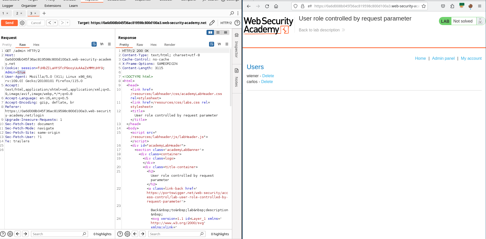

 
## User role can be modified in user profile

### Enunciation

This lab has an admin panel at `/admin`. It's only accessible to logged-in users with a `roleid` of 2.

Solve the lab by accessing the admin panel and using it to delete the user `carlos`.

You can log in to your own account using the following credentials: `wiener:peter`

### Solution

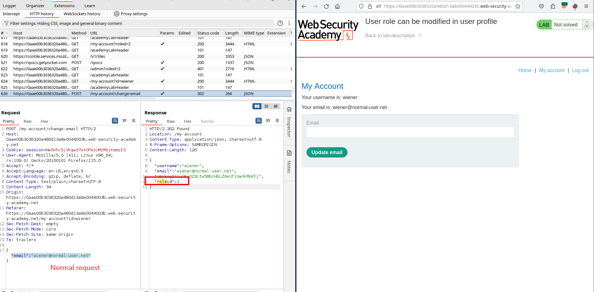

## URL-based access control can be circumvented

### Enunciation

This website has an unauthenticated admin panel at `/admin`, but a front-end system has been configured to block external access to that path. However, the back-end application is built on a framework that supports the `X-Original-URL` header.

To solve the lab, access the admin panel and delete the user `carlos`.`

### Solution

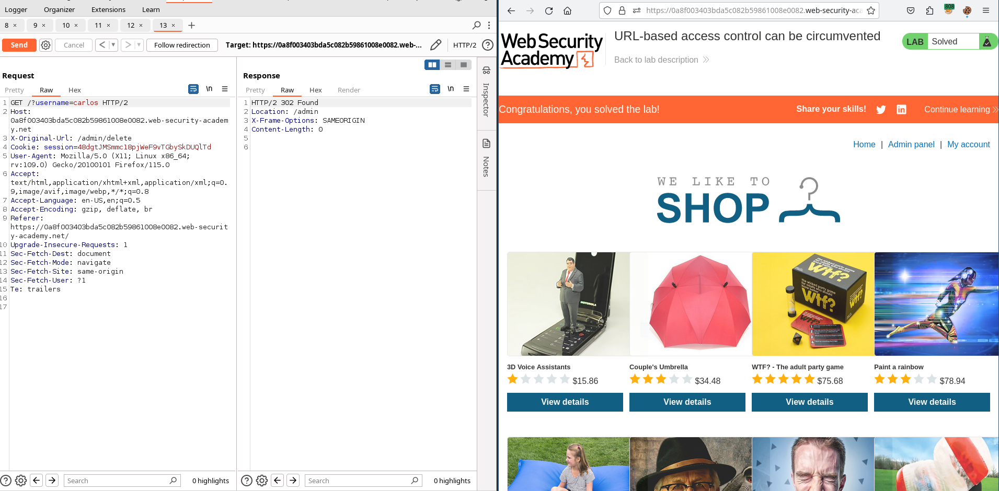

You will see a 302 and following the redirection, a 403,  BUT update the lab page and you will see that lab was successfully passed.
## Method-based access control can be circumvented

### Enunciation

This lab implements access controls based partly on the HTTP method of requests. You can familiarize yourself with the admin panel by logging in using the credentials `administrator:admin`.

To solve the lab, log in using the credentials `wiener:peter` and exploit the flawed access controls to promote yourself to become an administrator.

### Solution

## User ID controlled by request parameter

### Enunciation

This lab has a horizontal privilege escalation vulnerability on the user account page.

To solve the lab, obtain the API key for the user `carlos` and submit it as the solution.

You can log in to your own account using the following credentials: `wiener:peter`

### Solution

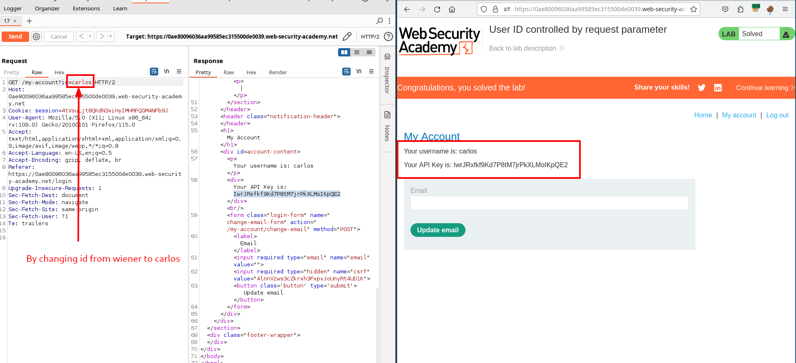

## User ID controlled by request parameter, with unpredictable user IDs

### Enunciation

This lab has a horizontal privilege escalation vulnerability on the user account page, but identifies users with GUIDs.

To solve the lab, find the GUID for `carlos`, then submit his API key as the solution.

You can log in to your own account using the following credentials: `wiener:peter`

### Solution

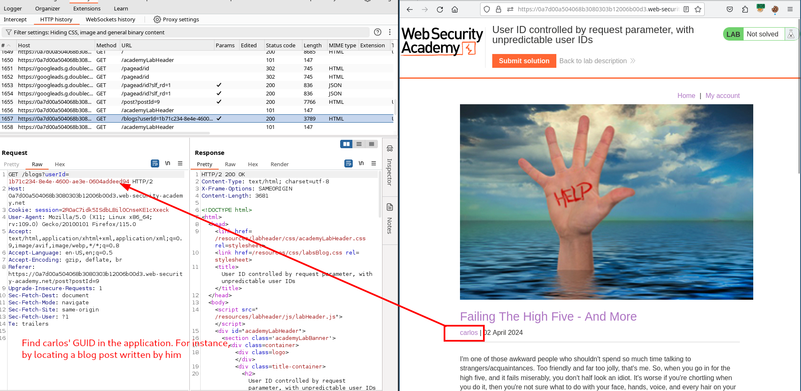

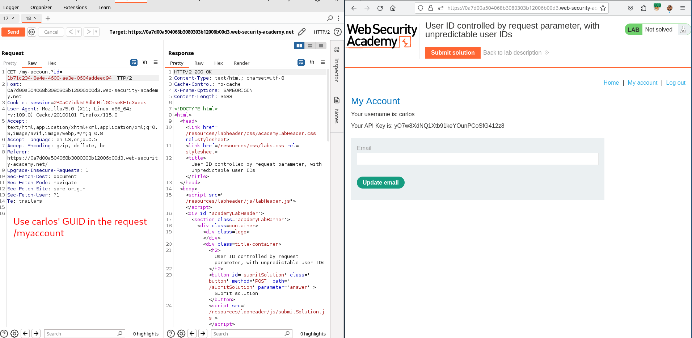

## User ID controlled by request parameter with data leakage in redirect 

### Enunciation

This lab contains an access control vulnerability where sensitive information is leaked in the body of a redirect response.

To solve the lab, obtain the API key for the user `carlos` and submit it as the solution.

You can log in to your own account using the following credentials: `wiener:peter`
### Solution

## User ID controlled by request parameter with password disclosure 

### Enunciation

This lab has user account page that contains the current user's existing password, prefilled in a masked input.

To solve the lab, retrieve the administrator's password, then use it to delete the user `carlos`.

You can log in to your own account using the following credentials: `wiener:peter`

### Solution

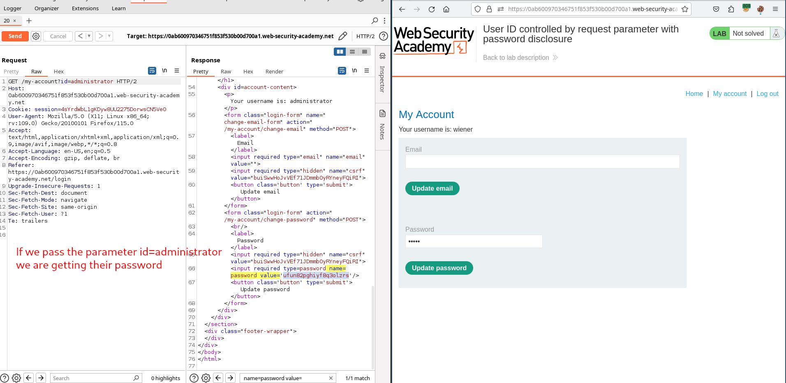

Log in as administrator, go to the admin panel, and delete carlos.

## Insecure direct object references

### Enunciation

This lab stores user chat logs directly on the server's file system, and retrieves them using static URLs.

Solve the lab by finding the password for the user `carlos`, and logging into their account.

### Solution

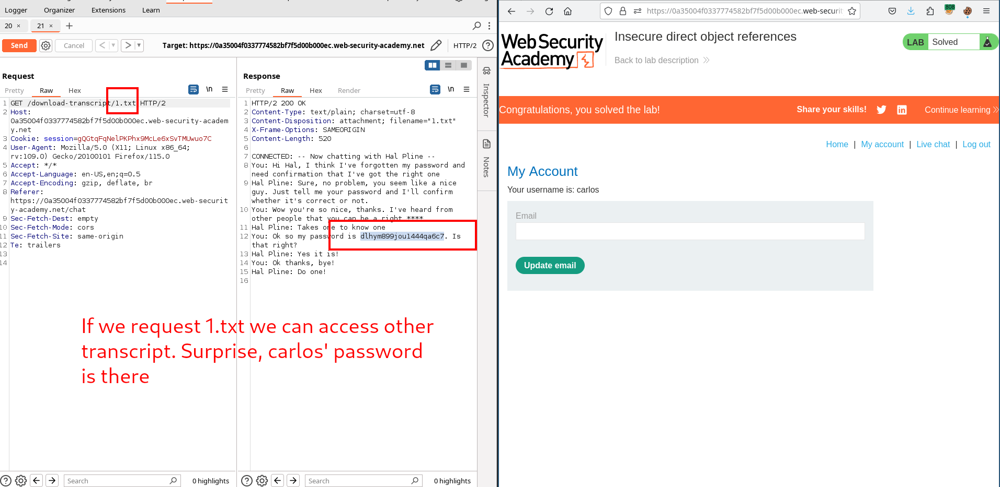

## Multi-step process with no access control on one step

### Enunciation

This lab has an admin panel with a flawed multi-step process for changing a user's role. You can familiarize yourself with the admin panel by logging in using the credentials `administrator:admin`.

To solve the lab, log in using the credentials `wiener:peter` and exploit the flawed access controls to promote yourself to become an administrator.

### Solution

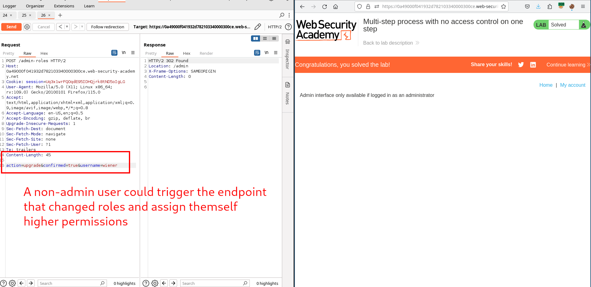

## Referer-based access control

### Enunciation

This lab controls access to certain admin functionality based on the Referer header. You can familiarize yourself with the admin panel by logging in using the credentials `administrator:admin`.

To solve the lab, log in using the credentials `wiener:peter` and exploit the flawed access controls to promote yourself to become an administrator.

### Solution

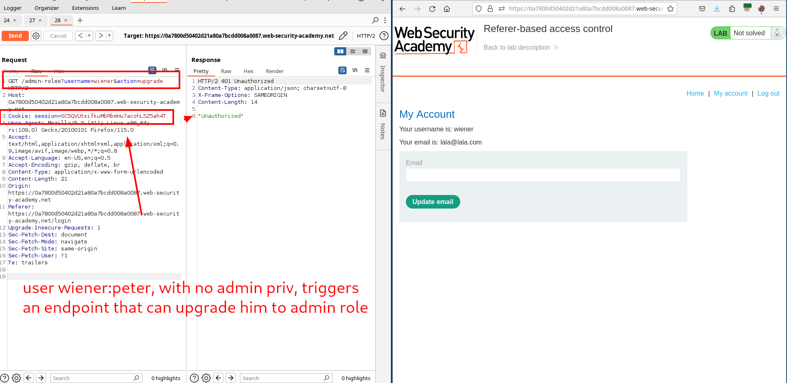

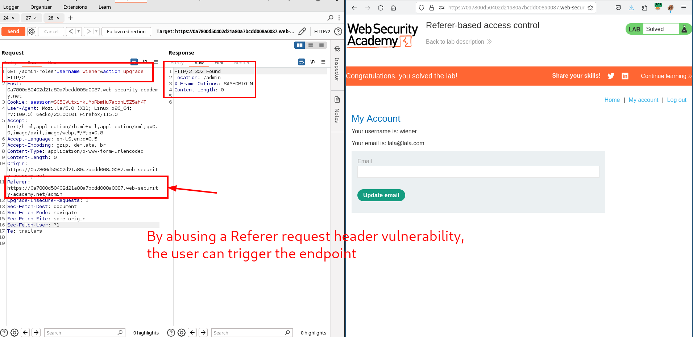

	