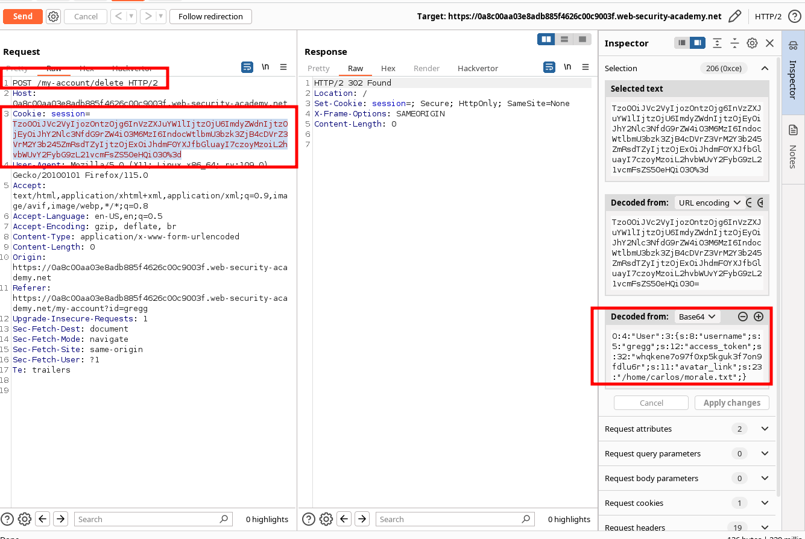
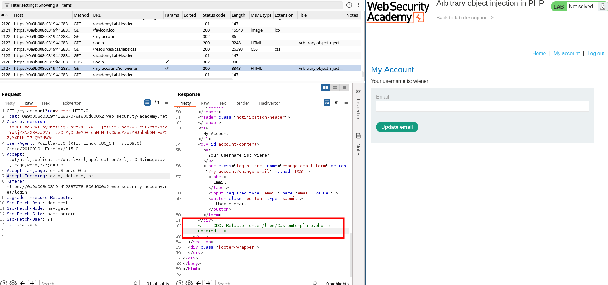
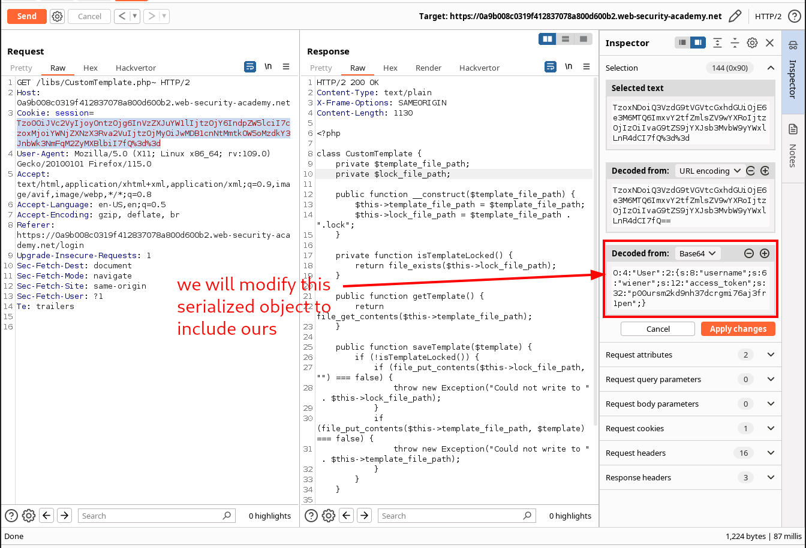
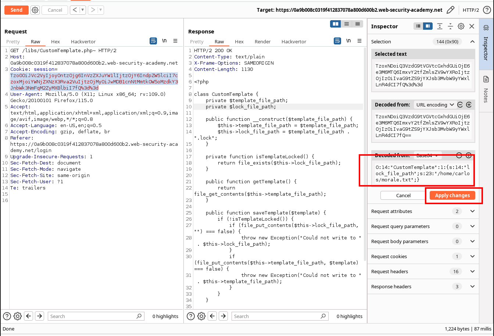
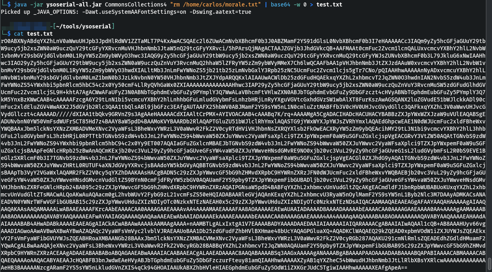

# BurpSuite Labs - Insecure deserialization


## Modifying serialized objects

### Enunciation

This lab uses a serialization-based session mechanism and is vulnerable to privilege escalation as a result. To solve the lab, edit the serialized object in the session cookie to exploit this vulnerability and gain administrative privileges. Then, delete the user `carlos`.

You can log in to your own account using the following credentials: `wiener:peter`

### Solution


```
# Burp solution

1. Log in using your own credentials. Notice that the post-login `GET /my-account` request contains a session cookie that appears to be URL and Base64-encoded.
2. Use Burp's Inspector panel to study the request in its decoded form. Notice that the cookie is in fact a serialized PHP object. The `admin` attribute contains `b:0`, indicating the boolean value `false`. Send this request to Burp Repeater.
3. In Burp Repeater, use the Inspector to examine the cookie again and change the value of the `admin` attribute to `b:1`. Click "Apply changes". The modified object will automatically be re-encoded and updated in the request.
4. Send the request. Notice that the response now contains a link to the admin panel at `/admin`, indicating that you have accessed the page with admin privileges.
5. Change the path of your request to `/admin` and resend it. Notice that the `/admin` page contains links to delete specific user accounts.
6. Change the path of your request to `/admin/delete?username=carlos` and send the request to solve the lab.

```


## Modifying serialized data types

### Enunciation

 This lab uses a serialization-based session mechanism and is vulnerable to authentication bypass as a result. To solve the lab, edit the serialized object in the session cookie to access the administrator account. Then, delete the user carlos.

You can log in to your own account using the following credentials: wiener:peter 

### Solution

Capture the Cookie session of the regular user wiener:peter. Send a request containing the cookie to Repeater module. Use the inspector to modify the value of the cookie:

Original values:

```
O:4:"User":2:{s:8:"username";s:6:"wiener";s:12:"access_token";s:32:"bzz9fbv8uzas714errnha1q5ppbzyf5h";}
```


Crafted values:

```
O:4:"User":2:{s:8:"username";s:13:"administrator";s:12:"access_token";i:0;}
```

What we did:

- Update the length of the `username` attribute to `13`.
- Change the username to `administrator`.
- Change the access token to the integer `0`. As this is no longer a string, you also need to remove the double-quotes surrounding the value.
- Update the data type label for the access token by replacing `s` with `i`.


```
# Burp solution
1. Log in using your own credentials. In Burp, open the post-login `GET /my-account` request and examine the session cookie using the Inspector to reveal a serialized PHP object. Send this request to Burp Repeater.
2. In Burp Repeater, use the Inspector panel to modify the session cookie as follows:
    
    - Update the length of the `username` attribute to `13`.
    - Change the username to `administrator`.
    - Change the access token to the integer `0`. As this is no longer a string, you also need to remove the double-quotes surrounding the value.
    - Update the data type label for the access token by replacing `s` with `i`.
    
    The result should look like this:
    
    `O:4:"User":2:{s:8:"username";s:13:"administrator";s:12:"access_token";i:0;}`
3. Click "Apply changes". The modified object will automatically be re-encoded and updated in the request.
4. Send the request. Notice that the response now contains a link to the admin panel at `/admin`, indicating that you have successfully accessed the page as the `administrator` user.
5. Change the path of your request to `/admin` and resend it. Notice that the `/admin` page contains links to delete specific user accounts.
6. Change the path of your request to `/admin/delete?username=carlos` and send the request to solve the lab.

```


## Using application functionality to exploit insecure deserialization

### Enunciation

This lab uses a serialization-based session mechanism. A certain feature invokes a dangerous method on data provided in a serialized object. To solve the lab, edit the serialized object in the session cookie and use it to delete the `morale.txt` file from Carlos's home directory.

You can log in to your own account using the following credentials: `wiener:peter`

You also have access to a backup account: `gregg:rosebud`

### Solution

In the user profile there is a DELETE feature that allows users to delete their profile. When doing so, the functionality of the application is relaying on the path provided in the cookie session (which is part of the user object) to remove the avatar.


Exploit would be changing the path to a file that we want to remove and update the string length of the path.




```
# Burp solution
1. Log in to your own account. On the "My account" page, notice the option to delete your account by sending a `POST` request to `/my-account/delete`.
2. Send a request containing a session cookie to Burp Repeater.
3. In Burp Repeater, study the session cookie using the Inspector panel. Notice that the serialized object has an `avatar_link` attribute, which contains the file path to your avatar.
4. Edit the serialized data so that the `avatar_link` points to `/home/carlos/morale.txt`. Remember to update the length indicator. The modified attribute should look like this:
    
    `s:11:"avatar_link";s:23:"/home/carlos/morale.txt"`
5. Click "Apply changes". The modified object will automatically be re-encoded and updated in the request.
6. Change the request line to `POST /my-account/delete` and send the request. Your account will be deleted, along with Carlos's `morale.txt` file.

```


## Arbitrary object injection in PHP

### Enunciation

This lab uses a serialization-based session mechanism and is vulnerable to arbitrary object injection as a result. To solve the lab, create and inject a malicious serialized object to delete the `morale.txt` file from Carlos's home directory. You will need to obtain source code access to solve this lab.

You can log in to your own account using the following credentials: `wiener:peter`

You can sometimes read source code by appending a tilde (`~)` to a filename to retrieve an editor-generated backup file.

### Solution

Review the code and notice CustomerTemplate.php



Read the file by adding a virgule and find an interesting method:


The cookie session consisted on a serialized object. 



We will craft a seriealized object that triggers the interested method allocated in CustomTemplate.php and pass it base-64 encoded via the Inspector module:

```
O:14:"CustomTemplate":1:{s:14:"lock_file_path";s:23:"/home/carlos/morale.txt";}
```



Run the request!


```
# Burp solution
1. Log in to your own account and notice the session cookie contains a serialized PHP object.
2. From the site map, notice that the website references the file `/libs/CustomTemplate.php`. Right-click on the file and select "Send to Repeater".
3. In Burp Repeater, notice that you can read the source code by appending a tilde (`~`) to the filename in the request line.
4. In the source code, notice the `CustomTemplate` class contains the `__destruct()` magic method. This will invoke the `unlink()` method on the `lock_file_path` attribute, which will delete the file on this path.
5. In Burp Decoder, use the correct syntax for serialized PHP data to create a `CustomTemplate` object with the `lock_file_path` attribute set to `/home/carlos/morale.txt`. Make sure to use the correct data type labels and length indicators. The final object should look like this:
    
    `O:14:"CustomTemplate":1:{s:14:"lock_file_path";s:23:"/home/carlos/morale.txt";}`
6. Base64 and URL-encode this object and save it to your clipboard.
7. Send a request containing the session cookie to Burp Repeater.
8. In Burp Repeater, replace the session cookie with the modified one in your clipboard.
9. Send the request. The `__destruct()` magic method is automatically invoked and will delete Carlos's file.

```


## Exploiting Java deserialization with Apache Commons

### Enunciation

This lab uses a serialization-based session mechanism and loads the Apache Commons Collections library. Although you don't have source code access, you can still exploit this lab using pre-built gadget chains.

To solve the lab, use a third-party tool to generate a malicious serialized object containing a remote code execution payload. Then, pass this object into the website to delete the `morale.txt` file from Carlos's home directory.

You can log in to your own account using the following credentials: `wiener:peter`

### Solution

Install the following two plugins in Burpsuite: Java Deserialization Scanner and Java Serial Killer. With those, when browsing the site the Live audit will show us deserialization issues:

In the Burpsuite scanner see the issues already identified.


Paste the vulnerable request in Deserialization Scanner > Manual testing:


Click on All issues and you can identify a disclosed vulnerability on library Apache Commons Collections 4. This will help in the following steps.


Now we can craft a payload using [ysoserial tool](../ysoserial.md) (see debugging and installation there).

As we have a java version 11, our payload will be:

```
java -jar ysoserial-all.jar CommonsCollections4 "rm /home/carlos/morale.txt" | base64 -w 0 > test.txt

# -w 0 : it will remove the end of lines.
```



Now, we copy paste that value in the Cookie session, then we select it and with CTRL-u, we url-encode it (the key characters). Then we send the request.


```
# Burp solution

1. Log in to your own account and observe that the session cookie contains a serialized Java object. Send a request containing your session cookie to Burp Repeater.
2. Download the "ysoserial" tool and execute the following command. This generates a Base64-encoded serialized object containing your payload:
    
    - In Java versions 16 and above:
        
        `java -jar ysoserial-all.jar \ --add-opens=java.xml/com.sun.org.apache.xalan.internal.xsltc.trax=ALL-UNNAMED \ --add-opens=java.xml/com.sun.org.apache.xalan.internal.xsltc.runtime=ALL-UNNAMED \ --add-opens=java.base/java.net=ALL-UNNAMED \ --add-opens=java.base/java.util=ALL-UNNAMED \ CommonsCollections4 'rm /home/carlos/morale.txt' | base64`
    - In Java versions 15 and below:
        
        `java -jar ysoserial-all.jar CommonsCollections4 'rm /home/carlos/morale.txt' | base64`
3. In Burp Repeater, replace your session cookie with the malicious one you just created. Select the entire cookie and then URL-encode it.
4. Send the request to solve the lab.
```


## J

### Enunciation

T

### Solution


```
# Burp solution


```


## J

### Enunciation

T

### Solution


```
# Burp solution


```


## J

### Enunciation

T

### Solution


```
# Burp solution


```


## J

### Enunciation

T

### Solution


```
# Burp solution


```


## J

### Enunciation

T

### Solution


```
# Burp solution


```


