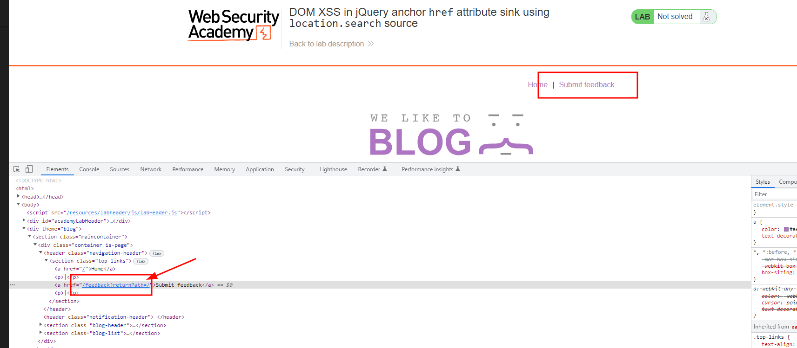

# BurpSuite Labs - Cross-site Scripting


## Reflected XSS into HTML context with nothing encoded

### Enuntiation

This lab contains a simple [reflected cross-site scripting](https://portswigger.net/web-security/cross-site-scripting/reflected) vulnerability in the search functionality.

To solve the lab, perform a cross-site scripting attack that calls the `alert` function.

### Solution

Copy and paste the following into the search box: 
 
```
<script>alert(1)</script>
```

Click Search.

## Stored XSS into HTML context with nothing encoded

### Enuntiation

This lab contains a [stored cross-site scripting](https://portswigger.net/web-security/cross-site-scripting/stored) vulnerability in the comment functionality.

To solve this lab, submit a comment that calls the `alert` function when the blog post is viewed.

### Solution

Go to a post, and in the comment box enter:

```
<script>alert(1)</script>
```

Once you go back to the post, the script will be load.


## DOM XSS in document.write sink using source

### Enuntiation

This lab contains a [DOM-based cross-site scripting](https://portswigger.net/web-security/cross-site-scripting/dom-based) vulnerability in the search query tracking functionality. It uses the JavaScript `document.write` function, which writes data out to the page. The `document.write` function is called with data from `location.search`, which you can control using the website URL.

To solve this lab, perform a [cross-site scripting](https://portswigger.net/web-security/cross-site-scripting) attack that calls the `alert` function.

### Solution

Use the searchbox lo look for some alphanumeric characters and see in the response where those characters have been reflected. In this case, it was in an image:


Now, escape those characters. For instance with:

```
"><SCRIPT>alert(1)</sCripT>
```


## DOM XSS in innerHTML sink using source

### Enuntiation

This lab contains a [DOM-based cross-site scripting](https://portswigger.net/web-security/cross-site-scripting/dom-based) vulnerability in the search blog functionality. It uses an `innerHTML` assignment, which changes the HTML contents of a `div` element, using data from `location.search`.

To solve this lab, perform a [cross-site scripting](https://portswigger.net/web-security/cross-site-scripting) attack that calls the `alert` function.

### Solution

Reviewing my notes, if we're looking for a DOM based XSS a good proof of concept would be:
[swisskyrepo/PayloadsAllTheThings](https://github.com/swisskyrepo/PayloadsAllTheThings/blob/master/XSS%20Injection/README.md#xss-in-js-context)

An extensive XSS payload list can be used from [Payloadbox](https://raw.githubusercontent.com/payloadbox/xss-payload-list/master/Intruder/xss-payload-list.txt) but It's hard to tell which one is a positive and for this lab you will end up with a list of 124 possible payloads.

To solve the lab, enter in the searchbox: 
```
#">
```


## DOM XSS in jQuery anchor href attribute sink using location.search source

### Enuntiation

This lab contains a [DOM-based cross-site scripting](https://portswigger.net/web-security/cross-site-scripting/dom-based) vulnerability in the submit feedback page. It uses the jQuery library's `$` selector function to find an anchor element, and changes its `href` attribute using data from `location.search`.

To solve this lab, make the "back" link alert `document.cookie`.

### Solution

In home page, pay attention to the link in " Submit feedback". In home is pointing to "/feedback?returnpath=/. 



Edit source code and add to the parameter  `javascript:alert(document.cookie)` so that the final href attribute is:

```
/feedback?returnpath=/javascript:alert(document.cookie)
```

Click on Submit feedback.

## DOM XSS in jQuery selector sink using a hashchange event

### Enuntiation

This lab contains a [DOM-based cross-site scripting](https://portswigger.net/web-security/cross-site-scripting/dom-based) vulnerability on the home page. It uses jQuery's `$()` selector function to auto-scroll to a given post, whose title is passed via the `location.hash` property.

To solve the lab, deliver an exploit to the victim that calls the `print()` function in their browser.

### Solution

Copied from Burpsuite:

1.  Notice the vulnerable code on the home page using Burp or the browser's DevTools.
2.  From the lab banner, open the exploit server.
3.  In the **Body** section, add the following malicious `iframe`:
    
    `<iframe src="https://YOUR-LAB-ID.web-security-academy.net/#" onload="this.src+=''"></iframe>`
4.  Store the exploit, then click **View exploit** to confirm that the `print()` function is called.
5.  Go back to the exploit server and click **Deliver to victim** to solve the lab
