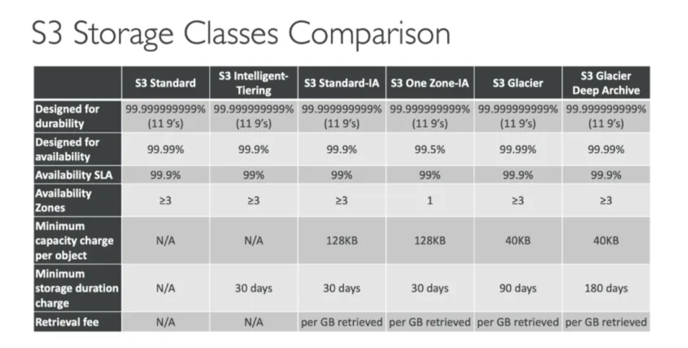

# Amazon Web Services (AWS) Essentials


## AWS Compute

### Elastic Computer Cloud (EC2)

An EC2 instance is a Virtual Server running on AWS. You deploy your EC2 instances into a virtual private cloud or VPC. You can deploy them into public or private subnets.

You can choose: OS, CPU, RAM, Storage space, network card, firewall rules (security group), and bootstrap script (configure at fisrt launch, and which is called EC2 User Data). Concept of bootstrap: bootstrapping means launching commands when a machine starts. That script is only run once, at first start. You can: install updates, software, common files from the internet,...

Public subnets have a public IP address and can be accessed from the Internet. Private subnets are isolated. They can only communicate with each other within the VPC (unless you install a gateway.

Some instance types: t2.micro, t2.xlarge, c5d.4xlarge, r516xlarge, m5.8xlarge,... t2.micro is part of the AWS free tier with up to 750 hours per month. This is the name convention for instances:

```
m5.2xlarge
# m: instance class
# 5: generation of the instance 
# 2xlarge: size within the instance class
```

There are general purpose instances, storage optimized, network optimized, or memory optimized, for instance.

The security groups only have allow rules (because the default is deny).By default, all inbound traffic is blocked and all outbound traffic is authorized. An instance can have multiple security groups. You can attach to your firewall rules security groups. 


Default user for connecting to EC2 via ssh is ec2-user. So ssh connection would be:

```bash
ssh -i access-key.pem ec2-user@<IP>
```


#### AMI

AMI stands for Amazon Machine Image and they represent a customization of an EC2 instance. It's similar to the concept of OVA in VirtualBox.

#### EC2 Image Builder

EC2 Image Builder is used to automate the creation of VM or container images. It automates the creation, maintain, validate, and test EC2 AMIs. It can be run on a schedule. It's a free service.


## AWS Storage

### Amazon Elastic Block Store (EBS)

Block Storage Device, it's a virtual hard drive in the cloud. The OS reads/writes at the block level. Disks can be internal, or Network attached. The OS sees volumes that can be partitioned and formatted. Use cases:

- Use by Amazon EC2 instances.
- Relational and non-relational databases.
- Enterprises applications.
- Containerized applications.
- Big data analytics.
- File systems.

The free tier has 30GB of free EBS storage of type General Purpose (SSD) or Magnetic per month. 

A definition for EBS would be that they are network drives (not physical drives). They use the network to communicate the instance. They can be detached from an EC2 instance and attached to another very quickly. They are locked to an Availability Zone. 

They don't need to be attached to any instance. They have also a delete on termination attribute. By default is not deleted. This feature can be triggered from [aws-cli](../../aws-cli.md).

### EBS Snapshots

It makes a backup (snapshot) of your EBS volume at a point in time. Not necessary to detach volume to do snapshot, but recommended. Snapshot are useful to replicate EBS in different regions. By copying snapshot to a different region you can migrate EBS attached to another in a different region.

There is a EBS Snapshot Archive service, that allows you to move a snapshot to an archive tier that is 75% cheaper.

Also there is a service of a Recycle Bin, that allows you to retain snapshot. You can define the retain policy for it.

### EC2 Instance Store

EBS volumes are network drives with good but limited performance. If you need a high-performance hardware disk, you have EC2 Instance Store.

EC2 Instance Store is good for buffer / cache /scratch data / and temporary content, but not long term.

### Amazon Elastic File System (EFS)

It uses File Storage, in which a filesystem is mounted to the OS using a network share. A filesystem can be shared by many users. Use cases:

- Corporate home directories.
- Corporate shared directories.
- Big data analytics.
- Lift & Shift enterprise applications.
- Web serving.
- Content management.

EFS works only with Linux EC2 instances in multi-AZ.

EFS Infrequent Access (EFS-IA) is a storage class cost-optimized for files that you don't access very often. It saves up to 92% of cost compared to EFS Standard. You can have EFS-IA integrated with a Lifecycle policy. 

### Amazon FSx 

Amazon FSx is a managed service to get third party high-performance file system on AWS. 

It's fully managed. There are 3 services:

- FSx for Lustre: High Performance Computing. For machine learning, analytics, video processing, finantial modelling...
- FSx for Windows File Server: support SMB and NTFS. Built on Windows File Server. Integrated with Windows Active Directory,
- FSx for NetApp ONTAP


### Amazon Simple Storage Services (S3)

It uses Object Storage Containers. They are usually on-premises. There is no hierarchy of objects in the container. It's used for backup and storage, along with disaster recovery, archive, media hosting, hybrid cloud storage...  It uses REST API. Use cases:

- Websites.
- Mobile applications.
- Backup and archiving.
- IoT devices.
- Big data analytics.

As benefits, it has very low-cost object storage, a high durability and multiple storage classes. 

In S3 you have  buckets. A bucket is a container into which you put your objects. You can have those objects inside your bucket public or private to the Internet. Buckets must have an unique name. They are define at the region level. 

A key is the full path to the file: s3://my-bucket/my-folder/my-file.txt It's composed by a prefix and an object name. Max object size is 5TB (5000 GB).

There are S3 Buckets Policies to allow public access. There are also IAM permissions that you can assign to users. You can also have EC Instance Role to grant access to EC2 instances. Additionally, in the Bucket settings you can block public access (this can be also set at an account level).

Cool tool: [Amazon policy generator](https://awspolicygen.s3.amazonaws.com/policygen.html)

#### Creating a static website

This would be the url: http://bucketname.s3-website-aws-region.amazonaws.com

#### Storage classes




## Amazon Network 

### Amazon Elastic Load Balancing (ELB)

A load balancer is a server that will forward  the internet traffic down to multiple servers downstream. And for then there will be EC2 instances. They're also called the backend EC2 instances.

Elastic load balancing is something that is managed by AWS. 

Benefits:

- ELB can spread the load across multiple downstream instances.
- ELB allows you to expose a single point of access, DNS host name, for your application.
- ELB can seamlessly handle the failures of downstream instances. 
- EBL can do regular health checks on them and if one of them is failing, then the load balancer will not direct traffic to that instance.
- It provides SSL termination (HTPPS) for your websites.

There are 4 kinds:
- Application Load Balancer (HTTP/HTTPs only) - Layer 7
- Network Load Balancer (ultra high performance, allows for TCP) - Layer 4
- Gateway Load Balancer - Layer 3.
- Classic Load Balancer (retired in 2023) - Layer 4 and 7.

### Auto Scaling Groups (ASG)

The goal of an auto scaling group is to scale out. That means add EC2 instances to match an increased load or scale in, that means remove EC2 instances to match a decreased load. With this we can ensure that we have, also as well, a minimum, and a maximum number of machines running at any point of time and once the auto scaling group does create, or remove EC2 instances we can make sure that these instances will be registered, or de registered into our load balancer.

You can define a minimum size, a maximum size, and a desired capacity.


## Amazon migration tools

### AWS Snow 

- Snowball Edge Storage Optimized & Snowball Edge Compute Optimized
- AWS Snowcone & Snowcone SSD
- AWS Snowmobile (the truck). 100 PB of capacity.


### Edge Computing

Edge Computing is when you process data while it's being created at an edge location. You can use the Snow Family to run EC2 instances and Lambda functions to do this.


### AWS OpsHub

OpsHub which is a software that you install on your computer or laptop, so, it's not something you use on the cloud, it's something that you download on your computer. And then once it's connected, it's going to give you a graphical interface to connect to your Snow devices, and configure them and use them.
