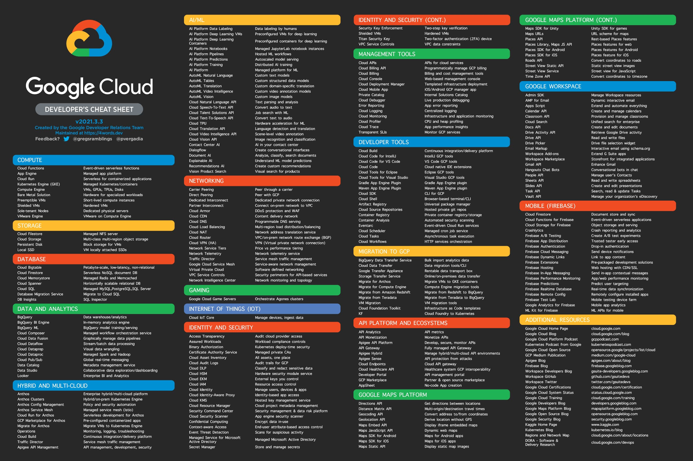
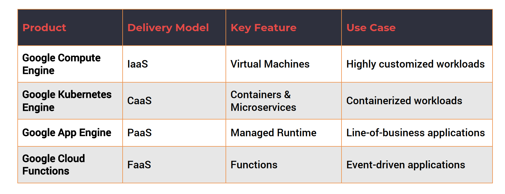
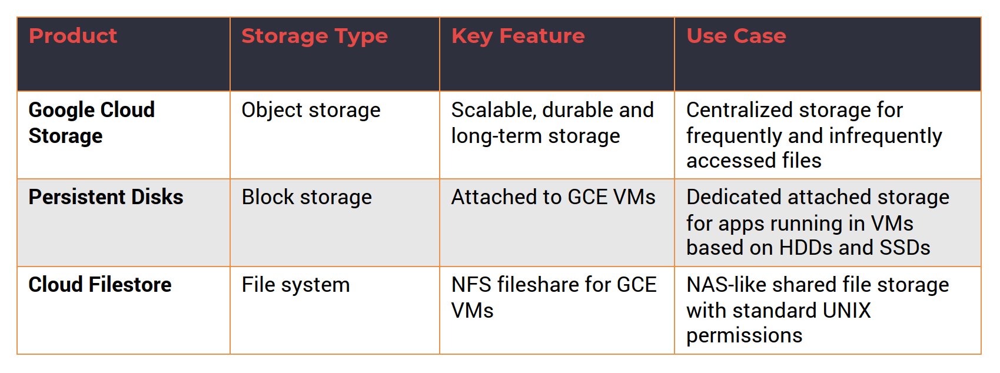
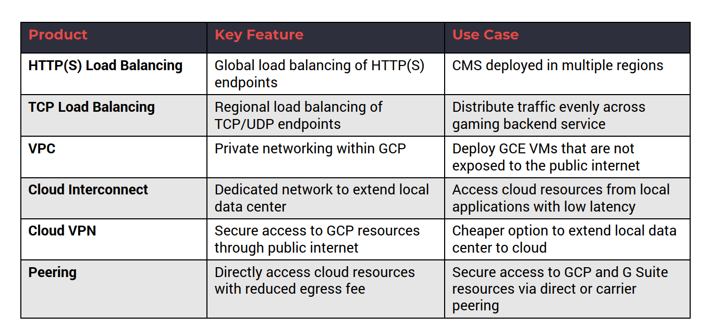
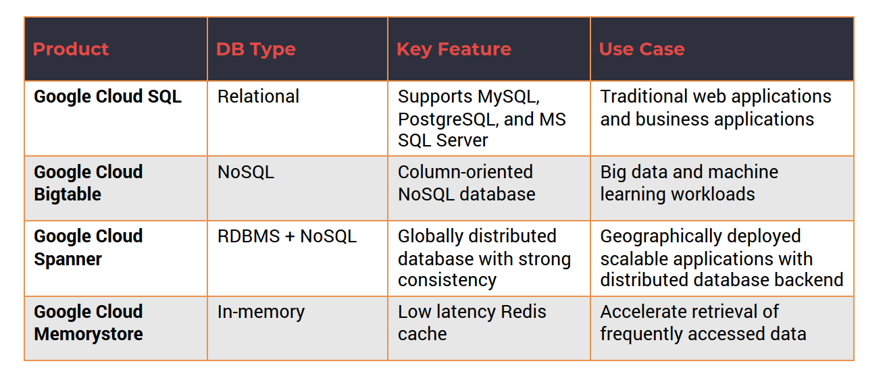
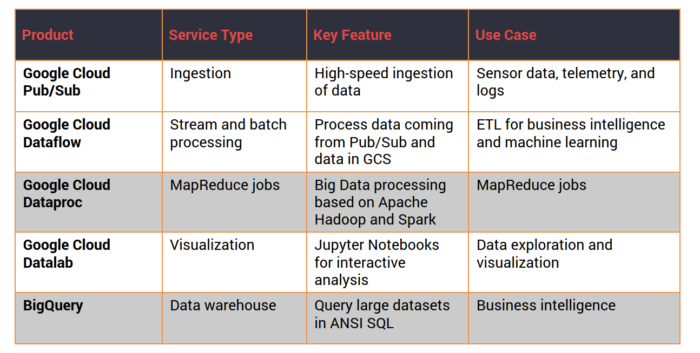
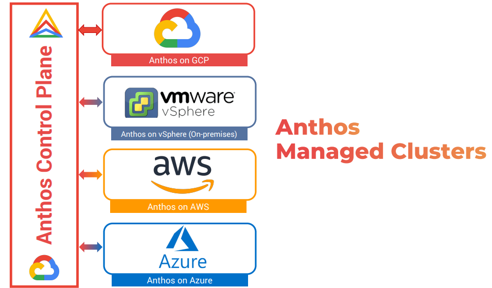
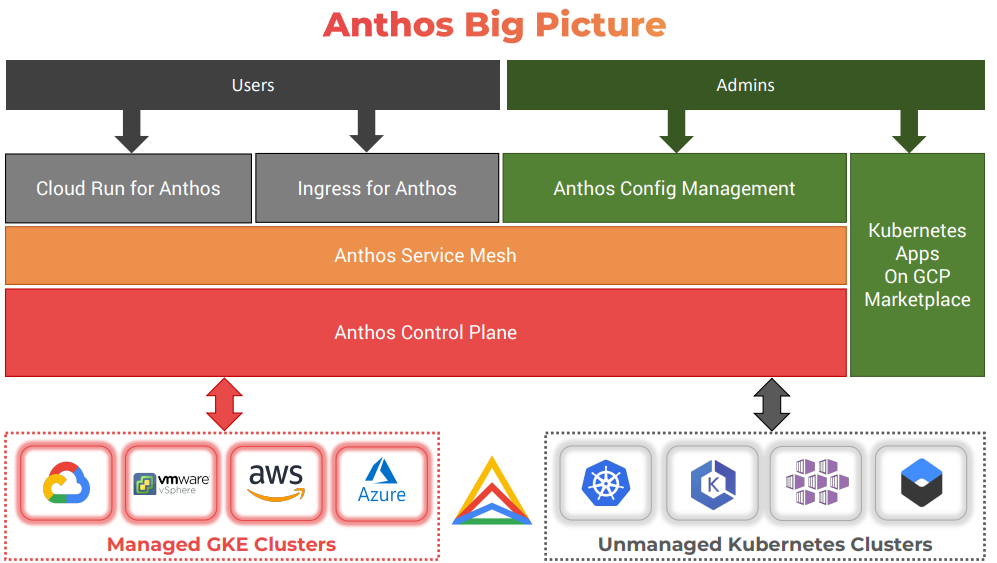

# Google Cloud Platform (GCP) Essentials


Cheatsheets: **[gcloud CLI](../../gclod-cli.md)**    
## Basic numbers

- 20 regions
- 61 zones
- 134 network edge locations
- 200+ countries and territories.

A Region typically has two Zones. A zone is the equivalent of a data center in Google Cloud.

Overview of services:





### Signing-up with GCP

$300 in free credits to run more than 25 service for free.  are provided with 90

Link: [https://cloud.google.com/gcp/](https://cloud.google.com/gcp/)

### GCP resources

In Google Cloud Platform, everything that you create is a resource. There is a hierarchy:

- Everything that you create is a resource.
- Resources belong to a project. 
- A project directly represents a billable unit. It has a credit card associated. 
- Projects may be organized into folders (like dev or production), which provide logical grouping of projects.
- Folders belong to one and only one organization.
- The organization is the top level entity in GCP hierarchy.


If you use Google Suite, you will see the organization level and folders. If you don't, you will only have access to projects and resources.

To interact with GCP there are these tools: web console, cloud shell cloud SDK, mobile App, Rest API.

GCP Cloud Shell is an interactive shell environment for GCP, accessible from any web browser, with a preloaded IDE  named gcloud, which is the command line utility, and based on a GCE Virtual Machine (provisioned with 5GB persistent disk storage and Debian environment). It has a built-in preview functionality withou dealing with tunneling and other issues.

## 2. Compute Services

Code is deployed and executed in one of the compute services:
### 2.1. App Engine

It's one of the first compute services from Google (PaaS) in 2008. It's a fully managed platform for deploying web apps at scale. It supports multiple languages. It's available in two environments: 

- Standard: Applications run in a sandbox.
- Flexible: You have more control on packages and environments. Applications run on docker containers, which are in use to deploy but also to scale apps.
### 2.2. Compute Engine (GCE)

Google Compute Engine (GCE) enables Linux and Windows VMs to run on Google's global infraestructure. VMs are based on machine types with varied CPU and RAM configuration.

If you need that VMs are persistent, you need to attach additional storage such standards and SSD disks. Otherwise, when closing the VM you will loose all configurations and setups.

VMs are charged a minimum of 1 minute and in 1 second increments  after that. Sustained use discounts are offered for running VMs for a significant portion of the billing month. Committed use discounts are offered for purchases based on1 year or 3 year contracts.

### 2.3. Kubernetes Engine

- GKE is a managed environment for deploying containerized applications managed by Kubernetes. Kubernetes was originated on Google but now is open source project part of Cloud-Native Computing Foundation. 
- Kubernetes has a control plane and worker node (or multiple).
- GKE provisions worker nodes as GCE VMs. Google manages the control plane (and the master nodes) and that is why is called a managed environment.
- Node pools enable mixing and matching different VM configurations.
- The service is tightly integrated with GCP resources such as networking, storage, and monitoring. 
- GKE infrastructure is monitored by Stack Driver, which is the built-in monitoring and tracing platform.
- Auto scaling, automatic upgrades, and node auto-repair are some of the unique features of GKE.

### 2.4. Cloud Functions

- Cloud Functions is a serverless execution environment connecting cloud services for building and connecting cloud services. 
- Serverless compute environments execute code in response to an event.
- Cloud Functions supports JavaScript, Python, and Go.
- GCP events fire a Cloud Function through a trigger. 
- An example event includes adding an object to a storage bucket.
- Trigger connects the event to the function.
- This is FaaS, Function as a Service.




## 3. Storage Services




- Storage services add persistence and durability to applications
- Storage services are classified into three types:
	- Object storage
	- Block storage
	- File system

- GCP storage services can be used to store:
- Unstructured data
- Folders and Files

### 3.1. Google Cloud Storage

- Unified object storage for a variety of applications. 
- Applications can store and retrieve objects (typically through single API).
- GCS can scale to exabytes of data.
- GCS is designed for 99.999999999% durability.
- GCS can be used to store high-frequency and low-frequency access of data.
- Data can be stored within a single region, dual-region, or multi-region.
- There are three default storage class for the data: Standard, Nearline, and Coldline.


- Launching GCS. When creating a Storage entity in GCP, we will create buckets, which are containers for folders and storage objects. Folders may contain Files. Therefore, **Buckets** are the highest level container in the GCS hierarchy. As for encryption, you can decided if it is Google-managed key or Customer-managed key. Additionally, retention policy can be added when creating a storage entity. You also have labels. After that you can create folders and allocate files in them.

### 3.2. Persistent Disks

- PD provides reliable block storage for GCE VMs. 
- Disks are independent of Compute Engine VMs, which means they can have a different lifecycle.
- Each disk can be up to 64TB in size. 
- PDs can have one writer and multiple readers. This is quite unique in GCP. Basically, if you have a scenario where you need to attach the disk to one VM for read-write access but read that data from multiple VMs in a read-only mode, you can do that with persistent disks. So one VM will act as the writer and all other VMs will act as readers. So this gives you the ability to designate one VM for read-write, while adding multiple VMs that are quickly reading from the same disk with a read-only access. This opens up lot of opportunities where you need to create distributed applications with centralized data access.
- Supports both SSD and HDD storage options. 
- SSD offers best throughput for I/O intensive applications. 
- PD is available in three storage types:
	- Zonal.
	- Regional.
	- Local.

### 3.3. Google Cloud Filestore

- Managed file storage service traditionally for legacy applications. 
- Delivers NAS-like filesystem interface and a shared filesystem. 
- Centralized, highly-available filesystem for GCE and GKE. 
- Exposed as a NFS fileshare with fixed export settings and default Unix permissions. 
- Filestore file shares are available as mount points in GCE VMs. 
- On-prem applications using NAS take advantage of Filestore. 
- Filestore has built-in zonal storage redundancy for data availability. 
- Data is always encrypted while in transit. 

## 4. Network Services




- Network services are one of the key building blocks of cloud. 
- GCP leverages Google’s global network for connectivity. 
- Customers can choose between standard and premium tiers. Standard allows you to use the normal backbone of GCP network and Premium gives you access to the premium backbone. Therefore, Standard tier leverages selection of ISP-based internet backbone for connectivity (which is cheaper). GCP uses premium tier as the default option.
- Load balancers route the traffic evenly to multiple endpoints. 
- Virtual Private Cloud (VPC) offers private and hybrid networking. 
- Customers can extend their data center to GCP through hybrid connectivity.

### 4.1. Load Balancers

- Load balancer distributes traffic across multiple GCE VMs in a single or multiple regions. 
- There are two types of GCP load balancers:
	- HTTP(S) load balancer, which  provides global load balancing.
	- Network load balancer, which balances regional TCP and UDP traffic within the same region.
• Both types can be configured as internal or external load balancers


#### Configure is a couple of VMs deployed in a region connected to a load balancer


- From GCP web dashboard, go to Compute Engine, then Instance Templates. 
- Select machine type, disk image, and allow  HTTP and HTTPs in firewall configuration since we are launching a web server. Configure automation to get the server running from booting. Add the following script:

```bash
# Add the below script while creating the instance template 
 
#! /bin/bash 
apt-get update 
apt-get install -y apache2 
cat <<EOF > /var/www/html/index.html 
<html><body><h1>Hello from $(hostname)</h1> 
</body></html> 
EOF 
```

- Create the template.
- Now go to Instance group for setting up the deployment. Configure multiple zones, select the instance template (the one you created before) and the number of instances to deploy. Create a Health Check. Launch the instance group and in a few minutes you will have the 2 web servers (Go to VM instances to see them).
- Go to Network section, then Load balancing and click on create load balancer, and follow the creation tunnel.
- **The first step is creating a backend configuration**. So the backend configuration will ensure that we have a set of resources responsible for serving the traffic. Options to configure there:
	- Network endpoint groups // Or // Instance groups : choose the backend type as the instance group and choose the web server instance group we have launched in the previous step. Port is 80. That is the default port on which Apache is listening.
	- Balancing mode: traffic can be routed based on CP utilization or the request per second. If you are not  going to send a lot of traffic, choose rate. 
	- The maximum RPS,  100.
	- Associate this backend with the health check created earlier. This health check will be a checkpoint for the load balancer to decide whether to route the traffic to the instance or not. If the health check fails for one of the instances load balancer will gracefully send a request to the other instance and this will enhance the user experience where they only see only see the output coming from healthy instances.

- **The second step is setting up host and path rules**, there are not multiple endpoints, leave that as the default.
- **Third step, Front end configuration**. The front end is basically how the consumer or the client of your application sees the endpoint. Configure it:
	- Provide a name.
	- Protocol is HTTP.
	- Premium, this is the network service there.
	- IPv4, it's an ephemeral IP address.
- Fourth step, review settings.

In about five minutes, the load balancer will be completely functioning, which means it will be able to route the traffic to one of the instances in the backend group, which is based on the instance template that we created. By accessing to the load balancer IP:80 you will be redirected each time to a different machine.

### 4.2. Virtual Private Cloud (VPC)

- VPC is a software defined network providing private networking for VMs. 
- VPC network is a global resource with regional subnets. 
- Each VPC is logically isolated from each other. 
- Firewall rules allow or restrict traffic within subnets. Default option is deny.
- Resources within a VPC communicate via IPV4 addresses and there is a DNS service within VPC that provides name resolution.
- VPC networks can be connected to other VPC networks through VPC peering. 
- VPC networks are securely connected in hybrid environments using Cloud VPN or Cloud Interconnect.

### 4.3. Hybrid Connectivity

- Hybrid connectivity extends local data center to GCP.
- Three GCP services enable hybrid connectivity:
	- Cloud Interconnect: Cloud Interconnect extends on-premises network to GCP via Dedicated or Partner Interconnect. 
	- Cloud VPN: Cloud VPN connects on-premises environment to GCP securely over the internet through IPSec VPN.
	- Peering: Peering enables direct access to Google Cloud resources with reduced Internet egress fee


## 5. Identity & Access Management

- IAM controls access by defining who (identity) has what access (role) for which resource.  Members (who), roles (what) , and permissions (which).
- Cloud IAM is based on the principle of least privilege. 
- An IAM policy binds identity to roles which contains permissions.


Where do you use IAM?

• To share GCP resources with fine-grained control.
• Selectively allow/deny permissions to individual resources.
• Define custom roles that are specific to a team/organization.
• Enable authentication of applications through service accounts.
### 5.1. Cloud IAM Identity

A Google account is a Cloud IAM user so anyone with a gmail account or a google account will become visible as a cloud IAM user.

A Service account is a special type of user. It's meant for applications to talk to GCP resources.

A Google group is also a valid user or a member in Cloud IAM because it represents a logical entity that is a collection of users.

A G Suite domain like yourorganization.com is also a valid user or a member. You can assign permissions to an entire G Suite domain.

If you are not part of google, you can use Cloud Identity Service to create a Cloud identity domain, that is also a valid Cloud IAM user. 

And "allAuthenticatedUsers" is also an entity that allows you to assign permissions to all users authenticated through Google's authentication system.

Last,  "allUsers" assigns permissions even to anonymous users.


### 5.2. Cloud IAM Permissions

- Permissions determine the operations performed on a resource (launch an instance, deploy an object into a store bucket.)
- Correspond 1:1 with REST methods of GCP resources. GCP is based on a collection of APIs.
- Each GCP resource exposes REST APIs to perform operations.
- Permissions are directly mapped to each REST API.
	- Publisher.Publish() -> pubsub.topics.publish.
- Permissions cannot be assigned directly to members/users, but to a role. You group multiple permissions into a role and to assign that role to a member.
- One or more permissions are assigned to an IAM Role

### 5.3. Cloud IAM Roles

Roles are a logical grouping of permissions.

- Primitive roles:
	- Owner: unlimited access to a resource.
	- Editor.
	- Viewer.
- Predefined roles that associate a set of operations typically associated to objects. Every object in GCP has a set of predefined roles: 
	- roles/pubsub.publisher
	- roles/compute.admin
	- roles/storage.objectAdmin
- Custom roles:
	- Collection of assorted set of permissions.
	- Fine-grained access to resources.

### 5.4. Key Elements of Cloud IAM

- Resource – Any GCP resource
	- Projects
	- Cloud Storage Buckets
	- Compute Engine Instances
	- ...
- Permissions - Determines operations allowed on a resource
	- Syntax for calling permissions:
	
```
	<service>.<resource>.<verb>
	- pubsub.subscriptions.consume
	- compute.instances.insert
```

- Roles – A collection of permissions
	- Compute.instanceAdmin
		- compute.instances.start
		- compute.instances.stop
		- compute.instances.delete
		- ….

- Users – Represents an identity
	- Google Account
	- Google Group
	- G Suite Domain
	- …

### 5.5. Service Accounts

- A special Google account that belongs to an application or VM. It doesn't represent an user or identities.
- Service account is identified by its unique email address assigned by GCP, you don't have control on it, it's automatically created by GCP.
- Service accounts are associated with key-pairs used for authentication . This key is the token that identified the application.
- Two types of service accounts: 
	- User managed, which can be associated with a role. 
	- Google managed.
 - Each service account is associated with one or more roles. 

## 6. Database Services

- GCP has managed relational and NoSQL database  services. 
- Traditional web and line-of-business apps may use  RDBMS.
- Modern applications rely on NoSQL databases.
- Google has Web-scale, distributed applications need multi-region databases.
- In-memory database is used for accelerating the performance of apps




### 6.1. Google Cloud SQL

- One of the most common services in GCP.
- Fully managed RDBMS service that simplifies set up, maintain, manage, and administer database instances.
- Cloud SQL supports three types of RDBMS (Relational DataBase Management  Servers):
	- MySQL
	- PostgreSQL
	- Microsoft SQL Server (Preview)
- A managed alternative to running RDBMS in VMs.
- Cloud SQL delivers scalability, availability, security, and reliability of  database instances.
- Cloud SQL instances may be launched within VPC for additional security.


### 6.2. Google Clod Bigtable

- Petabyte-scale, managed NoSQL database service. 
- Sparsely populated table that can scale to billions of rows and thousands of columns. 
- Storage engine for large-scale, low-latency applications. 
- Ideal for throughput-intensive data processing and analytics.
- An alternative to running Apache HBase column-oriented database in VMs.
- Acts as a storage engine for MapReduce operations, stream processing, and machine-learning applications


### 6.3. Google Cloud Spanner

- Managed, scalable, relational database service for regional and global application data.
- Scales horizontally across rows, regions, and continents.
- Brings best of relational and NoSQL databases.
- Supports ACID transactions and ANSI SQL queries.
- Data is replicated synchronously with globally strong consistency.
- Cloud Spanner instances run in one of the three region types:
	- Read-write
	- Read-only
	- Witness


### 6.4. Google Cloud Memorystore

- A fully-managed in-memory data store service for Redis.
- Ideal for application caches that provides sub-millisecond data access.
- Cloud Memorystore can support instances up to 300 GB and network throughput of 12 Gbps.
- Fully compatible with Redis protocol.
- Promises 99.9% availability with automatic failover.
- Integrated with Stackdriver for monitoring.


## 7. Data and Analytics Services

- Data analytics include ingestion, collection, processing, analyzing, visualizing data.
- GCP has a comprehensive set of analytics services.
- Cloud Pub/Sub is typically used for ingesting data at scale, whether it is telemetry data coming from sensors or logs coming from your applications and infrastructure.
- Cloud Dataflow can process data in real-time or batch mode.
- Cloud Dataproc is a Big Data service for running Hadoop and Spark jobs. These are typically used with MapReduce with large data sets that form the big data stores with historical data or data stored in traditional databases.
- BigQuery is the data warehouse in the cloud. Lot of Google Cloud customers rely on BigQuery for analyzing historical data and deriving insights from that.
- Cloud Datalab is used for analyzing and visualizing data



### 7.1. Google Cloud Pub / Sub

- Managed service to ingest data at scale.
- Based on the publishing/subscription pattern. It is built using the published subscribe pattern where you have a set of publishers that send messages to a topic, and there are a set of subscribers that subscribe to the topic, and Pub/Sub provides the infrastructure for the publishers and subscribers to reliably exchange messages.
- Global entry point to GCP-based analytics services.
- Acts as a simple and reliable staging location for data. Pub/Sub is not meant to be a durable data store. 
- Tightly integrated with services such as Cloud Storage and Cloud Dataflow.
- Supports at-least-once delivery with synchronous, cross-zone message replication. What this means is you actually get a highly reliable delivery mechanism based on Pub/Sub, and there is redundancy because of cross zone message replication. You don't lose messages when it is sent via Cloud Pub/Sub infrastructure.
- Comes with end-to-end encryption, IAM, and audit logging.

### 7.2. Google Cloud Dataflow

- Managed service for transforming and enhancing data in stream and batch modes: Cloud Dataflow is meant for transforming and enhancing data, either coming via real-time streams or data stored in Cloud Storage, which is processed in batch mode.
- Based on Apache Beam open source project: Cloud Dataflow is based on an open source project called Apache Beam. Google is one of the key contributors to Apache Beam open source project. And Cloud Dataflow is a commercial implementation of Apache Beam, and it supports a serverless approach, which automates provisioning and management. 
- Serverless approach automates provisioning and management: With serverless infrastructure and serverless computing, you don't need to provision resources and scale them manually. Instead, you start streaming the data and connecting that to Dataflow, maybe via Pub/Sub. And it can automatically start processing the data and scales the infrastructure based on the inbound data stream.
- Inbound data can be queried, processed, and extracted for target environment.
- Tightly integrated with Cloud Pub/Sub, BigQuery, and Cloud Machine Learning.
- Cloud Dataflow connector for Kafka makes it easy to integrate Apache Kafka. 
### 7.3. Google Cloud Dataproc


- Managed Apache Hadoop and Apache Spark cluster environments.
- Automated cluster management.
- Clusters can be quickly created and resized from three to hundreds of node.
- Move existing Big Data projects to GCP without redevelopment.
- Frequent updates to Spark, Hadoop, Pig, and Hive and other components of the Apache ecosystem.
- Integrates with other GCP services like Cloud Dataflow and BigQuery

In the Dataproc sync pipeline, data enters through Pub/Sub, gets transformed through Dataflow, and gets processed with Dataproc. Typically in the form of a map reduce job, retain for Apache Hadoop or Apache Spark. And the output of Dataproc can be stored in Big Query, or it can go to Google cloud storage.

### 7.4. Google Cloud DataLab

- Interactive tool for data exploration, analysis, visualization, and machine learning.
- Runs on Compute Engine and may connect to multiple cloud services.
- Built on open source Jupyter Notebooks platform.
- Enables analysis data coming from BigQuery, Cloud ML Engine, and Cloud Storage.
- Supports Python, SQL, and JavaScript languages.

### 7.5. BigQuery

- Serverless, scalable cloud data warehouse.:  Google BigQuery is one of the early analytic services that got added to GCP. It's a very powerful, very popular service used by Enterprise customers to analyze data.
- Has an in-memory BI Engine and machine learning built in, so as you query data from BigQuery you can apply machine learning algorithms that can perform predictive analytics right out of the box.
- Supports standard ANSI:2011 SQL dialect for querying. You don't need to learn new languages your domain specific languages to deal with BigQuery. You can use familiar SQL queries that support inner joins, outer joins, group by clauses and WHERE clauses to extract data and to analyze from existing data stores. 
- Federated queries can process external data sources. BigQuery can pull the data from all of these sources
and can perform one single query that will automatically join and do group by clauses so you get a unified view of the dataset:
	- Cloud Storage.
	- Cloud Bigtable.
	- Spreadsheets (Google Drive).
- Automatically replicates data to keep a seven-day history of changes.
- Supports data integration tools like Informatica and Talend.

#### Case use

Open BigQuery and open a public dataset. Select Stack Overflow.
We will try to extract the number of users in Stack Overflow with gold badges and how many days it took them to get there.
```SQL

# Run the below SQL statement in BigQuery 
 
SELECT badge_name AS First_Gold_Badge,  
       COUNT(1) AS Num_Users, 
       ROUND(AVG(tenure_in_days)) AS Avg_Num_Days 
FROM 
( 
  SELECT  
    badges.user_id AS user_id, 
    badges.name AS badge_name, 
    TIMESTAMP_DIFF(badges.date, users.creation_date, DAY) AS tenure_in_days, 
    ROW_NUMBER() OVER (PARTITION BY badges.user_id 
                       ORDER BY badges.date) AS row_number 
  FROM  
    `bigquery-public-data.stackoverflow.badges` badges 
  JOIN 
    `bigquery-public-data.stackoverflow.users` users 
  ON badges.user_id = users.id 
  WHERE badges.class = 1  
)  
WHERE row_number = 1 
GROUP BY First_Gold_Badge 
ORDER BY Num_Users DESC 
LIMIT 10 
```

## 8. AI and ML Services

- AI Building Blocks provide AI through simple REST API calls. 
- Cloud AutoML enables training models on custom datasets.
- AI Platform provides end-to-end ML pipelines on-premises  and cloud.
- AI Hub is a Google hosted repository to discover, share, and deploy ML models.
- Google Cloud Platform offers comprehensive set of ML & AI services for beginners and advanced AI engineers.


### 8.1. AI Building Blocks


GCP AI building blocks expose a set of APIs that can deliver AI capabilities without really training models or writing complex piece of code. So GCP AI building blocks are structured into:
- Sight, that delivers vision and video based intelligence. 
- Conversation, which is all about text to speech and speech to text. It also includes dialogue flow, which is powering some of the capabilities that we see in Google Home, Google Assistant, and other conversational user experiences. 
- Language which is all about translation and natural language which deals with revealing the structure and meaning of text through machine learning. 
- Structure data that can be used to perform regression, classification, and prediction. 
	- AutoML tables is a service that is meant for performing regression or classification on your structured data. 
	- Recommendations AI deliver personalized product recommendations at scale.
	- Cloud Inference API is all about running large scale correlations over time series data sets.

So, these are all techniques that can be used directly by consuming the APIs.  For example, within vision, you can perform object detection or image classification by simply uploading the image or sending the image to the API. So when you upload an image or when you send the image to the vision API, it comes back with all the objects that are detected within that image or it can even classify the images that are shown in the input. Similarly, when you send text to the text to speech API it'll come back with an audio file that actually speaks out the text that is sent. So these AI building blocks are very useful to infuse AI and intelligence into your applications.

### 8.2. AutoML

- Cloud AutoML enables training high-quality models specific to a business problem. What if you want to train a custom model but do not want to write complex code about neural networks or artificial neural networks? Well, that's where the Google Cloud AutoML comes into picture.
- Custom machine learning models without writing code.
- Based on Google’s state-of-the-art machine learning algorithms.
- AutoML Services.
	- Sight.
		- Vision.
		- Video Intelligence.
	- Language.
		- Natural Language.
		- Translation.
	- Structure Data.
		- Tabular data.

### 8.3. AI Platform

- Covers the entire spectrum of machine learning pipelines.
- Built on Kubeflow, an open source ML project based on Kubernetes.
- Includes tools for data preparation, training, and inference


Just like a data processing pipeline, an ML processing pipeline is a comprehensive set of stages combined into a pipeline. And Kubeflow is a project that basically simplifies the process of creating these pipelines with multiple stages This is cube Kubeflow pipeline typical phases:


Google AI platform gives us scalable infrastructure and a framework to deal with this pipeline and multiple stages of this pipeline. Google AI Platform is not just confined to cloud. Customers running on premises Kubernetes infrastructure can deploy AI platform on-prem and it can be seamlessly extended to the cloud which means they can train on-prem but deploy it in the cloud or train in the cloud, but deploy the models on-prem. Kubeflow is the underlying framework and the infrastructure that supports the entire processing pipeline whether it is on-prem or in the public cloud.

### 8.4. AI Hub

- Hosted repository of plug-and-play AI components.
- Makes it easy for data scientists and teams to collaborate.
- AI Hub can host private and public content.
- AI Hub includes.
	- Kubeflow Pipeline components.
	- Jupyter Notebooks.
	- TensorFlow modules.
		- VM Images.
	- Trained models.
	- …


## 9. Devops Services

- DevOps Services provide tools and frameworks for automation.
- Cloud Source Repositories store and track source code.
- Cloud Build automates continuous integration and deployment.
- Container Registry acts as the central repository for storing, securing, and managing Docker container images.
- IDE and tools integration enables developer productivity.


### 9.1. Google Cloud Source Repositories

- Acts as a scalable, private Git repository.
- Extends standard Git workflow to Cloud Build, Cloud Pub/Sub and Compute services: The advantage of using Google Cloud Source Repositories is to maintain the source code very close to your deployment target. That could be compute engine, app engine, functions, or kubernetes engine.
- Unlimited private Git repositories that can mirror code from Github and Bitbucket repos.
- Triggers to automatically build, test, and deploy code.
- Integrated regular expression-based code search.
- Single source of code for deployments across GCE, GAE, GKE, and Functions.

You should consider cloud source repos when you want to manage the life cycle of an application within GCP,  all the way from storing the code to deploying and iterating over your code multiple times.

### 9.2. Google Cloud Build

- Managed service for source code build management.
- The CI/CD tool running with Google Cloud Platform: Google Cloud build is the CI/CD tool for building the code that is stored either in source code cloud repos, or an external Git repository.
- Supports building software written in any language.
- Custom workflow to deploy across multiple target environments.
- Tight integration with Cloud Source Repo, GitHub, and Bitbucket, which is going to be the source for your code repositories and they act as the initial phase for triggering the entire CI/CD pipeline.
- Supports native Docker integration with automated deployment to Kubernetes and GKE.
- Identifies vulnerabilities through efficient OS package scanning: Apart from packaging and deploying source code, the service can also identify vulnerabilities through efficient OS package scanning.

Google Cloud Build takes the source code stored either in source code repo of GCP or Bitbucket, GitLab or GitHub and creates the integration and deployment pipeline.

### 9.3. Google Container Registry

Google Cloud Source Code Reports will store your Source Code while Cloud Build is going to be responsible for building and packaging your applications. Container Registry is going to store the Docker images and the artifacts in a centralized registry.

- Single location to manage container images and repositories.
- Store images close to GCE, GKE, and Kubernetes clusters: Because the Container Registry is co-located with Compute it is going to be extremely fast.
- Secure, private, scalable Docker registry within GCP.
- Supports RBAC to access, view, and download images.
- Detects vulnerabilities in early stages of the software deployment: The service detects vulnerabilities in early stages of software deployment.
- Supports automatic lock-down of vulnerable container images.
- Automated container build process based on code or tag changes.


#### Use case: adding an image to GCP Container Registry


In GCP Dashboard go yo Container Registry. First time it will be empty. 

```bash
# Run the below commands in Google Cloud Shell 
 gcloud services enable containerregistry.googleapis.com 
 
export PROJECT_ID=<PROJECT ID> # Replace this with your GCP Project ID 
 
docker pull busybox 
docker images 
```

``` 
cat <<EOF >>Dockerfile 
from busybox:latest 
CMD ["date"] 
EOF
```

```
 
docker build . -t mybusybox ç

# Tag your image with the convention stated by GCP
docker tag mybusybox gcr.io/$PROJECT_ID/mybusybox:latest 
# When listing images with docker images, you will see it renamed.

# Run your image
docker run gcr.io/$PROJECT_ID/mybusybox:latest 

# Wire the credentials of GCP Container Registry with Docker
gcloud auth configure-docker 

# Take our mybusybox image available in the environment and pushes it to the Container Registry.
docker push gcr.io/$PROJECT_ID/mybusybox:latest 
```


### 9.4. Devel Tools Integration

- IDE plugins for popular development tools.
	- IntelliJ.
	- Visual Studio.
	- Eclipse.
- Tight integration between IDEs and managed SCM, build services.
- Automates generating configuration files and deployment scripts.
- Makes GCP libraries and SDKs available within the IDEs.
- Enhances developer productivity

## 10. Other GCP services

### 10.1. IoT Services

GCP IoT has two essential services.

- Cloud IoT Core:  Cloud IoT Core provides machine to machine communication, device registry and overall device management capabilities. If you have multiple sensors, multiple actuators and multiple devices that need to be connected to the cloud you would use IoT core. IoT Core provides authentication and authorization of devices. It also enables machines to talk to each other. And finally you can manage the entire life cycle of devices. Tightly integrated with cloud pub/sub, and cloud functions.
- Edge TPU: It is a hardware that is available to accelerate AI model standing at Edge. Edge is essentially a device that can run business logic and even artificial intelligence models in offline mode. So Edge TPU plays the role of a micro TPU or GPU that is attached to the Edge devices. When you run a TensorFlow model on a device powered by Edge TPU, the inference that is the process of performing classification or detection or predictions will be much faster.  Edge TPU is available as a chip that is going to be attached to an Edge device like a Raspberry Pi or an x86 device.

### 10.2. API Management

- Apigee API Platform  provides the capabilities for designing securing, publishing, analyzing, and monitoring APIs. Developers can benefit from using the APG API platform for managing the end-to-end life cycle of APIs.
- API Analytics: API analytics provide end-to-end visibility across API programs with developer engagement and business metrics.
- Cloud Endpoints is a service that is meant to develop, deploy, and manage APIs in the Google Cloud environment. It is based on an Nginx based proxy and it uses open API specification As the API framework. Cloud endpoints gives developers the tools they need to manage the entire API development from the beginning till deploying and maintaining them with tight integration.

 
### 10.3. Hybrid and Multicloud Services

- Traffic Director routes the traffic across virtual machines and containers deployed across multiple regions.
- Stackdriver is the observability platform for tracing, debugging, logging, and gaining insights into application performance and infrastructure monitoring.
- GKE On-Prem takes Google Kubernetes engine and runs that within the local data center environment or on-premises.
### 10.4. Anthos

- Anthos is a Google’s multi-cloud and hybrid cloud platform based on Kubernetes and GKE.
- Anthos enables managed Kubernetes service (GKE) in a variety of environments. Anthos enables customers to run and take control of multiple kubernetes clusters deployed through GKE and run it on other Cloud environments.
- Anthos can be deployed in: 
	- Google Cloud
	- vSphere (on-premises)
	- Amazon Web Services 
	- Microsoft Azure 
- Non-GKE Kubernetes clusters can be attached to Anthos:  Apart from launching and managing Kubernetes clusters through Anthos, you can also onboard and register clusters that were created outside of Anthos. 
- Delivers centralized management and operations for Kubernetes clusters running diverse environments.







### 10.5. Migration Tools


- Transfer Appliance provides bulk data transfer from your data center to the cloud based on a physical appliance.
- Migrate for Compute Engine is based on a tool called Illustrator that Google acquired in 2022 and this provides the capability of migrating existing virtual machines or even physical machines into GCE VMs.
- Big Query Data transfer Service is a tool to run scheduled upload from third party SaaS tools and SaaS platforms into BigQuery data platform.