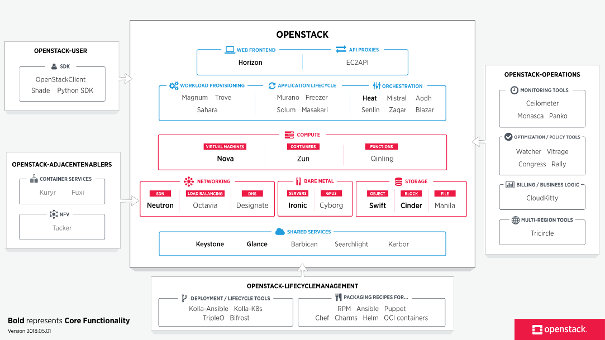

# Openstack Essentials

OpenStack is a set of opensource software tools for building and managing cloud computing platforms for public and private clouds. [Go to official documentation](https://docs.openstack.org/contributors/es_MX/common/introduction.html).

It can be managed from web application dashboard, command line tools, and from restful web services.

## Overview of OpenStack services




## [Quick Start](https://docs.openstack.org/devstack/latest/#quick-start "Link to this heading")


Follow instructions from: [https://docs.openstack.org/devstack/latest/](https://docs.openstack.org/devstack/latest/)

### 1. Install Linux

Start with a clean and minimal install of a Linux system. DevStack attempts to support the two latest LTS releases of Ubuntu, Rocky Linux 9 and openEuler.

If you do not have a preference, Ubuntu 22.04 (Jammy) is the most tested, and will probably go the smoothest.

### 2. Add Stack User (optional)

DevStack should be run as a non-root user with sudo enabled (standard logins to cloud images such as “ubuntu” or “cloud-user” are usually fine).

If you are not using a cloud image, you can create a separate stack user to run DevStack with

```
sudo useradd -s /bin/bash -d /opt/stack -m stack
```

Ensure home directory for the `stack` user has executable permission for all, as RHEL based distros create it with `700` and Ubuntu 21.04+ with `750` which can cause issues during deployment.

```
sudo chmod +x /opt/stack
```


Since this user will be making many changes to your system, it should have sudo privileges:

```
echo "stack ALL=(ALL) NOPASSWD: ALL" | sudo tee /etc/sudoers.d/stack
sudo -u stack -i
```


### 3. Download DevStack[](https://docs.openstack.org/devstack/latest/#download-devstack "Link to this heading")

```
git clone https://opendev.org/openstack/devstack
cd devstack
```

The `devstack` repo contains a script that installs OpenStack and templates for configuration files.

### 4. Create a local.conf[](https://docs.openstack.org/devstack/latest/#create-a-local-conf "Link to this heading")

Create a `local.conf` file with four passwords preset at the root of the devstack git repo.

```
[[local|localrc]]
ADMIN_PASSWORD=secret
DATABASE_PASSWORD=$ADMIN_PASSWORD
RABBIT_PASSWORD=$ADMIN_PASSWORD
SERVICE_PASSWORD=$ADMIN_PASSWORD
```

This is the minimum required config to get started with DevStack. There is a sample [`local.conf`](https://docs.openstack.org/devstack/latest/_downloads/d6fbba8d6ab5e970a86dd2ca0b884098/local.conf) file under the _samples_ directory in the devstack repository.

Warning: Only use alphanumeric characters in your passwords, as some services fail to work when using special characters.

### 5. Start the install


```
./stack.sh
```

This will take 15 - 30 minutes, largely depending on the speed of your internet connection. Many git trees and packages will be installed during this process.