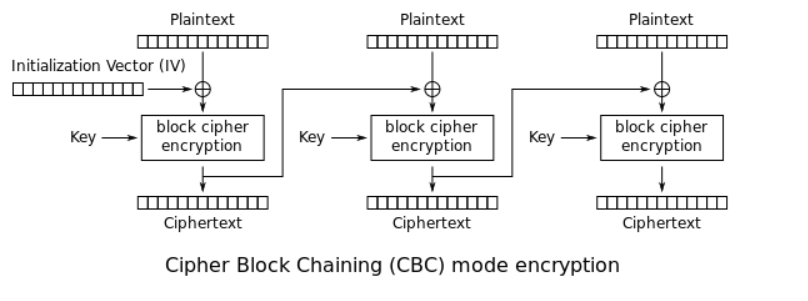

# Cryptography

## Encryption Technologies

|**Encryption Technology**|**Description**|
|---|---|
|`UNIX crypt(3)`|Crypt(3) is a traditional UNIX encryption system with a 56-bit key.|
|`Traditional DES-based`|DES-based encryption uses the Data Encryption Standard algorithm to encrypt data.|
|`bigcrypt`|Bigcrypt is an extension of traditional DES-based encryption. It uses a 128-bit key.|
|`BSDI extended DES-based`|BSDI extended DES-based encryption is an extension of the traditional DES-based encryption and uses a 168-bit key.|
|`FreeBSD MD5-based` (Linux & Cisco)|FreeBSD MD5-based encryption uses the MD5 algorithm to encrypt data with a 128-bit key.|
|`OpenBSD Blowfish-based`|OpenBSD Blowfish-based encryption uses the Blowfish algorithm to encrypt data with a 448-bit key.|
|`Kerberos/AFS`|Kerberos and AFS are authentication systems that use encryption to ensure secure entity communication.|
|`Windows LM`|Windows LM encryption uses the Data Encryption Standard algorithm to encrypt data with a 56-bit key.|
|`DES-based tripcodes`|DES-based tripcodes are used to authenticate users based on the Data Encryption Standard algorithm.|
|`SHA-crypt hashes`|SHA-crypt hashes are used to encrypt data with a 256-bit key and are available in newer versions of Fedora and Ubuntu.|
|`SHA-crypt` and `SUNMD5 hashes` (Solaris)|SHA-crypt and SUNMD5 hashes use the SHA-crypt and MD5 algorithms to encrypt data with a 256-bit key and are available in Solaris.|
|`...`|and many more.|

## Symmetric Encryption 

There is only a shared secret key

## Asymmetric PKI Encryption
There is a public and a private key.

## Digital certificate

A digital certificate is an electronic document used to identify an individual, a sercer, an organization, or some other entity and associate that entity with a public key.

Digital certificates are used in **PKI public key infraestructure** encryption. We can thing of a digital certificate as our "online" digital credential that verifies our identity.

Digital certificates are issued by Certificate Authorities (CA). 

## Emails

Symmetric and asymmetric encryption don't guarantee Integrity, Authentication or Non-Repudiation. They only guarantee Confidentiality. 

To achieve Integrity, Authentication and Non-Repudiation, emails use a digital signature.

## Windows Encrypted File System

Windows Encrypted File System (EFS) allows us to encrypt individual files and folders. Bit Locker, on the other hand, is full disk encryption.

Windows encryption uses a combination of symmetric and asymmetric encryption whereas:

+ A separate symmetric secret key is created for each file.
+ A digital certificate is created for the user, which holds the user's private and public pair.

If the user's digital certificate is deleted or lost, encrypted files and folders can only be decrypted with a Windows Recovery Agent.

Let's how it's decrypted: 

Software based encryption: uses software tools to encrypt data: bitlocker, windows EFS, Veracrypt, 7zip.

## Cipher block chaining (CBC)

Source: [wikipedia](https://en.wikipedia.org/wiki/Block_cipher_mode_of_operation)

