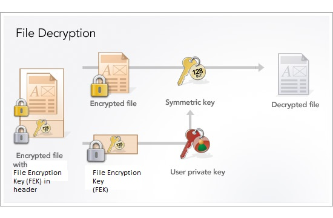

# Cryptography

## Symmetric Encryption 

There is only a shared secret key

## Asymmetric PKI Encryption
There is a public and a private key.

## Digital certificate

A digital certificate is an electronic document used to identify an individual, a sercer, an organization, or some other entity and associate that entity with a public key.

Digital certificates are used in **PKI public key infraestructure** encryption. We can thing of a digital certificate as our "online" digital credential that verifies our identity.

Digital certificates are issued by Certificate Authorities (CA). 

## Emails

Symmetric and asymmetric encryption don't guarantee Integrity, Authentication or Non-Repudiation. They only guarantee Confidentiality. 

To achieve Integrity, Authentication and Non-Repudiation, emails use a digital signature.

## Windows Encrypted File System

Windows Encrypted File System (EFS) allows us to encrypt individual files and folders. Bit Locker, on the other hand, is full disk encryption.

Windows encryption uses a combination of symmetric and asymmetric encryption whereas:

+ A separate symmetric secret key is created for each file.
+ A digital certificate is created for the user, which holds the user's private and public pair.

If the user's digital certificate is deleted or lost, encrypted files and folders can only be decrypted with a Windows Recovery Agent.

Let's how it's decrypted: 

Software based encryption: uses software tools to encrypt data: bitlocker, windows EFS, Veracrypt, 7zip.