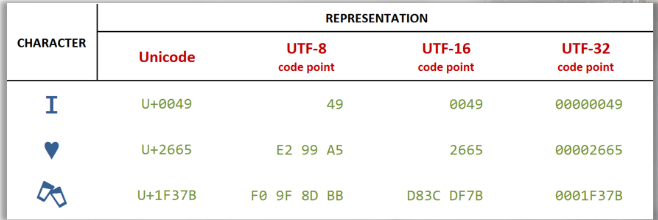
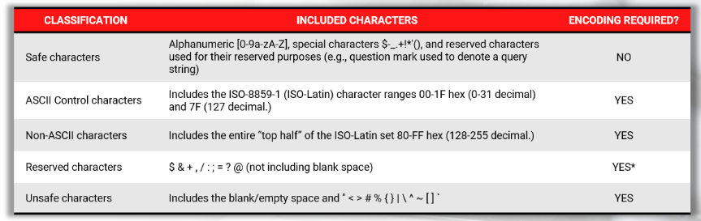
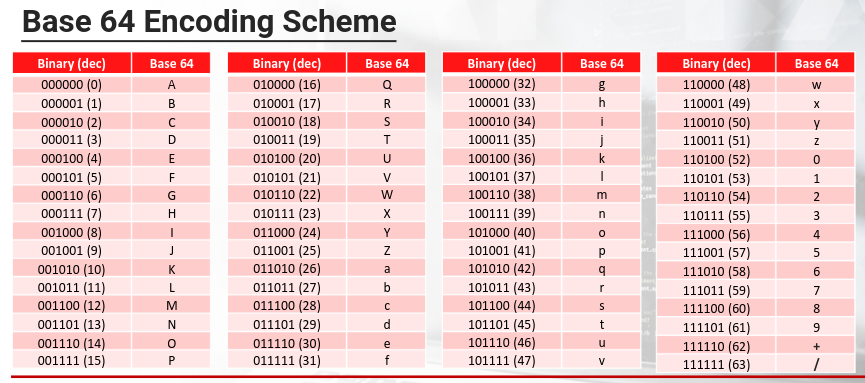
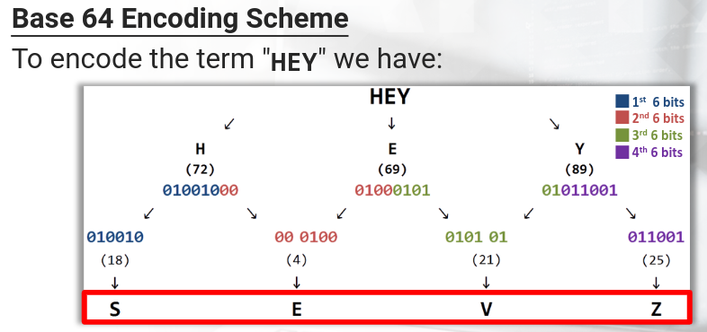
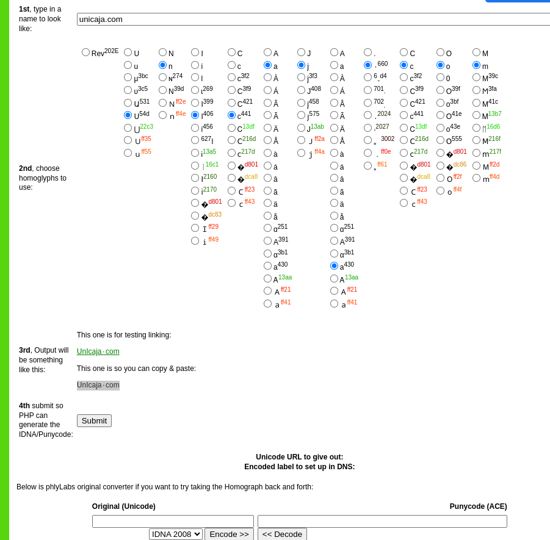

# Data encoding 

??? example "Resources"
    - [All ASCII codes](https://www.ascii-code.com/)
    -  [All UTF-8 enconding table and Unicode characters](https://www.utf8-chartable.de/)
    - [Charset converter](https://www.charset.org/)
    - [HTML URL Encoding Reference](https://www.w3schools.com/tags/ref_urlencode.asp)


Encoding ensures that data like text, images, files and multimedia can be effectively communicated and displayed through web technologies and typically involves converting data from its original form into a format that is suitable for digital transmission and storage while preserving its meaning and integrity. Encoding plays a crucial role in discovering and understanding how a web application handles different types of input, especially when those inputs contain special characters, binary data, or unexpected sequences.

Encoding is an essential aspect of web application penetration testing, particularly when dealing with input validation, data  transmission, and various attack vectors. It involves  manipulating data or converting it into a different format, often to bypass security measures, discover vulnerabilities, or execute attacks.

## Basic concepts

A "**charset**," short for character set, is a collection of characters, symbols, and glyphs that are associated with unique numeric codes or code points. Character sets define how textual data is mapped to binary values in computing systems. Examples of charsets are: ASCII, Unicode, Latin-1 etc.

**Character encoding** is the representation in bytes of the symbols of a charset.

## ASCII encoding

URLs are permitted to contain only the printable characters in the US-ASCII character set: those in the range 0x20-0x7e inclusive. The URL-encoded form of any character is the % prefix followed by the character's two digit ASCII code expresed in hexadecimal.

>ASCII stands for "American Standard Code for Information Interchange." It's a widely used character encoding standard containing 128 characters that was developed in the 1960s to represent text and control characters in computers and communication equipment. ASCII defines a set of codes to represent letters, numbers, punctuation, and control characters used in the English language and basic communication. It primarily covers English characters, numbers, punctuation, and control characters, using 7 or 8 bits to represent each character. ASCII cannot be used to display symbols from other languages like Chinese.


[All ASCII codes](https://www.ascii-code.com/)

|       |           |
| ----- | --------- |
| %3d   | =         |
| %25   | %         |
| %20   | space     |
| %00   | null byte |
| %0a   | new line  |
| %27   | '         |
| %22   | "         |
| %2e   | .         |
| %2f   | /         |
| %28   | (         |
| %29   | )         |
| %5e   | ^         |
| %3f   | ?         |
| %3c   | <         |
| %3e   | >         |
| %3b   | ;         |
| %23   | #         |
| %2d   | -         |
| %2a   | *         |
| %3a   | :         |
| %5c\| | \         |
| %5b   | [         |
| %5d   | ]         |

**Characteristics:**

- Character Set: ASCII includes a total of 128 characters, each represented by a unique 7-bit binary code. These characters include uppercase and lowercase letters, digits, punctuation marks, and some control characters.
- 7-Bit Encoding: In ASCII, each character is encoded using 7 bits, allowing for a total of 2^7 (128) possible characters. The most significant bit is often used for parity checking in older systems.
- Standardization: ASCII was established as a standard by the American National Standards Institute (ANSI) in 1963 and later became an international standard.
- Basic Character Set: 

	- Uppercase letters: A-Z (65-90)
	- Lowercase letters: a-z (97-122)
	- Digits: 0-9 (48-57)
	- Punctuation: Various symbols such as !, @, #, $, %, etc.
	- Control characters: Characters like newline, tab, carriage return, etc.

- Compatibility: ASCII is a subset of many other character encodings, including more comprehensive standards like Unicode. The first 128 characters of the Unicode standard correspond to the ASCII characters. 
- Limitations: ASCII is primarily designed for English text and doesn't support characters from other languages or special symbols.


## Unicode encoding

Unicode is a character set standard that aims to encompass characters from all writing systems and languages used worldwide. Unlike early encoding standards like ASCII, which were limited to a small set of characters, Unicode provides a unified system for representing a vast range of characters, symbols, and glyphs in a consistent manner. It enables computers to handle text and characters from diverse languages and scripts, making it essential for  internationalization and multilingual communication. 

"UTF" stands for "Unicode Transformation Format." It refers to different character encoding schemes within the Unicode standard that are used to represent Unicode characters as binary data.  Unicode has three main character encoding schemes: UTF-8, UTF-16 and UTF-32. The trailing number indicates the number of bits to represent code points.




[All UTF-8 enconding table and Unicode characters](https://www.utf8-chartable.de/)
### UTF-8 (Unicode Transformation Format 8-bit)

UTF-8 is a variable-length character encoding scheme. It uses 8-bit units (bytes) to represent characters. ASCII characters are represented using a single byte (backward compatibility).

Non-ASCII characters are represented using multiple bytes, with the number of bytes varying based on the character's code point. 

UTF-8 is widely used on the web and in many applications due to its efficiency and compatibility with ASCII.


### UTF-16 (Unicode Transformation Format 16-bit)

UTF-16 is a variable-length character encoding scheme. It uses 16-bit units (two bytes) to represent characters. Characters with code points below 65536 (BMP - Basic Multilingual Plane) are represented using two bytes. 

Characters with higher code points (outside the BMP) are represented using four bytes (surrogate pairs).

UTF-16 is commonly used in programming languages like Java and Windows systems.


## HTML encoding

HTML encoding, also known as HTML entity encoding, involves converting special characters and reserved symbols into their corresponding HTML entities to ensure that they are displayed correctly in web browsers and avoid any unintended  interpretation as HTML code.

HTML encoding is crucial for maintaining the integrity of web content and preventing issues such as cross-site scripting (XSS) attacks. HTML entities are sequences of characters that represent special characters, symbols, and reserved characters in HTML.

They start with an ampersand (&) and end with a semicolon (;). When the browser encounters an entity in an HTML page it will show the symbol to the user and will not interpret the symbol as an HTML language element.

|            |                                 |
| ---------- | ------------------------------- |
| `&lt;`     | < (less than sign)              |
| `&gt;`     | > (greater than sign)           |
| `&amp;`    | & (ampersand)                   |
| `&quot;`   | " (double quotation mark)       |
| `&apos;`   | ' (apostrophe)                  |
| `&nbsp;`   | non-breaking space              |
| `&mdash;`  | em dash (—)                     |
| `&copy;`   | copyright symbol (©)            |
| `&reg;`    | registered trademark symbol (®) |
| `&hellip;` | ellipsis (...)                  |

In addition, any character can be HTML encoded using its ASCII code in decimal form:

|         |     |
| ------- | --- |
| `&#34;` | "   |
| `&#39;` | '   |

or by using its ASCII code in hexadecimal form (prefixed by an X): 

|          |     |
| -------- | --- |
| `&#x22;` | "   |
| `&#x27;` | '   |


## URL Encoding

[HTML URL Encoding Reference](https://www.w3schools.com/tags/ref_urlencode.asp)

URL encoding, also known as percent-encoding, is a process used to encode special characters, reserved characters, and non-ASCII characters into a format that is safe for transmission within URLs (Uniform Resource Locators) and URI (Uniform Resource Identifiers). 

URL encoding replaces unsafe characters with a "%" sign  followed by two hexadecimal digits that represent the ASCII  code of the character.  This allows URLs to be properly interpreted by web browsers and other network components. URLs sent over the Internet must contain characters in the range of the US-ASCII code character set. If unsafe characters are present in a URL, encoding them is required. 

This encoding is important because it limits the characters to be used in a URL to a subset of specific characters: 

- Unreserved Chars- `[a-zA-z] [0-9] [- . _ ~]` 
- Reserved Chars `- : / ? # [ ] @ ! $ & " ( ) * + , ; = %`

Other characters are encoded by the use of a percent char (%) plus two hexadecimal digits. Although it appears to be a security feature, URL-encoding is not. It is only a method used to send data across the Internet but, it can lower (or enlarge) the attack surface (in some cases).

Generally, web browsers (and other client-side components) automatically perform URL-encoding and, if a server-side script engine is present, it will automatically perform URL-decoding.




|           |          |
| --------- | -------- |
| %23       | #        |
| %3F       | ?        |
| %24       | &        |
| %25       | %        |
| %2F       | /        |
| %2B       | +        |
| `<space>` | %20 or + |

URL encoding is defined in the meta tag content type:

```html
# before HTML5
<meta http-equiv="Content-Type"Content="text/html";charset="utf-8">

# With HTML5
<meta charset="utf-8">
```

This is how you define that HTML meta tag in some languages:

```
# PHP
header('Content-type: text/html; charset=utf8');

# ASP.NET
<%Response.charset="utf-8"%>

# JSP
<%@ page contentType="text/html; charset=UTF-8" %>
```

## Base64 encoding

Base64 is an schema that allows any binary data (images, audio files, and other non-text data) to be safely represented by using solely printable ASCII characters. 

Base64 is commonly used for encoding email attachtment for safe transmission over [SMTP](25-565-587-simple-mail-tranfer-protocol-smtp.md). It's also used for encoding user credentials in basic [HTTP authentication](webexploitation/http-authentication-schemes.md). 

### How it works

**Encoding**

Base64 encoding processes input data in blocks of 3 bytes. It divides these 24  bits into 4 chunks of six bits each. With these 64 different possible permutations (for the six bits) it can represent the following character set:

```
ABCDEFGHIJKLMNOPQRSTUVWXYZabcdefghijklmnopqrstuvwxyz0123456789+/
```



Different variations of Base64 encoding may use different characters for the last two positions (`+` and `/`).

If the final block of input data results in less than 3 chunks of output data, the the output is padded with one or two equal signs characters.




**Decoding**

Base64 decoding is the reverse process. The encoded Base64 string is divided into segments of four characters. Each character is converted back to its 6-bit value, and these values are combined to reconstruct the original binary data.

>**Use cases**
>
>- Binary Data in Text Contexts: Web applications often deal with binary data such as images, audio, or files. Since URLs, HTML, and other text-based formats can't directly handle binary data, Base64 encoding is used to represent this binary data as text. This allows binary data to be included in places that expect text, such as in HTML or JSON responses.
>- Data URL Embedding: Data URLs are a way to embed small resources directly into the HTML or CSS code. These URLs include the actual resource data in Base64-encoded form, eliminating the need for separate HTTP requests. For example, an image can be embedded directly in the HTML using a Data URL.
>- Minimization of Requests: By encoding small images or icons as Data URLs within CSS or HTML, web developers can reduce the number of requests made to the server, potentially improving page load times. 
>- Simplification of Resource Management: Embedding resources directly into HTML or CSS can simplify resource management and deployment. Developers don't need to worry about file paths or URLs. 
>- Offline Storage: In certain offline or single-page applications, Base64-encoded data can be stored in local storage or indexedDB for quick access without the need to fetch resources from the server.


Encoding/decoding in Base64:

```
# PHP Example
base64_encode('encode this string');
base64_decode('ZW5jb2RlIHRoaXMgc3RyaW5n');

# Javascript example
window.btoa('encode this string');
window.atob('ZW5jb2RlIHRoaXMgc3RyaW5n');

# Handling Unicode in javascript requires previous encoding. The escapes and encodings are required to avoid exceptions with characters out of range
window.btoa(encodeURIComponent(escape ('encode this string') ));
window.atob(decodeURIComponent(escape ('ZW5jb2RlIHRoaXMgc3RyaW5n') ));

```


## Base 36 encoding scheme

It's the most compact, case-insensitive, alphanumeric numeral system using ASCII characters. The scheme's alphabet contains all digits `[0-9]` and Latin letters `[A-Z]`.


| Base 10       | Base 36  |     |
| ------------- | -------- | --- |
| 1294870408610 | GIUSEPPE |     |

Base 36 Encoding scheme is used in many real-world scenarios.

Converting Base36 to decimal:

```
# Number Base36 OHPE to decimal base

# PHP Example: base_convert()
base_convert("OHPE",36,10);

# Javascript example: toString
(1142690).toString(36)
parseInt("ohpe",36)
```


## Visual spoofing attack

It's one of the possible attacks that can be perform with unicode:


A tool for generating visual spoofing attacks: [https://www.irongeek.com/homoglyph-attack-generator.php](https://www.irongeek.com/homoglyph-attack-generator.php)



[Paper](https://www.irongeek.com/i.php?page=security/out-of-character-use-of-punycode-and-homoglyph-attacks-to-obfuscate-urls-for-phishing)


## Multiple encodings/decodings

Sometimes encoding and decoding is used multiple times. This can also be used to bypass security measures.