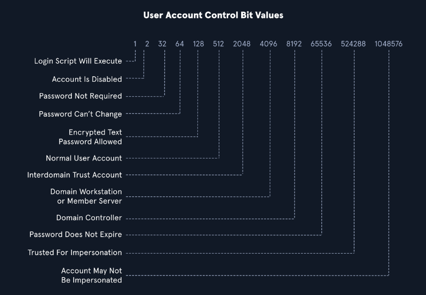

# Dsquery

[Dsquery](https://docs.microsoft.com/en-us/previous-versions/windows/it-pro/windows-server-2012-r2-and-2012/cc732952(v=ws.11)) is a helpful command-line tool that can be utilized to find Active Directory objects. 

`dsquery` will exist on any host with the `Active Directory Domain Services Role` installed, and the `dsquery` DLL exists on all modern Windows systems by default now and can be found at `C:\Windows\System32\dsquery.dll`.

All we need is elevated privileges on a host or the ability to run an instance of Command Prompt or PowerShell from a `SYSTEM` context.


## Basic commands

```powershell
# User Search
dsquery user

# Computer Search
dsquery computer

# List objects in an OU
dsquery * "CN=Users,DC=INLANEFREIGHT,DC=LOCAL"

#  List Users With Specific Attributes Set (PASSWD_NOTREQD) by Combining dsquery with LDAP search filters of our choosing. The below looks for users with the PASSWD_NOTREQD flag set in the userAccountControl attribute.
dsquery * -filter "(&(objectCategory=person)(objectClass=user)(userAccountControl:1.2.840.113556.1.4.803:=32))" -attr distinguishedName userAccountControl

# Searching for Domain Controllers
 dsquery * -filter "(userAccountControl:1.2.840.113556.1.4.803:=8192)" -limit 5 -attr sAMAccountName
# userAccountControl:1.2.840.113556.1.4.803: Specifies that we are looking at the User Account Control (UAC) attributes for an object. This portion can change to include three different values we will explain below when searching for information in AD (also known as Object Identifiers (OIDs).
# =8192 represents the decimal bitmask we want to match in this search. This decimal number corresponds to a corresponding UAC Attribute flag that determines if an attribute like password is not required or account is locked is set. 

```

>`userAccountControl:1.2.840.113556.1.4.803:` Specifies that we are looking at the [User Account Control (UAC) attributes](https://docs.microsoft.com/en-us/troubleshoot/windows-server/identity/useraccountcontrol-manipulate-account-properties) for an object.
>
>	- `userAccountControl:1.2.840.113556.1.4.803:` Specifies that we are looking at the [User Account Control (UAC) attributes](https://docs.microsoft.com/en-us/troubleshoot/windows-server/identity/useraccountcontrol-manipulate-account-properties) for an object.
>	- `=8192` represents the decimal bitmask we want to match in this search.
>
>OIDs are rules used to match bit values with attributes, as seen above. For LDAP and AD, there are three main matching rules:
>
>1. `1.2.840.113556.1.4.803`
>When using this rule as we did in the example above, we are saying the bit value must match completely to meet the search requirements. Great for matching a singular attribute.
>
>2. `1.2.840.113556.1.4.804`
>When using this rule, we are saying that we want our results to show any attribute match if any bit in the chain matches. This works in the case of an object having multiple attributes set.
>
>3. `1.2.840.113556.1.4.1941`
>This rule is used to match filters that apply to the Distinguished Name of an object and will search through all ownership and membership entries.