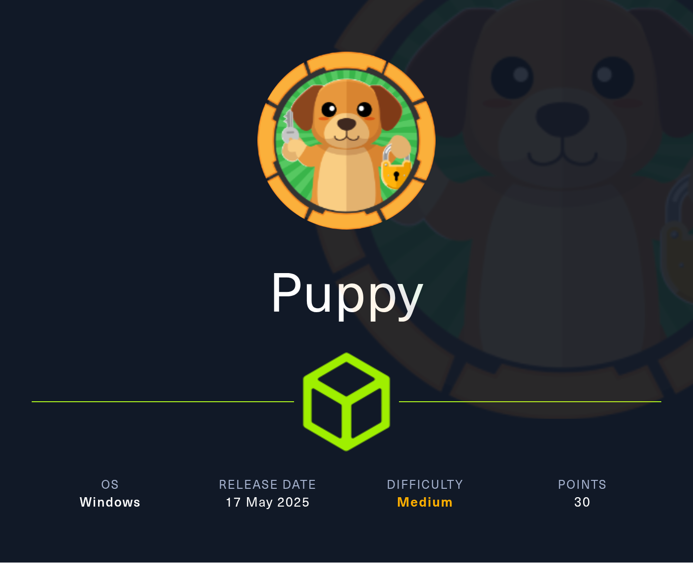

# HTB Puppy

## Description



As is common in real life pentests, you will start the Puppy box with credentials for the following account: levi.james / KingofAkron2025!


## user.txt

Enumeration:

```
sudo nmap $ip -sC -sV -Pn -p-
```

Output:

```
PORT      STATE SERVICE       VERSION
53/tcp    open  domain        Simple DNS Plus
88/tcp    open  kerberos-sec  Microsoft Windows Kerberos (server time: 2025-07-15 00:33:12Z)
111/tcp   open  rpcbind       2-4 (RPC #100000)
| rpcinfo: 
|   program version    port/proto  service
|   100000  2,3,4        111/tcp   rpcbind
|   100000  2,3,4        111/tcp6  rpcbind
|   100000  2,3,4        111/udp   rpcbind
|   100000  2,3,4        111/udp6  rpcbind
|   100003  2,3         2049/udp   nfs
|   100003  2,3         2049/udp6  nfs
|   100005  1,2,3       2049/udp   mountd
|   100005  1,2,3       2049/udp6  mountd
|   100024  1           2049/tcp   status
|   100024  1           2049/tcp6  status
|   100024  1           2049/udp   status
|_  100024  1           2049/udp6  status
135/tcp   open  msrpc         Microsoft Windows RPC
139/tcp   open  netbios-ssn   Microsoft Windows netbios-ssn
389/tcp   open  ldap          Microsoft Windows Active Directory LDAP (Domain: PUPPY.HTB0., Site: Default-First-Site-Name)
445/tcp   open  microsoft-ds?
464/tcp   open  kpasswd5?
593/tcp   open  ncacn_http    Microsoft Windows RPC over HTTP 1.0
636/tcp   open  tcpwrapped
2049/tcp  open  status        1 (RPC #100024)
3260/tcp  open  iscsi?
3268/tcp  open  ldap          Microsoft Windows Active Directory LDAP (Domain: PUPPY.HTB0., Site: Default-First-Site-Name)
3269/tcp  open  tcpwrapped
5985/tcp  open  http          Microsoft HTTPAPI httpd 2.0 (SSDP/UPnP)
|_http-server-header: Microsoft-HTTPAPI/2.0
|_http-title: Not Found
9389/tcp  open  mc-nmf        .NET Message Framing
49664/tcp open  msrpc         Microsoft Windows RPC
49667/tcp open  msrpc         Microsoft Windows RPC
49669/tcp open  msrpc         Microsoft Windows RPC
49676/tcp open  ncacn_http    Microsoft Windows RPC over HTTP 1.0
49691/tcp open  msrpc         Microsoft Windows RPC
58874/tcp open  msrpc         Microsoft Windows RPC
64983/tcp open  msrpc         Microsoft Windows RPC
Service Info: Host: DC; OS: Windows; CPE: cpe:/o:microsoft:windows

Host script results:
| smb2-security-mode: 
|   3:1:1: 
|_    Message signing enabled and required
| smb2-time: 
|   date: 2025-07-15T00:35:00
|_  start_date: N/A
|_clock-skew: 7h38m16s

```

Enumerate shares with user levi.james:

```
crackmapexec smb 10.129.232.75 -u levi.james -p 'KingofAkron2025!' --shares
```

Output:
 
```
SMB         10.129.232.75   445    DC               [*] Windows 10.0 Build 20348 x64 (name:DC) (domain:PUPPY.HTB) (signing:True) (SMBv1:False)
SMB         10.129.232.75   445    DC               [+] PUPPY.HTB\levi.james:KingofAkron2025! 
SMB         10.129.232.75   445    DC               [*] Enumerated shares
SMB         10.129.232.75   445    DC               Share           Permissions     Remark
SMB         10.129.232.75   445    DC               -----           -----------     ------
SMB         10.129.232.75   445    DC               ADMIN$                          Remote Admin
SMB         10.129.232.75   445    DC               C$                              Default share
SMB         10.129.232.75   445    DC               DEV                             DEV-SHARE for PUPPY-DEVS
SMB         10.129.232.75   445    DC               IPC$            READ            Remote IPC
SMB         10.129.232.75   445    DC               NETLOGON        READ            Logon server share 
SMB         10.129.232.75   445    DC               SYSVOL          READ            Logon server share 

```


### rpcclient

```
 rpcclient -U "levi.james"  $ip
```


```
smbclient  \\\\$ip\\SYSVOL -U "levi.james" 
```


```
enumdomusers
```

Output:

```
user:[Administrator] rid:[0x1f4]
user:[Guest] rid:[0x1f5]
user:[krbtgt] rid:[0x1f6]
user:[levi.james] rid:[0x44f]
user:[ant.edwards] rid:[0x450]
user:[adam.silver] rid:[0x451]
user:[jamie.williams] rid:[0x452]
user:[steph.cooper] rid:[0x453]
user:[steph.cooper_adm] rid:[0x457]

```

Therefore we can build a user.txt

```
Administrator
Guest
krbtgt
levi.james
ant.edwards
adam.silver
steph.cooper
steph.cooper_adm
```

We tried several things, and finally 

```
bloodhound-python -u 'levi.james' -p 'KingofAkron2025!'  -d puppy.htb -ns $ip -c All --zip
```


```

```


```

```


```

```


```

```


```

```


```

```


```

```


```

```


```

```


```

```


```

```


```

```


```

```


```

```


```

```


```

```


```

```


```

```


```

```


```

```


```

```


```

```


```

```


```

```


```

```


```

```


```

```


```

```


```

```


```

```


```

```


```

```


```

```


```

```


```

```


```

```


```

```


```

```


```

```


```

```


```

```


```

```


```

```


```

```


```

```


```

```


```

```


```

```


```

```


```

```


```

```


