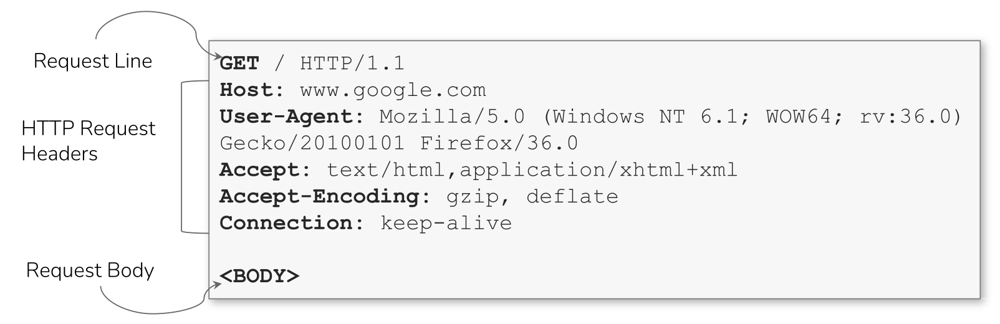
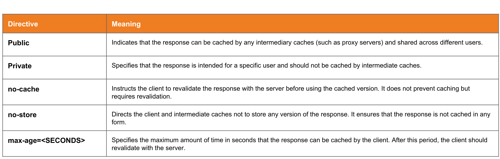

# HTTP headers

??? abstract "Tools"
    - [Curl](curl.md)


HTTP (Hypertext Transfer Protocol) is a stateless application layer protocol used for the transmission of resources like web application data and runs on top of TCP.

It was specifically designed for communication between web browsers and web servers.

HTTP utilizes the typical client-server architecture for communication, whereby the browser is the client, and the web server is the server. 

Resources are uniquely identified with a URL/URI.

HTTP has 3 versions; HTTP 1.0, HTTP 1.1., and HTTP/2. And HTTP/3 in on its way.

- HTTP 1.1 is the most widely used version of HTTP and has several advantages over HTTP 1.0 such as the ability to re-use the same TCP connection, take advantage of the 3 ways handshake that was performed and request for multiple URI’s/Resources in that connection.

## Structure of a HTTP request




**Request Line**: The request line is the first line of an HTTP request and contains the
following three components:

```
HTTP method (e.g., GET, POST, PUT, DELETE, etc.): Indicates the type of request being made.
URL (Uniform Resource Locator): The address of the resource the client wants to access.
HTTP version: The version of the HTTP protocol being used (e.g., HTTP/1.1).
```

**Request Headers**: they  provide additional information about the request. Common headers include:

```
User-Agent: Information about the client making the request (e.g., browser type).
Host: The hostname of the server.
Accept: The media types the client can handle in the response (e.g., HTML, JSON).
Authorization: Credentials for authentication, if required.
Cookie: Information stored on the client-side and sent back to the server with each request.
```

```
GET /home/ HTTP/2
Host: site.com
Cookie: session=cookie-value-00000-00000
User-Agent: Mozilla/5.0 (Windows NT 10.0; Win64; x64; rv:122.0) Gecko/20100101 Firefox/122.0
Accept: text/html,application/xhtml+xml,application/xml;q=0.9,image/avif,image/webp,*/*;q=0.8
Accept-Language: en-US,en;q=0.5
Accept-Encoding: gzip, deflate, br
Dnt: 1
Sec-Gpc: 1
```

**Request Body (Optional):** Some HTTP methods (like POST or PUT) include a request body where data is sent to the server, typically in JSON or form data format.

### HTTP verbs (or methods)


## Structure of a HTTP response 

**Response headers**: Similar to request headers, response headers provide additional information about the response. Common headers include:

```
Content-Type: The media type of the response content (e.g., text/html, application/json).
Content-Length: The size of the response body in bytes.
Set-Cookie: Used to set cookies on the client-side for subsequent requests.
Cache-Control: Directives for caching behavior.
```

**Response Body** (Optional):  The response body contains the actual content of the response. For example, in the case of an HTML page, the response body will contain
the HTML markup.

In response to the HTTP Request, the web server will respond with the requested resource, preceded by a bunch of new HTTP response headers. These new response headers from the web server will be used by your web browser to interpret the content contained in the Response content/body of the response.

An example: 

```
HTTP/1.1 200 OK
Date: Fri, 13 Mar 2015 11:26:05 GMT
Cache-Control: private, max-age=0
Content-Type: text/html; charset=UTF-8
Content-Encoding: gzip
Server: gws
Content-Length: 258
```


## Header types

### General headers
[General headers](https://www.w3.org/Protocols/rfc2616/rfc2616-sec4.html) are used in both HTTP requests and responses. They are contextual and are used to `describe the message rather than its contents`.

| **Header**   | **Example**                           | **Description**                                                                                                                                                                                                                                                                                                                                                                           |
| ------------ | ------------------------------------- | ----------------------------------------------------------------------------------------------------------------------------------------------------------------------------------------------------------------------------------------------------------------------------------------------------------------------------------------------------------------------------------------- |
| `Date`       | `Date: Wed, 16 Feb 2022 10:38:44 GMT` | Holds the date and time at which the message originated. It's preferred to convert the time to the standard [UTC](https://en.wikipedia.org/wiki/Coordinated_Universal_Time) time zone.                                                                                                                                                                                                    |
| `Connection` | `Connection: close`                   | Dictates if the current network connection should stay alive after the request finishes. Two commonly used values for this header are `close` and `keep-alive`. The `close` value from either the client or server means that they would like to terminate the connection, while the `keep-alive` header indicates that the connection should remain open to receive more data and input. |

### Entity headers

Similar to general headers, [Entity Headers](https://www.w3.org/Protocols/rfc2616/rfc2616-sec7.html) can be `common to both the request and response`. These headers are used to `describe the content` (entity) transferred by a message. They are usually found in responses and POST or PUT requests.

| **Header**         | **Example**                   | **Description**                                                                                                                                                                                                                                                            |
| ------------------ | ----------------------------- | -------------------------------------------------------------------------------------------------------------------------------------------------------------------------------------------------------------------------------------------------------------------------- |
| `Content-Type`     | `Content-Type: text/html`     | Used to describe the type of resource being transferred. The value is automatically added by the browsers on the client-side and returned in the server response. The `charset` field denotes the encoding standard, such as [UTF-8](https://en.wikipedia.org/wiki/UTF-8). |
| `Media-Type`       | `Media-Type: application/pdf` | The `media-type` is similar to `Content-Type`, and describes the data being transferred. This header can play a crucial role in making the server interpret our input. The `charset` field may also be used with this header.                                              |
| `Boundary`         | `boundary="b4e4fbd93540"`     | Acts as a marker to separate content when there is more than one in the same message. For example, within a form data, this boundary gets used as `--b4e4fbd93540` to separate different parts of the form.                                                                |
| `Content-Length`   | `Content-Length: 385`         | Holds the size of the entity being passed. This header is necessary as the server uses it to read data from the message body, and is automatically generated by the browser and tools like cURL.                                                                           |
| `Content-Encoding` | `Content-Encoding: gzip`      | Data can undergo multiple transformations before being passed. For example, large amounts of data can be compressed to reduce the message size. The type of encoding being used should be specified using the `Content-Encoding` header.                                   |

### Request headers

The client sends [Request Headers](https://tools.ietf.org/html/rfc2616) in an HTTP transaction. These headers are `used in an HTTP request and do not relate to the content` of the message. The following headers are commonly seen in HTTP requests.

| **Header**      | **Example**                              | **Description**                                                                                                                                                                                                                                                                                                                                                                                                                                                      |
| --------------- | ---------------------------------------- | -------------------------------------------------------------------------------------------------------------------------------------------------------------------------------------------------------------------------------------------------------------------------------------------------------------------------------------------------------------------------------------------------------------------------------------------------------------------- |
| `Host`          | `Host: www.inlanefreight.com`            | Used to specify the host being queried for the resource. This can be a domain name or an IP address. HTTP servers can be configured to host different websites, which are revealed based on the hostname. This makes the host header an important enumeration target, as it can indicate the existence of other hosts on the target server.                                                                                                                          |
| `User-Agent`    | `User-Agent: curl/7.77.0`                | The `User-Agent` header is used to describe the client requesting resources. This header can reveal a lot about the client, such as the browser, its version, and the operating system.                                                                                                                                                                                                                                                                              |
| `Referer`       | `Referer: http://www.inlanefreight.com/` | Denotes where the current request is coming from. For example, clicking a link from Google search results would make `https://google.com` the referer. Trusting this header can be dangerous as it can be easily manipulated, leading to unintended consequences.                                                                                                                                                                                                    |
| `Accept`        | `Accept: */*`                            | The `Accept` header describes which media types the client can understand. It can contain multiple media types separated by commas. The `*/*` value signifies that all media types are accepted.                                                                                                                                                                                                                                                                     |
| `Cookie`        | `Cookie: PHPSESSID=b4e4fbd93540`         | Contains cookie-value pairs in the format `name=value`. A [cookie](https://en.wikipedia.org/wiki/HTTP_cookie) is a piece of data stored on the client-side and on the server, which acts as an identifier. These are passed to the server per request, thus maintaining the client's access. Cookies can also serve other purposes, such as saving user preferences or session tracking. There can be multiple cookies in a single header separated by a semi-colon. |
| `Authorization` | `Authorization: BASIC cGFzc3dvcmQK`      | Another method for the server to identify clients. After successful authentication, the server returns a token unique to the client. Unlike cookies, tokens are stored only on the client-side and retrieved by the server per request. There are multiple types of authentication types based on the webserver and application type used.                                                                                                                           |


### Response headers

[Response Headers](https://tools.ietf.org/html/rfc7231#section-7) can be `used in an HTTP response and do not relate to the content`. Certain response headers such as `Age`, `Location`, and `Server` are used to provide more context about the response. The following headers are commonly seen in HTTP responses.

| **Header**         | **Example**                                 | **Description**                                                                                                                                                                           |
| ------------------ | ------------------------------------------- | ----------------------------------------------------------------------------------------------------------------------------------------------------------------------------------------- |
| `Server`           | `Server: Apache/2.2.14 (Win32)`             | Contains information about the HTTP server, which processed the request. It can be used to gain information about the server, such as its version, and enumerate it further.              |
| `Set-Cookie`       | `Set-Cookie: PHPSESSID=b4e4fbd93540`        | Contains the cookies needed for client identification. Browsers parse the cookies and store them for future requests. This header follows the same format as the `Cookie` request header. |
| `WWW-Authenticate` | `WWW-Authenticate: BASIC realm="localhost"` | Notifies the client about the type of authentication required to access the requested resource.                                                                                           |

### Security Headers

Finally, we have [Security Headers](https://owasp.org/www-project-secure-headers/). With the increase in the variety of browsers and web-based attacks, defining certain headers that enhanced security was necessary. HTTP Security headers are `a class of response headers used to specify certain rules and policies` to be followed by the browser while accessing the website.

| **Header**                  | **Example**                                   | **Description**                                                                                                                                                                                                                                                                                                                             |
| --------------------------- | --------------------------------------------- | ------------------------------------------------------------------------------------------------------------------------------------------------------------------------------------------------------------------------------------------------------------------------------------------------------------------------------------------- |
| `Content-Security-Policy`   | `Content-Security-Policy: script-src 'self'`  | Dictates the website's policy towards externally injected resources. This could be JavaScript code as well as script resources. This header instructs the browser to accept resources only from certain trusted domains, hence preventing attacks such as [Cross-site scripting (XSS)](https://en.wikipedia.org/wiki/Cross-site_scripting). |
| `Strict-Transport-Security` | `Strict-Transport-Security: max-age=31536000` | Prevents the browser from accessing the website over the plaintext HTTP protocol, and forces all communication to be carried over the secure HTTPS protocol. This prevents attackers from sniffing web traffic and accessing protected information such as passwords or other sensitive data.                                               |
| `Referrer-Policy`           | `Referrer-Policy: origin`                     | Dictates whether the browser should include the value specified via the `Referer` header or not. It can help in avoiding disclosing sensitive URLs and information while browsing the website.                                                                                                                                              |


##  Headers: one by one

### Date header

**The "Date" header **in an HTTP response is used to indicate the date and time when the response was generated by the server. It helps clients and intermediaries to understand the freshness of the response and to synchronize the time between the server and the client. This is used in a blind SQLinjection, to see how long it takes for the server to respond.

### Status code

The status code can be resume in the following chart:


### Content-Type

**The "Content-Type" header **in an HTTP response is used to indicate the media type of the response content. It tells the client what type of data the server is sending so that the client can handle it appropriately.

[List of all content-type headers](https://raw.githubusercontent.com/amandaguglieri/dictionaries/main/content-type)


### Cache-control

**Cache-control**: Cache-control is a header used to specify caching policies for browsers and other caching services.  Specifically, the **`Cache-Control`** HTTP header field holds _directives_ (instructions) — in both requests and responses — that control caching in browsers and shared caches (e.g. Proxies, CDNs).



> Why this configuration is considered safe?  Cache-control: no-store, no-cache, max-age=0. 
> - *The max-age=N* response directive indicates that the response remains fresh until N seconds after the response is generated. 
> - *The no-cache *response directive indicates that the response can be stored in caches, but the response must be validated with the origin server before each reuse, even when the cache is disconnected from the origin server.
> - *The no-store response directive* indicates that any caches of any kind (private or shared) should not store this response.

### Server header

**The Server header** displays the Web Server banner, for example, Apache, Nginx, IIS etc. Google uses a custom web server banner: gws (Google Web Server).

### Set-Cookie

From [geeksforgeeks](https://www.geeksforgeeks.org/http-headers-set-cookie/): "The **HTTP header Set-Cookie** is a response header and used to send cookies from the server to the user agent. So the user agent can send them back to the server later so the server can detect the user."


```
# The cookie name have to avoid this character ( ) @, ; : \ ” / [ ] ? = { } plus control characters, spaces, and tabs. It can be any US-ASCII characters.
Set-Cookie: <cookie-name>=<cookie-value>

# This directive defines the host where the cookie will be sent. It is an optional directive.
Set-Cookie: <cookie-name>=<cookie-value>; Domain=<domain-value>

# It is an optional directive that contains the expiry date of the cookie.
Set-Cookie: <cookie-name>=<cookie-value>; Expires=<date>

# Forbids JavaScript from accessing the cookie, for example, through the `Document.cookie` property. Note that a cookie that has been created with `HttpOnly` will still be sent with JavaScript-initiated requests, for example, when calling `XMLHttpRequest.send()` or `fetch()`. This mitigates attacks against cross-site scripting XSS.
Set-Cookie: <cookie-name>=<cookie-value>; HttpOnly

# It contains the life span in a digit of seconds format, zero or negative value will make the cookie expired immediately.
Set-Cookie: <cookie-name>=<cookie-value>; Max-Age=<number>

Set-Cookie: <cookie-name>=<cookie-value>; Partitioned

# This directive define a path that must exist in the requested URL, else the browser can’t send the cookie header.
Set-Cookie: <cookie-name>=<cookie-value>; Path=<path-value>

Set-Cookie: <cookie-name>=<cookie-value>; Secure

# This directives providing some protection against cross-site request forgery attacks.
# Strict means that the browser sends the cookie only for same-site requests, that is, requests originating from the same site that set the cookie. If a request originates from a different domain or scheme (even with the same domain), no cookies with the `SameSite=Strict` attribute are sent.

Set-Cookie: <cookie-name>=<cookie-value>; SameSite=Strict

# Lax means that the cookie is not sent on cross-site requests, such as on requests to load images or frames, but is sent when a user is navigating to the origin site from an external site (for example, when following a link). This is the default behavior if the `SameSite` attribute is not specified.

Set-Cookie: <cookie-name>=<cookie-value>; SameSite=Lax

# means that the browser sends the cookie with both cross-site and same-site requests. The `Secure` attribute must also be set when setting this value, like so `SameSite=None; Secure`

Set-Cookie: <cookie-name>=<cookie-value>; SameSite=None; Secure

// Multiple attributes are also possible, for example:
Set-Cookie: <cookie-name>=<cookie-value>; Domain=<domain-value>; Secure; HttpOnly

```

#### Understanding SameSite attribute

**Differences between SameSite and SameOrigin**: we will use the URL `http://www.example.org`  to  see the differences more clearly.

| URL                           | Description                   | same-site | same-origin |
| ----------------------------- | ----------------------------- | --------- | ----------- |
| `http://www.example.org`      | Identical URL                 | ✅         | ✅           |
| `http://www.example.org:80`   | Identical URL (implicit port) | ✅         | ✅           |
| `http://www.example.org:8080` | Different port                | ✅         | ❌           |
| `http://sub.example.org`      | Different subdomain           | ✅         | ❌           |
| `https://www.example.org`     | Different scheme              | ❌         | ❌           |
| `http://www.example.evil`     | Different TLD                 | ❌         | ❌           |

When thinking about `SameSite` cookies, we're only thinking about "same-site" or "cross-site".


### CORS - Cross-Origin Resource Sharing 

Cross-Origin Resource Sharing (CORS) is an HTTP-header based mechanism that allows a server to indicate any origins (domain, scheme, or port) other than its own from which a browser should permit loading resources.

For security reasons, browsers restrict cross-origin HTTP requests initiated from scripts.


### X-XSS-Protection

The HTTP **`X-XSS-Protection`** response header is a feature of Internet Explorer, Chrome and Safari that stops pages from loading when they detect reflected cross-site scripting XSS  attacks.

**Syntax**

```
# Disables XSS filtering.
X-XSS-Protection: 0

# Enables XSS filtering (usually default in browsers). If a cross-site scripting attack is detected, the browser will sanitize the page (remove the unsafe parts).
X-XSS-Protection: 1

# Enables XSS filtering. Rather than sanitizing the page, the browser will prevent rendering of the page if an attack is detected.
X-XSS-Protection: 1; mode=block

# Enables XSS filtering. If a cross-site scripting attack is detected, the browser will sanitize the page and report the violation. This uses the functionality of the CSP report-uri directive to send a report.
X-XSS-Protection: 1; report=<reporting-uri>
```


### Strict-Transport-Security

The HTTP Strict-Transport-Security response header (often abbreviated as HSTS) informs browsers that the site should only be accessed using HTTPS, and that any future attempts to access it using HTTP should automatically be converted to HTTPS.

**Directives**

```
# The time, in seconds, that the browser should remember that a site is only to be accessed using HTTPS.
max-age=<expire-time>

# If this optional parameter is specified, this rule applies to all of the site's subdomains as well.
includeSubDomains 
```

Example:

```
Strict-Transport-Security: max-age=31536000; includeSubDomains
```


Additionally, Google maintains an **HSTS preload service** (used also by Firefox and Safari). By following the guidelines and successfully submitting your domain, you can ensure that browsers will connect to your domain only via secure connections. While the service is hosted by Google, all browsers are using this preload list. However, it is not part of the HSTS specification and should not be treated as official. Directive for the preload service is:

```
# When using preload, the max-age directive must be at least 31536000 (1 year), and the includeSubDomains directive must be present.
preload
```

Sending the `preload` directive from your site can have **PERMANENT CONSEQUENCES** and prevent users from accessing your site and any of its subdomains if you find you need to switch back to HTTP.

[What OWASP says about HSTS response header](https://cheatsheetseries.owasp.org/cheatsheets/HTTP_Strict_Transport_Security_Cheat_Sheet.html).

#### Exploitation

Site owners can use HSTS to identify users without cookies. This can lead to a significant privacy leak. Take a look [here](http://www.leviathansecurity.com/blog/the-double-edged-sword-of-hsts-persistence-and-privacy) for more details.

Cookies can be manipulated from sub-domains, so omitting the `includeSubDomains` option permits a broad range of cookie-related attacks that HSTS would otherwise prevent by requiring a valid certificate for a subdomain. Ensuring the `secure` flag is set on all cookies will also prevent, some, but not all, of the same attacks.

So... basically HSTS addresses the following threats:

- User bookmarks or manually types `http://example.com` and is subject to a man-in-the-middle attacker: HSTS automatically redirects HTTP requests to HTTPS for the target domain.
- Web application that is intended to be purely HTTPS inadvertently contains HTTP links or serves content over HTTP: HSTS automatically redirects HTTP requests to HTTPS for the target domain
- A man-in-the-middle attacker attempts to intercept traffic from a victim user using an invalid certificate and hopes the user will accept the bad certificate: HSTS does not allow a user to override the invalid certificate message


## HTTPS

HTTPS (Hypertext Transfer Protocol Secure) is a secure version of the HTTP protocol, which is used to transmit data between a user's web browser and a website or web application. 

HTTPS provides an added layer of security by encrypting the data transmitted over the internet, making it more secure and protecting it from unauthorized access and interception.

HTTPS is also commonly referred to as HTTP Secure. HTTPS is the preferred way to use and configure HTTP and involves running HTTP over SSL/TLS. 

SSL (Secure Sockets Layer) and TLS (Transport Layer Security) are cryptographic protocols used to provide secure communication over a computer network, most commonly the internet. They are essential for establishing a secure and encrypted connection between a user's web browser or application and a web server.

HTTPS does not protect against web application flaws! Various web application attacks will still work regardless of the use of SSL/TLS.(Attacks like XSS and SQLi will still work)

The added encryption layer only protects data exchanged between the client and the server and does stop attacks against the web application itself.


## Tools

### Security Headers

- [https://securityheaders.com/](https://securityheaders.com/)

