# Kerberos Authentication

!!! abstract "Sources for this notes"
	- [Hackndo](https://en.hackndo.com/kerberos/)
	- [Hack the Box Module](https://academy.hackthebox.com/module/143/section/1274)

## How it works

Active Directory is a Microsoft solution used for Windows network management, and provides the following services:

- Directory service (LDAP)
- Authentication (Kerberos)
- Name resolution (DNS)
- Homogeneous software policy

Kerberos is used whenever a user wants to access some services on the network. Thanks to Kerberos the user won’t need to type his password every time and the server won’t need to know every user’s password. This is centralized authentication.

In order to do this, at least three entities are required

- A **client**
- A **service**
- A **Key Distribution Center** (KDC) which is a **Domain Controller** (DC) in Active Directory environment.

1. Authentication Service (AS): The client must authenticate itself to the KDC. 
2. Ticket-Granting Ticket (TGT): He must then request a ticket to access the chosen service (e.g. CIFS, HTTP, SQL, …).
3. Application Request (AP): He finally uses the service by providing the ticket.

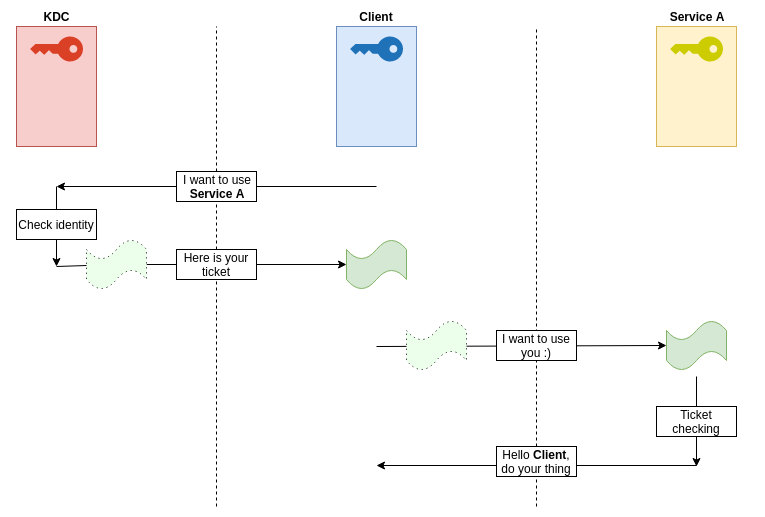

###  Authentication Service (AS)

We are in Active Directory context, so the KDC is also the Domain Controller (DC). The KDC contains all the domain information, including the secrets of each service, machine, user. Thus, except for the DC, everyone only know his own secret, and therefore do not know the secrets of the other objects in Active Directory.

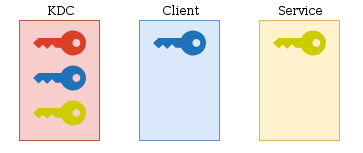

#### KRB_AS_REQ

User `pixis` will first send a request for a **Ticket Granting Ticket** (TGT) to the Domain Controller (DC). How? By sending 
- its name
- a timespan encrypted with a hashed version of its password.

This request is called **KRB_AS_REQ** (_Kerberos Authentication Service Request_).

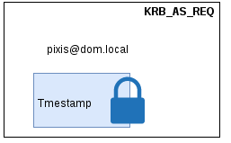

The Key Distribution Center (KDC) will receive this username, and will verify that it exists in its database.

If it finds it, it will then retrieve `pixis` hashed password which it will use to try to decrypt encrypted timestamp. If it can’t, then the client didn’t use the correct password to encrypt this timestamp.

If it does, however, the KDC is assured that it is really `pixis` who is talking to him. It will generate a unique session key tied to this user and limited in time.

#### KRB_AS_REP

The Key Distribution Center (KDC) sends back different things to `pixis` (**KRB_AS_REP**).

- The **session key**, encrypted with `pixis` hashed password;
- The **TGT**, containing various information like:
    
    - Username (pixis)
    - Validity period
    - Generated session key
    - The **Privilege Attribute Certificate** (PAC) which contains a lot of specific information about the user, including his identifier (SID) and all the groups he is member of.
    
    TGT will be encrypted with the KDC key. Thus, **only the KDC is able to decipher and read this ticket’s content**.
    

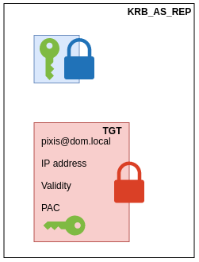

The client receives these pieces of information. Using his hashed password, the first part will be decrypted in order to retrieve the session key that will be necessary for further exchanges.

### Ticket-Granting Service (TGS)

Now the user has his own key as well as a time-limited session key that only he currently knows, and a KDC-encrypted TGT that contains, among other things, this same session key.

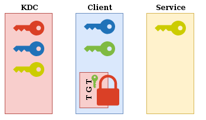

#### KRB_TGS_REQ

When `pixis` wants to use a service, e.g. `CIFS` on `SERVER01`, it will send several pieces of information to the KDC so that the KDC can send back a Service Ticket:

- The TGT;
- The service he wants to use and the associated host, so `CIFS/SERV01` in this example;
- An **authenticator**, which contains his username and current timestamp, all encrypted with the session key.

Now the Key Distribution Center (KDC) will compare TGT and authenticator contents. Since only the KDC can read TGT content, it could not have been tampered with. The KDC will read TGT content, including the TGT’s owner and the associated session key. Then it will decrypt authenticator content with the same session key. If the decryption works, and the data in the authenticator matches the data in the TGT, then pixis is who it claims to be. The KDC is assured that whoever made the request has the TGT and knowledge of the negotiated session key.

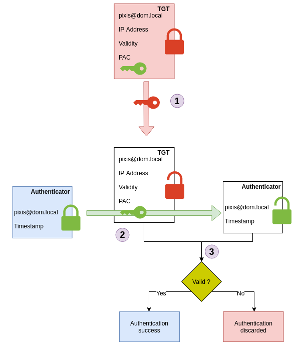

#### KRB_TGS_REP

Now that the KDC has been able to verify that the user is `pixis`, it will respond to  `pixis` with the **KRB_TGS_REP** containing:

- The Ticket Granting Service (TGS)  containing:
	- The name and host of the requested service (`CIFS/SERV01`)
	- An encrypted part (encrypted with the service’s key (i.e. the host key, since CIFS service runs under the host account);) with:
		- user’s username (`pixis`)
		- the PAC,
		- and a new session key which is only valid for communications between `pixis` and `SERVER01` for a certain period of time.  
- A new session key

These two pieces of information (the ticket and the session key) are encrypted with the first session key, the one that was initially exchanged between the KDC and the client.

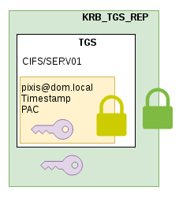

The client will receive this message, and will be able to decrypt the first layer to get the session key created for communication with the service, as well as the Ticket Granting Service (TGS) generated to use this service. 

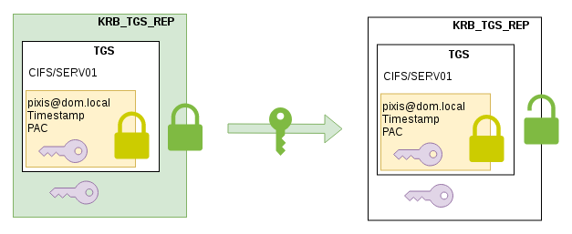

### Application Request (AP)

#### KRB_AP_REQ

Now when the client wants to use the service, he will generate a new authenticator with this new session key.

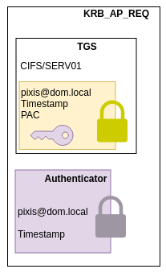

service receives the TGS and can decrypt it with its own secret.

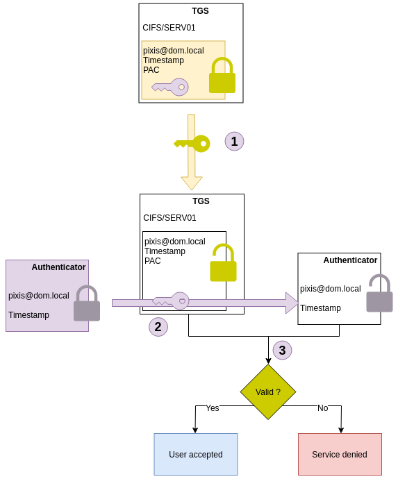

### Summary

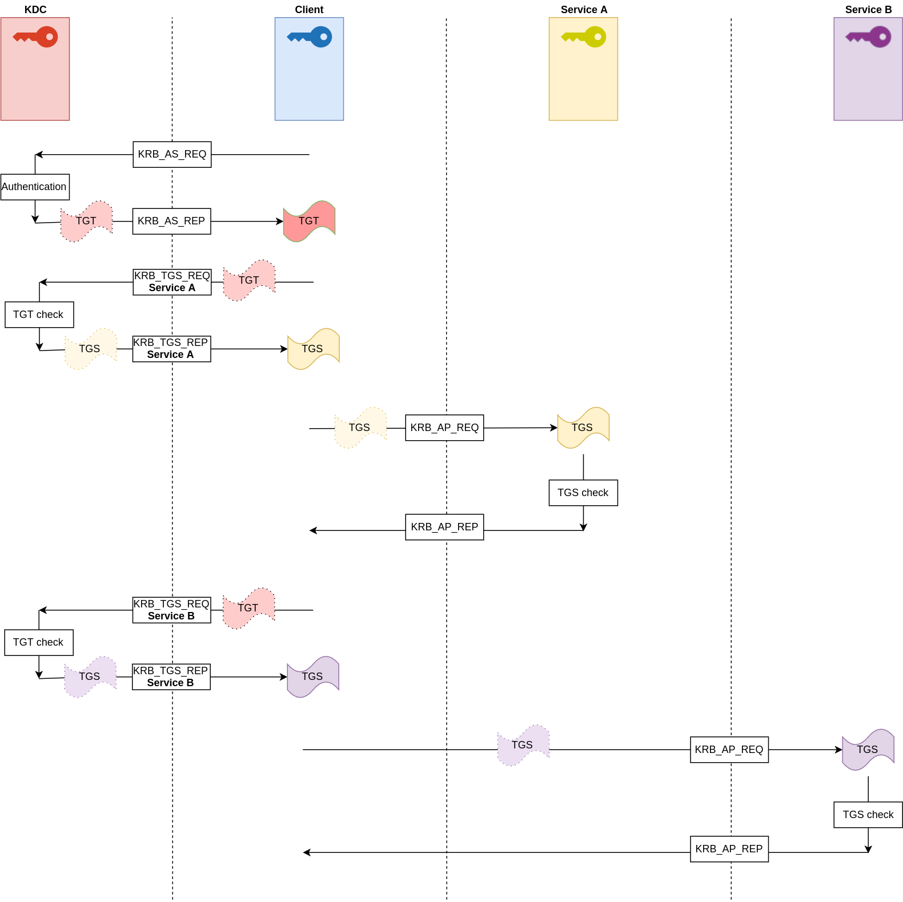